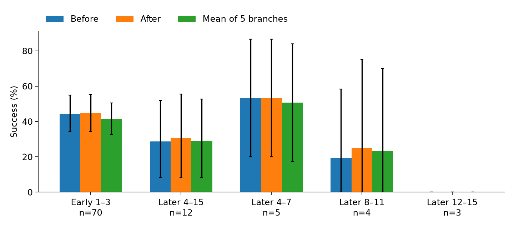
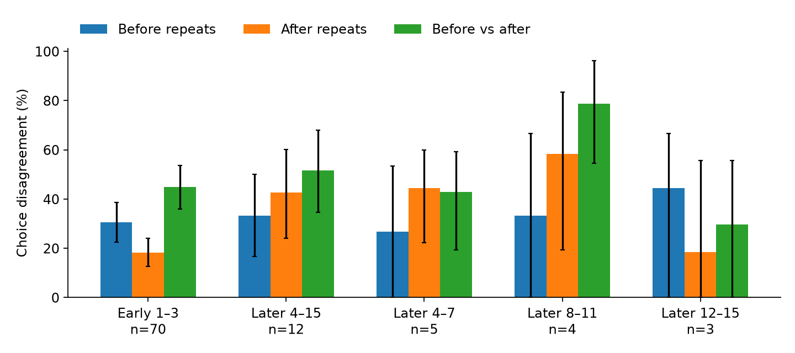

# ARM formulations: before versus after execution

**Outcome-informed selection reaches 37.82%, versus 30.28% for the actor’s first sample, on 120 accepted replayable states. Immediate execution evidence has not established a gain over the before-execution teacher.** No critic was trained; these are conditional continuation results, not benchmark pass@1.

## Does execution improve action selection?

At the **October 8, 16:28 UTC** cutoff, 120 states have all five actions × three SFT continuations: **1,800 outcomes**, including 1,652 valid and 148 invalid outcomes. Invalids remain zero. States passed strict replay checks and are not a random sample of tasks or decision points. The 149-state target is still incomplete. Rates retain the original canonical judge and its previously flagged semantic uncertainties.

### Can observed continuation outcomes improve the root-action choice?

| Root-action choice | States | Continuation success | 95% state-bootstrap interval |
| --- | ---: | ---: | --- |
| Actor’s first sample | 120 | 30.28% | [23.06%, 37.78%] |
| Uniform candidate | 120 | 32.78% | [26.28%, 39.50%] |
| Select on two continuations; score held-out third | 120 | 37.82% | [30.57%, 45.22%] |
| Same-data hindsight action oracle | 120 | 50.00% | [42.50%, 57.50%] |

Leave-one-out selection improves over the actor’s first sample by **+7.54 percentage points [+3.37, +12.15]** and over uniform selection by **+5.04 points [+2.00, +8.25]**. For each state, select using two continuations per action, score the held-out third, and average all three overlapping folds. Ties use their exact uniform expectation without consulting the held-out outcome. Candidate 0 is the first actor sample; uniform selection averages all five entries, including duplicates.

The hindsight oracle chooses and scores the action with the best mean over the **same three outcomes**, so its 50.00% is optimistic. It does not select a successful trajectory from all 15. LOO uses additional continuation outcomes and does not measure a trained selector’s performance.

### Does immediate execution evidence help the teacher?

All rows below use the **same 115 states and 1,725 outcomes**. Four historical invalid teacher panels and one unavailable-after panel are excluded only here; their states remain in the 120-state outcome comparison. Both index-only Luna-high teachers lack continuation outcomes; after-execution additionally sees each candidate’s immediate execution evidence.

| Root-action choice | Matched states | Continuation success | 95% state-bootstrap interval |
| --- | ---: | ---: | --- |
| Actor’s first sample | 115 | 31.01% | [23.77%, 38.55%] |
| Uniform candidate | 115 | 33.62% | [26.78%, 40.58%] |
| Luna before execution | 115 | 35.56% | [27.92%, 43.29%] |
| Luna after immediate execution | 115 | 37.78% | [30.05%, 45.51%] |
| Select on two continuations; score held-out third | 115 | 38.21% | [30.74%, 45.81%] |
| Same-data hindsight action oracle | 115 | 50.72% | [42.90%, 58.55%] |

After minus before is **+2.22 points [-0.39, +5.02]**. LOO minus after is **+0.43 points [-3.09, +4.06]**. Both intervals include zero. Teachers average repeated selections, which do not add rollout data. [Aggregate estimates, intervals and audit hashes](arm_results/rl_integration/continuation-fixed120-20261008.json).

### Where are the states, and how does selection perform by depth?

The groups below are disjoint and include all 120 completed states. These are descriptive strata: replayability, tasks and remaining action budgets differ; the rows do not identify a causal depth effect.

| Candidate decisions | States | Share | Actor first | Uniform | LOO selection | Hindsight oracle |
| --- | ---: | ---: | ---: | ---: | ---: | ---: |
| 1–3 | 74 | 61.7% | 39.19% | 39.91% | 43.60% | 56.76% |
| 4–9 | 25 | 20.8% | 17.33% | 23.73% | 31.16% | 42.67% |
| 10–15 | 21 | 17.5% | 14.29% | 18.41% | 25.40% | 34.92% |

The early 74-state cohort is unchanged. Later states now number **46 of the targeted 75**; all 23 additions since the published 97-state snapshot are later states. The lower aggregate rate reflects the enlarged cohort, not a change to the actor or teacher. Per-stratum intervals are in the aggregate.

Exact decision counts and teacher-matched depth comparisons

| Candidate decision | Complete states | Teacher-matched states |
| --- | ---: | ---: |
| 1 | 33 | 31 |
| 2 | 23 | 22 |
| 3 | 18 | 17 |
| 4 | 7 | 7 |
| 5 | 6 | 6 |
| 6 | 4 | 3 |
| 7 | 4 | 4 |
| 8 | 2 | 2 |
| 9 | 2 | 2 |
| 10 | 4 | 4 |
| 11 | 5 | 5 |
| 12 | 3 | 3 |
| 13 | 1 | 1 |
| 14 | 5 | 5 |
| 15 | 3 | 3 |

| Candidate decisions | Matched states | Actor first | Before teacher | After teacher | LOO selection |
| --- | ---: | ---: | ---: | ---: | ---: |
| 1–3 | 70 | 40.48% | 44.29% | 44.76% | 44.98% |
| 4–9 | 24 | 18.06% | 26.39% | 26.85% | 29.68% |
| 10–15 | 21 | 14.29% | 16.93% | 26.98% | 25.40% |

The matched depth groups total 115 states. Their rates must not be combined with the all-state denominators above.

Repeat controls, oracle-action agreement and ties

| Choice disagreement | Matched states | Rate |
| --- | ---: | ---: |
| Before versus before repeat | 115 | 32.75% |
| After versus after repeat | 115 | 23.09% |
| Before versus after | 115 | 45.99% |

Cross-condition disagreement exceeds the mean within-condition disagreement by +18.07 points [+12.59, +24.07]. More consistent choices do not by themselves establish better success. Separate presentation-order controls are excluded from primary estimates.

| Permuted versus ordinary choice | States | Agreements | Comparisons | Agreement |
| --- | ---: | ---: | ---: | ---: |
| Before execution | 115 | 186 | 345 | 53.91% |
| After execution, repetition 0 | 115 | 202 | 345 | 58.55% |

Each remapped permuted call is compared with the three ordinary calls. There is only one permuted call per state and condition, so these observations mix order sensitivity with teacher randomness; they do not identify a causal order effect.

An oracle-action match credits any candidate tied for the highest observed success across its three continuations. This is a noisy, same-data label; all-equal candidates make agreement automatic.

| Oracle subset | Matched states | Before agreement | After agreement | Actor-first agreement | Uniform agreement |
| --- | ---: | ---: | ---: | ---: | ---: |
| Any tied best action | 115 | 68.12% | 69.37% | 60.00% | 63.65% |
| Unique best action | 35 | 22.86% | 22.22% | 11.43% | 20.00% |

Across all 120 states, **83 have tied hindsight maxima (69.17%)** and **68 distinguish candidate success counts (56.67%)**. LOO training maxima tie in **277 of 360 folds (76.94%)**. Always taking the lowest-index tied action gives 36.67%, versus 37.82% under uniform ties. This is a sensitivity check, not a rule chosen for its held-out score. Among the 52 states with identical candidate success counts, 40 are all-zero, 11 are all-three-success and one has two successes per candidate. Oracle-agreement uncertainty and an independently uniform tie-broken oracle match are retained in the aggregate.

Method, uncertainty, judge limitations and next continuations

Actor: official OpenWebRL SFT, temperature 1.0, top-p 0.95, top-k off, 4,096 response tokens. The 30-action budget includes the replayed prefix. Prefixes are replayed into isolated browsers under strict observable-state checks; hidden server or browser state need not match.

Teacher: unchanged index-only Luna-high; three before judgments per state and three after judgments per execution repetition, plus separate order controls. Judge: unchanged canonical o4-mini/AgentTrek terminal-success protocol. Saved positive examples retain concerns about partial progress, historical versus current facts, absence claims and whether filters were applied. Canonical labels are preserved; these rates do not establish strict independently verified task completion.

Every state contributes equally. Ten thousand bootstrap draws resample whole states, retaining all candidates, repetitions and overlapping folds. Main tables use the LOO aggregation seed; the separate repeat-control aggregation uses its original seed. Intervals are exploratory and not adjusted for multiple comparisons. Outcome artifacts and teacher receipts were hash-checked; independent exact LOO and fixed-first calculations agree. Task-level artifacts remain private.

The approved next stage adds two fresh continuations for each of the same five actions **after all 149 primary states are audited**. Its primary test selects using the original three and evaluates using the fresh two; five-fold LOO is secondary. Original outcomes, anchors and candidate identities remain fixed. The remaining fixed candidate pool may not fill all depth quotas; no relaxed replay criterion or extra draw is included in this snapshot. [Collection protocol and history](ARM_INTEGRATION_PLAN.md#arm-continuation-finish100-20261007).

Earlier snapshots and historical plots

These overlapping cohorts are history, not independent replications. Each row uses its own teacher-matched cohort.

| Completed states | Matched states | Actor first | Before teacher | After teacher | LOO selection | Hindsight oracle |
| --- | ---: | ---: | ---: | ---: | ---: | ---: |
| 86 | 82 | 38.21% | 42.01% | 42.68% | 43.39% | 55.69% |
| 88 | 84 | 37.70% | 41.40% | 42.06% | 42.69% | 55.16% |
| 97 | 93 | 36.56% | 41.58% | 42.05% | 42.47% | 55.20% |

The [97-state aggregate](arm_results/rl_integration/continuation-fixed97-20261008.json) is retained unchanged. Historical values and source hashes are also indexed in the [120-state aggregate](arm_results/rl_integration/continuation-fixed120-20261008.json). Plots below describe the older 86-completed/82-matched snapshot; a zero-width interval in a tiny all-failure group is not population certainty.

[Historical depth and coverage aggregate](arm_results/rl_integration/continuation-depth-balanced-partial-20261007/aggregate.json) · [Early-state diversity](arm_results/rl_integration/continuation-state-diversity-20261007/aggregate.json).

## Does execution change a saved-action progress judgment?

This separate diagnostic presents the same saved Piotr action to Luna-high before and after execution. The teacher returns progress probabilities, evidence and a rationale, rather than selecting among five actions.

| Comparison | Examples | Changed labels | Change rate |
| --- | ---: | ---: | ---: |
| Before → after, full set | 200 | 32 | 16% |
| Before → after, repeat subset | 100 | 18 | 18% |
| Before → before repeat | 100 | 13 | 13% |
| After → after repeat | 100 | 7 | 7% |

On the repeat subset, change exceeds before-repeat noise by 5 points [−3, +14]. Changed labels do not establish better accuracy, and only the executed action has evidence. [Diagnostic details](ARM_RESULTS.md#arm-teacher-evidence-primary200-20261006).

## Does random selection explain full-episode gains?

The root-state uniform control above randomizes one action and then continues with SFT. A separate full-episode control samples five candidates and picks uniformly at **every step**, under the same actor, decoding, browser, step cap and judge as its paired controls.

| Full-episode policy | Successes | Tasks | Task success |
| --- | ---: | ---: | ---: |
| SFT alone | 99 | 300 | 33.00% |
| Random of five | 100 | 300 | 33.33% |
| Piotr SelectionARM | 120 | 300 | 40.00% |

Random minus SFT is +0.33 points [−4.67, +5.67]; Piotr minus random is +6.67 points [+1.00, +12.33]. This supports useful learned selection in that run; random/SFT equivalence is not established. [Full-episode comparison](ARM_INFERENCE_SCALING.md#random5-sameday-results-20261007).
