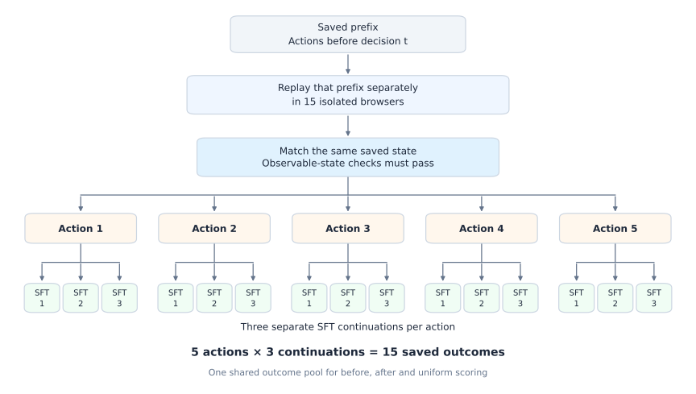

# ARM branching: action quality, execution evidence and selector training

**Continuation outcomes contain useful action-selection signal; the value of immediate post-action evidence is still unresolved.** The studies below address different parts of that question. Their principal controlled results are:

| Question | Matched states | Paired difference, percentage points | 95% interval | Takeaway |
| --- | ---: | ---: | --- | --- |
| Does Luna select better after seeing immediate execution evidence? | 119 | +2.24, after − before | [−0.28, +4.95] | No clear advantage yet; historical invalid-as-zero score |
| Can old continuation outcomes select better than uniform on fresh outcomes? | 58 | +8.51, select on three − uniform | [+3.45, +14.37] | Evidence of outcome signal; gains over actor-first and Luna remain uncertain |
| Does selecting with 24 continuations beat selecting with eight? | 14 | +3.52, select with 24 − select with eight | [−0.12, +7.35] | Inconclusive on the same fresh, valid-only holdout |

The first interval resamples states; the others resample task groups. All are exploratory, pointwise intervals. **No selector has yet been trained from these branching outcomes or matched post-action labels.** The [actor-feature heads](#selection-head-20261009) were trained separately on existing teacher choices: they have lower Luna agreement than Piotr ARM, while continuation-success differences remain uncertain.

## Two data families, each with a continuation extension

An extension adds **continuations after the same five fixed candidate actions**, not additional action proposals. The historical family and the new pilot are separate collections; their extensions are not independent replications.

| Family | Initial states | Initial draws per action | Added draws per action | States with all added draws | Primary outcome rule |
| --- | ---: | ---: | ---: | ---: | --- |
| [Historical 124 + extra two](#arm-continuation-branches-results-20261007) | 124 | 3 | 2 | 58 | Committed invalid outcomes count as zero |
| [New pilot 32 + extra 24](#branch-selector-scaleup-20261008) | 32 | 8 | 24 | 18 | Invalid outcomes excluded; valid-only success |

The historical target was 149 states; 124 were collected and frozen. The new pilot collected its full 32-state target from the released WebVoyager-source **training pool**, not the WebVoyager evaluation benchmark. It introduced multiple prespecified states per task and train/seen-task/unseen-task roles. The extra24 analysis qualifies only 14 of its 18 complete grids because every candidate needs valid selection and held-out observations.

**Group these records by lineage; do not pool their success rates.** Cohort, task mix, collection time, holdout draws and invalid-outcome policy differ. In particular, the pilot's 48.50% and extra24's 53.32% are not a controlled improvement. The matched eight-versus-24 comparison is 49.80% versus 53.32% on the same 14 states. Both extensions ended partially; no further collection is active.

[Historical teacher comparison](#arm-continuation-branches-results-20261007) · [Fresh extra-two test](#branch-extra2-heldout58-20261008) · [Extra24 common-holdout test](#branch-extra24-20261008) · [Teacher-trained heads](#selection-head-20261009) · [Remaining experiments](#branch-post-to-pre-study-20261008)

## What is measured

A **state** is the task, screenshot and action history before the candidate action. A **candidate** is one of five fixed actor responses; duplicate actions remain in the panel. A **continuation/draw** executes that candidate in a separately replayed browser and then follows the frozen SFT actor to a terminal outcome. Only the root-action choice differs between selection rules; these are conditional continuation rates, not full-benchmark pass@1 or episode pass@k.

| Selection rule | Information used to choose the root action | Interpretation |
| --- | --- | --- |
| Actor first / uniform | First candidate / random index among all five | Baselines scored on the same saved outcomes |
| Before / after critic | State and candidates / additionally immediate execution evidence | Direct test of the value of post-action evidence; neither sees future returns |
| Outcome-selected reference | Separate continuation outcomes for each candidate | Privileged offline reference, evaluated on held-out draws; not a trained critic |
| Same-data hindsight maximum | The same outcomes used for selection and scoring | Optimistically biased diagnostic, not a true upper bound |

“Select on *m*, score on *h*” counts draws **per candidate action**. Exact uniform averaging handles tied winners without looking at the holdout. In the valid-only family these are draw slots: invalid observations reduce the usable denominator. Score each candidate's valid held-out mean, then weight states equally. Native valid unjudged action-limit zeros stay failures; missing/replay-rejected records stay missing. Saved judge labels can credit partial or misinterpreted success, so artifact verification does not establish semantic correctness.

Original three-draw diagram and shared actor/judge protocol

The diagram depicts the historical five-by-three design. The new pilot uses eight draws per action; its extension targets 32 in total. Before, after and uniform choices reuse the same outcomes within each comparison. Uniform requires no separate rollout set. [PNG](arm_results/rl_integration/branching-experiment-design.png).

All families use official OpenWebRL SFT with temperature 1.0, top-p 0.95, top-k off and 4,096 response tokens, and canonical o4-mini/AgentTrek terminal-success labels. The 30-action budget includes the prefix. Strict observable-state replay checks are preserved; they do not guarantee identical hidden state or eliminate website drift. The new pilot requires forty ready contexts; its candidate intervention retains the complete sampled reasoning/action response in the continuation history.

## Historical family: 124 states, three draws, then two fresh draws

### Does immediate execution evidence help the critic?

Both index-only Luna-high conditions choose among the same candidates without seeing continuation returns. After-execution additionally sees each candidate's immediate execution evidence. The paired comparison uses **119 states and 1,785 outcomes**; four invalid teacher panels and one unavailable-after panel are excluded only here. Their states remain in the 124-state outcome analyses. Committed invalid outcomes count as zero.

| Critic input | Matched states | Continuation success | 95% state-bootstrap interval |
| --- | ---: | ---: | --- |
| Before execution | 119 | 35.11% | [27.73%, 42.67%] |
| After immediate execution | 119 | 37.35% | [29.88%, 45.10%] |

The paired after-minus-before interval in the overview includes zero. Repeated teacher choices average over the same saved outcomes; they add no rollout data. Repeat consistency and label changes are diagnostics, not evidence of better action success. [Original aggregate and paired audit](arm_results/rl_integration/continuation-fixed124-20261008.json).

### Does selection from old outcomes improve fresh continuations?

**The extra-two pass is audited partial:** 58 of 124 states passed strict replay, adding 580 outcomes. All 1,860 original records are unchanged, giving **2,440 saved outcome records**. The remaining 66 states failed reconstruction; their 660 missing continuations are not counted as zero. The approved 3,100-record target and original 149-state target remain incomplete.

Each row below uses the **same 58 states from 58 task groups, with 580 fresh records and two draws per candidate**. The outcome-based choice uses only the three original draws. Tied best actions receive their exact uniform expected score. Luna’s score averages the fresh outcomes of its three saved before-execution choices; no new teacher calls were made. Committed invalid outcomes count as zero.

| Root-action choice | States | Continuation success | 95% task-bootstrap interval |
| --- | ---: | ---: | --- |
| Actor’s first candidate | 58 | 26.72% | [17.24%, 37.07%] |
| Uniform over five candidates | 58 | 26.03% | [17.76%, 34.83%] |
| Saved Luna before execution | 58 | 31.03% | [20.11%, 42.24%] |
| Select on original three; score fresh two | 58 | 34.54% | [23.97%, 45.23%] |

The outcome-based choice gains **+8.51 percentage points over uniform [3.45, 14.37]**. Its gains over actor-first, **+7.82 points [−0.26, 16.84]**, and Luna, **+3.51 points [−2.84, 10.80]**, remain unresolved. These exploratory, pointwise intervals support a useful continuation-outcome signal; they do not establish a trained selector’s performance or superiority to teacher-label training. [Aggregate estimates and audit hashes](arm_results/rl_integration/continuation-extra2-heldout58-20261008.json).

**Replay selection materially changes the cohort.** Using only original draws, actor-first scored 17.82% on these 58 states versus 40.40% on the 66 that later failed reconstruction. Consequently, comparing fresh 34.54% directly with the earlier 124-state LOO result of 38.12% would confound cohort composition, draw count and collection time. The accepted states span candidate decisions 1–3/4–9/10–15 with 36/11/11 states respectively. Frozen observable-state checks do not guarantee identical hidden state or eliminate website drift.

Five-draw sensitivity, ties, uncertainty and judge limitations

These secondary rows pool old and fresh draws on the same 58 states, yielding 1,450 outcome records. Five-fold LOO selects with four draws and scores the fifth, averaging all overlapping folds. It mixes collection times; the temporally separated old-three/fresh-two comparison above remains primary.

| Root-action choice | States | Pooled continuation success | 95% task-bootstrap interval |
| --- | ---: | ---: | --- |
| Actor’s first candidate | 58 | 21.38% | [13.10%, 30.35%] |
| Uniform candidate | 58 | 24.97% | [16.76%, 33.66%] |
| Select on four; score held-out fifth | 58 | 33.95% | [23.94%, 44.16%] |
| Same-data five-draw hindsight oracle | 58 | 41.38% | [31.03%, 51.72%] |

The hindsight row chooses and scores on the same outcomes and is optimistic. Original-three selection ties at the top in 39/58 states; 29/58 give every candidate equal success counts, including 25 all-zero panels. Five-draw hindsight still ties in 35/58 states. Five-fold training maxima tie in 187/290 folds. Ties and duplicate candidates are retained.

Every state has equal weight. Ten thousand bootstrap draws, seed 20261007, resample whole task groups with all their states and normalize by sampled state count. The 58 groups each contain one state here. Intervals are pointwise, exploratory and unadjusted for multiple comparisons. Exact tie expectations avoid choosing winners from held-out outcomes. Valid-only sensitivity, with its own weighted denominators, is included in the aggregate.

The official SFT actor and decoding remain temperature 1.0, top-p 0.95, top-k off and 4,096 response tokens, with the original 30-action budget including replayed prefixes. Canonical o4-mini/AgentTrek labels remain unchanged. Of the 580 fresh records, 523 are valid and 57 invalid; 303 received a judge call and 220 valid records retain native unjudged zero outcomes. Qualitative checks found positives that conflate website statistics or accept a different language edition. These scores measure the frozen judge’s operational reward, not independently established factual or instruction-complete success. Source and identity checks support seed assignment; an independently echoed request seed was unavailable.

Partial collection, reconstruction failures and final accounting

| Coverage | States | Saved outcome records |
| --- | ---: | ---: |
| Full five draws per action | 58 | 1,450 |
| Original three only | 66 | 990 |
| Preserved combined data | 124 | 2,440 |
| Approved combined target | 124 | 3,100 |

All 124 states were processed once under the frozen reconstruction rule. The first failures on 66 rejected states were 58 visible-snapshot mismatches, five raster mismatches, one page mismatch, one prefix-capture timeout and one initial-navigation timeout. Their 147 unreleased attempt receipts and 513 untouched queue slots remain evidence of missing continuations. They are not added to the outcome dataset. One historical post-commit release-read invalid remains among the original records as previously audited; no candidate execution is invented.

The sole extra-two allocation consumed 14,238 of 28,800 approved seconds on four H200s / 32 CPUs / 480 GiB; 14,562 seconds remain unused and are not transferred. All 727 attempts are charged. Extra-two used 727 browser starts, 6,788 SFT calls and 303 judge calls / $2.406679, with no teacher calls. Combined with prior charges, the shared ledger contains 6,923/9,000 browser starts, 40,512/110,000 SFT calls, 1,438/6,600 judge calls / $11.5469541 of $25, and 1,698/2,200 Luna calls / $6.5299025 of $15.

Scheduler and W&B finished. Independent audits reconciled artifacts, all-attempt accounting, the original-record hashes and controller-owned actor/browser teardown. Post-allocation SSH was unavailable, so teardown does not claim an independent physical node scan. The pass is closed as audited partial, with full-target completion false. The frozen rule forbids replacement or outcome-based replay after reconstruction rejection; no automatic rerun or relaxed replay was used. The separately approved 32-state pilot remains a separate experiment and budget.

Original three-draw reference, depth, repeat controls and judge limitations

All 2,090 fixed candidate tasks were considered under the frozen replay checks and depth quotas, yielding 124 of the 149 target states: 1,860 outcomes, with 1,710 valid and 150 invalid. The original 149-state target remains incomplete. These estimates use only the original draws, before the extra-two pass.

### Original 124-state outcome comparison

| Root-action choice | States | Continuation success | 95% state-bootstrap interval |
| --- | ---: | ---: | --- |
| Actor’s first sample | 124 | 29.84% | [22.85%, 37.10%] |
| Uniform candidate | 124 | 32.42% | [26.13%, 38.98%] |
| Select on two continuations; score held-out third | 124 | 38.12% | [31.06%, 45.31%] |
| Same-data hindsight action oracle | 124 | 50.00% | [42.47%, 57.53%] |

Leave-one-out selection improves over the actor’s first sample by **+8.28 percentage points [+3.84, +12.99]** and over uniform selection by **+5.70 points [+2.60, +9.03]**. For each state, select using two continuations per action, score the held-out third, and average all three overlapping folds. Ties use their exact uniform expectation without consulting the held-out outcome. Candidate 0 is the first actor sample; uniform selection averages all five entries, including duplicates.

The hindsight oracle chooses and scores using the **same three outcomes**, making its 50.00% optimistic. It does not select a successful trajectory from all 15. LOO uses additional continuation outcomes and does not measure a trained selector’s performance.

### Where are the states, and how does selection perform by depth?

The groups below are disjoint. These are descriptive strata: tasks, replayability and remaining action budgets differ, so these rows do not identify a causal depth effect.

| Candidate decisions | States | Share | Actor first | Uniform | LOO selection | Hindsight oracle |
| --- | ---: | ---: | ---: | ---: | ---: | ---: |
| 1–3 | 74 | 59.7% | 39.19% | 39.91% | 43.60% | 56.76% |
| 4–9 | 27 | 21.8% | 16.05% | 22.96% | 32.55% | 43.21% |
| 10–15 | 23 | 18.5% | 15.94% | 19.42% | 27.05% | 36.23% |

The early 74-state cohort is unchanged; **50 of the targeted 75 later states** were collected. Adding later states changes cohort composition, not the actor or teacher. Per-stratum intervals are in the aggregate.

### Exact decision counts and teacher-matched depth comparisons

| Candidate decision | Complete states | Teacher-matched states |
| --- | ---: | ---: |
| 1 | 33 | 31 |
| 2 | 23 | 22 |
| 3 | 18 | 17 |
| 4 | 7 | 7 |
| 5 | 6 | 6 |
| 6 | 6 | 5 |
| 7 | 4 | 4 |
| 8 | 2 | 2 |
| 9 | 2 | 2 |
| 10 | 4 | 4 |
| 11 | 6 | 6 |
| 12 | 3 | 3 |
| 13 | 1 | 1 |
| 14 | 5 | 5 |
| 15 | 4 | 4 |

| Candidate decisions | Matched states | Actor first | Before teacher | After teacher | LOO selection |
| --- | ---: | ---: | ---: | ---: | ---: |
| 1–3 | 70 | 40.48% | 44.29% | 44.76% | 44.98% |
| 4–9 | 26 | 16.67% | 24.36% | 25.64% | 31.24% |
| 10–15 | 23 | 15.94% | 19.32% | 28.02% | 27.05% |

Matched groups total 119 states and use different denominators from the all-state rows above.

### Repeat controls, oracle-action agreement and ties

| Choice disagreement | Matched states | Rate |
| --- | ---: | ---: |
| Before versus before repeat | 119 | 32.77% |
| After versus after repeat | 119 | 24.28% |
| Before versus after | 119 | 46.62% |

Cross-condition disagreement exceeds mean within-condition disagreement by +18.10 points [+12.53, +23.93]. More consistent choices do not by themselves establish better success. Presentation-order controls are separate from primary estimates and mix order sensitivity with teacher stochasticity; they do not identify a causal order effect.

Oracle-action agreement credits any candidate tied for the highest observed success across three continuations. This is a noisy same-data label; all-equal candidates make agreement automatic.

| Oracle subset | Matched states | Before agreement | After agreement | Actor-first agreement | Uniform agreement |
| --- | ---: | ---: | ---: | ---: | ---: |
| Any tied best action | 119 | 68.07% | 69.37% | 59.66% | 63.70% |
| Unique best action | 36 | 22.22% | 21.91% | 11.11% | 20.00% |

Across 124 states, **86 have tied hindsight maxima (69.35%)** and **70 distinguish candidate success counts (56.45%)**. LOO training maxima tie in **286 of 372 folds (76.88%)**. Always choosing the lowest-index tied action gives 36.83%, versus 38.12% for uniform ties; this is a sensitivity calculation, not an independently validated selection rule. Agreement uncertainty and independent uniform tie-breaking are retained in the aggregate.

### Method, uncertainty, judge limitations and next continuations

Actor: official OpenWebRL SFT, temperature 1.0, top-p 0.95, top-k off, 4,096 response tokens. The 30-action budget includes the replayed prefix. Isolated browsers must pass strict observable-state replay checks; hidden state need not match. The accepted cohort is not a random sample of tasks or decision points.

Teacher: unchanged index-only Luna-high, three before judgments and three after judgments per execution repetition, plus separate order controls. Judge: unchanged canonical o4-mini/AgentTrek terminal-success protocol. Saved positive examples retain partial-progress, temporal-grounding, absence-claim and filter-application concerns. Additional examples accept goal reinterpretation and conflate page/article or registered-user/active-editor metrics. Native labels remain unchanged; these rates do not establish strict independently verified task completion.

Every state contributes equally. Ten thousand bootstrap draws resample whole states, retaining candidates, repetitions and overlapping folds. Main tables use the LOO aggregation seed; repeat controls use their original seed. Intervals are exploratory and not adjusted for multiple comparisons. Saved outcome/teacher fingerprints and independent exact LOO calculations agree. Task-level artifacts remain private.

The cohort amendment froze these 124 states and all 1,860 original outcomes. The extra-two pass subsequently preserved these records and added 580 outcomes on 58 states; its full 1,240-new-outcome target remains incomplete. No candidates or teachers were regenerated. The original 149-state target remains unmet. The candidate pool was exhausted without relaxing quotas, replay checks or scientific settings. [Collection protocol and history](ARM_INTEGRATION_PLAN.md#arm-continuation-finish100-20261007).

## New family: 32-state pilot and extra24 continuation extension

**The initial eight-draw pilot is verified complete; the extension is audited partial.** Both use the same 32 states, 29 task groups and five fixed candidates per state. The pilot saved 1,280 records: 1,008 valid and 272 invalid. Its valid set retains 224 native unjudged action-limit zeros. Existing records and candidates were preserved when adding draws 8–31.

| Coverage dimension | Category | Accepted states |
| --- | --- | ---: |
| Prespecified role | Train | 23 |
| Prespecified role | Seen-task validation | 4 |
| Prespecified role | Unseen-task validation | 5 |
| Candidate decision | 1–3 | 27 |
| Candidate decision | 4–9 | 2 |
| Candidate decision | 10–15 | 3 |

Replayable early decisions dominate. Both reported pilot analyses pool the prespecified roles as collection diagnostics; neither is a trained-selector validation score.

### Do more selection continuations improve the action choice?

**Extra-24 collection ended partially; more selection draws have not yet established a reliable gain.** On the same 14 eligible states from 11 task groups, selecting with 24 draws scores **53.32%** on fresh draws 24–31, versus **49.80%** when selecting with eight. The paired difference is **+3.52 percentage points, 95% task-bootstrap interval [−0.12, +7.35]**. The interval includes zero. This is a descriptive outcome-selection diagnostic combining the pilot's prespecified roles, not a learned selector validation score or evidence that a post-action critic helps.

| Policy on the same fresh held-out panel | States | Task groups | Valid-only held-out success |
| --- | ---: | ---: | ---: |
| Actor's first candidate | 14 | 11 | 45.66% |
| Uniform over all five candidates | 14 | 11 | 47.95% |
| Select using draws 0–7 | 14 | 11 | 49.80% |
| Select using draws 0–23 | 14 | 11 | 53.32% |

Twenty-four-draw selection minus actor-first is +7.65 pp [−5.65, +16.07]; minus uniform it is +5.37 pp [−2.12, +11.30]. Both intervals include zero. The matched pre/post critic comparison on this new cohort, and training from its branch outcomes, remain unperformed. [Aggregate, split-specific results and evidence hashes](arm_results/rl_integration/branch-extra24-partial-20261009.json).

The run saved **2,200 of 3,840 requested extra records**, preserving all **1,280 original records**: 3,480 of 5,120 combined. All 96 scheduled blocks resolved: 55 released and 41 failed strict replay. Eighteen states have complete 160-record grids; four of those lack a usable valid-only five-candidate panel, leaving 14 eligible states. The other 14 admitted states lack a complete extra-draw grid. Missing and rejected measurements remain missing; the full study stays **incomplete**. No proposals were regenerated, no retry replaced a rejected draw, and no budget cap was exhausted.

Coverage, split isolation and uncertainty

For each candidate, fit its success fraction using native-valid observations from draws 0–7 or 0–23; evaluate both choices only on draws 24–31. Require every original candidate to have a positive valid fitting and held-out denominator, retain duplicate candidate indices, and use exact uniform weights over tied maxima. Average valid held-out rates within candidates, then states equally; these percentages are not pooled episode fractions. Fitting ties occur in five of 14 states with eight draws and six of 14 with 24 draws. Native invalids are excluded; valid failures, including unjudged action-limit zeros, remain failures.

| Panel on the common 14 states | Observed draws | Valid draws | Excluded invalid draws |
| --- | ---: | ---: | ---: |
| Fit, draws 0–7 | 560 | 483 | 77 |
| Fit, draws 0–23 | 1,680 | 1,452 | 228 |
| Holdout, draws 24–31 | 560 | 480 | 80 |

| Prespecified role | States | Task groups | Actor first | Uniform | Select with eight | Select with 24 |
| --- | ---: | ---: | ---: | ---: | ---: | ---: |
| Train | 10 | 10 | 47.68% | 48.19% | 45.96% | 49.64% |
| Seen-task validation | 2 | 2 | 62.50% | 67.50% | 87.50% | 81.25% |
| Unseen-task validation | 2 | 1 | 18.75% | 27.20% | 31.25% | 43.75% |

Ten thousand paired whole-task bootstrap resamples, seed 20261008, keep each task's states together and normalize by sampled state count. Intervals are pointwise percentile intervals with linear interpolation, condition on the observed fitting panels and tie weights, and are unadjusted for multiple comparisons. Two seen-task clusters are insufficient for stable inference; the unseen split has only one task cluster, so no interval is reported. These tiny validation subsets cannot establish generalization. Replayability, unequal valid denominators, later website/judge drift and native judge errors further limit interpretation. A same-data maximum across 32 draws is optimistic and is not a true upper bound.

Partial endpoint audit and all-attempt accounting

All 3,480 committed small outcome records are bound by hashes to preserved parent or extra records; the 2,200 extra records also retain their audited ready/release identities. Native trajectory, judge and image checks reuse prior bounded reviews; this partial analysis does not claim a new exhaustive payload audit. The 392 finished reconstruction attempts without released outcomes remain charged and excluded from outcome denominators. Owned process/browser teardown passed. Slurm ended with exit 0; W&B intentionally records a failed run because the full collection target was unmet, and its remote final counts/costs reconcile. A stale final W&B browser sample is one; the authoritative final ledger and teardown show zero active browsers.

| Resource, including all attempts | Consumed | Approved cap |
| --- | ---: | ---: |
| Allocation seconds, four H200s / 32 CPUs / 480 GiB | 19,371 | 57,600 |
| Browser attempts | 2,592 | 5,000 |
| Local SFT call attempts | 16,607 | 240,000 |
| Canonical judge HTTP attempts | 1,287 | 8,000 |
| Judge charge, USD | 9.7330376 | 75 |
| Teacher calls | 0 | 0 |

The 38,229 unused allocation seconds remain separate from the pilot and historical extra-two budgets. All scheduled blocks have been processed under the approved no-retry rule; remaining budget does not justify relaxing replay checks or replacing outcomes. No additional collection is active.

Earlier eight-draw pilot: 6/2 selection, split coverage and verified accounting

Select using draws 0–5 and score valid observations from draws 6–7. Use the same unchanged five-candidate panel for every method: all candidates must have at least one valid fitting draw and one valid held-out draw. This leaves 25 states from 22 task groups and excludes seven states: five train and two unseen-task validation states. The common panel contains 18 train, four seen-task validation and three unseen-task validation states, with 721 valid fitting draws out of 750 and 241 valid held-out draws out of 250. Average valid held-out success within each candidate, then average states equally. Selection ties occur in 13 of these 25 states and receive exact uniform averaging without consulting held-out outcomes. These state-averaged rates are not pooled episode success fractions.

| Method on the same held-out panel | States | Task groups | Held-out success |
| --- | ---: | ---: | ---: |
| Actor's first candidate | 25 | 22 | 40.00% |
| Uniform over five entries | 25 | 22 | 41.20% |
| Select by six-draw valid success rate | 25 | 22 | 48.50% |

Selection minus actor-first is +8.50 pp [−2.72, +20.14]. Selection minus uniform is +7.30 pp, 95% task-bootstrap interval [+0.24, +15.17]. Intervals are exploratory, use 10,000 whole-task resamples and preserve paired states/candidates. This pools the pilot's prespecified roles for collection diagnostics; it is not a learned selector validation score. Native invalid records remain saved and charged but excluded from these rates. Valid-only performance is conditional on measurement availability, which can differ by action. The historical invalid-as-zero results above estimate a different quantity.

All 1,280 record identities, fixed candidate responses, strict replay releases, immediate post-action images, saved continuation and native judge bindings passed independent artifact checks. Prior completed payload audits were reused only after fingerprint verification. Native judge labels are preserved; integrity checks do not independently establish semantic correctness. The pilot used 27,263 of 43,200 approved allocation seconds, 3,360 of 5,000 browser attempts, 14,439 of 100,000 local SFT calls and 784 of 2,000 judge HTTP attempts, with a conservative judge-budget charge of $6.2050626 against $25. Discovery, failed reconstruction and every other attempt remain accounted for; no teacher calls or additional budget were used.

## Selectors trained on existing teacher labels: evaluation on the historical 124 states

**The frozen-actor heads agree less with Luna than Piotr SelectionARM, but continuation success does not clearly separate them.** These heads were trained on GPT-5.5 choices from Piotr's release, not on branching returns or post-action labels. They reuse the original 124-state, three-draw outcomes for evaluation; this is a model comparison on the historical family, not another branching collection. Invalid outcomes count as zero.

| Selector, 124 branch states | Luna agreement | − Piotr, pp [95%] | Continuation success | − Piotr, pp [95%] |
| --- | ---: | --- | ---: | --- |
| Piotr SelectionARM | 73.2% | — | 35.75% | — |
| Head on frozen actor features, one candidate at a time | 61.7% | −11.5 [−18.5, −4.6] | 34.68% | −1.08 [−4.30, +2.15] |
| Uniform candidate | 46.9% | — | 32.42% | — |

A nine-configuration sweep found no frozen layer or pooling that closes the gap, and a top-layer scoring adapter is training. Method, all three evaluations, the sweep and accounting are in [ARM_SELECTION_HEAD.md](ARM_SELECTION_HEAD.md). The outcome-selected and hindsight references for this cohort are in the [original-three-draw details](#branch-original-three-details).

## What remains to establish post-action value and train a pre-action critic

The old Luna comparison has not established a post-action advantage. The new family supplies saved immediate next screenshots and continuation targets, but its zero-teacher-call budget included no new critic judgments. Training the actor-feature heads on existing labels does not answer whether next-screenshot labels improve a pre-action student.

| Question | Matched comparison | Evidence required |
| --- | --- | --- |
| Does immediate execution evidence help? | Same frozen critic and repeated index-only selection protocol, with versus without each candidate’s immediate next screenshot | Paired selected-action success on held-out continuations; task-bootstrap interval and valid-panel coverage |
| Can it train a better pre-action critic? | Identical pre-action students, training states and optimization budgets; targets from pre-action versus post-action teacher choices | Improvement on distinct seen-task states and unseen tasks, using only pre-action inputs at inference |
| How informative are the continuation outcomes themselves? | Separately labeled continuation-return-supervised selector/reference | Held-out outcomes that never enter its selection or training targets |

The needed sequence is a matched pre/post labeling comparison, then matched student fits, with an independent continuation holdout and task splits preserved. More continuations can improve a return estimate; they do not substitute for testing the post-action critic itself. New critic calls, branch-supervised training and larger collection require their own exact resource approvals.

Planned controls, task splits and larger collection proposal — not an active run

The post-action input must be the screenshot immediately after the fixed candidate action, bound to its execution receipt. A terminal screenshot or later suffix cannot substitute. Prespecify the evidence draw independently of outcomes; do not choose the successful or clearest-looking transition. Teachers receive no continuation returns or future screenshots. Repeated teacher choices can supply matched target distributions for distillation; both students use the same loss and see only the original state and candidates. Keep teacher labels and continuation-derived targets distinct. Missing evidence excludes a paired comparison, with coverage reported, while other valid targets remain usable.

| Dataset role | Total target states | Retained existing states | New state target | New continuation target |
| --- | ---: | ---: | ---: | ---: |
| Training | 1,000 | 124 | 876 | 35,040 |
| Seen-task validation | 250 | 0 | 250 | 10,000 |
| Unseen-task validation | 250 | 0 | 250 | 10,000 |

New states use five candidates × eight draws. Existing 124 states remain training eligible with their actual observations: 2,440 audited records, comprising five draws per action on 58 states and three on 66 states. Thus the full aspirational design requires 55,040 new outcomes and 57,480 combined outcomes; it does not require topping up historical states to eight draws. This larger collection and branch-supervised fitting remain unapproved; the separate teacher-trained head experiment above is already complete.

Task and state assignments are fixed before new outcomes. All candidates, draws and retries from one state stay together. Seen-task validation requires independently seeded discovery trajectories, distinct pre-action task/screenshot/history inputs, and an accepted training state from the same task. A different candidate panel alone does not create a new state. Previously collected task groups cannot enter unseen-task validation or test, but genuinely new states from those tasks may enter seen-task validation. Additional task groups remain locked for final testing. “Unseen” means unseen by this selector fit, not proven absent from backbone pretraining.

Fit a fresh adapter on released SelectionARM to each candidate’s success fraction using its **valid draw count**, retaining ties and all-equal panels. The proposed loss is independent sigmoid/binomial BCE over five candidate-index logits; serving still returns one index. Inputs contain only pre-action information and the candidate panel. **User amendment, October 8: skip invalid continuation measurements in targets and future success-rate denominators.** Keep valid unsuccessful outcomes, including native unjudged action-limit zeros. A candidate with no valid draws has no target and is masked from the loss. Preserve raw invalid records, reasons and costs without rerunning them. Missing records are unresolved, not invented failures. This is outcome adaptation of a teacher-pretrained model.

Evaluate selected-action continuation success separately on both validation sets against actor-first, uniform and the frozen selector. A rollout-based reference selects on the valid observations within six new draws and scores valid observations from the other two. Paired five-candidate reference comparisons require at least one valid selection draw and one valid held-out draw per candidate, on the same states for every method; report excluded states and per-candidate coverage. Do not renormalize the candidate set using held-out validity. Valid-only rates condition on measurement availability and can have unequal draw counts; the historical operational results above retain their original invalid-as-zero definition. Bootstrap whole task groups. Keep final test tasks unopened during checkpoint selection and label selected-checkpoint validation scores accordingly. Judge limitations and replayability selection remain; this does not establish end-to-end benchmark improvement or superiority to matched teacher-label training.

### Frozen opportunity pool and original pilot allocation

The full draft groups 2,090 task identities and defines three decision slots per task across decisions 1–3, 4–9 and 10–15. It has 2,978 training, 1,489 seen-task validation, 1,203 unseen-task validation and 600 locked-test opportunities. The pilot freezes 1,200 opportunities across 400 task groups: 600 train, 300 seen-task validation, 300 unseen-task validation, and 400 in each depth band. These are opportunities, not collected states. Eight CPU tests and 12 provenance/isolation/arithmetic checks passed. Assignment never consults new successes, ties or teacher preferences.

Exact task/normalized-goal comparison found no overlap with protected OM2W, WebVoyager, DeepShop or WebGym test cohorts. This does not establish semantic decontamination. Earlier selector dev/future/retention and joint-validation splits overlap 366 task groups, including 25 old states. Those historical splits are study-specific and remain untouched: retaining these examples is allowed for this new fit, but reused historical cohorts cannot support independent evaluation claims for it.

The recent later-state collection produced 38 accepted states from 1,173 discoveries in 39,868 seconds on four H200s, consuming 2,695 browser starts with three draws per action. Eight draws require all 40 isolated replay contexts to pass the unchanged readiness gate before candidate dispatch. The pilot reached and audited all 32 accepted states after 647 considered opportunities and 294 resolved replay groups. The existing pool cannot guarantee the full state target; source expansion or more prespecified slots will be budgeted from measured pilot yield.

**Original eight-draw pilot allocation:** four H200s, up to 40 CPUs, 480 GiB and 43,200 seconds total including startup, tests and retries. The scheduler requires at most eight CPUs per GPU, so the deployed request uses 32 CPUs. Caps: 5,000 browser-start attempts / 40 concurrent browsers, 100,000 local SFT call attempts, 2,000 canonical judge HTTP attempts / $25, no teacher calls. Stop at 32 newly accepted states / 1,280 new continuations, 1,200 opportunities, or the first binding cap. Diagnose zero acceptance among the first 24 resolved replay groups. Preserve every attempt and reserve time for cleanup. Scheduler admission, GPU startup and scientific completion are separate milestones.

The later branch-supervised fitting estimate is one H200, eight CPUs, 120 GiB and two hours total, pending exact approval and validated data/loss code. [Dated proposal and pilot aggregate](arm_results/rl_integration/branch-selector-scaleup-proposal-20261008.json). That file retains historical planning fields: its extra24 running status is superseded by the [terminal partial aggregate](arm_results/rl_integration/branch-extra24-partial-20261009.json), and its 58,140-outcome target assumes all 3,100 historical outcomes. Using the actual 2,440 preserved historical outcomes gives the 57,480 combined-outcome proposal above. Neither number is a collected dataset size.

Earlier snapshots and historical plots

These overlapping cohorts are history, not independent replications. Rows use their own teacher-matched cohorts.

| Completed states | Matched states | Actor first | Before teacher | After teacher | LOO selection | Hindsight oracle |
| --- | ---: | ---: | ---: | ---: | ---: | ---: |
| 86 | 82 | 38.21% | 42.01% | 42.68% | 43.39% | 55.69% |
| 88 | 84 | 37.70% | 41.40% | 42.06% | 42.69% | 55.16% |
| 97 | 93 | 36.56% | 41.58% | 42.05% | 42.47% | 55.20% |
| 120 | 115 | 31.01% | 35.56% | 37.78% | 38.21% | 50.72% |

The [97-state](arm_results/rl_integration/continuation-fixed97-20261008.json) and [120-state](arm_results/rl_integration/continuation-fixed120-20261008.json) aggregates remain unchanged. Historical values and hashes are also indexed in the [124-state aggregate](arm_results/rl_integration/continuation-fixed124-20261008.json). The plots below describe the older 86-completed/82-matched snapshot; a zero-width interval in a tiny all-failure group is not population certainty.

[Historical depth and coverage aggregate](arm_results/rl_integration/continuation-depth-balanced-partial-20261007/aggregate.json) · [Early-state diversity](arm_results/rl_integration/continuation-state-diversity-20261007/aggregate.json).

## Related diagnostics with different endpoints

Saved-action label changes and full-episode random selection

### Does execution change a saved-action progress judgment?

This separate diagnostic presents the same saved Piotr action to Luna-high before and after execution. The teacher returns progress probabilities, evidence and a rationale, rather than selecting among five actions.

| Comparison | Examples | Changed labels | Change rate |
| --- | ---: | ---: | ---: |
| Before → after, full set | 200 | 32 | 16% |
| Before → after, repeat subset | 100 | 18 | 18% |
| Before → before repeat | 100 | 13 | 13% |
| After → after repeat | 100 | 7 | 7% |

On the repeat subset, change exceeds before-repeat noise by 5 points [−3, +14]. Changed labels do not establish better accuracy, and only the executed action has evidence. [Diagnostic details](ARM_RESULTS.md#arm-teacher-evidence-primary200-20261006).

### Does random selection explain full-episode gains?

The root-state uniform control above randomizes one action and then continues with SFT. A separate full-episode control samples five candidates and picks uniformly at **every step**, under the same actor, decoding, browser, step cap and judge as its paired controls.

| Full-episode policy | Successes | Tasks | Task success |
| --- | ---: | ---: | ---: |
| SFT alone | 99 | 300 | 33.00% |
| Random of five | 100 | 300 | 33.33% |
| Piotr SelectionARM | 120 | 300 | 40.00% |

Random minus SFT is +0.33 points [−4.67, +5.67]; Piotr minus random is +6.67 points [+1.00, +12.33]. This supports useful learned selection in that run; random/SFT equivalence is not established. [Full-episode comparison](ARM_INFERENCE_SCALING.md#random5-sameday-results-20261007).

