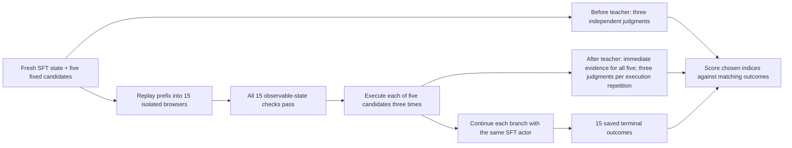
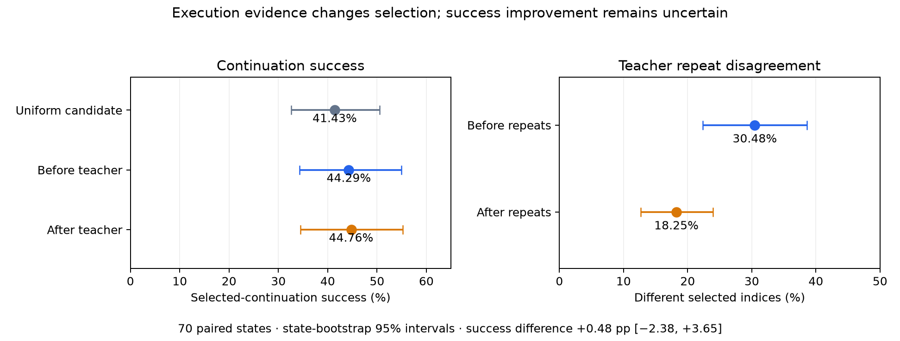

# ARM formulations: execution evidence and continuation branches

**Execution evidence changes teacher judgments. In the branching study, it also reduces repeat disagreement, but does not yet demonstrate better continuation success.** No critic was trained in either study.

| Study | What the teacher predicts | Output | What we can measure |
| --- | --- | --- | --- |
| Piotr saved transitions | Immediate goal progress from one recorded action bundle | Progress probabilities, evidence sufficiency, short effect and rationale | Before/after changes versus repeat noise; no alternative-action outcomes |
| Fresh SFT continuation branches | Which of five actions best supports subsequent task completion | Only `{"selection": N}`, N = 1–5 | Before/after choices, repeat noise and selected-continuation success |

## 1. Progress judgment on a saved executed action

Let $x$ contain the task, causal history and before screenshot, $a$ the recorded action bundle, and $e$ its observed execution feedback and after screenshot.

$$
p_B(z\mid x,a),\qquad p_E(z\mid x,a,e),\qquad
z\in\{\text{regression},\text{no progress},\text{progress}\}.
$$

The reported scalar is $s=p(\text{progress})-p(\text{regression})$. A separate `evidence_sufficient` flag produces an unresolved label when false. The other actual output fields are `effect` and `rationale`. This is an immediate-progress diagnostic, not a terminal-return value function or the index-only SelectionARM formulation.

**Data:** 200 Piotr task groups excluding the calibration groups; one saved transition per group. Both conditions use Luna-high and the same prompt/output schema. All 200 receive a before and after judgment; 100 also repeat both conditions, for 600 calls. Only the after condition sees the actual execution.

| Comparison | Task groups | Changed labels | Change rate |
| --- | ---: | ---: | ---: |
| Before → after, full primary panel | 200 | 32 | 16.0% |
| Before → after, repeat-control subset | 100 | 18 | 18.0% |
| Before → independent before repeat | 100 | 13 | 13.0% |
| After → independent after repeat | 100 | 7 | 7.0% |

The categorical change exceeds **before-only** repeat noise by just **5 pp**, with paired 95% interval **[−3, +14] pp**. Continuous scores move more than repeat noise, but a changed or more confident label is not proof of greater accuracy. Saved command receipts report execution status; `Succeed` alone does not establish goal progress. [Detailed results, score analysis and evidence-review limitations](ARM_RESULTS.md#arm-teacher-evidence-primary200-20261006).

These data cover the executed action only. They cannot establish whether an unexecuted alternative was better, or cleanly separate a bad proposal from a good proposal that encountered an execution failure.

## 2. Selection judgment with continuation branches

The question is whether immediate execution evidence improves **selection among the same five actions**, judged by subsequent outcomes under the same fixed actor.

For state $x$, candidate set $A=(a_1,\ldots,a_5)$, execution repetition $r$, and teacher repetition $j$:

$$
b_j=T_B(x,A),\qquad
c_{rj}=T_E(x,A,e_{1r},\ldots,e_{5r}).
$$

Both teachers return only the selected index. Let $y_{ir}$ be the recorded terminal-success outcome after executing candidate $i$ and continuing with the frozen SFT actor; invalid continuations contribute zero. Per-state selection scores are

$$
S_B=\frac{1}{9}\sum_{r=1}^{3}\sum_{j=1}^{3}y_{b_j,r},\qquad
S_E=\frac{1}{9}\sum_{r=1}^{3}\sum_{j=1}^{3}y_{c_{rj},r}.
$$

The paired effect averages $S_E-S_B$ over states. Uniform selection averages all 15 outcomes. Resampling whole states retains the dependence between choices, repetitions and branches.

**No future-outcome input:** both conditions receive the same goal, last five history steps, root screenshot and exact candidates. After adds only the immediate screenshots/browser receipts, grouped by execution repetition. Continuation actions, final screenshots and verdicts are excluded from teacher requests. Three before judgments are reused across all three execution repetitions; after has nine primary judgments. Two additional order-permutation controls are separate from the primary score.

**Replay, not a complete browser clone:** these are newly collected SFT prefixes, not Piotr's incomplete saved browser states. Each branch replays the same prefix, then passes the frozen observable-state checks before candidate execution. All 15 must pass before a state is released. This controls observable context but cannot certify identical hidden JavaScript or remote server state. Outcomes after release remain in the analysis, including execution failures.

## Branching results: before versus execution-informed selection

**Execution evidence changed the teacher's choices and reduced repeat disagreement, but did not demonstrate better continuation success.** This is a selection study with measured future outcomes, separate from the saved-action progress-label diagnostic above. No critic was trained.

| Selection rule | Paired states | Selected-continuation success | State-bootstrap 95% interval |
| --- | ---: | ---: | --- |
| Uniform random among the five candidates | 70 | 41.43% | [32.57%, 50.57%] |
| Before-only Luna-high teacher | 70 | 44.29% | [34.29%, 54.92%] |
| Execution-informed Luna-high teacher | 70 | 44.76% | [34.44%, 55.24%] |
| **Execution-informed − before-only** | **70** | **+0.48 pp** | **[−2.38, +3.65] pp** |

These rates average the continuation outcomes selected by repeated teacher calls, with equal weight per state. They are not integer success counts or full-episode OM2W benchmark scores. Invalid continuations count as zero; nothing is selected by its eventual outcome. A paired interval is more informative here than the two marginal intervals.

| Choice-index diagnostic | Rate | State-bootstrap 95% interval |
| --- | ---: | --- |
| Before-only: disagreement between repeated judgments | 30.48% | [22.38%, 38.57%] |
| Execution-informed: disagreement between repeated judgments | 18.25% | [12.70%, 23.97%] |
| Before versus execution-informed disagreement | 44.81% | [35.98%, 53.65%] |
| Cross-condition disagreement minus mean within-condition disagreement | +20.45 pp | [+13.39, +27.96] pp |

- **Evidence matters to the decisions.** Cross-condition changes exceed the repeat-control disagreement, and the observed after-only repeat disagreement is lower by 12.22 points.
- **More consistent choices did not yield a demonstrated success gain.** The +0.48-point estimate is uncertain; this is neither evidence of equivalence nor proof that post-action critics cannot help.
- **Do not treat agreement or label changes as reward quality.** The next useful diagnostic is whether changed choices prefer candidates with better held-out continuations, especially in panels with distinct actions. This result alone does not justify scaling teacher-label production.

### Controlled setup

| Component | Fixed design |
| --- | --- |
| States | Fresh official SFT prefixes, depth 0–2, one state per training task; not restoration of Piotr screenshots |
| Actor | Official OpenWebRL-4B-SFT for prefixes, five candidates and all continuations; T=1.0, p=0.95, top-k off, 4,096 tokens |
| Branches | Five candidates × three independently executed continuations per state |
| Teacher | GPT-6 Luna, high reasoning; only `{"selection": N}` in both conditions |
| Before inputs | Task goal, last five history steps, current screenshot and the exact five candidate responses |
| After inputs | Identical before inputs plus immediate execution feedback/screenshots for all five candidates; no continuation or verdict |
| Repeats | Three before judgments reused across the three execution repetitions; three after judgments for each execution repetition; separate order-permutation controls |
| Outcome | Frozen canonical o4-mini/AgentTrek terminal judge (allows partial progress); invalid outcomes retained as zero |
| Replay control | All 15 reconstructions must pass observable-state checks before release; failures after release are retained |

**Scope and limits.** The allocation closed with 74 complete states and 1,110 continuation records, including 1,000 valid and 110 invalid records. Four states lack a complete valid teacher panel, leaving 70 for paired analysis. Another state has four finished and 11 interrupted continuations and is excluded. The planned 100 states / 1,500 continuations were not reached within the approved allocation.

Observable replay checks do not prove identical hidden JavaScript or remote server state. Accepted early states are a selected subset: 333 candidate states failed reconstruction before release. Only 37 of the 74 complete panels contained five distinct actions; changing an index can select a duplicate action. Three continuations per candidate also give coarse estimates of candidate quality. The common-valid sensitivity yields +0.84 points, and the final repair phase yields +1.39 points with interval [−2.18, +5.16]; neither changes the conclusion. Repair phases were not randomized.

All seven attempts are accounted for: **31.94 H200-hours**, **$3.32 teacher API**, **$5.82 judge API**, no unsettled reservations. The dataset is partial; accounting is final. [Aggregate results and intervals](arm_results/rl_integration/continuation-branches-final-20261006.json) · [Replay checks, complete protocol and repair history](ARM_INTEGRATION_PLAN.md#arm-continuation-branches-20261006).

## Inspect examples for both conditions

These are **local cluster directories**, not public dataset downloads. Each bundle links to preserved source artifacts. `before/` and `after/` contain the actual condition-specific teacher requests/responses; branching `outcomes/` is separate and was never a teacher input. The earlier progress schema is retained for that diagnostic only; the branching study has no factored output.

| Example bundle | Before-only inputs and outputs | Execution-informed inputs and outputs |
| --- | --- | --- |
| Saved transition: changed label | [before directory](/gpfs/scrubbed/zixianma/openwebrl-runtime/arm-formulation-examples-20261007/progress-changed/before/) | [after directory](/gpfs/scrubbed/zixianma/openwebrl-runtime/arm-formulation-examples-20261007/progress-changed/after/) |
| Saved transition: unchanged label | [before directory](/gpfs/scrubbed/zixianma/openwebrl-runtime/arm-formulation-examples-20261007/progress-unchanged/before/) | [after directory](/gpfs/scrubbed/zixianma/openwebrl-runtime/arm-formulation-examples-20261007/progress-unchanged/after/) |
| Branching: higher observed after-selection score | [before directory](/gpfs/scrubbed/zixianma/openwebrl-runtime/arm-formulation-examples-20261007/selection-after-higher/before/) | [after directory](/gpfs/scrubbed/zixianma/openwebrl-runtime/arm-formulation-examples-20261007/selection-after-higher/after/) |
| Branching: lower observed after-selection score | [before directory](/gpfs/scrubbed/zixianma/openwebrl-runtime/arm-formulation-examples-20261007/selection-after-lower/before/) | [after directory](/gpfs/scrubbed/zixianma/openwebrl-runtime/arm-formulation-examples-20261007/selection-after-lower/after/) |

[Example index and source manifests](/gpfs/scrubbed/zixianma/openwebrl-runtime/arm-formulation-examples-20261007/README.md). Examples are the first changed/unchanged saved transitions and first positive/negative branching effects in their preserved audit order. They illustrate the formats and both directions; they are not a representative accuracy sample. The local links require access to this filesystem and will not resolve as hosted GitHub files. Screenshots, task text, requests and trajectories remain private.

## What this means for the next ARM formulation

- **Pre-action selection** is directly usable before spending a browser action, but must forecast execution uncertainty.
- **Execution-informed selection** can use observed effects as training-time evidence; online use would require executing alternatives. Improved repeatability alone is insufficient justification for distillation.
- **Continuation value or advantage targets** would be a different, untested training formulation. These branches permit a noisy empirical candidate return, $\hat q_i=\frac{1}{3}\sum_r y_{ir}$, and a within-panel contrast, $\hat q_i-\frac{1}{5}\sum_k\hat q_k$. They are relative to this fixed actor and candidate distribution; three continuations are not precise action-quality labels.

The next analysis should separate distinct-action panels and ask whether changed selections choose better continuations beyond repeat noise. A future training claim needs held-out downstream gains; neither label movement nor a new name for a value target establishes that.
