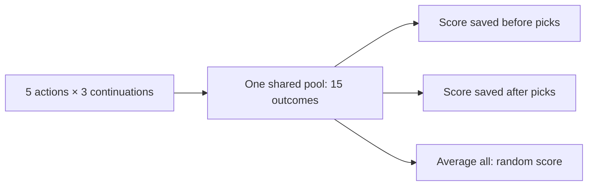
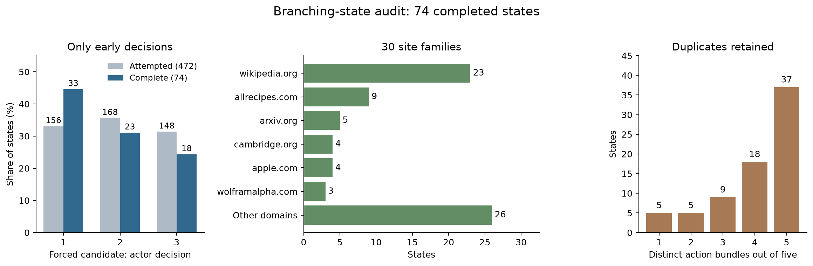

# ARM formulations: before versus after execution

**Execution evidence changes the teacher's choices and makes them more consistent. We have not demonstrated better downstream success.** Neither study trained a critic.

| Study | Before teacher sees | After teacher additionally sees | Teacher output |
| --- | --- | --- | --- |
| Saved Piotr action | Task, history, screenshot, one recorded action | That action's execution feedback and screenshot | Progress probabilities + evidence/rationale |
| Five-action selection | Task, history, screenshot, five candidate actions | Immediate execution evidence for all five | Only `{"selection": 1..5}` |

## 1. Does execution change a progress judgment?

Same saved action, Luna-high teacher, different evidence.

| Comparison | Examples | Changed labels | Change rate |
| --- | ---: | ---: | ---: |
| Before → after, full set | 200 | 32 | 16% |
| Before → after, repeat subset | 100 | 18 | 18% |
| Before → before repeat | 100 | 13 | 13% |
| After → after repeat | 100 | 7 | 7% |

On the repeat subset, the change exceeds before-repeat noise by **5 pp**, interval **[−3, +14]**. Changed labels do not establish better accuracy. Only the executed action has evidence. [Details](ARM_RESULTS.md#arm-teacher-evidence-primary200-20261006).

## 2. Does execution improve action selection?

**Before, after, and random score the same continuation data; there is no third rollout set.** Each of five candidates has three continuations with the same SFT actor. Teachers choose without seeing continuation outcomes; after sees immediate execution only. Both teachers are Luna-high and output only an index.

| Selection rule | Paired states | Continuation success | Repeat disagreement |
| --- | ---: | ---: | ---: |
| Random choice: 20% per candidate | 70 | 41.43% | — |
| Before teacher | 70 | 44.29% | 30.48% |
| After teacher | 70 | 44.76% | 18.25% |

| Paired comparison | Gain, pp | 95% interval, pp |
| --- | ---: | --- |
| Before teacher − random | +2.86 | [−1.08, +6.92] |
| After teacher − before teacher | +0.48 | [−2.38, +3.65] |

**More consistent choices; no demonstrated success improvement.** Rates average repeated selections, not integer success counts. Invalid continuations count as zero; intervals resample whole states.

### Which states were tested?

| Candidate decision | Completed states | Share | Completed / discovery attempts |
| --- | ---: | ---: | ---: |
| 1 | 33 | 44.6% | 21.2% |
| 2 | 23 | 31.1% | 13.7% |
| 3 | 18 | 24.3% | 12.2% |

**Early states only:** 30 site families, 57 distinct screenshots, and 37 states with five distinct actions. Eighteen states show blank/access/error pages; their outcomes remain included. Completion rates include discovery and replay attrition.

**Expanded target: 75 later states across decisions 4–15**, giving 149 states with the preserved early cohort. Aim for 6 per decision, plus one at 4, 9, and 15: 25 each from decisions 4–7, 8–11, and 12–15. Select tasks in fixed order; retain outcomes regardless of success. Strict replay and existing resource caps still apply, so report shortfalls by decision. The 30-action budget includes the prefix; one decision may contain several browser actions. [Extension](ARM_INTEGRATION_PLAN.md#arm-continuation-finish100-20261007) · [Coverage data](arm_results/rl_integration/continuation-state-diversity-20261007/aggregate.json).

State diversity plot

### What does “random candidate” mean?

Choose one of the **five sampled action entries** with equal probability, ignoring teacher scores. Duplicate actions retain their separate entries.

We already executed all five, three times each. Averaging those **15 outcomes** estimates random selection without another browser run. This randomizes **one action at the root state**, then continues with ordinary SFT.

### A random control for the pre-action critic

For a full-episode control, repeat this at **every step**:

**Generate five actions → randomly pick one → execute → repeat.**

Compare it with SFT alone and SFT + the pre-action SelectionARM, using the same tasks, actor, decoding, browser, step cap and judge. No execution evidence goes to the selector.

If candidates are independent, identically distributed actor samples, a random pick has the same action distribution as one actor sample. The full-episode run tests that expectation in the actual five-candidate pipeline.

**Complete:** random selection at every step succeeds on **100/300 tasks (33.33%)**, versus SFT **99/300 (33.00%)** and Piotr SelectionARM **120/300 (40.00%)**. Random − SFT: **+0.33 pp [−4.67, +5.67]**; Piotr − random: **+6.67 pp [+1.00, +12.33]**. This supports useful learned selection in this run; random and SFT equivalence is not established. [Full-episode comparison](ARM_INFERENCE_SCALING.md#random5-sameday-results-20261007).

Protocol and limitations

Fresh SFT prefixes were replayed into isolated browsers; all 15 observable-state checks had to pass. These were not restored Piotr browser snapshots, and hidden browser/server state need not match.

Collection reached **74/100 states and 1,110/1,500 continuations**; 70 states had complete teacher panels. Only 37 complete panels had five distinct actions. There were 333 reconstruction rejections and 110 invalid continuations. These early, replayable states are not a full-episode benchmark.

Actor: official SFT, T=1, p=.95, top-k off, 4,096 tokens. Three before judgments; three after judgments per execution repetition; separate order controls. Canonical o4-mini/AgentTrek success allows partial progress.

Saved-action labels use three progress probabilities, `evidence_sufficient`, `effect`, and `rationale`; score = P(progress) − P(regression). Branching uses only the selected index.

Original allocation: 31.94 H200-hours; $3.32 teacher; $5.82 judge. Its accounting is closed; the approved later-state extension has separate compute accounting.

## Examples

Local cluster directories; each contains separate **before/** and **after/** inputs and outputs. Branch **outcomes/** were never teacher inputs.

| Study | Example directories |
| --- | --- |
| Saved action | [Changed label](/gpfs/scrubbed/zixianma/openwebrl-runtime/arm-formulation-examples-20261007/progress-changed/) · [Unchanged label](/gpfs/scrubbed/zixianma/openwebrl-runtime/arm-formulation-examples-20261007/progress-unchanged/) |
| Five-action selection | [After scores higher](/gpfs/scrubbed/zixianma/openwebrl-runtime/arm-formulation-examples-20261007/selection-after-higher/) · [After scores lower](/gpfs/scrubbed/zixianma/openwebrl-runtime/arm-formulation-examples-20261007/selection-after-lower/) |

Illustrative examples, not an accuracy sample. Filesystem access is required; raw data remain private.

[Aggregate results](arm_results/rl_integration/continuation-branches-final-20261006.json) · [Random-control comparison](arm_results/rl_integration/continuation-random-control-20261007.json) · [Full protocol and repair history](ARM_INTEGRATION_PLAN.md#arm-continuation-branches-20261006).
