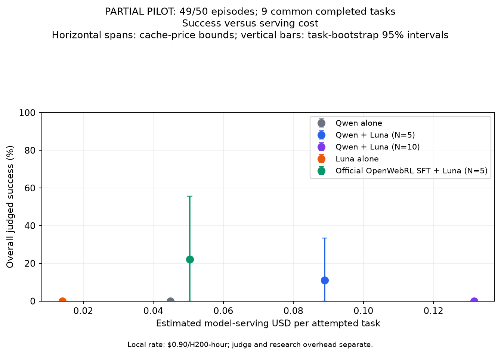
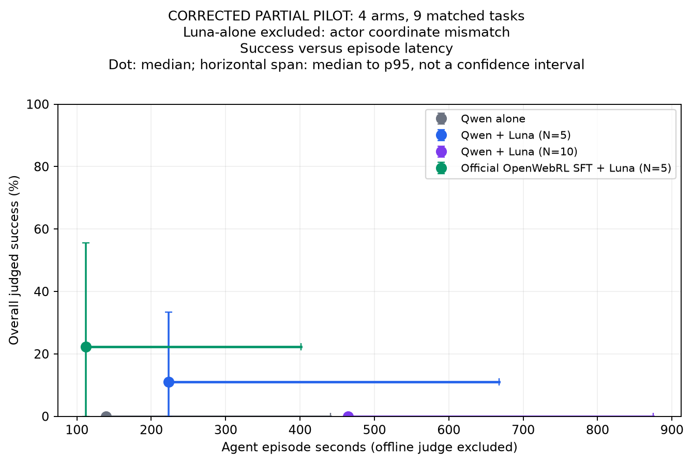
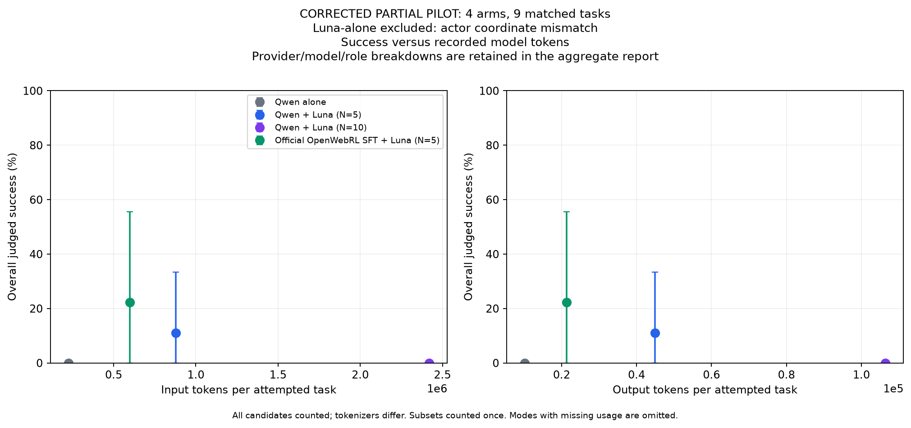

# ARM inference and judge protocol

Inference-time ARM selection, terminal-success judge alignment, and unavailable-task retry policy. Initial benchmark results and retries retain separate denominators. See [all experiment results](ARM_RESULTS.md) for comparison with standalone training.

## Contents

- [Full300 actor × Luna-selector study](#luna-actor-full300-20261004)
- [Luna reasoning audit and Luna-high / Sol6.1-high baselines](#api-actor-reasoning-20261005)
- [Qwen/SFT pilot: corrected four-arm comparison; Luna actor withdrawn](#luna-qwen-inference-20261004)
- [Controlled full300 ARM versus episode pass@5 experiment](#arm-controlled-inference-20261004)
- [Inference cost versus episode pass@k](#arm-inference-cost-passk-20261004)
- [ARM inference results on Online-Mind2Web](#arm-inference-results)
- [ARM judge alignment audit](#arm-judge-alignment)
- [ARM matched retry status and results](#arm-inference-retry-results)

---

## Full300 actor × Luna-selector study — October4

**Luna alone is verified complete:110/300 successes (36.67% overall;39.43% of279 valid episodes). GPU replacement345214 is now running the other1,200 episodes.** The target is all300 unique
Online-Mind2Web tasks. The scientific question is how an action selector changes
success and efficiency for different actors, and whether ten proposals improve
on five enough to justify their extra cost. The existing ten-task pilot at
top-p0.9 stays separate:49/50 episodes were collected, but its Luna-alone comparison is withdrawn after the coordinate bug described below. The proposed pilot resource conversion remains unapproved.

| Actor | Alone | Luna selector, N=5 | Luna selector, N=10 |
| --- | --- | --- | --- |
| Released Qwen3-VL-4B-Thinking | Fresh300 | Fresh300 | Excluded by the updated scope |
| Official OpenWebRL/OpenWebRL-4B-SFT | Reuse existing full300 reference | Fresh300 | Fresh300 |
| GPT-6 Luna | Fresh300 | Excluded | Excluded |

### Unified experiment tracker

Snapshot: **2026-10-05 18:53:28 UTC**. “Saved” is terminal record coverage;
archived coordinate-compromised and transport-diagnostic records are excluded, and provisional counts
are flagged explicitly. Coverage does not imply every record is valid or the
run has passed its final audit. The table includes runs owned by the other evaluation session. The [aggregate tracker JSON](arm_results/luna_full300_20261004/experiment_tracker.json) records the same eleven committed comparison rows, including both approved high-reasoning baselines and the other session’s direct Kev27B actor. Supervisors must maintain this table and JSON snapshot on submission, recovery, routine progress review and verified completion, including the other session’s runs. Preserve stable IDs and report omitted or unconfigured arms explicitly.

| ID | Actor | Selector | N | Target | Saved | Status / current job | Protocol | Budget |
| --- | --- | --- | ---: | ---: | ---: | --- | --- | --- |
| AS01 | Qwen3-VL-4B-Thinking | None |1 |300 |14 |Running recovery345214; parallel dispatch verified; prior386s charged |Luna study |Approved shared GPU/API pools below |
| AS02 | Qwen3-VL-4B-Thinking | GPT-6 Luna |5 |300 |14 |Running recovery345214; parallel dispatch verified; prior386s charged |Luna study |Approved shared GPU/API pools below |
| AS04 | Official OpenWebRL-SFT4B | None |1 |300 |300 |Complete; reuse actor0,106 successes |Historical SFT |Already completed |
| AS05 | Official OpenWebRL-SFT4B | GPT-6 Luna |5 |300 |19 |Running recovery345214; parallel dispatch verified; prior386s charged |Luna study |Approved shared GPU/API pools below |
| AS06 | Official OpenWebRL-SFT4B | GPT-6 Luna |10 |300 |17 |Running recovery345214; parallel dispatch verified; prior386s charged |Luna study |Approved shared GPU/API pools below |
| AS07 | GPT-6 Luna | None |1 |300 |300 |Verified complete344875;110 successes |Luna study; API sampling |Approved shared CPU/API pools below |
| AS08 | Official OpenWebRL-SFT4B | Jev |5 |300 |300 |Audited complete345021;176 successes,16 diagnosed invalids |Jev/Kev study |Approved1 H200/8 CPU/120GiB ×10h total |
| AS09 | Official OpenWebRL-SFT4B | Kev27B |5 |300 |300 |Audited complete344793;184 successes,9 diagnosed invalids |Jev/Kev study |Approved2 H200/16 CPU/240GiB ×10h total |
| AS10 | GPT-6 Luna, high reasoning |None |1 |300 |255 |Running345178; receipts verified; provisional coverage |Matched API actor protocol |Approved separate CPU/API caps below |
| AS11 | GPT-6.1 Sol, high reasoning |None |1 |300 |300 |Arm audit passed345179;61 successes/273 valid; shared judge audit pending |Matched API actor protocol |Approved separate CPU/API caps below |
| AS12 | Kev27B direct actor |None |1 |300 |174 |Running recovery345273; prior6,135s charged; peer-owned |Upstream DOM + text assistance |Approved1 H200/8 CPU/120GiB ×4h total |

**October5 CPU-family endpoint:** all300 primary records are independently
verified, comprising90 retained no-coordinate originals and210 corrected
records. CPU344875 completed and all four repair workers and their W&B runs
finished. Scheduler use totals **12,257/14,400 approved CPU-pool seconds**
across both attempts. The [verified CPU-family results](#luna-cpu-family-results-20261005)
are separate from the full actor/selector comparison: **300/1,500 new study
episodes have passed their final audit**, with GPU recovery345214 running four arms totaling
1,200 episodes. Jev and Kev have each saved300 records and exited successfully;
their owner has now completed the final audits, retaining16 and9 diagnosed invalids respectively. Their separate protocol and budgets remain explicit. Final Luna CPU verification completed at10:26:44 UTC.

**October5 GPU transport recovery:** attempt344754 started at17:21 UTC, then exposed a client connection limit of one: candidate proposals were serialized despite being gathered concurrently. A180s timeout left a server request active during the next cache flush, which returned HTTP400. The affected attempt stopped after386s. All four early GPU records and every partial attempt are preserved as diagnostic history; all four GPU arms will be recollected under the corrected dispatch, independent of their outcomes. The repair allows ten candidate connections per dedicated GPU and waits up to60s for cancellation to drain before flushing. Real ten-way HTTP overlap and bounded flush/error tests passed. **Replacement345214 is running with a15h53m ceiling**, keeping prior use plus the new ceiling at57,566/57,600 seconds. Models, decoding, browser concurrency, task/judge settings and shared API ledgers are unchanged. The CPU actor studies continue independently. Startup verification confirmed eight exclusive GPUs, five concurrent Qwen proposals and ten concurrent SFT proposals, successful cache flushes between episodes, and all eight W&B runs in `openwebrl-evals`. Saved request sampling matches T1/p0.95/k−1 with the 4096-token cap; new records carry the repair identity.

**October 5 direct-Kev recovery:** job 345177 stopped after browser cleanup hung following its 600s actor timeout. The existing owner reproduced the dead Playwright dispatcher, tested bounded capture and cleanup (24 tests passed, 1 skipped), and started **replacement 345243**. At that startup, two browser workers resumed collection. All 109 completed records and both interrupted attempts are preserved. The prior 4,753s plus the replacement’s 9,600s ceiling total **14,353/14,400 approved seconds**, with the same 1 H200/8 CPU/120 GiB profile and API/browser caps. Its actor deadline, DOM policy, model and judge settings are unchanged. This is a separate, incomplete protocol cohort.

**October 5 direct-Kev follow-up:** the initial recovery 345243 used another 674s; its successor 345255 used 708s before stopping on a local-model HTTP 422. The peer owner acknowledged and diagnosed that failure before the replacement described below. All 154 completed records (152 valid) and interrupted attempts remain preserved. Total use is **6,135/14,400 seconds**, leaving **8,265 seconds** under its original separate approval. The Qwen/Luna and high-reasoning jobs continue independently.

**October 5 Sol-high endpoint:** all 300 records are independently verified: **61 successes (20.33% overall; 22.34% of 273 valid)** and 27 diagnosed invalids. Job 345179 completed in **7,056/21,600 approved seconds**; all four workers exited successfully and all four W&B runs finished. Every returned actor receipt confirms `gpt-6.1-sol`, high effort, and completed output. The actor ledger reconciles across **3,978 calls: $45.7640955 recorded upper-bound cost plus $0.66115 reserved for four HTTP 5xx errors**, totaling **$46.4252455/$100**. The raw failures and reservations remain preserved. Luna-high continues independently; the shared judge accounting and combined three-arm cost/latency/token figures wait for the full 600-episode audit. These actor dollars exclude judging and local CPU charges.

**October 5 direct-Kev recovery update:** the peer owner resumed collection as **345273** after diagnosing the local-server rejection, preserving completed records and diagnosed invalids. Its replacement ceiling is **8,220s**; prior use plus this ceiling is **14,355/14,400 approved seconds**. Worker progress and the owner’s active repair continuation are verified. Protocol and diagnostic details remain with the [peer report](RL_EVALUATION.md#kev27b-actor-full300-20261004).

**Coverage checklist:** eleven committed full-set comparison rows: one completed reusable
baseline, one verified CPU family, two audited selectors, four GPU rows running after recovery, one independently audited high-reasoning actor, one
running300-task high-reasoning actor and the independently supervised direct Kev27B actor. The five fresh Luna-study
rows share two approved pools. This totals3,000 new
full-set episodes across separately budgeted studies plus300 reused baseline records. AS12 uses its own upstream DOM policy and GPT-4.1-mini text assistance; see the [direct Kev27B protocol](RL_EVALUATION.md#kev27b-actor-full300-20261004). Its results are not a matched comparison with the pixel-based API actors. No
Luna+Luna row is planned. Qwen + Luna N=10 (former AS03) is excluded by the
updated request; only official SFT + Luna has an N=10 arm. Other IDs remain
unchanged. **Kev0.8B has only a completed10-task pilot**; no
full300 plan or approval exists, so it is explicitly outside the committed
full-set checklist. The separate Qwen/Luna pilot has49/50 historical
records, including all10 official SFT records, but seven Luna actor records are
coordinate-compromised and the entire Luna-alone comparison is withdrawn.
Job344655 stopped at its internal deadline; [partial plots and recovery approval](#luna-qwen-pilot-partial-20261005)
are tracked separately.

**October5 peer recovery:** Jev344708 and Kev344661 were intentionally stopped
for a confirmed hosted-browser input-clearing bug: Mac sessions need the Mac
select-all shortcut. Their existing repair owner submitted replacements
Jev344794 and Kev344793. The44 Jev and42 Kev records
from before the repair are preserved pending the recovery audit. These
partial results are not final comparison results. At replacement submission, remaining allocation time was
31,184 seconds for Jev and31,135 seconds for Kev under their separate10-hour
limits. No budget extension is implied. The separate local Luna CPU collection
has finished.

**October5,11:07 UTC peer failure:** Jev344794 failed after an HTTP400
selector halt. Recovery was pending at that snapshot. The original provider
error body was not saved, so the underlying cause was then undiagnosed. The189 saved records (178 marked valid,122 successes) are **provisional**
pending the owner’s failure audit; two invalid records may reflect the
provider halt. This is not a completed comparison result. Its three attempts
used1,003 +3,813 +13,189 = **18,005 of36,000 approved allocation seconds**,
leaving **17,995 seconds** within its unchanged1 H200/8 CPU/120GiB budget.
Kev344793 remains running with182 saved records at this snapshot. Recovery
does not transfer budgets between peers, the Luna study or the pilot.

**October5,11:44:00 UTC peer recovery:** the existing owner confirmed Jev's
`max_tokens_exceeded` error with a separately charged identical-request
diagnostic. Replacement **345021 is running**, with fresh browser activity
and 191 saved records; Kev344793 has 207. The fix saves error bodies
and confines a confirmed context-limit failure to its episode. Requests,
full candidate content and sampling settings remain unchanged; no history
compaction or action fallback was added. Prior results, including both
halt-affected records, remain preserved. This is still a partial cohort with
separate browser-harness strata, not a final performance comparison.

The Jev retry is capped at **17,940 seconds**, giving a maximum cumulative
**35,945/36,000 seconds** after the 18,005 seconds already consumed. Current
scheduler accounting shows 18,189 seconds used and 17,811 remaining for Jev;
Kev has 19,393 used and 16,607 remaining under its separate 36,000-second
cap. No approval or budget transfer was added.

**October5,16:28:03 UTC collection endpoints:** Jev345021 and Kev344793 both
exited successfully with **300/300 records**. Saved judge outcomes are
provisionally **176/300 (58.67%)** for Jev and
**184/300 (61.33%)** for Kev27B; 284 and 291 records are marked
valid, respectively. Final evidence, verdict, receipt and browser-cleanup
audits by their existing repair owner are still pending. These scores retain
the pre/post browser-repair strata and differ in protocol from the Luna study;
they are not a matched ranking against Luna or the historical SFT baseline.

Final scheduler accounting, including every attempt, is **30,164/36,000 seconds**
for Jev's one-GPU pool and **29,158/36,000 seconds** for Kev's two-GPU pool.
At the16:28 UTC snapshot, the then-approved unified table had **900/2,100 fresh records collected**, plus
the300-record historical SFT reference. At that time the new Qwen/Luna study was
**300/1,500 verified**, with four GPU arms queued under job344754 and zero GPU
time consumed. They began collection at17:21 UTC; the current table above
includes that startup and the subsequently approved actor baselines. The full
cost/latency/token comparison still requires collection and final accounting.

### Verified Luna CPU-family results — October5

The corrected Luna-alone cohort is complete. These are single-arm results;
no matched actor/selector comparison or full-study plots are available yet.
The judge remains action-only o4-mini/AgentTrek, with a30-turn horizon and
step-limit failures scored zero. [Sanitized aggregate metrics and all-attempt accounting](arm_results/luna_full300_20261004/cpu-family-aggregate.json).

| Tasks | Successes | Valid | Invalid | Overall | Valid-only | Task-bootstrap95% interval |
| ---: | ---: | ---: | ---: | ---: | ---: | ---: |
|300 |110 |279 |21 |36.67% |39.43% |31–42% overall |

| Metric | Verified aggregate |
| --- | --- |
| Actor API cost estimate |$2.214169 total;$0.007381 per task |
| Terminal judge cost estimate, separate |$0.960615 total |
| Episode latency, excluding terminal judge |78.09s mean;55.98s median;254.41s p95 |
| Actor tokens |16,280,584 input;382,378 output; means54,268.61 /1,274.59 per task |
| Browser steps |3,839 total;12.80 mean per task |
| Local model compute |0 GPU-seconds and0 local model FLOPs; hosted API compute unknown |
| All-attempt CPU allocation |12,257 seconds at16 CPUs/32GiB, or54.48 CPU-core-hours; includes original failure and repair |

The provider reported total input/output usage for every primary request, but
did not report separate image-token counts. Image-token subcounts are
unavailable; the aggregate records missing-subcount coverage rather than
treating omitted image usage as measured zero.

All21 invalid episodes were unavailable task starts:11 navigation timeouts,
five download responses and five network failures. Invalids remain in the
300-task overall denominator. Artifact hashes, receipt-derived metrics,
primary-cohort coverage, repair provenance, worker exits, final scheduler
accounting and all four repair W&B runs passed the independent audit.

The primary cohort combines90 explicitly audited no-coordinate originals with
210 corrected episodes. The177 compromised original records and four
interrupted attempts remain preserved outside the primary cohort: **481
physical attempts in total**. Across every attempt, actor API costs are
**$4.920691 known or conservatively reserved**, with **$1.190080 judge costs**
separate. Two interrupted original actor requests still lack returned usage;
their reservations remain charged, never treated as zero. API dollars are
frozen-price token estimates; browser CPU dollars are unpriced. These research
totals include discarded work and differ from the primary per-task cost above.
All original CPU/GPU/API caps remain unchanged; completion of this CPU family
does not authorize a transfer of its unused budget to another pool or the pilot.

### Luna reasoning audit and high-reasoning baselines — October5

**The verified Luna result used medium reasoning. No primary actor response hit
its4,096-token cap.** All3,839 primary calls returned the requested
`gpt-6-luna` identity and completed successfully. Receipts report257,283
reasoning tokens (67.02 per action; median44, p95 215), included in382,378 total
output tokens. The largest total output was2,189 tokens. This rules out output
cap truncation as the explanation for this cohort's36.67% overall score; it does
not establish what higher reasoning effort would achieve.
[Aggregate receipt audit](arm_results/luna_full300_20261004/luna-reasoning-audit.json).

Of169 valid failures,59 exhausted the30-step horizon and110 terminated with a
completion claim rejected by the terminal judge. The21 invalid tasks were
unavailable starts. These are termination categories, not a semantic diagnosis
of every failed action. More reasoning could improve planning, grounding or
stopping decisions; it is an untested intervention here.

The user requested GPT-6.1 Sol at high reasoning. Two actor-only comparisons are
approved and running in parallel: **AS10 Luna-high** isolates effort against the existing medium result;
**AS11 GPT-6.1 Sol-high** compares model choice at the same high setting. Each
uses all300 tasks, the corrected pixel-coordinate harness, identical task goals
and browser tools, local1280×720 browsers,30 turns,4,096 total output tokens,
180s/request,1,800s/task, and the same actions-only o4-mini judge. API sampling
remains model-controlled. Preserve cap-hit and incomplete-response telemetry;
do not silently raise the output budget or execute partial actions. A larger
output-budget study would be separately labeled. Live web state and collection
time remain possible differences from the completed medium cohort.

Sol-high is a stronger reference, **not a guaranteed upper bound**. Both models
support high reasoning through the Responses API. The output cap includes
reasoning as well as visible output. [Sol model and pricing](https://developers.openai.com/api/docs/models/gpt-6.1-sol),
[Luna model](https://developers.openai.com/api/docs/models/gpt-6-luna), and
[reasoning/output-budget semantics](https://developers.openai.com/api/docs/guides/reasoning).

| Approved arm | Tasks | CPU allocation ceiling, including retries | Actor API ceiling | Counterfactual actor cost at observed Luna-medium usage |
| --- | ---: | --- | --- | ---: |
| AS10 Luna-high |300 |0 GPU,16 CPU,32GiB ×6h;4 browser workers |$15 and9,900 calls |$2.21 |
| AS11 GPT-6.1 Sol-high |300 |0 GPU,16 CPU,32GiB ×6h;4 browser workers |$100 and9,900 calls |$44.28 |

These independent CPU jobs run in parallel and release each allocation when finished.
The two resource totals remain separate across retries. Shared terminal-judge
cap: **$5 /2,640 calls**, giving **$120 maximum API spending** across the pair.
The6h values are ceilings, not runtime predictions. The counterfactual costs
apply current Standard token prices to the observed medium cohort; high effort
and model choice can change tokens, trajectories, caching and latency. No
budget transfers from the existing study or pilot are authorized.

Status: **Sol6.1-high345179 completed with61/300 successes and passed its independent arm audit; Luna-high345178 remains running**.
Both arms launched with four browser workers each. The frozen implementation passed21 targeted
accounting and coordinate tests. Live startup checks at **2026-10-05 16:55:46 UTC** verified
all eight W&B runs in `openwebrl-evals`, exact returned model identities,
high reasoning,4,096-token output caps, and no actor/judge budget halts.
Initial saved coverage was1/300 Luna-high and2/300 Sol-high; this records startup
validation, not the current performance result. Both jobs have0 allocated GPUs.

The final Sol audit retained four transient provider errors (HTTP502, HTTP503, and two HTTP520 responses); later requests succeeded. All four failed episodes and their unresolved cost reservations are preserved. Cost plots will show conservative reservation bounds, and token plots will mark missing-usage totals as lower bounds. The shared two-arm study remains in progress.

A verified persistent supervisor checks both jobs and returns the owning agent
for diagnosis/recovery every15 minutes or on state changes, new API errors, or receipt protocol violations. Each retry charges
its original arm's six-hour total. Track success, paired differences, costs,
latency, total/reasoning/cache tokens, browser steps and CPU allocation use;
plot success versus cost, latency and input/output tokens after complete
collection and final accounting. [Approved protocol and exact budget](arm_results/luna_full300_20261004/reasoning-high-proposal.json).

### October5 Luna actor coordinate repair

**The original Luna actor performance is invalid for comparison and is withdrawn.**
Its native browser tool schema asks for viewport pixel coordinates. The frozen
`openwebrl/luna_qwen_policy.py` serialized those arguments unchanged, while
`openwebrl/env/config.yaml` enabled `resize_output_coords: true` with
`resize_scale: 1000`. `WebEnv.execute_single_action` therefore treated the
arguments as normalized coordinates. For a **synthetic arithmetic example**,
the viewport center at[640,360] pixels would incorrectly become[819.2,259.2]
in a1280×720 viewport. This affects click, hover, coordinate-targeted scroll
and drag. Intact artifact hashes and usage receipts did not establish correct
action execution. Individual trajectory evidence remains private.

CPU344755 was deliberately stopped after **6,761 seconds**. Its267 committed
records were classified by coordinate presence in native API calls and saved
action history, independently of rewards: **177 compromised records were
archived;90 no-coordinate records were retained**. Four interrupted attempts
and every receipt remain preserved. At relaunch, corrected or fresh collection
was required for the other210 tasks. The retained subset is coverage, not a standalone
Luna success estimate.

Replacement **344875** finished after **5,496 seconds**, below its7,620-second
retry limit; all four repair workers exited0. Actual use across both CPU
attempts is **12,257 of14,400 approved seconds**, with the same0 GPU/16 CPU/32GiB profile and shared
$100 Luna/$25 judge caps. GPU344754 remains queued independently; its code,
scientific settings and budget are unchanged.

The repair disables coordinate resizing **per episode only for the Luna
actor**, before creating the browser environment. Native API coordinates,
executed actions, future actor history and judge history all remain viewport
pixels. Qwen/SFT proposals retain their normalized0–1000 coordinates; the
pinned Luna selector prompt already states that convention and returns only a
candidate index. Validation passed **51 tests**:46 targeted coordinate and
existing tests plus five repair-controller tests. During replacement startup
on October5, live checks confirmed matching requested/executed pixel coordinates for all
four replacement workers, five verified new records and four running W&B
identities. Final independent verification now confirms all300 primary records
and successful exits for all four repair workers.

| Protocol group | Actor decoding | Browser / timeout | Judge evidence and horizon scoring | Efficiency coverage |
| --- | --- | --- | --- | --- |
| Luna study |Local T1/p0.95/k−1,4096 tokens; Luna medium/API-controlled |Local1280×720;1800s |Actions + final screenshot; step-limit failure0 |All candidate/request tokens, judge-excluded episode latency, browser calls/time and exclusive local GPU accounting |
| Jev/Kev study |SFT T1/p0.95/k20,4096 tokens |Hosted1280×1000;600s |Thoughts + actions + final screenshot; terminal step limits also judged |Selector/judge token receipts, elapsed episode time including judge/cleanup, step totals and job/device accounting; exact actor token receipts and comparable exclusive GPU cost absent |
| Historical SFT |T0.7/p0.9/k−1,1024 tokens |Local;1800s |Thoughts + actions; step-limit failure0 |Actor tokens/steps and shared-server timing/FLOP estimates; exclusive serving cost/latency unavailable |

Thus this is a **coverage tracker, not a claim that all rows isolate the same
intervention**. Cross-protocol performance and efficiency comparisons carry
these labels. Do not fill missing measurements with zeros or silently combine
the other session's measurements with the Luna metric definitions.

Jev/Kev completion and review artifacts are maintained in the
[full300 SFT selector report](RL_EVALUATION.md#sft-selection-full300-20261004).
The reused baseline's audited results are in the
[controlled inference report](#arm-controlled-inference-results-20261004).
Each active full300 Jev/Kev run additionally caps330 hosted-browser sessions,
1,320 judge calls and50,000 actor proposals; Jev caps9,900 selector requests,
Kev caps9,910 local selector requests. Those approved budgets remain separate
from the approved Luna budgets and from every pilot.

The Luna-study matrix requires **1,500 fresh episodes** and reuses the existing SFT
actor-only result. At planning, no completed full300 Qwen Thinking or Luna
baseline was found in the project artifacts. The released actor revisions match the pilot:
Qwen `1de27d8c51f12e819435303b9e84c4e25ba8401e` and official SFT
`15e777db2ddba2e0e82080ebccd3ad8d215b7f0a`.

Both local actors use **temperature1.0, top-p0.95, top-k disabled**, repetition
penalty1,4096 response tokens,32K context and30 turns. Response allowances near
the context boundary retain the validated one-token reserve. All requested
proposals are charged, including discarded candidates. The seed schedule,
shuffled candidate presentation, unchanged chosen action, goal/history/current
screenshot,1280×720 local browser and action-only o4-mini/AgentTrek terminal
judge remain common. Each task receives every fresh arm; within-family arm
order is deterministically shuffled. The horizon rule remains explicit:
completed trajectories invoke the judge, step-limit failures score zero, and
aborted trajectories are invalid. No valid failure is automatically rerolled.

Luna keeps medium reasoning and4096 output tokens in both roles. Its sampling
is API controlled: temperature/top-p are unsupported with nonzero reasoning,
so T1/p0.95 applies to the local actors. Actual returned model identities and
usage are retained. [Official parameter compatibility](https://developers.openai.com/api/docs/guides/latest-model#update-api-and-model-parameters).

**Baseline reuse is a limitation.** The October4 official-SFT actor0 baseline
has106/300 successes (35.33%,272 valid); pooled ordinary pass@1 is528/1500
(35.20%). It used T0.7/p0.9,1024 output tokens, thoughts-inclusive judge evidence
and shared actor serving. It supplies a historical performance reference,
not an isolated estimate of Luna's causal gain at T1/p0.95. Its shared-server
latency and GPU dollars are not interchangeable with the new exclusive-worker
measurements. Reuse recorded tokens/browser steps with their protocol labels;
do not invent matched cost or latency points. Fresh Qwen alone versus Qwen +
Luna N=5 and fresh SFT N=5 versus N=10 support matched within-actor comparisons.

| Metric | Primary report |
| --- | --- |
| Performance | Success/all300, valid-only success, invalid count, task-paired differences and95% bootstrap intervals; common-valid sensitivity |
| Cost | Mean actor+selector serving dollars per task and per success; all proposal tokens, cache pricing bounds and reserved GPU time included; judge and total research spending separate |
| Latency | Median/p95 episode time excluding terminal judging; actor/selector/browser components retained; campaign throughput separate |
| Tokens | Mean and total input/output, split by actor/selector/judge; cached, image and reasoning subsets recorded without double counting |
| Browser steps | Actual browser calls and elapsed browser time, including failed calls |
| Local compute | Reserved GPU-seconds, proposal-batch time,5-second utilization/power/memory samples, analytic local FLOP ranges and all-attempt Slurm GPU-hours; hosted Luna FLOPs unknown |

Plot success against **cost, latency and input/output tokens**. Show official
SFT N=5 and N=10 distinctly; Qwen has only the N=5 selector arm. Plot only metrics with defensible
measurements; label the reused SFT reference separately. All fresh-arm plots
require the exact complete cohort, and missing API usage is unknown rather
than zero. Aggregate CSV/JSON and figures may be public; raw task payloads,
trajectories, screenshots and request logs remain private.

The approved scheduling runs local actors and Luna independently, without a
dependency between the pools. Both jobs were submitted and released immediately:

| Pool | Resource ceiling | Time ceiling including every retry | Purpose |
| --- | --- | --- | --- |
| Local actors ·344754 |8 H200,64 CPUs,960GiB |16 hours total (128 GPU-hours maximum) | Initially4 SFT +4 Qwen workers; one episode/GPU, freed slots reused |
| Luna actor ·344755→344875 |0 GPUs,16 CPUs,32GiB |4 hours total across both attempts | Four independent CPU browser workers; no local actor server |
| Shared APIs |Luna $100 /39,600 requests; judge $25 /6,600 requests |Across both pools and every attempt | Reservations persist through interruption/recovery |

These are **approved ceilings, not usage targets**, independent of the pilot's
remaining balance. Workers exit and release resources as soon as their assigned
work finishes; retries cannot reset either pool's clock. The partial pilot's
local-actor valid-episode means project to101.45 GPU-hours
(12.7 hours at8 GPUs). This remains a rough projection: SFT uses Qwen
throughput as a temporary proxy, top-p changes, and300 tasks can have different
runtimes. Earlier Luna actor runtime and API-cost projections are withdrawn
because the coordinate mismatch changed its trajectories. The ceilings
provide headroom and stop execution if exhausted; they do not guarantee
completion. GPU and CPU workers have no dependency on each other or on pilot
completion. GPU344754 is pending cluster priority; CPU344875 has finished
coordinate-repair collection, released its allocation and passed final
independent verification. Four GPU arms remain pending.

Implementation: `scripts/prepare_luna_qwen_full300.py`,
`scripts/run_luna_qwen_full300.py`, `openwebrl/luna_qwen_full_eval.py` and
`scripts/report_luna_qwen_full300.py`. New source, result directories and
W&B identities isolate the full-set study from the pilot. All evaluation runs
use `openwebrl-evals`. Controllers preserve completed records and failed-attempt
receipts, account for prior allocation time, own all workers, and require a
separate final scheduler audit before verified completion. Preparation passes
25 worker/controller tests, frozen-source and full-cohort checks, a CPU-only
Luna tokenizer/processor check, and a private plot-rendering check. No paid
request was used in these checks. CPU344755's original records passed usage
and hash checks but failed the coordinate-semantics audit described above.
Replacement344875 finished its four browser workers with zero local GPU use
and passed the independent completion audit.
Live GPU startup is still pending.
A persistent supervisor now tracks both full-set pools, the Jev/Kev runs and
the separate pilot. Its dispatch back to the owning repair agent is verified.
It checks health each minute and requests agent review on failures/stalls or
at15-minute intervals; user-facing routine summaries remain hourly. Peer runs
retain their own repair owners and approvals.

## Qwen Thinking, official SFT and Luna: performance versus cost — October4

**Partial pilot:49/50 episodes collected; seven Luna actor episodes are coordinate-compromised. The entire Luna-alone comparison is withdrawn. One Qwen + Luna N=10 episode remains unfinished.**

### October5 partial results and remaining recovery

All49 historical records retain verified artifact hashes and model-usage
receipts. A later execution audit found the [Luna actor coordinate mismatch](#luna-pixel-coordinate-repair-20261005)
in **seven of its ten pilot episodes**, including six of the nine previously
plotted episodes. The three no-coordinate episodes do not form a matched Luna
baseline, so the entire Luna-alone point is withdrawn. The four other arms
are unaffected, and their plotted metrics are unchanged. Official SFT finished
all10 episodes. This is the separate **T1/p0.9 ten-task pilot**.

| Arm | Saved / planned | Valid | Observed successes |
| --- | ---: | ---: | ---: |
| Qwen alone |10/10 |9 |0 |
| Qwen + Luna N=5 |10/10 |8 |1 |
| Qwen + Luna N=10 |9/10 |8 |0 |
| Luna alone — comparison withdrawn |10/10 historical |— |— |
| Official OpenWebRL SFT + Luna N=5 |10/10 |8 |2 |

The corrected three plots use the **same nine matched tasks for four
unaffected arms (36 records)**. Those arms have39/40 collected episodes;
invalid attempts remain in the denominators and the missing result is not
imputed. Original five-arm plots are preserved in Git history and private
artifacts; they must not be used for a Luna performance comparison. This
completion-selected subset is provisional; it does not
support a reliable model ranking. Empirical bootstrap intervals degenerate for
zero-success arms in this small pilot and do not establish zero population
success probability. [Aggregate metrics and common-valid sensitivity](arm_results/luna_qwen_pilot_20261004/common-cohort-summary.json)
and [four-arm coverage](arm_results/luna_qwen_pilot_20261004/arm-coverage.csv).
[Per-arm aggregate metrics](arm_results/luna_qwen_pilot_20261004/metrics.csv) retain
cost, latency, token, browser-step and local-compute values.

[Cost SVG](arm_results/luna_qwen_pilot_20261004/cost.svg).

[Latency SVG](arm_results/luna_qwen_pilot_20261004/latency.svg).

[Tokens SVG](arm_results/luna_qwen_pilot_20261004/tokens.svg).

Final scheduler accounting through344655 totals **5,076 seconds across five
four-H200 attempts:5.64 GPU-hours**, estimated at$5.076 using$0.90/H200-hour.
The last allocation ended after2,646 seconds: the allocation helper reserved
180 seconds and the dispatcher another120 seconds before the Slurm limit.
The last N=10 episode was interrupted, with its requests preserved. This was a
controller deadline, not a new API or GPU crash. There are324 seconds left in
the original fixed four-GPU allowance, equivalent to1,296 GPU-seconds.

The reconciled ledgers contain **717 Luna calls /$1.036909 charged or reserved**
and **23 judge calls /$0.093251**. Two interrupted Luna reservations remain at
conservative bounds; they are not reported as zero cost. The59 physical attempt
identities include six interrupted attempts, five missing final timers and28
unknown model-usage requests, separate from the49 fully metered saved episodes.
Allocation accounting is unchanged and includes startup, idle time, every
failed attempt and all coordinate-compromised Luna episodes.
[Aggregate final accounting through this attempt](arm_results/luna_qwen_pilot_20261004/accounting.json).

A proposed **1H200/8CPU/120GiB ×20-minute** recovery would use1,200 of the1,296
remaining GPU-seconds and keep cumulative use at most5.9734 GPU-hours, below
the original six. It changes the approved fixed resource/time profile, so it
is prepared but **not approved or submitted**. The original$15 Luna/$5 judge
caps and717/23 call accounting remain shared. **This proposal covers only the
last missing Qwen N=10 episode; it does not repair the seven compromised Luna
actor episodes or complete the five-arm comparison.** No additional pilot
budget or launch is approved. The full300 pools continue under their separate
approvals; their budget is not transferred to this pilot.

### Pilot protocol and execution history

The user approved the four-H200/90-minute pilot and $15 Luna/$5 judge caps.
Two live API preflight calls passed (vision + structured selection, and a native
browser `done` tool call), returning `gpt-6-luna` and complete usage receipts;
their combined usage estimate is **$0.000482275**, charged to the shared Luna
ledger. These are compatibility checks, not benchmark episodes.
The user selected cost, latency, tokens, browser steps and local compute, with plots
for the first three. The user subsequently requested a fifth arm using the official
OpenWebRL SFT checkpoint. This is a new comparison, separate from the older
SFT/SelectionARM/pass@k experiments below.

| Arm | Actor samples per browser decision | Action selection |
| --- | ---: | --- |
| Qwen alone | 1 | Execute Qwen's action |
| Qwen + Luna, N=5 | 5 | Luna chooses one unchanged candidate |
| Qwen + Luna, N=10 | 10 | Luna chooses one unchanged candidate |
| Luna alone — historical arm withdrawn | 1 Luna response | Native tool call; pilot execution had a coordinate mismatch |
| Official OpenWebRL SFT + Luna, N=5 | 5 | Luna chooses one unchanged candidate |

Use the released `Qwen/Qwen3-VL-4B-Thinking` at revision
`1de27d8c51f12e819435303b9e84c4e25ba8401e`, with **temperature1, top-p0.9**, top-k
disabled, repetition penalty1, 4096 response tokens and a 32K context. Near the
context boundary, shorten the response allowance by the same rule in all local
actor arms: `min(4096, 32768 - input_tokens - 1)`. SGLang reserves one token
and rejects a requested input-plus-output total equal to32768. This is not the historical project SFT checkpoint. The checkpoint shards
have been downloaded and independently checked against their SHA256 digests.

The added arm uses **`OpenWebRL/OpenWebRL-4B-SFT`**, revision
`15e777db2ddba2e0e82080ebccd3ad8d215b7f0a`; its local weights match the
verified release SHA256. It uses **N=5, temperature1, top-p0.9**, top-k disabled,
repetition penalty1, the same4096-token response allowance and32K context.
The ten tasks, Luna selector, browser settings, action-only terminal judge and
all five metric definitions remain matched for the four unaffected arms. The
checkpoint and tokenizer change
with the actor; all five proposals contribute to cost, tokens and compute.

Luna uses `gpt-6-luna`, **medium reasoning**, 4096 output tokens, and the standard
service tier in both roles. With reasoning enabled its API does not accept
temperature/top-p, so those requested sampling controls apply to Qwen.
Account access and live vision, tool-call and structured-selection requests
have passed their compatibility checks; actual benchmark identities and usage are saved. Save the actual model
identity returned on every request. See the [model reference](https://developers.openai.com/api/docs/models/gpt-6-luna)
and [reasoning parameter compatibility](https://developers.openai.com/api/docs/guides/latest-model#update-api-and-model-parameters).

Every task receives the original four arms in deterministic shuffled order, using fresh
local browser sessions, one exclusive episode per GPU, a 1280×720 viewport,
the initial task goal, the current screenshot, and full retained history.
Proposals within each decision run concurrently; their seeds are fixed by
task/turn/candidate index across Qwen arms. Flush Qwen's server cache before each
episode and retain within-episode reuse, preventing the preceding arm from
warming the next arm's initial prompt. Provider-side Luna caching is recorded
from receipts rather than assumed controllable. The selector sees every candidate's
reasoning and action in shuffled order and must return a valid index. It cannot
rewrite actions or silently fall back to candidate1. All requested proposals,
including discarded proposals, are charged to their arm.

The requested SFT arm runs **concurrently with recovery of the original four
arms**, targeting **50 episodes across the same ten tasks** within the remaining
approved budget. Job344655 starts two official-SFT workers and two Qwen workers;
each owns one H200, eight CPUs and120GiB, with at most four concurrent browser
episodes. Freed slots are assigned to unfinished SFT work first, then Qwen work,
so neither family waits for the other to finish. The batch controller owns and
awaits every worker before exiting. All workers share the original API ledgers,
and every failed attempt counts against the original90-minute total.
No resource/time conversion has been approved; the pending one-GPU proposal above preserves the GPU-hour and API ceilings.
The final aggregate comparison requires all50 verified episodes. The explicitly
partial plots above cover only the nine common completed tasks. SFT was requested after the original
collection began: its timing overlaps recovery, but it is outside the original
randomized four-arm order. Live-site changes between collection windows remain
a comparison limitation.

All arms have a30-turn horizon and the same browser tools. The historical
pilot's Luna actor execution is withdrawn for the coordinate bug above. Native
Luna tool calls are converted to the framework's action representation; the Qwen token
IDs used for that conversion are never reported as Luna usage. The shared
framework currently also enforces its Qwen-tokenized context gate on Luna;
context-limit terminations must be reported. These are controlled harness
conditions, not a claim to maximize each model's native context capacity.

**Judge evidence is actions-only for this new cohort:** task goal, action log
and final observed screenshot, with actor thoughts removed in every arm.
Luna's private reasoning is unavailable, so including Qwen thoughts would give
the judge different evidence. Use the existing Online-Mind2Web/AgentTrek rubric,
pinned `o4-mini-2025-04-16`, seed42 and 4096 completion tokens. Preserve raw model
outputs and judge requests/verdicts separately. This evidence change means the
new scores must not be merged with historical thought-inclusive scores. The
existing rubric's lenient success criteria remain a limitation.

| Selected metric | Recorded definition | Comparison / display |
| --- | --- | --- |
| **Cost** | API dollars from every returned usage receipt, plus exclusive local GPU reservation during Qwen episodes × declared hourly rate | Mean estimated serving USD per attempted task; success versus cost |
| **Latency** | Wall time from episode start through generation/browser cleanup, stopping before the terminal judge | Median and p95 across all attempted tasks; success versus median latency, with a span to p95 |
| **Tokens** | Provider input/output totals by actor/selector/judge; cached input, cache writes and reasoning output retained where supplied | Success versus mean input and output tokens in two panels; actor and selector combined, judge separate |
| **Browser steps** | Browser `step` calls, including failed calls, plus time awaiting those calls | Mean/p50/p95; distinguish step calls from generation turns |
| **Local compute** | Local GPU reservation seconds, proposal-batch wall time, overlapping request seconds, Qwen analytic FLOP estimates and 5-second GPU utilization/memory/power samples | Report separately; local model demand for Luna alone is zero, while the research allocation still incurs overhead |

Primary success uses the full scheduled denominator; invalid episodes remain
in it and also get separate counts. Every arm must finish the same task cohort
before comparison plots are produced. Use paired task-bootstrap95% intervals
for success differences. These intervals describe task variation at the fixed
sampling protocol, not additional date/seed uncertainty. Latency includes
failed episodes; no success-only filtering.

The three figures are **success versus cost**, **success versus latency**, and
**success versus input/output tokens**. Browser steps and compute remain in the
CSV/JSON tables. No synthetic performance figures are published. Raw task
payloads, screenshots, requests and trajectories remain private.

Cost accounting assumptions:

- Use **$0.90/H200-hour as an adjustable reference rate**, derived from the
  [prior cluster allocation estimate](RL_RUNTIME.md#h200-testing--approved-continuation-287371-2026-09-10-1957-pdt).
  This is a serving-cost estimate, not a cluster invoice. Qwen's exclusive GPU
  reservation includes browser/selector waiting; it is not kernel busy time.
- Luna reference rates are $0.10/M input, $0.01/M cached input, $0.125/M cache
  writes and $0.50/M output at the frozen short-context tier. Cache-price bounds
  are shown when the provider omits write telemetry. Cached and reasoning
  tokens are subsets of input/output totals and are never added twice.
- Tokenizers differ across models. Token plots expose usage; they do not
  establish equal compute. Qwen FLOPs are analytic bounds with measured KV
  reuse and uncertain vision caching. Luna's internal FLOPs are unavailable.
- Unknown usage stays unknown; omit the affected cost/token point instead of
  imputing zero. Interrupted API calls retain conservative budget reservations.
  Budget ledgers survive restarts. Browser CPU is not separately priced.
- Terminal judging, startup/idle allocation time, and interrupted recovery
  attempts are separate research expenses. Preserve every attempt's usage and
  final Slurm accounting so the total experiment bill remains auditable.

**Faster pilot proposal, updated after the user's GPU-scaling request:**10 fixed,
hash-selected tasks ×4 arms =40 episodes; **four H200s,32 CPUs,480GiB, at most90
minutes total across all attempts**, plus the unchanged **$15 Luna /902 calls**
and **$5 judge /160 calls**, shared across all four workers. The user approved this exact request
and it was submitted as **344476**. This replaces the unsubmitted one-H200/four-hour proposal.

Each GPU serves an independent TP1 Qwen replica with8 CPUs/120GiB and one active
browser episode. Workers claim the next unfinished task under a file lock and
run all four of its arms in the preassigned order. Separate ports, browser
processes, logs and W&B identities prevent workers from sharing those resources;
shared locked API ledgers enforce the global caps. Saved complete episodes are
never rerun after recovery. GPU UUIDs must be distinct and per-GPU telemetry is
recorded. The controller owns and waits for all four workers before checking
all40 records and building the plots. This follows the independent-replica
approach described in [SGLang's parallel-serving guide](https://github.com/sgl-project/sglang/blob/main/docs/docs/advanced_features/dp_dpa_smg_guide.mdx).

The purpose is to finish independent episodes concurrently while preserving
one-GPU actor latency. It does not establish a speedup for a single episode.
Up to four task blocks can advance at once; actual completion time still depends
on model loading, API/browser delays, workload imbalance and the scheduler
queue. API requests can now overlap across four workers, so record that global
concurrency when interpreting latency or rate-limit failures. No measured
four-GPU speedup is claimed. API and browser performance remain to be validated.

The90-minute value is a ceiling, not a completion-time promise; release early
when complete. The new ceiling is **6 H200-hours**, versus4 in the first
proposal, or **$5.40 reference GPU cost**, plus at most$20 for APIs. The requested fifth arm shares this same ceiling. Both dollar
and call caps apply. Approval and all attempt ledgers are preserved locally. The
[separate full300 study](#luna-actor-full300-20261004) now has its own approved
GPU and CPU allocations, using pilot throughput for planning. The pilot
is for protocol and efficiency validation; ten tasks cannot establish a small
performance difference.

Implementation: `openwebrl/luna_qwen_{policy,eval,metrics}.py`,
`scripts/prepare_luna_qwen_inference.py`, and
`scripts/report_luna_qwen_inference.py`, with fifth-arm reporting in
`scripts/run_luna_qwen_sft_extension.py` and concurrent scheduling in
`scripts/run_luna_qwen_parallel.py`. The fifth-arm preparation passed19
CPU tests, official-checkpoint/processor verification and shared-budget checks;
its GPU startup remains pending. A subsequent context-boundary regression
test brought the suite to20 passing tests. The live run exposed aborted local
requests whose input plus requested output equaled32768; the engine requires
a strictly smaller total. The correction reserves one token, retaining the
4096 response cap and the rest of the protocol. Only episodes affected by this
diagnosed transport failure are queued for fresh-browser recovery alongside
SFT collection. Their original records and all request receipts remain archived,
and every attempt remains charged to the same compute/API budgets. Successful
and ordinary unsuccessful episodes are retained without outcome-based retries.
GPU validation of the repaired episodes is pending. Job344537 later stopped
when a finished worker called W&B summary update with keyword arguments; the
SDK requires a mapping. The corrected call passed an actual offline SDK check.
All33 saved records survived; four context-failure records were archived for
replacement, leaving29 retained cohort records and11 original-arm episodes to
collect or repair. Replacement344655 has a49-minute ceiling: all earlier
attempts consumed2430 seconds, so2430+2940=5370 seconds remains below5400.
The same API ledgers and scientific settings are retained. Run data and source hashes are preserved
under runtime `luna-qwen-inference-20261004/`. The original Qwen worker startup
was verified on four distinct H200 UUIDs; the new mixed-model startup remains
pending. Actual request receipts
confirm Qwen temperature1/top-p0.9/top-k disabled, Luna medium reasoning and the
pinned o4-mini judge; the first browser episode and verdict are durable. All
four evaluation-only W&B identities are preserved in `openwebrl-evals`. This is startup
validation, not a completed comparison.
A persistent host supervisor watches the current attempt and queues this owning
agent on state changes and at15-minute review intervals. Its own-thread
continuation dispatch was verified; it does not independently mutate GPU jobs.
The active agent handles diagnosis, fixes and recovery within the remaining
approval. Final completion requires all50 episode records, final Slurm accounting
and the three reviewed figures.

### Startup recovery within the original approval

| Attempt | Allocated GPUs | Final elapsed seconds | State / finding |
| --- | ---: | ---: | --- |
|344476 |4 |150 |Stopped: inherited batch-level GPU count serialized the worker steps |
|344534 |4 |25 |Failed: Slurm requires the same GPU type in both GPU request flags |
|344536 |4 |27 |Failed: host GPU indexes differ from the indexes inside a worker's device namespace |
|344537 |4 |2228 |Failed: first finished worker hit W&B summary API error;33 records preserved |
|344655 |4 |— |Queued: two SFT + two Qwen TP1 workers, adaptive slot reuse; corrected W&B/context handling;49-minute maximum |

The worker command now explicitly uses `--gpus=h200:1` and
`--gres=gpu:h200:1`. GPU identity is read from the single visible NVML device;
the controller verifies four distinct UUIDs. Both corrections were checked
with live Slurm steps, followed by successful four-worker startup. The first
three attempts consumed202 seconds;344537 then consumed2228 seconds.
**2430 seconds have been consumed.** Replacement344655 has a2940-second
maximum, keeping the combined maximum5370 seconds below the original5400 cap. API ledgers
were not reset, and model weights, sampling, task order, judge and metric
protocols were preserved. Interrupted receipts and partial artifacts remain
private and are included in research spending; missing final episode timers
are explicitly marked rather than fabricated. Local regression checks:22 passed,
including concurrent initial assignment, adaptive reuse and retained-record
preservation, plus the actual offline W&B SDK check. Frozen source manifests,
controller hash and shared approval checks passed before the job was released.
The temporary preparation hold is removed; the remaining wait is Slurm priority.

## Controlled full300 ARM versus episode pass@5 — October4

**Completed and independently verified: all1,800 episodes, all300 paired task
blocks, original result/decision-trace hashes, final Slurm accounting and both
finished W&B runs.** “Six episodes” means one ARM-guided episode and five
ordinary episodes per task; it is not a claim that their costs are equal.

### Completed performance–cost comparison

| Policy | Overall success | ARM minus policy, pp [paired 95% interval] | Mean browser-step calls/task |
| --- | ---: | --- | ---: |
| ARM, five candidates/turn |39.33% (118/300) |— |15.89 |
| Ordinary pass@1 |35.20% |+4.13 [-0.13, +8.40] |14.39 |
| Ordinary pass@2 |46.17% |-6.83 [-11.40, -2.20] |28.77 |
| Ordinary pass@3 |52.30% |-12.97 [-17.43, -8.23] |43.16 |
| Ordinary pass@4 |56.40% |-17.07 [-22.13, -12.27] |57.55 |
| Ordinary pass@5 |59.33% |-20.00 [-26.00, -14.33] |71.94 |

Ordinary pass@k averages all k-subsets of each task's five ordinary outcomes.
Pass@1 is528/1,500 pooled episode successes, not a selected seed. Fixed actor0
is106/300 (35.33%). ARM's gain over ordinary pass@1 is+4.13pp, with a paired
interval spanning zero. Against pass@5 it is−20.00pp;10 tasks succeed only with
ARM and70 only with ordinary resampling (exact discordance p=3.16×10⁻¹²).
All invalid attempts remain failures in these overall denominators.

**Mean dominant forward FLOPs per task, in10¹⁵ operations.** These include
actor and selector vision, prefill and decode. Cache bounds are distinct from
statistical confidence intervals; the detailed counting assumptions follow.
Uniform sharing credits exact full-state/image reuse and omits partial-history
prefix hits. Its absolute costs can therefore exceed the current-serving
estimates; the columns describe different cache policies.

| Policy | Observed KV hits, vision-cache bounds | Uniform identical-state sharing | Uniform fresh prefill/vision per request |
| --- | ---: | ---: | ---: |
| ARM |1.815–2.269 |2.544 |9.249 |
| Ordinary pass@1 |0.352–0.434 |1.369 |1.391 |
| Ordinary pass@2 |0.703–0.868 |2.723 |2.781 |
| Ordinary pass@3 |1.055–1.302 |4.073 |4.172 |
| Ordinary pass@4 |1.407–1.736 |5.421 |5.562 |
| Ordinary pass@5 |1.758–2.170 |6.767 |6.953 |

For these recorded episodes, **ordinary pass@4 has higher oracle success and
lower estimated model work than ARM even across opposite vision-cache bounds**:
56.40% at1.407–1.736×10¹⁵ FLOPs versus39.33% at1.815–2.269×10¹⁵. This statement
concerns model work, not browser use, latency or total deployment dollars.
The current-serving equal-bound estimates put ARM just beyond the measured
pass@5 cost curve, and the fresh-prefill view puts it further beyond; do not
extrapolate a matched-budget score beyond five episodes.

Under the hypothetical uniform identical-state cache, ARM costs
2.544×10¹⁵ FLOPs. An outcome-independent mixture of13.17% one-episode and
86.83% two-episode trials matches that mean cost and achieves
**44.72%** oracle success. ARM minus this comparator is
**-5.39pp**, paired task-bootstrap95% interval
**[-10.63, -0.12]pp**. The upper endpoint is close to zero. This cache policy is
an implementation model, not demonstrated serving performance; the bootstrap
re-estimates both costs and the mixture weight on each task resample.

**Browser cost changes the trade-off.** ARM uses15.89 browser-step calls/task,
compared with57.55 for four ordinary episodes. At equal expected browser-step
count, an ordinary one/two-episode mixture scores
36.34%; ARM's difference is
+2.99pp [-1.49, +7.47]pp.
This comparison does not equalize model compute. Mean recorded episode time
is184.3s for ARM and135.3s for one ordinary episode, but these times include
shared queues, browser initialization and judging; they do not establish
matched-resource deployment latency. Browser-step calls include terminal done.

**Oracle limitation.** Pass@k asks whether any sampled episode succeeded. A
deployed system still needs a selector/verifier and must pay for its errors
and cost. All success labels come from the same o4-mini/AgentTrek judge;
no independent human adjudication was performed. Label errors, especially
false positives across multiple trials, can affect the oracle comparison.
These results therefore favor episode resampling as an oracle
compute–performance reference, and do not prove that a deployable best-of-k
agent achieves these rates. The experiment tests this frozen SelectionARM
with five proposals, not the complete ARM candidate-count frontier.

**Failure and robustness audit.** There are166 invalid episodes:126 failures
before the first actor request,28 browser-step failures and12 context-limit
exhaustions. The40 rejected actor requests associated with those context
failures never reached the model scheduler. No selector fallback or backend
retraction was observed. Treating context exhaustion as an observed policy
failure gives264 tasks with all six operationally valid episodes: ARM112/264
(42.42%) versus ordinary pass@5 171/264 (64.77%). The raw all-six-valid panel
has253 tasks; neither sensitivity replaces the all300 primary denominator.

**Actual research cost and recovery.** The complete collection consumed
**20.269 H200 GPU-hours**, including every attempt, versus the32 GPU-hour
ceiling. Per-shard allocated time was4.871h and5.263h, each below its own8h
cap. Terminal-judge accounting is**$8.86** across1,125 calls,
including one unsettled reservation;1,124 returned responses identify
`o4-mini-2025-04-16`. GPU work and evaluator API cost are separate.

The initial CUDA-environment failures343534/343535 consumed33s each and no
episodes. Replacements343537/343538 preserved1,453 committed slots before
their planned allocation guards stopped them; continuations343856/343857
finished the remaining347 within the original ceilings. All allocations are
released. There are1,816 physical attempt directories for1,800 committed
slots, preserving16 interrupted attempts. The policy FLOP curves cover the
committed episodes;210 extra returned actor requests from interrupted attempts,
any unreturned in-flight work and startup/idle overhead remain charged in the
whole-allocation GPU-hour total. Do not confuse research-collection cost with
the cost of deploying either policy.

[Aggregate report](arm_results/rl_integration/controlled-inference-20261004.json) ·
[FLOP CSV](arm_results/rl_integration/controlled-inference-flops-20261004.csv) ·
[Workload CSV](arm_results/rl_integration/controlled-inference-20261004.csv) ·
[FLOP SVG](arm_results/rl_integration/controlled-inference-flops-20261004.svg) ·
[Token/browser plot](arm_results/rl_integration/controlled-inference-20261004.png) ·
[Shard0 W&B](https://wandb.ai/zixianma/openwebrl-evals/runs/arm-controlled-20261004-shard0) ·
[Shard1 W&B](https://wandb.ai/zixianma/openwebrl-evals/runs/arm-controlled-20261004-shard1).
Reproduce with `scripts/report_arm_controlled_inference.py --final`;
`scripts/estimate_arm_inference_flops.py` retains the private per-task cost
index. Public artifacts contain aggregates only. The model-shape, image-resize,
FLOP arithmetic, subset averaging and cache-sharing checks passed; the existing
20 inference/critic regression tests plus six FLOP tests pass.

### Why the fresh result differs from the historical30% →43%

**The fresh collection did not reproduce the historical12.67pp ARM gain.**
These are separate live-web collections, with changed random streams and
execution scheduling; the October4 cohort is controlled within its six modes,
but is not an exact replay of September7–8. Reporting the fresh result without
this comparison obscured a material discrepancy.

| Measurement | September7–8 | October4 | Change |
| --- | ---: | ---: | ---: |
| Ordinary one-episode success |90/300 =30.00% |528/1,500 =35.20% |+5.20pp |
| ARM, five candidates/turn |128/300 =42.67% |118/300 =39.33% |−3.33pp |
| ARM gain over ordinary one episode |+12.67pp |+4.13pp |−8.53pp |
| Ordinary unavailable episodes |33/300 |135/1,500 (27 per300) |fewer |
| ARM unavailable episodes |44/300 |31/300 |fewer |

October4 pass@1 averages the five ordinary episodes; it does not select their
best result. Their separate success rates are35.33%,35.00%,34.67%,37.67%,33.33%.
Using only the first ordinary episode gives35.33% and a4.00pp ARM gain, so the
change in baseline aggregation does not explain the discrepancy.

**Availability does not explain it either.** On the229 tasks valid in both
historical episodes and all six October4 episodes, historical baseline/ARM
successes are82/119:35.81%/51.97%, a16.16pp gain. On exactly those tasks,
October4 ordinary pass@1 is465/1,145 =40.61%, while ARM is101/229 =44.10%:
a3.49pp gain. This post-hoc intersection is a sensitivity analysis, not a
replacement for the all300 denominator. Across all300 tasks, the change in
the ARM gain is−8.53pp, paired task-bootstrap95% interval[−15.07,−1.93]pp.
This10,000-draw interval conditions on the saved cohorts; it does not measure
repeat-seed/date uncertainty or identify a causal explanation.

**Verified matching ingredients:** the task file is byte-identical; both use
the original frozen actor, the same released SelectionARM tensors with no new
adapter, five full reasoning/action candidates, temperature0.7/top-p0.9,
1,024 response tokens,30 turns,32K context, full history/current screenshot,
local-process browsers, and o4-mini/AgentTrek judging. The selector prompt
builder and greedy constrained JSON rule are unchanged. The older request
omitted top-k; the new request explicitly specifies−1. Both selector loading
paths honor the262,144-pixel cap in CPU processor checks, despite different
serialized processor-size fields; three tested image sizes produce identical
image grids and pixel tensors. There is no evidence here of a refreshed ARM,
a switch to action-only candidates, or a change to a GPT-4.1 judge.

**Changes that were not isolated:** historical generation used seed42 and ran
policy cohorts sequentially (baseline concurrency8, ARM16), with actor and
selector sharing one H200. October4 uses independent task/mode seeds derived
from20261004, shuffled mode order within tasks, eight concurrent task blocks
per shard, and separate actor/selector H200s. Collection dates are almost a
month apart on live websites. Selector Python/PyTorch environments also
changed; bitwise inference equivalence has not been established. The historical
judge metadata identifies the rubric and requested model but lacks the full
response-usage receipts now recorded. Seed variation, website state, judge
variability and runtime differences therefore remain competing explanations;
this audit does not attribute the change to any one of them.

**Judge-specific audit.** Both collections request o4-mini, use seed42, and
provide the goal, executed thoughts/actions and final screenshot at high
detail. Neither call explicitly specifies temperature or reasoning effort.
The judge implementation is byte-identical in the pre-existing July git
version, the preserved September9 source, and the October4 deployed source
(SHA256`b1f2c30c852b36d8049e23bd8ef4efb44a0786742449b5e7ef4e5a7ea55af583`).
The old API call did not specify a completion cap; the new budget wrapper sets
`max_completion_tokens=4096` and disables SDK automatic retries. All1,124
new returned responses identify`o4-mini-2025-04-16` and finish with`stop`;
completion usage, including reasoning, ranges96–2,512 tokens. None is blank,
missing a status, or truncated at the cap. All saved historical/current verdicts
agree with a strict extraction of the stated success/failure label, including
two new statuses with curly quotes. No parser discrepancy was found.

The old artifacts do not record the returned model snapshot, usage or finish
reason, so the requested alias and matching prompt do not prove identical API
realization or repeatable labels. Most importantly, AgentTrek is a **lenient
trajectory-progress rubric**: it can accept substantial partial completion,
many correct actions, or an omitted final save. These scores measure success
under that rubric, not independently verified strict task completion. This
applies to both dates and does not itself explain the changed ARM gain; it also
makes false-positive amplification in oracle pass@k a concern. A shared blinded
re-judging of both saved cohorts with one pinned snapshot would isolate grading
variation from changes in collected trajectories. A stricter terminal-success
rubric would be a separately labeled sensitivity applied to every policy.
No re-judging or additional judge API spending occurred in this audit.

The supported conclusion is that ARM improved the historical single episode
and has a smaller, uncertain single-episode gain in the fresh cohort. The new
within-cohort cost/pass@k comparison remains useful, but the historical gain
should not be described as reproduced or stable. The next diagnostic is a
matched old/current harness replay on saved identical states and a blinded,
shared re-judging of saved trajectories; another live comparison should isolate
seeds and runtime settings. None of those additional paid experiments ran here.
[Aggregate reconciliation audit](arm_results/rl_integration/controlled-inference-historical-reconciliation-20261004.json).

### Frozen collection protocol and cost-analysis amendment

| Setting | Prespecified value |
| --- | --- |
| Cohort |All300 Online-Mind2Web tasks; no failure/success filtering |
| Actor |Original OpenWebRL-4B-SFT, frozen; zero optimizer updates |
| ARM |Released SelectionARM `81b452d800d9f859687074f82680dd5257e02d89`; full reasoning/action candidates; no refreshed adapter |
| Comparison |One ARM-guided episode plus five independent actor episodes per task;1,800 committed attempts |
| Execution order |Seed20261004; frozen task order, two150-task shards, independently shuffled six-mode order within each task |
| Sampling |Temperature0.7, top-p0.9, top-k−1,1,024 actor response tokens;30 turns;32K context; full actor history, one current screenshot |
| Browser |Local process, eight concurrent task blocks/shard; fresh episode per attempt; existing EGL child-environment fix included |
| Judge |o4-mini / Online-Mind2Web AgentTrek;4,096 completion tokens; unchanged prompt/parser; SDK automatic retries disabled |
| Timeouts |1,800 seconds per episode including judging;180 seconds per actor request, selector request and judge API attempt; up to four explicit judge attempts |
| Startup gate |First two frozen tasks/shard, all six attempts each, count toward the final cohort; verify functioning actor/ARM/browser paths before scaling |
| Prespecified performance comparison |Paired all-scheduled ARM success minus taskwise actor pass@5 |
| Main cost comparison, clarified during collection |Success versus estimated actor-plus-selector FLOPs under all reported cache views; match expected cost where the measured pass@1…5 curve covers the budget |
| Secondary |Pass@1…5; ARM versus fixed actor0; discordant counts; all-six-valid sensitivity; task-bootstrap intervals |
| Measurements |Backend actor input/output tokens; selector input/output tokens and service time; actual browser-step count/time; request/episode elapsed time; GPU utilization/power samples and whole-allocation GPU-hours |
| Persistence |Original responses, screenshots, candidate traces, judge text, API usage and artifact hashes; resume only independently verified committed slots |
| Approved ceiling |Two shards, each2 H200 ×8h total,16 CPUs,240GiB;32 total GPU-hours including every startup, continuation and retry |
| Initial/replacement request |Four-hour allocation per shard; release immediately after collection; observed startup failures count against the eight-hour total |
| Approved API cap |$50 total and7,200 calls; separate persistent $25/3,600-call shard ledgers, including unsuccessful/interrupted requests |

Run every episode regardless of previous success. Environment/judge-invalid
attempts stay in primary denominators; do not replace them with fresh episodes.
A process interrupted before a slot is durably committed can retry that slot;
its previous artifacts and costs remain recorded. Both shards have independent
eight-hour total budgets; failures cannot reset them. The controller owns and
awaits model servers and collection and releases them on completion/failure.

The selector has its own GPU; the actor uses the other. Concurrent actor
requests can share batches, so client-request seconds are not per-policy GPU
kernel time. Report whole-allocation GPU cost and the separate metered workload
components without mislabeling one as the other. Oracle pass@5 also does not
include a deployable final-episode selector.

The actor receipts also retain backend cache-hit token counts and end-to-end
latency when supplied by SGLang. Report total and uncached input separately;
shared-cache benefits depend on request order. Backend latency includes queues,
while the selector's reported service time starts after its lock is acquired.
Episode elapsed time also includes browser initialization and judging. Token
measurements cover returned responses; interrupted calls can have unreported
work, which remains included in allocation GPU-hours. Thus this is a controlled
policy/protocol comparison with metered costs, not an equal-GPU-budget trial.
One guided episode per task does not establish full-cohort repeatability.

### Performance versus cost: clarification during collection

“All six episodes” means **one guided episode and five ordinary episodes for
each task**. It is the data-collection design, not an assertion of equal cost.
The five ordinary outcomes estimate pass@1…5 by averaging all subsets of each
size. Every episode is collected even after success, so the later samples are
not selected by earlier outcomes. The entire research collection costs more
than either policy would cost when deployed.

Following the user's cost-comparison clarification, report success against
**actor plus selector model FLOPs**, alongside browser work and latency. Keep
the prespecified paired pass@5 comparison, but do not interpret it as a
compute-matched result. The analytic counter includes actor and selector
vision encoders, prompt prefill, autoregressive decoding, attention, vocabulary
projection and all Qwen3-VL DeepStack mergers. It uses saved request token/cache
counts and screenshot dimensions; one multiply-add is two FLOPs. Matrix shapes
were independently checked against the actual model modules without loading
weights or allocating GPUs. These are dominant forward-operation estimates,
not hardware-counter measurements; elementwise operations, kernel padding and
CPU/browser work are excluded. See the [Qwen3-VL report](https://arxiv.org/abs/2511.21631)
for the architecture; even [PyTorch's profiler FLOP option](https://docs.pytorch.org/docs/stable/profiler)
only estimates selected operator types.

| Cost view | Interpretation |
| --- | --- |
| Current implementation | Use observed actor KV-cache hits; bound the unlogged vision-cache work from zero actor encoder misses to recomputation in every uncached prefill chunk. Include every selector forward. |
| Uniform identical-state sharing | Reuse an identical full prompt/screenshot prefill and identical image embeddings within each task/policy. Apply the same rule to ARM candidate draws, the selector and ordinary episode subsets; cache entries never cross models with different weights. This is an idealized implementation comparison; it is not achieved serving cost. |
| Uniform recomputation | Recompute input/vision for every request while retaining normal autoregressive KV reuse within each response. Apply this equally to both policies. |
| Other real costs | Report browser steps/time, episode latency, judge API usage, GPU power/utilization and total allocation GPU-hours separately. Shared batches and queues prevent exact per-policy GPU-hour attribution. |

Show all cache views together; do not choose a favorable assumption from the
outcomes. At a guided policy's mean FLOP budget, interpolate ordinary pass@k
only as an outcome-independent randomized mixture of adjacent k values.
Bootstrap tasks jointly for performance, cost and mixture weight. Report when
k≤5 does not cover the budget; never extrapolate. This matches expected cost
over tasks, not a hard budget for every task. Also show cross-method extreme
vision-cache bounds rather than assuming both methods have identical unknown
cache-hit rates.

Pass@k is the probability that at least one of k episodes succeeds. It is an
oracle success bound: a deployed system needs a way to identify that episode,
whose errors and cost are additional. It therefore cannot, by itself,
establish the performance of a deployable best-of-k selector. All curves pay
for their full sampled episodes; oracle early stopping is not silently credited.

Context-limit HTTP400 failures discovered in the running cohort occur before
GPU scheduler submission. Preserve their raw records and count them as failures
in every overall score. In the additional common-valid sensitivity, count
identified context exhaustion as an observed policy failure, so excluding these
episodes cannot favor a longer-running policy. The frozen serving protocol and
already committed episode slots remain unchanged.

Private frozen schedule, manifest, launch plans and readiness:
runtime `arm-turn-bonus-preparation/controlled-inference-20261004/`.
Source: `reference-arm-controlled-inference-20261004-v1`.
Launcher: `scripts/run_arm_controlled_inference.py`; batch template:
`scripts/run_arm_controlled_inference_2gpu.sbatch`.
The preparation cannot submit allocations. Execution checks the exact recorded
approval, actual Slurm resources, immutable-source hashes, and prior-attempt
elapsed time. API accounting uses the checked
[o4-mini rates](https://developers.openai.com/api/docs/models/o4-mini)
($1.10/M input and$4.40/M output, conservatively ignoring cache discounts).

## Inference cost versus episode pass@k — October4

**The historical benchmark establishes a gain over one ordinary episode. It
does not establish a gain over five complete episodes at comparable compute.**
We reconstructed saved candidate-text costs and separately audited the existing
five-episode screening data. [Aggregate audit](arm_results/rl_integration/inference-cost-passk-20261004.json).
This analysis made no new model calls and launched no GPU work.

Standalone figure: [PNG](arm_results/rl_integration/inference-cost-passk-20261004.png)
or [SVG](arm_results/rl_integration/inference-cost-passk-20261004.svg).

### Historical matched task list:300 Online-Mind2Web tasks

Original SFT actor, temperature0.7/top-p0.9,30-turn horizon, local browser,
o4-mini/AgentTrek judge. Each method has one final result per task.

| Method | Successes /300 | Overall | Valid-only | Saved decisions | Actor responses | Saved actor-text token proxy | Ratio to baseline |
| --- | ---: | ---: | ---: | ---: | ---: | ---: | ---: |
| One actor sample per turn |90|30.00%|90/267 =33.71%|4,698|4,698|1,521,052|1.00×|
| ScalarRM, five candidates |114|38.00%|114/251 =45.42%|4,638|23,190|7,869,942|5.17×|
| SelectionARM, five candidates |128|42.67%|128/256 =50.00%|4,662|23,310|7,687,807|5.05×|

The proxy retokenizes every saved candidate's reasoning plus action, including
unselected candidates, with the original actor tokenizer. It excludes stripped
delimiters and requests with no saved trace. It is **not** exact generated-token
usage, FLOPs, GPU-hours, dollars, or latency. Baseline traces contain19 repeated
task/turn keys from resumed work; their logged costs are retained. None occur
for scalar or selection. Initial and resumed execution had different parallel
settings, and actor/ARM shared the GPU, preventing a clean per-method wall-time
or GPU-hour reconstruction from these artifacts.

Selection adds4,662 saved selector decisions; scalar scores five candidates
per decision. Selector prefill, vision processing, actor prefill/cache behavior,
and unsaved failed requests are additional costs. Saved decision counts are
almost unchanged across methods, so these logs show no substantial reduction
in path length offsetting five-way candidate generation. The12.67-point ARM
gain therefore comes with roughly five times the recorded actor-text output
and additional selector work.

### Empirical episode scaling on the separate2,000-task training pool

This is a **different protocol and population**: original SFT actor,
temperature0.8/top-p1,15-turn horizon, GPT-4.1/action-history judge. All10,000
attempts are present;9,936 are valid. Treat an invalid attempt as no success in
the primary all-scheduled metric. For each task with c successes among n=5
episodes, average `1 − C(n−c,k)/C(n,k)` over tasks. This is the standard
finite-sample [pass@k estimator](https://arxiv.org/abs/2107.03374); k<5 means
uniformly sampling a subset of the observed five attempts.

| Complete-episode budget | Overall pass@k | Expected actor output tokens/task | Expected browser steps/task |
| --- | ---: | ---: | ---: |
|1|35.970%|3,660|11.39|
|2|49.285%|7,321|22.78|
|3|56.540%|10,981|34.17|
|4|61.280%|14,642|45.55|
|5|64.650%|18,302|56.94|

These are metered output-token costs, averaged over random k-subsets and paying
for all k episodes, without early stopping. Exactly1,293/2,000 tasks have at
least one success. Among the1,956 tasks with five valid attempts, pass@5 is
65.13%; this is a task-filtered diagnostic, not a per-trajectory valid-only rate.
Success-count histogram for c=0,1,2,3,4,5 is707,337,274,229,240,213 tasks.

Do not compare64.65% directly with historical ARM42.67%: task pool, temperature,
horizon, judge, and collection time differ. Likewise `1 − (1 − 0.30)^5 =83.19%`
is not an estimate of historical OM2W pass@5. It assumes a common independent
success probability and discards task difficulty. On the actual screening
data, the same shortcut using mean35.97% predicts89.24%, far above observed
64.65%. Repeated tasks, not an aggregate pass@1 number, are needed.

### What we already know about ARM versus retries

The [eight-task randomized retry pilot](ARM_RESULTS.md#arm-rescue-yield-313264)
used an outcome-only iteration90 actor and failure-selected training tasks.
It directly compares fresh attempts after the screen:

| Retry strategy | Tasks rescued | Metered actor output tokens |
| --- | ---: | ---: |
| One ordinary retry |1/8|19,137|
| Five ordinary retries, any success |3/8|119,630|
| One ARM-guided episode |0/8|200,148|

ARM cost1.67× the five retries in output tokens, plus selection. This is small,
conditional evidence against a rescue advantage in that panel; it is not a
powered original-SFT OM2W test or an exact compute match.

The newer682-task guided collection is larger:78 rescues (11.44%),679 valid,
15,636,144 actor output tokens,47,185 actor requests, and9,437 browser
steps/selector calls. Its *earlier* five failures used14,953,843 tokens and
47,003 browser steps. Thus guided collection had approximately the same actor
generation count and one fifth the browser steps, with extra selector compute.
But the earlier failures **selected the cohort**: zero-versus78 is not a valid
estimate of ARM's gain over a fresh actor retry budget. That control is missing.

As an observed adaptive collection policy, five actor episodes on all2,000
tasks followed by one guided episode on682 eligible failures covers1,371/2,000
tasks (68.55%), versus64.65% before the follow-up. It adds42.72% actor output
tokens (36.604M →52.240M total), plus selectors. Extra ordinary retries might
also add coverage; this does not identify the value of ARM selection itself.

### Fair next comparison and cost interpretation

| Quantity | Five candidates per action, one guided episode | Five independent complete episodes |
| --- | --- | --- |
| Actor decode |Approximately5L responses, with guided path length L |Sum of the five ordinary path lengths |
| Browser execution |Approximately L real steps |Approximately5L steps if lengths match |
| Critic cost |Selection at each real step |No action critic; final episode selection/verification may cost extra |
| Exploration |One committed prefix; local alternatives are not executed |Five distinct full trajectories |
| Headline outcome |Success of the single executed episode |Any successful episode: an oracle coverage metric |

Candidate batches may share actor prefixes; independent episodes may run in
parallel. GPU sharing, browser latency, selected path length and selector
prefill determine the actual crossover. Five unexecuted choices per turn are
not an evaluated search over5^T complete trajectories. Post-action candidate
ranking would require actual candidate branches and change this cost model.

Freeze one SFT actor and one task cohort, then interleave/randomize one guided
episode and five fresh ordinary episodes per task under the same browser,
sampling, horizon and judge protocol. Recover the ordinary pass@1…5 curve and
compare guided success on a joint cost/performance plot. Meter actor and
selector input/output tokens, GPU service time, browser steps/time, API costs,
failed attempts, and end-to-end median/p95 latency; report all-scheduled and
common-valid paired outcomes with task-clustered intervals. Log actual seeds,
candidate responses, selected indices and verdict artifacts. After a measured
pilot, prespecify resource-matched budgets; five retries alone do not guarantee
equal compute.

Also distinguish **oracle pass@k** from a deployable episode best-of-k policy:
if only one final artifact can be returned, a verifier/selector must pick it,
and its accuracy and cost count. On live tasks that change browser/account
state, retries also require an appropriate reset protocol. The prepared
[independent task-selection control](ARM_INTEGRATION_PLAN.md#arm-selection-control-20261003)
addresses the conditional rescue question; a fresh common-cohort OM2W control
addresses inference scaling. Neither new allocation is approved by this audit.

<!-- document:ARM_INFERENCE_RESULTS.md:start -->

## ARM inference results on Online-Mind2Web

_Source record: `ARM_INFERENCE_RESULTS.md`. Dated entries retain their historical context._

[ARM results dashboard](ARM_RESULTS.md#arm-results-dashboard)

Snapshot: **2026-09-08T08:17:46.840921+00:00**. All three original 300-task evaluations are complete. This is an inference comparison from the frozen `OpenWebRL/OpenWebRL-4B-SFT` actor, not an ARM-trained policy result.

### Completed results

| Arm | Scheduled | Completed | Successes | Valid | Unavailable | Overall success | Valid-only success |
| --- | ---: | ---: | ---: | ---: | ---: | ---: | ---: |
| Baseline, one candidate | 300 | 300 | 90 | 267 | 33 | **30.0% (90/300)** | **33.7% (90/267)** |
| ScalarRM-LoRA, best of five | 300 | 300 | 114 | 251 | 49 | **38.0% (114/300)** | **45.4% (114/251)** |
| SelectionARM, best of five | 300 | 300 | 128 | 256 | 44 | **42.7% (128/300)** | **50.0% (128/256)** |

Overall success = successes / all 300 scheduled tasks; unavailable outcomes contribute no success. Valid-only success = successes / valid judged outcomes. Report both; excluding failures changes the task population, and missingness can depend on the arm.

ScalarRM improves overall success by **8.0 percentage points**, or **24 additional successful tasks**. The difference between the separate valid-only rates is **11.7 points**, but those denominators contain different tasks.

### Paired comparison on tasks valid in both arms

| Metric | Value |
| --- | ---: |
| Common valid tasks | 244 |
| Baseline successes | 88/244 = **36.1%** |
| ScalarRM successes | 113/244 = **46.3%** |
| Paired gain | **10.25 percentage points** |
| Paired task-bootstrap 95% interval | **[4.10, 16.39] points** |
| Scalar-only successes / baseline-only successes | 43 / 18 |
| Exact two-sided McNemar p-value | 0.00187 |

This supports an inference gain in this run. The interval conditions on the 244 commonly evaluable tasks and does not measure seed, judge, website, or date variability. It does not establish standalone-policy learning or exact reproduction of historical README rates.

### Completed SelectionARM result and C2 teacher

SelectionARM completed **300/300**, with **128 successes**, **256 valid**, and **44 unavailable** outcomes. Its success rates are **42.7% overall** and **50.0% valid-only**. Relative to baseline, this is **+12.7 percentage points overall**; relative to ScalarRM, it is **+4.7 points overall**.

On the **236 tasks valid for both ScalarRM and SelectionARM**, SelectionARM has 12 additional successes, a paired gain of **5.08 percentage points** (paired bootstrap 95% interval **−1.27 to +11.86 points**; exact McNemar p = **0.169**). Full paired statistics, including discordant counts, are recorded in `full/selection-vs-scalar-paired.json`. The difference is a single-run estimate, not proof of superiority across seeds or website states.

The C2 teacher rule selected **SelectionARM** because it has both more successes on all 300 tasks and a positive common-valid difference. [C2 run configuration and status](ARM_SFT.md#arm-c2-run). The student has not yet been evaluated.

### Unavailable outcomes and retry decision

| Recorded failure category | Baseline | ScalarRM |
| --- | ---: | ---: |
| No turn-level samples / turn-index wrapper error | 22 | 26 |
| Actor HTTP 400 | 5 | 12 |
| Environment step error | 5 | 6 |
| Actor request timeout (180 seconds) | 1 | 3 |
| Whole-task timeout (1800 seconds) | 0 | 2 |
| Total unavailable | **33** | **49** |

The no-turn wrapper hides the originating exception; earlier log inspection identified navigation failures in most audited baseline cases. It is not an independent diagnosis. Observed actor HTTP 400 logs include requests exceeding the 32768-token context budget. Timeouts and context overflow may reflect trajectory length or candidate-generation cost, so unavailable outcomes are not automatically unrelated to model behavior.

**Current decision: retries remain held. SelectionARM is now complete; the user requested C2 next, and the retry cohort/arms still need a separate decision.** The following two-arm counts describe the earlier proposal, not an active queue:

- The unavailable-task union contains **56 tasks**: **26 unavailable in both**, **7 baseline-only**, and **23 scalar-only**.
- Run both arms once on each of those 56 tasks: **112 additional task attempts**. This includes repeating the previously valid counterpart, so the follow-up compares the same tasks in the same time window. A smaller alternative is retrying only each arm's own unavailable cases (82 attempts), but that is a recovery sensitivity analysis with asymmetric extra opportunities.
- First classify the originating failures. Retry transient website/network/browser failures with unchanged model, sampling, horizon, and timeout settings. Record persistent failures explicitly.
- A larger context budget or a new truncation policy is a protocol change, not an ordinary retry. Define it for both arms and report a separate experiment; an unchanged retry will not reliably cure a context-limit failure.
- Freeze the task cohort and one-attempt budget before inspecting follow-up outcomes. Use fresh browsers; balance or interleave arm order where serving permits. No repeated attempts until success, no selecting the best result across attempts, and no overwriting original result files.
- Keep the original table above as the primary report. Report retry-cohort coverage and paired outcomes separately. If assembling a 300-task sensitivity table, replace **both** arms' entries for the entire selected cohort using the predeclared retry attempt and label the table as a mixed-session sensitivity analysis.
- For a three-arm robustness comparison, use the completed unavailable sets to freeze a common cohort across **all three** arms and give every arm the same follow-up cohort and budget. C2 currently has execution priority.

A proposed two-arm task/index inventory is prepared at [retry-baseline-scalar-union.json](/gpfs/scrubbed/zixianma/openwebrl-runtime/arm-reproduction/runs/dedicated-282209-20260908T005547Z/retry-baseline-scalar-union.json). **The user clarified on 2026-09-08 that we should redecide retry queries after SelectionARM. The automatic launch is disabled, and no retry has started.** [Separate retry status/results](ARM_INFERENCE.md#arm-inference-retry-results). Reconcile all three unavailable sets and originating failures before deciding the final cohort, arms, and budget; keep the 56-task two-arm inventory as a provisional option.

### Protocol, provenance, and artifacts

- Actor: `OpenWebRL/OpenWebRL-4B-SFT`, revision `15e777db2ddba2e0e82080ebccd3ad8d215b7f0a`.
- Scalar: `PTeterwak/OpenWebRL-4B-ScalarRM-LoRA`, revision `71c58489cd7cbaebcd74656df7ef11ba818661b8`.
- Selection: `PTeterwak/OpenWebRL-4B-SelectionARM`, revision `81b452d800d9f859687074f82680dd5257e02d89`.
- ARM source revision: `02276b0ff3b9048d34e6a2afdcb9042dd9018c8c`.
- Same 300 task IDs; temperature 0.7, top-p 0.9, seed 42 with deterministic task/turn/candidate derivation; 1024 generated tokens, 30 browser steps, one current screenshot with full action history; actor context limit 32768.
- Online-Mind2Web/AgentTrek outcome protocol with o4-mini. Candidate counts: one baseline, five per ARM. Constrained canonical no-CoT JSON schema for SelectionARM; scalar uses the released OpenWebRL serialization and BF16 last-token head.
- Baseline used task concurrency 8; both ARMs used 16. The actor and one ARM shared one H200. This comparison does not isolate concurrency effects or match inference compute.
- Baseline and the first 277 saved scalar outcomes came from allocation 282209 on g001. The remaining 23 scalar tasks resumed in allocation 282782 on g005; earlier interrupted partial action traces were archived. All 577 previously saved result files were hash-verified unchanged after resumption. SelectionARM runs on g005. Live-site time differences remain a confound.
- Historical README targets are 33.8%, 46.3%, and 51.1%; exact historical denominators/settings are not fully recovered. Our paired ScalarRM rate rounding to 46.3% is not evidence that the historical protocol matches. The [judge alignment audit](ARM_INFERENCE.md#arm-judge-alignment) confirms the README uses o4-mini and the dashboard describes AgentTrek, seed 42, and a final high-detail screenshot. It also documents the author's separate GPT-4.1 re-judging and decoding differences; our run is not an exact end-to-end reconstruction.

Run root: `/gpfs/scrubbed/zixianma/openwebrl-runtime/arm-reproduction/runs/dedicated-282209-20260908T005547Z`.

- [Baseline summary](/gpfs/scrubbed/zixianma/openwebrl-runtime/arm-reproduction/runs/dedicated-282209-20260908T005547Z/full/baseline/summary.json), [ScalarRM summary](/gpfs/scrubbed/zixianma/openwebrl-runtime/arm-reproduction/runs/dedicated-282209-20260908T005547Z/full/scalar/summary.json), [paired statistics](/gpfs/scrubbed/zixianma/openwebrl-runtime/arm-reproduction/runs/dedicated-282209-20260908T005547Z/full/scalar-paired-comparison.json).
- Per-arm `results/`: task outcomes; `selections/`: action candidates and chosen indices; `samples/turn/`: rollout text and embedded screenshots; `browser_logs/`: environment diagnostics.
- [Integration plan](ARM_INTEGRATION_PLAN.md). No Online-Mind2Web evaluation rollout is designated as SFT training data.

<!-- document:ARM_INFERENCE_RESULTS.md:end -->

---

<!-- document:ARM_JUDGE_ALIGNMENT.md:start -->

## ARM judge alignment audit

_Source record: `ARM_JUDGE_ALIGNMENT.md`. Dated entries retain their historical context._

Checked 2026-09-08 PDT following the user's question about GPT-4.1 versus o4-mini. **All three completed inference arms and the C2 collection use o4-mini with the Online-Mind2Web AgentTrek outcome rubric.** SelectionARM chooses candidate actions; o4-mini supplies the separate trajectory label used by C2's success filter.

### Evidence and comparison

| Item | Author's reported setup | Our setup / conclusion |
| --- | --- | --- |
| OpenWebRL README outcome judge | o4-mini; reported baseline/ScalarRM/SelectionARM rates 33.8% / 46.3% / 51.1% | All three saved manifests specify o4-mini. The model matches. |
| AgentTrek rubric and inputs | Author's dashboard describes AgentTrek, seed 42, final screenshot at high detail | Same rubric, seed, and image selection/detail in our code. |
| Prompt text | OSU AgentTrek reference | User template is byte-identical; system text matches after removing trailing spaces on each line. Do not call the system prompt byte-identical. |
| Judging eligibility | Dashboard describes judging completed trajectories; failures/truncations receive zero without judging | Our reward implementation also calls the judge only for `Sample.Status.COMPLETED`. Our validity accounting separately excludes aborted outcomes and unavailable calls. |
| Decoding | README summarizes temperature 0.7; dashboard's September comparison describes 0.6 / top-p 0.95 / top-k 20 | Our experiment freezes 0.7 / top-p 0.9 / max-new-tokens 1024. Top-k is not explicitly pinned in the request. This is not an exact reconstruction of the dashboard run. |
| Environment and denominator | Historical self-hosted browser runs and per-arm/non-aborted or intersection denominators | Our self-hosted Slurm browser runs report both all 300 scheduled tasks and valid-only outcomes, plus paired intersections. Historical cohorts are not assumed identical. |

Sources: [pinned ARM README](https://github.com/piotr-teterwak/action-reward-models/blob/02276b0ff3b9048d34e6a2afdcb9042dd9018c8c/README.md), [author's dashboard](https://weekly-dashboard-inky.vercel.app/) → **9.1.26 → GPT-4.1 judge — paper-metric comparison**, and [OSU AgentTrek evaluator](https://github.com/OSU-NLP-Group/Online-Mind2Web/blob/main/src/methods/agenttrek_eval.py). The public ARM checkout does not ship its original OpenWebRL evaluation harness; the dashboard documents the protocol but does not permit a full implementation comparison.

The dashboard reports that GPT-4.1 scores identical trajectories about 4–9 percentage points higher, with 93.6% verdict agreement and unchanged arm ordering in that comparison. Those are the author's observations, not a re-judging of our rollouts. Changing judges can change C2 retention as well as reported evaluation success. Switching to GPT-4.1 would not better match the README's OpenWebRL row.

### Consequences for the current run

- Resume the existing C2 cohort with its frozen o4-mini/AgentTrek labels and decoding. Do not mix judges or decoding settings within one resumed cohort.
- Treat the completed experiment as evidence of an inference gain under our documented protocol, with the judge aligned to the author's report. Do not describe it as an exact end-to-end reproduction.
- C2 retains usable executed ARM winners only from valid trajectories judged successful. AgentTrek is permissive: its rubric allows partial completion in some cases. A successful label is an evaluator decision, not verified completion of every task requirement.
- A GPT-4.1 sensitivity audit would re-judge the same saved trajectories for **all three arms**, preserving original labels and reporting paired flips/coverage separately. No GPT-4.1 re-judging or browser retries were launched by this audit.

### Local evidence

- [Judge implementation](../eval/reward_online_mind2web.py): model call, prompts, parser, and completed-status gate.
- Original manifests: `.../arm-reproduction/runs/dedicated-282209-20260908T005547Z/full/{baseline,scalar,selection}/manifest.json`.
- Audit snapshots: `/gpfs/scrubbed/zixianma/openwebrl-runtime/arm-reproduction/judge-alignment-20260909/`, including `alignment.json`, OSU source, dashboard JavaScript, and the dashboard's August score data. The August score data are a separate historical cohort and do not exactly reproduce the README rates.
- Local judge source SHA-256: `b1f2c30c852b36d8049e23bd8ef4efb44a0786742449b5e7ef4e5a7ea55af583`.
- Retrieved dashboard JavaScript SHA-256: `d2560b741ac2153d8670df13fa0c47e550213d55c10ad7ada22e98cf77f68592`.

See [inference results](ARM_INFERENCE.md#arm-inference-results) and [C2 run record](ARM_SFT.md#arm-c2-run).

<!-- document:ARM_JUDGE_ALIGNMENT.md:end -->

---

<!-- document:ARM_INFERENCE_RETRY_RESULTS.md:start -->

## ARM matched retry status and results

_Source record: `ARM_INFERENCE_RETRY_RESULTS.md`. Dated entries retain their historical context._

Status: **Held for a cohort decision after SelectionARM completes. No retries have started.** On 2026-09-08 the user clarified that the retry queries should be reconsidered using all three completed runs. The automatic two-arm continuation is disabled (`authorized: false`); the original report can finish normally without launching retries.

### Decision after completed SelectionARM

**SelectionARM is now complete: 44 unavailable outcomes. The unavailable-task union across all three arms is 69 tasks**, including 13 SelectionARM cases outside the old 56-task two-arm union. A matched three-arm pass would require 207 task attempts. This is a prepared option, not an authorized launch; C2 currently has execution priority. Review originating failure categories before choosing a retry cohort. Decide which arms to compare, the common task cohort, and the one-attempt budget before any follow-up outcomes are observed. For a three-arm robustness comparison, use a matched cohort for all three arms. Distinguish transient browser/network failures from deterministic context-limit failures; changing context handling requires a separately labeled protocol.

The earlier baseline/ScalarRM proposal remains an inventory, **not the final scope**:

- 56 distinct tasks: union of 33 unavailable baseline and 49 unavailable ScalarRM evaluations, with 26 shared.
- One baseline and one ScalarRM attempt on every task would cost 112 task attempts, including previously valid counterparts.
- The completed SelectionARM set expands the three-arm union to 69 tasks. [Separate three-arm inventory](/gpfs/scrubbed/zixianma/openwebrl-runtime/arm-reproduction/runs/dedicated-282209-20260908T005547Z/retry-all-three-proposal.json).

### Reporting rules retained

Preserve the original results. Store retry outcomes, rollouts, action traces, logs, and summaries separately; verify original result hashes. Keep models, seeds, decoding, context, horizon, judge, and timeouts fixed for an ordinary retry. Freeze a single-attempt policy, with no best-of-retries selection.

Report successes divided by all tasks in the agreed retry cohort, successes divided by valid retry outcomes, recovery of initially unavailable tasks, regression of previously valid counterparts, and paired outcomes on common valid tasks. These selected-cohort rates do not replace the original 300-task benchmark rates.

| Item | Current state |
| --- | --- |
| Final retry arms and task count | Pending decision; all three original evaluations are now complete |
| Retry attempts started / completed | 0 / 0 |
| Overall / valid-only retry success | Not available; no retry outcomes |
| Earlier two-arm inventory | 56 tasks per arm; held |

Original completed results remain **30.0% overall / 33.7% valid-only** for baseline and **38.0% overall / 45.4% valid-only** for ScalarRM; see [ARM_INFERENCE_RESULTS.md](ARM_INFERENCE.md#arm-inference-results).

### Prepared implementation and artifacts

- [Reserved retry directory](/gpfs/scrubbed/zixianma/openwebrl-runtime/arm-reproduction/runs/retry-baseline-scalar-282782-20260908T070733Z).
- [Held manifest](/gpfs/scrubbed/zixianma/openwebrl-runtime/arm-reproduction/runs/retry-baseline-scalar-282782-20260908T070733Z/queue-manifest.json).
- [Retry status](/gpfs/scrubbed/zixianma/openwebrl-runtime/arm-reproduction/runs/retry-baseline-scalar-282782-20260908T070733Z/retry-status.json).
- [Disabled continuation marker](/gpfs/scrubbed/zixianma/openwebrl-runtime/arm-reproduction/runs/dedicated-282209-20260908T005547Z/full/queued-retry.json).
- Controller: [run_arm_retry.py](../../scripts/run_arm_retry.py); report/hold hook: [summarize_arm_reproduction.py](../../scripts/summarize_arm_reproduction.py).

The prepared controller supports the previous two-arm proposal only. A changed cohort or inclusion of SelectionARM requires updating and checking the controller/manifest before execution. It cannot simply be unheld with new task IDs. While held, the launcher writes the original report and follows its normal server cleanup; there is no promise that the actor will remain resident for a later decision.

Available existing allocation: **282782** on **g005**, assigned GPU `GPU-90ac2a02-abfa-147c-19ff-bbada4033da3`, expires **2026-09-08 02:37:55 PDT**. No new allocation or extension is requested or authorized by this document.

Validation: **13 retry tests passed**, including the held-queue case, original-result preservation, separate reporting, resource identity, and quota handling. The 9 existing ARM contract tests passed before this hold-only change. No retry GPU task has started.

The project filesystem previously rejected Git object creation with `Disk quota exceeded`; source is also backed up on scrubbed storage. If a future report copy to the project encounters the same quota, the complete Markdown report remains in its scrubbed run directory, with the copy error recorded in JSON.

<!-- document:ARM_INFERENCE_RETRY_RESULTS.md:end -->

---

### 2026-09-13: full Sol inference retry, job 294221

Explicitly approved and submitted **2 H200 × 2 hours**, 16 CPUs / 240 GiB,
with a **$200 Sol selector cap** and additional o4-mini judge usage. Job 294221
started on g020. Source-matched readiness verification passed; both actors
loaded and the live two-task pilot began. The pilot is retained in the full
300-task total, followed by two disjoint 149-task shards. This is an evaluation
of the original SFT actor with Sol best-of-five selection, not an intermediate
RL checkpoint evaluation. The earlier diagnostic completed 2/2 selected tasks
successfully, with ten five-candidate selections and zero fallbacks; this does
not establish benchmark accuracy.

[W&B evaluation run](https://wandb.ai/zixianma/openwebrl-evals/runs/sol-selection300-294221).
Local controller log: `/gpfs/scrubbed/zixianma/openwebrl-runtime/logs/slurm-sol-selection-294221.out`.
Results, actor/pilot/shard logs, API usage and status:
`/gpfs/scrubbed/zixianma/openwebrl-runtime/evaluations/sol-selection300-294221/`.
The approval receipt is runtime `sol_inference_approval_294221.json`.

A separate `scripts/sync_sol_inference_wandb.py --job-id 294221 --watch` process
publishes durable task records and API usage every 30 seconds when values change;
it does not change the GPU worker or diagnose/restart failures. The normal
monitor remains `scripts/monitor_sol_inference.py --job-id 294221`.
W&B system sampling is disabled for the logger because it runs on the login
host. Two CPU tests check the metric denominators and reject duplicate tasks.

| W&B metric | Calculation / meaning |
| --- | --- |
| `progress/completed_tasks` | Unique saved task results; evaluation chart x-axis |
| `eval/successes` | Valid saved tasks with reward 1 |
| `eval/valid_tasks`, `eval/invalid_tasks` | Completed task validity counts |
| `eval/success_rate_all_scheduled` | Successes / 300; lower bound while incomplete |
| `eval/success_rate_completed` | Successes / completed tasks |
| `eval/success_rate_valid` | Successes / valid completed tasks |
| `eval/complete`, `eval/failed` | Controller completion / failure flags |
| `selector/requests`, `selector/accounted_cost_usd` | Selector usage receipts; judge usage excluded |
| `selector/consecutive_failures` | Selector API failure streak |
| `progress/stage`, `progress/slurm_state` | Controller stage and allocation status |

### Sol best-of-five: completed 300-task evaluation, September 13

Job **294221 completed with exit 0 in 55m29s**, using **1.8494 H200-hours**
of the approved four-GPU-hour cap. All 300 released task IDs are present exactly
once. Sol achieved **132/300 = 44.00% overall**, or **132/256 = 51.56% valid-only**,
with 44 unavailable tasks. W&B finished successfully; its final summary and
history match the durable task results. All 4,040 API requests returned
`gpt-5.6-sol` and passed validation. The 4,039 action-selection turns each used
five candidates, with **zero fallbacks**. Selector accounting totals **$84.8546892**;
o4-mini terminal-judge usage is additional.

| Historical / current condition | Successes / 300 | Valid | Unavailable | Overall % | Valid-only % |
| --- | ---: | ---: | ---: | ---: | ---: |
| Original SFT, no selector | 90 | 267 | 33 | 30.00 | 33.71 |
| ScalarARM, best-of-five | 114 | 251 | 49 | 38.00 | 45.42 |
| SelectionARM, best-of-five | 128 | 256 | 44 | 42.67 | 50.00 |
| GPT-5.6 Sol, best-of-five | 132 | 256 | 44 | 44.00 | 51.56 |

The historical controls retain the same actor, task set, sampling and judging
protocol, but were collected on a different date. Sol is only **four successes**
ahead of SelectionARM across all 300 tasks. On the **235 tasks valid in both**,
SelectionARM succeeded on 118 and Sol on 125: **+2.98 percentage points**,
paired bootstrap 95% interval **−3.40 to +9.79 points**, exact McNemar **p=0.4426**.
This does not establish that Sol is better than SelectionARM. Live-site/date
variation and differing unavailable subsets remain comparison limitations.

[Machine-readable comparison](arm_results/sol-selection300.json) ·
[W&B](https://wandb.ai/zixianma/openwebrl-evals/runs/sol-selection300-294221).
The full task-set/API/W&B verification is runtime
`evaluations/sol-selection300-294221/completion-audit.json`; raw per-task results,
selection traces, API receipts and comparison are preserved in that directory.
