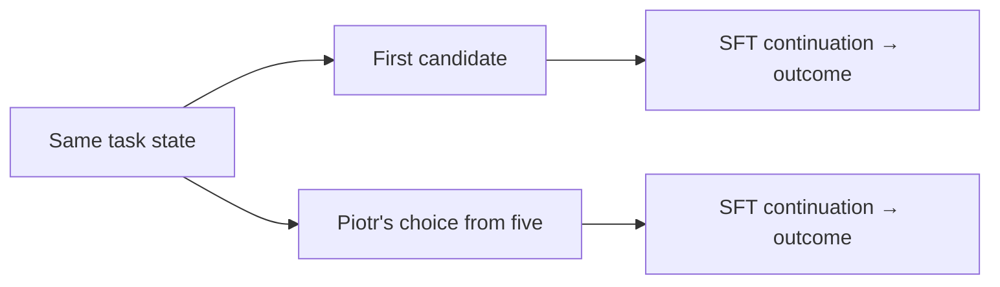
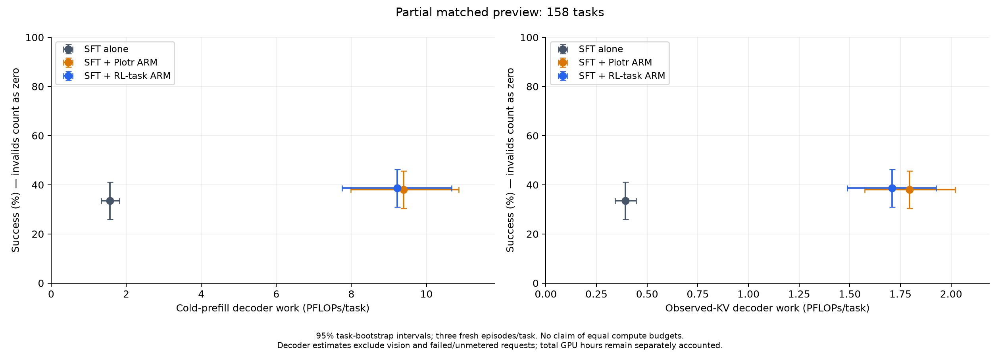
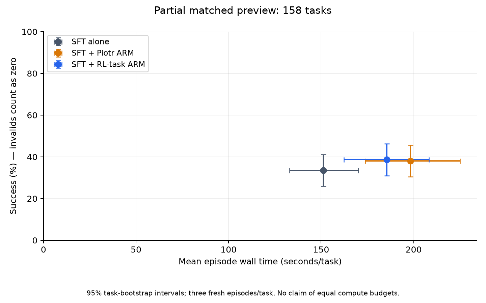
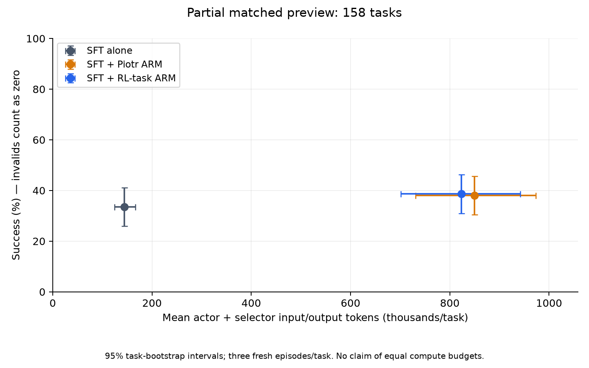
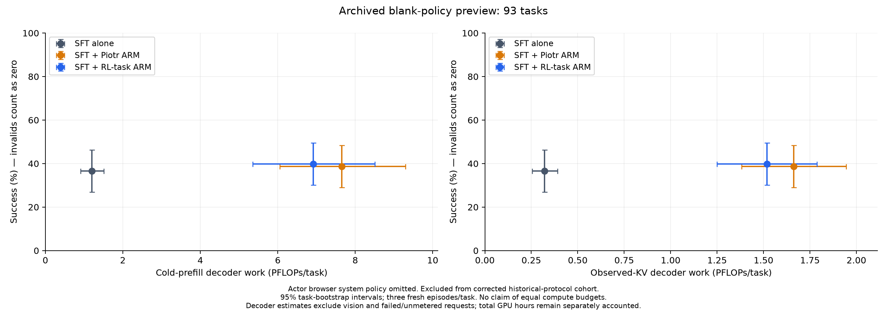
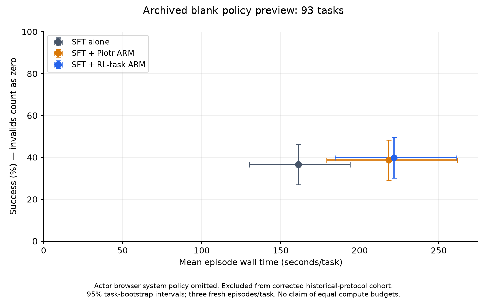
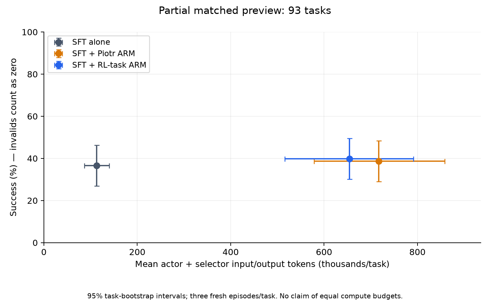
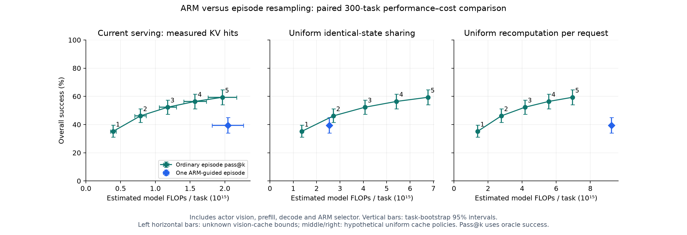
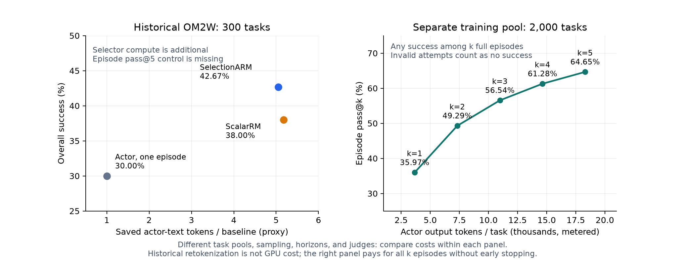

# ARM inference and judge protocol

[Current full300 results: three complete SFT/Piotr runs and same-day 30/50 comparison](#selectionarm-piotr-sameday30-20261007).

## RL actor with Piotr SelectionARM — October 7 cohort, complete

**All 600 episodes verified. Piotr adds +11.33 percentage points, paired 95% interval [+5.33, +17.33].** Both arms use fresh browser episodes on the same 300 Online-Mind2Web tasks; invalid and unjudged episodes remain zero.

| Released RL actor | N | Tasks | Successes | Success | Valid tasks | Valid-only success |
| --- | ---: | ---: | ---: | ---: | ---: | ---: |
| Alone | 1 | 300 | 128 | 42.67% | 277 | 46.21% |
| With Piotr SelectionARM | 5 | 300 | 162 | 54.00% | 272 | 59.56% |

There are 59 ARM-only wins and 25 actor-only wins. **Only actor weights change relative to the SFT setup:** the SFT prompt/frontend and Piotr's SFT base stay fixed, with 30 steps, T=0.7, top-p=0.9, 1,024 response tokens and seed 45. This is one paired run under that harness, not the released RL model's native prompting benchmark.

Compared with the existing seed-45 SFT pair (+7.00 pp), the gain difference is **+4.33 pp [−3.00, +11.33]**. The interval does not establish a larger benefit on RL; the SFT episodes also have different collection times. [Aggregate](arm_results/selectionarm_piotr_rlactor30_20261007/aggregate.json) · [Four-outcome task-bootstrap comparison](arm_results/selectionarm_piotr_rlactor30_20261007/sft_rl_gain_comparison.json).

Frozen protocol, paired analysis and validity

| Setting | Frozen choice |
| --- | --- |
| Actor weights | OpenWebRL/OpenWebRL-4B, revision `616cc8f2fbc5281b3554b0a11cf6206b8a6ed0f7` |
| Actor frontend | Previous SFT prompt, tokenizer, image preprocessing and thinking prefill; native RL weight bytes |
| Selector | Piotr SelectionARM revision `81b452d800d9f859687074f82680dd5257e02d89`; original SFT base, greedy canonical index selection |
| Decoding | T=0.7, top-p=0.9, top-k omitted; 1,024 response tokens, 32K context, 30 steps |
| Seeds | Request seed 45; server seeds 4500/4501 |
| Browser / judge | Local process browser; o4-mini/AgentTrek, 4,096 judge tokens |
| Pairing / uncertainty | All 300 task pairs; 10,000 whole-task bootstrap draws, seed 42 |

The four-outcome comparison resamples each task with both actors and both selector conditions together. Its interval retains their covariance but does not establish a causal actor-by-selector interaction across collection times. A single run does not estimate across-run variance, website drift or judge error. FlashInfer does not honor request seeds; recorded seeds do not guarantee identical trajectories.

| Endpoint | RL alone | RL + Piotr |
| --- | ---: | ---: |
| Terminal episodes with saved judge verdict | 256 | 263 |
| Step-cap zero | 5 | 7 |
| Response-length-cap zero | 16 | 2 |
| Browser reset/navigation invalid | 21 | 22 |
| Browser-step invalid | 2 | 6 |

The 270 common-valid tasks have 124 actor-alone and 162 ARM successes: conditional paired gain +14.07 pp [+7.78, +20.37]. This subset is supplementary; the primary denominator stays 300. Canonical AgentTrek success permits partial progress. All saved verdicts match API receipts and terminal images decode, but no judge-input image hash or independent human adjudication is available.

Final accounting, efficiency and three plots

| Shard | Attempts | Allocated seconds, all attempts | Approved seconds | Remaining seconds | Judge calls | Judge USD | Judge cap USD |
| --- | ---: | ---: | ---: | ---: | ---: | ---: | ---: |
| 0 | 2 | 6,106 | 10,800 | 4,694 | 265 | 2.7009 | 5.00 |
| 1 | 2 | 6,343 | 10,800 | 4,457 | 254 | 2.6883 | 5.00 |

Each shard used 2 H200 / 16 CPUs / 240 GiB and retained its independent 1,320 judge-call cap. Total use is **6.9161 allocated H200-hours and USD 5.3892 for 519 judge calls**. Initial pre-model failures consumed four and three seconds; all attempts are included. Both final jobs completed, W&B finished at 300 records per shard, all API receipts settled, and model/browser process cleanup passed. No added budget or transfers.

| Condition | Mean episode latency, s | Actor + selector input/output tokens per episode | Mean browser steps |
| --- | ---: | ---: | ---: |
| RL alone | 133.5 | 96,121 | 11.11 |
| RL + Piotr | 174.0 | 609,203 | 11.89 |

[Compute proxy](arm_results/selectionarm_piotr_rlactor30_20261007/cost.png) · [Latency](arm_results/selectionarm_piotr_rlactor30_20261007/latency.png) · [Tokens](arm_results/selectionarm_piotr_rlactor30_20261007/tokens.png).

The compute proxy is 2 × 4B × generated actor/selector tokens; it excludes prefill, attention, vision and cache effects, and is neither measured FLOPs nor dollars. Tokens cover all metered attempts. Latency is episode wall time under this campaign's concurrency. Native weight/frontend hashes, serving identities, action/selection traces, fixed task pairing, saved artifacts, all-attempt accounting and the three plots passed final review. Raw task payloads remain private.

## Selective sampling and policy likelihood — October 7

**Two new SFT conditions, 300 episodes each, on the same 300 tasks.** Both retain T=0.7, top-p=0.9, 1,024 response tokens, 30 steps, request seed 45, the frozen actor prompt, local browsers and canonical o4-mini/AgentTrek judging. **Both 300-episode conditions are complete.** [Design and launch record](arm_results/likelihood_scaling_plan_20261007.json).

| Question | Decision rule |
| --- | --- |
| Can selective sampling save compute? **Exploratory** | Sample one candidate. If its mean base-policy log-probability is below the frozen threshold, sample four more and apply unchanged Piotr selection to all five; otherwise execute the first. |
| Can the actor select its own proposals? | Always sample five; choose the highest mean base-policy log-probability, breaking ties by the first index. |

The score covers the **full generated response**, including reasoning and action. Native generated tokens count; synthetic delimiter/newline repairs do not. Duplicates and malformed candidates remain eligible. Likelihood is a confidence heuristic, not a calibrated success probability. All 300 task IDs remain in each evaluation denominator, with invalid/unjudged outcomes zero.

**Completed exploratory gate:** 101 successes on 300 tasks (**33.67%**), a **+0.67 pp [−4.33, +5.67]** paired difference from SFT; 29 gated-only and 27 SFT-only wins. It trails always-Piotr by **−6.33 pp [−12.00, −0.67]**. Gate activation was **18.72%** (907 of 4,844 decisions), averaging **1.749 candidates**. The cutoff used final-decision responses from the same evaluation tasks; this is not independent calibration or a noninferiority result. [Combined aggregate](arm_results/selectionarm_adaptive5_sft30_20261007/publication-aggregate.json).

Exploratory gate: final validity, accounting and three plots

| Method | Tasks | Successes | Valid tasks | Invalid tasks | Success | Valid-only success |
| --- | ---: | ---: | ---: | ---: | ---: | ---: |
| Gated Piotr | 300 | 101 | 263 | 37 | 33.67% | 38.40% |

Both jobs and W&B runs finished, all saved verdicts match settled receipts, and teardown was verified. Each shard used **4,423 and 3,936 of 10,800 approved seconds**, including the 48-second failed startup each: **4.644 H200-hours total**, **169 judge calls / USD 1.382707**, with no transfers. All 8,472 returned candidates' native scores were independently recomputed, with 907 Piotr calls and zero selector fallbacks.

Metered actor usage is 79,296,206 input and 2,789,103 output tokens across 8,483 physical requests; 11 failures have no returned token usage. Piotr adds 3,151,229 input and 7,809 output tokens. Calibration/probes add 3,481,230 metered input and 32 output tokens across 286 requests, including 278 calibration requests and two unmetered startup failures. Mean episode wall time is 187.20 seconds; hardware and collection times differ from controls.

A versioned auditor repair accepts the actual selector-health schema (pinned checkpoint path) and binds it to approved plans, manifests and checkpoint size/mtime fingerprints. It does not replace those fingerprints with a claim of newly computed weight-content hashes. Four regression tests pass; execution source, threshold and saved data are unchanged.

[Compute proxy](arm_results/selectionarm_adaptive5_sft30_20261007/cost.png) · [Latency](arm_results/selectionarm_adaptive5_sft30_20261007/latency.png) · [Tokens](arm_results/selectionarm_adaptive5_sft30_20261007/tokens.png). These five-way plots include reused SFT/Piotr/random controls; no compute-matched causal inference is claimed. The generated-token proxy excludes prefill, vision, attention, cache effects and likelihood computation; latency is not hardware-matched. Paired-task intervals omit across-run variation, website drift and judge error, and are not multiplicity-adjusted.

**Completed likelihood result:** 80 successes on 300 tasks (**26.67%**), versus SFT’s 99 (**33.00%**): **−6.33 pp [−11.33, −1.33]**, with 21 likelihood-only and 40 SFT-only wins. It also trails random-of-five by **−6.67 pp [−12.00, −1.33]** and Piotr by **−13.33 pp [−18.67, −8.00]**. Controls share tasks and decoding but were collected separately; intervals are task-paired, not across-run uncertainty. [Aggregate](arm_results/selectionarm_likelihood5_sft30_20261007/publication-aggregate.json).

Likelihood result: validity, final accounting and three plots

| Method | Tasks | Successes | Valid tasks | Invalid tasks | Success | Valid-only success |
| --- | ---: | ---: | ---: | ---: | ---: | ---: |
| SFT N=1, reused | 300 | 99 | 271 | 29 | 33.00% | 36.53% |
| Highest likelihood of five | 300 | 80 | 263 | 37 | 26.67% | 30.42% |

All 5,187 decisions independently reproduce native scores and choose from exactly five candidates; no selector calls or additional inference scoring passes. Both W&B runs finished and teardown was verified. Across all attempts, each shard used 4,443 and 4,372 of its 10,800 approved seconds: **2.449 H200-hours total**, **135 judge calls / USD 0.972124**, with no unsettled receipts or transfers.

Metered actor usage: 264,310,975 input and 8,086,124 output tokens. All 26,000 physical requests are retained, including 65 failures without returned token usage. The eight startup/probability-probe requests include two unmetered failures; successful probes add 44,596 input and 32 output tokens. Mean episode wall time is 209.84 seconds; different hardware and collection times prevent a controlled latency comparison. Bootstrap uses 10,000 paired-task resamples, seed 42; intervals omit website drift, judge error, across-run variation and multiple-comparison correction.

[Compute proxy](arm_results/selectionarm_likelihood5_sft30_20261007/cost.png) · [Latency](arm_results/selectionarm_likelihood5_sft30_20261007/latency.png) · [Tokens](arm_results/selectionarm_likelihood5_sft30_20261007/tokens.png). The proxy is 2 × 4B × generated actor/selector tokens, excluding prefill, vision, attention, cache effects and likelihood computation; it is not measured FLOPs or dollars. Raw trajectories remain private.

Calibration, probability verification and comparison limits

**The uncertainty-gated run is exploratory:** its threshold uses final-decision states from the same evaluation tasks, not an independent, representative calibration set. The always-five likelihood arm uses no calibration threshold.

The gate threshold is the 25th percentile, linearly interpolated at `(n−1)×0.25`, of base-policy scores on **278 saved final-decision states** from the previous SFT N=1 run. Of 300 episodes, 21 lack a saved state and one fails response-token reconstruction; these exclusions use artifact availability and identity checks, never success labels. Historical token IDs were not retained: reconstructed prompt, screenshot and response-token counts are checked against saved receipts. The frozen cutoff is **−0.21557618820922406 nats/token**, independently recomputed from 111,018 scored tokens before adaptive episodes began. Trigger only when the first candidate’s mean score is strictly below this value.

Of the 278 calibration states, **86 are from decision 30**. Final-state sampling and reuse of the evaluation tasks limit generalization even without success-label filtering. Receipt verification establishes score correctness, not representative or held-out calibration; the quartile does not promise a 25% online trigger frequency. Report the observed trigger fraction and mean candidates per decision. Calibration and startup probes consume the approved allocation and retain all request receipts.

SGLang normally reports temperature-scaled output probabilities. These runs enable `SGLANG_RETURN_ORIGINAL_LOGPROB=1`; source and actual actor-environment checks verify the pre-temperature, pre-top-p path. A live multimodal generation/teacher-forcing probe must also pass before collection. Sampling remains T=0.7/p=0.9.

Compare against the existing seed-45 SFT, always-five Piotr and random-five results using paired task-bootstrap intervals. Reused controls have different collection times; this is not a contemporaneous or compute-matched comparison. Request seeds do not imply identical trajectories under the unchanged FlashInfer sampler. Report success counts/rates, paired gains, candidate/selector use, latency, tokens and all-attempt costs; keep calibration overhead explicit.

Approved allocations and supervision

| Method | Shards | GPUs per shard | CPUs per shard | Memory per shard, GiB | Hours per shard, all attempts | Judge USD per shard | Judge-call cap per shard | Initial jobs |
| --- | ---: | ---: | ---: | ---: | ---: | ---: | ---: | --- |
| Uncertainty-gated Piotr | 2 | 2 H200 | 16 | 240 | 3 | 2.50 | 660 | 349547, 349548 |
| Policy likelihood | 2 | 1 H200 | 8 | 120 | 3 | 2.50 | 660 | 349545, 349546 |

The initial startup probes failed before evaluation because image-pad IDs entered vocabulary likelihood indexing. Scoring now starts at the native expanded prompt boundary; both replacement likelihood probes pass. Initial attempts consumed **48 seconds per adaptive shard** and **40 seconds per likelihood shard**; replacement jobs 349551/349552 and 349549/349550 respectively are limited to 179 minutes each, within the unchanged total caps.

Total cap: **18 H200-hours and USD 10 / 2,640 judge calls**, including calibration, probes and all retries. Shard budgets are independent with no transfers. Controllers own model, scoring and browser workers through teardown. Both studies finished with all 600 episodes, paired analyses, final accounting and three plots per study verified. Only aggregates and plots are published.

Action-only likelihood: offline diagnostic and proposed rollout

Score only native tool-call payload tokens, including payload whitespace and excluding reasoning, wrappers, EOS and synthetic formatting. Probabilities remain conditioned on each candidate's own reasoning. Preserve all five proposals; if any lacks an unambiguous nonempty span, select candidate0 for the whole decision. Invalid JSON remains scoreable when its raw span exists.

| Offline comparison | Changed choices | Compared decisions | Changed |
| --- | ---: | ---: | ---: |
| Candidate index | 3,373 | 5,184 | 65.07% |
| Parsed action bundle | 1,444 | 5,178 | 27.89% |

The scan covers all 5,187 saved decisions / 25,935 candidates. Three pools need the declared fallback; six otherwise scoreable selected pairs cannot both be parsed. Duplicate actions explain much of the index/action gap. Independent runtime masks match every saved candidate; including tool wrappers changes 28 of 5,184 choices. No alternative actions were executed: **this is not a success-rate estimate**. [Aggregate and caveats](arm_results/selectionarm_likelihood5_sft30_20261007/action-only-offline.json).

**Fresh rollout remains deferred; the benefit-based threshold study now uses the approved 59-pair fit below.** The prepared design keeps the same 300 tasks, SFT model/prompt, five candidates, T=0.7/top-p=0.9, 1,024 tokens and 30-step horizon. Its separate resource request remains unapproved: two shards, each **1 H200 / 8 CPUs / 120 GiB × 3 hours total**, plus **USD 2.50 / 660 judge calls**, including retries; combined 6 H200-hours and USD 5, with no transfers. Prior controls were collected separately.

## More robust confidence study — replay pilot approved October 9

**Plan by usable independent states, not attempted tasks.** The former 240-task-per-split placeholder is superseded. The initial recommendation targets a 10-percentage-point gain in both the frozen gate versus first action and the frozen gate versus random invocation matched in expansion count.

| Detectable gain in each comparison | Fitting states, provisional | Held-out states | Continuation endpoints at those state counts |
| --- | ---: | ---: | ---: |
| **10 pp: initial recommendation** | **448** | **448** | **5,376** |
| 5 pp: larger option | 1,664 | 1,664 | 19,968 |

Held-out sizing assumes state-level contrast variance at most **1/3**, two-sided familywise α=0.05 across the two comparisons, and 90% power per comparison, giving at least 80% joint power under the planning model. These are conditional estimates for the declared sites, not measured power or a guarantee of learning a useful threshold. The fitting counts are development budgets to assess with fit-only learning curves; the held-out power calculation does not establish a required fitting sample size. Three continuations per choice reduce noise without tripling the independent state count. [Reproducible sizing and sensitivity scenarios](arm_results/selectionarm_confidence_robust_20261008/sample-size.json).

**Task supply must grow.** At 50% full-resolution yield, the 10-point design provisions 960 attempted tasks per split under an illustrative binomial model; only 1,277 families remain after pilot and final-policy reservations. Equal allocation across the eight sites is more constrained still. Expand and audit the input pool before outcome collection; neither easy-site substitution nor replacement based on missing outcomes is part of this plan. The old evidence and completed-study budgets remain unchanged.

**First test whether diverse states can be reproduced reliably.** The follow-up starts with 32 fixed fresh tasks across eight websites and target decisions **2, 5, 10 and 15**. At each reached state, six independent browsers must reproduce the same complete actor input before any future action-choice comparison. A task ending early stays in the denominator; an easier state cannot replace it.

This approved confidence-replay pilot is separate from the branching/distillation pilot. Six browsers anticipate **three continuations per choice** in the later outcome study; this first stage executes no target action, selector or judged continuation. Sixteen old states provide separate failure diagnostics and do not count toward fresh coverage. A pass establishes pre-action feasibility only: it cannot certify reliable post-action captures or complete continuation outcomes.

| Pilot scope | Fixed states/tasks | Maximum browser sessions |
| --- | ---: | ---: |
| Historical replay diagnostics, three pairs each | 16 | 96 |
| Fresh prefixes and six replicas each | 32 | 224 |
| **Total** | **48** | **320** |

**Approved pilot:** 1 H200, 8 CPUs, 240 GiB, at most **2 hours total across all attempts**; at most 224 local SFT prefix generations plus two synthetic probability checks; **zero selector/judge calls and USD 0 API spend**. Recovery job **351682** is running: startup validation passed and browser collection has begun, with a 117-minute cap and an active agent callback. Both prior attempts remain charged to the same two-hour total. [Aggregate proposal](arm_results/selectionarm_confidence_robust_20261008/proposal.json).

Prospective replay contract and expansion criteria

Preserve the SFT checkpoint, prompt/frontend, temperature 0.7, top-p 0.9, 1,024 response tokens and 32K context. Pin full observations, images, histories and processed inputs from the live browsers. Preassign replica 0 as the reference and use each replica’s first complete target observation, with the existing bounded internal capture checks; do not repeatedly observe until replicas happen to match. Capture age and cross-replica skew must be at most 30 seconds. Read-only observations at +5 and +15 seconds must remain equal to the admitted inputs. Agreement among current replicas is a **new prospective observation population**; historical-reference agreement is recorded separately. Do not insert a matching screenshot into a frontend built from a different observation, mask page regions, weaken old checks or revise the completed study. Visible-input agreement cannot prove equality of unobserved website state. These checks establish parity and sampled short-term stability; a later bounded post-action validation is still required before outcome collection.

Before expanding to outcome collection, require all 32 dispositions, at least 24 reached targets, at least 80% of reached targets and at least 20 total states passing the six-replica contract, six sites with at least two passes each, eight passes at decision ≥5 and four at ≥10. These are engineering criteria, not an estimated population guarantee. Report timeouts, early termination and mismatches separately; apparent ARM benefit cannot affect acceptance. A failed pilot stops expansion and preserves its fixed inputs and failures.

The deployed eight CPUs remain below the approved 16-CPU ceiling and satisfy the partition limit. Two startup failures consumed **124 seconds** before any browser sessions: a metadata-loop deadlock, then a stale 16-CPU worker check. Both were repaired; all attempts and scientific inputs remain preserved. The second attempt completed the two authorized numerical probability requests. Recovery explicitly inherits that immutable numerical result while checking the new actor identity, sampler, code and environment; it does not claim a fresh numerical probe or issue extra requests. The 117-minute recovery cap leaves 56 seconds unallocated because of scheduler minute granularity.

Run the fresh cohort first, then historical diagnostics, in a fixed order. The two-hour hard limit may leave some units unstarted; record those dispositions and count them against coverage rather than claiming all physical trials finished. The new allocation includes startup, failures and cleanup; old-study balances are not transferred. Native request accounting and browser ownership must pass before launch. Offline contract tests do not demonstrate live replay reliability.

Offline task-pool expansion audit

After the released exclusions, family deduplication and removal of the old confidence and pilot families, the broader source contains 3,790 unused families on the original eight sites at the existing difficulty rubric ≥5. Five sites still fall short of the proposed 270 families each: 120 fit, 120 held-out and 30 reserved for later policy evaluation. Adding other sites at the same rubric cannot supply eight equally sized sites. Lowering the rubric to ≥3 supplies 26,905 families and clears that metadata quota, but changes the study population. Unequal site quotas also require new weights and a revised precision calculation; neither change is frozen here.

Historical availability receipts cover only 16 start-page probes, not every task. These counts establish source supply, not current reachability, replay yield or training-unseen status. The fixed pilot proceeds independently; no broader pool has been dispatched.

Outcome study and fresh policy validation: staged roadmap

After the replay pilot and bounded post-action reliability validation, prepare exact resources from measured throughput and **full six-endpoint resolution yield**. A pre-action replay pass fraction alone cannot supply that yield. Use one fixed state per distinct task family and one saved five-candidate pool for both choices; duplicate/same-choice cases remain. Preserve all six endpoints, pairing repeat seeds across choices. Freeze the task list, admission criteria, attempted-task cap and treatment of missing evidence before outcomes; finish every planned disposition. Shortfall reduces precision and does not authorize replacements or extra physical attempts.

Compare a small, prespecified set of first-response features: full-response likelihood, action-only likelihood and a simple benefit predictor. Features requiring the extra four candidates cannot decide whether to generate them. Finalize one primary gate and its fitting procedure before outcome collection, freeze it before verification, and compare with first action, always-Piotr and an outcome-independent random gate matched in invocation rate. Report task-level intervals, site/depth coverage and sensitivity to leaving out each website.

Keep a provisional reserve of 240 further task families for fresh, concurrent **every-step** evaluation of first action, the frozen gate and a random gate. This reserve is bookkeeping, not a power-derived final sample size; the policy study needs its own sizing and exact allocation. Matching random invocation probability gives expected sampling use, not identical realized cost on diverging trajectories. Measure actual candidates, tokens, latency and success. One-action interventions do not establish an every-step policy effect.

Pilot, fit, verification and final-policy cohorts must be task-family disjoint; “unused” does not mean unseen during model training. Keep held-out outcomes inaccessible until the fitting procedure, score transformation, threshold and primary contrasts are frozen. Assess fitting adequacy using family-grouped five-fold learning curves at 25%, 50%, 75% and 100% of each training fold, out-of-fold utility, expansion frequency and bootstrap rule stability. A stable always/never rule is allowed. Any additional fitting or nuisance-variance-based sizing happens before held-out results are opened, with separate exact resources; do not grow evaluation until a positive result appears. [Selection and evaluation separation](https://jmlr.org/papers/v11/cawley10a.html).

Power, yield, site coverage and resource assumptions

For each state, let D be the mean of three paired Piotr-minus-first outcomes, g the frozen gate, and q the held-out expansion fraction. Gate-minus-first is mean(gD); gain over expected count-matched random invocation is mean(gD)−mean(g)mean(D). The second comparison's influence function is (g−q)(D−mean(D))−gain. Its variance is not automatically the raw Piotr-minus-first variance. Recompute q within every task-family bootstrap and retain all repeats together.

The sizing calculation uses the noncentral-t paired-test approximation with α=0.025 per comparison and 90% marginal power. Minimum held-out counts under variance 1/3 are 417 and 1,658; round upward to multiples of 32 for eight site strata and four depth targets. The nonlinear random-gate contrast and bounded outcomes make this a planning approximation. At variance 1/2, the rounded counts rise to 640 and 2,496; at variance 1, to 1,248 and 4,992. These are alternative assumptions, not estimated properties of the new population. [Power formula](https://support.minitab.com/en-us/minitab/help-and-how-to/statistics/power-and-sample-size/how-to/hypothesis-tests/power-and-sample-size-for-paired-t/methods-and-formulas/methods-and-formulas/).

The claim is conditional on the fitted gate truly having the target benefit in **both** comparisons. It says nothing about the probability that fitting discovers such a gate. Synthetic bounded-outcome checks validate the estimator algebra and null behavior; they do not validate real replay coverage or scientific power. Fitting and evaluation counts remain distinct decisions.

| Assumed full-resolution yield | Fit attempts provisioned | Held-out attempts provisioned | Total attempted tasks | Fits current aggregate reserve? |
| --- | ---: | ---: | ---: | --- |
| 80% | 608 | 608 | 1,216 | Yes; equal eight-site supply still insufficient |
| 50% | 960 | 960 | 1,920 | No |
| Old fit 19.67%, old held-out 13.33% | 2,496 | 3,680 | 6,176 | No |

Each row provisions at least 97.5% modeled probability of reaching 448 usable states within each split, giving at least 95% jointly under independent, homogeneous task-resolution assumptions. This provisions the total count only: rounding allocations to 32 does not guarantee usable quotas in all site/depth cells. Heterogeneous site/depth failures can invalidate the model; uneven usable cells require a new weighted-precision calculation. Simple n/y would give only expected yield, not that probability. These are fixed precollection attempt estimates, not an instruction to stop or replace based on outcomes.

The current pool has 1,549 unused families; reserving 32 pilot and 240 later-policy families leaves 1,277, of which 1,198 are on the eight major sites. The smallest major site has 95 families: after its four pilot and 30 later-policy reservations, only 61 remain for both stage-2 splits. Equal site allocation therefore permits at most 488 stage-2 attempts from this pool. More source tasks are required even for the optimistic balanced design. Any unequal weighting must be declared before collection and its weighted variance recalculated; actual missing cells cannot be hidden by the overall count.

Power applies to independent task-family states with balanced usable strata and fixed represented-site inference. Unequal usable counts require stratified weighted variance accounting. Generalization to new sites needs more independent sites: under an illustrative eight-site random-effects model with variance 1/3 and site ICC 0.02, even arbitrarily many tasks retain a 10.17-pp detectable-effect floor for the joint claim. Do not reinterpret a larger task count as stronger unseen-site evidence.

At the target state counts there are six endpoints per state; issued failures and any separately authorized retries add work. At the 50% provision, the ceiling is 11,520 scientific endpoint slots if all 1,920 planned states qualify, before retries. Startup, prefixes, selectors, suffixes, judge calls and cleanup must all enter the final allocation estimate. Exact GPU-hours and judge dollars remain unset until measured throughput and receipts are available. The two-hour replay pilot is approved separately; this does not authorize the larger outcome-study allocation.

## Selecting a threshold by measured ARM benefit — October 8

**The frozen rule keeps the first action; the held-out comparison is inconclusive.** Fitting selected “never invoke Piotr.” On the 20 usable held-out pairs, this rule succeeds on 10 and Piotr on 7: **+15.00 pp, paired 95% interval [−5.00, +35.00]**, exact paired p=0.375. Only **13.33%** of the 150 fixed held-out tasks yield replay-eligible pairs, so this result does not establish a general benefit or harm from confidence gating.

| Rule at the sampled decision | Successful continuations | Usable held-out pairs | Success rate |
| --- | ---: | ---: | ---: |
| First action — control | 10 | 20 | 50.00% |
| **Frozen rule: keep first action** | **10** | **20** | **50.00%** |
| Always use Piotr's choice | 7 | 20 | 35.00% |

The frozen rule and first-action control reuse the same outcomes: their difference is zero by construction. This study changes **one sampled action per task**, then resumes ordinary SFT; it is not the full-episode, every-step selector benchmark above. All **450 fixed task dispositions** are retained. The approved fitting amendment uses 59 complete pairs and preserves one missing eligible pair; all 20 eligible held-out pairs are complete.

**What are the 59 pairs?** Each is one sampled state from a different fitting task, with two recorded continuation outcomes: execute the first candidate, or execute Piotr's choice from the same five candidates, then continue with ordinary SFT. Thus 59 pairs contain **118 outcomes**. Of 300 fitting tasks, 60 yielded eligible states; 59 have both outcomes and one remains missing. Piotr picked candidate 0 on 36 of the 59 states, so those pairs compare separate continuations after the same proposed action.

[Held-out utility and paired interval](arm_results/selectionarm_confidence_benefit_20261008/complete-pairs59-heldout-utility.png) · [Coverage](arm_results/selectionarm_confidence_benefit_20261008/complete-pairs59-coverage.png) · [State depth](arm_results/selectionarm_confidence_benefit_20261008/complete-pairs59-heldout-depth.png) · [Verified aggregate results](arm_results/selectionarm_confidence_benefit_20261008/complete-pairs59-final.json).

Frozen fit and the approved missing-pair amendment

| Prespecified rule | Successful continuations | Complete fitting pairs | Success rate | Pairs using Piotr under rule |
| --- | ---: | ---: | ---: | ---: |
| **Keep the first action — selected** | **27** | **59** | **45.76%** | **0** |
| Invoke Piotr below score q25 | 24 | 59 | 40.68% | 18 |
| Invoke Piotr below score q50 | 23 | 59 | 38.98% | 37 |
| Invoke Piotr below score q75 | 22 | 59 | 37.29% | 44 |
| Always invoke Piotr | 22 | 59 | 37.29% | 59 |

These fitting estimates are optimistically selected. The five rules maximize paired success, breaking ties by fewer ARM calls, then the lower cutoff. The q25/q50/q75 cutoffs are −0.20164765 / −0.17092938 / −0.13696538 in mean native full-response log-probability, with strict score < cutoff. All **292 scored fitting states**, including replay-rejected states, define this grid. No held-out outcome changed the rule or threshold.

**Complete-pairs59-v1 amendment:** omit the final unresolved pair from utility fitting only. It remains prospectively eligible with two null outcomes in the original 300-task record. This amendment followed replay failures; missingness is not assumed random. All four hypothetical binary outcome combinations for that pair still select the first-action rule, but these are sensitivity scenarios, not observed or imputed outcomes. The original strict held-out validator admits no missing eligible pair. [Frozen fitting snapshot and sensitivity](arm_results/selectionarm_confidence_benefit_20261008/complete-pairs59-fit.json).

| Descriptive fitting subset | Complete pairs | First / frozen-rule successes | Piotr successes |
| --- | ---: | ---: | ---: |
| Untouched original evidence | 44 | 22 | 18 |
| Completed paired redraws | 15 | 5 | 4 |

The groups follow the fixed redraw manifest, not outcomes. They differ in prior evidence availability and were not randomized; this is collection-version sensitivity, not a causal comparison. The one unresolved redraw target remains missing. No refitting was performed.

Coverage, sampled decisions and repeat controls

| Split | Planned tasks | Scored states | Eligible pairs | Complete pairs | Missing eligible pairs | Complete / planned |
| --- | ---: | ---: | ---: | ---: | ---: | ---: |
| Fit | 300 | 292 | 60 | 59 | 1 | 19.67% |
| Held out | 150 | 148 | 20 | 20 | 0 | 13.33% |

Held-out exclusions comprise 128 prefix-replay failures and two tasks without a sampled state. The replay failures include 111 visible-state differences, 16 raster-check failures and one prompt/history difference; every rejection precedes intervention release. These are coverage exclusions, not failed-success outcomes. Of the 40 eligible branch outcomes, 26 are judged and 14 receive canonical zero under the unchanged invalid/unfinished-outcome rules.

| Sampled decision | Selected held-out states | Complete pairs |
| --- | ---: | ---: |
| 1–3 | 98 | 17 |
| 4–10 | 34 | 0 |
| 11–20 | 11 | 1 |
| 21–30 | 5 | 2 |

Seventeen of the 20 usable pairs come from decisions 1–3. The 20 pairs cover only three sites: 11 arxiv.org, eight allrecipes.com and one wolframalpha.com. The inference chiefly concerns early, replayable states and is heavily concentrated in two sites.

| Descriptive subgroup | Pairs | First-action successes | Piotr-branch successes | First-only successes | Piotr-only successes |
| --- | ---: | ---: | ---: | ---: | ---: |
| Piotr chose candidate 0 — repeat control | 9 | 3 | 2 | 1 | 0 |
| Piotr chose another candidate index | 11 | 7 | 5 | 3 | 1 |
| All usable pairs | 20 | 10 | 7 | 4 | 1 |

Candidate-0 repeat discordance measures continuation/browser/judge variation, not an action-selection benefit. Another candidate index can contain a duplicate action; these groups do not establish action distinctness. Each branch has only one continuation. Subgroups are descriptive and did not tune the threshold. The interval uses 10,000 task-cluster bootstrap draws; it conditions on the frozen rule and usable tasks, is marginal rather than multiplicity-adjusted, and does not capture website drift or judge error.

Question, fixed design and evidence validation

Does low first-candidate likelihood identify decisions where Piotr improves downstream success? Use 300 fitting tasks to choose among never, q25/q50/q75 and always; freeze the rule before paired interventions on the separate 150-task verification set. The split comes from the existing 2,000-task ARM curation pool with no exact task-ID or normalized-instruction overlap with the evaluation 300; shared sites and prior difficulty filtering limit independence and representativeness.

At one uniformly hash-selected reached decision per task, preserve the first candidate and sample four more from the identical prompt. Compare the first candidate with Piotr's choice, followed by ordinary SFT continuations within the original 30-decision horizon. Keep official SFT, T=0.7, top-p=0.9, 1,024 response tokens, native untempered full-response mean log-probability and the unchanged index-only Piotr selector. Preserve duplicate and malformed proposals, saved actions and replay tolerances. Observable replay matching does not clone hidden remote-server state; common seeds do not guarantee matched FlashInfer draws.

Independent validation checks all 150 fixed held-out dispositions, all 148 candidate pools and selector receipts, 592 extra candidate draws, and 470 suffix probability receipts. The amended freeze precedes held-out admission, extra candidates, selection and suffix generation. Original strict validators, models and decoding receipts pass; all raw fitting rows, the missing pair and the frozen artifact hash remain unchanged. Raw tasks, images, trajectories and receipt paths remain private.

Final all-attempt accounting and telemetry

| Shard | Allocated seconds used | Original cap, seconds | Unused seconds | Judge calls | Judge cost, USD | Judge cap, USD |
| --- | ---: | ---: | ---: | ---: | ---: | ---: |
| 0 | 7,866 | 14,400 | 6,534 | 50 | 0.419547 | 5.00 |
| 1 | 6,012 | 14,400 | 8,388 | 36 | 0.307105 | 5.00 |

Both held-out jobs completed successfully. Time includes every failed, recovery and verification allocation; each shard retains its independent **2 H200 / 16 CPU / 240 GiB × 4-hour total** and **USD 5 / 1,320 judge-call** limits. No transfer or additional budget was used. All-attempt judge usage totals 86 calls and USD 0.7266512; durable receipts and ledgers are authoritative.

Both W&B evaluation runs finished and synced. Their last summaries lag durable completion: shard 0 reports 49 rather than 50 judge calls and 224 rather than 225 local dispositions; shard 1 reports 35 rather than 36 calls, 523 rather than 524 native requests in the final attempt, and 224 rather than 225 dispositions. Historical failures and these telemetry discrepancies remain documented. Four historical selector attempts per shard have unknown token usage; no zero usage is imputed. [Final aggregate accounting](arm_results/selectionarm_confidence_benefit_20261008/complete-pairs59-final.json).

Historical replay failures and remaining-budget accounting

**Approved October 8 amendment:** recollect both branches for all 16 fixed unresolved anchors, producing at most 32 fresh continuation outcomes. Keep the 44 complete pairs, all historical missing evidence, fixed states, candidate pools, Piotr choices and replay checks. Only suffix draws after the saved intervention are new. Use each designated new pair regardless of its outcome; no old-counterpart fallback or favorable-attempt selection. Under that earlier amendment, renewed missing evidence still blocked the unchanged fitter and held-out dispatch. The later complete-pairs59 amendment supersedes that fitting requirement. Mixing original and recollected pairs does not remove replay-selection or missingness bias.

Recovery jobs **350607 / 350608** ended after **1,451 / 284 allocation seconds**, respectively. Shard 0 completed all 12 replacement pairs and stopped at the fit barrier to preserve its remaining budget while shard 1 queued. Shard 1 completed three replacement pairs; its last pair failed replay before any candidate intervention or suffix generation. Both owned model/browser cleanups are verified. The 30 recovered endpoints contain 10 judged outcomes and 20 canonical zeros; the two missing endpoints remain missing. [Approved protocol](arm_results/selectionarm_confidence_benefit_20261008/paired-redraw-amendment.json) · [Terminal redraw audit](arm_results/selectionarm_confidence_benefit_20261008/paired-redraw-result.json).

**Additional bounded replay, job 350741:** the user approved one more physical pair with a 30-second read-only observation window per role and unchanged matching. It exhausted those windows, producing 16 rejected frames per role and no candidate interventions, suffix draws or judge calls. The startup probability check used one synthetic generation and one teacher-forced scoring request; these are separate from scientific task inference. Cleanup is verified. This attempt used 105 allocation seconds and preserved all 59 complete pairs and the other 299 fitting dispositions.

**Replay blocker before the complete-case amendment:** every captured frame differs from the saved state only in the promotional banner (rows 44–95); all pixels below it are identical. The closest first-candidate frame has mean RGB difference 1.423 and 1.351% of pixels with a channel difference over 8; the closest Piotr frame has 0.520 and 0.647%, respectively. The unchanged limits are 0.5 and 0.1%. Both windows settle on another repeated banner frame that also fails. These finite windows do not prove no matching frame can ever recur, but they provide no demonstrated repair. The additional physical-attempt authorization is exhausted. No image masking, tolerance change, replacement state or missing-outcome imputation was applied. [Bounded replay audit](arm_results/selectionarm_confidence_benefit_20261008/banner-replay-result.json).

That replay attempt ended without a threshold. The later complete-case amendment permits fitting on the 59 complete pairs and then resuming only the original held-out tasks. It does not authorize another fitting replay or a replacement state. No new compute or judge budget was added.

**Historical evidence before the approved redraw:**

Shard 0 has 108 replay-ineligible tasks and four tasks without a reached state, leaving 38 eligible pairs. A bounded capture repair retries observations up to three times within the original 30-second deadline, without redispatching the action or relaxing equality. One recovery pass targeted 31 missing endpoints while preserving all original states, pools, Piotr choices and 11 surviving counterparts. Surviving counterparts were replay witnesses only: no candidate intervention, suffix draw or judge call.

The pass recovered **11 endpoints** (five judged, six canonical zeros), completing nine more pairs. **20 endpoints remained unresolved at that earlier cutoff:** 14 have independently verified image drift from the saved actor inputs; six fail the unchanged capture check. Existing draws can only be reused for identical inputs. Fresh draws on changed images, relaxed replay matching or fitting only resolved pairs would change the frozen design. All attempts remain available; no unchanged retry was launched. Recovery in a fresh browser does not establish identity with the original hidden browser/server state.

Shard 1 recorded all 150 fitting dispositions, with **18 resolved and four unresolved eligible pairs**. Its eight missing endpoints comprise six persistent capture mismatches and two verified raster mismatches after eligibility release. All four are same-choice repeat controls; choosing the same action does not establish equal rollout outcomes. No missing endpoint has an unlinked verdict or restorable browser state. There is no demonstrated further mechanical repair under the unchanged rules. Fresh paired trajectories would require a separately declared protocol amendment.

**Accounting before the held-out continuation (all fitting/recovery attempts):**

| Shard | Allocated seconds used, all attempts | Original cap, seconds | Unused seconds | Judge calls | Judge cost, USD | Judge cap, USD |
| --- | ---: | ---: | ---: | ---: | ---: | ---: |
| 0 | 7,086 | 14,400 | 7,314 | 38 | 0.327405 | 5.00 |
| 1 | 5,112 | 14,400 | 9,288 | 22 | 0.188586 | 5.00 |

Each shard is independently capped at **2 H200 / 16 CPUs / 240 GiB × 4 hours total** and **USD 5 / 1,320 judge calls**, including every attempt; no transfers. Accounting includes all original and recovery attempts. Original model identities, native probability probes and W&B run identities are verified. Scheduler/W&B failure labels reflect the controlled stops, not successful study completion; durable evidence and reconciled ledgers determine the scientific disposition and usage. Four historical selector attempts per shard have unknown token usage; no zero usage is imputed.

**Historical pre-redraw diagnostics:** [Coverage](arm_results/selectionarm_confidence_benefit_20261008/coverage.png) · [Sampled decisions](arm_results/selectionarm_confidence_benefit_20261008/decision_depth.png) · [Recovery dispositions](arm_results/selectionarm_confidence_benefit_20261008/recovery_dispositions.png). These are partial data-quality diagnostics, not a fitted threshold or ARM-effect estimate. Raw tasks, images and trajectories remain private.

Historical October 6 partial three-run overlap: 160 tasks

## SFT versus Piotr ARM: three-run mean and standard deviation

**Same 160 tasks in every column; 960 recorded episodes.** The three runs are the October 6 corrected initial collection and its two stochastic repeats. September is a separate historical reference. At the October 6 cutoff, the initial corrected collection was incomplete. The new October 7 run now supplies a [separate three-run full300 summary](#selectionarm-piotr-sameday30-20261007). This common subset is selected by collection duration and should not be read as a full-benchmark result.

| Metric | Initial corrected run | Repeat 1 | Repeat 2 | Three-run mean ± SD |
| --- | ---: | ---: | ---: | ---: |
| SFT success | 53/160 = 33.13% | 57/160 = 35.63% | 57/160 = 35.63% | **34.79 ± 1.44%** |
| SFT + Piotr ARM success | 62/160 = 38.75% | 64/160 = 40.00% | 64/160 = 40.00% | **39.58 ± 0.72%** |
| ARM gain | +5.63 pp | +4.38 pp | +4.38 pp | **4.79 ± 0.72 pp** |

SD is the **sample standard deviation across the three run-level rates** (`ddof=1`), not a confidence interval or standard error. The gain row computes ARM minus SFT within each run before taking mean and SD. Recorded invalid and unjudged outcomes stay zero; missing episodes are excluded equally from all columns. Both fresh repeats are now full300 complete. This three-run table remains restricted by the initial corrected run to 160 paired tasks; the full300 two-repeat summary follows below.

Actor/model/policy/decoding and judge settings match across these three October runs. Scheduling differs: the initial collection also ran the RL-task selector. Request seed labels are 42/43/44; FlashInfer does not honor those per-request labels, while the fresh repeats use explicit distinct server RNG seeds. Interpret the SD as observed run-to-run variability, not a pure seed-only variance estimate.

[Aggregate counts, mean/SD and task-identity verification](arm_results/rl_integration/sft-piotr-three-run-summary-20261006.json) · [Full300 repeat progress and efficiency plots](#sft-piotr-repeats-20261006).

## SFT versus Piotr ARM: both full300 repeats complete — October 6

**Both repeats are complete: 1,200/1,200 episodes, with both arms on all 300 tasks in each repeat.** All four jobs completed; model/seed/decoding receipts, browser teardown, W&B terminal states and independent final scheduler/API accounting are verified. Invalid and unjudged recorded outcomes remain zero.

| Metric, full300 | Repeat 1 | Repeat 2 | Two-run mean ± sample SD |
| --- | ---: | ---: | ---: |
| SFT success | 100/300 = 33.33% | 98/300 = 32.67% | **33.00 ± 0.47%** |
| SFT + Piotr ARM success | 115/300 = 38.33% | 113/300 = 37.67% | **38.00 ± 0.47%** |
| ARM gain | +5.00 pp | +5.00 pp | **+5.00 ± 0.00 pp** |

The mean paired gain is **+5.00 percentage points**, with a **95% task-cluster bootstrap interval of +1.50 to +8.50 pp** (50,000 draws). Each resampled task retains both arms and both repeats. These are 300 task clusters, not 600 independent tasks. The interval conditions on these two repeats; it does not estimate uncertainty over arbitrary future seeds. The zero gain SD means the two observed gains happen to match, not that the gain has zero uncertainty.

| Mean across both full300 repeats | Episode latency | Actor + selector input/output tokens | Browser steps |
| --- | ---: | ---: | ---: |
| SFT alone | 144.8 s | 146,124 | 14.76 |
| SFT + Piotr ARM | 214.6 s | 926,945 | 16.20 |

| Repeat | Allocated H200-hours | Judge requests | Settled judge spend | Shard wall seconds / 10,800 each |
| --- | ---: | ---: | ---: | --- |
| 1 | 8.3094 | 360 | $3.0531 | 7,363; 7,594 |
| 2 | 8.3406 | 364 | $3.0187 | 7,765; 7,248 |
| **Total** | **16.6500** | **724** | **$6.0717** | All four independent caps respected |

The repeats retain the corrected historical actor/browser/judge code and pinned policy/model revisions: **actor T=0.7, top-p=0.9, top-k omitted, 1,024 output tokens per candidate per turn, 30 turns, 32K context, full history/current screenshot; greedy Piotr selection and o4-mini/AgentTrek judging with a 4,096-token judge cap.** Historical September manifests and archived evaluator code also specify 1,024 actor tokens; the historical judge call had no explicit completion cap. This is separate from the 4,096-actor-token local v2 study.

Each repeat contains two disjoint 150-task shards. Actor-server RNG seeds are 4300/4301 and 4400/4401; request seed labels are 43 and 44. FlashInfer and nondeterministic inference are unchanged, so request labels do not guarantee batch-independent replay. Startup-gate episodes remain included; there were no outcome-based reruns.

Each shard retained its own **2 H200 / 16 CPU / 240 GiB × 3 hours** and **$5 / 1,320 judge calls**, including all attempts. No budget transfers or additional allocations were used. All judge receipts are settled. Judge spend is evaluation overhead, not actor/selector deployment cost.

[Combined full300 aggregate](arm_results/rl_integration/sft-piotr-repeats-final-20261006/combined.json) · [Final tracker](arm_results/rl_integration/sft-piotr-repeats-20261006.json).

| Final artifacts | Decoder compute | Episode latency | Input/output tokens | Aggregate |
| --- | --- | --- | --- | --- |
| Repeat 1 | [Plot](arm_results/rl_integration/sft-piotr-repeats-final-20261006/repeat-1/cost.png) | [Plot](arm_results/rl_integration/sft-piotr-repeats-final-20261006/repeat-1/latency.png) | [Plot](arm_results/rl_integration/sft-piotr-repeats-final-20261006/repeat-1/tokens.png) | [JSON](arm_results/rl_integration/sft-piotr-repeats-final-20261006/repeat-1/aggregate.json) |
| Repeat 2 | [Plot](arm_results/rl_integration/sft-piotr-repeats-final-20261006/repeat-2/cost.png) | [Plot](arm_results/rl_integration/sft-piotr-repeats-final-20261006/repeat-2/latency.png) | [Plot](arm_results/rl_integration/sft-piotr-repeats-final-20261006/repeat-2/tokens.png) | [JSON](arm_results/rl_integration/sft-piotr-repeats-final-20261006/repeat-2/aggregate.json) |

Compute plots use analytical decoder PFLOPs, with cold-prefill and observed actor KV-reuse views. They exclude vision encoders, failed/unmetered requests and hardware overhead, so they are neither dollar costs nor measured total FLOPs. Tokens include received actor and selector input/output, including cached input. Latency is episode wall time. Browser/reset failures, fixed-context rejections, screenshot failures and selected-wait timeouts remain in the overall scores. Raw trajectories and task payloads stay private.

## Same-task historical gain and saved-verdict audit — October 6

**The task set was not switched.** Both September manifests specify the same 300 task IDs in the same order as the corrected October collection and both repeats. Their recorded task-file SHA256 matches all three recent files byte for byte: `8343c23be98d6d63856e9b53ff3884222be099cc0f55ad5edb475176f54317ed`. This checks the task definitions as well as their IDs.

**Why 158?** The corrected October collection saved only 493 of 900 planned episodes before its allocation caps: SFT has 165 task records, Piotr 163, and the RL-task ARM 165. Only 158 tasks have all three arms. The historical verdict audit reused that three-arm intersection for consistency with the original corrected table; it is a coverage restriction, not a different task sample or a requirement that every episode receive a judge verdict. For **SFT versus Piotr alone**, 160 paired tasks are available. The [three-run summary above](#sft-piotr-three-run-summary-20261006) uses all 160, including the two tasks missing only the RL-task ARM.

**On the same 158 tasks, the historical Piotr ARM gain was +10.13 pp; the corrected gain is +4.43 pp.** Restricting September's full300 cohort removes 2.54 pp of its +12.67 pp gain. The remaining cross-date gain change is −5.70 pp (50,000 paired task-bootstrap draws, 95% interval −15.19 to +3.16 pp). This is not a randomized test of harness changes, website drift or judge variability.

| Same 158 tasks | September successes | Corrected October 6 successes | Change |
| --- | ---: | ---: | ---: |
| SFT alone | 48/158 = 30.38% | 53/158 = 33.54% | +5 successes |
| SFT + Piotr SelectionARM | 64/158 = 40.51% | 60/158 = 37.97% | −4 successes |
| ARM minus SFT | +16 = +10.13 pp | +7 = +4.43 pp | −9 = −5.70 pp |

Across the available baseline/Piotr records there are 82 changed binary outcomes on 64 unique tasks; 75 changes are in this matched subset. **Only 23 of the 82 pairs have actual judge verdicts on both runs** (22 in the matched subset). The other 59 involve at least one zero assigned without invoking the judge. Both dates exhibit this behavior; an unjudged zero is not a negative model judgment.

The following is an exact decomposition of matched outcome flips, **not causal attribution**. Positive counts mean more October successes. Unchanged outcomes contribute zero.

| Type of changed outcome | SFT net successes | Piotr net successes | Contribution to change in ARM advantage |
| --- | ---: | ---: | ---: |
| Both runs actually judged | −2 | −8 | −3.80 pp |
| Unjudged zero from step/output limit | +6 | 0 | −3.80 pp |
| Unjudged zero from invalid execution | +1 | +4 | +1.90 pp |
| **Total** | **+5** | **−4** | **−5.70 pp** |

Thus all unjudged-zero transitions together account for **−1.90 pp**, one-third of the observed matched reduction. The baseline gained seven net successes in those transitions versus four for Piotr; invalid-execution changes alone actually narrowed the reduction. In the 120 tasks with valid records in all four old/new baseline/Piotr runs, historical successes are 43 versus 60 and corrected successes 46 versus 54, so invalid runs alone do not explain the difference.

**Manual review covers all 23 both-judged pairs plus four unjudged-zero examples.** Saved screenshots, verdicts and final responses reveal a mixture of actual navigation/access differences, unsupported factual or constraint claims on both dates, and unequal partial-progress credit. The original AgentTrek rubric explicitly permits some partial completion and more than eight effective actions. Therefore a strict-completion failure is not automatically a rubric violation. The judge also sees actor-written reasoning and a last saved pre-action image, so its explanatory prose is not independent ground truth.

The remaining unjudged pairs retain explicit unreviewed labels in the private task table; all raw screenshots and task-level assessments stay local. No original verdicts or headline metrics were overwritten. Reviewing only outcome flips cannot estimate an unbiased judge-error rate or justify a rescored leaderboard; a balanced, blinded audit would also need unchanged outcomes and a prespecified grading standard.

[Matched-cohort aggregate](arm_results/rl_integration/historical-verdict-audit-20261006/same-task.json) · [Verdict coverage and decomposition](arm_results/rl_integration/historical-verdict-audit-20261006/verdict-audit.json)

## Corrected historical-protocol comparison — partial, October 6

**493/900 corrected episodes are saved; both allocations have ended.** This paired comparison uses the **158 tasks with all three arms complete** (474 episodes). The remaining 19 committed episodes are preserved but unmatched, and 407 of the planned 900 are missing. This duration-selected subset is not a full300 result. Invalid outcomes count as zero overall. The earlier 402 blank-policy records remain separate and are excluded here.

| Actor / selector | N | Success on matched tasks | Valid-only success | Mean episode latency | Mean actor + selector tokens |
| --- | ---: | ---: | ---: | ---: | ---: |
| Official OpenWebRL-SFT alone | 1 | **53/158 = 33.54%** | 53/141 = 37.59% | 151.2 s | 144,631 |
| SFT + Piotr SelectionARM | 5 | **60/158 = 37.97%** | 60/139 = 43.17% | 198.2 s | 849,698 |
| SFT + RL-task SelectionARM | 5 | **61/158 = 38.61%** | 61/137 = 44.53% | 185.5 s | 823,200 |

Piotr minus SFT is **+4.43 pp** (paired 95% interval −1.27 to +10.76 pp); RL-task ARM minus SFT is **+5.06 pp** (−1.90 to +12.03 pp). RL-task ARM minus Piotr is +0.63 pp (−5.70 to +6.96 pp). These intervals include zero; the partial corrected results do not establish the cause or size of the difference from September's +12.67 pp gain.

The actor policy is restored, with T=0.7, top-p=0.9, top-k omitted, 1,024 output tokens and the historical 30-turn/o4-mini protocol. All 493 result artifacts and decision traces were verified. The 454 saved actor histories contain the exact 4,180-character policy; the other 39 records failed before any actor request. Exact served model and judge identities were checked, along with decoding and actor/selector token receipts for all 474 matched episodes. No selector fallback occurred. This protocol differs from the T=1.0/p=0.95/4,096-token local v2 Luna/Jev/Kev comparison. The historical seed and terminal-screenshot limitations remain as documented below.

| Independent shard | Corrected records | All-attempt allocation time / 4h cap | GPU-hours | Judge calls | Settled judge cost | Original time remaining |
| --- | ---: | ---: | ---: | ---: | ---: | ---: |
| 0 | 187/450 | 14,258 / 14,400 s | 7.9211 | 246 / 1,980 | $2.0357007 / $10 | 142 s |
| 1 | 306/450 | 14,277 / 14,400 s | 7.9317 | 308 / 1,980 | $2.4399177 / $10 | 123 s |

**Final scheduler/API accounting and owned-process teardown are verified; the requested cohort is incomplete.** All failed and interrupted attempts remain charged. Jobs 347424/347425 ended at their planned allocation-shutdown boundaries; their scheduler status is `FAILED`, not completed. The remaining seconds cannot restart three model servers. No budget was extended or transferred. W&B status and receipts are retained under the separate corrected lineages.

The three plots use the same 158 tasks and task-bootstrap intervals. Cost is shown as **decoder-work estimates**, with cold-prefill and observed-KV views; these exclude vision, failed/unmetered requests and hardware overhead, and are not measured total FLOPs or dollar prices. All-attempt GPU time and evaluation-judge spend are reported separately above. Tokens include received input/output for actor and selector, including cached input.

[Audited aggregate](arm_results/rl_integration/historical-corrected-partial-20261006/aggregate.json) · [Compute-cost plot](arm_results/rl_integration/historical-corrected-partial-20261006/cost.png) · [Latency plot](arm_results/rl_integration/historical-corrected-partial-20261006/latency.png) · [Token plot](arm_results/rl_integration/historical-corrected-partial-20261006/tokens.png)

## High-priority historical-gain audit — October 6

**A recent harness bug is confirmed: the actor's browser system policy was missing.** The frozen October4 controlled-inference source and October 6 three-arm source omitted `system_prompt_browser_env.md`; their loader silently substituted an empty string. Saved historical trajectories contain the 4,180-character policy, byte-identical to the repository asset (SHA256 `7028b29a14e6be1ff05e36a7ae708a89ab32529efad6cc47d2a388e531449aa9`). Recent saved trajectories have an empty system message. Task goals and tool schemas were still supplied. This corrects our earlier claim of historical actor-prompt equivalence.

| Cohort | Episodes audited | Saved policies available | Empty policies | Overall success |
| --- | ---: | ---: | ---: | ---: |
| September SFT baseline | 300 | 278 | 0 | 90/300 = 30.00% |
| September Piotr SelectionARM | 300 | 275 | 0 | 128/300 = 42.67% |
| October4 ordinary actor0 | 300 | 279 | 279 | 106/300 = 35.33% |
| October4 Piotr SelectionARM | 300 | 279 | 279 | 118/300 = 39.33% |
| October 6 SFT baseline, stopped | 134 | 124 | 124 | 52/134 = 38.81% |
| October 6 Piotr ARM, stopped | 132 | 121 | 121 | 56/132 = 42.42% |
| October 6 RL-task ARM, stopped | 136 | 125 | 125 | 56/136 = 41.18% |

Episodes that failed before creating message history have no saved policy to inspect. The unequal October 6 rows above are an artifact audit, not a paired performance comparison. October4 ordinary pass@1 remains the mean over five episodes, 35.20%; actor0 is shown here to make its trace coverage explicit. The completed October4 cost/pass@k comparison remains evidence for its **blank-policy harness**, not a controlled replication of September.

**The causal contribution to the smaller ARM gain is still unmeasured.** Removing the policy changes the actor's proposal distribution and potentially the selector's benefit; the direction and magnitude cannot be read off these cross-date results. Neither historical inflation nor complete explanation of the 12.67pp → 4.13pp change has been established.

**A second control problem concerns sampling seeds.** Historical and recent server logs show FlashInfer sampling with deterministic inference disabled and varying global server seeds. The currently installed sampler only materializes per-request seeds when deterministic inference is enabled; its FlashInfer top-p call does not pass the request seed. Among historical first decisions with identical saved prompt/image/request-seed inputs, all 67 pairs produced different candidate0 outputs; October 6 baseline/Piotr gives 44/44. Thus recorded request seeds did not establish repeatable or shared draws. These checks are evidence of a reproducibility limitation; the complete historical dependency environment was not immutably archived. The policy repair keeps the sampler unchanged to avoid combining two interventions.

**What the saved-data audit did not find:** candidate-seed bookkeeping, one-based selector-index conversion and chosen-response/assistant-history mapping all pass across 24,386 audited decisions. No selector fallback occurred. Historical versus October4 Piotr ARM chose candidate0 on 56.5% versus 56.5% of decisions; all five executable actions were identical on 30.4% versus 30.4%. There is no evidence here of an index bug or a collapse in proposal diversity. Assistant-history matching establishes that the chosen response reached execution parsing, not that the website applied it successfully. Nineteen historical interrupted-prefix decisions were preserved separately before matching the final committed attempts.

The existing judge checks still find no outcome-parser mismatch or observed truncation at the new 4,096-token cap. Both harnesses judge only `Status.COMPLETED` episodes and use the last captured pre-action screenshot. Those are shared protocol limitations, not a newly isolated explanation of the changed gain. Live-site state, concurrency, runtime and judge realization remain additional uncontrolled differences.

**Repair and recovery:** stopped both affected jobs after 402 committed episodes and verified owned-process cleanup. Preserved every record, interrupted attempt, original source and API reservation. Restored the exact historical policy, pinned all browser prompt assets, made missing/blank policies fail before browser startup, and added an actual actor-input guard before every model call. Thirty-seven targeted tests, two frozen-controller dry runs and a real frozen-runtime loader check pass. Corrected episodes use a separate directory, namespace and W&B lineage; the old 402 do not count toward the corrected 900 target. Each shard continues charging its original judge ledger.

| Shard | Corrected job | Prior allocation time charged | Maximum corrected allocation | Combined reserved time | Judge cap including all attempts |
| --- | ---: | ---: | ---: | ---: | ---: |
| 0 | 347424 | 2h26m42s | 1h33m | 3h59m42s | $10 / 1,980 calls |
| 1 | 347425 | 1h57m | 2h03m | 4h | $10 / 1,980 calls |

Both corrected jobs used 2 H200 / 16 CPU / 240 GiB and ran in parallel. They have now ended with 493/900 episodes; [the corrected partial table and final accounting](#arm-rltasks-corrected-partial-20261006) supersede the submission snapshot. This adds no budget. The continuation-branch experiment already has its prompt assets pinned and is unaffected by this omission. [Aggregate audit and coverage](arm_results/rl_integration/historical-harness-audit-20261006.json).

## Fresh comparison of original and RL-task SelectionARM — October 6

**Correction: the blank-policy collection stopped at 402 episodes. Corrected jobs 347424/347425 were submitted within the remaining original budgets.** See the [high-priority harness audit](#arm-historical-harness-audit-20261006); the historical-prompt equivalence claim below is superseded. The following startup/receipt-repair narrative is retained as history. **Earlier snapshot: 298/900 records at 15:10 PDT.** Jobs 347256 and 347257 replace 347180 and 347181 within their original caps. Both passed the prespecified startup gate and now use their eight-browser queues. The user requested the earlier protocol behind the first table in ARM_SUMMARY (30.0% baseline / 42.7% original SelectionARM), then explicitly added Piotr's ARM as a fresh third arm. No historical outcome is substituted for a fresh result. The matched preview below is incomplete and may overrepresent tasks that finish quickly.

| Arm | Actor | Selector | Proposals per decision | Fresh OM2W episodes | Status |
| --- | --- | --- | ---: | ---: | --- |
| Baseline | Official OpenWebRL-4B-SFT | None | 1 | 300 | Collection started; repair deployed |
| Original ARM | Same SFT | PTeterwak/OpenWebRL-4B-SelectionARM | 5 | 300 | Collection started; repair deployed |
| RL-task ARM | Same SFT | davidan03/openwebrl-4b-selectionarm-rltasks | 5 | 300 | Collection started; repair deployed |

**Matched settings:** actor temperature **0.7**, top-p **0.9**, **1,024** output tokens, seed **42**, **30** browser steps, **32,768** context, full text history and one current screenshot, local browsers, 1,800-second episode timeout. The actor request preserves the original omission of top-k; the native `/generate` implementation uses `SamplingParams` defaults, rather than the chat endpoint's model-generation defaults. Both ARMs receive the original canonical task/URL/recent-history/current-screenshot prompt and five full reasoning/action candidates, with greedy constrained `{"selection": N}` output and the same 128-token selector cap. Execute the chosen candidate unchanged.

Pinned revisions: actor `15e777db2ddba2e0e82080ebccd3ad8d215b7f0a`; Piotr ARM `81b452d800d9f859687074f82680dd5257e02d89`; new ARM `a1f8d265855ddf1074eae91516c6e86f6f836177`. The new weights match their Hugging Face checksum and the actor tensor schema; vocabulary and chat-template checks pass for both selectors. Its [checkpoint repository](https://huggingface.co/davidan03/openwebrl-4b-selectionarm-rltasks/tree/a1f8d265855ddf1074eae91516c6e86f6f836177) is pinned before launch.

The canonical o4-mini/AgentTrek judge sees executed thoughts/actions and terminal screenshots and judges only completed episodes. A common 4,096-token judge cap meters this new collection; the original September request was uncapped. Browser/runtime and collection date also differ from September, so the three fresh arms form the matched comparison and the old table remains historical.

**Approved resources:** two independent jobs in parallel, each **2 H200 / 16 CPUs / 240 GiB for up to 4 hours across all attempts**; **16 GPU-hours maximum combined**. Each receives 150 disjoint tasks and runs all three conditions with randomized within-task arm order, an eight-browser pool, SFT on one GPU and both 4B ARM services on the other. Judge ceilings are **$10 / 1,980 calls per shard**, totaling **$20 / 3,960 calls**. These are ceilings; allocations exit once their queues finish. No budget transfer from the continuation experiment or earlier studies is allowed.

Report success overall and valid-only, all three paired task-bootstrap contrasts, common-valid sensitivity, invalid causes, actor/selector input and output tokens, episode/request latency, browser steps/time, judge spend, allocated GPU-hours and device utilization/power. Request seconds overlap, and shared-device totals are not per-arm kernel time. Preserve every attempt and separately account for retries; resume only missing committed slots.

Initial model identities, local-browser progress, W&B routing and canonical o4-mini usage receipts were verified. Four episodes committed before the repair; these remain in the primary sample, including two browser-aborted outcomes. No success-rate conclusion is available from this startup sample.

**October 6 receipt-I/O repair:** synchronous durable writes to shared storage blocked the browser event loop, serializing otherwise concurrent candidate responses. Receipt persistence and judge-ledger transactions now run in awaited threads; cancellation still waits for active writes, and ledger locking/caps are unchanged. The repair passed **26 targeted tests**, including cancellation, token counting, concurrent judge reservations and attempt identity. Six supervisor tests and both repaired-controller dry runs also pass. The actual source, scheduler attempt and logging phase are saved in new episode records. Final reporting retains all primary outcomes/costs and adds a common-phase latency sensitivity view; the separate analysis regression passes.

| Shard | Prior attempt | Accounted prior time | Replacement | Maximum replacement time | Total reserved across attempts |
| --- | ---: | ---: | ---: | ---: | ---: |
| 0 | 347180 | 26m24s | 347256 | 3h33m | 3h59m24s |
| 1 | 347181 | 42s | 347257 | 3h59m | 3h59m42s |

Each shard keeps its original 2 H200 / 16 CPU / 240 GiB allocation shape and $10 / 1,980 judge-call ceiling. The four committed outcomes, interrupted attempts, old frozen source and API receipts are preserved. Only missing committed slots resume. Actual served models, sampling receipts, canonical judge receipts and both running W&B identities have been verified. The persistent supervisor follows the replacement IDs and has a verified active-agent queue receipt. [Aggregate protocol, progress and resource accounting](arm_results/selectionarm_rltasks_historical_20261006.json).

**Context-limit diagnosis:** three shard-0 episodes reached the fixed 32,768-token limit when the full prompt was combined with the 1,024-token completion allowance. These outcomes remain invalid in the primary sample and count as zero overall; neither history nor the context/output limits were changed. The HTTP client made 60 HTTP attempts per rejected candidate request, producing 660 rejected HTTP requests across those three episodes. A narrowly scoped fail-fast patch passes five offline cases, including unchanged successful and transient-error behavior. It is prepared for the next otherwise-required recovery, but is **not deployed**: interrupting eight active task groups to remove this bounded retry delay would discard useful work. Browser page-load failures and these input-limit failures remain separately diagnosed. Allocation time includes the retries; logical actor-request counts do not count each transport retry separately.

### Archived blank-policy preview — 93 of 300 tasks

**This saved preview predates the missing-policy diagnosis. It is not a historical-protocol replication and is excluded from the corrected cohort.** The plots below retain their original 15:10 snapshot.

Only the **93 tasks with all three committed outcomes** enter this preview (279 episodes). Invalid outcomes count as zero; the other 19 committed episodes remain saved and accounted for. This is a duration-selected partial cohort, not the full300 result.

| Arm | Success | Valid-only success | Invalid episodes | Mean episode latency | Mean actor + selector tokens |
| --- | ---: | ---: | ---: | ---: | ---: |
| SFT alone | 34/93 = 36.6% | 41.0% | 10 | 161.2 s | 112.9k |
| SFT + Piotr ARM | 36/93 = 38.7% | 43.4% | 10 | 218.3 s | 717.4k |
| SFT + RL-task ARM | 37/93 = 39.8% | 46.2% | 13 | 221.7 s | 654.2k |

| Paired contrast | Success difference | 95% task-bootstrap interval |
| --- | ---: | ---: |
| RL-task ARM − SFT | +3.2 pp | [-6.5, +12.9] pp |
| Piotr ARM − SFT | +2.2 pp | [-6.5, +10.8] pp |
| RL-task ARM − Piotr ARM | +1.1 pp | [-9.7, +11.8] pp |

All three difference intervals include zero. The aggregate preserves common-valid comparisons and the receipt-I/O phase sensitivity; no winner is established.

**Cost interpretation:** both compute panels estimate decoder work from actual actor/selector token receipts. One charges full prefill for every request; the other uses observed actor KV-cache hits. Both exclude vision encoders, failed/unmetered requests and hardware overhead, so neither is total measured FLOPs or a dollar price. Tokens include cached input. Episode latency is wall time, while request durations overlap. Whole-allocation GPU-hours and evaluation-judge dollars include every attempt and remain separately reported; shared GPUs do not support exact per-arm dollar attribution.

[Aggregate preview, paired uncertainty and accounting](arm_results/selectionarm_rltasks_historical_20261006/aggregate.json). The offline reporting checks pass 18 tests covering matched cohorts, invalid outcomes, separate retry budgets, final-accounting gates, token receipts and both selector variants. Final reporting still requires all 900 episodes and terminal scheduler/API accounting.

Inference-time ARM selection, terminal-success judge alignment, and unavailable-task retry policy. Initial benchmark results and retries retain separate denominators. See [all experiment results](ARM_RESULTS.md) for comparison with standalone training.

## Contents

- [High-priority historical-gain audit: missing actor policy and sampling control](#arm-historical-harness-audit-20261006)
- [Fresh baseline, Piotr ARM and RL-task ARM comparison](#arm-rltasks-three-arm-20261006)
- [Partial matched performance and efficiency plots](#arm-rltasks-three-arm-preview-20261006)
- [Consolidated Qwen/SFT/GPT-6/Jev/Kev results and scaling comparisons](ARM_INFERENCE_SCALING.md)
- [Controlled full300 ARM versus episode pass@5 experiment](#arm-controlled-inference-20261004)
- [Inference cost versus episode pass@k](#arm-inference-cost-passk-20261004)
- [ARM inference results on Online-Mind2Web](#arm-inference-results)
- [ARM judge alignment audit](#arm-judge-alignment)
- [ARM matched retry status and results](#arm-inference-retry-results)

---

## Actor and selector experiments: consolidated report

The eleven completed Qwen/SFT/GPT-6/Jev/Kev comparisons, costs, pilots and harness caveats now live in [ARM_INFERENCE_SCALING.md](ARM_INFERENCE_SCALING.md). The former planning and recovery narrative is preserved in [document history](https://github.com/zixianma/OpenWebRL/blob/50c6ab6/openwebrl/docs/ARM_INFERENCE.md). The anchors above keep older incoming links usable.

## Controlled full300 ARM versus episode pass@5 — October4

**October 6 correction:** this completed comparison used an empty actor system policy because its frozen source omitted the prompt asset. Its within-harness results remain recorded, but historical prompt equivalence is withdrawn. See the [harness audit and repair](#arm-historical-harness-audit-20261006).

**Completed and independently verified: all1,800 episodes, all300 paired task
blocks, original result/decision-trace hashes, final Slurm accounting and both
finished W&B runs.** “Six episodes” means one ARM-guided episode and five
ordinary episodes per task; it is not a claim that their costs are equal.

### Completed performance–cost comparison

| Policy | Overall success | ARM minus policy, pp [paired 95% interval] | Mean browser-step calls/task |
| --- | ---: | --- | ---: |
| ARM, five candidates/turn |39.33% (118/300) |— |15.89 |
| Ordinary pass@1 |35.20% |+4.13 [-0.13, +8.40] |14.39 |
| Ordinary pass@2 |46.17% |-6.83 [-11.40, -2.20] |28.77 |
| Ordinary pass@3 |52.30% |-12.97 [-17.43, -8.23] |43.16 |
| Ordinary pass@4 |56.40% |-17.07 [-22.13, -12.27] |57.55 |
| Ordinary pass@5 |59.33% |-20.00 [-26.00, -14.33] |71.94 |

Ordinary pass@k averages all k-subsets of each task's five ordinary outcomes.
Pass@1 is528/1,500 pooled episode successes, not a selected seed. Fixed actor0
is106/300 (35.33%). ARM's gain over ordinary pass@1 is+4.13pp, with a paired
interval spanning zero. Against pass@5 it is−20.00pp;10 tasks succeed only with
ARM and70 only with ordinary resampling (exact discordance p=3.16×10⁻¹²).
All invalid attempts remain failures in these overall denominators.

**Mean dominant forward FLOPs per task, in10¹⁵ operations.** These include
actor and selector vision, prefill and decode. Cache bounds are distinct from
statistical confidence intervals; the detailed counting assumptions follow.
Uniform sharing credits exact full-state/image reuse and omits partial-history
prefix hits. Its absolute costs can therefore exceed the current-serving
estimates; the columns describe different cache policies.

| Policy | Observed KV hits, vision-cache bounds | Uniform identical-state sharing | Uniform fresh prefill/vision per request |
| --- | ---: | ---: | ---: |
| ARM |1.815–2.269 |2.544 |9.249 |
| Ordinary pass@1 |0.352–0.434 |1.369 |1.391 |
| Ordinary pass@2 |0.703–0.868 |2.723 |2.781 |
| Ordinary pass@3 |1.055–1.302 |4.073 |4.172 |
| Ordinary pass@4 |1.407–1.736 |5.421 |5.562 |
| Ordinary pass@5 |1.758–2.170 |6.767 |6.953 |

For these recorded episodes, **ordinary pass@4 has higher oracle success and
lower estimated model work than ARM even across opposite vision-cache bounds**:
56.40% at1.407–1.736×10¹⁵ FLOPs versus39.33% at1.815–2.269×10¹⁵. This statement
concerns model work, not browser use, latency or total deployment dollars.
The current-serving equal-bound estimates put ARM just beyond the measured
pass@5 cost curve, and the fresh-prefill view puts it further beyond; do not
extrapolate a matched-budget score beyond five episodes.

Under the hypothetical uniform identical-state cache, ARM costs
2.544×10¹⁵ FLOPs. An outcome-independent mixture of13.17% one-episode and
86.83% two-episode trials matches that mean cost and achieves
**44.72%** oracle success. ARM minus this comparator is
**-5.39pp**, paired task-bootstrap95% interval
**[-10.63, -0.12]pp**. The upper endpoint is close to zero. This cache policy is
an implementation model, not demonstrated serving performance; the bootstrap
re-estimates both costs and the mixture weight on each task resample.

**Browser cost changes the trade-off.** ARM uses15.89 browser-step calls/task,
compared with57.55 for four ordinary episodes. At equal expected browser-step
count, an ordinary one/two-episode mixture scores
36.34%; ARM's difference is
+2.99pp [-1.49, +7.47]pp.
This comparison does not equalize model compute. Mean recorded episode time
is184.3s for ARM and135.3s for one ordinary episode, but these times include
shared queues, browser initialization and judging; they do not establish
matched-resource deployment latency. Browser-step calls include terminal done.

**Oracle limitation.** Pass@k asks whether any sampled episode succeeded. A
deployed system still needs a selector/verifier and must pay for its errors
and cost. All success labels come from the same o4-mini/AgentTrek judge;
no independent human adjudication was performed. Label errors, especially
false positives across multiple trials, can affect the oracle comparison.
These results therefore favor episode resampling as an oracle
compute–performance reference, and do not prove that a deployable best-of-k
agent achieves these rates. The experiment tests this frozen SelectionARM
with five proposals, not the complete ARM candidate-count frontier.

**Failure and robustness audit.** There are166 invalid episodes:126 failures
before the first actor request,28 browser-step failures and12 context-limit
exhaustions. The40 rejected actor requests associated with those context
failures never reached the model scheduler. No selector fallback or backend
retraction was observed. Treating context exhaustion as an observed policy
failure gives264 tasks with all six operationally valid episodes: ARM112/264
(42.42%) versus ordinary pass@5 171/264 (64.77%). The raw all-six-valid panel
has253 tasks; neither sensitivity replaces the all300 primary denominator.

**Actual research cost and recovery.** The complete collection consumed
**20.269 H200 GPU-hours**, including every attempt, versus the32 GPU-hour
ceiling. Per-shard allocated time was4.871h and5.263h, each below its own8h
cap. Terminal-judge accounting is**$8.86** across1,125 calls,
including one unsettled reservation;1,124 returned responses identify
`o4-mini-2025-04-16`. GPU work and evaluator API cost are separate.

The initial CUDA-environment failures343534/343535 consumed33s each and no
episodes. Replacements343537/343538 preserved1,453 committed slots before
their planned allocation guards stopped them; continuations343856/343857
finished the remaining347 within the original ceilings. All allocations are
released. There are1,816 physical attempt directories for1,800 committed
slots, preserving16 interrupted attempts. The policy FLOP curves cover the
committed episodes;210 extra returned actor requests from interrupted attempts,
any unreturned in-flight work and startup/idle overhead remain charged in the
whole-allocation GPU-hour total. Do not confuse research-collection cost with
the cost of deploying either policy.

[Aggregate report](arm_results/rl_integration/controlled-inference-20261004.json) ·
[FLOP CSV](arm_results/rl_integration/controlled-inference-flops-20261004.csv) ·
[Workload CSV](arm_results/rl_integration/controlled-inference-20261004.csv) ·
[FLOP SVG](arm_results/rl_integration/controlled-inference-flops-20261004.svg) ·
[Token/browser plot](arm_results/rl_integration/controlled-inference-20261004.png) ·
[Shard0 W&B](https://wandb.ai/zixianma/openwebrl-evals/runs/arm-controlled-20261004-shard0) ·
[Shard1 W&B](https://wandb.ai/zixianma/openwebrl-evals/runs/arm-controlled-20261004-shard1).
Reproduce with `scripts/report_arm_controlled_inference.py --final`;
`scripts/estimate_arm_inference_flops.py` retains the private per-task cost
index. Public artifacts contain aggregates only. The model-shape, image-resize,
FLOP arithmetic, subset averaging and cache-sharing checks passed; the existing
20 inference/critic regression tests plus six FLOP tests pass.

### Why the fresh result differs from the historical30% →43%

**October 6 correction: the October4 runs had the same missing-system-policy bug as the initial October 6 runs.** Their frozen source omitted the actor's browser policy file and silently substituted an empty system message. September trajectories include the 4,180-character policy. Task goals and tool definitions were still supplied. Every saved policy inspected in October4 actor0 and ARM was empty (279/279 in each; the other episodes failed before saving message history). The same frozen loader served all five ordinary modes.

The smaller observed gain, **4.13pp versus 12.67pp**, is therefore **not a comparison under matching actor prompts**. We have confirmed the bug's presence, not how much of the gain difference it caused. Recorded request seeds also failed to guarantee reproducible draws in both historical and recent serving; live websites, scheduling and runtime differ as well. [Saved-artifact evidence and corrected recovery](#arm-historical-harness-audit-20261006).

The rates below remain valid descriptions of the saved cohorts. October4's within-cohort ARM/pass@k comparison is specifically a comparison under the blank-policy harness; it cannot establish that the historical ARM gain failed to reproduce with the historical actor policy.

| Measurement | September7–8 | October4 | Change |
| --- | ---: | ---: | ---: |
| Ordinary one-episode success |90/300 =30.00% |528/1,500 =35.20% |+5.20pp |
| ARM, five candidates/turn |128/300 =42.67% |118/300 =39.33% |−3.33pp |
| ARM gain over ordinary one episode |+12.67pp |+4.13pp |−8.53pp |
| Ordinary unavailable episodes |33/300 |135/1,500 (27 per300) |fewer |
| ARM unavailable episodes |44/300 |31/300 |fewer |

October4 pass@1 averages the five ordinary episodes; it does not select their
best result. Their separate success rates are35.33%,35.00%,34.67%,37.67%,33.33%.
Using only the first ordinary episode gives35.33% and a4.00pp ARM gain, so the
change in baseline aggregation does not explain the discrepancy.

**Availability does not explain it either.** On the229 tasks valid in both
historical episodes and all six October4 episodes, historical baseline/ARM
successes are82/119:35.81%/51.97%, a16.16pp gain. On exactly those tasks,
October4 ordinary pass@1 is465/1,145 =40.61%, while ARM is101/229 =44.10%:
a3.49pp gain. This post-hoc intersection is a sensitivity analysis, not a
replacement for the all300 denominator. Across all300 tasks, the change in
the ARM gain is−8.53pp, paired task-bootstrap95% interval[−15.07,−1.93]pp.
This10,000-draw interval conditions on the saved cohorts; it does not measure
repeat-seed/date uncertainty or identify a causal explanation.

**Other verified matching ingredients:** the task file is byte-identical; both use
the original frozen actor, the same released SelectionARM tensors with no new
adapter, five full reasoning/action candidates, temperature0.7/top-p0.9,
1,024 response tokens,30 turns,32K context, full history/current screenshot,
local-process browsers, and o4-mini/AgentTrek judging. The selector prompt
builder and greedy constrained JSON rule are unchanged. The older request
omitted top-k; the new request explicitly specifies−1. Both selector loading
paths honor the262,144-pixel cap in CPU processor checks, despite different
serialized processor-size fields; three tested image sizes produce identical
image grids and pixel tensors. There is no evidence here of a refreshed ARM,
a switch to action-only candidates, or a change to a GPT-4.1 judge.

**Changes that were not isolated:** historical generation used seed42 and ran
policy cohorts sequentially (baseline concurrency8, ARM16), with actor and
selector sharing one H200. October4 uses independent task/mode seeds derived
from20261004, shuffled mode order within tasks, eight concurrent task blocks
per shard, and separate actor/selector H200s. Collection dates are almost a
month apart on live websites. Selector Python/PyTorch environments also
changed; bitwise inference equivalence has not been established. The historical
judge metadata identifies the rubric and requested model but lacks the full
response-usage receipts now recorded. The confirmed policy omission is now an additional material difference. Website state, judge realization and runtime differences remain unresolved; their separate causal contributions have not been measured.

**Judge-specific audit.** Both collections request o4-mini, use seed42, and
provide the goal, executed thoughts/actions and final screenshot at high
detail. Neither call explicitly specifies temperature or reasoning effort.
The judge implementation is byte-identical in the pre-existing July git
version, the preserved September9 source, and the October4 deployed source
(SHA256`b1f2c30c852b36d8049e23bd8ef4efb44a0786742449b5e7ef4e5a7ea55af583`).
The old API call did not specify a completion cap; the new budget wrapper sets
`max_completion_tokens=4096` and disables SDK automatic retries. All1,124
new returned responses identify`o4-mini-2025-04-16` and finish with`stop`;
completion usage, including reasoning, ranges96–2,512 tokens. None is blank,
missing a status, or truncated at the cap. All saved historical/current verdicts
agree with a strict extraction of the stated success/failure label, including
two new statuses with curly quotes. No parser discrepancy was found.

The old artifacts do not record the returned model snapshot, usage or finish
reason, so the requested alias and matching prompt do not prove identical API
realization or repeatable labels. Most importantly, AgentTrek is a **lenient
trajectory-progress rubric**: it can accept substantial partial completion,
many correct actions, or an omitted final save. These scores measure success
under that rubric, not independently verified strict task completion. This
applies to both dates and does not itself explain the changed ARM gain; it also
makes false-positive amplification in oracle pass@k a concern. A shared blinded
re-judging of both saved cohorts with one pinned snapshot would isolate grading
variation from changes in collected trajectories. A stricter terminal-success
rubric would be a separately labeled sensitivity applied to every policy.
No re-judging or additional judge API spending occurred in this audit.

The supported conclusion is that ARM improved the historical single episode
and has a smaller, uncertain single-episode gain in the fresh cohort. The new
within-cohort cost/pass@k comparison remains useful, but the historical gain
should not be described as reproduced or stable. The next diagnostic is a
matched old/current harness replay on saved identical states and a blinded,
shared re-judging of saved trajectories; another live comparison should isolate
seeds and runtime settings. None of those additional paid experiments ran here.
[Aggregate reconciliation audit](arm_results/rl_integration/controlled-inference-historical-reconciliation-20261004.json).

### Frozen collection protocol and cost-analysis amendment

| Setting | Prespecified value |
| --- | --- |
| Cohort |All300 Online-Mind2Web tasks; no failure/success filtering |
| Actor |Original OpenWebRL-4B-SFT, frozen; zero optimizer updates |
| ARM |Released SelectionARM `81b452d800d9f859687074f82680dd5257e02d89`; full reasoning/action candidates; no refreshed adapter |
| Comparison |One ARM-guided episode plus five independent actor episodes per task;1,800 committed attempts |
| Execution order |Seed20261004; frozen task order, two150-task shards, independently shuffled six-mode order within each task |
| Sampling |Temperature0.7, top-p0.9, top-k−1,1,024 actor response tokens;30 turns;32K context; full actor history, one current screenshot |
| Browser |Local process, eight concurrent task blocks/shard; fresh episode per attempt; existing EGL child-environment fix included |
| Judge |o4-mini / Online-Mind2Web AgentTrek;4,096 completion tokens; unchanged prompt/parser; SDK automatic retries disabled |
| Timeouts |1,800 seconds per episode including judging;180 seconds per actor request, selector request and judge API attempt; up to four explicit judge attempts |
| Startup gate |First two frozen tasks/shard, all six attempts each, count toward the final cohort; verify functioning actor/ARM/browser paths before scaling |
| Prespecified performance comparison |Paired all-scheduled ARM success minus taskwise actor pass@5 |
| Main cost comparison, clarified during collection |Success versus estimated actor-plus-selector FLOPs under all reported cache views; match expected cost where the measured pass@1…5 curve covers the budget |
| Secondary |Pass@1…5; ARM versus fixed actor0; discordant counts; all-six-valid sensitivity; task-bootstrap intervals |
| Measurements |Backend actor input/output tokens; selector input/output tokens and service time; actual browser-step count/time; request/episode elapsed time; GPU utilization/power samples and whole-allocation GPU-hours |
| Persistence |Original responses, screenshots, candidate traces, judge text, API usage and artifact hashes; resume only independently verified committed slots |
| Approved ceiling |Two shards, each2 H200 ×8h total,16 CPUs,240GiB;32 total GPU-hours including every startup, continuation and retry |
| Initial/replacement request |Four-hour allocation per shard; release immediately after collection; observed startup failures count against the eight-hour total |
| Approved API cap |$50 total and7,200 calls; separate persistent $25/3,600-call shard ledgers, including unsuccessful/interrupted requests |

Run every episode regardless of previous success. Environment/judge-invalid
attempts stay in primary denominators; do not replace them with fresh episodes.
A process interrupted before a slot is durably committed can retry that slot;
its previous artifacts and costs remain recorded. Both shards have independent
eight-hour total budgets; failures cannot reset them. The controller owns and
awaits model servers and collection and releases them on completion/failure.

The selector has its own GPU; the actor uses the other. Concurrent actor
requests can share batches, so client-request seconds are not per-policy GPU
kernel time. Report whole-allocation GPU cost and the separate metered workload
components without mislabeling one as the other. Oracle pass@5 also does not
include a deployable final-episode selector.

The actor receipts also retain backend cache-hit token counts and end-to-end
latency when supplied by SGLang. Report total and uncached input separately;
shared-cache benefits depend on request order. Backend latency includes queues,
while the selector's reported service time starts after its lock is acquired.
Episode elapsed time also includes browser initialization and judging. Token
measurements cover returned responses; interrupted calls can have unreported
work, which remains included in allocation GPU-hours. Thus this is a controlled
policy/protocol comparison with metered costs, not an equal-GPU-budget trial.
One guided episode per task does not establish full-cohort repeatability.

### Performance versus cost: clarification during collection

“All six episodes” means **one guided episode and five ordinary episodes for
each task**. It is the data-collection design, not an assertion of equal cost.
The five ordinary outcomes estimate pass@1…5 by averaging all subsets of each
size. Every episode is collected even after success, so the later samples are
not selected by earlier outcomes. The entire research collection costs more
than either policy would cost when deployed.

Following the user's cost-comparison clarification, report success against
**actor plus selector model FLOPs**, alongside browser work and latency. Keep
the prespecified paired pass@5 comparison, but do not interpret it as a
compute-matched result. The analytic counter includes actor and selector
vision encoders, prompt prefill, autoregressive decoding, attention, vocabulary
projection and all Qwen3-VL DeepStack mergers. It uses saved request token/cache
counts and screenshot dimensions; one multiply-add is two FLOPs. Matrix shapes
were independently checked against the actual model modules without loading
weights or allocating GPUs. These are dominant forward-operation estimates,
not hardware-counter measurements; elementwise operations, kernel padding and
CPU/browser work are excluded. See the [Qwen3-VL report](https://arxiv.org/abs/2511.21631)
for the architecture; even [PyTorch's profiler FLOP option](https://docs.pytorch.org/docs/stable/profiler)
only estimates selected operator types.

| Cost view | Interpretation |
| --- | --- |
| Current implementation | Use observed actor KV-cache hits; bound the unlogged vision-cache work from zero actor encoder misses to recomputation in every uncached prefill chunk. Include every selector forward. |
| Uniform identical-state sharing | Reuse an identical full prompt/screenshot prefill and identical image embeddings within each task/policy. Apply the same rule to ARM candidate draws, the selector and ordinary episode subsets; cache entries never cross models with different weights. This is an idealized implementation comparison; it is not achieved serving cost. |
| Uniform recomputation | Recompute input/vision for every request while retaining normal autoregressive KV reuse within each response. Apply this equally to both policies. |
| Other real costs | Report browser steps/time, episode latency, judge API usage, GPU power/utilization and total allocation GPU-hours separately. Shared batches and queues prevent exact per-policy GPU-hour attribution. |

Show all cache views together; do not choose a favorable assumption from the
outcomes. At a guided policy's mean FLOP budget, interpolate ordinary pass@k
only as an outcome-independent randomized mixture of adjacent k values.
Bootstrap tasks jointly for performance, cost and mixture weight. Report when
k≤5 does not cover the budget; never extrapolate. This matches expected cost
over tasks, not a hard budget for every task. Also show cross-method extreme
vision-cache bounds rather than assuming both methods have identical unknown
cache-hit rates.

Pass@k is the probability that at least one of k episodes succeeds. It is an
oracle success bound: a deployed system needs a way to identify that episode,
whose errors and cost are additional. It therefore cannot, by itself,
establish the performance of a deployable best-of-k selector. All curves pay
for their full sampled episodes; oracle early stopping is not silently credited.

Context-limit HTTP400 failures discovered in the running cohort occur before
GPU scheduler submission. Preserve their raw records and count them as failures
in every overall score. In the additional common-valid sensitivity, count
identified context exhaustion as an observed policy failure, so excluding these
episodes cannot favor a longer-running policy. The frozen serving protocol and
already committed episode slots remain unchanged.

Private frozen schedule, manifest, launch plans and readiness:
runtime `arm-turn-bonus-preparation/controlled-inference-20261004/`.
Source: `reference-arm-controlled-inference-20261004-v1`.
Launcher: `scripts/run_arm_controlled_inference.py`; batch template:
`scripts/run_arm_controlled_inference_2gpu.sbatch`.
The preparation cannot submit allocations. Execution checks the exact recorded
approval, actual Slurm resources, immutable-source hashes, and prior-attempt
elapsed time. API accounting uses the checked
[o4-mini rates](https://developers.openai.com/api/docs/models/o4-mini)
($1.10/M input and$4.40/M output, conservatively ignoring cache discounts).

## Inference cost versus episode pass@k — October4

**The historical benchmark establishes a gain over one ordinary episode. It
does not establish a gain over five complete episodes at comparable compute.**
We reconstructed saved candidate-text costs and separately audited the existing
five-episode screening data. [Aggregate audit](arm_results/rl_integration/inference-cost-passk-20261004.json).
This analysis made no new model calls and launched no GPU work.

Standalone figure: [PNG](arm_results/rl_integration/inference-cost-passk-20261004.png)
or [SVG](arm_results/rl_integration/inference-cost-passk-20261004.svg).

### Historical matched task list:300 Online-Mind2Web tasks

Original SFT actor, temperature0.7/top-p0.9,30-turn horizon, local browser,
o4-mini/AgentTrek judge. Each method has one final result per task.

| Method | Successes /300 | Overall | Valid-only | Saved decisions | Actor responses | Saved actor-text token proxy | Ratio to baseline |
| --- | ---: | ---: | ---: | ---: | ---: | ---: | ---: |
| One actor sample per turn |90|30.00%|90/267 =33.71%|4,698|4,698|1,521,052|1.00×|
| ScalarRM, five candidates |114|38.00%|114/251 =45.42%|4,638|23,190|7,869,942|5.17×|
| SelectionARM, five candidates |128|42.67%|128/256 =50.00%|4,662|23,310|7,687,807|5.05×|

The proxy retokenizes every saved candidate's reasoning plus action, including
unselected candidates, with the original actor tokenizer. It excludes stripped
delimiters and requests with no saved trace. It is **not** exact generated-token
usage, FLOPs, GPU-hours, dollars, or latency. Baseline traces contain19 repeated
task/turn keys from resumed work; their logged costs are retained. None occur
for scalar or selection. Initial and resumed execution had different parallel
settings, and actor/ARM shared the GPU, preventing a clean per-method wall-time
or GPU-hour reconstruction from these artifacts.

Selection adds4,662 saved selector decisions; scalar scores five candidates
per decision. Selector prefill, vision processing, actor prefill/cache behavior,
and unsaved failed requests are additional costs. Saved decision counts are
almost unchanged across methods, so these logs show no substantial reduction
in path length offsetting five-way candidate generation. The12.67-point ARM
gain therefore comes with roughly five times the recorded actor-text output
and additional selector work.

### Empirical episode scaling on the separate2,000-task training pool

This is a **different protocol and population**: original SFT actor,
temperature0.8/top-p1,15-turn horizon, GPT-4.1/action-history judge. All10,000
attempts are present;9,936 are valid. Treat an invalid attempt as no success in
the primary all-scheduled metric. For each task with c successes among n=5
episodes, average `1 − C(n−c,k)/C(n,k)` over tasks. This is the standard
finite-sample [pass@k estimator](https://arxiv.org/abs/2107.03374); k<5 means
uniformly sampling a subset of the observed five attempts.

| Complete-episode budget | Overall pass@k | Expected actor output tokens/task | Expected browser steps/task |
| --- | ---: | ---: | ---: |
|1|35.970%|3,660|11.39|
|2|49.285%|7,321|22.78|
|3|56.540%|10,981|34.17|
|4|61.280%|14,642|45.55|
|5|64.650%|18,302|56.94|

These are metered output-token costs, averaged over random k-subsets and paying
for all k episodes, without early stopping. Exactly1,293/2,000 tasks have at
least one success. Among the1,956 tasks with five valid attempts, pass@5 is
65.13%; this is a task-filtered diagnostic, not a per-trajectory valid-only rate.
Success-count histogram for c=0,1,2,3,4,5 is707,337,274,229,240,213 tasks.

Do not compare64.65% directly with historical ARM42.67%: task pool, temperature,
horizon, judge, and collection time differ. Likewise `1 − (1 − 0.30)^5 =83.19%`
is not an estimate of historical OM2W pass@5. It assumes a common independent
success probability and discards task difficulty. On the actual screening
data, the same shortcut using mean35.97% predicts89.24%, far above observed
64.65%. Repeated tasks, not an aggregate pass@1 number, are needed.

### What we already know about ARM versus retries

The [eight-task randomized retry pilot](ARM_RESULTS.md#arm-rescue-yield-313264)
used an outcome-only iteration90 actor and failure-selected training tasks.
It directly compares fresh attempts after the screen:

| Retry strategy | Tasks rescued | Metered actor output tokens |
| --- | ---: | ---: |
| One ordinary retry |1/8|19,137|
| Five ordinary retries, any success |3/8|119,630|
| One ARM-guided episode |0/8|200,148|

ARM cost1.67× the five retries in output tokens, plus selection. This is small,
conditional evidence against a rescue advantage in that panel; it is not a
powered original-SFT OM2W test or an exact compute match.

The newer682-task guided collection is larger:78 rescues (11.44%),679 valid,
15,636,144 actor output tokens,47,185 actor requests, and9,437 browser
steps/selector calls. Its *earlier* five failures used14,953,843 tokens and
47,003 browser steps. Thus guided collection had approximately the same actor
generation count and one fifth the browser steps, with extra selector compute.
But the earlier failures **selected the cohort**: zero-versus78 is not a valid
estimate of ARM's gain over a fresh actor retry budget. That control is missing.

As an observed adaptive collection policy, five actor episodes on all2,000
tasks followed by one guided episode on682 eligible failures covers1,371/2,000
tasks (68.55%), versus64.65% before the follow-up. It adds42.72% actor output
tokens (36.604M →52.240M total), plus selectors. Extra ordinary retries might
also add coverage; this does not identify the value of ARM selection itself.

### Fair next comparison and cost interpretation

| Quantity | Five candidates per action, one guided episode | Five independent complete episodes |
| --- | --- | --- |
| Actor decode |Approximately5L responses, with guided path length L |Sum of the five ordinary path lengths |
| Browser execution |Approximately L real steps |Approximately5L steps if lengths match |
| Critic cost |Selection at each real step |No action critic; final episode selection/verification may cost extra |
| Exploration |One committed prefix; local alternatives are not executed |Five distinct full trajectories |
| Headline outcome |Success of the single executed episode |Any successful episode: an oracle coverage metric |

Candidate batches may share actor prefixes; independent episodes may run in
parallel. GPU sharing, browser latency, selected path length and selector
prefill determine the actual crossover. Five unexecuted choices per turn are
not an evaluated search over5^T complete trajectories. Post-action candidate
ranking would require actual candidate branches and change this cost model.

Freeze one SFT actor and one task cohort, then interleave/randomize one guided
episode and five fresh ordinary episodes per task under the same browser,
sampling, horizon and judge protocol. Recover the ordinary pass@1…5 curve and
compare guided success on a joint cost/performance plot. Meter actor and
selector input/output tokens, GPU service time, browser steps/time, API costs,
failed attempts, and end-to-end median/p95 latency; report all-scheduled and
common-valid paired outcomes with task-clustered intervals. Log actual seeds,
candidate responses, selected indices and verdict artifacts. After a measured
pilot, prespecify resource-matched budgets; five retries alone do not guarantee
equal compute.

Also distinguish **oracle pass@k** from a deployable episode best-of-k policy:
if only one final artifact can be returned, a verifier/selector must pick it,
and its accuracy and cost count. On live tasks that change browser/account
state, retries also require an appropriate reset protocol. The prepared
[independent task-selection control](ARM_INTEGRATION_PLAN.md#arm-selection-control-20261003)
addresses the conditional rescue question; a fresh common-cohort OM2W control
addresses inference scaling. Neither new allocation is approved by this audit.

<!-- document:ARM_INFERENCE_RESULTS.md:start -->

## ARM inference results on Online-Mind2Web

_Source record: `ARM_INFERENCE_RESULTS.md`. Dated entries retain their historical context._

[ARM results dashboard](ARM_RESULTS.md#arm-results-dashboard)

Snapshot: **2026-09-08T08:17:46.840921+00:00**. All three original 300-task evaluations are complete. This is an inference comparison from the frozen `OpenWebRL/OpenWebRL-4B-SFT` actor, not an ARM-trained policy result.

### Completed results

| Arm | Scheduled | Completed | Successes | Valid | Unavailable | Overall success | Valid-only success |
| --- | ---: | ---: | ---: | ---: | ---: | ---: | ---: |
| Baseline, one candidate | 300 | 300 | 90 | 267 | 33 | **30.0% (90/300)** | **33.7% (90/267)** |
| ScalarRM-LoRA, best of five | 300 | 300 | 114 | 251 | 49 | **38.0% (114/300)** | **45.4% (114/251)** |
| SelectionARM, best of five | 300 | 300 | 128 | 256 | 44 | **42.7% (128/300)** | **50.0% (128/256)** |

Overall success = successes / all 300 scheduled tasks; unavailable outcomes contribute no success. Valid-only success = successes / valid judged outcomes. Report both; excluding failures changes the task population, and missingness can depend on the arm.

ScalarRM improves overall success by **8.0 percentage points**, or **24 additional successful tasks**. The difference between the separate valid-only rates is **11.7 points**, but those denominators contain different tasks.

### Paired comparison on tasks valid in both arms

| Metric | Value |
| --- | ---: |
| Common valid tasks | 244 |
| Baseline successes | 88/244 = **36.1%** |
| ScalarRM successes | 113/244 = **46.3%** |
| Paired gain | **10.25 percentage points** |
| Paired task-bootstrap 95% interval | **[4.10, 16.39] points** |
| Scalar-only successes / baseline-only successes | 43 / 18 |
| Exact two-sided McNemar p-value | 0.00187 |

This supports an inference gain in this run. The interval conditions on the 244 commonly evaluable tasks and does not measure seed, judge, website, or date variability. It does not establish standalone-policy learning or exact reproduction of historical README rates.

### Completed SelectionARM result and C2 teacher

SelectionARM completed **300/300**, with **128 successes**, **256 valid**, and **44 unavailable** outcomes. Its success rates are **42.7% overall** and **50.0% valid-only**. Relative to baseline, this is **+12.7 percentage points overall**; relative to ScalarRM, it is **+4.7 points overall**.

On the **236 tasks valid for both ScalarRM and SelectionARM**, SelectionARM has 12 additional successes, a paired gain of **5.08 percentage points** (paired bootstrap 95% interval **−1.27 to +11.86 points**; exact McNemar p = **0.169**). Full paired statistics, including discordant counts, are recorded in `full/selection-vs-scalar-paired.json`. The difference is a single-run estimate, not proof of superiority across seeds or website states.

The C2 teacher rule selected **SelectionARM** because it has both more successes on all 300 tasks and a positive common-valid difference. [C2 run configuration and status](ARM_SFT.md#arm-c2-run). The student has not yet been evaluated.

### Unavailable outcomes and retry decision

| Recorded failure category | Baseline | ScalarRM |
| --- | ---: | ---: |
| No turn-level samples / turn-index wrapper error | 22 | 26 |
| Actor HTTP 400 | 5 | 12 |
| Environment step error | 5 | 6 |
| Actor request timeout (180 seconds) | 1 | 3 |
| Whole-task timeout (1800 seconds) | 0 | 2 |
| Total unavailable | **33** | **49** |

The no-turn wrapper hides the originating exception; earlier log inspection identified navigation failures in most audited baseline cases. It is not an independent diagnosis. Observed actor HTTP 400 logs include requests exceeding the 32768-token context budget. Timeouts and context overflow may reflect trajectory length or candidate-generation cost, so unavailable outcomes are not automatically unrelated to model behavior.

**Current decision: retries remain held. SelectionARM is now complete; the user requested C2 next, and the retry cohort/arms still need a separate decision.** The following two-arm counts describe the earlier proposal, not an active queue:

- The unavailable-task union contains **56 tasks**: **26 unavailable in both**, **7 baseline-only**, and **23 scalar-only**.
- Run both arms once on each of those 56 tasks: **112 additional task attempts**. This includes repeating the previously valid counterpart, so the follow-up compares the same tasks in the same time window. A smaller alternative is retrying only each arm's own unavailable cases (82 attempts), but that is a recovery sensitivity analysis with asymmetric extra opportunities.
- First classify the originating failures. Retry transient website/network/browser failures with unchanged model, sampling, horizon, and timeout settings. Record persistent failures explicitly.
- A larger context budget or a new truncation policy is a protocol change, not an ordinary retry. Define it for both arms and report a separate experiment; an unchanged retry will not reliably cure a context-limit failure.
- Freeze the task cohort and one-attempt budget before inspecting follow-up outcomes. Use fresh browsers; balance or interleave arm order where serving permits. No repeated attempts until success, no selecting the best result across attempts, and no overwriting original result files.
- Keep the original table above as the primary report. Report retry-cohort coverage and paired outcomes separately. If assembling a 300-task sensitivity table, replace **both** arms' entries for the entire selected cohort using the predeclared retry attempt and label the table as a mixed-session sensitivity analysis.
- For a three-arm robustness comparison, use the completed unavailable sets to freeze a common cohort across **all three** arms and give every arm the same follow-up cohort and budget. C2 currently has execution priority.

A proposed two-arm task/index inventory is prepared at [retry-baseline-scalar-union.json](/gpfs/scrubbed/zixianma/openwebrl-runtime/arm-reproduction/runs/dedicated-282209-20260908T005547Z/retry-baseline-scalar-union.json). **The user clarified on 2026-09-08 that we should redecide retry queries after SelectionARM. The automatic launch is disabled, and no retry has started.** [Separate retry status/results](ARM_INFERENCE.md#arm-inference-retry-results). Reconcile all three unavailable sets and originating failures before deciding the final cohort, arms, and budget; keep the 56-task two-arm inventory as a provisional option.

### Protocol, provenance, and artifacts

- Actor: `OpenWebRL/OpenWebRL-4B-SFT`, revision `15e777db2ddba2e0e82080ebccd3ad8d215b7f0a`.
- Scalar: `PTeterwak/OpenWebRL-4B-ScalarRM-LoRA`, revision `71c58489cd7cbaebcd74656df7ef11ba818661b8`.
- Selection: `PTeterwak/OpenWebRL-4B-SelectionARM`, revision `81b452d800d9f859687074f82680dd5257e02d89`.
- ARM source revision: `02276b0ff3b9048d34e6a2afdcb9042dd9018c8c`.
- Same 300 task IDs; temperature 0.7, top-p 0.9, seed 42 with deterministic task/turn/candidate derivation; 1024 generated tokens, 30 browser steps, one current screenshot with full action history; actor context limit 32768.
- Online-Mind2Web/AgentTrek outcome protocol with o4-mini. Candidate counts: one baseline, five per ARM. Constrained canonical no-CoT JSON schema for SelectionARM; scalar uses the released OpenWebRL serialization and BF16 last-token head.
- Baseline used task concurrency 8; both ARMs used 16. The actor and one ARM shared one H200. This comparison does not isolate concurrency effects or match inference compute.
- Baseline and the first 277 saved scalar outcomes came from allocation 282209 on g001. The remaining 23 scalar tasks resumed in allocation 282782 on g005; earlier interrupted partial action traces were archived. All 577 previously saved result files were hash-verified unchanged after resumption. SelectionARM runs on g005. Live-site time differences remain a confound.
- Historical README targets are 33.8%, 46.3%, and 51.1%; exact historical denominators/settings are not fully recovered. Our paired ScalarRM rate rounding to 46.3% is not evidence that the historical protocol matches. The [judge alignment audit](ARM_INFERENCE.md#arm-judge-alignment) confirms the README uses o4-mini and the dashboard describes AgentTrek, seed 42, and a final high-detail screenshot. It also documents the author's separate GPT-4.1 re-judging and decoding differences; our run is not an exact end-to-end reconstruction.

Run root: `/gpfs/scrubbed/zixianma/openwebrl-runtime/arm-reproduction/runs/dedicated-282209-20260908T005547Z`.

- [Baseline summary](/gpfs/scrubbed/zixianma/openwebrl-runtime/arm-reproduction/runs/dedicated-282209-20260908T005547Z/full/baseline/summary.json), [ScalarRM summary](/gpfs/scrubbed/zixianma/openwebrl-runtime/arm-reproduction/runs/dedicated-282209-20260908T005547Z/full/scalar/summary.json), [paired statistics](/gpfs/scrubbed/zixianma/openwebrl-runtime/arm-reproduction/runs/dedicated-282209-20260908T005547Z/full/scalar-paired-comparison.json).
- Per-arm `results/`: task outcomes; `selections/`: action candidates and chosen indices; `samples/turn/`: rollout text and embedded screenshots; `browser_logs/`: environment diagnostics.
- [Integration plan](ARM_INTEGRATION_PLAN.md). No Online-Mind2Web evaluation rollout is designated as SFT training data.

<!-- document:ARM_INFERENCE_RESULTS.md:end -->

---

<!-- document:ARM_JUDGE_ALIGNMENT.md:start -->

## ARM judge alignment audit

_Source record: `ARM_JUDGE_ALIGNMENT.md`. Dated entries retain their historical context._

Checked 2026-09-08 PDT following the user's question about GPT-4.1 versus o4-mini. **All three completed inference arms and the C2 collection use o4-mini with the Online-Mind2Web AgentTrek outcome rubric.** SelectionARM chooses candidate actions; o4-mini supplies the separate trajectory label used by C2's success filter.

### Evidence and comparison

| Item | Author's reported setup | Our setup / conclusion |
| --- | --- | --- |
| OpenWebRL README outcome judge | o4-mini; reported baseline/ScalarRM/SelectionARM rates 33.8% / 46.3% / 51.1% | All three saved manifests specify o4-mini. The model matches. |
| AgentTrek rubric and inputs | Author's dashboard describes AgentTrek, seed 42, final screenshot at high detail | Same rubric, seed, and image selection/detail in our code. |
| Prompt text | OSU AgentTrek reference | User template is byte-identical; system text matches after removing trailing spaces on each line. Do not call the system prompt byte-identical. |
| Judging eligibility | Dashboard describes judging completed trajectories; failures/truncations receive zero without judging | Our reward implementation also calls the judge only for `Sample.Status.COMPLETED`. Our validity accounting separately excludes aborted outcomes and unavailable calls. |
| Decoding | README summarizes temperature 0.7; dashboard's September comparison describes 0.6 / top-p 0.95 / top-k 20 | Our experiment freezes 0.7 / top-p 0.9 / max-new-tokens 1024. Top-k is not explicitly pinned in the request. This is not an exact reconstruction of the dashboard run. |
| Environment and denominator | Historical self-hosted browser runs and per-arm/non-aborted or intersection denominators | Our self-hosted Slurm browser runs report both all 300 scheduled tasks and valid-only outcomes, plus paired intersections. Historical cohorts are not assumed identical. |

Sources: [pinned ARM README](https://github.com/piotr-teterwak/action-reward-models/blob/02276b0ff3b9048d34e6a2afdcb9042dd9018c8c/README.md), [author's dashboard](https://weekly-dashboard-inky.vercel.app/) → **9.1.26 → GPT-4.1 judge — paper-metric comparison**, and [OSU AgentTrek evaluator](https://github.com/OSU-NLP-Group/Online-Mind2Web/blob/main/src/methods/agenttrek_eval.py). The public ARM checkout does not ship its original OpenWebRL evaluation harness; the dashboard documents the protocol but does not permit a full implementation comparison.

The dashboard reports that GPT-4.1 scores identical trajectories about 4–9 percentage points higher, with 93.6% verdict agreement and unchanged arm ordering in that comparison. Those are the author's observations, not a re-judging of our rollouts. Changing judges can change C2 retention as well as reported evaluation success. Switching to GPT-4.1 would not better match the README's OpenWebRL row.

### Consequences for the current run

- Resume the existing C2 cohort with its frozen o4-mini/AgentTrek labels and decoding. Do not mix judges or decoding settings within one resumed cohort.
- Treat the completed experiment as evidence of an inference gain under our documented protocol, with the judge aligned to the author's report. Do not describe it as an exact end-to-end reproduction.
- C2 retains usable executed ARM winners only from valid trajectories judged successful. AgentTrek is permissive: its rubric allows partial completion in some cases. A successful label is an evaluator decision, not verified completion of every task requirement.
- A GPT-4.1 sensitivity audit would re-judge the same saved trajectories for **all three arms**, preserving original labels and reporting paired flips/coverage separately. No GPT-4.1 re-judging or browser retries were launched by this audit.

### Local evidence

- [Judge implementation](../eval/reward_online_mind2web.py): model call, prompts, parser, and completed-status gate.
- Original manifests: `.../arm-reproduction/runs/dedicated-282209-20260908T005547Z/full/{baseline,scalar,selection}/manifest.json`.
- Audit snapshots: `/gpfs/scrubbed/zixianma/openwebrl-runtime/arm-reproduction/judge-alignment-20260909/`, including `alignment.json`, OSU source, dashboard JavaScript, and the dashboard's August score data. The August score data are a separate historical cohort and do not exactly reproduce the README rates.
- Local judge source SHA-256: `b1f2c30c852b36d8049e23bd8ef4efb44a0786742449b5e7ef4e5a7ea55af583`.
- Retrieved dashboard JavaScript SHA-256: `d2560b741ac2153d8670df13fa0c47e550213d55c10ad7ada22e98cf77f68592`.

See [inference results](ARM_INFERENCE.md#arm-inference-results) and [C2 run record](ARM_SFT.md#arm-c2-run).

<!-- document:ARM_JUDGE_ALIGNMENT.md:end -->

---

<!-- document:ARM_INFERENCE_RETRY_RESULTS.md:start -->

## ARM matched retry status and results

_Source record: `ARM_INFERENCE_RETRY_RESULTS.md`. Dated entries retain their historical context._

Status: **Held for a cohort decision after SelectionARM completes. No retries have started.** On 2026-09-08 the user clarified that the retry queries should be reconsidered using all three completed runs. The automatic two-arm continuation is disabled (`authorized: false`); the original report can finish normally without launching retries.

### Decision after completed SelectionARM

**SelectionARM is now complete: 44 unavailable outcomes. The unavailable-task union across all three arms is 69 tasks**, including 13 SelectionARM cases outside the old 56-task two-arm union. A matched three-arm pass would require 207 task attempts. This is a prepared option, not an authorized launch; C2 currently has execution priority. Review originating failure categories before choosing a retry cohort. Decide which arms to compare, the common task cohort, and the one-attempt budget before any follow-up outcomes are observed. For a three-arm robustness comparison, use a matched cohort for all three arms. Distinguish transient browser/network failures from deterministic context-limit failures; changing context handling requires a separately labeled protocol.

The earlier baseline/ScalarRM proposal remains an inventory, **not the final scope**:

- 56 distinct tasks: union of 33 unavailable baseline and 49 unavailable ScalarRM evaluations, with 26 shared.
- One baseline and one ScalarRM attempt on every task would cost 112 task attempts, including previously valid counterparts.
- The completed SelectionARM set expands the three-arm union to 69 tasks. [Separate three-arm inventory](/gpfs/scrubbed/zixianma/openwebrl-runtime/arm-reproduction/runs/dedicated-282209-20260908T005547Z/retry-all-three-proposal.json).

### Reporting rules retained

Preserve the original results. Store retry outcomes, rollouts, action traces, logs, and summaries separately; verify original result hashes. Keep models, seeds, decoding, context, horizon, judge, and timeouts fixed for an ordinary retry. Freeze a single-attempt policy, with no best-of-retries selection.

Report successes divided by all tasks in the agreed retry cohort, successes divided by valid retry outcomes, recovery of initially unavailable tasks, regression of previously valid counterparts, and paired outcomes on common valid tasks. These selected-cohort rates do not replace the original 300-task benchmark rates.

| Item | Current state |
| --- | --- |
| Final retry arms and task count | Pending decision; all three original evaluations are now complete |
| Retry attempts started / completed | 0 / 0 |
| Overall / valid-only retry success | Not available; no retry outcomes |
| Earlier two-arm inventory | 56 tasks per arm; held |

Original completed results remain **30.0% overall / 33.7% valid-only** for baseline and **38.0% overall / 45.4% valid-only** for ScalarRM; see [ARM_INFERENCE_RESULTS.md](ARM_INFERENCE.md#arm-inference-results).

### Prepared implementation and artifacts

- [Reserved retry directory](/gpfs/scrubbed/zixianma/openwebrl-runtime/arm-reproduction/runs/retry-baseline-scalar-282782-20260908T070733Z).
- [Held manifest](/gpfs/scrubbed/zixianma/openwebrl-runtime/arm-reproduction/runs/retry-baseline-scalar-282782-20260908T070733Z/queue-manifest.json).
- [Retry status](/gpfs/scrubbed/zixianma/openwebrl-runtime/arm-reproduction/runs/retry-baseline-scalar-282782-20260908T070733Z/retry-status.json).
- [Disabled continuation marker](/gpfs/scrubbed/zixianma/openwebrl-runtime/arm-reproduction/runs/dedicated-282209-20260908T005547Z/full/queued-retry.json).
- Controller: [run_arm_retry.py](../../scripts/run_arm_retry.py); report/hold hook: [summarize_arm_reproduction.py](../../scripts/summarize_arm_reproduction.py).

The prepared controller supports the previous two-arm proposal only. A changed cohort or inclusion of SelectionARM requires updating and checking the controller/manifest before execution. It cannot simply be unheld with new task IDs. While held, the launcher writes the original report and follows its normal server cleanup; there is no promise that the actor will remain resident for a later decision.

Available existing allocation: **282782** on **g005**, assigned GPU `GPU-90ac2a02-abfa-147c-19ff-bbada4033da3`, expires **2026-09-08 02:37:55 PDT**. No new allocation or extension is requested or authorized by this document.

Validation: **13 retry tests passed**, including the held-queue case, original-result preservation, separate reporting, resource identity, and quota handling. The 9 existing ARM contract tests passed before this hold-only change. No retry GPU task has started.

The project filesystem previously rejected Git object creation with `Disk quota exceeded`; source is also backed up on scrubbed storage. If a future report copy to the project encounters the same quota, the complete Markdown report remains in its scrubbed run directory, with the copy error recorded in JSON.

<!-- document:ARM_INFERENCE_RETRY_RESULTS.md:end -->

---

### 2026-09-13: full Sol inference retry, job 294221

Explicitly approved and submitted **2 H200 × 2 hours**, 16 CPUs / 240 GiB,
with a **$200 Sol selector cap** and additional o4-mini judge usage. Job 294221
started on g020. Source-matched readiness verification passed; both actors
loaded and the live two-task pilot began. The pilot is retained in the full
300-task total, followed by two disjoint 149-task shards. This is an evaluation
of the original SFT actor with Sol best-of-five selection, not an intermediate
RL checkpoint evaluation. The earlier diagnostic completed 2/2 selected tasks
successfully, with ten five-candidate selections and zero fallbacks; this does
not establish benchmark accuracy.

[W&B evaluation run](https://wandb.ai/zixianma/openwebrl-evals/runs/sol-selection300-294221).
Local controller log: `/gpfs/scrubbed/zixianma/openwebrl-runtime/logs/slurm-sol-selection-294221.out`.
Results, actor/pilot/shard logs, API usage and status:
`/gpfs/scrubbed/zixianma/openwebrl-runtime/evaluations/sol-selection300-294221/`.
The approval receipt is runtime `sol_inference_approval_294221.json`.

A separate `scripts/sync_sol_inference_wandb.py --job-id 294221 --watch` process
publishes durable task records and API usage every 30 seconds when values change;
it does not change the GPU worker or diagnose/restart failures. The normal
monitor remains `scripts/monitor_sol_inference.py --job-id 294221`.
W&B system sampling is disabled for the logger because it runs on the login
host. Two CPU tests check the metric denominators and reject duplicate tasks.

| W&B metric | Calculation / meaning |
| --- | --- |
| `progress/completed_tasks` | Unique saved task results; evaluation chart x-axis |
| `eval/successes` | Valid saved tasks with reward 1 |
| `eval/valid_tasks`, `eval/invalid_tasks` | Completed task validity counts |
| `eval/success_rate_all_scheduled` | Successes / 300; lower bound while incomplete |
| `eval/success_rate_completed` | Successes / completed tasks |
| `eval/success_rate_valid` | Successes / valid completed tasks |
| `eval/complete`, `eval/failed` | Controller completion / failure flags |
| `selector/requests`, `selector/accounted_cost_usd` | Selector usage receipts; judge usage excluded |
| `selector/consecutive_failures` | Selector API failure streak |
| `progress/stage`, `progress/slurm_state` | Controller stage and allocation status |

### Sol best-of-five: completed 300-task evaluation, September 13

Job **294221 completed with exit 0 in 55m29s**, using **1.8494 H200-hours**
of the approved four-GPU-hour cap. All 300 released task IDs are present exactly
once. Sol achieved **132/300 = 44.00% overall**, or **132/256 = 51.56% valid-only**,
with 44 unavailable tasks. W&B finished successfully; its final summary and
history match the durable task results. All 4,040 API requests returned
`gpt-5.6-sol` and passed validation. The 4,039 action-selection turns each used
five candidates, with **zero fallbacks**. Selector accounting totals **$84.8546892**;
o4-mini terminal-judge usage is additional.

| Historical / current condition | Successes / 300 | Valid | Unavailable | Overall % | Valid-only % |
| --- | ---: | ---: | ---: | ---: | ---: |
| Original SFT, no selector | 90 | 267 | 33 | 30.00 | 33.71 |
| ScalarARM, best-of-five | 114 | 251 | 49 | 38.00 | 45.42 |
| SelectionARM, best-of-five | 128 | 256 | 44 | 42.67 | 50.00 |
| GPT-5.6 Sol, best-of-five | 132 | 256 | 44 | 44.00 | 51.56 |

The historical controls retain the same actor, task set, sampling and judging
protocol, but were collected on a different date. Sol is only **four successes**
ahead of SelectionARM across all 300 tasks. On the **235 tasks valid in both**,
SelectionARM succeeded on 118 and Sol on 125: **+2.98 percentage points**,
paired bootstrap 95% interval **−3.40 to +9.79 points**, exact McNemar **p=0.4426**.
This does not establish that Sol is better than SelectionARM. Live-site/date
variation and differing unavailable subsets remain comparison limitations.

[Machine-readable comparison](arm_results/sol-selection300.json) ·
[W&B](https://wandb.ai/zixianma/openwebrl-evals/runs/sol-selection300-294221).
The full task-set/API/W&B verification is runtime
`evaluations/sol-selection300-294221/completion-audit.json`; raw per-task results,
selection traces, API receipts and comparison are preserved in that directory.

### September API-selector reproduction: complete, October 7

**All 900 episodes verified: 300 identical tasks × three conditions.** Sol’s **43.33%** is close to September’s **44.00%**. Fresh selector gains are **+11.67 pp** for Sol and **+10.33 pp** for GPT-5.5; the difference between selectors is inconclusive.

| Condition | Tasks | Successes | Success | Valid | Invalid | Valid-only success | Gain vs SFT, pp | Paired 95% interval, pp |
| --- | ---: | ---: | ---: | ---: | ---: | ---: | ---: | --- |
| SFT alone | 300 | 95 | 31.67% | 273 | 27 | 34.80% | — | — |
| SFT + GPT-5.6 Sol | 300 | 130 | 43.33% | 268 | 32 | 48.51% | +11.67 | [+6.33, +17.00] |
| SFT + GPT-5.5 | 300 | 126 | 42.00% | 255 | 45 | 49.41% | +10.33 | [+5.00, +15.67] |

Sol minus GPT-5.5: **+1.33 pp**, paired 95% interval **[−3.67, +6.33]**. Intervals use 10,000 paired task-bootstrap draws; one run per condition, with no run-level SD claim. Invalid and unjudged non-completed outcomes count as zero. The canonical o4-mini/AgentTrek judge permits partial progress; this metric is not strict completion.

| Common-valid pair | Tasks | First successes | Second successes | First success | Second success |
| --- | ---: | ---: | ---: | ---: | ---: |
| Sol / SFT | 264 | 129 | 94 | 48.86% | 35.61% |
| GPT-5.5 / SFT | 250 | 124 | 91 | 49.60% | 36.40% |
| Sol / GPT-5.5 | 248 | 123 | 124 | 49.60% | 50.00% |

**Frozen protocol:** official OpenWebRL-4B-SFT revision `15e777db2ddba2e0e82080ebccd3ad8d215b7f0a`; local browsers; full historical browser policy/history; actor **T=0.7, top-p=0.9, 1,024 output tokens, 30 turns, 32K context**, top-k omitted. Selectors `gpt-5.6-sol` and `gpt-5.5-2026-04-23`: N=5, medium reasoning, strict index-only JSON, 2,048 output tokens, historical full-candidate prompt/history and current screenshot. Judge: o4-mini/AgentTrek, 4,096-token cap. Conditions interleave per task. Server seeds are 4200/4201; FlashInfer ignores request seeds, so exact deterministic reproduction is not claimed.

September Sol was **132/300 (44.00%)**, versus SFT **90/300 (30.00%)**; the fresh pair is **130/300 (43.33%)** versus **95/300 (31.67%)**. This reproduces a substantial Sol gain and a similar absolute score. It does not isolate website/date/provider changes or establish equality of the historical and fresh effects. The original selector prompt-wrapper hash matches; the same Sol API ID exposes no immutable September backend snapshot. **No September GPT-5.5 online selector benchmark was found**; this arm is a fresh comparison.

| API ledger, all attempts | Calls | Call cap | Receipt-priced USD | Conservative upper USD | USD cap |
| --- | ---: | ---: | ---: | ---: | ---: |
| Sol | 4,303 | 9,900 | 91.4001 | 112.1446 | 125 |
| GPT-5.5 | 4,436 | 9,900 | 139.3555 | 165.6134 | 175 |
| Judge | 574 | 3,960 | 4.7404 | 4.7404 | 10 |

| Shard | Earlier attempt seconds | Final attempt seconds | Total seconds | Approved seconds | Unused seconds |
| --- | ---: | ---: | ---: | ---: | ---: |
| 0 | 1,140 | 11,758 | 12,898 | 14,400 | 1,502 |
| 1 | 1,144 | 10,585 | 11,729 | 14,400 | 2,671 |

Actual allocations: **1 H200 / 8 CPUs / 120 GiB per shard**, **6.8408 H200-hours** total, including every failed attempt. No added or transferred budget. Receipt-priced costs use saved usage; upper bounds cover cache-write uncertainty, not invoice reconciliation. Local GPU dollar cost is unavailable.

Final checks matched **574 judge responses** to saved verdicts and decodable screenshots, verified **13,171 action traces** with no selection fallback, and checked decoding on **48,367 actor requests**. Both final jobs completed, teardown verified, and both W&B runs finished. The remaining **215 failed, 7 truncated and 104 invalid** episodes remain zero; no results were replaced based on outcome. All model/cost ledgers are settled.

Recovery and accounting details

The initial GPT-5.5 output-cap failure and 12 later output-cap failures remain invalid/zero without retry or fallback. A separate concurrent-ledger failure lost one Sol reservation; its saved completed provider response restored the charge. Process-wide serialization and POSIX locks passed a two-node 200-selector/200-judge-settlement test before recovery. All earlier attempts remain preserved. Final jobs were 348445/348446; scientific settings were unchanged.

All metered actor/selector attempts contribute to token and cost totals, including infrastructure retries; **107 failed actor requests have no usage** and are separately counted. Episode latency covers committed episodes; allocation time includes all overhead. Two salvaged outcomes use saved-result timestamps and lack some browser timings. Existing context-cap retries were retained with the frozen historical harness. Final analysis streams receipts to avoid retaining image payloads in memory.

[Cost plot](arm_results/api_selector_september_reproduction_20261006/cost.png) · [Latency plot](arm_results/api_selector_september_reproduction_20261006/latency.png) · [Token plot](arm_results/api_selector_september_reproduction_20261006/tokens.png) · [Final aggregate](arm_results/api_selector_september_reproduction_20261006/aggregate.json) · [Independent evidence audit](arm_results/api_selector_september_reproduction_20261006/independent-audit.json) · [Prepared protocol and validation](arm_results/api-selector-september-reproduction-plan-20261006.json) · W&B [shard 0](https://wandb.ai/zixianma/openwebrl-evals/runs/api-selector-sep-repro-20261006-shard0), [shard 1](https://wandb.ai/zixianma/openwebrl-evals/runs/api-selector-sep-repro-20261006-shard1).

### Approved follow-ups: RL-task ARM repeat and a 50-step Piotr pair

**All runs use the identical 300 OM2W tasks**, official OpenWebRL-4B-SFT, local browsers, the full historical actor policy, T=0.7 / p=0.9 / 1,024 actor output tokens, top-k omitted, 32K context, five full-response candidates, greedy learned selection, and the same canonical o4-mini/AgentTrek judge. The 1,800-second task timeout is unchanged. Runs initialize fresh browser episodes; no outcome-based replacement or policy mixing.

| New comparison | Step cap | New episodes | SFT control | New allocation request | Judge cap |
| --- | ---: | ---: | --- | --- | --- |
| SFT + RL-task SelectionARM | 30 | 300 | Completed fresh full300 SFT30 in the API-selector study | One job: 2 H200 / 16 CPU / 240 GiB × 3h | $5 / 1,320 calls |
| SFT vs SFT + Piotr SelectionARM | 50 | 600 | Fresh full300 SFT50 in the same new study | Two parallel jobs, each 2 H200 / 16 CPU / 240 GiB × 4h | Each $5 / 1,320 calls |

**Total new ceiling: 22 H200-hours and $15 / 3,960 judge calls**, including startup and every retry. Each job's budget is independent; unused time is not transferable. Approved and submitted October 7: **RL-task ARM job 348682; 50-step pair jobs 348683/348684**. The RL-task repeat and 50-step pair are independently complete; final results and accounting follow below. Eight preparation checks passed: full task identity/coverage, pinned source/models, actual evaluation argument construction at 30/50 steps, complete mode summaries and refusal of unapproved execution. Both full-cohort audits passed.

An initial approval-hash serialization mismatch stopped jobs 348679/348680/348681 before model/API work, using 4/7/7 seconds. The plan and scientific source were unchanged; canonical hashes were repaired and checked against both approval gates. Every failed second is charged, and replacement wall times were rounded down to the remaining cap.

RL-task checkpoint: `davidan03/openwebrl-4b-selectionarm-rltasks`, revision `a1f8d265855ddf1074eae91516c6e86f6f836177`. Piotr: `PTeterwak/OpenWebRL-4B-SelectionARM`, revision `81b452d800d9f859687074f82680dd5257e02d89`. The first reuses the completed fresh SFT30 control to avoid another baseline collection; its deployment/concurrency context differs, so cross-study latency comparisons need that qualification.

For the 50-step study, report the paired effect **ARM50 − SFT50**, then its difference from the two complete 30-step effects. Bootstrap by task while retaining both old repetitions together. Website dates and stochastic runs differ, so this interaction is suggestive rather than a deterministic same-trajectory horizon ablation. Report overall and valid-only success; input/output tokens, API cost and allocated GPU-hours; episode/request/browser latency; browser steps; and step-cap, context-cap and wall-timeout frequencies. The original task timeout may bind before 50 steps, so measure that explicitly.

The new rows will join the [full300 scaling table](ARM_INFERENCE_SCALING.md#sft-piotr-repeat-tracker-20261006), with single-run estimates labeled separately from the two-repeat mean ± sample SD. [Frozen plans, caps and validation](arm_results/selectionarm-followups-plan-20261007.json).

### RL-task SelectionARM: full300 repeat complete — October 7

**123 / 300 successes (41.00%) versus the saved SFT control’s 95 / 300 (31.67%): +9.33 pp, paired 95% interval [+4.00, +14.67].** One new ARM run; the control is the completed API-selector study, with the identical 300-task file. This is not a contemporaneous checkpoint comparison.

| Method | Tasks | Successes | Success | Valid | Invalid | Valid-only success |
| --- | ---: | ---: | ---: | ---: | ---: | ---: |
| SFT control, reused | 300 | 95 | 31.67% | 273 | 27 | 34.80% |
| SFT + RL-task SelectionARM | 300 | 123 | 41.00% | 267 | 33 | 46.07% |

Matched discordances: ARM-only success **48**, SFT-only **20**. On 263 common-valid tasks, ARM has 122 successes and SFT 94. The interval uses 10,000 task-bootstrap samples, seed 42; no run-level SD. Invalid and unjudged outcomes remain zero. Canonical AgentTrek success allows partial progress.

**Protocol:** frozen official SFT revision `15e777db2ddba2e0e82080ebccd3ad8d215b7f0a`; RL-task SelectionARM revision `a1f8d265855ddf1074eae91516c6e86f6f836177`; N=5 full-response candidates, greedy selection; local browsers; historical policy/full history/current image; T=0.7, p=0.9, top-k omitted, 1,024 output tokens, 32K context, 30 steps, 1,800-second task timeout; o4-mini/AgentTrek with 4,096-token judge cap. Server seed 4200 verified; FlashInfer ignores request seeds. No deterministic trajectory claim.

| New ARM run accounting | Used | Approved cap |
| --- | ---: | ---: |
| Two-H200 allocation seconds, all attempts | 8156 | 10,800 |
| Allocated H200-hours | 4.5311 | 6.0000 |
| Judge calls | 184 | 1,320 |
| Judge receipt-priced USD | 1.5188668 | 5.0000000 |

The failed four-second startup is included; 2644 approved seconds remain unused. All judge receipts settled, model/seed/decoding identities verified, W&B finished and owned-process teardown verified. The reused control’s accounting remains in its original study; no transfers or added budget.

Invalid ARM outcomes: zero_step_reset_or_navigation: 22, generation_error: 10, env_step_error: 1. Their artifacts are preserved. All 22515 actor requests were checked; 50 failed/unmetered requests have no token usage. Terminal screenshots were decoded and matched to saved verdict receipts, without independent human adjudication.

Plots: [compute proxy](arm_results/selectionarm_rltasks_repeat_20261007/cost.png) · [latency](arm_results/selectionarm_rltasks_repeat_20261007/latency.png) · [tokens](arm_results/selectionarm_rltasks_repeat_20261007/tokens.png). Compute is a generated-token estimate, not measured FLOPs or dollars. Latency is descriptive because deployments/concurrency differ. [Aggregate](arm_results/selectionarm_rltasks_repeat_20261007/aggregate.json) · [Independent audit](arm_results/selectionarm_rltasks_repeat_20261007/independent-audit.json) · [W&B](https://wandb.ai/zixianma/openwebrl-evals/runs/selectionarm-rltasks-repeat-20261007-shard0).

### Piotr SelectionARM: 50-step full300 pair — October 7

**ARM gain: +9.33 pp, paired 95% interval [+4.00, +14.67].** Compared with the two complete 30-step repeats, the change in gain is **+4.33 pp [-2.00, +10.50]**. The estimated change in ARM gain remains uncertain.

| Method | Tasks | Successes | Success | Valid | Invalid | Valid-only success |
| --- | ---: | ---: | ---: | ---: | ---: | ---: |
| SFT | 300 | 92 | 30.67% | 252 | 48 | 36.51% |
| SFT + Piotr SelectionARM | 300 | 120 | 40.00% | 234 | 66 | 51.28% |

ARM-only success: **49**; SFT-only: **21**. On 215 common-valid tasks, ARM has 115 successes and SFT 87. All invalid and unjudged outcomes remain zero; canonical AgentTrek success allows partial progress.

**Comparison:** same 300-task file, official SFT, Piotr SelectionARM revision `81b452d800d9f859687074f82680dd5257e02d89`, local browser, historical policy/full history/current image, T=0.7, p=0.9, top-k omitted, 1,024 output tokens, N=5 greedy selection, o4-mini/AgentTrek. The step cap changes from 30 to 50; 32K context, 1,800-second task timeout and 4,096-token judge cap stay fixed. Server seeds 4500/4501 verified; request seeds are ignored by FlashInfer. Runs/dates differ, so this is not a deterministic same-trajectory horizon intervention.

Uncertainty uses 10,000 task-cluster bootstrap samples, seed 42. Both old repetitions stay together in each sampled task; the new run has no run-level SD. Task uncertainty does not capture run variance, website drift or judge error.

| Method | Episodes reaching 50 steps | Reset/navigation failures | Generation errors | Execution errors |
| --- | ---: | ---: | ---: | ---: |
| SFT | 67 | 23 | 22 | 3 |
| SFT + Piotr SelectionARM | 46 | 22 | 42 | 2 |

These limits can stop an episode before step 50. Full termination counts and measured latency/token/browser work are in the [aggregate](arm_results/selectionarm_piotr_steps50_20261007/aggregate.json).

| Shard | All-attempt allocation seconds | Cap | Unused seconds | Judge calls | Judge USD |
| --- | ---: | ---: | ---: | ---: | ---: |
| 0 | 10450 | 14,400 | 3950 | 187 | 1.5762461 |
| 1 | 9830 | 14,400 | 4570 | 179 | 1.4774826 |

Each shard stayed within its independent 2 H200 / 16 CPU / 240 GiB × 4h and $5 / 1,320-call caps. Every failed startup second is included. All receipts settled, W&B finished, owned processes exited and artifacts preserved. No budget transfer or extension.

[Compute proxy](arm_results/selectionarm_piotr_steps50_20261007/cost.png) · [Latency](arm_results/selectionarm_piotr_steps50_20261007/latency.png) · [Tokens](arm_results/selectionarm_piotr_steps50_20261007/tokens.png) · [Independent audit](arm_results/selectionarm_piotr_steps50_20261007/independent-audit.json). Compute is a generated-token estimate, excluding prefill/attention/vision/cache, rather than measured FLOPs or dollars. All metered actor attempts count toward token work; unmetered failed requests are listed separately. Terminal screenshots were decoded and matched to saved verdicts, without independent human adjudication.

## Same-day Piotr 30-step control — complete October 7

**600/600 episodes verified; both methods cover the same 300 tasks.** Model, seed, native decoding, action traces, saved terminal evidence, judge receipts, teardown and W&B completion passed independent checks.

| Method | Tasks | Successes | Success | Valid tasks | Invalid tasks | Valid-only success |
| --- | ---: | ---: | ---: | ---: | ---: | ---: |
| SFT | 300 | 99 | 33.00% | 271 | 29 | 36.53% |
| SFT + Piotr SelectionARM | 300 | 120 | 40.00% | 261 | 39 | 45.98% |

**Paired ARM gain: +7.00 pp, 95% interval [+2.33, +11.67].** ARM-only successes: 36; SFT-only: 15. Invalid/unjudged outcomes remain zero; canonical AgentTrek success allows partial progress.

Same frozen runtime as the 50-step pair; official SFT and Piotr SelectionARM, local browsers, actor T=0.7 / p=0.9, 1,024 response tokens, 32K context, 30 steps, seed 45 / server seeds 4500 and 4501, N=5 greedy selection and o4-mini/AgentTrek judging. Fresh browsers and stochastic trajectories; no deterministic prefix matching.

### Three complete 30-step runs

| Run | Tasks per arm | SFT successes | SFT success | ARM successes | ARM success | ARM gain |
| --- | ---: | ---: | ---: | ---: | ---: | ---: |
| October 6: seed 43 | 300 | 100 | 33.33% | 115 | 38.33% | +5.00 pp |
| October 6: seed 44 | 300 | 98 | 32.67% | 113 | 37.67% | +5.00 pp |
| October 7: seed 45 | 300 | 99 | 33.00% | 120 | 40.00% | +7.00 pp |
| **Mean ± sample SD** | 300 | — | **33.00 ± 0.33%** | — | **38.67 ± 1.20%** | **+5.67 ± 1.15 pp** |

Task-cluster 95% interval on mean gain: **[+2.67, +8.67] pp**. SD uses the three run-level rates (ddof=1); it is not a confidence interval. The incomplete 160-task initial run is excluded.

### Same-day horizon comparison

| Step cap | SFT successes | SFT success | ARM successes | ARM success | ARM gain |
| --- | ---: | ---: | ---: | ---: | ---: |
| 30 | 99 | 33.00% | 120 | 40.00% | +7.00 pp |
| 50 | 92 | 30.67% | 120 | 40.00% | +9.33 pp |

Change in ARM gain (50−30): **+2.33 pp [-4.67, +9.33]**. No clear horizon effect; same-day episodes still differ in time and trajectory. 32K context and 1,800-second task limits remain unchanged.

RL-task ARM versus Piotr, same day: +1.00 pp [-3.33, +5.33]; independent deployments with different seeds, so no controlled checkpoint ranking.

| Shard | Allocation seconds | Cap seconds | Unused seconds | Judge calls | Judge USD |
| --- | ---: | ---: | ---: | ---: | ---: |
| 0 | 6835 | 10800 | 3965 | 189 | 1.5606096 |
| 1 | 6995 | 10800 | 3805 | 177 | 1.4223308 |

Each shard respected 2 H200 / 16 CPU / 240 GiB × 3h and $5 / 1,320 judge calls across every attempt. All usage settled; no transfers or additional budget. Total allocated H200-hours: 7.6833.

[Compute proxy](arm_results/selectionarm_piotr_sameday30_20261007/cost.png) · [Latency](arm_results/selectionarm_piotr_sameday30_20261007/latency.png) · [Tokens](arm_results/selectionarm_piotr_sameday30_20261007/tokens.png) · [Aggregate](arm_results/selectionarm_piotr_sameday30_20261007/aggregate.json) · [Independent audit](arm_results/selectionarm_piotr_sameday30_20261007/independent-audit.json). Token accounting includes every metered actor attempt; failures without usage stay separate. Compute proxy excludes prefill, attention, vision and caching. Saved evidence was verified; no independent human adjudication.

## Random-of-five at every step — complete 2026-10-07

**Generate five actor candidates → choose one uniformly → execute → repeat**, up to 30 steps on all 300 tasks. Every entry keeps a 20% chance, including duplicates and malformed outputs. No scoring, filtering, selector model or fallback selection. This is a full-episode control, distinct from the branching study's one-action random estimate.

Same task file and actor/browser/decoding/judge as the [same-day SFT/Piotr pair](#selectionarm-piotr-sameday30-20261007): official SFT, T=0.7, p=0.9, 1,024 output tokens, 32K context, local browsers, seed 45 and o4-mini/AgentTrek. **300 new random episodes + 600 reused control episodes**; control costs are not charged again.

| Method | Tasks | Successes | Success | Valid tasks | Invalid tasks | Valid-only success |
| --- | ---: | ---: | ---: | ---: | ---: | ---: |
| SFT alone | 300 | 99 | 33.00% | 271 | 29 | 36.53% |
| SFT + random of five | 300 | 100 | 33.33% | 270 | 30 | 37.04% |
| SFT + Piotr SelectionARM | 300 | 120 | 40.00% | 261 | 39 | 45.98% |

| Paired comparison | Gain, pp | 95% interval, pp | First-only successes | Second-only successes |
| --- | ---: | --- | ---: | ---: |
| Random − SFT | +0.33 | [−4.67, +5.67] | 33 | 32 |
| Piotr − random | +6.67 | [+1.00, +12.33] | 48 | 28 |
| Piotr − SFT | +7.00 | [+2.33, +11.67] | 36 | 15 |

**Takeaway:** random selection is consistent with SFT alone; Piotr's learned selection improves over random in this run. One run cannot establish equivalence or remove website drift and judge variability. Intervals use 10,000 paired task-bootstrap draws. Invalid/unjudged episodes remain zero; canonical success permits partial progress.

| Method | Mean latency, seconds | Mean metered input + output tokens |
| --- | ---: | ---: |
| SFT alone | 146.7 | 148,338 |
| SFT + random of five | 183.5 | 765,903 |
| SFT + Piotr SelectionARM | 193.1 | 871,680 |

Eight browsers per shard; random used 1 H200 / 8 CPUs / 120 GiB, controls used 2 H200 / 16 CPUs / 240 GiB. Latency is descriptive, not hardware-matched. Sampling request seeds are logged but ignored by the unchanged FlashInfer sampler; server seeds 4500/4501 were verified, not identical trajectories. Random collection began later the same day.

| Random shard | All-attempt seconds | Approved seconds | H200-hours | Judge calls | Judge USD | Judge ceiling |
| --- | ---: | ---: | ---: | ---: | ---: | --- |
| 0 | 4,031 | 10,800 | 1.120 | 83 | 0.6747730 | $2.50 / 660 calls |
| 1 | 3,631 | 10,800 | 1.009 | 99 | 0.8458329 | $2.50 / 660 calls |
| **Total** | **7,662** | **21,600** | **2.128** | **182** | **1.5206059** | **$5 / 1,320 calls; no transfers** |

Both jobs and W&B runs finished; teardown and all caps passed. Verified **4,603 uniform choices**, **23,030 actor requests**, **182 saved verdicts and terminal images**. All attempts are preserved; 15 failed actor requests lack token usage. No new budget or episode retries.

[Final aggregate](arm_results/selectionarm_random5_sameday30_20261007/aggregate.json) · [Independent audit](arm_results/selectionarm_random5_sameday30_20261007/independent-audit.json) · [Frozen plan](arm_results/selectionarm-random5-sameday30-plan-20261007.json).

[Compute proxy](arm_results/selectionarm_random5_sameday30_20261007/cost.png) · [Latency](arm_results/selectionarm_random5_sameday30_20261007/latency.png) · [Tokens](arm_results/selectionarm_random5_sameday30_20261007/tokens.png). Compute is a generated-token estimate, not measured total FLOPs or dollars.

## Sol candidate count: N=3 versus N=10, completed October 8

All 600 episodes and 300 task pairs are verified. Increasing Sol's candidate count from 3 to 10 gives **+6.67 pp [95% paired interval: +2.00, +11.67]**, with 3.28× the actor output tokens. See the [results and cost tables](ARM_INFERENCE_SCALING.md#sol-candidate-counts-20261007); the reused N=5 reference was collected earlier.

Scientific configuration and comparison

| Component | Frozen setting |
| --- | --- |
| Actor | Official OpenWebRL-4B-SFT, iteration 0; revision `15e777db2ddba2e0e82080ebccd3ad8d215b7f0a` |
| Actor input | Complete corrected historical policy, full action history, one current screenshot; 32,768-token context |
| Actor decoding | Temperature 0.7, top-p 0.9, 1,024 output tokens; top-k omitted to retain the native endpoint default |
| Selector | `gpt-5.6-sol`, medium reasoning, 2,048 output tokens; strict index-only JSON over 3 or 10 full reasoning/action candidates and a high-detail screenshot |
| Browser / horizon | Local browser, 30 steps, 1,800-second episode timeout |
| Judge | Canonical Online-Mind2Web/AgentTrek `o4-mini-2025-04-16`, 4,096 response tokens |
| Pairing | Same 300 tasks; two disjoint 150-task shards; fresh N=3/N=10 episodes interleaved by seeded arm order |
| Seeds | Schedule seed 42; actor server seeds 4200/4201. FlashInfer ignores request seeds; exact deterministic replication is not claimed |

Actor policy SHA256: `7028b29a14e6be1ff05e36a7ae708a89ab32529efad6cc47d2a388e531449aa9`. No optimizer updates. The API backend is not an immutable model snapshot. N=3 and N=10 are the contemporaneous comparison; earlier N=5 and SFT-alone runs are references only.

Both arms succeed on 103 tasks, only N=10 on 38, only N=3 on 18, and neither on 141. The paired task-bootstrap interval uses 10,000 resamples, seed 42; exact two-sided McNemar p=0.0105. The 255 common-valid tasks give +7.45 pp [1.96, 12.94]. Canonical verdicts permit partial progress. Targeted screenshot review flagged three N=3 positives for incomplete or underverified constraints; this nonrandom review is not an estimate of overall judge error, and canonical labels were preserved.

Recovery, artifact verification and final accounting

An upstream Sol internal-server error stopped the original collection after 195 saved records. Recovery preserved every committed record and all 18 interrupted browser attempts, retained the first-cause receipt and unresolved reservation, and repaired halt-cause preservation, bookkeeping and error handling under CPU tests. Scientific settings remained fixed. Only unfinished work resumed; interrupted provider-halt attempts are not extra task failures.

All 600 final records, exact paired coverage, actor candidate counts and selected-action alignment, saved rollouts/screenshots, verdict identities and immutable earlier hashes passed verification. Both scheduler jobs completed, both evaluation W&B runs finished with 300 records, and both controllers confirmed owned-process teardown. W&B project: `openwebrl-evals`. Source-phase sensitivity covers 94 initial and 199 recovery task pairs; seven cross-source pairs remain in the primary 300. These subsets were not randomly assigned.

| Resource | Used, including every attempt | Approved cap |
| --- | ---: | ---: |
| Shard 0 scheduler seconds | 10,138 | 14,400 |
| Shard 1 scheduler seconds | 9,919 | 14,400 |
| Total H200-hours | 5.5714 | 8.0000 |
| N=3 browser attempts | 310 | 330 |
| N=10 browser attempts | 308 | 330 |
| Sol N=3 API calls | 4,421 | 9,900 |
| Sol N=10 API calls | 4,312 | 9,900 |
| Judge API calls | 400 | 2,640 |
| Sol N=3 charged/reserved USD | 96.1845 | 125.0000 |
| Sol N=10 charged/reserved USD | 150.5100 | 200.0000 |
| Judge charged/reserved USD | 3.3488 | 10.0000 |

Each shard used one H200, eight CPUs and 120 GiB; browser concurrency stayed at 16 across the study. Total API charge/reservation is $250.0432, including the unchanged $0.304635 unresolved failed-request reservation. Conservative ledger values account for uncertain cache-write costs; they are not provider invoices. Not every episode invokes the terminal API judge: invalid and unjudged outcomes remain zero.

Known all-attempt actor usage is 561,180,262 input and 18,876,168 output tokens; 158 receipts lack usage, and abrupt interruptions may leave no receipt. These totals are observed lower bounds. Nine saved episode counters precede failing sibling requests finishing: use finalized receipt timing for request totals. Episode latency measures time to result; overlapping request seconds cannot be converted into per-arm GPU-hours or FLOPs.

[Aggregate and audit hashes](arm_results/sol_candidate_scaling_september_20261007/aggregate.json) · [Full aggregate accounting and sensitivities](arm_results/sol_candidate_scaling_september_20261007/accounting.json). Raw task payloads, trajectories and screenshots remain private.

