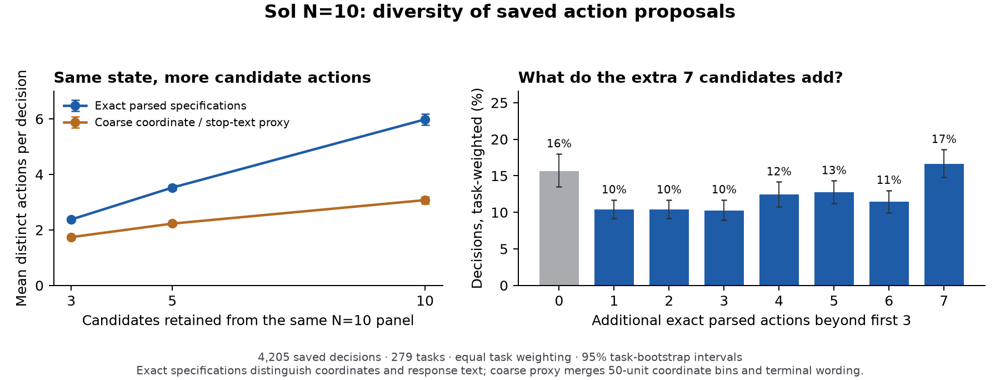

# ARM inference scaling

- **SFT actor + Piotr SelectionARM:** **+5.67 ± 1.15 percentage points** (mean ± sample SD) across three complete runs.
- **RL actor + Piotr:** **42.67% → 54.00%**, a **+11.33-point gain [+5.33, +17.33]** in one complete paired run.
- **Selection rule:** random-of-five reaches **33.33%** and highest-likelihood-of-five **26.67%**, versus **33.00%** for SFT and **40.00%** for Piotr. Controls were collected separately.
- **Other selectors:** Sol/GPT-5.5 add **10–12 points**; Luna/Kev add about **9 points** under a different protocol. These are not controlled cross-protocol rankings.
- **Still unresolved:** whether 50 steps or an RL-trained actor increases Piotr's gain relative to the SFT 30-step comparison.

Every main result uses the same **300 Online-Mind2Web tasks**. Invalid and unjudged episodes count as zero. “Success” is the canonical o4-mini/AgentTrek verdict, which permits partial progress. **N** means candidates generated per decision; one is executed. Gains are percentage points (**pp**); intervals quantify task sampling, not judge error or website drift.

## Piotr SelectionARM: three complete runs

Official OpenWebRL-4B-SFT, **30 steps, T=0.7, top-p=0.9, 1,024 output tokens**. Compare one actor sample with greedy Piotr selection from five full candidates.

| Run | Tasks per arm | SFT successes | Piotr successes | SFT success | Piotr success | Gain, pp |
| --- | ---: | ---: | ---: | ---: | ---: | ---: |
| Oct 6, seed 43 | 300 | 100 | 115 | 33.33% | 38.33% | +5.00 |
| Oct 6, seed 44 | 300 | 98 | 113 | 32.67% | 37.67% | +5.00 |
| Oct 7, seed 45 | 300 | 99 | 120 | 33.00% | 40.00% | +7.00 |
| **Mean ± sample SD** | 300 | — | — | **33.00 ± 0.33%** | **38.67 ± 1.20%** | **+5.67 ± 1.15** |

Mean gain: **+5.67 pp**, paired 95% interval **[+2.67, +8.67]**. The same 300 tasks repeat across runs: 900 episodes per arm, 300 task clusters. SD describes the three run rates; the interval resamples task clusters with all runs retained. [Aggregate](arm_results/selectionarm_piotr_sameday30_20261007/aggregate.json) · [Protocol and accounting](ARM_INFERENCE.md#selectionarm-piotr-sameday30-20261007).

## Controls and variants

Same SFT actor and decoding as above; **300 tasks per arm in every row**.

**30 steps: selection rules, using the Oct 7 SFT control**

| Condition | N | Tasks | Successes | Success | Gain vs SFT, pp | Paired 95% interval, pp |
| --- | ---: | ---: | ---: | ---: | ---: | --- |
| SFT alone — baseline | 1 | 300 | 99 | 33.00% | — | — |
| Random-of-five | 5 | 300 | 100 | 33.33% | +0.33 | [−4.67, +5.67] |
| Highest likelihood of five | 5 | 300 | 80 | 26.67% | −6.33 | [−11.33, −1.33] |
| **Piotr SelectionARM, Oct 7** | 5 | 300 | 120 | 40.00% | +7.00 | [+2.33, +11.67] |

**50 steps: Piotr, using a fresh 50-step SFT control**

| Condition | N | Tasks | Successes | Success | Gain vs SFT, pp | Paired 95% interval, pp |
| --- | ---: | ---: | ---: | ---: | ---: | --- |
| SFT alone — baseline | 1 | 300 | 92 | 30.67% | — | — |
| Piotr | 5 | 300 | 120 | 40.00% | +9.33 | [+4.00, +14.67] |

**30 steps: RL-task-trained selector, using the earlier API-study SFT control**

| Condition | N | Tasks | Successes | Success | Gain vs SFT, pp | Paired 95% interval, pp |
| --- | ---: | ---: | ---: | ---: | ---: | --- |
| SFT alone — baseline | 1 | 300 | 95 | 31.67% | — | — |
| RL-task-trained SelectionARM | 5 | 300 | 123 | 41.00% | +9.33 | [+4.00, +14.67] |

- **Random control:** pick uniformly among five candidate indices at **every step**, including duplicates and malformed candidates. It reuses the Oct 7 SFT/Piotr episodes above. Piotr beats random by **+6.67 pp [+1.00, +12.33]**; random shows no detectable gain over SFT.
- **Likelihood control:** choose the highest mean native base-policy log-probability of the full response, including reasoning. It trails random by **−6.67 pp [−12.00, −1.33]** and Piotr by **−13.33 pp [−18.67, −8.00]**. This is one run with reused controls, not a general test of confidence gating. [Action-only follow-up](ARM_INFERENCE.md#action-only-likelihood-20261008).
- **Horizon:** the 50-step pair has a fresh SFT control. Its gain exceeds the same-day 30-step gain by **+2.33 pp [−4.67, +9.33]**; no clear horizon effect.
- **Selector training:** RL-task-trained SelectionARM changes the **selector**, while the actor stays SFT. It reuses the earlier SFT control from the API-selector study below; this is not a matched ranking against Piotr.

The Oct 7 Piotr row is the third run above, not an extra repeat. Collections used separate browser episodes and times. [Random-control audit](ARM_INFERENCE.md#selectionarm-random5-sameday30-20261007) · [50-step audit](ARM_INFERENCE.md#selectionarm-piotr-steps50-results-20261007) · [RL-task-selector audit](ARM_INFERENCE.md#selectionarm-rltasks-repeat-results-20261007).

## API and other selectors

Official SFT actor; one complete run per condition. **Compare each selector with its own protocol's SFT baseline.**

| Protocol | Selector | N | Tasks | Successes | Success | Gain, pp | Paired 95% interval, pp |
| --- | --- | ---: | ---: | ---: | ---: | ---: | --- |
| September protocol, Oct reproduction | None / SFT | 1 | 300 | 95 | 31.67% | — | — |
| September protocol, Oct reproduction | GPT-5.6 Sol | 5 | 300 | 130 | 43.33% | +11.67 | [+6.33, +17.00] |
| September protocol, Oct reproduction | GPT-5.5 | 5 | 300 | 126 | 42.00% | +10.33 | [+5.00, +15.67] |
| Local v2 | None / SFT | 1 | 300 | 94 | 31.33% | — | — |
| Local v2 | GPT-6 Luna, medium | 5 | 300 | 121 | 40.33% | +9.00 | [+3.33, +14.67] |
| Local v2 | Jev 1.13.0 | 5 | 300 | 100 | 33.33% | +2.00 | [−3.67, +7.67] |
| Local v2 | Kev27B | 5 | 300 | 122 | 40.67% | +9.33 | [+3.67, +15.00] |

| Protocol | Actor T / top-p | Actor token cap | Selector input | Episode limit |
| --- | --- | ---: | --- | --- |
| September protocol | 0.7 / 0.9 | 1,024 | Current screenshot + full candidates | 30 turns |
| Local v2 | 1.0 / 0.95 | 4,096 | Text/DOM + full candidates + five recent actions; no images | 30 browser operations / 60 decisions |

Sol/GPT-5.5 use medium reasoning and 2,048 selector tokens; Luna uses medium reasoning and 4,096. Jev/Kev use choice classifiers.

**Sol reproduces a similar rate to September:** 43.33% now versus 44.00% then. Sol versus GPT-5.5 is inconclusive: **+1.33 pp [−3.67, +6.33]**. Luna/Kev differ by one success; Jev's gain interval includes zero. [API aggregate](arm_results/api_selector_september_reproduction_20261006/aggregate.json) · [Local v2 audit](arm_results/local_sft_selector_controlled_20261006.json) · [Local v2 protocol](arm_results/local_inference_rerun_plan_20261006.json).

## Sol: does increasing the candidate count help?

**N=10 improves over N=3 by +6.67 pp [95% paired interval: +2.00, +11.67]**, at **3.28× the mean actor output tokens**. Both arms used the corrected September protocol above and were collected together on the same 300 tasks.

| Condition | N | Collection | Tasks | Successes | Success | Gain vs SFT, pp | Valid tasks | Invalid tasks | Valid-only success |
| --- | ---: | --- | ---: | ---: | ---: | ---: | ---: | ---: | ---: |
| SFT alone / no selector | 1 | Earlier control | 300 | 95 | 31.67% | — | 273 | 27 | 34.80% |
| SFT + Sol | 3 | Fresh paired study | 300 | 121 | 40.33% | +8.67 | 266 | 34 | 45.49% |
| SFT + Sol | 5 | Earlier reference | 300 | 130 | 43.33% | +11.67 | 268 | 32 | 48.51% |
| SFT + Sol | 10 | Fresh paired study | 300 | 141 | 47.00% | +15.33 | 264 | 36 | 53.41% |

N=10 wins alone on 38 tasks; N=3 wins alone on 18. Invalid episodes remain zero in the primary denominator. The SFT-alone control and N=5 reference come from the [earlier API-selector study](#api-selector-results-20261007) under the same corrected September protocol; comparisons with N=3/N=10 include collection-date differences. These are canonical o4-mini/AgentTrek scores, which permit partial progress; three targeted positive flags remain documented without relabeling.

Cost and paired sensitivity

| Candidates | Mean actor output tokens/task | Mean episode latency, s | All-attempt selector charge/reservation, USD |
| --- | ---: | ---: | ---: |
| 3 | 14,342 | 219.38 | 96.18 |
| 10 | 47,051 | 249.91 | 150.51 |

On the 255 tasks valid in both arms, the gain is +7.45 pp [95% paired interval: +1.96, +12.94]. Primary intervals use 10,000 task bootstrap draws, seed 42; they do not include judge error or website drift. Latency is time to result and includes overlapping work, not GPU compute. Shared campaign usage was 5.57 H200-hours and 618 browser attempts, including interrupted attempts. API charges/reservations are conservative ledger values, not invoices.

[Aggregate](arm_results/sol_candidate_scaling_september_20261007/aggregate.json) · [Accounting](arm_results/sol_candidate_scaling_september_20261007/accounting.json) · [Protocol and recovery audit](ARM_INFERENCE.md#sol-candidate-scaling-september-20261007).

### How much action diversity do the extra candidates add?

**At the same saved N=10 states, candidates 4–10 add 3.61 distinct parsed action specifications**, on average, beyond the first three (95% task-bootstrap interval **[3.45, 3.76]**). Sol selects a specification absent from the first three in **38.1%** of decisions, averaging within each task and then equally across tasks.

| Candidates retained from each N=10 panel | Mean distinct specifications | 95% interval |
| --- | ---: | --- |
| First 3 | 2.37 | [2.33, 2.42] |
| First 5 | 3.52 | [3.43, 3.61] |
| All 10 | 5.98 | [5.78, 6.17] |

These are **4,205 decisions from 279 tasks**; 21 episodes without candidate panels are excluded from diversity means. Specifications distinguish tool-call sequences and exact arguments, including coordinates and final-answer text. They exclude reasoning and formatting. Merging terminal wording and grouping coordinates into 50-unit bins reduces the added diversity to **1.33 classes [1.24, 1.43]**. This sensitivity check is not semantic UI-target matching; the saved evidence lacks target identities. The analysis establishes additional proposals, not their usefulness or a causal explanation of the success gain.

Actual N=3/5/10 runs, diversity plot and method

| Actual Sol run | Audited episodes | Tasks with panels | Saved decisions | Mean distinct specifications | 95% interval | Unparseable candidates | Total candidates |
| --- | ---: | ---: | ---: | ---: | --- | ---: | ---: |
| N=3 | 300 | 279 | 4,323 | 2.27 | [2.22, 2.33] | 35 | 12,969 |
| N=5, earlier collection | 300 | 279 | 4,221 | 3.44 | [3.33, 3.53] | 53 | 21,105 |
| N=10 | 300 | 279 | 4,205 | 5.98 | [5.78, 6.17] | 120 | 42,050 |

These actual runs visit different states; N=5 also has a different collection date. The main table instead holds each N=10 panel fixed. It does not rerun the selector on smaller panels or estimate their counterfactual success. Averaging every possible 3-of-10 and 5-of-10 subset gives 2.37 and 3.53 distinct specifications, consistent with the ordered-prefix comparison.

The selected specification is absent from the first three in 1,378 of 4,204 decisions with a parseable selection: pooled rate 32.78%, versus the task-weighted 38.13% [35.77, 40.54] above. Beyond the first five, the task-weighted added count is 2.46 [2.34, 2.57], and selection novelty is 24.94% [22.91, 27.11]. Later indices that duplicate an earlier specification are not novel.

The native Qwen25 parser and ordered tool-call sequences match the frozen execution path. Parsing does not establish executability: missing required arguments and generation-length stops are audited separately. Normalizing executor defaults and ignored arguments leaves 3.59 additional specifications beyond three; merging terminal wording alone leaves 2.74. Coordinate bins remain a coarse proxy, not a bound on semantic diversity.

Means first average observed decisions within task, then weight tasks equally. Intervals use 10,000 task-bootstrap samples. Input hashes, all 900 episode identities, candidate counts, selector indices and parser behavior were independently checked; ten focused tests passed. All analysis used saved evidence, with no new browser or model calls. [Aggregate metrics and definitions](arm_results/sol_action_diversity_20261008/aggregate.json).

## Actors alone

<!-- local-v2-actor-results:start -->
| Local v2 actor | Tasks | Successes | Success | Valid tasks | Valid-only success |
| --- | ---: | ---: | ---: | ---: | ---: |
| Official SFT | 300 | 94 | 31.33% | 254 | 37.01% |
| Jev + GPT-4.1-mini typing | 300 | 14 | 4.67% | 260 | 5.38% |
<!-- local-v2-actor-results:end -->

Jev is a separate actor system. Its judge-input adapter was repaired and all 23 valid DONE episodes rejudged from unchanged saved evidence. [Audit](arm_results/jev_actor_local_full300_20261006.json). Other actor runs and their limitations remain in the archive below.

## Piotr with an RL actor

| Actor | Selector | N | Tasks | Successes | Success |
| --- | --- | ---: | ---: | ---: | ---: |
| Released OpenWebRL-4B RL | None | 1 | 300 | 128 | 42.67% |
| Released OpenWebRL-4B RL | Piotr SelectionARM | 5 | 300 | 162 | 54.00% |

**Paired gain: +11.33 pp [+5.33, +17.33]**; 59 ARM-only wins and 25 actor-only wins. Both arms are fresh. Relative to the SFT setup, only actor weights change: **30 steps, T=0.7, top-p=0.9, 1,024 tokens, seed 45**, with the frozen SFT prompt/frontend and Piotr's original SFT base. This is one run, not the RL model's native prompting benchmark.

The gain exceeds the latest SFT pair's gain by **+4.33 pp [−3.00, +11.33]**: a stronger benefit on RL is not established. This comparison reuses SFT episodes collected at a different time. [Aggregate and plots](arm_results/selectionarm_piotr_rlactor30_20261007/aggregate.json) · [Four-outcome paired comparison](arm_results/selectionarm_piotr_rlactor30_20261007/sft_rl_gain_comparison.json) · [Protocol and final accounting](ARM_INFERENCE.md#selectionarm-piotr-rlactor30-20261007).

## Selective sampling: exploratory gate

Sample one candidate; below **−0.215576 nats/token** full-response mean base-policy log-probability, sample four more and let Piotr choose from all five. Otherwise execute the first.

| Method | Tasks | Successes | Success | Gain vs SFT, pp | Paired 95% interval, pp |
| --- | ---: | ---: | ---: | ---: | --- |
| Gated Piotr | 300 | 101 | 33.67% | +0.67 | [−4.33, +5.67] |

The gate triggered on **907 of 4,844 decisions (18.72%)**, averaging **1.749 candidates**. Its gain over SFT is inconclusive, and it trails always-Piotr by **−6.33 pp [−12.00, −0.67]**. Controls were collected separately; this does not establish noninferiority or matched wall-clock savings.

**Calibration limitation:** the exploratory cutoff is the 25th percentile of 278 saved SFT final-decision responses from these same evaluation tasks. The separate [benefit-based threshold study](ARM_INFERENCE.md#confidence-benefit-20261008) is now verified under the approved 59-pair fitting amendment: the frozen rule keeps the first action. On **20 usable pairs from 150 fixed held-out tasks**, it succeeds on 10 versus 7 for Piotr: **+15 pp [−5, +35]**, inconclusive. Replay coverage is **13.33%**; 17 usable pairs are from decisions 1–3 and 19 are from two sites. This is a single-intervention study, not an every-step gating result. The [follow-up proposal](ARM_INFERENCE.md#confidence-robust-20261008) replaces the 240-task placeholder with effect-based sizing: initially 448 usable fit and 448 usable held-out states for the 10-pp planning scenario, subject to replay reliability, fit stability and an expanded task pool. [Exploratory protocol and accounting](ARM_INFERENCE.md#likelihood-scaling-20261007).

## Frozen SFT training-pool coverage: five attempts to eight

**Observed task coverage rises from 64.65% to 73.20% (+8.55 percentage points).** Three fresh ordinary attempts rescue **171 of 707** tasks missed by the historical five. This uses the separate **2,000-task training screen** and the SFT checkpoint at iteration 0; it is not a held-out Online-Mind2Web evaluation or a trained-policy result.

| Coverage endpoint | Successful tasks | Rate |
| --- | ---: | ---: |
| Historical five attempts | 1,293 / 2,000 | 64.65% |
| Historical five + three fresh attempts on misses | 1,464 / 2,000 | **73.20%** |
| Rescue among historical misses | 171 / 707 | 24.19% |
| Rescue among five-valid-failure tasks | 166 / 682 | 24.34% |
| Rescue among misses containing invalid attempts | 5 / 25 | 20.00% |

The extension has **249 / 2,121 successful episodes (11.74% overall; 249 / 2,108 = 11.81% valid-only)**, with 13 invalid attempts. These episode rates apply only to historical misses, not to a fresh all-task pass@1 or pass@3 cohort. The collection uses local browsers, official SFT, T=0.8 / p=1 / k off, 1,024 response tokens, 15 turns and GPT-4.1/action_history judging.

All 10,000 historical records and 2,121 new primary records were audited, including terminal images for every valid new trajectory. The 1,293 prior successes required no new attempts. All four W&B runs finished with matching final metrics. Usage, including failed/interrupted physical attempts, is **21.23 H200-hours**, 2,137 browser dispatches, 602 judge calls and **$6.29 charged or reserved** within four separate approved caps. [Final aggregate and accounting](arm_results/rl_integration/training-sft-pass8-20261006.json).

This is historical-five plus fresh-three coverage across dates, not an exchangeable eight-sample estimator. Website drift remains possible. Native judge labels are unchanged; purposive checks found permissive positives, so the figures are judge-based rather than manually certified completion. The earlier guided follow-up rescued 78 / 682 five-valid-failure tasks; its dates and attempt budget differ from the fresh ordinary retries, preventing a matched-compute ARM comparison.

Original pass@k curve and rubric-difficulty analysis

The dataset difficulty value is the **number of reference rubric facts**, verified on all 2,000 tasks. Pass@1–4 below average subsets of the same five historical outcomes; invalid attempts count as no success.

| Rubric facts | Tasks | pass@1 | pass@2 | pass@3 | pass@4 | pass@5 |
| --- | ---: | ---: | ---: | ---: | ---: | ---: |
| 5 | 1,297 | 37.22% | 51.27% | 58.91% | 63.82% | 67.23% |
| 6 | 542 | 32.47% | 44.58% | 51.51% | 56.31% | 59.96% |
| 7 | 111 | 38.92% | 51.44% | 56.94% | 60.00% | 62.16% |
| 8+ | 50 | 34.80% | 44.00% | 48.80% | 52.00% | 54.00% |
| All | 2,000 | 35.97% | 49.29% | 56.54% | 61.28% | 64.65% |

Spearman correlations with pass@1 through pass@5 are −0.052, −0.054, −0.057, −0.069 and −0.073. The pass@5 correlation's 95% website-bootstrap interval is **[−0.171, +0.033]** from 2,000 resamples over 76 websites. This selected difficulty ≥5 pool provides no clear monotonic relationship; rubric length is not a direct measure of browser interaction difficulty. Only 50 tasks have eight or more facts. [Aggregate counts, correlations, validity checks and input hashes](arm_results/rl_integration/training-sft-difficulty-passk-20261006.json).

Training with eight rollouts is a separate experiment on the original **2,102-task** pool. Its [uniform-G8 pilot reached iteration 10](RL_EVALUATION.md#uniform8-iter10-results-20261007), scoring 88 / 300 (29.33%) in an actor-only pass@1 evaluation. The pilot does not establish a training benefit from the screening coverage increase. Its [approved continuation to 60](ARM_INTEGRATION_PLAN.md#outcome56-uniform8-to60-20261008) remains queued.

## Supporting evidence and history

Plots and detailed evidence

| Study | Aggregate / audit | Compute or API cost | Latency | Tokens |
| --- | --- | --- | --- | --- |
| Piotr 30 steps / three-run summary | [Data](arm_results/selectionarm_piotr_sameday30_20261007/aggregate.json) | [Plot](arm_results/selectionarm_piotr_sameday30_20261007/cost.png) | [Plot](arm_results/selectionarm_piotr_sameday30_20261007/latency.png) | [Plot](arm_results/selectionarm_piotr_sameday30_20261007/tokens.png) |
| RL actor + Piotr, 30 steps | [Data](arm_results/selectionarm_piotr_rlactor30_20261007/aggregate.json) | [Plot](arm_results/selectionarm_piotr_rlactor30_20261007/cost.png) | [Plot](arm_results/selectionarm_piotr_rlactor30_20261007/latency.png) | [Plot](arm_results/selectionarm_piotr_rlactor30_20261007/tokens.png) |
| Exploratory gated Piotr / five-way comparison | [Data](arm_results/selectionarm_adaptive5_sft30_20261007/publication-aggregate.json) | [Plot](arm_results/selectionarm_adaptive5_sft30_20261007/cost.png) | [Plot](arm_results/selectionarm_adaptive5_sft30_20261007/latency.png) | [Plot](arm_results/selectionarm_adaptive5_sft30_20261007/tokens.png) |
| Highest likelihood of five | [Data](arm_results/selectionarm_likelihood5_sft30_20261007/publication-aggregate.json) | [Plot](arm_results/selectionarm_likelihood5_sft30_20261007/cost.png) | [Plot](arm_results/selectionarm_likelihood5_sft30_20261007/latency.png) | [Plot](arm_results/selectionarm_likelihood5_sft30_20261007/tokens.png) |
| Random-of-five | [Data](arm_results/selectionarm_random5_sameday30_20261007/aggregate.json) | [Plot](arm_results/selectionarm_random5_sameday30_20261007/cost.png) | [Plot](arm_results/selectionarm_random5_sameday30_20261007/latency.png) | [Plot](arm_results/selectionarm_random5_sameday30_20261007/tokens.png) |
| Piotr 50 steps | [Data](arm_results/selectionarm_piotr_steps50_20261007/aggregate.json) | [Plot](arm_results/selectionarm_piotr_steps50_20261007/cost.png) | [Plot](arm_results/selectionarm_piotr_steps50_20261007/latency.png) | [Plot](arm_results/selectionarm_piotr_steps50_20261007/tokens.png) |
| RL-task-trained selector | [Data](arm_results/selectionarm_rltasks_repeat_20261007/aggregate.json) | [Plot](arm_results/selectionarm_rltasks_repeat_20261007/cost.png) | [Plot](arm_results/selectionarm_rltasks_repeat_20261007/latency.png) | [Plot](arm_results/selectionarm_rltasks_repeat_20261007/tokens.png) |
| Sol / GPT-5.5 | [Audit](ARM_INFERENCE.md#api-selector-september-reproduction-20261006) | [Plot](arm_results/api_selector_september_reproduction_20261006/cost.png) | [Plot](arm_results/api_selector_september_reproduction_20261006/latency.png) | [Plot](arm_results/api_selector_september_reproduction_20261006/tokens.png) |

Learned-selector compute is an estimated generated-token proxy, not dollars or measured total FLOPs. Piotr 30-step plots cover the Oct 7 pair; the linked aggregate also contains the three-run summary. [Before/after branching studies](ARM_FORMULATIONS.md) are a separate experiment.

Efficiency, validity and accounting

| API study method | Mean latency, s | Mean metered input + output tokens | Selector API upper USD/task |
| --- | ---: | ---: | ---: |
| SFT alone | 149.7 | 148,549 | 0.000 |
| SFT + Sol | 201.1 | 798,293 | 0.374 |
| SFT + GPT-5.5 | 238.4 | 837,913 | 0.552 |

Tokens/API cost include all attempts; 107 failed actor requests lack token usage. Latency averages committed episodes and is not hardware-matched across studies. GPU/judge costs are separate. API reproduction used 6.84 allocated H200-hours; GPT-5.5's 13 output-cap failures remain zero.

| Local v2 condition | Tasks | Successes | Valid tasks | Invalid tasks | Valid-only success |
| --- | ---: | ---: | ---: | ---: | ---: |
| SFT alone | 300 | 94 | 254 | 46 | 37.01% |
| SFT + Luna | 300 | 121 | 255 | 45 | 47.45% |
| SFT + Jev | 300 | 100 | 250 | 50 | 40.00% |
| SFT + Kev | 300 | 122 | 247 | 53 | 49.39% |

<!-- local-suite-live-status:start -->
| Study | Primary episodes | Separate smokes | Allocated H200-hours | Accounting |
| --- | ---: | ---: | ---: | --- |
| First two full300 Piotr repeats | 1,200 | 0 | 16.65 | [Final](arm_results/rl_integration/sft-piotr-repeats-final-20261006/combined.json) |
| Local v2 SFT + selectors | 1,200 | 24 | 22.88 | [Final](arm_results/local_sft_selector_controlled_20261006.json) |
| Local v2 Jev actor | 300 | 3 | 0 | [CPU/API ledger](arm_results/jev_actor_local_full300_20261006.json) |
<!-- local-suite-live-status:end -->

Local v2 judges completed episodes from full thoughts/actions and a fresh terminal screenshot. All valid records have terminal evidence; 186 of 194 invalid SFT records lack it and remain zero. One shard's cleanup used scheduler-cgroup/child-closure evidence instead of a post-exit process scan. Details are in the linked audits.

Incomplete October 6 run: 158 / 160 matched tasks

The first corrected run stopped at **493 of 900 episodes**: 158 tasks have all three arms; 160 have SFT/Piotr pairs. Every run used the same 300-task file. These are incomplete overlaps, excluded from the full300 headline means. The October 7 run supplies the third complete Piotr comparison.

[Partial results and accounting](ARM_INFERENCE.md#arm-rltasks-corrected-partial-20261006) · [Preserved 160-task three-run summary](arm_results/rl_integration/sft-piotr-three-run-summary-20261006.json) · [Historical saved-verdict audit](ARM_INFERENCE.md#arm-same-task-verdict-audit-20261006).

September reference: separate collection, excluded from current averages

| Official SFT with… | N | Tasks | Successes | Success |
| --- | ---: | ---: | ---: | ---: |
| No selector | 1 | 300 | 90 | 30.00% |
| ScalarARM | 5 | 300 | 114 | 38.00% |
| SelectionARM | 5 | 300 | 128 | 42.67% |
| SelectionARM, action-only candidates | 5 | 300 | 105 | 35.00% |
| GPT-5.6 Sol | 5 | 300 | 132 | 44.00% |

Historical actor-policy receipts are intact; these are not missing-policy runs. Dates and harness details differ from the current comparisons. No September GPT-5.5 online-selector result was found. [Historical-gain audit](ARM_INFERENCE.md#arm-same-task-verdict-audit-20261006) · [Sol](arm_results/sol-selection300.json) · [Action-only ablation](arm_results/selection-actions-only.json).

Buggy, superseded or unmatched experiments

<!-- actor-selector-results:start -->
| Experiment | Limitation | Replacement / gap |
| --- | --- | --- |
| Oct 4 learned ARM versus oracle episode pass@k | Missing actor browser policy | Piotr corrected above; controlled pass@k rerun missing |
| Qwen3-VL actor; Luna medium/high and Sol high actors | Missing policy; API actors also lost native conversation state/call IDs | Corrected matched actor runs missing |
| Historical SFT + Luna N=5/N=10; Qwen alone/+Luna | Missing actor policy | SFT N=5 replaced by local v2; N=10 and Qwen remain open |
| Historical hosted SFT + Jev/Kev | Missing policy; browser/judge differences | Replaced by local v2 |
| Hosted Kev actor and small pilots | Different system/protocol; pilot Luna also had coordinate corruption | Excluded from controlled comparisons |
<!-- actor-selector-results:end -->

All attempts and verdicts are preserved; these scores do not enter current means. [Original tables and plots](https://github.com/zixianma/OpenWebRL/blob/a0a6db4e677c7f1959a53f0498ffc9a18d9c9ca0/openwebrl/docs/ARM_INFERENCE_SCALING.md#actor-selector-experiment-tracker-20261004) · [Actor pipeline audit](arm_results/reasoning_actors_full300_20261005/pipeline-debug.json) · [Judge audit](arm_results/sft_selector_judge_audit_20261006.json).

