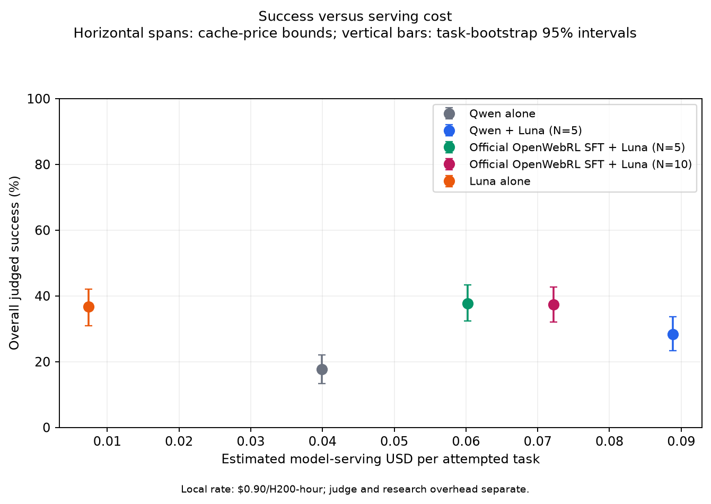

# ARM inference-time scaling: actor alone versus actor + selector

**Main actor: official `OpenWebRL/OpenWebRL-4B-SFT`; Qwen3-VL-4B-Thinking is the actor ablation.** Actor-only performance comes first, followed by the gain from selecting among proposed actions.

**Current local-browser result: Jev actor-only achieves 4.67% (14/300); the four matched SFT conditions are still running.** The historical tables retain eleven completed full300 conditions, comprising 3,000 fresh episodes and 300 reused SFT records, across different browser and harness protocols. Keep those results separate from the five-condition fresh local-browser study.

## Contents

- [Actor alone: current local-browser result](#local-jev-actor-results-20261006)
- [Actor alone: historical results](#actor-selector-experiment-tracker-20261004)
- [Actor + selector: existing results](#scaling-comparisons)
- [Controlled local-browser suite](#local-browser-rerun-20261006)
- [Historical protocol differences](#luna-actor-full300-20261004)
- [Efficiency details](#luna-full300-results-20261006)
- [Jev/Kev incomplete-task judging audit](#sft-selector-judge-leniency-20261006)
- [Actor/judge audit](#api-actor-stopping-audit-20261005)
- [Learned ARM and episode retries](#learned-arm-and-retries)
- [Pilots and provenance](#luna-qwen-inference-20261004)

## Actor alone: current local-browser result

| Actor | Protocol | Overall success | Valid-only success | Invalid tasks |
| --- | --- | ---: | ---: | ---: |
| **Jev Ultrafast + GPT-4.1-mini typing** | **Local v2** | **4.67% (14/300)** | **5.38% (14/260)** | **40/300** |

All 300 primary records and 3 separate smokes passed the independent artifact/accounting audit. There were 224 native `BLOCKED` endings and 40 observation/infrastructure invalids; invalids count as zero in the overall denominator. Every valid primary record has a terminal screenshot. [Aggregate results and provenance](arm_results/jev_actor_local_full300_20261006.json).

The initial Jev-to-judge adapter omitted required tool-call newlines and native tool names, yielding unparseable actions. After repairing that adapter, **all 23 valid `DONE` records were rejudged from the same saved operations and PNG bytes**, regardless of their earlier verdict. The canonical rubric, reward source, model, seed and token cap stayed unchanged; native actions remain faithful and thoughts empty. Earlier verdicts are preserved and superseded; no actor or browser episode was replayed for this repair. This remains the canonical rubric's score, not a strict-completion score.

The complete lineage used **760/14,400 CPU-allocation seconds**, **306/330 browser sessions**, 1,523 Jev requests, 192 typing calls ($0.0298748), and 46 judge calls ($0.2052523), including failures and the saved-only repair. This result does not measure a selector gain: the matched SFT control and three selector conditions are still running, while earlier Jev/Kev scores used different harnesses.

## Actor alone: historical results

**Overall = successes / all 300 tasks; valid-only = successes / valid records.** These are saved judge verdicts, including the rubric's documented partial-progress allowances. Missing prompt/history and browser differences limit cross-row comparisons.

<!-- actor-selector-results:start -->
<!-- cohorts: AS04, AS01, AS07, AS10, AS11, AS12 -->

| Actor, no selector | Overall success | Valid-only success | Collection |
| --- | ---: | ---: | --- |
| **Official OpenWebRL-SFT** | **35.33% (106/300)** | 38.97% (106/272) | Historical decoding; unmatched control |
| Qwen3-VL-4B-Thinking — ablation | 17.67% (53/300) | 19.13% (53/277) | Local browser |
| GPT-6 Luna medium | 36.67% (110/300) | 39.43% (110/279) | Local browser |
| GPT-6 Luna high | 32.33% (97/300) | 35.02% (97/277) | Local browser |
| GPT-6.1 Sol high | 20.33% (61/300) | 22.34% (61/273) | Local browser |
| Jev, historical hosted pilot | **1/10 pilot only** | — | Current local full300 result appears above |
| Kev27B | 8.67% (26/300) | 8.84% (26/294) | Hosted browser |

Jev's historical [10-task pilot](rl_results/jev-ultrafast-pilot-20261004.json) is separate from its completed local v2 full300 result above. Direct Jev/Kev use DOM decisions plus GPT-4.1-mini for typing; the other actors use screenshots. API-actor defects are documented in the [audit](#api-actor-stopping-audit-20261005).

## Actor + selector: existing results

**N** is the number of proposed next actions; only the selected action is executed.

<!-- cohorts: AS05, AS06, AS08, AS09, AS02 -->

| Actor | Selector | N | Overall success | Valid-only success | Browser |
| --- | --- | ---: | ---: | ---: | --- |
| Official SFT | GPT-6 Luna medium | 5 | 37.67% (113/300) | 41.24% (113/274) | Local |
| Official SFT | GPT-6 Luna medium | 10 | 37.33% (112/300) | 40.88% (112/274) | Local |
| Official SFT | Jev | 5 | 58.67% (176/300) | 61.97% (176/284) | Hosted |
| Official SFT | Kev27B | 5 | 61.33% (184/300) | 63.23% (184/291) | Hosted |
| Qwen3 — ablation | GPT-6 Luna medium | 5 | 28.33% (85/300) | 30.80% (85/276) | Local |

<!-- actor-selector-results:end -->

For SFT, Luna N=10 did not improve on N=5 (−0.33pp, paired 95% interval −5.33 to +4.67) and cost 19.9% more. Jev/Kev are nearly tied on the same 279 valid tasks: **175 versus 176 successes**; after the typing repair in both arms, **147 versus 149 on 238 tasks**. Their gains over the old SFT baseline and the gap versus Luna do not isolate selector quality. Both cohorts contain confirmed incomplete-task positives under the lenient rubric; see the [saved-evidence audit](#sft-selector-judge-leniency-20261006).

The Qwen ablation supplies the completed within-protocol actor-alone comparison: **17.67% → 28.33%**, or +10.67pp [5.67, 16.00], at 2.23× serving cost. The SFT-alone reference instead used T=0.7/p=0.9/1,024 tokens, versus T=1.0/p=0.95/4,096 in the selector studies. A fresh matched SFT control is essential.

Source: [eleven-row aggregate tracker](arm_results/luna_full300_20261004/experiment_tracker.json). All eleven completed historical cohorts appear once in these two historical tables; the Jev pilot is not a full300 cohort. Paired intervals quantify task sampling, not website drift, harness bias or judge error.

## Controlled local-browser suite

**Five approved conditions × the same 300 Online-Mind2Web tasks = 1,500 fresh primary episodes**, under protocol **`local-openwebrl-om2w-v2`**. The SFT core contributes 1,200 episodes across two independent 2-GPU shards; Jev actor-only contributes 300 in its separately approved CPU job. The old SFT baseline will not fill the new control row. Jev actor-only is verified complete; all 24 smoke episodes passed across the two SFT shards, which have entered primary collection with no final SFT rates. Model revisions, prompt hashes and failure rules are in the [config manifest](arm_results/local_inference_rerun_plan_20261006.json).

| ID | Actor | Selector | Proposals per step | Actor decoding | Selector decision |
| --- | --- | --- | ---: | --- | --- |
| **L01** | **Official OpenWebRL-4B-SFT** | None | **1** | T=1.0, p=0.95, k=off, 4,096 tokens | — |
| **L06** | **Jev Ultrafast** | None | Native DOM choices | Jev 1.13.0 decisions; GPT-4.1-mini typing | — |
| **L08** | **Official SFT** | **GPT-6 Luna** | **5** | Same as L01 | Medium reasoning, 4,096 tokens |
| **L10** | **Official SFT** | **Jev 1.13.0** | **5** | Same as L01 | Argmax choice |
| **L11** | **Official SFT** | **Kev27B** | **5** | Same as L01 | Calibrated argmax choice |

**All five conditions are approved and have launched.** L06 uses native Jev DOM decisions without actor images, plus `gpt-4.1-mini-2025-04-14` for typing at T=0.6, p=0.95 and 1,024 tokens. It shares the pinned browser and canonical judge with the SFT core, but has its own worker pool, ledger and CPU budget. Qwen ablations, Luna N=10, Kev actor-only and the three GPT actor reruns have no active v2 allocation. They can be prepared independently when their separate budgets are approved; they need not wait for these runs to finish. **Every additional arm needs fresh v2 results** before joining this comparison.

### Shared configuration

| Component | Exact setting |
| --- | --- |
| Browser | **Local** headless Chromium 145.0.7632.6, revision 1208 / Playwright 1.58.0; viewport 1280×720, DPR 1, en-US, UTC; default Chromium user agent; no proxy/stealth; fresh profile per episode; extra flags `--disable-dev-shm-usage --no-sandbox` |
| SFT generation | BF16, no quantization, repetition penalty 1.0, context 32,768; reserve the full 4,096 output budget (maximum 28,671 prompt tokens including image tokens); full text history and latest screenshot only; no adaptive history/output truncation |
| Seeds and schedule | Base 20261006; deterministic seeds per task/turn/candidate and candidate shuffle; N=1 generates only candidate 0. Two seeded, disjoint 150-task shards, each running all four conditions through its common browser pool; interleave task/arm blocks and save actual schedule/host/egress. Identical seeds do not make diverged trajectories share candidate contents |
| Actor prompt | Restored, hash-pinned SFT browser-policy prompt; missing/empty/mismatched prompt halts before a model/browser request |
| All selectors | **Same text/DOM view, no images**: task, URL/title/tabs, ordered observed elements/geometry, first 16,000 Unicode codepoints of visible page text, last 5 executed actions and full candidate reasoning/actions. Same policy and seeded candidate order; execute the chosen candidate unchanged |
| Selector input limit | Canonical shared JSON ≤262,144 UTF-8 bytes; page-text truncation is recorded. Overflow or provider context rejection is preserved as an explicit invalid; no per-selector compaction, fallback or replacement candidates |
| Luna selector settings | Alias `gpt-6-luna`, medium effort, max output 4,096, default service tier, `store=false`; temperature/top-p/seed omitted. Record returned model identity; aliases are not immutable snapshots |
| Selector API contract | Luna selectors are stateless text-only calls with no tools/native conversation history/images and strict JSON `selected_index` in 1..N |
| Jev/Kev decisions | Jev model `jev-1.13.0`; Kev `jaredpalmer/kev-27b`, full BF16 weights, calibrated argmax (calibration temperature 1.319507910772894), maximum 65,536 state tokens, `truncate_states=false`. Generative temperature/top-p/output cap do not apply to either choice head |
| Typing | SFT generates its own text in all four SFT arms. Only direct Jev uses the pinned GPT-4.1-mini helper described above |
| Episode/action limits | **30 action attempts, 60 decision attempts, 1,800s per episode for every arm**; count failed dispatched operations and individual operations inside compound actions; terminal `done` consumes one step. No-action decisions consume the decision limit; 3 consecutive parse failures end the episode |
| Timeouts/retries | Model request 180s, navigation 60s, browser operation 30s, final screenshot 15s; SFT transient-capture retry at most 3 attempts within that deadline; one HTTP attempt per actor/selector/typing request; judge at most 4 HTTP attempts. Preserve all failures; no automatic episode replay |
| Judge | **Unchanged OpenWebRL Online-Mind2Web/AgentTrek `reward_func`**, `o4-mini-2025-04-16`, seed 42: full actor thoughts/actions + final screenshot. Only `COMPLETED` episodes are judged; non-completed episodes score zero. No actions-only transformation or step-limit bypass. Common 4,096-token metering cap, explicitly additional to the native uncapped request |
| Reporting | Save every attempt/request/choice/executed action and terminal evidence. Overall, valid-only, common-valid paired effects/intervals, cost, latency, invalid causes and page-access failures; separate campaign overhead from per-episode serving cost |

The matched selector comparison is L01 versus L08/L10/L11. L06 measures the complete Jev direct-actor system, including its typing helper; it does not isolate selection quality. The shared selector input deliberately differs from earlier Luna selection, which also saw screenshots and full history. Local browsers still call hosted Jev/GPT selector APIs; all four arms use the same screenshot-based SFT proposer.

**Approved and submitted as two parallel jobs:** 172 combined offline tests and independent review pass; frozen-controller dry-runs pass. The common worker retains its real CPU checks for prompt/image processing, local Chromium settings, normalized-coordinate clicks, Linux text replacement, stopping, fresh final screenshots and complete browser-process teardown. The revised controller decouples browser workers from SFT replicas: eight collectors share one SFT endpoint per job, with one separate Kev GPU. Both jobs passed their 12-episode smoke gates and entered primary collection. Smoke actor-request P95 latency was 23.3 / 24.9s (max 28.5 / 30.2s), with maximum observed prompts of 22,308 / 18,393 tokens; this does not validate worst-case long-context throughput. Jev's exact confirmed context-limit error remains an input-budget invalid without truncation or fallback; unknown provider errors stop dispatch.

| Parallel job | Task assignment | GPU layout | CPU / RAM | Cumulative wall-clock cap, all attempts |
| --- | --- | --- | --- | --- |
| Shard 0 | 150 tasks × all four conditions = 600 primary episodes | 1 H200 SFT + 1 H200 Kev | 16 CPUs / 240 GiB | 8 hours |
| Shard 1 | Other150 tasks × all four conditions = 600 primary episodes | 1 H200 SFT + 1 H200 Kev | 16 CPUs / 240 GiB | 8 hours |
| **Combined** | **All300 tasks × four conditions = 1,200 primary episodes** | **4 H200 concurrently** | **32 CPUs / 480 GiB concurrently** | **32 H200-hours maximum** |

Both jobs can proceed independently in parallel. Each has its own scheduler accounting, browser/API ledger, W&B identity and replacement lineage. Task subsets are disjoint and cover all 300; every task retains all four conditions on one browser host. No selector is assigned a separate browser host. Aggregate results require both independent audits.

| Approved SFT cap, including all attempts | Per shard | SFT core total |
| --- | ---: | ---: |
| Concurrent local browsers | 8 | 16 |
| Browser episodes | 660; 165 per arm | 1,320; 330 per arm |
| Primary / smoke / possible infrastructure recovery episodes | 600 / 12 / 48 | 1,200 / 24 / 96 |
| SFT proposals | 158,400 | 316,800 |
| Requests each for Luna, Jev and local Kev, including diagnostics | 9,905 | 19,810 |
| Luna selector spend | $25 | $50 |
| Canonical judge spend / HTTP attempts | $12.50 / 2,640 | $25 / 5,280 |

The approved two-job layout replaces the unapproved 8-GPU × 16-hour proposal. It reduces the maximum compute reservation from 128 to 32 H200-hours, while retaining total browser/API ceilings; the extra 12 smokes come from the recovery reserve. One-GPU jobs would require unvalidated SFT/Kev colocation or model swapping. Two GPUs keep both models resident independently.

**Eight hours per job is a cap, not a measured completion forecast.** Eight browser collectors can create up to 40 simultaneous candidate requests; the SFT server initially runs five at once. Queue delay counts toward the unchanged 180s model and 1,800s episode deadlines. Continue tracking shared-server latency, observed context lengths and GPU use; the passed smoke episodes do not validate worst-case long-context throughput. No scientific timeout or decoding limit is relaxed to conceal overload. Every failed attempt is charged to its original shard, with no automatic transfer between shards or from historical budgets. Both plans and their partition/cap manifest were frozen before submission; targeted recovery changes retain their lineage and accounting.

### Separately approved Jev actor budget

| L06 resource or cap, including every attempt | Approved total |
| --- | ---: |
| Allocation | **0 GPU, 8 CPUs, 32 GiB, 4 hours total** |
| Concurrent local browsers | 4 |
| Browser episodes | 330 = 300 primary + 3 smoke + 27 possible infrastructure recovery |
| Jev requests | 19,800 |
| Typing-helper requests / spend | 19,800 / $15 |
| Canonical judge HTTP attempts / spend | 1,320 / $8 |

This allowance is separate from the SFT shards. It adds no GPU reservation and cannot borrow their unused scheduler time, requests or dollars. The canonical judge sees Jev's actual executed operations and final screenshot; its thought fields are empty because this actor produces no generative thoughts. Only native `DONE` is mapped to `COMPLETED`; other terminals retain canonical zero without a judge call, with infrastructure-invalid records identified separately.

### Judge compatibility and version boundary

The OM2W judge source is byte-identical across the historical runs; **its surrounding wrappers differed**. Using a local browser does not select a judge automatically. The separate GPT-4.1/action-history training monitor is not the judge for this comparison.

| Pipeline | Evidence supplied to the same OM2W rubric | Step-limit ending |
| --- | --- | --- |
| Official OpenWebRL OM2W / new v2 suite | Full actor thoughts/actions + final screenshot | Non-completed → zero, no judge call |
| Historical SFT + Jev/Kev | Full actor thoughts/actions + final screenshot | Custom bypass sent it to the judge |
| Historical Luna/Qwen/SFT + Luna | Actions only + final screenshot | Non-completed → zero, no judge call |

V2 freezes the browser binary, prompts, model revisions, decoding, selector observation, action limits and canonical judge evidence/status handling. Every arm in its results table is collected fresh. A later material change creates another version and requires fresh results for **all arms compared under that version**; previous scores remain labeled historical. The unchanged rubric retains its partial-progress allowances. There is **no new strict judge** in this suite.

Luna selection with images, Kev 0.8B actor/selector, learned ScalarARM/SelectionARM and oracle episode pass@k remain outside the five approved conditions. No selectively repeated valid failures or changed canonical historical verdicts are planned.

<!-- local-suite-live-status:start -->
**October 6 milestone:** SFT jobs **346656 / 346657 are collecting primary episodes after all 24 smokes passed**. Recovery retained 7 / 10 valid smoke records and reopened five capture-invalid episodes plus two interrupted by the sibling halt; their previous evidence and charges remain preserved. Prior scheduler use is **1,225 / 1,147 seconds**; replacement limits are **27,540 / 27,600 seconds**, within the unchanged **28,800-second total per shard**. No SFT final rates are available.

The targeted fixes retry transient screenshot capture at most three times within the existing 15s deadline and treat a well-formed, pinned-model non-argmax choice as a **valid model-decision failure**: reject it, execute no action or fallback, preserve fresh terminal evidence, and apply canonical non-completed zero without a judge call. Identity, schema and transport failures still halt. The saved Jev-selector rejection was amended from its existing evidence without replay; 172 offline tests and independent review passed. Sampling and budgets are unchanged.

A saved primary judge-history audit found all **461 executed actions and 384 thoughts present across 29 judged episodes**, with exact canonical prompt and terminal-image matches. This is a sampling snapshot under the unchanged rubric, not a final result or strict-completion audit. [Aggregate milestone evidence](arm_results/local_inference_rerun_plan_20261006.json).

**Jev actor L06 remains verified complete:** 14/300 overall and 14/260 valid-only, with all 23 `DONE` judge inputs repaired from saved evidence. Its full lineage used **760/14,400 seconds**. The SFT supervisor follows both replacements; no budget was added.
<!-- local-suite-live-status:end -->

## What each experiment measures

**N is the number of proposed next actions per browser step.** A selector chooses one candidate, and only that candidate is executed. Direct actors propose their own next action. Episode pass@k instead runs k independent browser trajectories and counts whether any succeeds.

| Protocol family | Actor and selector input | Sampling / output budget | Browser and episode limit | Judging / stopping |
| --- | --- | --- | --- | --- |
| Qwen/SFT + Luna; Qwen alone | Actor sees screenshot and history; Luna sees goal, history, current screenshot and shuffled full candidate actions | Local actor T=1.0, p=0.95, top-k disabled; 4,096 tokens. Luna medium, API-controlled sampling | Local Chromium, 1280×720; 30 actions, 1,800s | Actions-only o4-mini/AgentTrek evidence; step-limit failure scores zero |
| Luna/Sol direct actors | Screenshot and history; native GUI function schemas | Medium/high reasoning as labeled; 4,096 output tokens; API-controlled sampling | Same local browser and limits | Same actions-only protocol; see harness audit below |
| SFT + Jev/Kev27B | SFT sees screenshot/history. Selector sees page text, element geometry, five full reasoning/action candidates and five recent selected actions; **no selector images** | SFT T=1.0, p=0.95, top-k=20; 4,096 tokens | Hosted BrowserUse, 1280×1000; 30 turns, 600s | Thoughts/actions and final screenshot; terminal/step-limit outcomes judged by o4-mini/AgentTrek |
| Direct Jev/Kev | DOM text and operation/target selection; **no actor images**; GPT-4.1-mini generates typing text | Upstream decision policy; text helper T=0.6, p=0.95, 1,024 tokens | Hosted BrowserUse, 1120×780; 30 actions, up to 60 decisions, 600s | o4-mini/AgentTrek terminal judge |
| Reused SFT reference | Original SFT actor0 from the controlled ARM study | T=0.7, p=0.9; 1,024 tokens | Historical shared actor serving | Thoughts-inclusive evidence; unmatched to fresh selector cohorts |

The SFT actor is the released **`OpenWebRL/OpenWebRL-4B-SFT`**, not Qwen Thinking. The separate Qwen actor is **`Qwen/Qwen3-VL-4B-Thinking`**. API reasoning actors do not receive the local actors' temperature/top-p settings. Direct Kev is a different policy from SFT + Kev: it selects DOM operations/targets itself, whereas selectionARM chooses among SFT proposals. Its full300 score therefore does not isolate the value of selecting versus acting.

Model revisions and complete settings are preserved in the [Qwen/Luna summary](arm_results/luna_full300_20261004/summary.json), [API actor summary](arm_results/reasoning_actors_full300_20261005/summary.json), [Jev/Kev selector summary](rl_results/sft-selector-full300-20261005.json), and [direct Kev summary](rl_results/kev27b-actor-full300-20261005.json).

## Cost, latency, tokens, and plots

The five-arm Qwen/Luna study has complete primary token receipts. Serving cost includes all proposals, selector calls and one reserved H200 throughout each local-model episode, including waits, at the frozen **$0.90/H200-hour** rate. It excludes judging, separately priced browser CPU, and research startup/idle overhead. API prices are frozen receipt-based estimates, not provider invoices. Tokens include cached/repeated prefixes and use different tokenizers.

Detailed efficiency tables and plots

| Policy | Overall | Mean serving $/task | Episode p50 / p95, s | Mean input / output tokens per task |
| --- | ---: | ---: | ---: | ---: |
| Qwen alone | 17.67% | 0.03991 | 120.7 / 389.0 | 167.0k / 9.0k |
| Qwen + Luna N=5 | 28.33% | 0.08885 | 224.1 / 677.4 | 941.2k / 50.2k |
| SFT + Luna N=5 | 37.67% | 0.06023 | 151.2 / 489.9 | 684.3k / 28.7k |
| SFT + Luna N=10 | 37.33% | 0.07219 | 178.3 / 525.4 | 1,419.1k / 57.5k |
| Luna medium actor | 36.67% | 0.00738 | 56.0 / 254.4 | 54.3k / 1.3k |

Luna medium is the cheapest measured policy in this table under the frozen prices. N=10 costs about twice the proposal tokens of N=5, despite little change in success. Hosted model FLOPs are unavailable; local analytic FLOP estimates cannot establish equal total compute across API and local policies.

[Latency plot](arm_results/luna_full300_20261004/latency.png) · [Token plot](arm_results/luna_full300_20261004/tokens.png) · [Metrics CSV](arm_results/luna_full300_20261004/metrics.csv) · SVG: [cost](arm_results/luna_full300_20261004/cost.svg), [latency](arm_results/luna_full300_20261004/latency.svg), [tokens](arm_results/luna_full300_20261004/tokens.svg).

### API actor efficiency

| Actor | Overall | Actor API $/task | Mean episode seconds | Mean input / output tokens | Mean actions |
| --- | ---: | ---: | ---: | ---: | ---: |
| Luna medium | 36.67% | 0.00738 | 78.09 | 54,269 / 1,275 | 12.80 |
| Luna high | 32.33% | 0.01181 | 114.63 | 83,716 / 2,812 | 17.98 |
| Sol6.1 high | 20.33% | 0.15255–0.15475 | 90.27 | ≥59,211 / ≥535 | 13.25 |

Sol's range includes cache-price uncertainty and four HTTP 5xx reservations with unknown returned usage; its token means are lower bounds. Episode latency excludes the terminal judge. High versus medium changes reasoning effort, with possible collection-date effects. [API metrics and accounting](arm_results/reasoning_actors_full300_20261005/summary.json); plots: [cost](arm_results/reasoning_actors_full300_20261005/cost.png), [latency](arm_results/reasoning_actors_full300_20261005/latency.png), [tokens](arm_results/reasoning_actors_full300_20261005/tokens.png).

No harmonized serving-cost/latency point is asserted for Jev/Kev or the reused SFT baseline. Their total resource ledgers remain available, but campaign allocation cost and per-policy serving cost measure different quantities.

## Does incomplete-trajectory judging inflate Jev/Kev scores?

**Saved evidence confirms incomplete-task positives, including episodes that called `done`; the total inflation remains unmeasured.** An offline audit checked all 600 canonical records and matched every positive verdict to its saved judge response. All 360 positive requests used the same rubric, including the more-than-eight-actions, one-of-two-subtasks and missing-final-save allowances.

| Saved-positive audit | SFT + Jev | SFT + Kev27B |
| --- | ---: | ---: |
| Canonical positives | 176 | 184 |
| Ended with actor `done` | 170 | 183 |
| Ended at step limit | 6 | 1 |
| Judge text mentions an eight-action threshold | 30 | 37 |
| Existing positive evidence-review flags | 27 | 20 |

**Threshold mentions and review flags are not false-positive counts.** `done` is an actor stop signal, not proof of task completion. Reviewed saved examples include an item not added to the cart, a required home-store setting omitted, and data located without the requested chart being created; the judge nevertheless credited effective actions or partial subtasks. Consequently, changing only the handling of step-limit endings would miss other incomplete positives. The step-limit difference alone concerns six Jev and one Kev positives and cannot explain the large headline gap.

A separate strict rejudge was started after misinterpreting approval, then **stopped when the user clarified local browsers and the existing OpenWebRL judge**. It made 18 requests (16 validated outputs, 2 invalid outputs), with known-usage uncached upper cost **$0.213694**, zero browser sessions and zero actor generations. Those outputs are excluded from every comparison; no original verdict changed and no further strict calls are authorized. The saved-evidence audit above remains an offline diagnostic, not a replacement success rate. [Offline aggregate audit](arm_results/sft_selector_judge_audit_20261006.json).

## GPT-6 actor and judge audit

The prompt defect affects SFT/Qwen proposal actors as well as API actors; the native-history defect is specific to the API actor adapter:

1. **Missing system prompt:** frozen source packaging omitted Markdown prompt assets, and the loader silently supplied an empty system message. Actors still received the task, screenshot and tool schemas, but no system-level browser-agent instruction. The same missing browser-policy text affected local Qwen/SFT actors in the Luna study and hosted SFT proposers in the Jev/Kev study; local actors still received their tokenizer tool-schema wrapper. The hosted frozen sources also omit the required Markdown file, and their loader falls back to an empty policy. This finding concerns the actor policy, not the separately constructed selector prompts.
2. **Lost native conversation state:** the adapter rebuilt later turns as Qwen-style XML text, discarding native Responses reasoning items and tool-call IDs. Stateless native tool loops should preserve returned output items and pair execution feedback with the original call ID. See the [Responses reasoning guide](https://developers.openai.com/api/docs/guides/reasoning).

These are confirmed implementation problems, not measured explanations for a particular percentage-point loss. Working-tree fixes to the Luna/API pipeline passed **112 offline tests** and three-turn replays of saved Luna-high and Sol-high responses: prompt assets are pinned and required, native state/call IDs persist, and only the current screenshot is replayed. The corrected protocol has a separate version and prompt hashes, and workers reject mismatched identities. Completed frozen sources and canonical verdicts stay unchanged. Live provider acceptance and any success-rate improvement remain unmeasured; a new, matched cohort is needed. The newly identified hosted SFT path still needs equivalent prompt-packaging/preflight validation before a fresh launch. First-action failures cannot be caused by loss of earlier-turn state. [Offline verification summary](arm_results/reasoning_actors_full300_20261005/pipeline-debug.json).

The saved-response audit found the expected model and high reasoning effort on all **5,393 Luna-high and 3,974 Sol-high returned responses**, with no incomplete output or output-cap hits. The corrected full300 cohorts do not show the old coordinate-remapping bug described below.

| Stopping behavior, all 300 tasks | Luna high | Sol high |
| --- | ---: | ---: |
| `done` on first action | 7 | 58 |
| Successes among first-action endings | 0 | 2 |
| First-action terminal text reports a site/verification block | 7 | 53 |
| `done` within first three actions | 29 | 100 |
| Any terminal `done` | 162 | 178 |

Sol often stops when blocked or asks for missing information through `done`, which ends an autonomous episode. Among ten Luna-only passes in Sol's first-action-ending subset, eight involved visible blocks in both initial screenshots and two involved location clarification. This selected review does not explain most of the overall gap or establish the block rate for every task.

**A shared judge does not guarantee equally strict outcomes.** The saved AgentTrek rubric permits credit for partial progress, including more than eight correct actions, one of two subtasks, or omitting a final save. One reviewed Luna pass still showed a final access error; the judge credited effective navigation. Such a rubric can favor continuing over stopping even when neither actor finishes the requested task. Its contribution to the score difference is unmeasured. Original scores are retained; no adjusted rate is substituted. [Aggregate stopping/judge audit](arm_results/reasoning_actors_full300_20261005/stopping-behavior.json).

Across families, hosted versus local browsers, DOM versus screenshot inputs, candidate presentation, typing behavior, episode limits and judge evidence all differ. The tables record implemented systems, not a clean ranking of underlying model capabilities.

## Learned ARM versus episode retries

The separate October 4 controlled study collected **1,800 episodes**: one learned-ARM N=5 trajectory and five ordinary SFT trajectories on each of 300 tasks. Ordinary pass@k averages all k-subsets of the five recorded outcomes. It assumes an oracle success verifier; it is not a deployed selector that can identify the successful trajectory.

| Policy | Overall success | Mean browser-step calls/task |
| --- | ---: | ---: |
| Learned ARM, N=5 | 118/300 = 39.33% | 15.89 |
| Ordinary pass@1, pooled | 528/1,500 = 35.20% | 14.39 |
| Oracle episode pass@2 | 46.17% | 28.77 |
| Oracle episode pass@3 | 52.30% | 43.16 |
| Oracle episode pass@4 | 56.40% | 57.55 |
| Oracle episode pass@5 | 59.33% | 71.94 |

ARM minus pass@1 is **+4.13pp [−0.13, +8.40]**; ARM minus pass@5 is **−20.00pp [−26.00, −14.33]**. Under the observed KV-cache/vision bounds, pass@4 has higher oracle success and lower estimated model work than ARM, but uses 3.62× as many browser actions. Equal model compute and equal browser cost are different comparisons. [Controlled results and FLOP assumptions](ARM_INFERENCE.md#arm-controlled-inference-results-20261004) · [Aggregate data](arm_results/rl_integration/controlled-inference-20261004.json).

Earlier September inference results remain a separate historical cohort:

| Official SFT actor with… | Successes / 300 | Valid | Overall | Valid-only |
| --- | ---: | ---: | ---: | ---: |
| No selector | 90 | 267 | 30.00% | 33.71% |
| ScalarARM, N=5 | 114 | 251 | 38.00% | 45.42% |
| SelectionARM, N=5 | 128 | 256 | 42.67% | 50.00% |
| SelectionARM, N=5, action-only candidates | 105 | 253 | 35.00% | 41.50% |
| GPT-5.6 Sol selector, N=5 | 132 | 256 | 44.00% | 51.56% |

GPT-5.6 Sol here is a **selector**, not the GPT-6.1 Sol direct actor above. Its comparison with SelectionARM spans different collection dates; the common-valid paired difference is +2.98pp [−3.40, +9.79]. [Historical scores](arm_results/sol-selection300.json) · [Why historical and fresh ARM gains differ](ARM_INFERENCE.md#arm-historical-reconciliation-20261004).

The [action-only candidate ablation](arm_results/selection-actions-only.json) removes candidate reasoning from the selector input, reducing selector input tokens by 39.6%; the actor still generates all full proposals. It scored below full-reasoning SelectionARM, with historical/date and validity differences limiting attribution. This is a candidate-input ablation, distinct from actions-only **judge** evidence in the Luna study.

## Pilot results and recovery caveats

Small pilots motivated the full300 studies; they do not replace the full-set results.

| Pilot | Saved successes / episodes | Status / caveat |
| --- | --- | --- |
| Direct Jev / Kev0.8B / Kev27B | 1/10; 0/10; 3/10 | All valid; DOM operation/target policy with text helper |
| SFT alone / +Jev / +Kev0.8B / +Kev27B | 4/10; 3/10; 4/10; 9/10 | 9/6/10/10 valid; T=0.6; three questionable Kev27B positives annotated, not rescored |
| Qwen alone / +Luna N=5 / +Luna N=10 / SFT+Luna N=5 | 0/10; 1/10; 0/9; 2/10 | T=1.0, p=0.9; 49/50 total records including withdrawn Luna actor; pilot incomplete |
| Luna actor pilot | Comparison withdrawn | Seven of ten trajectories exposed to coordinate corruption; remaining three are not a matched control |

Pilot evidence: [Jev](rl_results/jev-ultrafast-pilot-20261004.json), [Kev pair](rl_results/kev-pair-pilot-20261004.json), [SFT selector pilot](RL_RESULTS.md#sft-decision-selection-20261004), [corrected Qwen/Luna common-cohort analysis](arm_results/luna_qwen_pilot_20261004/common-cohort-summary.json).

**Repairs and retained evidence:** Luna's initial pixel coordinates were mistakenly interpreted as normalized coordinates. Its corrected full300 primary cohort contains 90 unaffected original episodes plus 210 corrected/fresh episodes; 177 compromised records remain archived outside it. Jev/Kev collection includes a platform-specific input-clearing repair with explicit pre/post strata. Jev context-limit recovery preserved all 189 earlier outcomes and continued the 111 untouched tasks; provider-halt invalids were not relabeled as model task failures. Direct Kev preserves every retry and its six diagnosed invalids. These are provenance notes, not extra primary episodes or rescored successes.

The ten-task pilots, historical September runs, fresh October controls and full300 selector studies have separate budgets and protocols. The incomplete pilot's proposed tail allocation remains unapproved; it is not needed to interpret the completed full300 cohorts.

## Evidence and accounting

| Study | Public aggregate evidence | All-attempt resource accounting |
| --- | --- | --- |
| Five-arm Qwen/SFT/Luna | [Summary](arm_results/luna_full300_20261004/summary.json), [CSV](arm_results/luna_full300_20261004/metrics.csv), [tracker](arm_results/luna_full300_20261004/experiment_tracker.json) | 76.61 H200-hours; CPU-only pool 12,257s; Luna $16.871675 charged/reserved; judge $4.784384 |
| Luna-high / Sol-high | [Summary](arm_results/reasoning_actors_full300_20261005/summary.json), [stopping audit](arm_results/reasoning_actors_full300_20261005/stopping-behavior.json) | Zero local GPUs; respective allocations 8,907s / 7,056s; actors $3.544138 / $46.425246; shared judge $1.412495 |
| SFT + Jev / Kev27B | [Summary and paired strata](rl_results/sft-selector-full300-20261005.json), [operational audit](RL_EVALUATION.md#sft-selection-full300-final-20261005) | 8.3789 / 16.1989 H200-hours, including failures |
| Direct Kev27B | [Summary and invalid diagnoses](rl_results/kev27b-actor-full300-20261005.json), [operational audit](RL_EVALUATION.md#kev27b-actor-full300-20261004) | 2.7519 H200-hours; 307 browsers; 8,567 Kev / 325 text / 295 judge requests |
| Controlled learned ARM / retries | [Results](arm_results/rl_integration/controlled-inference-20261004.json), [detailed cost model](ARM_INFERENCE.md#arm-controlled-inference-results-20261004) | Separate cohort and accounting; do not add its reused actor0 records to fresh episode totals |

Final artifact audits check saved rollouts, screenshots, verdicts, request/model identities, accounting and W&B closure. They establish collection integrity under each saved protocol; they do not certify every positive as strict semantic completion. All canonical verdicts and physical attempts remain preserved. Raw task payloads, screenshots and request logs stay private.

The long Qwen/Luna planning and recovery narrative was consolidated here from `ARM_INFERENCE.md`; its [pre-consolidation history](https://github.com/zixianma/OpenWebRL/blob/50c6ab6/openwebrl/docs/ARM_INFERENCE.md) remains available. [ARM_INFERENCE.md](ARM_INFERENCE.md) retains learned-ARM methods, detailed controlled cost analysis and judge/retry history. Future summaries belong in this document; aggregate report scripts continue to update the linked JSON/CSV/plots.
