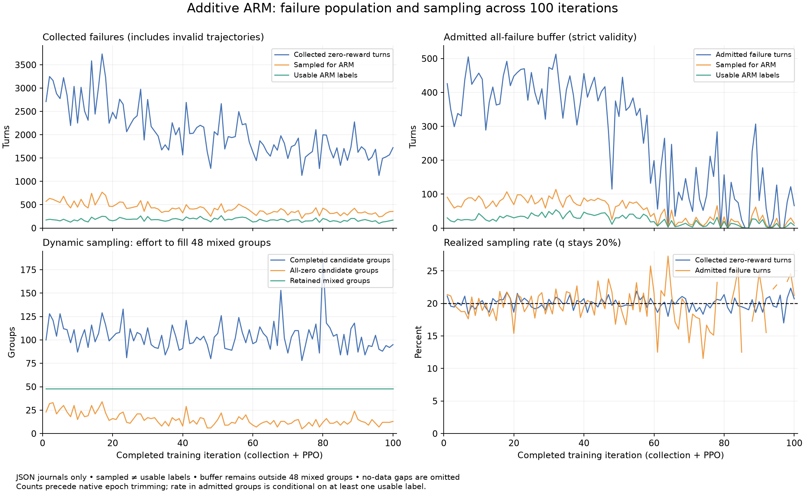
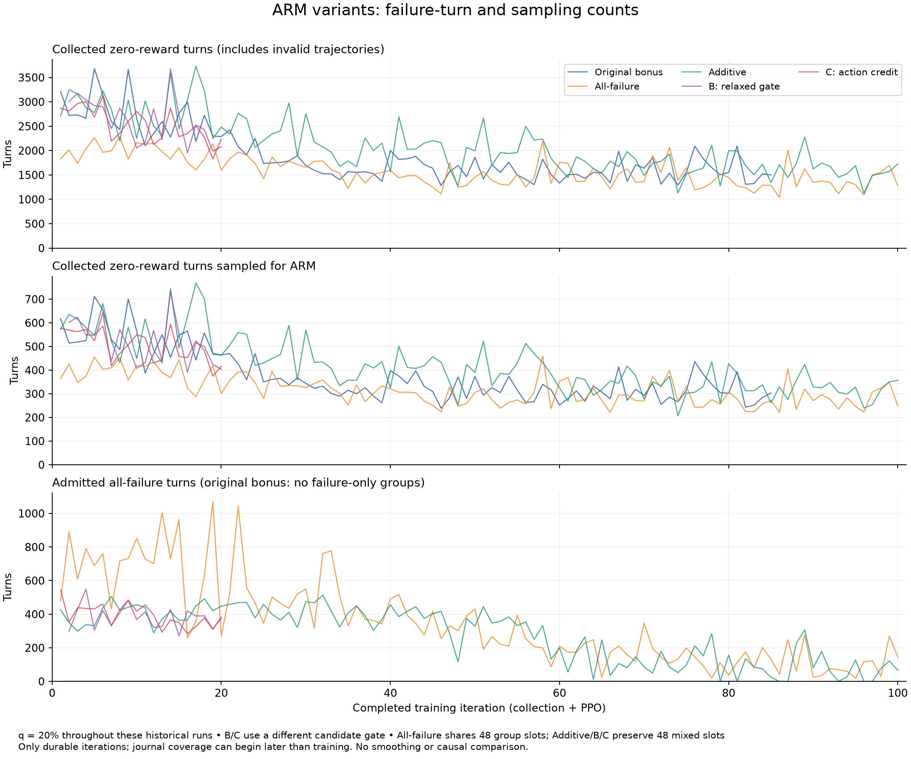

# Action reward models for OpenWebRL training

[Concise collaborator summary](ARM_SUMMARY.md) · [Three-stage ARM summary](ARM_RESULTS.md#arm-three-stage-summary) · [Current RL variants](ARM_RESULTS.md#arm-current-three-rl-variants) · [ARM results dashboard](ARM_RESULTS.md#arm-results-dashboard)

Latest decision, September 21: [audit frozen ARM quality across actor checkpoints](#arm-selection-quality-audit-20260921)
before scaling rescue. CPU preparation is complete; new inference compute is not yet authorized.

**Current priorities, 2026-09-12:** the user favors **failed-task rescue during
outcome RL** and **local ARM preference supervision during outcome RL**, and
wants independent implementations that can be tried concurrently. See the
[implementation design](#arm-rl-two-track-implementation) and broader
[RL options and rescue curriculum](#arm-rl-options-20260912). The one-GPU serial
check passed adapter/export parity but failed free generation (0/16 valid);
[the detailed audit](ARM_RESULTS.md#arm-serial-sft-comparison) distinguishes
missing alternatives, thinking boundaries, and tool-call schema errors.
The two directions have CPU-tested implementations and bounded GPU-pilot
launchers; scientific coefficients, GPU gates and new compute budgets remain pending.

Earlier inference/offline snapshot: **Inference ARM is the strongest result: baseline 30.0%, ScalarRM 38.0%, and SelectionARM 42.7% overall; valid-only rates are 33.7%, 45.4%, and 50.0%. Offline distillation has transferred weakly. Joint C2 + Piotr SFT reached 34.0% overall / 37.8% valid-only, while matched full-response DPO reached 34.7% / 40.9%; DPO versus SFT was 32 wins / 30 losses (exact paired p=0.8991). At the DPO endpoint, 75% of its held-out reference-relative margin change came from non-action tokens.** Later run outcomes and execution history belong to [ARM results](ARM_RESULTS.md).

The [judge alignment audit](ARM_INFERENCE.md#arm-judge-alignment) confirms the author's OpenWebRL results use o4-mini and describes the matching AgentTrek protocol. It also records the author's separate GPT-4.1 comparison and the known decoding differences. See the [C2 scaling results](ARM_RESULTS.md#arm-c2-scaling-results), [prepared full-300 comparison](ARM_SFT.md#arm-c2-full300-eval), [next SFT ablations](ARM_SFT.md#arm-filtered-sft-ablations), and [C2 run record](ARM_SFT.md#arm-c2-run).

Created: 2026-09-07. This is the working document for iterating on the plan originally proposed in conversation.

[Inference results, denominators, and retry plan](ARM_INFERENCE.md#arm-inference-results) · [Action-level filtered SFT pilot](ARM_SFT.md#arm-filtered-sft-plan).

[Matched retry pass](ARM_INFERENCE.md#arm-inference-retry-results): **held** pending a cohort decision using the three completed runs; C2 currently has execution priority. The earlier 56-task two-arm inventory is provisional, and automatic launch is disabled. **C2 is the selected first SFT experiment**; C1 is an optional later control and C3 is deferred. The user superseded the 128/32/32 draft with **all 2091 deduplicated tasks** and requested C2 after eval. The [SFT plan](ARM_SFT.md#arm-filtered-sft-plan) records the revised configuration; [C2 run status](ARM_SFT.md#arm-c2-run) records execution and artifacts.

<a id="arm-rl-next-directions-20260913"></a>
## Next directions after the conservative bonus run (2026-09-13; proposal)

**Subsequent decision:** the user selected priority 2 as an independent training
experiment and requested preparation. See [all-failure experiment readiness](#arm-all-failure-preparation-20260913).
The separately approved [eight-hour continuation](#arm-bonus-eight-hour-continuation-20260913)
runs the original conservative bonus recipe.

The user reopened failed-task rescue while job 294976 was training. The leading
proposal is to use ARM to discover successful trajectories on current-policy
failure tasks, then transfer those trajectories into the standalone actor during
outcome RL. This is a discussion record, not approval of another experiment or
allocation. The active bonus run keeps its existing configuration.

The completed collection in job 294976 had 112 group journals: 48 accepted,
37 rejected as `zero_std_0.0`, 24 as `zero_std_1.0`, two with no rewards and one
with only one nonempty reward. The native filter removes missing rewards before
checking variance, so 37 does **not** mean 37 verified 0/5 tasks. A preliminary
metadata audit finds 24 of those groups with five distinct, trainable,
non-aborted zero-reward trajectories; the other 13 have only three or four.
`failed` status can mean max-step exhaustion or policy format errors, so requiring
`completed` alone would also incorrectly exclude policy failures. Inspect terminal
reasons and judge provenance before admitting any rescue queue.

The retained calibration panel has 132 labels on 2,083 turns (6.337% coverage).
At beta=0.5, bonus/outcome advantage RMS is 6.070%, with no advantage sign flips.
This measures reward scale, not gradient contribution or model improvement.
All-zero groups remain excluded from optimization under the current recipe.

| Priority | Experiment | Reason to try / main uncertainty |
| --- | --- | --- |
| 1 | Valid failed-task ARM rescue plus a small successful-demo loss during ordinary outcome RL | Can discover complete successful paths absent from ordinary sampling; transfer to actor-only behavior remains unproven |
| 2 | Allow bounded local ARM updates on valid all-failure actor groups | Uses already sampled actor trajectories despite zero outcome variance; directly optimizing local preferences can reward unsuccessful behavior |
| 3 | Improve usable label coverage within the existing bonus recipe | Cheap continuation of the current experiment; increasing beta alone still cannot recover filtered-out tasks |

For rescue, freeze a current actor snapshot and its failure pool; use one initial
ARM-guided attempt per admitted task, K=5, full reasoning+action selection, the
same 15-turn horizon and GPT-4.1/action-history outcome judge. Start from the
real task entry state. Keep successful executed reasoning/actions as targets,
with preceding turns and images as context. Use a bounded, task-balanced buffer
and refresh it from each new actor snapshot. The earlier Track R loss and
32-demo-turn/256-outcome-turn cap are starting proposals, not validated settings.
Teacher rollouts must not be inserted as ordinary on-policy GRPO samples: action
selection changes the behavior distribution even when the candidates come from
the actor. A separate CE term makes the hybrid objective explicit.

First measure rescue yield against extra ordinary actor retries on the same
frozen training-task pool, with randomized scheduling and measured generation,
browser, judge, wall-time and GPU cost. One ARM trajectory and one ordinary retry
are not a compute-matched comparison. Next compare matched outcome-only training
against rescue-augmented training, and use ordinary-retry successful replay as the
control for extra supervised exposure if rescue yield justifies training. Use a
common verified starting checkpoint and evaluate the standalone actor. Report
training-task autonomous reattempts separately from held-out OM2W results.

The new hypothesis relative to C2 is **fresh failures of the evolving actor plus
continued outcome RL**, not merely collecting ARM traces again. Earlier weak
offline transfer lowers confidence. Expert Iteration and ReST-EM support the
general generate/improve/fit pattern; LUFFY motivates explicit mixed-policy
learning, but none establishes this browser rescue method's effectiveness.
See the literature links and alternative objectives in [Family A](#arm-rl-options-20260912)
and the existing [Track R implementation design](#arm-rl-two-track-implementation).

<a id="arm-rl-options-20260912"></a>
## RL options and rescue curriculum (2026-09-12; discussion)

The deployment target remains a single ordinary actor response per browser
turn, without ARM at inference. ARM's demonstrated value is comparing current-
state candidate responses. It is not a calibrated terminal-success value,
causal progress label, or guarantee that the best candidate is useful.

Interpret the proposed failed pass@5 pool as **zero successes in five complete,
valid browser trajectories**, not five action candidates. A training task with
success probability 0.2 still produces five failures with probability 0.8^5 =
32.8% under independent attempts. This is a temporary sampling decision, not a
claim of impossibility. Reuse recent compatible rollout groups; do not recollect
five trajectories if the current-policy evidence already exists. Unavailable
websites, transport failures, and unjudged attempts are separate from valid
policy failures. Never derive this training pool from held-out OM2W tasks.

### Independent design dimensions

| Dimension | Choices | Implication |
| --- | --- | --- |
| Problem being addressed | No discovered successes; weak local credit; drift; compute allocation | Rescue, local preference, outcome-trained critic, and curriculum target different bottlenecks |
| ARM's role | Choose exploration actions; label comparisons; supply rewards; initialize a critic; schedule work | These are not equivalent claims about score semantics |
| State distribution | Ordinary actor states; teacher states; intervention/recovery states; stale replay | A teacher-state-only learner may fail on its own mistakes |
| Candidate source | Current actor; lagged/reference actor; deliberately diverse draws; stronger external actor | Begin with the current actor to isolate ARM; stronger proposals address candidate coverage but add a new teacher |
| Where to spend ARM compute | All tasks/turns; zero-success tasks; selected turns; disagreement or loop triggers | Use measured rescue or learning yield per cost; raw confidence is uncalibrated |
| Training evidence | Verified successful trajectory; local preferred response; measured continuation return | Outcome verification supports success; local preference only supports relative ranking |
| Update | Auxiliary imitation; online DPO/listwise matching; policy gradient; off-policy actor-critic | Different losses require different provenance and behavior-policy accounting |
| Granularity | Full trajectory; turn; action tokens; reasoning+action; subgoal | Do not infer action-level causality from task-level success alone |
| Teacher schedule | Frozen ARM; fresh policy candidates; lagged actor snapshots; outcome-based ARM refresh | Candidate freshness and reward-model refresh are separate choices |
| Final system | One-sample actor; actor+selector/search | Our primary metric is the first; improvements to the second need transfer testing |

### Family A: rescue failed tasks, then learn during outcome RL

At each collection round, use a frozen snapshot of the current actor to measure
task outcomes. For eligible zero-success tasks, make a bounded number of new
attempts with the same actor plus SelectionARM best-of-five at each turn.
Judge actual terminal outcomes with the existing aligned protocol. Store only
the executed reasoning/actions and real observations as demonstration targets;
retain alternative draws separately for audit and possible local supervision.

This can discover successful paths absent from five ordinary full trajectories:
repeated step selection may compose locally available good decisions into a
path that ordinary sampling rarely follows. It cannot invent an action outside
the sampled candidates, and it can still choose the best of five bad actions.
Increasing K, changing sampling diversity, or introducing a stronger candidate
generator addresses proposal coverage; these should be distinct ablations from
the selector itself. Restricting the teacher to an action-only view is also a
separate change given the weaker compact-input inference result.

Four ways to use successful rescues:

1. **Separate successful-demonstration loss alongside ordinary GRPO.** Start
   with `L = L_outcome_GRPO(on-policy) + eta * L_demo(rescued successes)`.
   This is explicitly a hybrid imitation/RL algorithm. Refresh a bounded,
   task-balanced buffer; reduce rescue exposure when the unassisted actor
   begins succeeding. Keep ordinary task coverage. The first prototype can
   use the existing single-response loss format; action-only versus full-
   response supervision is a separate ablation, not an assumed improvement.
2. **Mixed on/off-policy reward-based updates.** Use successful rescues in a
   deliberately specified off-policy algorithm, with replay age and behavior
   provenance. This is more complex than adding a sixth successful sample to
   GRPO; the selected trajectory was not sampled from the ordinary actor.
3. **Teacher prefix, autonomous suffix.** Reproduce a real reachable prefix,
   stop teacher intervention, and let the actor complete the task. RL learns
   suffix behavior from the modified start-state distribution; the assisted
   prefix needs its own learning signal, and full-start evaluation remains
   necessary. On live sites, reconstructing the prefix must verify actual
   state; a screenshot is not a restorable browser environment.
4. **Iterative expert improvement / short imitation rounds followed by RL.**
   Generate rescues, update, recollect with the improved actor. This is a useful
   fallback if mixed losses are awkward, but static one-shot SFT would largely
   repeat C2's strategy.

**What is new versus C2:** C2 already selected actions with ARM and retained
successful trajectories. The hypotheses here are targeting current zero-success
tasks, refreshing with the evolving policy, and interleaving outcome learning.
Generating actor+ARM traces alone is not a new experiment. SFT/DPO's earlier
weak transfer remains relevant evidence against assuming easy internalization.

The closest conceptual links are [Expert Iteration](https://arxiv.org/abs/1705.08439)
(alternate improved decisions with policy learning) and
[Self-Imitation Learning](https://proceedings.mlr.press/v80/oh18b.html)
(use good past returns during RL). These are analogies, not evidence of ARM
transfer in live-browser tasks.
[LUFFY](https://arxiv.org/html/2504.14945v2) mixes external successful traces
with on-policy learning and explicitly investigates importance weighting and
entropy collapse. Its math results support investigating the family, not
copying its estimator as an exact correction for best-of-five selection.

### Family B: sparse interventions and corrections on actor states

Let the actor visit states normally; occasionally query ARM on candidate
responses from that exact state. Use the winning candidate as an auxiliary
target without executing it, or intervene for a short period and then return
control to the actor. The former is online correction; the latter changes the
visited state distribution and can expose useful later states. This is related
to [DAgger](https://proceedings.mlr.press/v15/ross11a.html), but our ARM is an
imperfect relative selector, not an expert action oracle. Disagreement-triggered
or loop-triggered intervention needs a fixed/random-turn control because the
trigger changes which states receive attention.

Full assisted attempts establish whether rescue works; sparse interventions
are a subsequent efficiency variant. They may also produce a smaller amount
of novel behavior for the actor to learn. Do not label unexecuted alternative
branches with the observed selected branch's terminal outcome.

### Family C: local preference learning alongside terminal RL

Keep the executed draw independent of ARM selection. On selected pre-action
states generate multiple same-state responses, ask ARM to compare them, and
update toward better candidates while preserving ordinary outcome learning.
Options include executed-only local advantage, an auxiliary update over all
candidates, online DPO, or a listwise/distribution-matching objective. They
share the preference signal but differ in update bias, clipping, normalization,
and coverage. The earlier [candidate-auxiliary proposal](#arm-candidate-auxiliary)
specifies one operating point, not the only RL option.

Candidate generation and ARM input retain full reasoning and action. Whether
the update directly weights reasoning or action tokens is an independent
choice. Candidate permutation and exact-action deduplication matter; do not
punish a loser action identical to the winner. A single selected index is not
a calibrated probability over candidates.

This family supplies a signal even for all-failure groups. Our existing
nonzero-reward-variance filter discards such groups, so exploiting them requires
an explicit separate data path or filter ablation. Merely returning different
turn rewards from `reward_func` also fails: the default trajectory reward
broadcast can erase local differences before the actor loss.

The main risk is optimizing locally preferred behavior without increasing
terminal success. Rewarding the best option even when every option is bad
can reinforce loops or verbose but unhelpful actions. Keep the auxiliary small,
log its actual gradient contribution, and evaluate ordinary actor success.

[BOND](https://arxiv.org/abs/2407.14622) targets the best-of-N distribution with
a divergence objective and moving anchor; it is not just winner-only SFT.
[WIND](https://arxiv.org/abs/2410.20727) connects iterative best-of-N distillation
to win-rate optimization. These motivate online alternatives to another static
DPO dataset, but do not provide browser outcome guarantees or an automatic
distribution formula for a set-dependent SelectionARM.

### Family D: ScalarRM reward shaping and trajectory reweighting

The simplest integration scores only executed responses with ScalarRM and adds
a bounded auxiliary reward, or uses ARM to weight trajectory losses/replay.
This saves candidate generation if raw scores suffice, but raw score offsets
across states and policies are uncalibrated. Prefer same-state relative scores
where feasible. A preference score is not a success probability.

Explicit turn reward-to-go requires correct cross-turn returns. Summing raw
scores rewards extra steps; averaging or taking minima changes the objective
but does not establish progress semantics. ARM-only RL and arbitrary trajectory
aggregations are low-priority controls, not recommended main experiments.

### Family E: train a critic or process model from real outcomes

Use ARM representations as initialization, then learn an outcome predictor
`V(history)` or `Q(history, action)` from actual returns. Alternatively train
an implicit process model from trajectory outcomes/preferences and refresh it
as the actor changes. The goal is success-related credit rather than agreement
with a frozen selector. This has substantial longer-term potential but adds a
new model-training and validation problem.

An action-dependent ARM score cannot simply be subtracted as a state baseline;
it changes the policy objective. A pre-action value must be independent of the
sampled action, and cross-turn GAE requires real successor/termination links.
Potential shaping requires a genuine state potential and correct terminal
conditions; renaming the scalar ARM output a potential is insufficient.

[iStar](https://arxiv.org/abs/2509.19199v3) combines outcome-trained implicit step
advantages with episode advantages and evaluates agent domains including
WebShop. [PRIME](https://arxiv.org/abs/2502.01456) similarly updates process
models from rollouts/outcomes in math and coding. Applying either family here
requires a new outcome-grounded objective; a selector's index likelihood is
not the actor-response likelihood used by an implicit PRM.

### Family F: continuation search, progress labels, and curriculum

ARM can propose where to branch, which candidate to investigate, which state
to revisit, or which tasks deserve additional attempts. If states can be
reproduced reliably, execute alternative continuations and compare subsequent
success. This generates stronger progress evidence, at higher browser cost.
Rank disagreement alone cannot tell us which action caused failure.
[Rewarding Progress](https://arxiv.org/abs/2410.08146) motivates rewards based
on changes in future success likelihood under a continuation policy; its
reasoning results do not remove live-browser state-restoration constraints.

Task-level alternatives include rescue-yield scheduling, prioritizing tasks
with some but inconsistent success, and generating easier related subgoals
when neither actor nor ARM can solve a task. ARM itself is not a validated task
generator. [WebRL](https://arxiv.org/abs/2411.02337) studies a failure-driven
task curriculum with outcome supervision, supporting this direction at the
family level. Retain representative ordinary tasks so the curriculum does not
collapse onto broken sites or a few repeatedly rescued hosts.

### Behavior-policy accounting across the options

Sampling K candidates from the actor and selecting with ARM induces a new
executed-action distribution. The chosen response's actor log probability is
not that distribution's probability. Correctly storing ordinary token log
probabilities does not fix this selection bias. Keep demonstration losses
separate, specify an off-policy method, or explicitly optimize the composite
policy.

For completeness, a mathematically distinct route treats the complete candidate
set as the sampled action and the fixed ARM selector as part of the environment.
A policy-gradient estimator then uses the sum of log probabilities of all K
sampled candidates (and downstream sets), not only the selected response.
This trains candidate generation for actor+ARM success, may have high variance,
and does not directly optimize one-sample actor performance. It is a lower-
priority route given the deployment target. Conditional selection probabilities
given one sampled set also do not equal the marginal behavior probability of
the selected text under repeated candidate sampling.

### Relative promise and first decisions

These are subjective priorities, not numerical success probabilities.

| Option | Near-term assessment | Main uncertainty / stop condition |
| --- | --- | --- |
| Failed-task rescue + separate demonstration loss during outcome RL | Leading conditional candidate; existing collector reusable | Must beat extra ordinary retries on useful success yield and transfer to an unassisted actor |
| Same rescue data with explicit mixed/off-policy RL | Promising if auxiliary imitation is undesirable | More estimator and stability work; best-of-N behavior probabilities are not ordinary actor logps |
| Sparse interventions / actor-state corrections | Promising efficiency variant after measuring rescue | Trigger quality, teacher-state dependence, and learnability of corrections |
| Outcome GRPO + local ARM preference auxiliary | Leading direct credit-assignment test | ARM agreement may rise while terminal success stays flat |
| Online listwise/BOND/WIND-style matching | Plausible alternative within local preference family | Additional objective complexity without direct web transfer evidence |
| Executed-only scalar bonus or ARM replay weighting | Cheap diagnostic / supporting mechanism | Uncalibrated scores and loss-weight bias |
| Outcome-trained critic / implicit PRM seeded by ARM | High longer-term potential, lower near-term certainty | Needs outcome data, held-out calibration, and reliable cross-turn credit |
| Counterfactual continuation search | Strong potential in reproducible environments | State restoration and browser cost constrain this setting |
| ARM-aware task scheduling | Useful complement to any route | Selection bias and repeated spending on unrescuable tasks |
| Composite actor+selector RL | Legitimate but poorly matched to our primary deployment goal | Ensemble gain may not transfer to one-sample actor |
| Raw ARM-only RL or score sums | Low priority | Reward exploitation, loops, length incentives, weak success semantics |

The first evidence-gathering comparison should use the current actor's eligible
zero-success training tasks, frozen before new attempts. Compare extra ordinary
actor rollouts against ARM-guided rescue on the same pool, with randomized order
or scheduling, identical horizons and judge, and both compute and browser-
interaction accounting. Best-of-five per turn is not cost-equivalent to one
ordinary trajectory or five entire trajectories. Report conditional rescue
rate, valid-only and all-attempt rates, unique newly solved tasks, tokens,
browser steps, judge calls, wall time and GPU-hours. Prefer saved fresh failure
groups over generating a separate expensive pass@5 screening dataset.

If the rescue yield justifies it, compare outcome-only RL, RL plus successful
ordinary-retry replay, and RL plus ARM-rescue replay with matched auxiliary
training exposure. Keep a local-ARM-auxiliary branch as a separate comparison;
combine routes only after each is understood. Evaluate the standalone actor
on held-out tasks and unassisted reattempts of rescued training tasks, reporting
the latter explicitly as training-task diagnostics. Neither a successful
teacher rescue nor an increased ARM score establishes student improvement.

The user endorsed the first two priorities and requested implementation planning
for concurrent trials. The proposed concrete rescue update below uses auxiliary
imitation during RL; exact coefficients, milestones and compute budgets remain
unapproved. No new collection, training, or allocation is launched by this plan.

<a id="arm-rl-two-track-implementation"></a>
## First two priorities: independent implementation and concurrent trials

**2026-09-12 implementation status:** opt-in collection adapters, exact component
objectives, auxiliary-file transport, Megatron loss dispatch and bounded live
pilot launchers are implemented and CPU tested. The isolated source is prepared
from the preserved baseline, with only ARM patches. **GPU restoration, live
collection/backward, gradient calibration and save/reload gates are pending.**
Long-run design manifests retain `launch_ready=false` and `compute_approved=false`.
See [exact losses and pilot readiness](#arm-rl-exact-losses-20260912).

### Common starting point and control

Create three separate experiment lineages: `control`, `rescue`, and
`local_preference`. Both experimental directions run independently; combine
them only after evaluating each. The proposed common starting point is the
latest durable baseline checkpoint after collection/training iteration 62,
`.../openwebrl-4b-reference-288861-20260912T040027/iter_0000061`, with 732 Adam
updates. Reload actor, optimizer, scheduler, RNG and task cursor for all three.
Its metadata/counters and sampled CPU tensor checks passed; full GPU reload of
this endpoint is still required. This initialization is a proposal, not a new
checkpoint-selection decision based on OM2W performance.

Build isolated runtime source snapshots from the preserved baseline source
`/gpfs/scrubbed/zixianma/openwebrl-runtime/reference-stage1-browsers32-20260911`,
then apply only the ARM integration changes. Do not replace it wholesale with
the experimental working tree. Give each experiment new W&B IDs under
`openwebrl-arm`, group `arm-rl-v1`, distinct output directories, ports, queues
and checkpoint pointers. Do not use the baseline resume wrapper's mutating
launch path or change `current_baseline.json` / W&B lineage `qcq7i4ug`.

Observed baseline arguments, read from the actual run rather than script
defaults, are:

| Setting | Shared initial recipe |
| --- | --- |
| Training | Full-parameter baseline continuation; no switch to the serial LoRA trainer |
| Tasks | Existing 2,102-task training file; same initial sampler/cursor |
| Collection | 48 accepted task groups × five trajectories; retain rejected-group audit |
| Optimizer | LR 1e-6 constant, Adam betas 0.9/0.98, weight decay 0.1 |
| Outcome updates | 256 executed-turn samples per optimizer batch, microbatch 1, two PPO epochs |
| PPO clip | Lower 0.2, upper 0.28 |
| Browser training | 15-step horizon, temperature 0.8, 1,024 response tokens, 32,768 context |
| History | Current screenshot, full historical reasoning, ordinary tool-call format |
| Training outcome judge | GPT-4.1, `action_history`, at most three attached images |

Keep these common initially so the experiment measures the additional ARM
signal rather than a new optimizer recipe. Task outcomes may cause accepted
groups and trajectories to diverge; log all attempted groups and compare both
interaction budgets and total GPU cost, not only wall time or accepted updates.

### Track R: failed-task rescue + a separate demonstration loss

1. **Failure queue.** At the completed-group hook, record five valid failures
   before the nonzero-variance filter discards them. Require same task and actor
   snapshot, valid terminal outcomes, exact prompt/environment protocol, and
   a task not used for OM2W evaluation. Keep infrastructure/blocked-site review
   separate. Version queues by policy round and judge.
2. **Rescue collection.** While that actor snapshot is still served, run one
   extra SelectionARM-guided attempt for each task admitted under the collection
   budget. Start with K=5 and full reasoning+action inputs. Make a matched extra
   ordinary-actor retry on the same pool to estimate added value beyond retrying;
   randomize order and record actual cost. More attempts are a later choice.
3. **Success admission.** Judge rescue and ordinary retry with the same training
   GPT-4.1 protocol as the five failures. Only usable executed responses from
   successful rescues enter the ARM demonstration buffer. Missing selector
   decisions or inference fallback cannot silently become ARM demonstrations.
4. **Learning.** Add `eta * L_demo` to ordinary GRPO, with full current-response
   reasoning and executed tool calls as targets. Prior turns and screenshots
   remain context. There are no serial alternatives in targets. Sample tasks
   first, then demonstrations/turns, to avoid long trajectories dominating.
5. **Exposure.** Proposed starting cap: up to 32 demo turns alongside each 256
   outcome-turn update. This is extra supervised exposure, not a change to the
   outcome batch denominator. Calibrate eta on training-only gradients for an
   initial auxiliary norm no greater than about 20% of the outcome gradient.
   Refresh each collection round and record replay age/use; no stale buffer
   should grow without bound. Zero rescues means ordinary GRPO continues.

The extra ordinary-retry successes are a control-data buffer, not silently mixed
into the ARM buffer. A follow-up control can use the same successful-replay
objective on that data with matched exposure. Teacher outcomes do not enter
ordinary group means, sampler success counters, or on-policy PPO ratios.

**Existing-data audit:** the latest archive contains 106 completed groups / 530
trajectories, including **13 distinct tasks with five valid zero rewards**.
All 13 passed a preliminary exact task-ID / normalized-intent OM2W exclusion.
None has populated per-turn `weight_versions`; the collection preceded later
optimizer updates. They are bootstrap candidates, not proven current-checkpoint
0/5 tasks. Reconstruct the collection-policy mapping or use freshly archived
groups for the exact experiment. Do not spend GPU time repeating screening
unless provenance or freshness actually requires it. The 13 is an observed
count, not an arbitrary new task limit.

[Bootstrap audit and candidate provenance](arm_results/rl_integration/rescue-bootstrap-audit.json).

### Track L: outcome GRPO + local ARM preference objective

1. **Keep ordinary execution.** Generate the original actor draw and designate
   it as executable before ARM ranking. Freeze the pre-action prompt, screenshot
   and causal history. On a deterministic 20% of turns, request four additional
   draws to form K=5; include policy/task/trajectory/turn/draw IDs in seeds.
2. **Label asynchronously.** Execute the designated ordinary draw independently
   of ARM. Bound and drain pending candidate/label work before the update. The
   ARM request uses only the captured pre-action state, full candidate reasoning
   and actions, and a recorded random candidate permutation. ARM failure or
   timeout drops local supervision without changing the ordinary trajectory.
3. **Local advantages.** For distinct executable actions, give the winner +1
   and distribute total -1 over distinct losing action classes. Same-action
   copies of the winner receive zero auxiliary weight; choose one deterministic
   representative per losing class. Skip all-identical or malformed groups.
   Record excluded candidates; do not fabricate a winner on parse failure.
4. **Learning.** Use a separate clipped action-token preference surrogate with
   old-policy candidate token log probabilities and a verified tool-call plus
   completion-boundary mask. The ordinary outcome objective retains its existing
   full-response semantics. Unexecuted candidates receive no terminal returns.
   Normalize local loss per state group, independent of K and action length.
5. **Initial scope.** Retain the baseline's outcome group filter for the first
   comparison; only local labels from accepted groups enter training. Archive
   all local labels anyway. Learning from all-failure/all-success groups is an
   explicit subsequent ablation, avoiding a second task-distribution change.
6. **Coefficient.** Calibrate lambda independently of Track R, initially limiting
   the auxiliary gradient norm to about 20% of the outcome norm. The two losses
   can conflict, so also log their gradient cosine on the calibration panel.

The 20% scored-turn fraction is a proposed initial compute cap, not literature-
derived. It produces approximately 1.8 actor responses per turn before retries
(1 + 0.2 × 4), plus one ARM call per scored turn. This is a token-work estimate,
not a predicted wall-time multiplier. A K=3 change is deferred to avoid changing
the teacher distribution before testing K=5.

### Shared implementation pieces and traps identified in the code

| Component | Existing entry point | Planned change |
| --- | --- | --- |
| Archive and failure queue | `slime/rollout/sglang_rollout.py` all-completed hook; archived group records | Preserve rejected failures and add explicit policy/judge identities; publish a bounded rescue queue |
| Candidate generation and ARM client | `openwebrl/arm_inference.py:ActionSelector`; `openwebrl/arm_c2.py:TurnExporter` | Extract reusable candidate/label operations and explicit execution policy; existing selector always returns the ARM winner |
| Browser rollout | `openwebrl/generate_browser.py:generate_turn_sample` | Track R guided collector separate from ordinary RL; Track L sidecar retains pre-action state and original executed draw |
| Training records | `Sample.train_metadata`, custom converter hook, `openwebrl/recipe_data.py` | Explicit sources `outcome`, `rescue_demo`, `arm_candidate`, plus masks, local advantages, weights and provenance |
| Transport | `slime/ray/rollout.py:_split_train_data_by_dp`; Megatron actor/data/model | Extend explicit field allowlists through DP partitioning, sequence balancing, CP slicing and microbatch assembly |
| Loss | Megatron `custom_loss_function_path` and existing policy/SFT reducers | Dispatch source-specific objectives, keeping component masks and global denominators separate |
| Controller | Existing collection, checkpoint and evaluation workers | Own/await all stages, isolate ports/run IDs, checkpoint replay cursor and pending work, reuse services within each policy round |

Source labels stored only in metadata currently will not reach the loss: the DP
split and Megatron forward both have explicit field lists. Nor can a custom
loss alone repair the data path. Each additional field needs an end-to-end
transport check. Teacher rows must not be fed through ordinary reward
normalization, whitening, entropy metrics or task-success accounting.

Adding auxiliary rows can accidentally dilute the original loss through the
global sample denominator. Preserve 256 outcome turns per optimizer update and
normalize the auxiliary component separately across the full update and DP/CP
ranks. Do not let added rows create extra baseline optimizer steps or change
the outcome loss scale. A zero auxiliary coefficient must recover the ordinary
baseline loss, gradients and update count, including with extra records present.

### Validation before parallel training

- CPU: five-valid-failure eligibility and deduplication; policy/judge joins;
  candidate permutation; equal-action handling; loss-mask token alignment;
  separate normalization; teacher-return isolation; zero-aux identity.
- GPU: restore the common full checkpoint/optimizer, validate TP2 image/token
  handling and action masks, run forward/backward for both auxiliary sources,
  measure their gradients, and save/reload one update. CPU arithmetic does not
  establish distributed correctness.
- Browser: five-task mechanics pilots per track, including an intentionally
  unavailable ARM response to verify ordinary execution still works in Track L.
  Validate real turn execution, selected-index mapping, and causal history.
- One full collection/update/checkpoint cycle before expanding training. Save
  checkpoints at every collection boundary and keep queues/resume state durable.
  Do not launch a full OM2W evaluation after a failed gate.

### Parallel execution and evaluation contract

The proposed economical profile is **two H200s, 16 CPUs and 240 GiB per track**,
so four GPUs for concurrent R/L. The baseline runtime has a TP2 restoration
path, but actor-plus-ARM co-serving on this exact profile is unverified: cap
rollout KV memory, colocate the frozen ARM only during collection, then offload
or stop it before actor backward. A GPU memory/throughput smoke decides whether
an additional shared selector GPU is worthwhile. Do not promise a runtime or
submit a job from this hardware sketch.

A fresh matched control is also needed. It can run sequentially, or on another
two-GPU worker if all three must run concurrently. A historical control with
different judge/decoding/browser conditions cannot replace it. Candidate
generation, replay buffers and policy snapshots remain separate across R/L;
only immutable ARM weights, input schemas and evaluation definitions may be
shared. Separate job lifetimes prevent one failed track from ending the other.

**Judge clarification requested by the user:** existing RL checkpoint evaluations
used **GPT-4.1**, including scheduled after-60 evaluation and standalone job
290361 after iteration 58. The latter's
[evaluation manifest](/gpfs/scrubbed/zixianma/openwebrl-runtime/evaluations/qcq7i4ug-record-290361-after58/evaluation_manifest.json)
explicitly identifies the deterministic GPT-4.1 monitor. Prior ARM inference
and offline SFT/DPO evaluations used **o4-mini/AgentTrek**. Training judge,
evaluation judge, decoding and browser backend must remain separately recorded.

The user requested OpenWebRL's default protocol. The paper distinguishes its
GPT-4.1/greedy training-curve monitor from its official benchmark protocol. Keep
the historical monitor as a separate series; use **o4-mini/AgentTrek, temperature
0.6, top-p 0.95, top-k 20, repetition penalty 1.0, 4,096 response tokens,
32,768 context, 30 steps and Browser Use stealth** for the benchmark comparison.
This supersedes the earlier 0.7/0.9 proposal. Training remains GPT-4.1.
See the [source/default audit and after-58 rerun](RL_EVALUATION.md#paper-om2w-protocol-20260912).
Evaluate the common starting checkpoint with the new protocol as well. The
existing fixed 100 tasks are a reused development cohort; full 300-task results
must report overall/valid-only rates, paired outcomes, unavailable tasks,
trajectory lengths, token cost and total GPU/browser/judge work.

Training duration and checkpoint evaluation milestones should be set after the
first measured cycle. Latest TP4 baseline collections averaged about 30 minutes;
that is evidence that a complete TP2 RL comparison is not another tiny serial-
SFT smoke. Do not quote a precise multi-arm runtime from SFT throughput. New
resource requests still require exact user approval under root AGENTS.md.

Prepared design artifacts:
[control](arm_results/rl_integration/control-design.json),
[rescue](arm_results/rl_integration/rescue-design.json),
[local preference](arm_results/rl_integration/local_preference-design.json).
The implementation below supersedes the earlier transport sketch. No baseline
lineage was modified and no new GPU job was submitted.

<a id="arm-rl-exact-losses-20260912"></a>
### Exact objectives and implemented mechanics pilots (2026-09-12)

The runnable reference objectives are [arm_rl.py](../arm_rl.py); live adapters
are [arm_rl_collection.py](../arm_rl_collection.py) and
[arm_rl_runtime.py](../arm_rl_runtime.py). The opt-in Megatron integration is
[arm_rl_megatron.py](../arm_rl_megatron.py). Training source:
`/gpfs/scrubbed/zixianma/openwebrl-runtime/reference-arm-rl-mechanics-20260912`.
It is an isolated copy of the preserved baseline with a recorded ARM-only patch.

**Shared outcome objective.** This branch preserves our running OpenWebRL
baseline, including its GPT-4.1 action-history training judge. A
[source comparison](arm_results/rl_integration/outcome-baseline-equivalence.json)
against the active baseline source verified identical reward-file bytes,
reward-normalization function AST and outcome-policy-loss function AST. The
terminal reward mapping also matches current upstream
[reward_browser.py](https://github.com/OpenWebRL/OpenWebRL/blob/main/openwebrl/reward_browser.py#L1194)
(checked 2026-09-12). The o4-mini/AgentTrek change belongs only to standalone
OM2W benchmark evaluation. It does not change the training reward or the rescue
success judge. The actual preserved reward implementation returns

$$
R_i=\begin{cases}
-1 & \text{termination is format\_error\_failed},\\
0 & \text{format invalid or terminal judge does not report success},\\
1 & \text{format valid and terminal GPT-4.1 judge reports success}.
\end{cases}
$$

Within each accepted task group, take one reward per trajectory (the preserved
code takes its first turn's propagated reward), subtract the group mean and
divide by **sample** standard deviation plus $10^{-6}$:

$$A_i=(R_i-\bar R_g)/(s_g+10^{-6}),\qquad
\rho_{itk}=\exp[\log\pi_{\theta,T=.8}(y_{itk}\mid h_{itk})-
\log\pi_{\mathrm{old},T=.8}(y_{itk}\mid h_{itk})].$$

Let $C(\rho,A)=\min(\rho A,\operatorname{clip}(\rho,0.8,1.28)A)$.
For the $B$ outcome turn rows in an optimizer window:

$$L_{\rm outcome}=-\frac1B\sum_{i,t\in\mathcal B}
\frac{\sum_k M^{\rm out}_{itk}C(\rho_{itk},A_i)}
{\max(1,\sum_k M^{\rm out}_{itk})}.$$

The original response mask covers current reasoning and action; history is
context. There is no KL or entropy term in this run. An important preserved
implementation detail: `remove_sample` zeroes a row's loss mask **after** reward
normalization; it does not necessarily remove that trajectory from group
statistics or the row denominator. The ARM forks keep that behavior unchanged.
Auxiliary eligibility is stricter and excludes invalid attempts. This audit
should not be read as claiming the baseline already filters every invalid
trajectory before its GRPO statistics.

**Track R: rescue plus outcome RL.** Require five distinct, valid zero-reward
attempts for the same task/policy/judge; collect an additional full-input K=5
SelectionARM-guided attempt and a separate ordinary retry. Only a verified
successful guided trajectory supplies demonstrations. For $D$ task-balanced
demonstration turns:

$$L_{\rm demo}=-\frac1D\sum_{d=1}^D\frac1{|Y_d|}
\sum_{k\in Y_d}\log\pi_{\theta,T=1}(y_{dk}\mid h_{dk}),\qquad
\boxed{L_R=L_{\rm outcome}+\eta L_{\rm demo}}.$$

$Y_d$ contains the executed current reasoning, tool calls and completion,
not the unexecuted alternatives. Use untempered logits for this CE. The rescue
reward is an admission criterion, never a sixth GRPO group member. Failed
rescues produce no demo loss. Guided and ordinary retry artifacts remain separate.
The proposed scientific exposure cap is 32 extra demo turns per 256 outcome rows.

**Track L: local preference plus outcome RL.** Execute ordinary candidate zero
regardless of ARM; on 20% of turns, sample four extra responses from the same
frozen pre-action context. ARM sees all five reasoning/action pairs in a recorded
permutation. Let $m_s$ be the number of distinct losing action classes:

$$a_{sj}=\begin{cases}
+1 & j\text{ is the selected response},\\
-1/m_s & j\text{ represents a distinct losing action class},\\
0 & \text{duplicate action response}.
\end{cases}$$

Skip all-identical or malformed groups. For $S$ eligible pre-action states,
use tool-call and completion-boundary masks $M^{\rm act}$:

$$L_{\rm local}=-\frac1S\sum_s\sum_{j:a_{sj}\ne0}
\frac{\sum_kM^{\rm act}_{sjk}C(\rho_{sjk},a_{sj})}
{\sum_kM^{\rm act}_{sjk}},\qquad
\boxed{L_L=L_{\rm outcome}+\lambda L_{\rm local}}.$$

There is **no additional division by K**: each state has positive mass +1 and
negative mass −1. With five distinct actions the advantages are +1 and four
values of −0.25. Unexecuted candidates never receive the executed branch's
terminal return. This is a local clipped preference surrogate, not DPO or a
calibrated estimate of eventual success. The ARM loss does not directly score
reasoning tokens; ordinary outcome RL still trains them.

**Completion-probability audit.** `_run_inference_step` appends canonical end
tokens with placeholder log-probabilities of zero. Using those in a PPO ratio
would be incorrect. The integration re-scores complete auxiliary responses with
the frozen restored actor before the first PPO epoch, including end tokens,
and reuses those old probabilities across both epochs. Exact sampled response
IDs must match the tokenizer's offsets before an action mask is admitted.

**Coefficient selection.** For each scientific track separately, measure gradients
on training-only data and initialize
$\eta=0.2\|g_{\rm outcome}\|/\|g_{\rm demo}\|$ or
$\lambda=0.2\|g_{\rm outcome}\|/\|g_{\rm local}\|$; require finite nonzero
norms, record gradient cosine and freeze the initial coefficient. This is a
starting scale, not a guarantee that its ratio stays 20% later. GPU calibration
is still pending. The mechanics pilots use coefficient **1** solely to exercise
the code; their checkpoints cannot be promoted as a scientific comparison.

**Transport and scaling.** Initial supported topology is TP2/DP1/CP1/PP1,
microbatch 1, static `thd` packing. A hashed per-collection tensor manifest carries
auxiliary rows separately from the outcome batch; the trainer loads it after
outcome collection, never through GRPO reward normalization. Local states join
their executed parent by sample ID after each epoch's shuffle. Auxiliary
microbatches are appended inside each existing optimizer window, with factors
$\eta B/D$ or $\lambda B/S$ before the original outer $1/B$ reduction. Optimizer
step count and outcome denominator stay fixed. Zero coefficients return the
original iterators. Other DP/CP/PP layouts fail explicitly until tested.

**Validation completed:** CPU reward/eligibility, causal selection and timeout
tests; real iterator assembly and differentiable source-dispatch checks; zero-aux
identity; action-mask alignment on **32/32 existing training examples** across
C2 and Piotr, plus **100/100 raw sampled C2 candidates** across 20 states.
These are mechanics checks, not new ARM performance results.
The [test receipt](arm_results/rl_integration/cpu-validation.json) records counts
and limitations; [mask audit](arm_results/rl_integration/action-mask-cpu-audit.json).

Prepared separate [R pilot](arm_results/rl_integration/rescue-pilot-plan.json) and
[L pilot](arm_results/rl_integration/local-preference-pilot-plan.json), run by
[run_arm_rl_pilot.py](../../scripts/run_arm_rl_pilot.py): restore after-62 and its
optimizer into a new lineage, collect **four accepted groups × five trajectories**,
use a **32-row outcome batch and two PPO epochs**, then save. R admits at most
two rescue tasks; L admits at most 16 local states for this gate. These smaller
pilot settings are separate from the proposed 48-group / 256-row scientific run.
ARM remains resident on one allocated GPU during this first memory test; GPU
co-serving has not yet been measured. Stop on failure; no automatic full eval
or longer training follows. Save/reload verification and gradient calibration
remain explicit subsequent gates, not asserted by the first pilot's completion.

**Compute status (2026-09-12):** the user approved the benchmark first, reducing
it to **two H200s × two hours**. Submitted **291005**, running on g008, 16 CPUs /
480 GiB, four GPU-hours and estimated $3.60 plus judge/Browser Use services.
See [evaluation execution details](RL_EVALUATION.md#paper-om2w-protocol-20260912).
The two independent mechanics pilots remain proposals, each two H200s × two
hours / 16 CPUs / 480 GiB; neither was submitted or newly approved. Their
combined requested budget is eight GPU-hours, estimated $7.20. Active baseline
allocation 290926 remains assigned to its original training lineage.

<a id="arm-rl-loss-implementation-review"></a>
### Demonstration and local-preference implementation review (2026-09-12)

This reviews the actual adapters above; it does not launch either training
track or change the baseline. The 25 objective/transport CPU tests pass. A
[bounded CPU audit](arm_results/rl_integration/loss-implementation-review.json)
also reproduces a demo-routing defect that the earlier tests did not cover.
Resolve the implementation findings below before the GPU mechanics pilot.

| Detail | Rescue demonstration term | Local preference term |
| --- | --- | --- |
| Data | Successful ARM-guided retry after five valid zero-reward attempts under the same policy | Five candidates from one frozen pre-action state; ordinary candidate zero executes regardless of ARM |
| Label | Terminal GPT-4.1 success admits the guided trajectory | SelectionARM winner, seeing reasoning and actions |
| Supervision | Full current assistant response, including reasoning, tool calls and generated completion tokens | Complete tool-call spans and `im_end`; current reasoning and trailing newline excluded from the direct token loss |
| Conditional input | Recorded history and screenshot | Same history/screenshot for all candidates; each action is teacher-forced after its own candidate reasoning |
| Objective | Unclipped CE at temperature 1 | Tokenwise clipped probability-ratio surrogate at temperature 0.8 |
| Reduction | Token mean within turn, then mean of task-balanced demo draws | Action-token mean within candidate, balanced winner/loser sum, then state mean |
| Old-policy probabilities | Not required mathematically | Re-scored under the frozen actor before any update and reused across PPO epochs |
| Outcome coupling | Separate demo rows, excluded from GRPO groups | Only valid accepted outcome parents are retained; state follows parent through each epoch's shuffle/trim |

The task-balanced demo sampler cycles through turns within tasks and can repeat
short trajectories. Its buffer is per collection; there is no persistent
cross-collection rescue replay implemented. It trains only the executed selected
responses, not all five alternatives. Ordinary retries are saved as controls
but do not currently supply demonstrations.

For five distinct local actions, advantages are `[+1, -0.25, -0.25, -0.25, -0.25]`
in winner-first order. For actions `[A,A,B,B,C]` with the second A selected,
advantages are `[0,+1,-0.5,0,-0.5]`. Duplicate losing classes use one deterministic
representative; reasoning differences within an action class do not add votes.
All-identical groups are skipped. There is no extra division by five and no
terminal reward assigned to unexecuted alternatives.

At identical current/old probabilities, the signed local loss is exactly zero,
yet its gradients with respect to candidate log probabilities are
`[-1,+0.25,+0.25,+0.25,+0.25]` in the one-token example. Zero is therefore not a
failure signal. Its scalar value is not a CE or preference accuracy. Action-only
masking removes direct reasoning-token targets; shared-parameter gradients can
still affect how the model processes and generates reasoning.

For a 256-row outcome optimizer window with 32 demos, each demo is multiplied
by `eta * 256 / 32` before the outer `/256`, giving exactly `eta/32` per demo.
For eight local states, each candidate receives `lambda * 256 / 8` before the
same outer reduction; its signed class advantage supplies the within-state
weight. Appending auxiliary microbatches adds forward/backward passes, not Adam
updates, and does not dilute the outcome denominator.

**Findings to resolve before launch:**

1. **Demo routing counts the wrong rows.** `finish_round` estimates optimizer
   windows from valid accepted rows, while the baseline trainer keeps invalid
   rows with zero loss masks and can use an effective batch size. The audit
   reproduces 64 outcome rows / 63 valid / batch 32: the trainer has two windows,
   but only window zero gets a demo. Assign task-balanced draws against the
   actual trainer windows after its batch construction, keeping baseline row
   handling fixed. Also cover the smaller effective-batch case in regression
   tests.
2. **Monitoring loses needed diagnostics.** The ARM wrapper discards the native
   outcome loss metrics, including clipping fraction and PPO KL. Its demo/local
   loss metrics are coefficient-weighted contributions, not raw component
   losses. Preserve native outcome diagnostics and add raw demo CE, raw local
   loss, local clipping/ratio statistics, state/demo counts and actual exposure;
   measure component gradients during calibration.
3. **Unnecessary demonstration forward pass.** `prepare_auxiliary` currently
   computes old-policy probabilities for all auxiliary rows, although demo CE
   never uses them. Restrict old-policy scoring to local candidates to avoid
   spending an extra forward pass on rescue demonstrations.
4. **Local-label provenance is not fully persisted.** The collection adapter
   constructs the raw ARM verdict, permutation and prompt/screenshot hashes,
   but `_persist_local` currently saves only candidate tensors and a reduced
   metadata record. Preserve those label-audit fields alongside the tensors.

The current local track deliberately cannot learn from groups rejected by the
baseline dynamic filter; adding local-only updates on all-failure groups would
change the training distribution and belongs to a separately specified variant.
Neither auxiliary term has completed an end-to-end GPU update. Pilot coefficient
1 is only a mechanics setting; the scientific coefficients remain uncalibrated.

<a id="arm-rl-simpler-options"></a>
### Simpler options under discussion (2026-09-12)

The user questioned the complexity of both auxiliary-loss tracks. The following
are proposed alternatives, not an approved recipe change or compute request.

**First recommendation for a direct RL experiment: ARM bonus on the executed
turn.** Keep ordinary actor execution and the existing PPO trainer. At a small
fraction of pre-action states, form five full reasoning/action candidates and
query SelectionARM, but train only the original executed candidate. For usable
sets with five distinct valid action classes, define `w_t=1` if ARM selected
the executed candidate and zero otherwise. After unchanged outcome trajectory
normalization, use `A_t=A_outcome + beta * (w_t - 1/5)` on scored turns and
`A_t=A_outcome` elsewhere. Example proposed scale beta=0.2 gives +0.16 or -0.04.
The scored fraction and beta are initial hypotheses, not calibrated findings.
ARM timeouts, malformed sets and duplicate-action sets contribute no bonus.

This keeps one PPO objective and its existing full-response mask, actor old
log-probabilities, batches and optimizer schedule. It needs one scalar per
executed turn, not auxiliary candidate training tensors. The alternatives are
still generated and audited during collection. With a nominal 10% scored-turn
budget, actor response count is approximately 1.4x before retries; actual
coverage may be lower after validity/diversity filtering. There is no extra
ARM use at deployment. Retain the baseline dynamic group filter initially.

This is a new shaped-advantage objective, not an algebraically equivalent
refactor of two separately clipped losses: clipping their sum behaves
differently. It also discards direct training on the four alternatives, trading
statistical efficiency for implementation simplicity. The preference bonus is
not an estimate of terminal success or causal progress. Keep it bounded and
judge improvements with actor-only terminal-success evaluation.
[PRIME](https://arxiv.org/abs/2502.01456) supports the broader process-plus-outcome
RL direction, but does not validate this frozen-ARM browser formulation.
[Rewarding Progress](https://arxiv.org/abs/2410.08146) reinforces the distinction
between predictive process scores and progress advantages.

**Second recommendation: staged rescue, SFT, then ordinary RL.** From the current
RL actor, collect outcome-verified ARM rescues on freshly observed 0/5 training
tasks. Run a short standalone full-response SFT phase using the existing
trainer, then resume ordinary outcome RL in a separate lineage. This removes
mixed-source optimizer windows, auxiliary weighting and simultaneous serving
during backward. Include a matched ordinary-retry data control to check that
ARM adds value beyond more attempts. The algorithm is still filtered SFT; the
new hypothesis is that current-policy, newly solved hard tasks are a better
data source and RL continuation makes the acquired behavior useful. Earlier
weak offline results lower confidence until that data advantage is observed.
The generate/filter/fit structure is supported by
[ReST-EM](https://arxiv.org/abs/2312.06585), whose evidence is in math/code rather
than browser tasks. Start with one cycle before proposing periodic alternation.

**Cheapest scoring alternative, lower confidence:** score only executed turns
with ScalarRM and add a bounded centered bonus to their advantages. This needs
no alternative generations, but adds uncertainty about cross-state score
calibration and direct optimization of a frozen scalar model. Ranking gains
alone do not establish a useful absolute reward scale.

<a id="serial-alternatives-sft"></a>
## Earlier discussion: one actor generates five alternatives and selects (2026-09-11)

**Approved and submitted:** all-five job **288893** and diverse-up-to-three job
**288894**, each **two H200s × four hours**, 16 CPUs / 240 GiB RAM. Both started
on g001 using their separate GPU allocations. Scheduler estimates $7.20 per
job ($14.40 total). The user explicitly approved both training/evaluation
pipelines. [Execution and results](ARM_RESULTS.md#arm-serial-sft-comparison).

**Latest:** both reached update 170, but initial evaluations produced no serial
alternatives and zero success. A train/evaluation system-instruction ordering
mismatch was identified and corrected on CPU; free generation and merge parity
must be checked before any corrected evaluation. Both jobs ended. This is not
yet a clean test of either SFT recipe; see the failure audit in the result record.
At that point the user favored a standalone model that generates every
alternative's reasoning and action, then emits the selected final action.
The subsequent validation failure is recorded in ARM_RESULTS.md; the current
discussion now compares the RL options above before committing more compute.

### Evidence and feasibility

Actions-only SelectionARM completed all 300 OM2W tasks at **35.0% overall /
41.5% valid-only**, versus historical full-reasoning SelectionARM **42.7% /
50.0%**. Paired shadow selections agree on exact action text 78.5% of the time.
This suggests that the existing selector uses candidate reasoning, but the
historical endpoint comparison does not isolate its causal contribution or
prove that verbose reasoning is necessary for a newly trained selector.
See [compact validation](ARM_INFERENCE.md#compact-candidate-selection).

A bounded CPU audit recovered the original five-candidate draws for every
state in the reviewed joint-pair pool, verifying C2 source hashes, Piotr draw
offset/hash identity, chosen-action joins, every candidate's tool schema and
reasoning boundary, completion structure, and the proposed final action.
It did not run a model, rasterize images, or use GPUs.

| Source | Audited train / held-out states | Usable train / held-out | Median proposed target, train | P95 target | Maximum target |
| --- | ---: | ---: | ---: | ---: | ---: |
| C2 / full SelectionARM | 3,464 / 442 | **3,422 / 437** | 1,679 | 2,655 | 4,390 |
| Piotr / released GPT-5.5 labels | 2,076 / 216 | **2,015 / 207** | 1,926 | 3,115 | 4,490 |
| Combined | 5,540 / 658 | **5,437 / 644** | — | — | 4,490 |

All 6,081 structurally usable examples fit **32,768 tokens** with their existing
image-expanded prefixes. Maximum prompt-plus-target is 29,553 tokens; training
source medians are 7,405 C2 and 7,340 Piotr. A 16K cap would exclude 157 usable
training states and 28 validation states. Only nine training targets exceed
4,096 tokens, but the current 1,024 generation limit is unsuitable.

These are exact counts for the audit serialization and existing prefixes,
not a frozen training manifest. New instructions, permutations, prefix think
boundaries, and final history projection must be tokenized again. Prior image
and decontamination audits were reused, not repeated. Full reasoning quality
was not semantically verified. Piotr has no finish metadata; the existing
conservative completion-cap heuristic was retained.

Artifacts: [audit report](arm_results/serial_sft_feasibility.json),
[reproducible CPU audit](../../scripts/audit_arm_serial_sft.py).

### Data and target

1. Start with the **5,437 usable joint training states**, keeping the inherited
   task-disjoint split and natural source mixture. Use all five original
   alternatives, including unselected ones. Do not attach successful terminal
   outcomes to unexecuted alternatives or describe every unselected option as
   wrong. C2 winners retain their verified successful-trajectory provenance;
   Piotr labels remain teacher preferences without that outcome claim.
2. Exclude the whole state if any candidate is malformed/truncated; the audit
   excludes 103 training and 14 validation states. Do not silently repair or
   drop a candidate while keeping an unchanged five-way label. Original
   duplicate actions can remain with their distinct reasoning; measure action
   diversity and score action-equivalent winners appropriately.
3. Use original training sources only. **No baseline, full-ARM, compact-ARM,
   or shadow OM2W evaluation trajectories become training examples.** Recheck
   the inherited task/domain/text decontamination and preserve all source IDs.
4. Deterministically permute candidate order per state, remap the chosen ID,
   and freeze the permutation in the manifest. Do not put the winner last or
   first by construction. This teaches an order-independent choice target;
   it is not a new claim that the teacher was rerun and invariant to order.
5. Input remains task, current screenshot, URL, and prior executed history.
   All five current alternatives are **generated target text**, not supplied
   as inference inputs. Use the saved full-input teacher's winner, not a
   compact-selector label. There is no teacher comparison rationale for C2;
   supervise the chosen ID without fabricating one.

Schematic response (all five alternatives, abbreviated here):

```text
<think>
<alternative id="1">
Reasoning: [original candidate 1 reasoning]
Proposed action: [{"name": "click", "arguments": {...}}]
</alternative>
...
<alternative id="5">
Reasoning: [original candidate 5 reasoning]
Proposed action: [{"name": "scroll", "arguments": {...}}]
</alternative>
Selected alternative: 3
</think>
<tool_call>{"name": "click", "arguments": {...selected action...}}</tool_call>
```

Alternatives use inert action JSON. Only the final selected action uses actual
tool-call tags. Escape embedded markup/control tokens and retain multi-call
sequences as one candidate action. Handle an opening think tag already supplied
by the chat prefix without duplicating it; supervise exactly one turn boundary.

### Essential runtime changes

The current regex tool parser searches the entire response and would execute
tool-call blocks inside reasoning. Merely concatenating original responses
is therefore incorrect. Add a strict parser for this mode: require five
well-formed alternatives, a valid choice, and a final call sequence matching
the chosen alternative; parse executable calls only after the closing think
boundary. Missing/truncated/mismatched final output must not execute a candidate
as fallback. Test quoted tags, multiple calls, malformed boundaries, and EOS.

Archive the complete generated response, but put **only the selected
alternative's reasoning and action** into the next turn's history, together
with the actual browser observation. This preserves the existing training
history shape and avoids accumulating five reasoning traces every turn. Apply
the same projection when reconstructing training histories. It is a deliberate
history representation change, so evaluate it explicitly and include a
compatible baseline control when making causal claims.

### Recommended first SFT recipe

| Setting | Proposal and basis |
| --- | --- |
| Initialization | Original OpenWebRL-4B-SFT, not a prior C2/DPO checkpoint |
| Trainable weights | Existing language-layer LoRA rank 16, alpha 32, dropout 0.05; vision frozen |
| Precision / memory | BF16, activation checkpointing, response-position logits and chunked FP32 log-probability arithmetic |
| Effective batch | 32 states: two GPUs, microbatch 1 per GPU, 16 accumulation steps |
| Optimizer | AdamW, LR 1e-5, betas (0.9, 0.95), weight decay 0.01, gradient clip 1.0 |
| Schedule | Existing exposure-based warmup over 512 states, half-cosine decay to 5e-6 |
| Exposure | One pass over 5,437 states: **170 updates**, subject to final manifest |
| Checkpoints | Updates 43, 85, 128, 170; optimizer/RNG/cursor included |
| Context / output | 32K total; initial generation ceiling 6,144 tokens, dynamically bounded by remaining context |

Keep these capacity/optimization settings matched to the joint SFT baseline
for a first pilot, rather than changing rank, full fine-tuning and schedule
together. Batch 32 matches **state exposure**, not target-token exposure:
targets average about 1,853 tokens versus 348 for the old winners, about 5.3x
more supervised tokens per state. Prompt-plus-target increases much less
because the existing prefixes dominate; throughput and memory still need a
GPU smoke measurement. The trainer currently hardcodes 5,540 examples and
two equal rank batches; make counts configurable and handle the last 29 real
examples with zero-weight padding and correct global normalization.

Use response-only SFT with separately normalized segments:

```text
L = 0.50 * mean_CE(all five alternatives)
  + 0.10 * mean_CE(selection field)
  + 0.40 * mean_CE(final executable action and turn boundary)
```

This still trains every alternative's reasoning/action. Uniform token averaging
would give approximately 97% of the loss weight to alternatives and only a few
percent to the final decision/action. The proposed weights are an explicit
initial heuristic, not an ARM-repository setting or a proven optimum. Verify
segment masks and log raw CE plus weighted contributions and gradient norms;
do not select checkpoints on aggregate CE alone. A matched winner-only control
on the same retained rows would be needed to isolate serialization from loss
weighting/data changes; the historical 34.0% joint SFT is a reference first.

### Validation and decision gates

- **Before training:** freeze source hashes/splits, render complete examples,
  verify image/prefix and segment-mask identity, round-trip every chosen action,
  and test that hypothetical calls never execute. No partial-target truncation.
- **GPU smoke:** median and longest examples forward/backward, full versus
  optimized loss agreement, finite nonzero gradients, save/reload parity,
  peak memory, and median/P95 step time. Resize no images or histories silently
  to pass a memory gate.
- **At the four checkpoints:** segment CE on held-out task groups; teacher
  agreement when given saved alternatives; index and equivalent-action
  accuracy under held-out permutations, compared with position and random
  baselines. Keep this selection-only test separate from free generation.
- **Free generation on a fixed held-out panel:** generate five alternatives
  and the choice from only the browser state; measure format validity,
  final/selected consistency, distinct actions, premature termination, token
  lengths, and median/P95 latency. Optionally rescore the generated set with
  full SelectionARM as an offline diagnostic, never the deployed selector.
  Teacher-forced selection accuracy alone cannot demonstrate transfer to
  self-generated candidates.
- **Online pilot:** evaluate the selected checkpoint on the existing fixed
  100 OM2W tasks with o4-mini/AgentTrek, overall and valid-only rates, paired
  task results, unavailability reasons, loops, context overflow, and per-turn
  latency. The repeatedly used 100-task subset is a development benchmark.
  Use a fresh comparable base actor run for a current-site control when budget
  permits, and explicitly label historical comparisons otherwise. Advance to
  full 300 only if generation is valid, choice shows more than positional
  learning, and success/latency merits the expense. Full 300 includes the
  repeatedly inspected 100, so it is not a pristine held-out test.

### Cost, risks, and recommendation

Feasibility is strong for data reconstruction and context length; GPU fit and
learning remain untested. Prior two-GPU joint SFT took about 67 minutes from
initial validation through update 174/final diagnostics. Longer response logits,
new masks and free-generation diagnostics increase that cost. A provisional
planning envelope is **two H200s for four hours (8 GPU-hours)** for startup,
one epoch and a fixed-100 pilot, with about 1.5–2.5 hours for training/checks
and 0.5–1.5 hours for generation/evaluation. This is not a benchmarked promise
or a new allocation request; measure a short smoke before committing the full
queue. Full-300 evaluation and any fresh control need a separate measured
budget. No submission occurs without explicit exact-resource approval.

One serial response removes a model/server handoff, but still generates all
five reasoning traces. It has roughly 5.3x the old response tokens and may be
slower than five parallel candidates plus a short ARM decision. Measure
single-task latency and batched throughput separately; one call is not evidence
of a speedup. Independently sampled training alternatives also become
conditionally generated alternatives at deployment, so copying/repetition and
loss of diversity are major risks. Alternatives can contain plausible but
incorrect reasoning, and the final action can copy a choice without learning
robust ranking. This is a promising **behavioral feasibility pilot**, not yet
an efficient-deployment solution or a likely guaranteed recovery of 42.7%.

[Stream of Search](https://arxiv.org/abs/2404.03683) provides a related precedent
for training a language model on serialized search including non-final paths.
Its experiments use symbolic Countdown search, not web agents, so it supports
the representation idea rather than predicting our success or speed.

<a id="serial-alternatives-diversity-variant"></a>
### Proposed diversity variant and four-GPU budget

The initial budget discussion considered four GPUs for two hours. The user
subsequently approved **two GPUs × four hours for each variant**; jobs 288893
and 288894 implement that approved comparison. The budget alternatives below
are preserved as the earlier reasoning, not the current allocation request.

The CPU audit finds exact action-count distributions below in the 5,437 usable
training groups. Equality is schema-normalized action JSON, including the
entire ordered multi-call sequence, not reasoning-text similarity.

| Distinct actions among five candidates | Training states |
| --- | ---: |
| 2 | 915 |
| 3 | 1,088 |
| 4 | 1,269 |
| 5 | 2,165 |

Thus **60.2%** have at least one duplicate, and exact deduplication alone leaves
**3.86 alternatives on average**. Capping at three after deduplication would
leave **2.83 on average**; additional near-duplicate removal can reduce this
further. These are candidate counts, not measured token or wall-time savings:
reasoning lengths differ and unchanged browser prefixes remain substantial.

Proposed comparison:

- **A: all five.** The preceding plan unchanged.
- **B: diverse, variable 1–3.** Preserve the original winning candidate, complete
  reasoning included. Retain up to two sufficiently different alternatives;
  generate a choice once no further useful distinct alternative is needed.
  A cap of three is a proposed cost/coverage tradeoff, not a discovered optimum.
  Unlike fixed top-three, no duplicate padding is used to reach three.

Proposed offline selection pipeline for B:

1. Parse and canonicalize every full action sequence, materializing schema
   defaults. Preserve URLs, typed text, key combinations, direction, call order,
   and actual coordinates. Do not normalize away meaningful tool arguments.
2. Collapse identical actions. In the winner's group retain the original
   winner's reasoning; elsewhere choose the representative by a seeded hash,
   not shortest reasoning or an invented quality score. Different reasoning
   for the same action is deliberately removed in B; this may lose useful
   reasoning diversity and is one question the comparison tests.
3. Build a typed action distance from operation sequence, target and meaningful
   arguments. Small coordinate jitter or a minor scroll-amount difference is
   low novelty; a different target, URL, typed value or direction is higher
   novelty. Do not use reasoning embeddings or raw farthest-pixel distance.
   A `done` action receives no special novelty bonus. Coordinate units must be
   verified against the actor-to-browser conversion before setting a threshold:
   prompt schema wording and actual coordinate convention may differ.
4. Starting with the winner, greedily add the candidate whose **minimum distance
   to retained candidates** is greatest. Stop at three or when the best remaining
   candidate is below the novelty threshold. Freeze distance weights, threshold,
   and hash tie-breaking after a training-only CPU review of examples. Nearby
   clicks do not prove identical DOM targets; flag those decisions separately
   and avoid merging ambiguous targets without supporting evidence.
5. Shuffle the retained order and remap the winning index. The winner is retained
   during offline target construction, never supplied at inference. Do not run
   ARM at deployment or first generate five candidates and prune them afterward:
   the student must learn to generate the smaller set directly.

Reusing the original winner after pruning is a distillation target, not a
verified claim that SelectionARM would choose identically on a reduced set.
Audit this subset sensitivity on a fixed training/validation panel with the
full-reasoning teacher if GPU budget permits; report changed preferences rather
than silently mixing original and relabeled choices. Keep the whole original
state-level train/validation split and the same 5,437 input states in A and B.
Keep initialization, rank, optimizer, global state batch, 170-update exposure,
segment loss weights and checkpoint fractions matched. Let B's parser accept
1–3 alternatives; its generated stopping boundary is supervised. Log actual
candidate counts, tokens and duplicate rates separately from success.

The first CPU deliverable before building B is a review panel and a report of
retained K, exact/near-duplicate exclusions, source/action-type coverage, winner
retention, token lengths and candidate-order remapping. A same-K random-subset
diagnostic helps check whether the distance heuristic adds value beyond simply
using fewer candidates; an additional trained random-subset control is deferred.
The A/B result jointly changes count and diversity, so it cannot by itself
attribute any gain specifically to the distance heuristic.

**Budget interpretation:** four H200s × two hours is the same eight GPU-hours
as the preceding two-H200 × four-hour envelope for **one model**. For one model,
four-way DDP at microbatch one / accumulation eight preserves global batch 32.
Training may approach half the two-GPU time, but startup, validation, storage,
and browser work do not scale linearly. Generalize and verify the currently
two-rank-only trainer; use independent one-GPU evaluation shards rather than
assuming four-way model parallelism accelerates small-model inference.
One complete pilot within two hours is plausible but requires measured startup
and throughput gates.

For **both models**, split four GPUs into two independent two-GPU workers.
Each receives only four GPU-hours under a two-hour ceiling. This is substantially
tighter than the prior per-model budget; shorter B targets do not proportionally
shorten training because prefixes are unchanged. Do not promise both 170-update
runs plus two complete fixed-100 evaluations in that envelope. Either use
four × two hours for one complete pilot first, or plan a larger measured
two-model budget (provisionally four × four hours, 16 GPU-hours) if both complete
training/evaluation pipelines are required together. This is a proposal, not
approval to request additional compute or silently shorten training/evaluation.

<a id="arm-candidate-auxiliary"></a>
## 0. Earlier post-distillation ARM integration proposal (2026-09-11)

This is the earlier proposal for teacher critique. It superseded the earlier
recommendation to begin with another standalone preference or filtered-SFT
stage. The broader option catalog later in this document remains useful, but
the experiment below is one candidate within the expanded RL comparison above.

### Evidence that determines the design

| Observation | Consequence |
| --- | --- |
| SelectionARM best-of-five improved OM2W by 12.7 points overall over the one-sample actor | Use same-state comparative selection; this is the ARM behavior with direct evidence |
| Joint SFT and full-response DPO improved the standalone actor by only 4.0 and 4.7 points over the historical base, without a significant primary paired result | Do not make another static distillation stage the main integration |
| Full-response DPO changed held-out relative margin by +0.999 on average, of which only +0.252 came from action tokens | Apply the ARM auxiliary objective to executable action tokens, not reasoning prose |
| Full-response DPO had 16 context-overflow aborts versus 3 for SFT | Track response/history growth and keep context overflow as a policy metric |
| ARM labels express a winner within a sampled candidate set, not calibrated eventual success or progress | Center rewards within each state; do not sum raw ARM scores down a trajectory |

Machine-readable supporting audits are
[offline-objective-audit.json](arm_results/joint_data_v2/offline-objective-audit.json)
and [availability-audit.json](arm_results/joint_data_v2/availability-audit.json).

### Target and proposed objective

The primary target is held-out success of a **standalone one-sample actor**.
Actor-plus-SelectionARM remains a separately reported deployment and positive
control. Terminal browser success remains the main RL objective.

At a visited pre-action state `h_t`, draw `K` responses independently from the
current actor. Designate one draw independently of ARM ranking as the action
executed in the browser. Randomly permute candidate order before sending the
set to the frozen SelectionARM. For a valid, non-duplicate candidate set with
winner `w`, define zero-mean local advantages:

```text
A_arm(t,j) = +1                 if j = w
             -1 / (K - 1)      otherwise

L_total = L_outcome_GRPO + lambda * L_ARM_action
```

`L_outcome_GRPO` is the existing trajectory-outcome objective and applies only
to executed rollout samples under its existing token semantics. `L_ARM_action`
is a contextual-bandit auxiliary objective over candidates sampled at the same
state. It applies only to verified tool-call tokens and the common completion
boundary. Reasoning stays in the causal prefix and receives no direct ARM
weight. Unexecuted candidates receive no terminal reward.

The executed draw must remain independent of ARM selection in this first
experiment. Executing the ARM winner changes the behavior policy; treating its
ordinary actor log probability as the behavior probability would make the
standard PPO/GRPO ratio incorrect. ARM-guided execution is a separate route
requiring a selection-aware estimator or use as an explicitly off-policy data
source.

### Initial operating point

- Use SelectionARM as the labeler. ScalarRM is optional shadow telemetry, not
  required for the first training path.
- Begin with `K=3` candidates at every scored turn to limit actor decoding
  overhead. Before freezing the training budget, use shadow data to compare its
  validity and agreement with the validated `K=5` setup. If `K=3` is materially
  worse, use `K=5` on a deterministic subset of turns rather than silently
  changing the label distribution.
- Freeze SelectionARM, prompt, processor, schema, candidate temperature, and
  coordinate contract within the run.
- Choose `lambda` from a training-only gradient calibration so the initial ARM
  gradient norm is at most 20–25% of the outcome gradient norm. Log the two
  gradient norms and losses separately. Include `lambda=0` as a tested identity
  path through the new plumbing.
- In the first comparison, retain only the trajectory groups accepted by the
  existing outcome filter. Allowing ARM-only learning from valid all-failure or
  all-success groups is a later isolated ablation because it changes the state
  and task distribution used for updates.
- ARM parse failure, duplicate effective actions, missing causal state, or mask
  failure sets the local loss to zero. It must not invalidate otherwise usable
  terminal supervision.

### Rollout and training data contract

Each candidate group must retain:

- stable trajectory, state, turn, candidate, and draw IDs;
- the exact pre-action task, screenshot, URL, and causal action history supplied
  to ARM;
- response text, token IDs, old-policy token log probabilities, sampling
  temperature, and finish reason;
- decoded normalized actions, exact tool-call/completion-boundary token mask,
  duplicate-action equivalence class, and parser status;
- pre-permutation and ARM-visible candidate order, selected index, executed
  index, schema/fallback status, and frozen model/prompt revisions;
- terminal outcome and validity only on the executed trajectory branch.

Candidate records must survive dynamic filtering for audit, even when they do
not enter the optimizer. Adaptive task-success statistics continue to use only
the terminal judge outcome.

### Implementation boundaries

1. Extend `openwebrl/generate_browser.py` to produce same-state candidate groups
   and preserve one independently designated executed draw.
2. Reuse the pinned ARM serving/client path with batched SelectionARM requests,
   randomized-order manifests, and explicit unavailable results.
3. Keep `openwebrl/reward_browser.py` responsible for terminal outcome only.
4. Extend rollout transport and postprocessing with a separate state-group ARM
   advantage and action-token mask. The existing first-turn reward broadcast
   cannot represent this objective.
5. Add an actor-loss term that consumes unexecuted same-state candidates without
   assigning them terminal returns. Report outcome and ARM losses and gradient
   norms independently before combining them.
6. Extend `recipe_data.py` exports so every score, exclusion, and training use is
   reproducible offline.

### Staged experiment and decision gates

**Stage A — shadow scoring.** Run ordinary outcome-policy rollouts. Generate and
score candidate groups without changing actions or optimizer inputs. Measure
ARM availability, duplicate rate, order sensitivity, action-type coverage,
latency, tokens, GPU-hours, and association with terminal success, loops,
termination, and context overflow. This stage validates the data path and sets
`K` and `lambda`; it does not claim causal reward quality.

**Stage B — controlled hybrid pilot.** Start baseline and hybrid branches from
the same actor checkpoint. Match tasks, seeds, browser-interaction budget,
horizon, judge, outcome filter, and optimizer settings. The hybrid adds only
`L_ARM_action`. Report both environment-interaction-matched and total-compute
cost because candidate generation is not free.

**Stage C — held-out evaluation.** Evaluate standalone one-sample actors without
ARM. Keep actor-plus-SelectionARM best-of-five as the inference positive
control. Report overall and valid-only success, paired wins/losses, context
overflow, loops, termination, trajectory length, generated tokens, and GPU-hours.

Promote the hybrid only if it improves held-out terminal success without a
material availability or behavior regression. Improved ARM agreement alone is
not a promotion criterion. If ARM ranking improves but terminal success does
not, stop this frozen-label route and move to outcome-trained step rewards or
execution-grounded progress labels. If the hybrid improves, next isolate use of
uniform-outcome groups and then current-policy ARM refresh.

### Likelihood judgments and alternatives

These ranges are subjective planning estimates, not measured probabilities:

| Route | Chance of a useful standalone-policy improvement | Current judgment |
| --- | ---: | --- |
| Outcome GRPO + action-token candidate auxiliary | 40–60% | Best next research test; preserves outcome learning and uses ARM comparatively |
| ARM-guided collection followed by static imitation/preference learning | 25–40% | Offline experiments show weak transfer and loss of test-time candidate diversity |
| Sum/average ARM scores as dense trajectory reward | 10–25% | State offsets, length incentives, and weak progress semantics make this risky |
| SelectionARM at deployment | High confidence for OM2W actor-plus-ARM behavior | Already measured; does not yield a standalone policy |

### Questions for external critique

1. Is the candidate-set contextual-bandit objective statistically correct when
   states come from the executed on-policy trajectory but extra actions are not
   executed?
2. Should the local objective use centered winner indicators, pairwise DPO, or a
   listwise policy-gradient surrogate, and what normalization preserves a clean
   `lambda` interpretation?
3. Does applying gradients only to action tokens create an unacceptable mismatch
   because actions are conditioned on branch-specific sampled reasoning?
4. Is independently executing one candidate sufficient for an on-policy outcome
   estimator when all candidate responses share generation infrastructure?
5. What control best separates extra actor sampling compute from ARM supervision:
   discarded extra candidates, matched wall-clock, or matched total tokens?
6. Are there failure modes in mixing trajectory-level GRPO and state-level local
   advantages that the proposed separate-loss implementation misses?

## 1. Current priority: reproduce Online-Mind2Web inference gains

The user selected inference validation as the first milestone. Use the frozen actor `OpenWebRL/OpenWebRL-4B-SFT` with these two exact reward model releases:

| Arm | Candidate actions per turn | Selection | README success target |
| --- | --- | --- | --- |
| Baseline | 1 | Execute actor sample | 33.8% |
| Scalar | 5 | `PTeterwak/OpenWebRL-4B-ScalarRM-LoRA` argmax | 46.3% |
| Selection | 5 | `PTeterwak/OpenWebRL-4B-SelectionARM` | 51.1% |

Use temperature 0.7 for the initial matched comparison, normalized coordinates, the same frozen actor, 300 fixed local task IDs, and the Online-Mind2Web AgentTrek/o4-mini evaluation protocol. Any unknown original setting must be marked as a reconstruction rather than claimed to be exact. A fresh-browser run is required for each arm; candidate sets can be shared for offline same-state audits, but complete interactive trajectories diverge after selection.

Pinned releases resolved on 2026-09-07:

- Actor: `15e777db2ddba2e0e82080ebccd3ad8d215b7f0a` (matches the existing downloaded actor manifest).
- Selection: `81b452d800d9f859687074f82680dd5257e02d89`.
- Scalar adapter/head: `71c58489cd7cbaebcd74656df7ef11ba818661b8`.
- ARM source: `02276b0ff3b9048d34e6a2afdcb9042dd9018c8c`.

### Reproduction sequence

1. Save pinned source/model provenance, prepare model-specific serving in an isolated environment, and verify score/prompt/coordinate contracts.
2. Run offline scoring and a small live smoke across all three arms.
3. Run the full fixed 300-task comparison with resumed per-task output, serialized candidate/selection traces, and a shared judge configuration.
4. Report success over all scheduled tasks, valid-run success, task coverage, infrastructure/judge failures, and paired differences on common evaluable tasks. Do not silently discard different failed tasks in each arm. Repeated runs and paired uncertainty estimates should qualify the observed gains.
5. Return to the training plan only after assessing inference behavior and resource cost.

### Newly discovered limitations

- The published dashboard does not give exactly the README denominators: its August data include n=1 95/276 and trained ARM 140/282; September reports another aborted-task exclusion. Exact README run manifests and the scalar per-task labels are not present in the inspected release. Record the README values as reported targets, not an established matching protocol.
- Some exported dashboard ARM prompts ask for an explanation and contain system-prompt text in the action-history field, whereas the released canonical selection builder requires the no-CoT variant. Use the released builder as the reproducible default and retain this discrepancy in the report; do not invent equivalence to the historical runs.
- The user assigned a separate one-H200 allocation (`282209`) to ARM evaluation after the initial training-handoff correction below. GPU occupancy alone is no longer accepted as an allocation handoff.

### Prepared implementation and current validation

The inference path is opt-in and separate from policy training:

- [Pinned model downloader](../../scripts/prepare_arm_models.py).
- [Candidate sampling and selection](../arm_inference.py).
- [Frozen ARM server](../../scripts/serve_arm.py).
- [Resumable benchmark runner](../arm_eval.py).
- [Allocation-aware launcher](../../scripts/run_arm_reproduction.sh) and [automatic watcher](../../scripts/watch_arm_reproduction.py).
- [Paired task report](../../scripts/summarize_arm_reproduction.py).

Models are downloaded under `/gpfs/scrubbed/zixianma/checkpoints/web/arm`; reference code, manifests, and an isolated serving environment are under `/gpfs/scrubbed/zixianma/openwebrl-runtime/arm-reproduction`. The actor remains the existing pinned SFT download.

CPU validation completed: nine ARM contract/structured-decoding/execution tests, six watcher allocation/safety/promotion tests, six existing browser-turn tests, o4-mini model access, matching actor/selection vocabularies and templates, and matching shapes for all 713 released selection tensors. The omitted `lm_head.weight` is tied to the embedding. The frozen actor has now loaded on GPU and passed its generation health check. All three baseline and scalar smoke tasks completed with valid judge results. Scalar scores are finite and discriminate candidates. Selection model loading and live inference also passed. The constrained selection smoke completed with 3/3 valid judged tasks and no fallback across 34 actions. Aggregate benchmark performance remains **unvalidated**.

Compatibility note: the release stores newer Transformers processor/config metadata. Installed Transformers 4.57.1 reads the selection rotary settings as `None` and cannot directly load its processor config. The server uses the original actor config/processor after vocabulary, template, and architecture checks, preserving the frozen ARM weights. Record this compatibility adaptation and the 262144 image-pixel cap in the result manifest. The scalar head uses the reference demo's BF16 projection and last-token pooling.

Once two assigned GPUs are free, first run a small paired smoke from inside the active Slurm allocation:

```bash
# On the allocated node; the launcher refuses occupied GPUs.
ARM_JOB_ID=<active-job-id> \
srun --jobid=<active-job-id> --overlap --gres=gpu:2 \
  env TASK_INDICES=0,50,100 N_PARALLEL=1 \
  bash scripts/run_arm_reproduction.sh
```

For a manual full run, omit `TASK_INDICES` for all 300 tasks. Set an explicit `OUTPUT_ROOT` to resume the same run. Every output directory has a configuration manifest; the runner rejects mismatched resumes. All tasks remain in the scheduled denominator; valid-only and common-valid paired statistics are secondary reports. Runs occur baseline → scalar → selection, so date/time ordering is a residual confound to address with repeated or interleaved runs if the first comparison suggests a gain.

### Dedicated evaluation allocation provided at 17:47 PDT

The user explicitly assigned the new GPU on `g001` to ARM evaluation. Verified allocation **282209** has **one H200, 8 CPUs, and 200000 MiB host memory**, ending **2026-09-07 21:47:39 America/Los_Angeles**. Its physical GRES index is **7**, GPU UUID **`GPU-74ad27d6-2c55-e7b8-c160-604cbb6f44ff`**; inside its Slurm step it is CUDA device **0**. This UUID differs from both training GPUs in allocation 281697.

- The frozen actor and one frozen ARM share the assigned H200. Actor static memory fraction is **0.4**; scalar and selection servers run sequentially. Model weights, sampling, candidate counts, and evaluation protocol remain as specified above.
- The controller belongs to `job_282209/step_extern`, and the evaluation worker belongs to Slurm step `282209.11`. Neither lifetime depends on allocation 281697. Inherited Slurm/CUDA settings from other allocations are cleared before launching a step.
- Smoke uses indices `0,50,100`, concurrency 3. All three arms passed with 3/3 valid judged tasks: baseline 27 action traces, scalar 46, selection 34; no selection fallbacks under constrained decoding. The full 300-task-per-arm comparison uses **concurrency 8** to improve GPU utilization within the remaining allocation. Task seeds, sampling, models, and horizons are unchanged.
- Current run: `/gpfs/scrubbed/zixianma/openwebrl-runtime/arm-reproduction/runs/dedicated-282209-20260908T005547Z`.
- [Live status](/gpfs/scrubbed/zixianma/openwebrl-runtime/arm-reproduction/runs/dedicated-282209-20260908T005547Z/watcher-status.json); model/browser logs and results are under `smoke/`, then `full/`.
- One initial attempt was stopped to relocate the supervisor out of the older allocation; a clean-shell missing `rg` dependency was fixed before this launch. These earlier attempts are retained separately and will not be merged into the new result denominator.
- New CLI requires `--dedicated-allocation` and supports `--gpu-count 1`; it refuses a controller tied to a different allocation. No additional allocation or extension was requested.

### Automatic ARM handoff and utilization at 19:51 PDT

Baseline completed all **300** tasks: **90 successes**, **267 valid outcomes**, **33 unavailable**. Success is **30.0% of all scheduled tasks** and **33.7% among valid outcomes**. These denominators remain distinct from the author-reported reference rate.

The scalar ARM started automatically at **19:49:47 PDT**, **20.7 seconds** after baseline completion. The actor server remained resident. Scalar and selection model files were warmed in cache beforehand. The active queue is **scalar → selection**, without a new resource request or a manual handoff.

A 30-second baseline probe measured **52.6% mean GPU activity**, an empty inference queue, about **3.8 decoding requests**, and **3.2/8 CPU cores** in use. Upcoming ARM concurrency was increased from **8 to 16**, with an explicit settings file and per-arm `execution-history.jsonl`. Task/model/sampling/horizon settings are unchanged. The runner bounds these local concurrency overrides at 16.

The first 30-second scalar ARM probe at concurrency 16 measured **84.6% mean GPU activity (peak 100%)**, **71.5 GiB GPU memory**, **4.9/8 CPU cores**, approximately **1230 decode tokens/sec**, and **23.9 active decoding requests** against a server limit of 24. The maximum observed inference queue was 36. This shows substantially better occupancy; it does not establish optimal throughput or isolate the concurrency effect, because the ARM workload generates five candidates rather than one. Scalar execution at concurrency 16 is verified in its execution record.

[Handoff and utilization evidence](/gpfs/scrubbed/zixianma/openwebrl-runtime/arm-reproduction/runs/dedicated-282209-20260908T005547Z/arm-handoff-and-utilization.json). [Pending-stage concurrency settings](/gpfs/scrubbed/zixianma/openwebrl-runtime/arm-reproduction/runs/dedicated-282209-20260908T005547Z/full/execution-settings.json).

### Resume on g005 at 22:46 PDT

The original allocation ended with **277/300 scalar tasks saved**: **112 successes**, **232 valid evaluations**, and **45 unavailable**. The user explicitly assigned the new four-hour GPU session on `zixianma@g005` to continuing these evaluations.

Verified allocation **282782** has **one H200, 8 CPUs, and 200000 MiB host memory**, ending **2026-09-08 02:37:55 America/Los_Angeles**. The assigned GPU is **`GPU-90ac2a02-abfa-147c-19ff-bbada4033da3`**, physical GRES index **4**, CUDA device **0** inside the step. The other user allocation on g005 is excluded. The new supervisor belongs to `job_282782/step_extern`; the worker runs in **282782.0**.

- Reuse the same run directory and all completed task outcomes, including unavailable outcomes. Baseline does not execute any tasks again. Resume only the **23** unfinished scalar tasks, then run all **300** SelectionARM tasks.
- Preserve the pinned models, seeds, prompts, image processing, horizons, judge, and strict configuration-match resume check. Concurrency remains **16** for each ARM, with the actor kept resident across their handoff.
- Archive prior server/evaluation logs under `allocation-history/282209/`. Archive incomplete scalar action traces before restarting those tasks so separate attempts are not mixed in their final traces. Saved task-result hashes are retained for verification.
- Revalidate the existing successful smoke gate; the new actor and ARM processes must pass service health checks on g005. The same shared runtime is used.
- Use only the existing user-provided allocation; stop at its expiry. No new allocation or budget extension was requested.

[Resume inventory and result hashes](/gpfs/scrubbed/zixianma/openwebrl-runtime/arm-reproduction/runs/dedicated-282209-20260908T005547Z/resume-282782.json). [Current controller](/gpfs/scrubbed/zixianma/openwebrl-runtime/arm-reproduction/active-watcher.json). [Progress snapshot](/gpfs/scrubbed/zixianma/openwebrl-runtime/arm-reproduction/runs/dedicated-282209-20260908T005547Z/progress-snapshot.json).

The run is incomplete. Website navigation failures, actor context-limit errors, and other environment/inference failures remain in the all-scheduled denominator. Resuming on a later node/session adds a time-of-evaluation confound; matched-task statistics do not remove website changes or judge variability.

### Selection decoding correction during the dedicated smoke

The initial selection smoke produced some bare-index replies such as `</think>\n\n3`. The minimal released `selection_infer.py` demo uses JSON-only parsing and falls back to candidate 1, matching our initial implementation. The fuller canonical `selection_prompt.py` inference function supplies a **strict JSON schema** under `VISION_NO_COT=1`; its response parser also has more permissive recovery. Omitting that schema was a reproduction discrepancy.

The server now uses installed **XGrammar with Hugging Face generation** to enforce the canonical schema (required integer `selection`, bounds 1 through candidate count). This preserves the strict parser and the original zero-fallback smoke gate. The grammar rejects bare numbers, indices 0/6 for five candidates, and extra fields in CPU tests. Generation remains greedy; the original chat-template thinking default is preserved. The serving implementation differs from the reference OpenAI-compatible server, so this is semantic schema parity, not a claim of identical inference-engine numerics.

The unconstrained smoke is archived under `smoke/selection-unconstrained/`, with its logs and comparison preserved separately. Baseline and scalar smoke records were reused unchanged; selection was rerun from fresh browsers and passed. The full comparison uses fresh tasks in all three arms. The completed smoke was revalidated before increasing full-run concurrency from 4 to 8; no smoke outcomes were used to tune the policy or ARM weights. The selection health/manifest records `canonical_no_cot_json_schema/xgrammar` so constrained and unconstrained runs cannot silently resume into one another.

### Automatic launch registered on 2026-09-07

The user authorized starting when GPUs become available. The watcher ran in Slurm step `281697.1` on `g001`, with supervisor PID `86202`. It polled every 30 seconds and required two consecutive checks with no GPU compute processes and less than 1 GiB used on each assigned GPU. It is now stopped.

- Smoke: task indices `0,50,100`, all three arms, concurrency 3.
- Promotion: each arm must finish with at least one valid judged task and executed-action traces; scalar scores must be finite and selection outputs must parse without fallback. Task success is not a smoke requirement. This gate checks functionality, not performance gains or full scientific validation.
- Full run after smoke passes: baseline → scalar → selection, 300 tasks per arm, concurrency 4. Per-task results support resumption.
- Allocation bound: job `281697` ends at **2026-09-07 18:54:27 America/Los_Angeles**. No new allocation or extension is requested. The full comparison may exceed the remaining time; outputs persist if interrupted.
- Run directory: `/gpfs/scrubbed/zixianma/openwebrl-runtime/arm-reproduction/runs/queued-281697-20260908T003731Z`.
- Live state: [watcher-status.json](/gpfs/scrubbed/zixianma/openwebrl-runtime/arm-reproduction/runs/queued-281697-20260908T003731Z/watcher-status.json). Logs: `supervisor.log`, `allocation-step.log`, then `smoke-launcher.log` and `full-launcher.log`.

At registration both GPUs were occupied. They became free at approximately 17:40 PDT, and the watcher started the smoke at **17:41:02 PDT**. The actor loaded and all three baseline smoke tasks started; the first completed with a valid judge result at 17:42 PDT. No benchmark gain has been established. Source is backed up on scrubbed storage. Initial Git commit attempts were blocked by the project filesystem quota; the validated inference implementation is now committed as `cdbe52a`.

### Training handoff correction at 17:44 PDT

The user reported that RL training was still intended to be running. ARM evaluation and its watcher were stopped; Slurm step `281697.1` disappeared and both GPUs showed no compute processes. Existing unrelated processes were not signaled.

The latest training run, `openwebrl-4b-reference-281697-20260907T225751`, had recorded exit code **1** at **17:40:11 PDT**, before ARM smoke started at **17:41:02 PDT**. Its last phase was checkpoint saving after rollout 2/90; the log reports `CUDA error: invalid argument` while copying checkpoint tensors to CPU. The health log shows an additional host-memory OOM kill near the failure. These observations do not establish a complete root-cause diagnosis.

The original handoff check was insufficient: unused GPU memory can mean a failed or restarting training run. **Do not automatically restart ARM from GPU occupancy alone.** Obtain a deliberate training-to-evaluation handoff or verify successful training completion and that no recovery/restart is pending. The original inference objective remains pending, and partial smoke artifacts are preserved.

Evidence: [training-handoff-check.json](/gpfs/scrubbed/zixianma/openwebrl-runtime/arm-reproduction/runs/queued-281697-20260908T003731Z/training-handoff-check.json).

## 1a. Longer-term training objective and recommendation

Improve held-out browser task completion by the **standalone, one-action policy** using fine-grained action or turn supervision. Measure training efficiency as well as final performance. Evaluate actor-plus-ARM inference separately so that search gains are not mistaken for policy learning.

Initial recommendation: retain terminal task success as the main objective and compare:

1. **Same-state action preference training**, using the selection ARM to label winner–loser pairs for DPO or selected-response SFT, followed by or interleaved with outcome RL.
2. **Outcome GRPO plus a bounded turn-level preference bonus**, initially using a frozen ARM and ordinary policy-sampled executed actions.

Validate the released models on our states before committing to either route. The strongest existing evidence is for inference-time action selection, not RL training with these checkpoints.

## 2. Scope and evidence

The initial investigation inspected:

- The [action-reward-models repository](https://github.com/piotr-teterwak/action-reward-models/tree/02276b0ff3b9048d34e6a2afdcb9042dd9018c8c), pinned to commit `02276b0ff3b9048d34e6a2afdcb9042dd9018c8c`.
- Published model configuration files on Hugging Face, pinned to the revisions recorded above.
- This OpenWebRL working tree, including existing uncommitted experimental changes.
- The primary literature linked below.

All three inference smoke arms passed, baseline is complete, and the full ARM comparison is in progress. No completed three-arm benchmark reproduction or ARM training has been performed. The linked dataset returned HTTP 401 on anonymous access; its actual records have not been inspected. Source-code observations and author-reported results are distinguished from proposed experiments throughout this document.

## 3. What the released models predict

| Model | Input and output | Interpretation |
| --- | --- | --- |
| Selection ARM | Task, screenshot, recent history, candidate actions → winning index | Relative preference within the candidate set |
| Scalar Bradley–Terry RM | State context and one proposed response → scalar | Preference score trained to rank chosen actions above rejected actions |

The models use teacher selections among candidate actions as supervision. Neither is explicitly trained to predict an action's realized contribution to eventual task completion.

For OpenWebRL-4B-SFT on Online-Mind2Web, the repository reports 33.8% success with one action, 46.3% with scalar selection, and 51.1% with selection ARM. These are author-reported inference-time results, using an o4-mini outcome judge, not demonstrated RL training gains. Results using other actors and judges should not be compared directly. [Source: ARM README](https://github.com/piotr-teterwak/action-reward-models/blob/02276b0ff3b9048d34e6a2afdcb9042dd9018c8c/README.md)

### Reproduction findings

- **Backbone mismatch in documentation:** the README broadly describes Qwen3.5-4B, but the [OpenWebRL scalar adapter config](https://huggingface.co/PTeterwak/OpenWebRL-4B-ScalarRM-LoRA/blob/main/adapter_config.json) names `OpenWebRL/OpenWebRL-4B-SFT`; the [merged selection config](https://huggingface.co/PTeterwak/OpenWebRL-4B-SelectionARM/blob/main/config.json) declares `Qwen3VLForConditionalGeneration`. Use checkpoint metadata and verify weight compatibility.
- **Scalar serving mismatch:** the supplied [scalar server](https://github.com/piotr-teterwak/action-reward-models/blob/02276b0ff3b9048d34e6a2afdcb9042dd9018c8c/inference/scalar_server.py) implements the older MolmoWeb prompt path. Reconstruct the OpenWebRL serialization from its training builder and [scalar inference example](https://github.com/piotr-teterwak/action-reward-models/blob/02276b0ff3b9048d34e6a2afdcb9042dd9018c8c/inference/scalar_infer.py), including real history, image preprocessing, assistant branch, and value-head pooling.
- **Split leakage risk:** the [selection builder](https://github.com/piotr-teterwak/action-reward-models/blob/02276b0ff3b9048d34e6a2afdcb9042dd9018c8c/data_generation/openwebrl_actor/build_selection_sft.py) splits by label draw; the [scalar builder](https://github.com/piotr-teterwak/action-reward-models/blob/02276b0ff3b9048d34e6a2afdcb9042dd9018c8c/data_generation/openwebrl_actor/build_scalar_rm_data.py) splits by pair. Repeated states, and potentially sibling pairs, can cross splits. Use task-disjoint validation before expanding states into draws or pairs.
- **Missing extraction dependency:** some data-generation scripts import `openwebrl.frontier_arbiter` from the author's filesystem; it is not present in this checkout. The release needs adaptation rather than direct execution of the entire pipeline.
- **Coordinate contract:** ARM examples expect normalized coordinates in `[0, 1000]`. The current browser config already uses `resize_scale: 1000`. Preserve the policy-space action representation and verify the execution conversion to avoid double normalization.
- **Selection parsing:** invalid output must be recorded as unavailable supervision. The demo's fallback to candidate 1 should not become a training preference label.

## 4. Current OpenWebRL integration points

| Component | Current behavior | Proposed use or change |
| --- | --- | --- |
| [generate_browser.py](../generate_browser.py), `_generate_turn_sample_impl` | Separate samples carry pre-action context, response, log probabilities, trajectory ID, and turn index | Record ARM state context and candidate metadata; optionally sample alternatives at selected turns |
| [reward_browser.py](../reward_browser.py), `reward_func` | Scores the completed trajectory and broadcasts its reward to every turn | Preserve outcome scoring; keep ARM supervision in separate fields |
| [slime/ray/rollout.py](../../slime/ray/rollout.py), `_post_process_rewards` | Normalizes across trajectories and broadcasts one advantage; unequal turn rewards trigger a warning and the first reward is used | Use a custom postprocessor for distinct turn advantages |
| [rl_recipe.py](../rl_recipe.py), `state_advantages` | Existing experimental hook mixes GRPO with a frozen prefix-state baseline | Reuse the hook contract, not the assumption that an ARM is a success-probability provider |
| [dynamic_sampling_filters.py](../../slime/rollout/filter_hub/dynamic_sampling_filters.py) | Rejects groups with uniform terminal rewards | Allow useful local preference supervision from valid all-failure/all-success groups |
| [recipe_data.py](../recipe_data.py) | Exports finished rollout groups, including dynamically rejected groups when configured | Extend records for offline ARM auditing and preferences |
| [loss.py](../../slime/backends/megatron_utils/loss.py), `compute_advantages_and_returns` | GRPO expands a sample scalar over response tokens; PPO handles returns within a sample | Existing GRPO path supports a turn scalar; cross-turn reward-to-go/GAE needs explicit trajectory handling |
| [actor.py](../../slime/backends/megatron_utils/actor.py) | Multi-epoch global shuffle path is actor-only | True critic training requires additional backend work or a compatible training path |

The main implementation trap is that **changing only `reward_func` to emit different turn rewards will not yield the intended credit assignment** under the current default normalization.

Keep task outcome, protocol validity, ARM availability, ARM preferences, and training advantages distinct. Preserve invalid-trajectory handling, and do not feed shaped scores into adaptive task-success counts.

## 5. Integration options and likelihood

“Success” below means improving held-out standalone-policy task completion, preferably at matched total training compute. Likelihoods are qualitative engineering/research judgments, conditional on correct implementation and a useful ARM on our distribution. They are not measured probabilities.

| ID | Route | Mechanism | Likelihood and main limitation |
| --- | --- | --- | --- |
| A | Selection distillation / filtered SFT | Train on ARM-selected responses at visited states; optionally require successful full trajectories | **Low–medium after completed tests.** Several recipes learned their offline objective but produced only modest terminal gains |
| B | Turn-level preference optimization | Label same-state winner–loser pairs and train with DPO or a related preference objective, then continue outcome RL | **Low–medium as a standalone stage.** Full-response DPO did not beat matched SFT; action-masked DPO is the final pending test |
| C | Outcome advantage plus local ARM advantage | Add a bounded, same-state-relative preference signal while preserving terminal outcome learning | **Medium; recommended RL direction.** Local preferences can still oppose eventual success |
| D | Auxiliary RL over candidate actions | Assign zero-mean local advantages to same-state policy candidates; execute one independently; give actual outcome supervision only to the executed branch | **Medium; combined with C in the current proposal.** Uses more supervision per browser interaction with extra sampling and training plumbing |
| E | Dense additive rewards with reward-to-go | Add calibrated action rewards along the trajectory and propagate future reward backward | **Medium.** Local preference may not represent incremental progress; loop and length incentives need checking |
| F | Aggregate ARM scores into trajectory reward | Mix terminal success with sum, mean, minimum, or another aggregation; retain trajectory GRPO | **Low–medium.** Simple control, but loses fine-grained credit and introduces aggregation biases |
| G | ARM-only RL | Replace terminal success with preference scores or selections | **Low.** Locally preferred action sequences can fail; diagnostic ablation only |
| H | Potential shaping / state baseline | Train a state potential or success predictor, possibly initialized from ARM representations; use potential differences or `R - V(h_t)` | **Medium after outcome-based training.** Raw ARM scores are not state success values |
| I | Turn-level actor–critic / GAE | Train a critic on actual returns and bootstrap across browser turns | **Medium eventually; lower near-term practicality.** More compute and backend changes |
| J | Outcome-trained implicit PRM | Train an implicit reward model online from successful/failed trajectories; combine turn and outcome advantages | **Medium, promising second stage.** Addresses policy drift but extends beyond the released ARM |
| K | Counterfactual progress / reward redistribution | Execute alternative continuations in reproducible environments; learn success-likelihood changes or redistribute terminal credit | **Medium in resettable environments; low near-term on live websites.** Expensive restoration and continuation sampling |
| L | ARM-guided collection / recovery / curriculum | Select demonstrations, recovery states, or rollout actions using ARM | **Medium for downstream training.** Useful support route; selected rollouts change the behavior distribution |

Inference-only best-of-five is a separate positive control with the strongest direct evidence for actor-plus-ARM gains. It does not establish standalone policy improvement.

## 6. Earlier executed-only scalar formulation

This formulation predates the completed offline experiments. It is retained as
an alternative ScalarRM ablation. The SelectionARM candidate-group objective in
Section 0 is now the recommended first integration because it matches the
strongest observed inference result and keeps the ARM loss action-masked.

Let `h_t` be the pre-action history, `a_t` the executed response, and `A_outcome[i]` the current trajectory GRPO advantage. Sample `K` candidate responses at exactly the same history. Let `e` index the executed candidate and `q(h, a)` be the frozen scalar ARM score.

Construct a bounded relative score:

```text
u_t = mean over j != e of:
      2 * sigmoid((q(h_t, a_t) - q(h_t, a_tj)) / temperature) - 1

A[i, t] = A_outcome[i] + alpha * confidence_gate[t] * u_t
```

The sigmoid expresses a preference model, **not a probability of task success**. Validate its temperature. Start with a small coefficient sweep such as `alpha ∈ {0.05, 0.1, 0.25}` after measuring advantage scales. These are proposed values, not established defaults.

For the selection ARM, prefer winner–loser pairs in an auxiliary preference loss. A centered winner indicator is a simpler, coarse local-bonus ablation. Candidate-order permutations can test reliability; agreement is not itself calibrated confidence.

### Estimator and data constraints

1. Initially execute a designated ordinary policy sample independently of ARM ranking. ARM-selected execution changes the behavior policy; its original actor log probability does not capture the selection probability.
2. Compare candidates within the same state. Bradley–Terry comparisons are unchanged by an arbitrary state-dependent score offset, so raw scores lack a reliable common origin across states.
3. Treat the local bonus as an auxiliary preference objective. It is not an unbiased estimate of the terminal-outcome advantage. If optimizing cumulative dense reward instead, compute reward-to-go explicitly across turns.
4. Apply ARM-derived weight only to verified tool-call tokens and the completion boundary. The offline audit found that full-response preference training concentrated most change outside the action. Multiple tool calls still require explicit boundaries before claiming individual-action credit.
5. Unexecuted candidates have local preference labels, not observed terminal outcomes. Never copy the executed trajectory's success label onto alternative branches.
6. ARM inference failures contribute no ARM term; valid outcome supervision can remain usable. Invalid browser trajectories retain existing exclusion semantics in the first experiment.
7. Freeze ARM weights and score transformations within an update window. Log model and prompt versions, candidate sampling settings, and score scales.
8. Handle duplicate actions and ties explicitly. A selector always choosing a winner does not prove that any candidate is good, or that distinct text represents distinct actions.
9. Changing the dynamic filter changes the training distribution. Compare against an outcome-only control with matched retained groups/update budgets where needed, rather than attributing all gains to ARM credit.

## 7. Other reward formulations worth testing later

### Dense reward-to-go

```text
r_t = terminal_outcome_if_final + beta * calibrated_process_reward_t
G_t = sum over u >= t of gamma^(u-t) * r_u
A_t = G_t - baseline(h_t)
```

Use only after validating that process scores can sensibly be accumulated. Bound the auxiliary contribution and test loop, delay, and premature-completion incentives. Summing preferred-action scores can reward long trajectories; averaging changes the objective too.

### Potential-based shaping

```text
r'_t = r_t + beta * (gamma * Phi(h_{t+1}) - Phi(h_t))
```

Use a frozen history-state potential with correct terminal treatment and consistent discounting. With complete Monte Carlo returns and zero terminal potential, the shaping terms telescope to a pre-action baseline. Broadcasting only the total shaped trajectory reward does not create useful new turn attribution. Policy-invariance theory does not automatically guarantee identical behavior under clipped objectives, filtering, or approximate training.

### State-value and critic routes

Train `V(h_t)` on actual terminal outcomes from task-disjoint or earlier-policy data. The current `state_advantages` hook already supports a frozen `R - V` experiment, but the ARM value head is a preference head, not this predictor. Cross-turn GAE also requires successor links, terminal/truncation treatment, and a compatible critic training path.

### Outcome-trained implicit rewards and redistribution

Consider an iStar/PRIME-style outcome-trained model if frozen ARM quality deteriorates as the actor changes. This requires an explicit actor-response likelihood training objective; likelihood of a selector's index output is not automatically an implicit reward for actor actions.

Counterfactual continuations can supervise actual progress in resettable environments. Return redistribution is another longer-term possibility; assigning terminal reward proportionally to arbitrary ARM scores does not inherit RUDDER's guarantees.

## 8. Experiment sequence

### Phase 0 — Model and data contract

- Pin model, adapter, base, processor, prompt, and code revisions.
- Reproduce selection prompts and OpenWebRL scalar serialization/pooling.
- Verify normalized coordinates, action syntax, history, screenshot timing, and image preprocessing.
- Build a few hundred task-disjoint evaluation states spanning navigation, typing, scrolling, recovery, and completion.
- Measure ranking agreement, duplicate/tie behavior, candidate-order sensitivity, reasoning sensitivity, parse failures, latency, and memory use.
- Verify dataset accessibility and provenance before relying on released records.

Deliverable: reproducible scoring fixtures and an ARM audit report. Decide whether either released model is reliable enough for a pilot. Set numerical acceptance thresholds after inspecting pilot variability, before the main comparison.

### Phase 1 — Observation-only scoring

- Collect scores alongside ordinary rollouts without changing executed actions.
- Record current URL, pre-action screenshot, prior actions, proposed responses, candidate IDs, outcome, and model/prompt versions.
- Test effective actions against loops, premature completion, and plausible but irrelevant alternatives.
- Use a small resettable subset to check actual action consequences.
- Keep storage and serving overhead visible in the report.

Deliverable: evidence that ARM preferences discriminate useful behavior on our policy distribution.

### Phase 2 — Controlled training comparison

Start from the same actor checkpoint:

| Branch | Training |
| --- | --- |
| Baseline | Current outcome-only GRPO |
| Hybrid | Outcome GRPO plus bounded local ARM advantage |
| Preference | Selection-based turn preference training plus outcome GRPO |

Use inference-only ARM selection as a positive control. Hold task distribution, horizon, memory settings, outcome judge, and evaluation protocol fixed. Determine whether preference training is a short preparatory stage or an interleaved auxiliary loss before implementation.

### Phase 3 — Evaluation and decision

- Primary metric: held-out standalone one-action task completion.
- Secondary metrics: browser interactions, generated tokens, GPU-hours, wall time to a target success rate, trajectory length, invalid-action rate, loops, premature completion, and ARM/outcome disagreement.
- Report both environment-interaction-matched and total-compute-matched comparisons where feasible. Five candidate generations have a real cost even with prefix caching.
- Use multiple training seeds and task-level uncertainty estimates; do not treat turns from one task as independent observations.
- Separate development tasks from final held-out tasks and assess site/domain transfer where possible.
- Keep ARM-assisted evaluation separate from standalone evaluation.

Promote a method based on outcome improvements and cost, not increasing ARM scores alone.

### Phase 4 — Expand according to the observed bottleneck

- Ranking works but training gains fade: refresh ARM on current-policy data.
- Local preferences fail to predict progress: collect execution-grounded progress labels.
- Candidate generation dominates cost: distill the selector into a cheaper scalar model or directly into the actor.
- Credit assignment remains weak: investigate counterfactual progress, a state baseline, or cross-turn critic training.

## 9. Proposed implementation units

These are proposed changes, not completed work:

1. **ARM scoring adapter:** separate frozen service/client, model-specific serialization, batched requests, provenance, and explicit unavailable-score handling.
2. **Turn/candidate records:** causal pre-action context, stable candidate identity, response tokens/log probabilities, executed flag, and ARM outputs.
3. **Hybrid advantage postprocessor:** preserve outcome normalization; compute distinct turn bonuses; retain separate raw outcome metrics.
4. **Preference data/training path:** same-state pairs or selected-response examples, with task-disjoint splits and no invented outcomes for unexecuted candidates.
5. **Filtering and evaluation controls:** preserve valid local supervision from uniform-outcome groups and isolate the effect of changed sampling.

Meaningful verification should cover prompt/pooling parity, coordinate conversion, turn-to-trajectory mapping, invalid-score fallback, duplicate handling, the `alpha=0` baseline, and the fact that distinct turn advantages survive transport into the actor loss. GPU/browser tests are needed for serving, multimodal processing, and end-to-end behavior; arithmetic tests alone cannot establish these.

## 10. Literature and implications

| Source | Relevant evidence | Implication and limitation |
| --- | --- | --- |
| [Web-Shepherd](https://arxiv.org/abs/2505.15277) | Web-specific step preference model and reward-guided search | Supports domain-specific ranking; does not establish RL gains from these ARM checkpoints |
| [WebArbiter](https://arxiv.org/abs/2601.21872) | Comparative web action judging and guided search | Supports testing selection supervision; search and policy training remain separate |
| [iStar: Agentic Reinforcement Learning with Implicit Step Rewards](https://arxiv.org/abs/2509.19199) | Combines episode and implicit step advantages in agentic RL, including WebShop | Closest motivation for the hybrid route; its PRM is outcome-trained, unlike the released explicit ARM |
| [PRIME: Process Reinforcement through Implicit Rewards](https://arxiv.org/abs/2502.01456) | Online process reward updates from outcome-labeled rollouts | Motivates adaptation under policy drift; reported evidence is in math/coding |
| [Rewarding Progress](https://arxiv.org/abs/2410.08146) | Process rewards based on changes in future success likelihood under a prover policy | Motivates execution-grounded progress supervision; preference scores need not equal progress |
| [Direct Preference Optimization](https://arxiv.org/abs/2305.18290) | Policy optimization from pairwise preferences | Natural objective for same-state winner–loser pairs; inherits preference errors |
| [Ng, Harada, and Russell: Policy Invariance Under Reward Transformations](https://ai.stanford.edu/~ang/papers/shaping-icml99.pdf) | Potential-based reward shaping | Requires proper state potential, discount, and terminal treatment |
| [RUDDER](https://papers.nips.cc/paper/2019/file/16105fb9cc614fc29e1bda00dab60d41-Paper.pdf) | Return decomposition and reward redistribution | Longer-term credit assignment route; arbitrary ARM-weighted redistribution is not equivalent |

## 11. Open decisions for iteration

- [x] **First milestone:** reproduce inference gains on Online-Mind2Web with the named selection and scalar ARMs; training choices remain deferred.
- [x] **First comparison:** finish action-masked DPO as the last offline test, then prioritize outcome GRPO plus an action-token candidate auxiliary.
- [ ] **Candidate budget:** validate `K=3` shadow scoring against the demonstrated `K=5` behavior, then choose all-turn versus deterministic turn subsampling.
- [ ] **Evaluation split:** which tasks/sites are development, held-out validation, and final test, and what overlap exists with released ARM training data?
- [ ] **Budget and promotion criteria:** available GPU-hours/browser interactions, minimum worthwhile improvement, and acceptable overhead?
- [x] **Preference schedule:** use an interleaved auxiliary with outcome RL; do not begin with another static preparatory stage after the final action-DPO result.
- [ ] **ARM refresh:** frozen for the first experiment; when should outcome-grounded or current-policy updates become a separate experiment?

## 12. Decision log

| Date | Decision or request | Status |
| --- | --- | --- |
| 2026-09-07 | Investigate ARM and propose integration options before implementation | Source investigation and initial proposal completed; model validation remains pending |
| 2026-09-07 | Record the plan in a Markdown file and iterate on that document | This file is the working draft |
| 2026-09-07 | Validate inference first using SelectionARM and ScalarRM-LoRA on Online-Mind2Web | Models and evaluation implementation prepared; GPU validation pending |
| 2026-09-07 | Start eval runs when GPUs become available | Smoke started at 17:41 PDT; stopped at 17:44 PDT after the user raised a training-ownership concern |
| 2026-09-07 | Use the new GPU on g001 for ARM evaluation | Dedicated allocation 282209; baseline completed; scalar saved 277/300 tasks before expiry; ARM concurrency increased to 16 |
| 2026-09-07 | Continue evaluations on zixianma@g005 within its four-hour session | Dedicated allocation 282782; resume 23 unfinished scalar tasks, then all 300 SelectionARM tasks; existing outcomes preserved |
| 2026-09-07 | Prepare ARM-filtered SFT and record inference results with both denominators | Results and paired analysis recorded; 128/32/32-task SFT preparation split written on CPU; matched invalid-task retries proposed, not launched |
| 2026-09-08 | Launch retries after SelectionARM and record separately | Prepared and initially queued a 56-task baseline/ScalarRM pass; superseded by the cohort-review clarification below before any retry started |
| 2026-09-08 | Reconsider retry queries after SelectionARM; start SFT with C2; explain C3 and the 128 tasks | Automatic retries held; decide from all three completed runs. C2 first, C1 optional later, C3 deferred. Documented the arbitrary pilot size and deterministic hostname sampling; final data budget remains under discussion |
| 2026-09-08 | Use all ~2K tasks and prepare C2 after eval | All 2091 deduplicated prompts; all eligible successful-trajectory turns; C2-only LoRA for two fixed epochs. Resumable handoff prepared in existing allocation, with retries held and no new compute request |
| 2026-09-11 | Treat action-masked DPO as the final offline ARM distillation experiment | Job 288527 passed all action-mask gates but failed before update 1 on W&B ID creation; approved cache-preserving replacement job 288573 is running |
| 2026-09-11 | Record the next OpenWebRL integration before external teacher critique | Section 0 proposes outcome GRPO plus a separate action-token SelectionARM candidate objective |

## 13. Self-critique carried forward

- Initial “medium–high” training likelihoods are hypotheses, not established downstream success probabilities. Inference validation now precedes choosing a training route.
- Same-state preference is not necessarily incremental progress; all candidates can be bad.
- Uniform-outcome groups have zero GRPO outcome advantage, so a local bonus can drive their entire update. Retaining those groups must be a separate training ablation.
- Short ARM context and reasoning/style shortcuts can cause disagreement with a better-informed actor.
- Filtering, loss weighting, candidate generation, and training objectives should be changed separately for interpretable experiments.
- Candidate generation and scoring costs must be measured before choosing a training budget.
- A zero-mean local objective can still optimize consistently preferred but
  non-progressing behavior. Terminal outcome must remain the promotion metric.
- Extra candidates are conditionally on-policy actions at an on-policy state,
  but mixing their local loss with trajectory GRPO requires careful sampling,
  normalization, and transport. This is an explicit question for critique.


<a id="arm-turn-bonus-hyperparameters"></a>
### Executed-turn bonus: hyperparameter calibration (2026-09-13)

User selected option 1 for testing; new compute remains unapproved. Proposed
starting values are **beta=0.5, candidate sampling q=20%, K=5**, pending a
training-only shadow check of usable coverage, label validity, and overhead.
These revise the illustrative beta=0.2/q=10% values; they are not paper defaults.
The CPU audit found five distinct usable actions in 2,798/8,394 historical C2
training states. Under that historical coverage proxy, q=10% yields 8.5 bonus
turns per 256 outcome rows; q=20% yields 17.1. An archived panel of 30 clean
mixed groups / 984 turns has outcome-advantage RMS 0.893. Assuming a 1/5 win
rate, beta=0.5/q=20% gives bonus RMS 0.0516 (5.8% of that outcome scale), versus
1.6% for beta=0.2/q=10%. This is not a gradient ratio or a current-policy
coverage measurement. It uses no evaluation trajectories or API/GPU work.

Measure actual admitted coverage and `RMS(w-0.2)` on the current actor before
freezing beta and q. Candidate sampling q is also an exposure/strength parameter;
apply no 1/q amplification. Keep K=5, full candidate reasoning, training judge,
LR, batch and PPO settings fixed. First compare beta=0 with beta=0.5; beta=1 at
the same q is the next sensitivity test if needed. Do not infer improvement
from ARM win rate against contemporaneous same-policy candidates. Evaluate
actor-only terminal success with the agreed benchmark protocol.

[CPU scale audit](arm_results/rl_integration/turn-bonus-scale-audit.json).
Full audit script and backup report are on runtime storage as
`audit_arm_turn_bonus_scale.py` and `turn-bonus-scale-audit-20260913.json`; the
project quota prevented storing the full script, so the repository entry point
is a small wrapper.

<a id="arm-turn-bonus-calibration-ready"></a>
### Executed-turn bonus: prepared calibration and parameter freeze (2026-09-13)

User approved proceeding with the first calibration step. The collection-only
implementation was prepared and CPU-tested before requesting a new allocation.
**The exact 2-H200 × 2-hour request was subsequently approved and submitted as
job 291983, running on g001.** Slurm confirmed the $3.60 estimated GPU charge.
The baseline RL allocation 290926 on g022 remains separate.

The initial configuration is fixed as follows. Beta and q remain subject only
to the scale/coverage checks below before the first training comparison.

| Parameter | Initial value / rule |
| --- | --- |
| Actor | Frozen baseline `qcq7i4ug` after rollout 70, `iter_0000069` from job 290926 |
| Teacher | SelectionARM revision `81b452d800d9f859687074f82680dd5257e02d89`, frozen |
| Beta | **0.5**; also calculate hypothetical beta 0, 0.2 and 1 from the same labels |
| Candidate sampling q | **20%** of pre-action turns, deterministic seed 42; no inverse-q multiplier |
| K | **5 total**, including the originally sampled response; four extra responses only on sampled turns |
| ARM representation | Full reasoning + action, current screenshot, existing ARM history serialization; shuffled candidate order |
| Executed response | Always candidate 0; ARM never changes the browser action during calibration |
| Label admission | Five nonempty, untruncated, schema-valid, distinct canonical action sequences; valid selector result |
| Actor sampling | Native training T=0.8, response limit 1024, context 32768, maximum 15 browser turns |
| Outcome reward | Native GPT-4.1/action-history training judge and existing format/validity handling; native trajectory-group normalization |
| Collection | One native collection targeting 48 accepted query groups, five attempts per group; existing dynamic filtering |
| Training recipe to retain afterward | Full parameter RL, global batch 256 turn rows, microbatch 1, two PPO epochs; LR 1e-6 constant, Adam betas 0.9/0.98, weight decay 0.1; native asymmetric clipping, no added KL/entropy term |
| Bonus mask afterward | Full current response, including reasoning/action/completion; no auxiliary candidate rows |
| Shadow run | **Zero optimizer updates**; 16 browser slots, 32 SGLang request slots per engine; at most two pending labels per trajectory, 120-second label pipeline timeout |

The planned training advantage on admitted scored turns is
`A_t = A_outcome + beta * (1[ARM chooses candidate 0] - 0.2)`.
At beta 0.5 this adds **+0.4** for an original-response win and **-0.1** otherwise.
Unscored or unavailable-label turns retain their native outcome advantage.
This is one shaped-advantage PPO objective. It does not introduce a DPO beta,
a separate preference loss, candidate replacement, or reward renormalization.
The prepared shadow hook returns the exact original raw/normalized reward
objects; implementing the actual training bonus and proving its token-level
transport remain subsequent gates.

**Freeze rule, declared before collection:** seek at least 100 admitted labels
across at least 20 training tasks. Keep q=20% if effective admitted coverage is
at least 5% of trainable retained turns (about 13/256 rows). Keep beta=0.5 if its
measured bonus/outcome RMS ratio is 4–10%. If coverage is adequate but scale is
outside that interval, report the beta targeting 7% RMS,
`clip(0.07 * RMS(A_outcome) / RMS(unit_bonus), 0.2, 1.0)`.
Do not compensate for low label coverage by increasing beta. Diagnose duplicate
actions, truncation, queue saturation and timeouts first. If the collection is
too small or fails these checks, do not claim that parameters are calibrated.
These thresholds are engineering heuristics, not paper defaults or confidence
bounds on downstream success. Keep the chosen q fixed for beta=0 versus beta>0.

Measure actual original-candidate win frequency, admitted coverage, bonus RMS,
mean and sign flips, per-task coverage, candidate request/output-token counts,
queue failures and collection elapsed time. The RMS denominator includes
unscored trainable rows, with zero local bonus. Exclude matching Online-Mind2Web
evaluation IDs/intents from calibration statistics. Do not interpret the
current-policy candidate win frequency as a quality-improvement metric.
Parallel request times do not add to wall time: a matched q=0 collection is
needed to estimate causal collection slowdown. The historical 1.8x response
count at q=20% is a cost proxy, not a measured wall-time multiplier.

Prepared files:

- [Calibration launcher](../../scripts/run_arm_turn_bonus_calibration.py),
  [batch template](../../scripts/run_arm_turn_bonus_calibration_2gpu.sbatch),
  [source builder](../../scripts/prepare_arm_turn_bonus.py).
- [Collection/report implementation](../arm_turn_bonus.py) and
  [CPU checks](../../tests/test_arm_turn_bonus.py): 12 tests passed, covering
  pre-action context freezing, candidate permutation mapping, unchanged executed
  output, malformed/duplicate fallback, cancellation, reward-object identity,
  evaluation exclusion, native normalizer/backend parity, and stop-before-train.
- [Machine-readable launch plan](arm_results/rl_integration/turn-bonus-calibration-plan.json).
  Preserved source: runtime `reference-arm-turn-bonus-calibration-20260913-v2`.
  Full source backup and checkpoint inspection: runtime `arm-turn-bonus-preparation/`.

The selected checkpoint's CPU inspection passed metadata, shard-extent and
dataset-cursor checks: **810 completed Adam updates**, with the already diagnosed
scheduler offset of one update. The launcher dry run resolves to the intended
custom generator, 48 groups, batch 256, GPT-4.1 judge and disabled evaluation.
GPU restoration still requires evidence from the dedicated calibration job.

The worker saves raw candidate reasoning/actions/tokens, permutations, labels,
prompt/screenshot hashes, policy/checkpoint provenance and per-turn reasons in
`labels/`. It saves the native executed batch in
`runtime/rollout_recovery/70.pt`, its consumed dataset cursor in
`runtime/rollout/global_dataset_state_dict_70.pt`, and image tensors under
`persistent-multimodal/`. These live under runtime
`evaluations/arm-turn-bonus-calibration-JOB/`. The stop gate requires the batch,
cursor and `calibration.json` before emitting `collection_complete.json`;
the controller also requires GPU restore evidence and no training log entries.
Collection reuse will need explicit checkpoint/cursor provenance validation;
the shadow run does not claim an optimizer checkpoint at rollout 70.

**Prepared resource request:** dedicated **2 H200 GPUs × 2 hours**, 16 CPUs,
480 GiB RAM; maximum **4 GPU-hours**, about **$3.60** using the project's previous
$0.90/H200-hour estimate, plus existing GPT-4.1 judge API charges. Two hours is
a collection budget, not a completion guarantee. The batch controller owns and
waits for both services and releases the allocation when finished. Startup/GPU
colocation, restored-actor serving and full browser collection remain untested
on this new path. Exact compute approval is required before submitting the
prepared template under the repository's `AGENTS.md` rule; approval for job
291983 has now been received and used, with no additional submission authorized.

<a id="arm-turn-bonus-monitoring"></a>
### Comparison metrics and stopping rules (2026-09-13)

**Scope:** job 291983 is a frozen-policy calibration and cannot show learning
improvement or decline: it performs zero optimizer updates. Current artifacts
track label coverage/validity, hypothetical bonus scale, request counts and
collection health. The training/evaluation rules below are declared for the
subsequent beta=0 versus beta>0 experiment; training and evaluation are not
included in the current two-hour collection allocation.

| Metric | Comparison / interpretation | Action |
| --- | --- | --- |
| Actor-only task success | Same fixed task IDs, actor decoding, judge, browser and attempt policy for the starting checkpoint and both RL branches. Report successes/all scheduled tasks, successes/valid tasks, unavailable counts, and paired wins/losses on common-valid tasks. | Primary measure of improvement. A >=10 percentage-point deficit on the fixed 100-task development panel triggers a pause and matched availability/retry audit. Stop that training branch if a confirming comparison still shows this deficit. A smaller dip or one noisy panel is not an automatic kill. |
| Evaluation protocol | Keep GPT-4.1/greedy/local-browser training-curve monitoring separate from the o4-mini/AgentTrek/Browser Use paper benchmark. Compare branches within one protocol; use the agreed paper protocol for final reporting. | Never compare these scores directly or choose a judge after seeing the result. |
| Raw terminal success and reward during training | Compute on all completed trajectories before dynamic filtering, with valid and total denominators and task-level summaries; compare a rolling three-collection window. Adaptive task sampling can change difficulty. | A persistent >=10-point success drop is a warning that triggers the fixed-task evaluation; accepted-group reward alone cannot establish decline. |
| Policy validity and behavior | Tool/format errors, truncated responses, repeated actions, early stop/max-turn rate, response lengths and success-conditioned trajectory lengths. Separate actor mistakes from navigation/judge outages. | A >=5-point rise in actor-caused invalidity over two collections triggers a pause. A service outage triggers infrastructure repair rather than a model-quality conclusion. |
| PPO stability | `pg_clipfrac`, `ppo_kl`, entropy, pre-clipping gradient norm, absolute advantage, learning rate and actual Adam update counts. Compare at the same PPO epoch and exposure. | Nonfinite loss/gradient or wrong checkpoint/provenance: stop immediately. Sustained >3x baseline median gradient norm or clip fraction >10% triggers review and an early task check; a single spike or loss increase alone is not a stop rule. |
| ARM contribution | Admitted fraction, labels per task, original-candidate selection rate, bonus mean/RMS, bonus/outcome RMS and sign-flip counts; track the same statistics by outcome and turn position in training. | Initial freeze gates: >=100 labels across >=20 tasks, >=5% retained-turn coverage and beta=0.5 RMS ratio 4–10%. Failure holds promotion to training. Increasing ARM win rate without higher terminal success is not evidence of progress. |
| Runtime efficiency | Completed valid trajectories/hour, accepted turns/GPU-hour, candidate response tokens, label timeouts/queue drops, browser/judge errors, GPU memory/use and host memory. | Kill broken or stalled work after diagnosis. Compare cost with a matched q=0 run on the same hardware; the live four-GPU baseline is not a matched wall-time control for this two-GPU calibration. |

The 10/5-point and PPO warning thresholds are practical early-stop heuristics,
not statistical-significance claims. A fixed 100-task panel is too noisy to
reliably resolve modest gains. Predeclare evaluation checkpoints by **completed
optimizer updates / trained turn rows**, compare both branches at those points,
and use the full 300-task comparison with paired uncertainty for the final
decision. Repeated monitoring is development tuning, not an untouched final
test; preserve the existing fixed task sample and report that reuse.
Also report progress per GPU-hour, since the ARM branch buys extra supervision.

Reference values were extracted from the last 30 baseline logged updates before
the frozen after-70 checkpoint (15 in each PPO epoch): median pre-clipping
gradient norm **1.079**, clip fraction **0.50% / 1.26%**, `ppo_kl`
**0.00168 / 0.00238**, and entropy **0.385 / 0.392** for epochs 0 / 1.
These are recent baseline references, not universal safe ranges.
[Reference artifact](arm_results/rl_integration/turn-bonus-baseline-health-reference.json).
The existing `train_rollout_logprob_abs_diff=0` compares the rollout log-prob
array with itself when `use_rollout_logprobs` is enabled; it does **not** prove
actor/serving parity. A meaningful parity audit needs independently computed
current-policy log probabilities.

Current automation detects worker/selector exits, enforces the allocation
deadline, and requires checkpoint restore plus saved calibration/batch/cursor
before success. The model-quality thresholds above are **not yet an automated
training watchdog**. Human-readable supervision uses roughly 10–20-minute
checks, with closer checks at startup and on failures. Do not describe future
training checks as measurements already available from this shadow run.

<a id="arm-turn-bonus-logging-repair"></a>
### Calibration filter/logging repair and baseline W&B project (2026-09-13)

The user reported an empty W&B run and requested the baseline's `openwebrl`
project. Investigation found **two implementation bugs**, not a model-quality
result:

1. Calibration metrics were written only after the collection completed; the
   selector adapter did not emit live W&B history.
2. Evaluation intents were read only from top-level `intent`/`confirmed_task`.
   The actual OM2W file uses `task_name` and `metadata.intent`, so all 300 rows
   contributed the empty string to the exclusion set. Training samples with
   no intent in their initial metadata matched that empty string. Every turn
   skipped ARM scoring. No labels or selector requests were produced.

The first collection completed **48 accepted groups / 209 retained
trajectories**, after 89 completed groups, in **2680.3 seconds** of collection.
Its native batch was saved as `runtime/rollout_recovery/70.pt`. The subsequent
calibration report failed with `No finite trainable outcome rows`, because the
same erroneous exclusion flag excluded every row. Preserve this attempt as an
**ARM-disabled control with a filter bug**, not a completed ARM calibration.
It performed no optimizer updates. The supervisor was temporarily held after
its collection worker exited so that the remaining already-approved allocation
could run the correction. No new job or paid time extension was requested.

The corrected source reads the actual schema, discards empty IDs/intents,
checks the resolved task intent at selection time, and logs live metrics every
30 seconds as completed trajectories become available. It writes
`live_metrics.json` and sends `arm_collection/*` directly to W&B, including
recorded/sample/admitted turns, admitted tasks, label status, selector request
counts and candidate tokens. Final retained-batch statistics additionally go to
`arm_calibration/*`. The controller stops if 100 recorded turns produce zero
sampled turns, or 100 sampled turns produce zero usable labels. **14 CPU tests
passed**, now including the actual 300-row evaluation schema and a training
sample without an intent going through the real wrapper.

The original run was moved through W&B's `moveRuns` API with an exact one-run
ID filter and verified in `zixianma/openwebrl`. **74 durable collection-progress
points were backfilled**, and the run is explicitly labeled as the control with
the filter bug. Its original identity is retained:
[control run](https://wandb.ai/zixianma/openwebrl-evals/runs/arm-turn-bonus-calibration-after70-291983).
[Move receipt](arm_results/rl_integration/turn-bonus-wandb-move.json).

Corrected attempt **r2** started in the remaining time of the **same job 291983**,
using source `reference-arm-turn-bonus-calibration-20260913-v5`, the same frozen
after-70 checkpoint and beta=0.5/q=0.2/K=5 settings. Output is runtime
`evaluations/arm-turn-bonus-calibration-291983-r2/`.
[Corrected W&B run](https://wandb.ai/zixianma/openwebrl-evals/runs/arm-turn-bonus-calibration-after70-291983-r2).
The turn-bonus launcher now uses the baseline `openwebrl` project and the
`executed-turn-bonus-calibration` group. Other historical ARM projects were not
moved. GPU label generation and remote metric values must be checked before
declaring this correction validated.

**Startup correction verified:** the r2 checkpoint was restored on GPU at
iteration 69. Live `arm_collection/*` values were read back from W&B's API in
`zixianma/openwebrl`. The first real selector requests exposed a separate
dependency error: Triton's compiler could not find `Python.h`. Existing Python
3.12 headers were linked into Triton's explicit include directory (no existing
files overwritten), allowing the live service to recover without restarting
browsers. Future launches set the selector's `CPATH` explicitly. The initial
13 HTTP label failures remain recorded. Subsequent requests returned HTTP 200,
and the first two admitted labels covered two tasks at 128 recorded turns;
this proves scoring is active, not that calibration coverage or scale has
passed. Dependency receipt: runtime
`arm-turn-bonus-preparation/python-header-repair.json`.

Recovery entry point: [recover_arm_turn_bonus_allocation.py](../../scripts/recover_arm_turn_bonus_allocation.py).
It waits for and validates the first saved batch, stops remaining services only
in its original Slurm step, runs the corrected collector, then releases the
held original supervisor. The original supervisor can return a failure status
for its first attempt even if r2 succeeds; consult each attempt's saved status
and calibration artifacts rather than interpreting Slurm's aggregate status as
the scientific result. [Progress backfill script](../../scripts/sync_arm_turn_bonus_wandb.py).

<a id="arm-turn-bonus-r2-failure"></a>
### Calibration r2 failure audit and prepared repair (2026-09-12 PDT)

**The ARM calibration stopped before completion; ARM RL training has not
started.** At approximately 22:02 PDT (2026-09-13 05:02 UTC), attempt r2 failed
with `KeyError: 'turn_index'` in the ARM wrapper. Native browser failure/timeout
handling can return the original prompt sample with `remove_sample=True` and
no turn index. The wrapper incorrectly treated this failure record as an
executed turn. This is an integration error, not a policy-quality measurement.
Both calibration attempts made **zero optimizer updates**.

Slurm job **291983** ended with failure after **1h 04m 33s** of its approved
2-hour limit; **55m 27s remained unused**. Its allocation is no longer active.
The previous startup checks established that GPU checkpoint restoration and
ARM requests worked after the earlier fixes; they did not establish that a
full collection could finish.

The durable r2 label audit found:

| Measurement | Partial result |
|---|---:|
| Saved trajectory label files | 115 |
| Recorded turns | 526 |
| Sampled turns | 108 |
| Admitted labels | 43 |
| Tasks with admitted labels | 16 |
| Admitted / all durable recorded turns | 8.17% |
| Original executed candidate selected | 5 / 43 |
| Accepted groups at last progress report | 11 / 48 required |
| Final outcome-retained batch saved | No |

Among the 65 sampled turns without an admitted label, 43 had duplicate
actions, 3 had truncated/empty candidates, 17 had the earlier selector HTTP
500 dependency failure, 1 had malformed JSON, and 1 had an unknown action
argument. Duplicate-action rejection is an intentional five-distinct-actions
eligibility rule. The dependency and wrapper failures are separate defects.

These labels include trajectories whose eventual outcome-filter acceptance
is unknown. Consequently, **8.17% is not retained-training-turn coverage**,
and neither the minimum 100-label/20-task gate nor the final normalized reward
scale gate passed. Keep beta=0.5/q=0.2 provisional. Do not infer ARM policy
gains, losses, or a calibrated beta from this partial collection.
[Durable failure audit](arm_results/rl_integration/turn-bonus-r2-failure-audit.json).
The exact [r2 W&B run](https://wandb.ai/zixianma/openwebrl-evals/runs/arm-turn-bonus-calibration-after70-291983-r2)
reports `crashed`; its summary now records the failure, zero optimizer updates,
the durable counts, and the missing final batch. Earlier live history can
show fewer records because it only reflects the latest emitted progress.

The wrapper now preserves native removed failure samples without requiring a
turn index; a trainable sample missing that identity still fails explicitly.
Two regression cases cover failure samples with absent/timeout metadata and
the trainable-row invariant. **All 16 CPU tests pass**, including checks of
the freshly prepared source. The next launcher points to runtime
`reference-arm-turn-bonus-calibration-20260913-v6`, retaining the explicit
selector Python-header path. Native actor/model/loss files remain identical
to the preserved baseline source. This repair has **not yet been validated
in a new GPU collection**. No replacement allocation was submitted: root
`AGENTS.md` requires exact resource/budget approval for a new paid job.

At the 22:25 PDT check, separate baseline job **290926** was still training
on g022, with the after-71 checkpoint saved and collection 72 in PPO updates.
The latest logged gradient norm was **1.125**, clip fraction **0.518%**, and
PPO KL **0.001895**, close to the recent baseline reference values above.
This confirms active baseline optimization, not an OM2W evaluation result.

<a id="arm-turn-bonus-relaunch"></a>
### Corrected calibration relaunch (2026-09-12 PDT)

After the user instructed “yes fix the bug and relaunch the ARM RL run,” the
same **2 H200 × 2-hour / 16-CPU / 480-GiB** profile was resubmitted as
**job 292551**. Slurm again estimated **$3.60** for the maximum four GPU-hours,
with judge usage additional. This is a replacement calibration allocation,
not an extension of job 291983. All **16 CPU tests passed** before submission,
and the launcher dry run resolved to repaired source **v6** and the original
frozen after-70 checkpoint.

The job retains **beta=0.5, q=20%, K=5** and the 48-accepted-group target.
It performs zero optimizer updates while completing the required calibration.
Actual bonus training still requires the declared calibration gates and a
validated reward/advantage transport implementation. Do not describe a queued
or running collection as completed ARM RL training.

Output: runtime `evaluations/arm-turn-bonus-calibration-292551/`.
[W&B run](https://wandb.ai/zixianma/openwebrl-evals/runs/arm-turn-bonus-calibration-after70-292551),
[submission receipt](arm_results/rl_integration/turn-bonus-calibration-relaunch.json),
[resolved launch plan](arm_results/rl_integration/turn-bonus-calibration-relaunch-plan.json).
The batch controller owns both selector and collector, checks process/label
health during collection, requires durable completion artifacts, and releases
the allocation when finished. Check real selector responses, GPU restore
evidence, and remote W&B history during startup; CPU tests alone are not that
validation.

**Startup verified at 22:39 PDT:** job 292551 is running on **g003**. The actor
restored iteration 69 on GPU, and the selector returned **11 HTTP 200 responses
with zero HTTP 500 responses** at the check. The W&B API in `openwebrl` returned
the same emitted progress as local telemetry: **33 recorded turns, 8 sampled,
4 admitted labels**. The more recent durable file scan had 43 records and
5 admitted labels, with six duplicate-action rejections. This confirms active
label generation and remote logging; full collection, beta calibration, and
optimizer training remain pending.
[Startup evidence](arm_results/rl_integration/turn-bonus-relaunch-startup.json).

**Progress at 22:48 PDT:** the collection reached **14/48 accepted groups**
after 23 completed groups (631.5 seconds of collection). Durable label files
contained **668 recorded turns, 146 sampled turns, 76 admitted labels across
23 tasks**. Coverage was **11.38% of all durable recorded turns**, before
outcome filtering. ARM selected the original action in **14/76 cases (18.42%)**;
this is a centering diagnostic, not evidence of policy improvement. Rejections
were 64 duplicate-action sets, 4 truncated/empty sets, 1 candidate-inference
timeout, and 1 malformed candidate JSON. The selector had returned 78 HTTP 200
responses and zero HTTP 500 responses; no recurrence of the fatal turn-index
error was present. Neither the final retained batch nor `calibration.json`
existed yet, so beta and the retained-coverage gate remained unresolved.
[Progress snapshot](arm_results/rl_integration/turn-bonus-relaunch-progress.json).

<a id="arm-turn-bonus-relaunch-failure"></a>
**Subsequent failure at 22:52 PDT:** job **292551 failed after 18m 28s**,
with 1h 41m 32s of its allocation ceiling unused. No ARM job remains active.
The previous progress snapshots were accurate at their check times but did
not establish complete-collection reliability. The run made **zero optimizer
updates** and did not save a final outcome-retained batch or calibration report.

The v6 repair was incomplete. A bare `aiohttp` `TimeoutError` during resource
initialization has an empty string representation. The native browser catch
returns the original prompt as `Status.ABORTED`, but its string-based removal
heuristic does not set `remove_sample=True` for that empty message. The ARM
wrapper then raised `ValueError: Trainable browser Sample has no turn_index`.
Native `generate_and_rm` would have skipped judging the aborted sample, and the
native dynamic filter would have dropped its missing reward. The ARM wrapper
incorrectly interrupted this normal failure path.

Final durable audit: **898 recorded turns, 200 sampled turns, 107 admitted
labels across 33 tasks**, with **19/107 original-candidate wins (17.76%)**.
Coverage is **11.92% before outcome filtering**. Last progress was
**18/48 accepted groups**, 35 completed groups, 87 retained trajectories.
The unavailable labels were 85 duplicate-action sets, 6 truncated/empty sets,
1 candidate inference timeout, and 1 malformed candidate JSON. The selector
returned 113 HTTP 200 responses and zero HTTP 500 responses; some responses
were not included in durable completed-trajectory labels at shutdown. The
raw label count exceeds 100, but it is **not** the required retained-panel
count, so beta calibration remains incomplete.
[Failure audit](arm_results/rl_integration/turn-bonus-relaunch-failure.json).
The exact W&B run is marked `failed`; its summary records these durable
counts, the missing final batch, the failure cause, and zero optimizer updates.

Prepared source **v7** now additionally recognizes the original **ABORTED,
zero-response prompt** independently of the removal flag. It preserves native
status, reward and removal semantics, and still rejects a generated response
that lacks turn identity. A telemetry counter records these failure samples.
The regression test executes the preserved native browser failure handlers,
`generate_and_rm`, and dynamic filter using actual `Sample` objects, replacing
external browser I/O. It covers initialization timeout, reset timeout, outer
task timeout, and zero-generated-turn cases. **All 18 CPU tests pass** against
the newly prepared source, including baseline actor/model/loss parity checks.
The next launcher points to runtime
`reference-arm-turn-bonus-calibration-20260913-v7`; v6 is preserved as the
source that failed. **No new GPU validation or allocation was launched.**

<a id="arm-turn-bonus-calibration-interpretation"></a>
### What calibration measures and what random turn sampling means

The calibration is one frozen-policy training collection, with zero optimizer
updates. Its purpose is to measure usable ARM coverage **after native outcome
filtering**, the bonus scale relative to native normalized outcome advantages,
and operational cost/failures. It does not establish that ARM preferences
improve terminal success. The two-hour allocation is a ceiling; the controller
exits after the saved batch/report/cursor are complete. The target is 48
accepted query groups with five attempts per query; dropped groups require
additional browser trajectories. Candidate generation, browser interactions,
and GPT-4.1 terminal judging account for most work, while computing the final
scale report is cheap. At the 22:43 PDT startup-progress check, job 292551 had
7/48 accepted groups and 31 usable labels across 11 tasks. Those live label
counts precede the final outcome-retained panel.

The planned bonus applies to admitted turns from **both successful and failed
trajectories that survive the baseline filters**, on top of their native
outcome advantage. Infrastructure-invalid samples and untrainable turns do not
receive it. The native filter requires nonempty terminal rewards and nonzero
within-query reward variance. Thus a group whose valid attempts all have the
same reward is dropped before the bonus can contribute; this first variant
cannot recover learning signal from a uniformly zero-reward group. Collection
can still produce diagnostic labels for trajectories later dropped.

The current sampling fraction is **20%, not the earlier illustrative 10%**.
A deterministic pseudorandom hash of seed 42, policy ID, task, trajectory and
turn decides whether to request four alternatives. It is not exactly every
fifth turn and does not use the eventual trajectory reward. The decision is
made before the selected turn's environment action, and candidate zero remains
the executed action. Five distinct, schema-valid, untruncated candidates plus
a valid selector response are required for admission; queue availability also
affects effective coverage. Labels remain fixed during PPO reuse of a batch.

For a hypothetical fixed valid candidate set with local value
`b_t = beta * (1[selected_original] - 1/5)`, independent Bernoulli sampling
with probability q gives `E[S_t * b_t] = q * b_t`. Sampling adds variance and
reduces the expected auxiliary signal; it does not randomize the preference
label. There is deliberately no 1/q amplification. This identity explains
the sparse scalar bonus, not an exact equivalence of the full clipped PPO
update. At q=20%, generating four alternatives costs an expected 0.8 additional
actor responses per original response before queue/rejection effects; it is
not a measured wall-time multiplier.

Admission is state/action dependent: ambiguous states with five distinct
actions can receive more supervision than states with near-identical actions.
Teacher mistakes, stochastic alternatives, and sparse coverage remain real
sources of variance/bias. Subtracting 1/5 is a nominal symmetric-candidate
baseline, **not a guarantee of zero empirical bonus mean**. Measure actual
win frequency, bonus mean/RMS, and coverage before choosing beta; compare
actor-only terminal success against beta=0 to test whether this signal helps.

<a id="arm-turn-bonus-ready-v8"></a>
### ARM first-batch readiness audit and repair (2026-09-13)

The user requested a comprehensive repair and preparation before another ARM
run. **The CPU readiness audit passes: 28 tests, Python-header compilation,
selector dependency/model-file checks, source validation and shell/Python
syntax checks. No new allocation was submitted.** Prepared source is runtime
`reference-arm-turn-bonus-calibration-20260913-v8`. This is readiness for a
controlled GPU pilot; it is not evidence that a complete GPU collection or
ARM optimizer/checkpoint step has succeeded.
[Readiness report](arm_results/rl_integration/turn-bonus-readiness.json).

Changes addressing the failures and missing stages:

- Preserve native aborted, zero-response prompt samples with or without the
  removal flag. Tests execute actual native initialization/reset/whole-task
  timeout and zero-generated-turn handling through the collector and dynamic
  filter. Trainable responses still require turn identity.
- Before browsers start, send a real synthetic five-candidate request through
  the selector decoder and validate its response. A health endpoint alone did
  not expose the earlier missing-Python-header compiler failure. The future
  launch retains explicit `CPATH`, and the CPU compiler check now passes.
- After judging and native filtering, save each completed query group under
  `groups/70/GROUP_ID.pt` plus a compact JSON outcome/label/filter record. This
  preserves both accepted and rejected groups if a later task fails. The
  journal does not change filter decisions. It is not automatically a complete
  batch or a resumable dataset cursor; resuming partial collections still needs
  an explicit cursor/recovery procedure.
- Add the actual turn correction **after native outcome normalization**. Raw
  terminal rewards, executed actions, old log probabilities, response masks,
  actor/model code and native PPO loss implementation remain unchanged.
  Native transport carries the corrected scalar with its turn; native GRPO
  broadcasts it to the response tokens. Beta=0 preserves the native reward
  objects. Successful and failed retained trajectories both receive eligible
  local corrections. Final reports include their separate coverage counts.
- Add a pre-optimizer gate that requires the completed report, full batch,
  dataset cursor, passing calibration criteria and sufficient remaining time.
  Failed calibration gates stop for review; they do not silently change beta.
  Remaining training time is conservatively estimated as 180 seconds per
  expected optimizer update plus 600 seconds for checkpointing. This is a
  scheduling estimate, not a GPU throughput measurement.
- Record controller status on exceptions as well as success; detect zero-label
  collection failures and nonfinite training loss/gradients. The controller
  owns and awaits its workers, enforces the allocation deadline, and releases
  the selector before first-batch optimization when the training gate passes.
  Final training success requires a durable checkpoint with the expected
  optimizer-counter increment and checkpoint marker.

The 28 CPU tests include a synthetic 1,200-turn batch passed through the native
normalizer, sample conversion/transport, both native PPO epoch shuffles, GRPO
token advantages, and clipped-PPO gradients. They verify turn/label alignment,
beta=0 identity, the exact beta=0.5 correction, unchanged original log
probabilities, coverage gates, time gates, corrupt-file rejection, group
durability, replay provenance/cursor restoration, and controller failure/cleanup.
The synthetic batch has 120 labels across 24 tasks and a 7.07% bonus/outcome
RMS ratio; **these are test-fixture values, not experimental calibration
results**. The actor/model/loss files are byte-identical to the preserved
baseline source. An AST check confirms the group journal is the only change
to the native collector.

Three explicit launcher modes are ready:

| Mode | Behavior |
|---|---|
| `calibrate` (default) | Collect one 48-group batch and stop with zero optimizer updates. |
| `calibrate-train` | Collect once, then train that batch for the native two PPO epochs only if all calibration/time/artifact gates pass; save and stop. |
| `replay-train` | Train an already completed, passing, untrained calibration batch from its preceding actor checkpoint; restore its exact saved consumed cursor rather than guessing submitted groups. |

The training modes retain **q=20%, K=5, beta=0.5**, with `--beta 0` available
for the matched control. For a comparison on exactly the same collected batch,
run `calibrate` once and use that completed source for both `replay-train`
branches. Failed/incomplete runs 291983 and 292551 are not accepted replay
inputs. Replay checks checkpoint, teacher, policy, batch/cursor paths and
content hashes. Repeated use of labels within the two PPO epochs does not
resample the turn mask or selector decision.

Preparation commands (no compute submission):

```bash
/gpfs/scrubbed/zixianma/openwebrl-runtime/venv/bin/python scripts/check_arm_turn_bonus_ready.py
/gpfs/scrubbed/zixianma/openwebrl-runtime/venv/bin/python scripts/run_arm_turn_bonus_calibration.py --job-id NEXT_APPROVED_JOB --phase calibrate-train
```

The [calibration template](../../scripts/run_arm_turn_bonus_calibration_2gpu.sbatch)
still stops after collection. The new
[first-batch pilot template](../../scripts/run_arm_turn_bonus_pilot_2gpu.sbatch)
selects `calibrate-train`: **2 H200 GPUs × up to 2 hours, 16 CPUs, 480 GiB**,
maximum four GPU-hours, approximately $3.60 at the prior project rate plus
GPT-4.1 judge usage. Each new submission requires exact resource/budget approval
under root `AGENTS.md`. A two-hour cap does not guarantee both stages finish;
the time gate can deliberately stop with completed calibration and no training.
[Resolved calibration plan](arm_results/rl_integration/turn-bonus-ready-calibrate-plan.json),
[resolved pilot plan](arm_results/rl_integration/turn-bonus-ready-calibrate-train-plan.json).

This first pilot stops after **one trained collection**, not an unbounded RL
continuation. Actor-only OM2W evaluation remains a subsequent stage using the
agreed baseline judge/decoding protocol, with overall, valid-only and paired
common-valid results. It is not silently included in this two-hour template.
The existing checkpoint evaluation launcher can evaluate the resulting native
checkpoint with the preserved baseline source, without enabling ARM inference.
The GPU checks still pending are: real selector preflight, full collection,
retained-panel beta/coverage calibration, and actual optimizer/checkpoint
validation. Broader training and model-quality stopping criteria remain as
declared in the monitoring section above.

<a id="arm-turn-bonus-4gpu-pilot"></a>

### 2026-09-13: four-GPU, 32-browser pilot prepared; duration approval pending

The user requested four GPUs and 32 browsers and asked for the required hours.
Recommended allocation: **4 H200 GPUs × up to 2 hours, 32 CPUs, 480 GiB RAM**.
This is a maximum of **8 GPU-hours**, approximately **$7.20** using the prior
project estimate of $0.90 per H200-hour, plus GPT-4.1 judge usage. The dollar
figure is an estimate from project history, not a newly verified price quote.
No new allocation was submitted during preparation; the two-hour duration and
resulting budget still require explicit approval under root `AGENTS.md`.

The prepared [four-GPU batch script](../../scripts/run_arm_turn_bonus_pilot_4gpu.sbatch)
selects `--gpus 4 --phase calibrate-train --beta 0.5`. It uses actor TP4,
four single-GPU rollout engines, a 32-slot local browser pool, a matching
32-task browser gate, and SGLang concurrency 48 per engine. The frozen selector
shares the last allocated GPU during collection; it is released before
training when the gate passes. Each engine retains the ARM profile's 0.35
static memory fraction. The actor checkpoint, q=20%, K=5, beta=0.5, training
judge, outcome normalization and native PPO recipe remain as specified above.

The launcher now writes an explicit per-run browser configuration because
the native YAML task gate takes precedence over the pool environment variable.
Both limits are 32 in the four-GPU profile; both are 16 in the smaller profile.
The preserved source and live baseline configuration are not edited.

Expected wall time is **roughly 60–90 minutes**, with a two-hour ceiling:

| Stage | Planning estimate |
|---|---:|
| Model restoration and real selector preflight | 5–10 minutes |
| Collect and calibrate one 48-accepted-group batch | 30–45 minutes |
| Native two-epoch training and checkpoint validation | 20–30 minutes |

Evidence: baseline job 290926's collection 73 used 32 browsers and took
1,733 seconds (28.9 minutes), accepted 48 of 103 completed groups, and produced
1,391 turn rows. Its first PPO epoch took 548 seconds for five optimizer
updates (about 110 seconds per update). These are baseline timings, not a
four-GPU ARM measurement. ARM scoring, browser variability, dynamic filtering,
retained batch size, and storage can extend the runtime. The conservative
training admission estimate remains 180 seconds per expected update plus
600 seconds for checkpointing; a late collection can finish calibration but
stop before training. Calibration must pass the existing coverage and scale
criteria before any optimizer update.

The complete CPU readiness check passes **29 tests**, including native shell
argument resolution, browser gate resolution, and controller success/failure
cleanup under both GPU profiles. This does not establish GPU restoration,
selector throughput, or end-to-end training success for this ARM profile.
[Readiness report](arm_results/rl_integration/turn-bonus-readiness.json),
[resolved four-GPU pilot plan](arm_results/rl_integration/turn-bonus-ready-calibrate-train-4gpu-plan.json).

This allocation targets calibration and **one trained batch with a durable
checkpoint**. A full OM2W evaluation and a longer RL comparison require a
subsequent plan and budget. On approval of the exact allocation above, submit:

```bash
sbatch scripts/run_arm_turn_bonus_pilot_4gpu.sbatch
```

<a id="arm-turn-bonus-job293194"></a>

### 2026-09-13: approved four-GPU pilot submitted as job 293194

After explicit approval of **4 H200 × 2 hours, 32 CPUs, 480 GiB**, submitted
`scripts/run_arm_turn_bonus_pilot_4gpu.sbatch` as **293194** at 00:13 PDT.
Slurm confirmed the estimated GPU cost of **$7.20**. The allocation is dedicated
to this ARM pilot and uses 32 browser slots and a 32-task gate. Initial state:
pending for priority; the initial estimated start of 00:55 PDT is provisional.
[Submission receipt](arm_results/rl_integration/turn-bonus-4gpu-submission.json),
[resolved job plan](arm_results/rl_integration/turn-bonus-4gpu-pilot-plan.json).

The user explicitly requested continued monitoring. The allocation controller
checks critical failures every 15 seconds and owns the calibration-to-training
handoff. An additional [read-only monitor](../../scripts/monitor_arm_turn_bonus.py)
records full health snapshots every 15 minutes and at stage changes, including
GPU utilization, allocation host memory, label coverage, collection progress,
training loss, gradient norms, clipping, approximate KL, and remote W&B metrics.
It flags sustained PPO warnings and stale telemetry. It does not restart,
signal, or allocate jobs; intervention remains a separate, deliberate action.
Its brief status watch surfaces failures and handoffs between full snapshots.

Durable monitoring artifacts:
`/gpfs/scrubbed/zixianma/openwebrl-runtime/arm-turn-bonus-preparation/monitor-293194/{latest.json,history.jsonl}`.
The run directory is
`/gpfs/scrubbed/zixianma/openwebrl-runtime/evaluations/arm-turn-bonus-calibration-293194/`.
Logs are `collection.log` and `selector.log` there, plus
`/gpfs/scrubbed/zixianma/openwebrl-runtime/logs/slurm-arm-turn-pilot-293194.out`.
The expected [W&B run](https://wandb.ai/zixianma/openwebrl/runs/arm-turn-bonus-beta0.5-after70-293194)
will appear after startup; it was not yet initialized when submission was recorded.

Startup verification at **00:28 PDT**: the job started on **g009** at about
00:23, passed a real selector request, and restored the selected checkpoint
on TP4 (`[t 1/4]`, iteration 69). Remote W&B history is present and matches
local ARM metrics: 234 recorded turns, 49 sampled turns, 30 admitted labels
across nine tasks, 12.8% raw coverage. These are early collection counts, not
the final retained calibration panel. One browser screenshot failure was
preserved as a native failure sentinel without stopping collection. GPU
utilization in one startup sample was 46–52%, GPU memory 56–64 GiB per device,
and allocation host memory about 200 GiB out of 480 GiB, with no OOM events.
[Startup and W&B evidence](arm_results/rl_integration/turn-bonus-4gpu-startup.json).

Calibration completed at **00:50 PDT** and passed all admission gates. The
48 accepted groups contain 230 trajectories and **1,335 retained turn rows**.
The retained panel has **146 usable labels across 41 tasks**, or **10.94%**
coverage. At beta=0.5, the bonus/outcome RMS ratio is **7.527%**, within the
4–10% target; the beta that would target exactly 7% is 0.465, so the agreed
beta=0.5 is retained. ARM selected the executed candidate on 33/146 admitted
turns (22.60%). Eligible corrections cover 70 successful-trajectory turns and
76 failed-trajectory turns. This validates the planned reward scale and
coverage; it does not establish a model-quality gain.

All collected records, before native filtering, contain 363 usable labels
across 102 tasks and 3,173 recorded turns. The completed-group outcome panel
has 283/525 successes overall (**53.90%**), or 283/496 on valid trajectories
(**57.06%**), with 29 invalid trajectories. These are training
collection outcomes from the frozen starting actor, **not OM2W evaluation
results or outcomes of the updated actor**. The retained 230 trajectories
have 120 successes (52.17%). Collection and report preparation took about
24.4 minutes. Native two-epoch training trims/shuffles to 1,280 turn rows per
epoch: five updates per epoch, **10 updates total**, GBS 256.

[Calibration report](arm_results/rl_integration/turn-bonus-4gpu-calibration.json),
[training admission gate](arm_results/rl_integration/turn-bonus-4gpu-training-gate.json).
The full recovery batch and consumed dataset cursor are durably saved under
the job's `runtime/` directory. The selector was stopped before optimization.
The first epoch's input validation/loading took 159 seconds before the first
optimizer step, versus about 15 seconds in recent baseline batches. Live
process sampling showed GPFS waits while reading the persistent image tensors;
this is an observed I/O bottleneck to improve in the next preparation, while
keeping the durable group/batch records. GPU computation resumed normally.

The first two updates completed at 00:55 and 00:56 PDT. W&B and local records
agree: gradient norms 1.014 and 0.979, clipping fractions 0.431% and 0.517%,
approximate KL 0.001644 and 0.001648. No stability threshold was crossed.
For context, the native baseline's batch from the same preceding checkpoint
has median gradients 1.163/0.963 and clipping fractions 0.521%/1.397% for
epochs 0/1. This comparison uses separately collected batches and is a
stability reference, not a paired estimate of ARM's effect.
[Matching baseline PPO metrics](arm_results/rl_integration/turn-bonus-matching-baseline-ppo.json).

<a id="arm-turn-bonus-pilot-completed"></a>

### 2026-09-13: first executed-turn ARM RL pilot completed successfully

Job **293194** exited **COMPLETED, 0:0**, at **01:11:47 PDT**, after
**48 minutes 38 seconds**. Four allocated GPUs used **3.24 GPU-hours** within
the approved eight-GPU-hour maximum. The allocation ended when the planned
pilot finished; its unused time is not an available allocation.

The final checkpoint is:

```text
/gpfs/scrubbed/zixianma/openwebrl-runtime/evaluations/arm-turn-bonus-calibration-293194/runtime/iter_0000070
```

Both Adam parameter-group counters advance from **810 to 820**, confirming
**ten optimizer updates**. The scheduler advances from 811 to 821, preserving
the existing one-update offset. The checkpoint's metadata, eight distributed
tensor shards (62.14 GB total), byte extents, dataset cursor, and latest marker
pass validation. Its tensors have not yet been reloaded into a fresh GPU actor.
W&B is **finished**, with all ten training history rows matching local metrics.

| Median metric | Baseline epoch 0 | ARM epoch 0 | Baseline epoch 1 | ARM epoch 1 |
|---|---:|---:|---:|---:|
| Gradient norm | 1.163 | 1.055 | 0.963 | 1.099 |
| PPO clipping fraction | 0.521% | 0.517% | 1.397% | 1.492% |
| Approximate PPO KL | 0.001959 | 0.001648 | 0.002311 | 0.003543 |

No declared stability warning or stopping threshold was crossed. The higher
second-epoch KL is recorded rather than interpreted as evidence of improvement.
Final policy loss is 0.05142, gradient norm 1.138, clipping 1.927%, and
approximate KL 0.003861. Actor optimization took 17.3 minutes; including input
validation and other training work, the training stage took 20.2 minutes.

[Completion report and metrics](arm_results/rl_integration/turn-bonus-4gpu-completion.json),
[verified W&B history](arm_results/rl_integration/turn-bonus-4gpu-wandb-training.json),
[W&B run](https://wandb.ai/zixianma/openwebrl/runs/arm-turn-bonus-beta0.5-after70-293194).
This is a successful **one-batch implementation/calibration pilot from the
after-70 actor**, not a training-from-step-zero result. No OM2W evaluation of
the newly trained checkpoint has been performed.

<a id="arm-turn-bonus-from-zero-comparison"></a>

### 2026-09-13: proposed ARM RL comparison from RL update zero

The pilot is sufficient evidence to proceed toward a controlled learning run,
but it does not establish policy gains or validate every multi-collection
transition. Start from the **same OpenWebRL-4B-SFT weights as the baseline**,
with fresh optimizer/scheduler state and the original training-data cursor.
"Step zero" means the beginning of RL after SFT, not random initialization.
Keep beta=0.5, q=20%, K=5 and the frozen SelectionARM. Keep the native actor,
outcome reward, task data, dynamic filter, GBS 256, microbatch one, two PPO
epochs, constant LR 1e-6, full-parameter training and GPT-4.1/action-history
training judge.

Use the **first ordinary rollout batch** to check coverage and reward scale
on the starting SFT policy before training it. The after-70 calibration cannot
be assumed to hold at step zero. If the initial gate passes, train that same
saved batch and continue without a separate calibration allocation. Keep
hyperparameters fixed afterward; monitor drift and stop for review if needed,
rather than silently tuning beta during the comparison.

Implementation still required before a fresh-run launch: replace the pilot's
fixed after-70 initialization and one-batch stop with explicit fresh/resume
modes; isolate records and policy-version provenance per collection; reset
collection counters; manage selector/actor weight-sync transitions across
batches; preserve both batch recovery and completed checkpoint counters; and
own scheduled actor-only evaluation in the same controller. Verify the first
two collections and a checkpoint-resume boundary before treating the runner
as ready for unattended longer training. Address the observed input-I/O delay
without weakening durable recovery or changing sample contents.

Use existing baseline lineage `qcq7i4ug` as the first learning-curve reference,
matching checkpoints by **completed Adam updates and trained response-token
exposure**, not W&B's variable `train/step` labels. Compare actor-only fixed
100-task development evaluations with matched judge, decoding, browser,
availability handling and overall/valid-only/common-valid reporting; reserve
the full 300 tasks for the main endpoint comparison. The existing baseline's
historical startup evaluation had 154/300 invalid tasks, and its runtime
migrated from two GPUs/16 browsers to four GPUs/32 browsers. Therefore reuse
of old headline rates alone is not a clean comparison: rerun selected baseline
checkpoints under the same evaluation setup. A fresh beta=0 run with matched
runtime and seed would provide stronger causal evidence if the first ARM
learning curve is promising. Neither a new ARM allocation nor a fresh control
allocation is authorized by this proposal.

<a id="arm-sol-comparison-20260913"></a>

### 2026-09-13: approved SelectionARM / GPT-5.6 Sol comparison

User approved **2 H200 × 2 hours for Sol best-of-five inference**, and
**4 H200 × 4 hours for each of two fresh RL training jobs**, with **48 browsers**
per training job. Total ceiling: **36 GPU-hours**, plus requested API selector
and terminal-judge usage. No additional allocation or extension is authorized.
Keep the existing training profile of 32 CPUs / 480 GiB per four-GPU job.

**SelectionARM training submitted: Slurm 293631**, four H200s for four hours.
[Resolved launch plan](arm_results/rl_integration/turn-bonus-fresh-plan.json).
Start from the original OpenWebRL-4B-SFT with fresh Adam, scheduler and dataset
cursor; target four native collection/PPO/save cycles (at least three desired
within the allocation). Keep beta 0.5, q 0.2, five candidates, native outcome
GRPO, GBS 256, two PPO epochs and LR 1e-6. Both the browser pool and task gate
are 48. Training remains GPT-4.1/action-history judged. W&B:
https://wandb.ai/zixianma/openwebrl/runs/arm-turn-bonus-fresh-293631 .

The repeated-cycle runner is `scripts/run_arm_turn_bonus_cycles.py`; the
allocation template is `scripts/run_arm_turn_bonus_fresh_4gpu.sbatch`. Isolated
source: `reference-arm-turn-bonus-cycles-20260913-v2`. Labels, calibration,
gates, selector logs and checkpoint receipts are separate under
`/gpfs/scrubbed/zixianma/openwebrl-runtime/evaluations/arm-turn-bonus-fresh-293631/iterations/NNNN/`.
Training log: `collection.log`; native concise metrics: `runtime/progress.log`;
checkpoints: `runtime/iter_NNNNNNN`; verified checkpoint pointer:
`completed-checkpoints.json`. These do not modify the baseline pointer.

The controller restarts the frozen selector for each collection and waits for
its real JSON decode preflight, then stops and awaits it before PPO. The native
actor handles updated-policy weight transfer before the next collection. Each
collection resets counters and binds labels to that actor policy version.
The isolated HF loader returns “no completed RL rollout” so the native caller
starts at iteration zero; actor, model and PPO loss implementations stay byte
identical to the preserved baseline. All **32 CPU tests passed** at submission.
Repeated GPU transitions remain to be observed. Checkpoint counter/extent
inspection is not a full GPU checkpoint reload.

Multimodal working tensors use node-local temporary storage for training I/O;
native durable batch recovery and group journals preserve portable image
payloads. A per-batch deadline gate reserves training and saving time. The
controller stops after four completed cycles or before a cycle that cannot fit;
coverage/scale or numerical failures stop for inspection. No silent beta change
or outcome-only fallback is allowed. Monitor startup/handoffs closely, then
full GPU, memory, W&B and checkpoint snapshots about every 15 minutes.

Sol inference must retain the historical comparison protocol: original SFT
actor, all 300 OM2W tasks, full reasoning plus action, five candidates, actor
T=0.7/top-p=0.9, seed 42, 1,024 response tokens, 30 browser steps, one current
screenshot and full history, and **o4-mini/AgentTrek terminal judging**. Report
overall, valid-only and common-valid paired comparisons with the historical
ARM controls; live-site drift remains a limitation. This inference judge is
deliberately distinct from the GPT-4.1 native RL training/monitor judge.
Sol training should change only the selector provider relative to the ARM
training recipe. Before allocating either Sol job, verify actual API access,
vision input and structured selection output, then test the shared selector
adapter and controller. Requested API model: `gpt-5.6-sol`; never silently
substitute a different model if access is unavailable.

Sol readiness and submissions: the authenticated API protocol smoke returned
`gpt-5.6-sol` with valid structured JSON. The synthetic visual selection check
used the pinned ARM prompt and chose the correct red Continue button; latency
3.37 s, 981 input / 84 output tokens (69 reasoning tokens), estimated API charge
$0.005604. [Vision receipt](arm_results/rl_integration/sol-vision-preflight.json).
This checks vision/protocol wiring, not benchmark accuracy. Sol uses medium
reasoning effort, high-detail image input and a 2,048-token completion cap,
including hidden reasoning. Both Sol services have a conservative $200/API-job
cost ceiling and 10,000-request ceiling; these are maximum guards, not spend
estimates. Prices used in telemetry are $4/M input, $0.40/M cached input and
$20/M output, from the [official model page](https://developers.openai.com/api/docs/models/gpt-5.6-sol).
Terminal-judge charges are additional and retain their original model settings.

**Sol training submitted: Slurm 293670**, four H200s × four hours, 32 CPUs,
480 GiB, 48 browsers. It shares the same isolated native RL source, four-cycle
target and reward arithmetic as ARM; only the teacher provider changes.
[Plan](arm_results/rl_integration/sol-turn-bonus-fresh-plan.json).
W&B: https://wandb.ai/zixianma/openwebrl/runs/sol-turn-bonus-fresh-293670 .
Runtime: `/gpfs/scrubbed/zixianma/openwebrl-runtime/evaluations/sol-turn-bonus-fresh-293670/`.
The shared controller accepts `--provider sol`; template:
`scripts/run_sol_turn_bonus_fresh_4gpu.sbatch`. API request IDs, model identity,
latency, token usage, raw selection and cost are retained in `sol-api/`.

**Sol inference submitted: Slurm 293694**, two H200s × two hours, 16 CPUs,
240 GiB. Controller: `scripts/run_sol_inference.py`; template:
`scripts/run_sol_inference_2gpu.sbatch`. Two independent actor servers split the
300 tasks without overlap. Two deterministic historically successful pilot
tasks run first and are included exactly once in the final cohort; after the
browser/selection/judge gate passes, the remaining 298 tasks run in two shards.
Actual historical task IDs, task-file hash and decoding/judge fields are checked
against the original SelectionARM manifest. Each segment retains its manifest,
results, selection traces and rollouts. Runtime:
`/gpfs/scrubbed/zixianma/openwebrl-runtime/evaluations/sol-selection300-293694/`.
[Plan](arm_results/sol-selection300-plan.json).
Four Sol CPU tests passed in addition to the 32 ARM tests, including strict
output, usage accounting, no teacher substitution, partition coverage, protocol
identity and partial-result denominators. GPU execution is still pending.

Inference startup incident: **293694 failed after 54 seconds**, before any browser tasks. The direct selector tests had missed an untyped FastAPI request-body parameter, producing HTTP 422. This is fixed; a new HTTP-level regression and a real API request through the HTTP route pass (200, canonical JSON). Total tests: 37. [Incident](arm_results/rl_integration/sol-inference-startup-incident.json), [HTTP receipt](arm_results/rl_integration/sol-http-preflight.json). A replacement at two H200s for 1h59m was prepared and explicit new-allocation approval requested under the root AGENTS.md; this would keep total actual GPU runtime below the original four-GPU-hour ceiling. Training jobs remain queued; the shared Sol adapter fix precedes their startup.

<a id="arm-sol-startup-fixes-20260913"></a>

### 2026-09-13: startup failures fixed; replacements await allocation approval

**Current status: none of the three jobs is running. No training updates or
benchmark trajectories were produced.** ARM 293631 and Sol 293670 each failed
in 34 seconds on g015, before model loading, because the native validator
requires evaluation data whenever `eval_interval` is non-None, including zero.
The fresh runner had passed zero without an evaluation dataset. Removing that
flag selects the native disabled value None. Sol inference 293694 failed in
54 seconds on g001 due to the HTTP request-body annotation issue described
above. Total consumed compute: **0.1056 GPU-hours**.

The replacement source is **reference-arm-turn-bonus-cycles-20260913-v3**.
Both fully resolved training commands now pass the **actual native argument
parser and validators** on CPU, with only the H200 CUDA-architecture probe
mocked to major 9. [ARM receipt](arm_results/rl_integration/arm-native-cli-v3.json),
[Sol receipt](arm_results/rl_integration/sol-native-cli-v3.json).
The check is reusable: `scripts/check_arm_native_launch.py --provider arm`
or `--provider sol`. It does not initialize Ray, browsers, weights or GPU work.
This corrects the earlier readiness gap: shell argv inspection alone did not
exercise native validation, and calling the selector Python method directly
did not test its HTTP request binding.

The native validator already sets a fresh HF run to iteration zero. The
unnecessary v2 HF loader return-value change was therefore removed; v3 keeps
checkpoint loading, actor, model and PPO loss code identical to the preserved
baseline. Each batch has a unique provenance ID, plus a separate shared
`sampling_policy_id` across ARM/Sol so job names do not change the scoring
mask, alternative-action RNG or candidate permutation. Fresh native actor
sampling and browser completion remain asynchronous, so this is not a
bitwise-matched rollout experiment. Actor/selector service ports are derived
from job IDs; the scheduler can place both four-GPU jobs on one eight-GPU node.

Prepared replacements: **each training job: 4 H200s × 3h59m, 32 CPUs,
480 GiB, 48 browsers; inference: 2 H200s × 1h59m, 16 CPUs, 240 GiB**.
Each training run still targets four collection/PPO/save cycles. Requested
replacement time plus the failed starts totals **35.9389 GPU-hours**, below
the original 36-GPU-hour ceiling. These replacement allocations have **not**
been submitted; root AGENTS.md requires explicit approval before new paid
allocations. [Exact submission commands, budgets and incident record](arm_results/rl_integration/arm-sol-replacement-plan.json).
The earlier async approval request covered inference alone; approval for the
three replacements should explicitly include both training jobs.

[ARM retry plan](arm_results/rl_integration/turn-bonus-fresh-retry-plan.json),
[Sol training retry plan](arm_results/rl_integration/sol-turn-bonus-fresh-retry-plan.json),
[Sol inference retry plan](arm_results/sol-selection300-retry-plan.json).

Final replacement readiness checks: **33 ARM + 5 Sol CPU tests passed**, both native argument-parser checks passed, and all three batch templates pass shell syntax validation. GPU execution after these fixes remains unverified; verify startup and the first two collection/training handoffs before relying on unattended continuation.

<a id="arm-sol-launch-validation-20260913"></a>

### 2026-09-13: enforced launch validation and two-cycle CPU regression

The follow-up debugging passed **44 tests (38 ARM, 6 Sol)**, the actual native
argument validators for both training providers, and shell syntax checks for
all three batch templates. A production Sol server was started as a separate
CPU process; its real HTTP `/select` request returned canonical selection JSON
using `gpt-5.6-sol` in **5.54 seconds**, with 652 input tokens, 165 output tokens
and **$0.005908** reported cost. This validates the server CLI, HTTP binding,
prompt conversion and API access; it does not measure selector accuracy.
[Validation receipt and evidence](arm_results/rl_integration/arm-sol-launch-readiness.json).

The new two-cycle CPU regression executes the preserved native training-loop
function with simulated GPU actor and browser workers. It exercises the real
ARM normalization, calibration gates, teacher request/acknowledgment files,
saved rollout data, cursor advancement and checkpoint inspection. It checks
that the teacher is stopped before each training phase, actor weights are
synchronized before the next collection, and both checkpoints carry the
expected cumulative update metadata (8 then 16). These are fixture counters
and tiny CPU checkpoints, **not real actor optimizer updates**.

The reusable entry point is `scripts/arm_launch_preflight.py`:

```bash
/gpfs/scrubbed/zixianma/openwebrl-runtime/venv/bin/python scripts/arm_launch_preflight.py --check
/gpfs/scrubbed/zixianma/openwebrl-runtime/venv/bin/python scripts/arm_launch_preflight.py --verify-only
```

`--check` runs CPU validation plus one live API request and writes a receipt
with source and evidence hashes. `--verify-only` checks that receipt without
submitting anything. After the exact replacement allocations are approved,
`--submit all --train-minutes 239 --inference-minutes 119` verifies the receipt
before calling `sbatch`. Both execution controllers also reject a missing,
failed or stale receipt before starting workers. The source remains
`reference-arm-turn-bonus-cycles-20260913-v3`.

Sol inference now validates the CPU/API selector **before loading either GPU
actor**. A regression test confirms that an HTTP preflight failure stops and
reaps the selector without starting actor servers. Training status also
distinguishes completed optimizer steps from a “step started” log message,
and a saved partial run from completion of all four requested cycles.

**No replacement GPU job was submitted during this debugging pass.** No new
training or benchmark result is available. Real GPU loading, optimizer
execution and the first two live collection/training handoffs remain to be
verified in an approved replacement allocation; the receipt explicitly records
`gpu_validated: false`. The current baseline allocation is unaffected.

<a id="arm-sol-gpu-diagnostic-20260913"></a>

### 2026-09-13: approved one-hour GPU diagnostic, job 294080

The user approved **2 H200 GPUs × 1 hour** for testing the fixes before real
runs. Submitted **294080**, 16 CPUs / 480 GiB, and started on **g004**.
Slurm estimates $1.80 in GPU charges; API usage is additional. This approval
covers the diagnostic allocation only. No full training or full-300 replacement
was submitted. The pre-submission check passed **47 CPU tests**, the TP4 native
parsers for both teachers, the separate TP2 diagnostic native parser and a live
Sol HTTP request.

One batch controller owns and awaits both sequential stages:

1. Two live OM2W startup tasks with Sol selection, retaining the inference
   decoding/judge recipe. Each task has a ten-minute timeout; the stage is
   bounded to eighteen minutes including shutdown reserve. Pilot outputs stay
   separate from the full-300 benchmark report.
2. Two short native RL cycles from the original SFT weights using the preserved
   v3 source, TP2, and **explicitly synthetic text data, rewards and labels**.
   Each cycle contains 1,200 short rows with 120 synthetic labels over 24 test
   task IDs, GBS 256, two PPO epochs and beta 0.5. Native actor log probabilities
   are computed because the fixture has no sampled-policy log probabilities.
   The existing statistical calibration criteria are unchanged; the shorter
   fixture uses a two-second update estimate and four-minute next-cycle reserve.
   Targets are eight real optimizer updates per cycle, sixteen cumulative,
   two durable checkpoints, and a real ARM server stop/restart between cycles.

The training fixture tests GPU loading, native loss/optimizer execution,
teacher lifetime, actor weight synchronization and checkpoint saving. Its
labels and outcomes do **not** validate live ARM calibration or policy quality.
Live multimodal browser inference is checked separately in stage one; TP4,
48-browser production load and multimodal training load remain separate checks.
All test checkpoints use a diagnostic directory and W&B group, with project
`openwebrl`; they must not become experiment initialization checkpoints.

Controller: `scripts/run_arm_sol_gpu_diagnostic.py`; batch template:
`scripts/run_arm_sol_gpu_diagnostic.sbatch`. Monitor:
`scripts/monitor_arm_sol_gpu_diagnostic.py --job-id 294080 --watch`.
The monitor saves stage transitions and full metric/resource snapshots every
15 minutes under `arm-turn-bonus-preparation/monitor-294080/` in runtime storage.
[Diagnostic plan and validation evidence](arm_results/rl_integration/arm-sol-gpu-diagnostic-294080.json).

Runtime controller, inference and training directories:

```text
/gpfs/scrubbed/zixianma/openwebrl-runtime/evaluations/arm-sol-gpu-diagnostic-294080/
/gpfs/scrubbed/zixianma/openwebrl-runtime/evaluations/arm-sol-gpu-diagnostic-294080-inference/
/gpfs/scrubbed/zixianma/openwebrl-runtime/evaluations/arm-sol-gpu-diagnostic-294080-training/
```

<!-- arm-sol-gpu-diagnostic-result:start -->
**Job 294080 ended FAILED after 5m12s, consuming 0.1733 GPU-hours.** Sol
inference passed: 2/2 valid tasks succeeded, 10 five-candidate selections, zero
fallbacks. Selector usage was 11 requests and $0.190548 (judge usage additional).
These selected pilot tasks are not a benchmark estimate.

The native TP2 actor loaded the original SFT weights, synchronized weights to
both rollout engines, loaded the real ARM selector, passed its HTTP selection
check and acknowledged teacher shutdown. The synthetic calibration gate also
passed. Training then stopped **before update 1**, with:

```text
ValueError: ppo_epochs > 1 requires --use-rollout-logprobs for stable old-policy reuse.
```

This was a mistake in the diagnostic configuration: it removed stored rollout
log probabilities while keeping two PPO epochs. Both production training plans
already retain `--use-rollout-logprobs`; this error does not establish a fault
in their optimizer path. No checkpoint was saved and the second cycle did not
run. W&B contains startup/fixture metrics, not optimizer curves.

The corrected diagnostic retains the native flag and obtains five short real
responses with token-aligned log probabilities from the current actor each
cycle. These responses are reused in the synthetic reward/label fixture. A
new CPU check executes the actual native `train_actor` entry conditions and
stops before distributed/GPU work, catching this configuration error before
submission. Tests also check response/log-probability alignment and reject
missing/nonfinite values. Statistical calibration criteria remain unchanged. The corrected preflight passed **49 CPU tests**, all three native argument/actor-entry checks, and a live Sol HTTP request. [Exact training-only retry plan](arm_results/rl_integration/arm-sol-gpu-diagnostic-retry-plan.json).

The existing allocation has ended. A **training-only 2-H200 × 30-minute**
replacement (16 CPUs / 480 GiB; at most 1 GPU-hour) is prepared and has **not**
been submitted. Including the failed diagnostic start, the requested maximum
would be 1.1733 GPU-hours, below the original two-GPU-hour ceiling. A new
allocation still requires explicit approval under root AGENTS.md. GPU optimizer,
checkpoint and second-cycle validation remain pending; do not mark the larger
training runs as fully validated yet.
<!-- arm-sol-gpu-diagnostic-result:end -->

<a id="arm-sol-interactive-debug-20260913"></a>

### 2026-09-13: interactive debugging in user allocation 294103

The user supplied **interactive job 294103**, two H200 GPUs, **8 CPUs / 240 GiB**
on **g020**, ending at 11:35:33 local cluster time. This supersedes the prepared
30-minute batch retry; no replacement `sbatch` was submitted. The diagnostic
uses an eight-browser limit and one OpenMP thread for this smaller CPU profile.
All 49 CPU tests, native launch/actor-entry checks and the Sol HTTP preflight
passed after adapting the profile. The controller permits Slurm's special
`interactive` allocation step while continuing to reject other active workers.

The training test runs as a separate `srun` step, so failure does not end the
user's allocation. Retries use `--attempt N` and separate output/W&B identities.
The first invocation is:

```bash
srun --overlap --jobid=294103 --nodes=1 --ntasks=1 --cpus-per-task=8 \
  --gres=gpu:h200:2 --cpu-bind=none --exact \
  /gpfs/scrubbed/zixianma/openwebrl-runtime/venv/bin/python \
  scripts/run_arm_sol_gpu_diagnostic.py --job-id 294103 --stage training \
  --interactive --minutes 50
```

Native training output and durable artifacts:
`/gpfs/scrubbed/zixianma/openwebrl-runtime/evaluations/arm-sol-gpu-diagnostic-294103-training/`.
Outer step log: `openwebrl-runtime/logs/arm-sol-interactive-294103-training.log`.
W&B: https://wandb.ai/zixianma/openwebrl-evals/runs/arm-sol-gpu-diagnostic-294103-training .
The native loop still targets two collection/PPO/save cycles and sixteen
cumulative optimizer updates. The responses/log probabilities come from the
current actor; task identities, outcomes and ARM labels remain synthetic test
data. This is not a policy-quality or live-calibration experiment.

After successful checkpoint saves, `scripts/check_arm_gpu_checkpoint_restore.py`
can run the preserved native model/optimizer restoration path in the same
allocation, with zero additional optimizer updates or browser collections.

<!-- arm-sol-interactive-debug-result:start -->
**Native GPU training and checkpoint restoration passed.** The two cycles
completed 16 optimizer updates; saved checkpoints contain Adam counters 8 and
16 with matching scheduler counts. Both ARM selection preflights passed, the
teacher stopped before training, and new actor weights were synchronized before
the second collection. All recorded training losses/gradients were finite.
The final checkpoint also passed the preserved full **GPU model and optimizer
reload**, loading iteration 1 and setting the next collection to iteration 2,
with zero additional optimizer updates.

The diagnostic produced its expected synthetic-data clipping/gradient behavior;
these curves are not an ARM-vs-baseline quality comparison. Monitoring now
excludes baseline decline thresholds for diagnostics and does not count
“step started” messages as completed optimizer steps. Future diagnostics use
measured TP2 timing: a 90-second update estimate and a 1,320-second cycle reserve,
instead of the original optimistic two-second update estimate.

The **real-browser Sol shadow check passed** in
`arm-sol-gpu-diagnostic-294103-training-r2/`. It used four selected training tasks,
eight browsers, K=5, q=0.2, and the native GPT-4.1 / action-history terminal judge.
The first live attempt (`-r1`) was stopped with zero turns after repeated
`ModuleNotFoundError: client` failures: the direct-Python diagnostic preserved
shell arguments but omitted the shell's `local_process` browser environment.
The diagnostic now preserves browser mode, interpreter and pool/concurrency
exports; the production shell launcher already supplied these. Both controllers
also stop promptly on missing modules or 100 native failures without any turns.
The refreshed readiness check passed **52 tests**, three native launch/actor-entry
checks and a real Sol HTTP request.

| Real shadow result | Count / value |
|---|---:|
| Collected turn records before filtering | 86 |
| Sampled turns / usable labels before filtering | 16 / 10 |
| Distinct tasks with usable labels before filtering | 4 |
| Duplicate-action exclusions | 6 |
| Completed group journals / accepted groups | 7 / 4 |
| Retained batch rows / usable labels | 36 / 1 |
| Applied beta / optimizer updates | 0 / 0 |
| Sol calls, including one preflight | 11 |
| Sol selector cost, excluding terminal judging | $0.170788 |
| Collection time through reward processing | 367.56 seconds |

The native batch and consumed dataset cursor are saved under the retry's
`runtime/rollout_recovery/0.pt` and
`runtime/rollout/global_dataset_state_dict_0.pt`. Two browser `env.step()` calls
timed out and were handled through native abortion/filtering. Selector requests
had no API failures. The one-row global-batch setting only prevents trimming
this small shadow batch; no optimizer uses it.

**Ready for a calibration-gated batch pilot; beta is not yet validated from
step zero.** This deliberately small, selected sample fails all four statistical
gates: one retained label on one task, 2.78% retained coverage, and 1.69%
counterfactual bonus/outcome RMS at beta=0.5. These are diagnostic counts, not a
basis for increasing beta or an estimate of benchmark performance. The unchanged
production gate still requires at least 100 labels, 20 tasks, 5% retained
coverage and a 4–10% RMS ratio before any updates. The TP2/eight-browser checks
do not establish TP4/48-browser throughput. All diagnostic workers have exited;
the user's interactive allocation remains available until its own time limit.
No additional batch job was submitted or allocation requested.

[Detailed GPU evidence and manifests](arm_results/rl_integration/arm-sol-interactive-294103.json).
<!-- arm-sol-interactive-debug-result:end -->

<a id="arm-turn-bonus-interactive-294197"></a>

### 2026-09-13: real ARM training in interactive job 294197

The user supplied existing **job 294197: two H200 GPUs for four hours**,
8 CPUs / 240 GiB on g017, ending at **16:19:39 PDT**. This authorizes real ARM
training and monitoring inside that allocation; no batch submission or additional
allocation is part of this run. The objective is sustained collection, optimizer
updates and durable checkpoints before launching another batch job.

The production launcher now has an `--interactive-2gpu` profile. It preserves the
real 2,102-task training source, original OpenWebRL-4B-SFT checkpoint and fresh
optimizer/data cursor, SelectionARM teacher, q=20%, K=5, beta=0.5, 48 accepted
query groups per collection, five trajectories per group, global batch 256,
microbatch one, two PPO epochs, learning rate 1e-6 and the native
GPT-4.1/action-history terminal judge. Only topology/concurrency change to
**TP2 and eight local browsers**. This is real training, without synthetic
responses, rewards or labels. The full calibration gate remains mandatory
before each optimizer phase.

The controller targets four iterations within the remaining allocation and
reserves time before each cycle and optimizer phase; the achievable iteration
count depends on real collection/optimization throughput. It stops the GPU ARM
server before PPO, reloads it for the next fresh collection, and verifies each
checkpoint against cumulative Adam and scheduler counters. Both worker and
monitor use the actual two-GPU allocation profile.

```bash
srun --overlap --jobid=294197 --nodes=1 --ntasks=1 --cpus-per-task=8 \
  --gres=gpu:h200:2 --cpu-bind=none --exact \
  /gpfs/scrubbed/zixianma/openwebrl-runtime/venv/bin/python \
  scripts/run_arm_turn_bonus_cycles.py --job-id 294197 --provider arm \
  --interactive-2gpu --minutes 240 --execute
```

Run root: `/gpfs/scrubbed/zixianma/openwebrl-runtime/evaluations/arm-turn-bonus-fresh-294197/`.
Outer log: `openwebrl-runtime/logs/arm-interactive-294197-training.log`.
W&B: https://wandb.ai/zixianma/openwebrl/runs/arm-turn-bonus-fresh-294197 .
Monitoring records: `openwebrl-runtime/arm-turn-bonus-preparation/monitor-294197/`.
Full metrics/GPU/host-memory/W&B checks run every 15 minutes, with closer checks
at startup, handoffs, failures and checkpoint saves.

<!-- arm-turn-bonus-interactive-294197-result:start -->
**Completed 2026-09-13:** one real ARM RL collection and **16 optimizer updates**
from the original SFT checkpoint. The native checkpoint saved at **15:07:17 PDT**
and the controller exited successfully at approximately 15:07:42, before the
16:19:39 allocation deadline. The requested four-collection target was not
reached. The next-cycle reserve stopped a second collection that could not fit.

| Measurement | Result |
|---|---:|
| Accepted / completed query groups | 48 / 119 |
| Retained trajectories / turns | 221 / 2,155 |
| Usable retained ARM labels / labeled tasks | 158 / 47 |
| Retained label coverage | 7.33% |
| Applied beta / sampled-turn fraction | 0.5 / 20% |
| Bonus/outcome RMS ratio | 6.10% |
| Native PPO updates / epochs / rows per epoch | 16 / 2 / 2,048 |
| Collection time | 129.15 min |
| Optimizer phase / checkpoint save | 30.14 min / 23.8 s |
| Median interval between optimizer updates | 108 s |
| Average per update including training startup | 113.04 s |
| Gradient norm: median / maximum / final | 2.143 / 4.172 / 2.193 |
| PPO clipping fraction: minimum / maximum | 0.729% / 1.293% |
| PPO KL: minimum / maximum | 0.001765 / 0.003267 |
| W&B optimizer points verified remotely | 16 |
| OOM events / OOM kills | 0 / 0 |

All four full-batch calibration criteria passed without changing beta, q or the
statistical gates. The ARM bonus applied to labeled turns in both successful
(73 labels) and failed trajectories (85 labels). All recorded training losses,
gradient norms, clipping fractions and KL values were finite. This establishes
training and recovery feasibility; it does not establish a held-out success-rate
gain. The two PPO epochs reuse the same collection and are not separate policy
collection iterations.

The checkpoint is
`/gpfs/scrubbed/zixianma/openwebrl-runtime/evaluations/arm-turn-bonus-fresh-294197/runtime/iter_0000000`.
Both Adam parameter groups report **16 completed updates**; the scheduler reports
4,096 processed samples at global batch 256, agreeing with those 16 updates.
Checkpoint metadata, all 3,507 stored extents, four shard files (62.13 GB) and the
dataset cursor passed validation. A separate **full two-GPU model/optimizer reload
passed at 15:19 PDT**, including native cursor restoration and next rollout ID 1.
It executed zero extra updates or browser collections. Reusable verifier:
`scripts/check_arm_gpu_checkpoint_restore.py`; receipt:
run-root `gpu-restore-check/result.json`.

W&B finished cleanly. All 16 optimizer rows were read back from its history API;
the final summary currently exposes runtime fields only, so the saved remote
history verification is the evidence for training-metric synchronization.
The read-only monitor had intermittent API authentication failures; retrying the
history query succeeded. The run's final monitor snapshot includes that history
check and the successful GPU restore. Both GPUs were free at 15:21 PDT, with
approximately 58 minutes remaining in the user's interactive allocation.

The controller's next-cycle reserve was raised from 3,300 to **11,400 seconds**
during collection, using measured throughput plus the upper optimizer estimate
and a ten-minute margin. Only `minimum_cycle_seconds` changed. The current
collection, calibration, beta/q/batch configuration and allocation deadline were
preserved. Exact calculation: run-root `timing-reserve-update.json`.

Collection was the bottleneck. The last two accepted groups took approximately
22 minutes because intervening groups had identical trajectory outcomes and
were dropped by native GRPO filtering. Eight browsers were retained throughout.
Host memory reached the cgroup limit and triggered file-cache reclaim, with no
OOM events. A 14:28 sample showed approximately 147 GB inactive file cache and
37 GB anonymous memory. No storage quota failure occurred.

The early 14:05–14:35 first-update estimate was optimistic: PPO started at 14:36
and its first update completed at **14:39:18 PDT**. The first-checkpoint estimate
of 14:55–15:45 held. Use the measured 129-minute collection and 30-minute optimizer
phase when budgeting this exact TP2/eight-browser profile; four-GPU throughput
requires separate measurement.

[Exact manifest, final metrics, calibration and recovery receipts](arm_results/rl_integration/arm-interactive-294197.json).
<!-- arm-turn-bonus-interactive-294197-result:end -->


<a id="arm-turn-bonus-resume-after-294197"></a>
### Continuation after job 294197 (2026-09-13; job 294604)

Proposed allocation: **four H200 GPUs for four hours (16 GPU-hours), 32 CPUs,
480 GiB RAM, 32 local browsers**, Slurm account `zixianma`, partition `gpu-h200`.
The user approved this exact request. Interactive job **294197 was canceled**
and continuation **job 294604 was submitted** on 2026-09-13. Slurm estimated
$14.40 for the four-hour request.

The continuation preserves the original SFT-origin experiment, native model and
Adam/scheduler state after 16 updates, the consumed dataset cursor, beta=0.5,
q=20%, K=5, 48 accepted query groups, GBS256, two PPO epochs and LR1e-6. It keeps
the same W&B run and GPT-4.1/action-history terminal judge. It collects fresh
trajectories under the updated actor, with fresh ARM labels. New allocation
artifacts are separate; the preceding checkpoint is referenced read-only.

`resume_arm_turn_bonus_4gpu.sbatch` owns the four-GPU restoration check, the native
training controller and its monitor. Before any collection, the checkpoint must
load successfully as TP4, with next rollout ID 1 and zero training performed by
the restoration check. This topology change has not been GPU-tested in the
remaining two-GPU interactive allocation; verification is the batch's first
required stage. A failed restore prevents training from starting.

The controller caps the continuation at four additional collections, bounded
by the allocation deadline and an initial 90-minute next-cycle reserve. Roughly
**two to three additional cycles** is a planning estimate, not established TP4
throughput. Full calibration still runs before each optimizer phase. Each saved
checkpoint is checked against the inherited 16 Adam updates plus actual new
updates; monitoring runs every 15 minutes and at handoffs.

Submission executed after explicit approval:

```bash
sbatch --parsable \
  --export=ALL,ARM_RESUME_FROM=/gpfs/scrubbed/zixianma/openwebrl-runtime/evaluations/arm-turn-bonus-fresh-294197 \
  scripts/resume_arm_turn_bonus_4gpu.sbatch
```

Readiness: **54 CPU tests passed**, including resume provenance, cursor and
GPU-receipt rejection cases. The actual native TP4 continuation command parsed
and reached the native actor-entry boundary on CPU. The refreshed launch
receipt is current; the full TP4 GPU restoration remains the first batch stage.

Job 294604 started on **g008 at 15:43:08 PDT**, ending at 19:43:08. The
**full TP4 model/optimizer restore passed** and recovered the next rollout ID 1
with 16 inherited Adam updates. Actor/rollout-server startup followed.

[Exact prepared continuation manifest](arm_results/rl_integration/arm-resume-after294197-plan.json).


**Job 294604 failure and correction (15:47 PDT):** the allocation exited after
4 minutes 6 seconds, before rollout collection or any new optimizer update.
The native checkpoint loader rejected a weight-decay scheduler horizon mismatch:
the continuation's `num_rollout=5` constructed 1,024 weight-decay steps, whereas
the checkpoint stored 768 from the original four-collection target. The initial
GPU restore check used the origin launch arguments rather than the continuation
arguments, so it did not exercise this mismatch. The original 16-update
checkpoint is unchanged.

The continuation now specifies `--use-checkpoint-opt-param-scheduler` to preserve
the checkpoint scheduler settings and counter. It does not override/reset the
scheduler. A CPU execution of the actual native scheduler constructor reproduced
the original assertion, then passed with the fix: sample counter 4,096 restored,
next counter 4,352, LR 1e-6 and weight decay 0.1. The GPU verifier now consumes the
actual continuation command/environment, including run length and scheduler
flags, and binds its receipt to their hash. Its browser-config copy contains the
same settings but lives in the verification directory, since the continuation
directory is not created until restoration passes.

Proposed retry: **4 H200 × 3 h 55 min**, 32 CPUs / 480 GiB / 32 browsers. Together
with the failed attempt's 0.2733 GPU-hours, this totals **15.94 GPU-hours**, below
the original 16 GPU-hour request. This is still a new allocation and requires
explicit approval under `AGENTS.md`. No retry has been submitted.

Final retry readiness: all **54 tests passed** again; native scheduler regression
and actual continuation restore-command checks passed. The refreshed receipt
is current. The corrected full GPU restore has not run yet; it remains the first
mandatory stage of the proposed retry.


<a id="arm-interactive-294976"></a>
### Approved interactive continuation/debugging, job 294976 (2026-09-13)

The user chose and explicitly approved **four H200 GPUs × two hours**, 32 CPUs,
480 GiB RAM, account `zixianma` (8 GPU-hours), instead of the proposed 235-minute
batch retry. Requested using `salloc --no-shell`; job **294976** was queued at
19:47:39 PDT. Slurm estimated $7.20. The allocation stays alive independently of
the training worker, so a failed worker does not discard the remaining debugging
time. The initial terminal-attached `salloc` invocation failed before allocating
resources because the tool session lacked a controlling terminal; only the
subsequent `--no-shell` request created an allocation.

`scripts/start_arm_in_allocation.py` is attached to this existing job. It waits
for RUNNING and immediately launches the prepared resume script with a
120-minute cap; it never submits, extends, cancels or automatically retries
allocations. Worker failures are preserved for investigation in this allocation.
The controller's own deadline also respects actual remaining Slurm time.

This is the real ARM training continuation from 16 Adam updates, with TP4,
32 browsers, GPT-4.1/action-history judging and the unchanged calibration/loss
configuration. Checkpoint restoration is a separate verify-only stage with W&B
disabled. Actual training resumes the original `openwebrl` W&B run. No synthetic
rewards or labels are used. The objective is one complete collection-to-PPO-to-save
cycle within the two-hour allocation; actual throughput determines feasibility.

Starter status: `openwebrl-runtime/logs/arm-interactive-294976-autostart.json`.
Worker log: `openwebrl-runtime/logs/arm-interactive-294976-worker.log`.
Full monitoring uses the existing 15-minute cadence and stage-transition checks.


Job 294976 started on **g019 at 20:35:12 PDT**, ending at 22:35:15. The corrected
restore used the exact continuation configuration and passed with its identity
hash recorded. Actual training initialization also passed the scheduler restore;
collection began around 20:40. At 20:50, 20 accepted groups contained 878 retained
turns and 49 usable labels on 19 tasks (5.58% coverage, beta=0.5 RMS ratio 6.15%).
This partial audit is not permission to bypass the full 48-group calibration.

A monitoring-only issue was fixed: nested `srun` resource sampling inside the
training step returned code 192. The monitor now reads GPUs and memory directly
when already in the target job cgroup. All four GPU readings were verified. Only
the monitor process was replaced; training continued. At approximately 20:54,
host memory was 325 GB of 515 GB, with no OOM events. Replacement monitor log:
`openwebrl-runtime/logs/arm-resume-294976-monitor-r2.log`.

At **21:09 PDT**, the full collection and calibration passed: 48 accepted groups,
224 retained trajectories, 2,083 retained turns, 132 usable labels across 46
tasks, 6.337% coverage and 6.070% bonus/outcome RMS at the unchanged beta=0.5.
Collection took 1,753.4 seconds (29.22 minutes). Native PPO started at 21:09:40.
At **21:31**, train steps 16 through 26 confirm **11 of 16 new optimizer updates**;
the new checkpoint is not yet saved. The 21:24 full monitor has no alerts or OOM
events, GPU utilizations 78/85/57/70%, host memory 455.2/515.4 GB, and remote W&B
history through train step 23. Later local steps have finite metrics. These are
training-health observations, not checkpoint evaluation results.

**Completed at 21:39 PDT:** all 16 new optimizer updates finished, bringing this
same ARM lineage to **32 Adam updates / two completed RL iterations**. The new
checkpoint is `arm-turn-bonus-fresh-294976/runtime/iter_0000001` under
`/gpfs/scrubbed/zixianma/openwebrl-runtime/evaluations/`. Adam groups are 32/32,
scheduler samples 8,192, and all eight distributed shard extents pass validation
(62.14 GB). A fresh four-GPU model-and-optimizer reload subsequently passed,
loading iteration 1 with next rollout ID 2 and performing zero new updates.
The training controller exited 0; W&B finished in the original
[ARM lineage](https://wandb.ai/zixianma/openwebrl/runs/arm-turn-bonus-fresh-294197).

The 90-minute cycle reserve stopped another collection with about 53 minutes
left; the interactive allocation remained open after the worker finished. The
user explicitly requested cancellation, and job 294976 was canceled at about
22:26 PDT. This was completed training followed by an idle allocation, not an
active training process throughout the allocation. Subsequent continuation uses
a 75-minute reserve informed by this approximately 64-minute end-to-end cycle.
The original frozen training source and scientific recipe remain unchanged.

Persistent ARM pointer: `/gpfs/scrubbed/zixianma/openwebrl-runtime/current_arm_bonus.json`.
This is separate from the baseline pointer. Full results and reload evidence are
in [the continuation record](arm_results/rl_integration/arm-resume-after294197-plan.json).

<a id="arm-bonus-eight-hour-continuation-20260913"></a>
### Approved eight-hour continuation of the original bonus run (2026-09-13)

The user approved canceling 294976 and continuing the same ARM-bonus training
with either four or eight GPUs for eight hours. Chosen profile: **four H200s ×
eight hours, 32 CPUs, 480 GiB, 32 browsers** (32 GPU-hours), preserving the proven
TP4 topology. Resume iteration 2 from the verified 32-update checkpoint above,
with original Adam/scheduler/cursor and W&B identity. This is independent of the
new all-failure admission experiment; the continued run keeps the old filter.

The extended native command passes CPU argument validation and the actual
scheduler restoration regression: sample counter 8,192 → 8,448, unchanged LR
1e-6 and weight decay 0.1. The wrapper now supports the approved eight-hour cap,
monitors for that full duration and allows up to eight additional collections;
actual completed cycles depend on throughput and the save-time reserve.
The batch controller verifies the exact continuation on GPUs before collecting.
[Prepared eight-hour plan](arm_results/rl_integration/arm-resume-294976-8h-plan.json).

**Submitted as 295067 at 22:30:09 PDT; RUNNING on g019 at 22:30:13**, with an
allocation deadline of 06:30:16 PDT on September 14. Slurm estimated $28.80.
The exact continuation's TP4 model/optimizer reload passed at startup: iteration
1, next rollout 2, 32 existing Adam updates, zero updates in verification. The
ordinary training worker then started. Root:
`/gpfs/scrubbed/zixianma/openwebrl-runtime/evaluations/arm-turn-bonus-fresh-295067`.
Batch log: `openwebrl-runtime/logs/slurm-arm-turn-resume-295067.out`; training
details are `collection.log` and `runtime/progress.log` under the run root.
The owned monitor covers the full eight-hour window, with 15-minute resource/W&B
snapshots and additional stage-change checks.

At **23:01 PDT**, RL iteration 3 completed collection in 26.17 minutes and passed
calibration: 48 accepted groups / 225 trajectories / 2,034 turns, 128 labels on
46 tasks, 6.293% coverage and 5.542% bonus/outcome RMS. Native PPO plans 14 updates
for this batch, taking verified total updates from 32 to 46 after saving.

**Native plotting-axis limitation:** the backend computes `train/step` from
`rollout_id × current_updates_per_rollout + within_rollout_step`. Since this batch
has 14 updates rather than the previous batch's 16, the displayed axis starts at
28 despite correctly restoring 32 completed Adam updates. Internal W&B history
continues, but `train/step` is not a cumulative optimizer counter when retained
batch sizes change. Report progress from completed per-rollout update rows plus
verified preceding Adam counters, and confirm totals at each checkpoint. The
active frozen training source was not modified for this logging issue.

At **23:26 PDT**, iteration 3 saved `runtime/iter_0000002`: **46 confirmed Adam
updates**, scheduler samples 11,776, matching Adam groups 46/46, and complete
checkpoint shards/cursor. Iteration 4 immediately entered collection. The final
update had clipping 1.136%, approximate KL 0.002296 and gradient norm 2.172;
no health alerts were raised. The persistent ARM pointer now names this verified
checkpoint. No fresh GPU reload of this newly saved checkpoint has been run.

**Iteration-3 reward investigation (23:37 PDT):** turn-weighted reward fell
0.4172 → 0.3781, overall trajectory success 40.71% → 37.69%, and valid-only
success 44.53% → 40.66%. Invalid trajectories decreased 8.57% → 7.31%, so increased
unavailability does not explain the decline. The valid task IDs in these two
collections have no overlap. A descriptive query-group bootstrap gives a broad
95% interval for the valid-rate difference (−14.86 to +7.01 percentage points);
adaptive stopping and different tasks prevent treating this as a paired or
causal checkpoint comparison. Iteration 3's collection used the 32-update actor,
before its 14 subsequent updates; iteration 4 collects from the 46-update actor.

The accepted-batch format-score decline (99.09% → 96.95%) comes from **six new
response-length-limit trajectories on four tasks**. Explicit format-error
terminations stayed at two. The native format metric propagates the terminal
format score across trajectory turns, so it is not an independent per-turn
syntax-error rate. Continue monitoring completed collection outcomes and this
truncation mechanism; persistent declines warrant a matched checkpoint evaluation.
[Reward and terminal-format audit](arm_results/rl_integration/arm-iteration3-reward-audit.json).

At **23:52 PDT**, iteration 4 completed collection and passed calibration:
134 labels / 1,903 turns, 44 labeled tasks, 7.042% coverage, and 14 planned
optimizer updates. Valid-only success was 40.10% (166/414), overall 36.89%
(166/450), and turn-weighted reward 0.3526. Format score recovered to 99.47% and
the native truncation metric fell to 0.263%, so the iteration-3 truncation spike
did not persist. The task-success result remains below iteration 2, but there
is no additional large fall relative to iteration 3; task cohorts differ.

At **00:17 PDT on September 14**, iteration 4 saved `runtime/iter_0000003`, with
**60 confirmed Adam updates**, scheduler samples 15,360 and matching 60/60 Adam
groups. Checkpoint extents and cursor passed, and iteration 5 started promptly.
The final update's clipping/KL/gradient norm were 1.251% / 0.002913 / 2.153.
The persistent ARM pointer was refreshed. No OOM events occurred. A memory audit
during training found about 239 GB of inactive file cache within the 457 GB
cgroup total, so the total alone does not establish growing process memory.

At **00:50 PDT**, iteration 5 passed calibration after 32.34 minutes of collection:
125 labels / 2,078 turns, 44 labeled tasks and 6.015% coverage. Sixteen updates are
planned (60 → 76 after saving). Turn-weighted reward rebounded to 0.4182, while
valid-only success was 39.17% (237/605) and overall success 37.03% (237/640).
Format score was 98.94%, truncation 0.577%, and invalid rate 5.469%. The turn-
weighted rebound does not establish improved task completion; valid training
success remains near 40% on different cohorts. Beta stays 0.5.

<a id="arm-bonus-eight-gpu-continuation-20260914"></a>
### Eight-GPU continuation (2026-09-14; submitted 295267)

Job 295067 completed cleanly at 05:15 PDT after 6:45:12. It saved through
RL iteration 9 (`runtime/iter_0000008`): **136 Adam updates**, matching optimizer
group counters 136/136 and scheduler sample counter 34,816. The conservative
75-minute start-of-cycle reserve ended the job with about 72 minutes remaining;
Slurm released the allocation when the controller exited. Checkpoint metadata,
shard extents and cursor passed; the new topology still requires GPU restoration.

The user approved another **8 H200 × 8 hours**. Submitted **295267**, single node,
32 CPUs, 960 GiB RAM, 32 browsers, account `zixianma`; Slurm estimate **$57.60**.
This continues the original mixed-outcome ARM bonus run, not the independent
all-failure variant. TP changes 4 → 8; batch size 256, two PPO epochs, LR 1e-6,
beta 0.5, sampled fraction 0.2, K=5, task cursor, optimizer and scheduler remain
unchanged. Same [W&B lineage](https://wandb.ai/zixianma/openwebrl/runs/arm-turn-bonus-fresh-294197).
Eight-GPU speedup is unmeasured; browser concurrency stays at the validated 32.

The CPU native TP8 parser and exact scheduler-resume test passed. The login
user's ~3.2 GiB memory cap killed the broader diagnostic suite, including when
its module was isolated. The batch controller owns sequential readiness checks
inside the allocation, then native TP8 model/optimizer restoration, then training
and its 15-minute monitor. Failed preflight/restore prevents training. GPU restore
logging is disabled in W&B; actual training stays in `openwebrl`.

Launch: `scripts/resume_arm_turn_bonus_8gpu.sbatch`; owned stage controller:
`scripts/start_arm_resume_8gpu.py`; resume origin:
`openwebrl-runtime/evaluations/arm-turn-bonus-fresh-295067`.
Training reward returning to comparable values does not show a confirmed decline
or improvement: collection task cohorts differ, and turn-weighted reward differs
from trajectory success. A fixed-task checkpoint evaluation is still needed.

#### First-available allocation race (2026-09-14; supersedes 295267)

The user approved 64 CPUs/64 browsers for the eight-GPU run and requested a
four-GPU, sixteen-hour alternative, keeping whichever starts first. Pending
295267 was canceled and replaced because its stored batch script used 32 CPUs.

| Job | GPUs | Hours | CPUs | RAM GiB | Browser pool / task gate | GPU-hours | Estimated cost |
| --- | ---: | ---: | ---: | ---: | ---: | ---: | ---: |
| 295342 | 8 H200 | 8 | 64 | 960 | 64 / 64 | 64 | $57.60 |
| 295343 | 4 H200 | 16 | 32 | 480 | 32 / 32 | 64 | $57.60 |

Both were submitted held, registered in
`openwebrl-runtime/arm-turn-bonus-preparation/race-295067-20260914/jobs.json`,
then released. Before readiness checks or model loading, the first controller
atomically creates `claimed/`, records its job ID, and cancels the registered
competitor. A simultaneous loser exits without starting workers or W&B. Brief
allocation overlap is possible, but duplicate training is prevented. If the
winner fails readiness, it exits; there is no automatic new allocation/failover.

Both resume checkpoint iteration 8 / 136 Adam updates in the same original ARM
lineage. Only topology, concurrency and authorized duration differ. Native CPU
parsing runs inside the winning allocation for its exact profile; GPU restore
must pass before training. The sixteen-hour path now passes its actual budget
through the allocation helper instead of inheriting the baseline eight-hour cap.
Five resume tests passed, including 64-browser TP8 and sixteen-hour TP4 budgets;
a mocked two-contender execution verified winner cancellation and no loser work.
The controller owns and awaits preflight, restoration, training and monitoring.

<a id="arm-all-failure-preparation-20260913"></a>
### Independent ARM updates on valid all-failure groups: prepared (2026-09-13)

The user approved and submitted this independent experiment on September 14: **job 295353, 4 H200 × 4 hours, 32 CPUs, 480 GiB, 32 browsers** (estimated $14.40). It starts from the original
`OpenWebRL-4B-SFT` weights with a fresh optimizer and separate W&B identity;
it does not modify the original bonus continuation in job 295067.

| Setting | Prepared independent variant |
| --- | --- |
| Source | `openwebrl-runtime/reference-arm-failure-bonus-20260913-v2` |
| Model/training | Original OpenWebRL-4B-SFT; full-parameter native GRPO; fresh iteration zero |
| Task pool | Same 2,102 training tasks and existing evaluation-overlap exclusion |
| New group admission | Five distinct, valid zero-reward trajectories; at least one usable executed-turn ARM label |
| Existing group behavior | Mixed-outcome admission unchanged; all-success and uniform −1 format-failure groups still dropped |
| Actor / ARM | Execute ordinary candidate zero; K=5, full reasoning+action SelectionARM, q=0.20, beta=0.5 |
| Batch / optimizer | 48 total accepted groups; GBS 256 turns, microbatch 1, two PPO epochs; LR 1e-6 constant; weight decay 0.1 |
| Browser / context | 32 browsers; 15 steps; temperature 0.8; response 1,024; context 32,768; original history protocol |
| Outcome judge | Baseline GPT-4.1/action-history; original deterministic zero for max-step exhaustion |
| W&B | Project `openwebrl`, group `executed-turn-bonus-all-failure`, ID `arm-allfailure-bonus-JOB` |
| Approved first allocation | Job 295353: 4 H200 × 4 hours, 32 CPUs, 480 GiB; 16 GPU-hours |
| Evaluation | Actor-only OM2W; not included in the proposed training-only allocation |

For executed turn t in trajectory i, the native normalized outcome advantage is
`A_outcome_i = (R_i - mean_group(R)) / (sample_std_group(R) + 1e-6)`.
The same native PPO loss receives
`A_i,t = A_outcome_i + 0.5 * eligible_i,t * (1[ARM chooses executed candidate] - 1/5)`.
For an all-zero group, the native outcome term is exactly zero: labeled winners
get **+0.4**, labeled nonwinners **−0.1**, and unscored/invalid-label turns **0**.
Native response-token masks and old-policy log probabilities are unchanged.
No teacher action is executed and no extra SFT/DPO objective is added.

Admission explicitly excludes removed/aborted trajectories, missing rewards,
inconsistent identities, evaluation overlap, judge timeouts, invalid terminal
reasons, and completed episodes whose zero reward lacks a parsed `NOT SUCCESS`
verdict. Native `failed` status with `max_steps_exhausted` remains a valid policy
failure without a judge call. A group is admitted on label availability, never
on the presence of a positively labeled executed action; negative-only labels
remain admissible. All turn rows remain in the native batch, including rows with
zero local signal. This changes the retained mixture and may change optimizer
updates per collection; compare attempted-task outcomes and matched compute,
not just the now mechanically lower accepted-batch success rate.

Calibration keeps the original **100 labels / 20 tasks / 5% usable coverage**
requirements on the full retained batch. The 4–10% bonus/outcome RMS gate uses
mixed-outcome groups, avoiding division by zero or conflating newly added zero
outcomes with a changed bonus scale. Require at least one admitted all-failure
group with usable labels; a batch with no mixed-outcome panel cannot train.
Beta is fixed, never automatically increased. Log all-failure group/turn counts,
positive/negative/zero-signal turns, coverage, absolute bonus RMS, and the mixed
panel alongside existing PPO KL, clipping, gradient norms and outcome metrics.

The read-only audit of job 294976 found **20 newly admissible groups, 892 turns
and 50 usable labels** among its 37 zero-reward groups. Thirteen groups contained
removed/excluded samples; four had no usable labels. These are prior-policy
training artifacts, not a replay batch or held-out result.
[Admission audit](arm_results/rl_integration/all-failure-admission-audit.json).

**Validation:** eight new CPU tests pass, including native normalization and PPO
backward direction, unavailable-episode rejection, stale-label rejection,
negative-only admission, and zero-outcome calibration. All 49 existing ARM
regression tests and native command parsing also pass. The isolated source keeps
the original actor, loss backend, and outcome normalizer. **A live GPU collection,
optimizer update and checkpoint reload for this variant remain unverified.**
The controller runs selector preflight and full-batch calibration before training
and validates each saved checkpoint; its first live cycle must be monitored as
the integration gate.
[Prepared plan](arm_results/rl_integration/all-failure-training-plan.json),
[readiness evidence](arm_results/rl_integration/all-failure-readiness.json).

Preparation/verification: `python scripts/run_arm_failure_bonus.py --check`.
The reviewable batch target is `scripts/run_arm_failure_bonus_4gpu.sbatch`;
submit it only after explicit approval of its resource request. The controller
owns and awaits the training worker and its monitor. Preparation never submits.

#### All-failure launch update (2026-09-14; 295353)

Eight targeted admission/normalization/PPO-backward tests passed again before
submission. Shared launcher changes made the old broad readiness receipt stale;
the owning controller refreshes the full CPU/native checks inside the allocation
before training, avoiding the login node memory cap. Frozen variant source v2
and scientific recipe remain unchanged. Logs:
`openwebrl-runtime/logs/slurm-arm-allfailure-295353.out`; run artifacts:
`openwebrl-runtime/evaluations/arm-turn-bonus-fresh-allfailure-295353`;
W&B identity `arm-allfailure-bonus-295353`, project `openwebrl`.

The original continuation race was won by 295342 on g002; 295343 was canceled
without running. TP8 restore passed at 136 updates; training-worker startup is
in progress, with no new optimizer updates confirmed at this check.

#### Dual-run monitoring (2026-09-14, 12:13 PDT)

Original bonus job 295342 saved iteration 10 at 150 cumulative Adam updates
(150/150 group counters; 38,400 scheduler samples). Checkpoint metadata, shard
extents and cursor passed; this is not a separate full GPU reload of the new
checkpoint. The ARM pointer was refreshed and iteration 11 collection started.
Its first TP8/64-browser collection took 17.49 minutes: 240/555 successes overall
(43.24%), 240/528 valid-only (45.45%), turn-weighted reward 0.4404. These are
training-cohort outcomes, not matched evaluation results. PPO took approximately
49 minutes for 14 updates, so faster collection has not translated into a clear
end-to-end gain versus recent TP4 cycles. Keep measuring before changing topology.

Independent job 295353 passed its first calibration after 54.75 minutes of
collection and started 12 planned Adam updates. Retained batch: 1,752 turns,
120 labels across 40 tasks, 6.85% coverage; 38 mixed-outcome groups plus 10
all-failure groups. Those new groups comprise 479 turns, 27 negative labels,
zero positive labels and 452 zero-signal turns. The new admission path works,
but this batch supplies negative preference supervision rather than positive
rescue examples. Beta stays 0.5; all calibration gates passed. Both W&B streams
advance and neither run has reported an OOM.

At **12:33 PDT**, job 295353 saved its first checkpoint with 12/12 Adam group
counters and 3,072 scheduler samples; extents/cursor validation passed. Its
independent resume pointer is `openwebrl-runtime/current_arm_allfailure.json`.
Iteration 2 collection started immediately. Final PPO KL 0.002592, clipping
0.009029, gradient norm 2.536.

Original job 295342 suffered a burst of pre-response aborts early in iteration 11:
browser reset/navigation and screenshot timeouts, rather than actor parse
failures. Sampled Chromium processes sometimes waited in NVIDIA-driver locks;
this is an observation, not an established root cause. No OOM or storage-full
evidence. Without a configuration change, collection recovered to 44/48 groups
by 12:33, with GPUs active. Audit this cohort's invalid denominator separately.

At **12:53 PDT**, all-failure iteration 2 passed calibration after 19.18 minutes:
2,213 retained turns, 162 labels across 47 tasks (7.32% coverage); 16 all-failure
groups / 889 turns / 60 labels, including **8 positive and 52 negative**. Sixteen
PPO updates target 28 cumulative updates. Positive failed-trajectory supervision
is now observed; no downstream success improvement is established. Original
iteration 11 is training toward 164 updates; its completed collection had
211/460 valid successes (45.87%) but 680/1,140 invalid trajectories (59.65%),
so overall 18.51% is dominated by the browser-init timeout burst.

#### PPO epoch choice: paper evidence (2026-09-14)

OpenWebRL §5.5, Figure 6(c–d), explicitly compares 1/2/3 PPO epochs. One epoch
optimizes more slowly and has worse evaluation performance; two performs best
overall; three retains high training reward but evaluation peaks early and
declines. The authors connect this to rollout reuse versus off-policy drift.
Our two-epoch default therefore follows direct paper evidence. An ARM-specific
epoch ablation remains possible, but is lower priority than the current matched
recipe comparison. [Primary source](https://arxiv.org/html/2606.02031v1#S5.SS5).

At **14:01 PDT**, adjusted only job 295353's runtime budget estimates to use
the remaining authorized allocation productively: minimum cycle reserve
75 → 50 minutes; per-update estimate 150 → 100 seconds, retaining the fixed
600-second save/shutdown margin in the before-training gate. The latest complete
cycle took ~48 minutes (19.18 collection + 28.59 training/save for 16 updates);
the revised training gate budgets 36.67 minutes for 16 updates. It still refuses
training if insufficient time remains, preserving collected data for recovery.
No scientific parameters, frozen source, allocation end time or compute budget
changed. Exact receipt: the run's `budget-adjustment.json`.

#### All-failure run 295353: four checkpoints saved (2026-09-14, 14:56 PDT)

All four planned iterations saved checkpoints at **12, 28, 42, and 56 cumulative
Adam updates**. Final counters 56/56 and scheduler samples 14,336 passed, along
with shard extents and task cursor. The independent pointer is
`openwebrl-runtime/current_arm_allfailure.json`. Final checkpoint:
`openwebrl-runtime/evaluations/arm-turn-bonus-fresh-allfailure-295353/runtime/iter_0000003`.
This validates live collection, local-bonus PPO and durable saves; separate
full GPU reload and held-out actor evaluation have not been performed.

| Iteration | Saved updates | All-failure groups | Positive ARM labels | Negative ARM labels |
| --- | ---: | ---: | ---: | ---: |
| 1 | 12 | 10 | 0 | 27 |
| 2 | 28 | 16 | 8 | 52 |
| 3 | 42 | 13 | 8 | 38 |
| 4 | 56 | 18 | 7 | 30 |

The fourth iteration fit after revising runtime estimates from measured cycles;
scientific settings and the four-hour budget remained unchanged. Training-cohort
counts and both overall/valid-only outcomes are in
[the training metric record](arm_results/rl_integration/all-failure-295353-training.json);
these are not held-out evaluation results or evidence of an ARM improvement.
The original run remains active, with 178 updates saved and iteration 13 in progress.

Job 295353 exited **COMPLETED / 0:0** at 14:56:03 PDT after 3:47:48.
A direct W&B API check confirmed state `finished`, last history step 278;
[final synchronization record](arm_results/rl_integration/all-failure-295353-wandb-final.json).
No new allocation or standalone evaluation was launched. Original job 295342
continues, with iteration 13 calibration passed and 14 updates targeting 192.

Final W&B audit verified **all 56 PPO history rows** through the API, including
last KL 0.002926 and clipping 0.008365. Shared-run final summary contains only
runtime fields, but the metric history is intact; use history for final curves.

At **15:56 PDT**, original job 295342 has **192 verified Adam updates** through
iteration 13 (192/192 group counters; 49,152 scheduler samples). Pointer refreshed
to `runtime/iter_0000012`; iteration 14 collection is at 27/48 groups. The owned
monitor reports no OOM/failure alerts. All-failure job 295353 remains completed
at 56 updates; no additional all-failure compute has been requested.

#### Matched checkpoint comparison proposal (2026-09-14)

Verified existing **baseline76 versus original-ARM76** as the primary exact
update match: both after five rollout iterations, Adam76/76, same starting
OpenWebRL-4B-SFT, GBS256, PPO epochs2, LR1e-6, 48 groups ×5 samples, horizon15,
GPT-4.1/action-history judge and rollout log probabilities. Shard extents passed
for both; no new GPU restore/evaluation performed.
[Paths and configuration audit](arm_results/rl_integration/matched-baseline-arm-checkpoints.json).
Baseline scheduler batches are offset by one after its early recovery, so use
Adam counters rather than scheduler/W&B step labels.

Optional early three-way comparison: baseline46, original ARM46, all-failure42
(near-match, four fewer updates). Optional later pair: baseline200 versus ARM204
once the latter is durably saved. Use identical fixed OM2W task IDs, actor-only
decoding, browser/judge protocol, near-contemporaneous execution, overall and
valid-only rates and paired task outcomes. Include the starting SFT control.
Equal optimizer updates/turn presentations do not equate GPU/API budget or
trajectory exposure; runtime and training-cohort differences remain confounders.
The early three-way comparison was subsequently approved and submitted below; the other proposed comparisons remain unallocated.


#### Early three-way fixed-100 evaluation — job 295690 (2026-09-14)

User approved **3 H200 GPUs × 2 hours**. Submitted job **295690** under
`zixianma`, 24 CPUs / 720 GiB, with three parallel, isolated one-GPU native
checkpoint workers. Controller owns and awaits every worker. At submission the
job is pending priority; no evaluation scores yet.

| Case | Adam updates | Completed rollout collections | Checkpoint source |
|---|---:|---:|---|
| Baseline | 46 | 3 | `runs/openwebrl-4b-reference-282346-20260908T024410/iter_0000002` |
| Original ARM bonus | 46 | 3 | `evaluations/arm-turn-bonus-fresh-295067/runtime/iter_0000002` |
| All-failure ARM bonus | 42 | 3 | `evaluations/arm-turn-bonus-fresh-allfailure-295353/runtime/iter_0000002` |

All paths are relative to `/gpfs/scrubbed/zixianma/openwebrl-runtime`.
Same [fixed 100-task subset](arm_c2_scaling_100.json), seed 20260909, used for
all cases. Native deterministic monitor: GPT-4.1/action-history terminal judge,
actor-only, temperature 0, top-p 1, top-k 1, max response 4096, horizon 30,
one current screenshot, full turn reasoning history. Eight concurrent browsers
per worker, separate browser port ranges and Ray instances. This is the
baseline monitoring protocol, not the official o4-mini benchmark protocol.

[Launcher](../../scripts/run_arm_threeway_eval.py),
[allocation](../../scripts/run_arm_threeway_eval_3gpu.sbatch).
Frozen source: `reference-arm-threeway-eval-20260914-v1`.
Results: `evaluations/arm-threeway-295690/{baseline46,arm46,allfailure42}/`;
per-task records in `completed_tasks/`, native logs in `evaluation.log`, and
checkpoint validation/restoration receipts alongside them.
W&B project `openwebrl-evals`, group `arm-threeway-early-100`.
CPU native argument validation passed for TP1, sequence parallel disabled,
zero requested optimizer updates and the expected judge. GPU restoration must
still pass inside the allocation before scores are accepted.

Report success over all 100 tasks, each model's valid-only rate, common-valid
rates and paired win/loss counts with uncertainty. The all-failure checkpoint
has four fewer updates, so this is an early near-match. A substantial, consistent
paired deficit would argue against further all-failure compute; a small or
availability-sensitive difference is inconclusive. No further all-failure
training allocation is approved. Existing SFT results provide context only;
this allocation contains exactly the three requested RL checkpoints.


#### Job 295690 outcome and original training completion (2026-09-14)

Two fixed-100 evaluations completed: baseline46 24/100 (24/65 valid),
all-failure42 21/100 (21/70 valid). Original ARM46 did not start evaluation:
Slurm steps serialized and the allocation ran out of usable time. See
[incident and paired analysis](RL_EVALUATION.md#arm-early-295690) and
[results sheet](RL_RESULTS.md). The paired evidence is inconclusive; do not
interpret the missing original-ARM score as zero. Launcher changed to a single
three-task step; concurrency still needs GPU validation. No new compute submitted.

Original training job 295342 completed at 18:32:40 PDT, exit 0, after 7:47:25.
Final durable checkpoint remains Adam204 / 14 completed RL iterations,
`runtime/iter_0000013`. Collection for iteration15 took 5740.8 seconds and passed
calibration, but its 14 proposed updates required an estimated 2700 seconds with
only 620 seconds remaining. The budget gate prevented partial optimizer work.
Collected data is distinct from trained progress; inspect iteration0014 artifacts
for replay when resuming under a new explicit allocation approval.


#### Missing control and invalid-task retries — job 295759 (2026-09-14)

Approved and submitted **2 H200 × 1.5 hours**, 16 CPUs / 480 GiB, account
zixianma. Rank0 runs original ARM46 on the fixed100; rank1 retries the 35 invalid
baseline46 tasks, then the 30 invalid allfailure42 tasks. All first attempts
are preserved; successful or valid-failure first attempts are never resampled.
Protocol remains native GPT-4.1/action-history deterministic monitoring.
Each worker has one GPU and eight browser slots; W&B `openwebrl-evals`.

[Batch script](../../scripts/run_arm_threeway_retry_2gpu.sbatch) uses the existing
[evaluator](../../scripts/run_arm_threeway_eval.py). One Slurm step owns both
GPU tasks; controller checks both rank-start receipts within 180 seconds and
awaits the entire queue. Controller progress is saved every 15 seconds.
CPU checks verified the exact 35/30 retry identities and evaluation project.
Both-worker GPU startup is still to be verified. Site accounting rejected the
initial `--gpus-per-task` batch form because it miscounted GPUs; using explicit
`--gpus=h200:2` submitted the correct two-GPU budget ($2.70 scheduler estimate).
No allocation was created for the rejected submission.

Artifacts: `/gpfs/scrubbed/zixianma/openwebrl-runtime/evaluations/arm-threeway-295759/`.
`retry_manifest.json` fixes the retry IDs. Each checkpoint's `completed_tasks/`
keeps individual task outcomes; per-case validation must pass before acceptance.
Report initial and retry-only results separately, then a recovery view that
replaces only initially invalid outcomes with their single retry. Repeatedly
invalid tasks remain invalid; no best-of-attempts selection. Any original-ARM
invalids are preserved for later review, without automatically requesting compute.


Job295759 startup: both ranks started together on g015 at 19:35:57 PDT.
Original ARM restored its checkpoint and began evaluation. The retry worker
failed before tasks because the routers raced for the same Prometheus port.
An isolated source `reference-arm-threeway-eval-20260914-v2` assigns explicit
per-case metrics ports. The repair runs inside the same allocation on the spare
GPU. Native code rejected a GPU UUID selector on the first repair startup;
subsequent repair uses the corresponding numeric CUDA index. Zero tasks were
produced by those startup failures, and their logs/W&B IDs remain separate.
Repair results use `baseline46-r3` and `allfailure42-r3` directories.

The original batch controller is held waiting with SIGSTOP while the repair
controller owns and awaits both sequential retries; its finally block sends
SIGCONT when the repair finishes, allowing the batch to complete only after the
repair queue and original evaluation. This prevents the original evaluation's
completion from canceling an outstanding repair step. All timeouts remain within
the existing allocation deadline. Repair controller source and receipts are
preserved under `evaluations/arm-threeway-295759/`; no extra allocation requested.


#### Original ARM-bonus continuation — job 295764 (2026-09-14)

User requested and authorized **4 H200 × 16 hours**; submitted job295764,
32 CPUs / 480 GiB / 32 browsers, accountzixianma ($57.60 scheduler estimate).
Resume from job295342 Adam204, completed iteration14 (`iter_0000013`), preserving
optimizer/scheduler state, saved checkpoint dataset cursor and W&B identity
`arm-turn-bonus-fresh-294197` in project `openwebrl`. CPU plan validation passed.
The owned launch sequence performs native argument checks and a TP8→TP4 GPU
checkpoint restoration test before actual training. Up to16 additional rollout
iterations are a budget cap, not a throughput prediction; 75-minute new-cycle
guard and optimizer/save deadline gates remain in place. Monitor owned by the
training controller checks every900seconds and closer at stage transitions.

[Batch script](../../scripts/resume_arm_turn_bonus_4gpu_16h.sbatch), submitted
with `ARM_RESUME_GPUS=4`, `ARM_TRAIN_MINUTES=960`, and
`ARM_RESUME_FROM=/gpfs/scrubbed/zixianma/openwebrl-runtime/evaluations/arm-turn-bonus-fresh-295342`.
The previous allocation's untrained iteration15 artifacts remain preserved.
This submitted path **does not replay** that collection: it resumes the saved
Adam204 cursor and collects fresh trajectories. Replay requires validating the
pending batch, labels, file-backed tensors and exact advanced cursor together;
no unverified replay was inserted into the existing continuation path.


#### Additive all-failure quota discussion (2026-09-14; not launched)

Observed all-failure admission in job295353 was 10,16,13,18 out of48 accepted
groups across four iterations (20.8%,33.3%,27.1%,37.5%; mean14.25/48=29.7%).
The corresponding ordinary-filter groups numbered38,32,35,30. Thus the existing
variant displaced a substantial amount of outcome-bearing supervision; its
comparison confounds the new local signal with less mixed-outcome exposure.

User proposed retaining48 ordinary mixed-outcome groups plus N all-failure
groups. Recommended first additive variant: retain the original48-group stopping
criterion and collect up to8 eligible all-failure groups encountered along the
way, uniformly sampled without selecting positive labels. Do not wait for the
all-failure quota or collect extra failures just to fill it. Keep both budgets
separate and preserve the original outcome minibatches/update count. Add a
separately normalized, bounded all-failure ARM term to those updates, initially
retaining beta0.5 and q0.2 while calibrating actual gradient contribution.
Simply concatenating all turns under the original global mean would dilute
outcome gradients and alter update counts. Group quota alone does not bound
turn/token/gradient share; track these explicitly. If zero-advantage rows are
omitted for efficiency, retain the intended denominator/inclusion weighting
rather than silently amplifying sparse labeled rows. Compare from a common
checkpoint to original ARM at matched outcome exposure, and report additional
compute separately. This is a proposal, not a change to active job295764 or
approval of a new allocation.


<a id="arm-additive-failure-ready-20260914"></a>
### Additive all-failure variant prepared (2026-09-14; no allocation submitted)

User authorized preparation of **48 ordinary mixed-outcome groups + up to8
eligible all-failure groups**, independently of the active original ARM run.
[Launch plan](arm_results/rl_integration/additive-failure-plan.json) ·
[CPU readiness](arm_results/rl_integration/additive-failure-readiness.json).
Frozen source: `reference-arm-failure-additive-20260914-v3` under runtime.
Earlier preparation snapshots v1/v2 remain inactive; no existing training source
was modified. Launcher: [run_arm_failure_additive.py](../../scripts/run_arm_failure_additive.py).

| Setting | Prepared value |
| --- | --- |
| Initialization | Original OpenWebRL-4B-SFT, full-parameter training, fresh optimizer; independent W&B identity |
| Ordinary task quota | Original native variance filter; 48 accepted groups ×5 actor trajectories |
| Failure side buffer | Up to8 eligible groups encountered before collection ends; deterministic hash-priority reservoir, independent of label sign/order |
| Failure eligibility | Existing strict five-valid-zero-outcome/current-policy-label checks; invalid infrastructure/judge outcomes excluded |
| Actor/selector | Execute candidate0 independently; K5 full reasoning+action SelectionARM; q0.2, beta0.5 |
| Mixed PPO | Original outcome+ARM advantages; GBS256 turn samples, microbatch1, two epochs, original shuffle/trim and optimizer count |
| Failure loss weight | lambda=N/48, with N<=8; maximum1/6, reduced for an underfilled buffer |
| Failure normalization | Mean over all M turns in retained failure groups, including unscored zero-advantage turns |
| Failure compute | Train only nonzero-advantage rows; retain M in the denominator; each retained labeled row used once per PPO epoch; maximum32 extra rows per optimizer window |
| Old failure log probabilities | Recompute once on frozen pre-update actor at temperature0.8, including completion tokens; reuse across both epochs |
| Targets | Executed full-response reasoning+action tokens, original loss mask; no unexecuted-alternative targets or terminal returns |
| Optimizer | LR1e-6 constant, Adam0.9/0.98, weight decay0.1, PPO clip0.2/0.28 |
| Browser/judge | 32 browsers, horizon15, response1024/context32768, original history; GPT-4.1/action_history |
| Tracking | New run `arm-failure-additive-JOB`, project `openwebrl`, group `executed-turn-bonus-additive-failure` |

For U ordinary optimizer windows in a PPO epoch, M retained all-failure turns,
and F_w the nonzero failure rows assigned to window w:

`L_w = mean_256(L_original_ARM) + lambda * U/M * sum_{t in F_w} L_PPO(t, A_t=0.5*u_t)`.

Here u_t is +0.8/-0.2/0. Each nonzero row belongs to exactly one window per
epoch. Averaging across U windows gives the intended `lambda/M` failure loss;
zero-advantage rows do not incur forward/backward work but still count in M.
The native Megatron sample-loss scaling is compensated by `lambda*256*U/M`
on each added microbatch. Mixed rows keep scale1 and identical indices/order.
Optimizer and scheduler increments stay at the original256 outcome turns;
extra sequences increase backward computation, not Adam updates. If no eligible
failures exist, training follows the original ARM path without an auxiliary term.
Groups and labeled turns are not selected on positive-bonus presence.

The weight is a conservative exposure-based starting choice, **not measured
gradient calibration**. It decreases from1/6 when fewer than8 groups are found.
The original calibration gates operate on the unchanged mixed-outcome panel;
the zero-outcome pool is audited separately. No new failure labels are generated
solely to fill the buffer. The extra quota may raise browser work relative to
the old replacement-mixture run, but it preserves the ordinary48-group stopping
rule and makes the additional training computation explicit.

Validation: seven CPU tests passed for native-filter retention, invalid rejection,
negative-only admission, bounded/order-independent reservoir selection, sparse
normalization, fixed optimizer windows/outcome ordering, actual auxiliary PPO
gradient direction/clipping, and durable multimodal payload round trips. Native
argument parsing passed for TP4, DP1/CP1/PP1, GBS256/micro1/PPO2, browser32,
48 ordinary groups, exact judge, and the additive filter. Prepared-source hashes
and readiness fingerprints are checked before execution.

The separate failure tensor manifest records policy/checkpoint identity, full
failure denominator, row advantages, and content hash. Per-source loss, count,
KL and clipping accumulators are logged; source counts remove dilution from
mixed/auxiliary microbatch averaging. Standard PPO KL/clip telemetry is restored
from mixed-only rows, alongside separate failure metrics. This does not measure
an auxiliary-to-outcome gradient-norm ratio.

**GPU validation remains pending:** actual auxiliary image transport, old-logprob
pass, one full accumulated optimizer window, checkpoint save/reload, memory and
wall-time overhead, and gradient contribution must be checked in the first
explicitly authorized allocation. CPU tests do not establish learning benefit
or end-to-end GPU readiness. Compare the standalone actor to original ARM at
matched mixed-outcome exposure/Adam updates, and report extra GPU/API costs.
Do not infer success from the old all-failure run's accepted-batch reward.

A [4 H200 ×4-hour template](../../scripts/run_arm_failure_additive_4gpu.sbatch)
with32 CPUs/480GiB is ready for review, not submitted or budget-approved.
Its controller refreshes CPU/native checks, owns training and monitoring, and
uses conservative90-minute new-cycle /180-second-per-update budget estimates
until measured. No compute was taken from jobs295759 or295764 for these tests.


#### Additive GPU test submitted — job295786 (2026-09-14)

User explicitly approved **4 H200 ×2 hours** for a first additive-variant GPU
test. Submitted295786,32 CPUs/480GiB, accountzixianma ($7.20 scheduler estimate),
using the prepared four-GPU template with `--time=02:00:00` and
`ARM_ADDITIVE_MINUTES=120`. No extension or larger run is authorized. The
launcher refreshes its CPU/native receipt inside the allocation before loading
models. Aim: verify real auxiliary transport, old-logprob computation, one
original-sized accumulation/update sequence and durable checkpoint; additional
cycles depend on budget gates. Initial scheduler state: pending priority.
Original ARM continuation295764 remains independent and is being monitored.

Evaluation295759 finished all three requested task sets, including invalid-only
retries; see [completed results and retry limitations](RL_EVALUATION.md#arm-early-recovery-295759).


#### Iteration20 comparison continuations approved (2026-09-14)

User approved continuing both failure variants to20 completed rollout/training
iterations. Submitted **295805**,4H200×16hours,32CPUs/480GiB, resuming existing
all-failure job295353 at iteration4/Adam56, with16 additional iterations maximum.
Same frozen all-failure source, eligibility/filter,48-total-group batch, optimizer,
scheduler,cursor and W&B `arm-allfailure-bonus-295353` are preserved. Native GPU
restoration is required before training. No held-out evaluation was added to this
training allocation. The original ARM continuation295764 remains independent.

The additive continuation has an approved **4H200×24–30hour range**, with exact
request deferred until job295786 validates its first GPU optimizer cycle and
checkpoint and provides timing evidence. Do not launch a long unvalidated
additive run or continue beyond iteration20. If the test fails, repair/validate
inside its existing allocation before committing that continuation. An approved
resource ceiling does not establish that all20 iterations will fit.

[Variant continuation](../../scripts/resume_arm_failure_variants.py) ·
[Four-GPU batch template](../../scripts/resume_arm_failure_variants_4gpu.sbatch).
The continuation plan is derived from the variant's recorded launch recipe,
updates its runtime paths, sets `NUM_ROLLOUT=20`, and restores scheduler settings
from the checkpoint. The controller owns GPU restoration,training and monitoring.
The GPU restoration utility accepts the matching longer approved budget and
additive artifact prefix; the baseline pointer and active training sources are
unchanged.


The additive continuation is registered with a one-shot conditional submitter,
[queue_arm_additive_after_test.py](../../scripts/queue_arm_additive_after_test.py).
It waits for successful completion of295786, a nonempty additive batch, and a
verified trained checkpoint. From measured collection+training/save duration,
it estimates remaining cycles with20% margin plus1hour setup and requests
4×24hours if that fits, otherwise the approved4×30hour ceiling. It never retries
a rejected submission automatically and never launches after a failed test.
The pending status, timing decision and exact submission receipt live in
`openwebrl-runtime/arm-turn-bonus-preparation/additive-to20-approved/`.
This read-only waiter uses no GPUs and polls completion every60seconds; it does
not divert time from the active allocations. Both continuations stop at20
iterations even if allocation time remains. CPU native argument validation for
all-failure continuation passed (`NUM_ROLLOUT=20`,TP4,48groups,GBS256,PPO2,
original all-failure filter, restored scheduler, GPT-4.1/action_history).


#### Additive test first optimizer updates (2026-09-14, 21:20 PDT)

Job295786 completed its initial collection in29.13minutes, preserving48 mixed
outcome groups (1949 turn rows) and adding8 failure groups separately
(426 turns,30 usable labels:3 positive/27 negative). Calibration passed;
β=0.5 gives bonus/outcome RMS6.14% on the mixed panel. Native trimming
produces7 optimizer windows per epoch,14 updates across2 PPO epochs.

Three GPU optimizer updates completed and synchronized to
[W&B](https://wandb.ai/zixianma/openwebrl/runs/arm-failure-additive-295786),
at roughly101–108seconds each. Third-update mixed KL0.00221, clipping0.721%,
gradient norm2.64; auxiliary loss and clipping metrics are present separately.
No monitor alerts or cgroup OOM events; host memory352.6GB/515.4GB at this
check. This validates initial forward/backward execution, not checkpoint
restoration or learning benefit. First durable checkpoint remains pending;
long continuation submission stays conditional on successful test completion.


#### Three active continuations (2026-09-14, 23:38 PDT)

Additive test295786 completed successfully with14 Adam updates and a saved
checkpoint. Its measured cycle was54.46minutes; the conditional submitter
projected21.70hours including margin and submitted the approved4H200×24hour
continuation295834. It is running on g013, has saved iteration2/Adam30,
and is collecting iteration3. Original bonus295764 on g002 has saved
iteration17/Adam246 and is training iteration18. Replacement all-failure
295805 on g004 has saved iteration5/Adam72 and is training iteration6.
Checkpoint metadata, optimizer/scheduler counters, cursor presence and shard
extents passed for these saves; this check does not reload all tensors.

All three W&B runs are running and receiving metrics; fresh monitor snapshots
have no alerts or OOM events. Original bonus host memory is near its cgroup
limit, but a follow-up breakdown shows260GB inactive file cache and no OOM,
so total usage alone does not establish a leak. Continue monitoring pressure
and optimizer progress. Existing controller-owned monitors check stage changes
every30seconds and full telemetry every15minutes. Resume pointers refreshed.

#### Comparable iteration-19 evaluations relaunched (2026-09-15)

The first iteration-20 evaluation attempt exposed two provenance issues: the
standalone evaluator hard-coded the baseline scheduler offset of1, while ARM
checkpoints use offset0; and rollout iteration20 is stored at zero-based
checkpoint `iter_0000019`. The evaluator now accepts
`OPENWEBRL_EXPECTED_SCHEDULER_OFFSET`. Fresh 2-H200×2-hour evaluations were
submitted for the original ARM-bonus and all-failure checkpoints at
`iter_0000019` as jobs296621 and296622. Both started on g022; prior failed
attempts produced no browser task results. The additive evaluation remains
held behind its training dependency and will require the same zero-based
checkpoint correction when its iteration-20 checkpoint is available.

<a id="arm-additive-next-experiments-20260921"></a>
## Next experiments after additive iteration 90 — agreed plan, September 21

**Agreed direction:** preserve the 48 ordinary mixed-outcome groups and test
failure-specific coverage and failure-only reward strength separately. The user
approved preparation and the exact collection-only pilot budget below. Additional
training resources still need an exact budget approval.
Continuing C remains a separate recommendation. Evaluation/deployment remains
one actor, with no inference-time selector.

### Status after the coverage pilot and iteration100 evaluation

The fixed100 execution audit is complete; it found descriptive actor+ARM gains,
but historical actor-only controls differ in date/availability and decoding.
The late actor's valid-only gain is only1.62pp; this does not establish that
stronger ARM training rewards will help. The coverage pilot315204 completed
with zero valid five-failure groups, so the four-turn treatment never received
an eligible pool. Neither coverage-treatment training nor beta1 training has
launched. B/C continuations are separate gate/credit experiments, keeping
beta0.5 and nominal sampling0.20.

Keep the two proposed ablations separate. First inspect saved training
termination reasons to explain the empty pool; 38 truncated and18 aborted
trajectories appeared among110 trajectories in the22 all-zero groups. Do not
relax technical-validity checks silently. Test deferred labeling on a nonempty
valid pool before a long coverage run. The beta-only loss path is CPU-tested;
a GPU training smoke check and concrete allocation budget remain outstanding.

Four-turn coverage is not a global change from q0.20 to q0.40: it labels
min(4,T) uniformly selected valid turns per eligible failed trajectory while
ordinary mixed-group sampling stays0.20. For T=15, expected selected turns
change3→4; for T=5,1→4. Candidate gates can still reject the selected turns.
Changing failure-group admission as described below is also part of this
coverage recipe, so it is not an isolated sampling-probability comparison.

For a later controlled continuation, branch control, beta-only, and (after its
nonempty pilot passes) coverage-only from additive100 with the same optimizer
state. Run20 further collections and evaluate each endpoint identically.
Additive100 is now36.33%/50.23%; all-failure100 is35.67%/48.20%. Baseline100
is still pending. These endpoints do not yet show a matched outcome-only gain.

<a id="arm-failure-termination-audit-20260921"></a>
### Saved termination audit and concrete ablation preparation — September 21

The CPU audit read only serialized metadata members, never tensor storage
records, from all106 completed group journals. It processed1.51GB of metadata
sequentially in about4 seconds without GPUs. Its scalar reconstruction exactly
matches the pilot's first-rejection counts:16 invalid termination and6
removed/excluded groups. The22 all-zero groups contain110 trajectories:

| Terminal outcome in all-zero groups | Trajectories | Diagnosis |
| --- | ---: | --- |
| Completed, judge-confirmed failure | 46 | Valid individual failure |
| Exhausted15-step horizon | 8 | Valid native failure |
| Generation length limit | 38 | Configured1024 output-token cap; last stored response length1026 in every case; no context-limit log events |
| Browser `env.step` abort | 18 |17 logs contain empty exception text; one reports action execution without a screenshot |

All38 truncated terminal responses lack a complete `</tool_call>` block;27
also lack `</think>`. This is response truncation, not a missing ARM-label
artifact. The collector propagates the terminal status to every turn in the
trajectory. All18 browser aborts are removed from training by the existing
infrastructure-failure filter. Empty exception strings do not establish the
exception type; the prepared new source records the type for future runs.

There are54 individually valid failures, but **zero groups with all five
trajectories valid**. Valid-failure counts per group are0/1/2/3/4 in2/5/2/7/6
groups respectively. Thus the immediate bottleneck is strict group validity,
not q or beta. Preserve that rule in these two ablations; accepting valid
members of partially invalid groups or raising the response-token cap would
be separate changes. No eligibility repair is supported by this audit.

Four turns was a cost bound, not an optimized setting. Across those54 valid
individual failures, median length is10 and total length522. The hypothetical
selected-state budgets below show the effect **if those trajectories were
admitted**; the current all-five-valid rule admits none of them.

| Failure labeling recipe | Selected states on these54 trajectories | Fraction of522 turns | Maximum states across8×5 trajectories |
| --- | ---: | ---: | ---: |
| Independent20% |104.4 expected |20% |600 worst case;120 expected at the15-turn maximum |
| Uniform up to4 per trajectory |214 |41.0% |160 |
| Uniform up to8 per trajectory |380 |72.8% |320 |
| Every turn |522 |100% |600 |

Four turns is already about2.05× the expected20% budget here. Each newly
selected state requires four counterfactual actor responses and, if candidate
validation passes, one selector request. The four-turn cap bounds these at640
new candidate responses and160 selector requests per collection, before reuse.
Eight turns doubles these maxima. Usable labels can be fewer than selected
states; this audit measures potential coverage, not label quality or latency.
[Aggregate audit](arm_results/rl_integration/failure-termination-audit-315204.json).

**September 22 UTC update — approved and submitted.** The earlier three-branch
proposal was superseded by two **8 H200 × 16-hour** allocations (64 CPUs,
960GiB,64 training browsers each; **256 GPU-hours total**), from additive100 /
1,262 Adam updates to iteration120, including full300 evaluation:

| Treatment | Job | Failure beta | Failure turn sampling | Mixed beta / sampling |
| --- | --- | ---: | --- | --- |
| Weight only | 317100 | 1.0 | 20% | 0.5 / 20% |
| Coverage only | 317101 | 0.5 | 40% Bernoulli, no four-turn cap | 0.5 / 20% |

Both preserve checkpoint, Adam/scheduler state, dataset cursor, global batch256,
PPO2, lr1e-6, K5, distinct5 gate, response-index credit,48 ordinary mixed groups,
and up to8 auxiliary groups. Failure-group admission remains the **historical
q20% usable-label rule** after strict validity checks in both branches. Coverage
uses the same hash draw with threshold0.4, retains the exact pre-action states,
then adds labels only within those already-admitted groups before any update.
It reuses all already-attempted labels, including negatives and rejected panels.
It does **not** admit additional groups based on the extra labels or relax
truncation/browser-error validity. Consequently this tests denser supervision
on the historical admitted pool; it is not global q40% data acquisition.

Auxiliary advantages are beta×(selected-executed-response indicator−1/5):
weight gives +0.8/−0.2; coverage retains +0.4/−0.1. The auxiliary coefficient
`N_f/48` and denominator of **all** retained failure turns remain fixed in form;
there is no inverse-probability correction or renormalization over labeled
turns. Each branch approximately doubles expected failure supervision through
a different knob, conditional on the same population; realized training data
will diverge as the policies update. No new unchanged additive120 control was
submitted, so these runs alone cannot separate all gains from ordinary further
training. Neither changes the mixed-outcome recipe.

**Checks:**31 focused tests pass in the working tree and31 against the exact
frozen source `reference-arm-failure-ablations-20260922-v3`. Both native TP8
argument and saved-scheduler checks pass (sample counter323072 →323328,
lr1e-6/weight decay0.1 preserved). GPU restoration is checked inside each job
before training. Every nonempty coverage pool must complete deferred labeling
with usable labels before PPO; a legitimately empty pool contributes zero
auxiliary loss and still permits ordinary mixed-group training. The source
allows bounded serial accumulation of up to128 auxiliary microbatches per
optimizer window and8GiB payloads for q40%; this changes transport capacity,
not optimizer count, batch denominator, or reward normalization.

The controller owns and awaits train→eval, reserves one hour for evaluation,
requires exact checkpoint120, and preserves partial progress if the allocation
ends early. Training uses W&B `openwebrl`; standalone full300 GPT-4.1/T0
evaluation uses `openwebrl-evals`, retaining rollout archives and per-task
verdicts. TP8 throughput and additional-label overhead remain unmeasured.

Entry points: `scripts/prepare_arm_failure_ablations.py` and
`scripts/run_arm_failure_ablations_8gpu.sbatch`. Plans, frozen-source checks,
exact approval/submission receipts and job IDs are in runtime
`arm-turn-bonus-preparation/failure-ablations-after100-20260921/`.
B/C jobs316247/316248 retain their separate approved budgets.

<a id="arm-failure-sampling-history-20260922"></a>
### Failure-turn coverage across completed training iterations — September 22

CPU-only reconstruction reads group journals, calibration summaries, auxiliary
manifests and checkpoint receipts; **no tensor loading or model requests**.
All100 Additive and100 All-failure iterations,85 Original bonus iterations,
and B/C20 iterations are covered. B's first saved-batch replay has no local
group journal, so its journal-derived series has19 points; its saved calibration
still contributes the retained-turn count. Historical source hashes for the
failure filter, additive reservoir and browser generator are identical across
Additive's continuations through100. Native argument dumps confirm
`enable_adaptive_query_sampling=False`, shuffled sequential task draws, and
an empty host blacklist. Thus there is **no adaptive difficulty/length-weighted
task sampler enabled** in this run. Outcome-variance filtering is still dynamic:
it keeps collecting candidate groups until48 mixed groups are retained.

Means per iteration (Additive; values rounded only for presentation):

| Training iterations | Completed candidate groups | Admitted failure groups | Admitted failure turns | Sampled failure turns | Usable failure labels |
| --- | ---: | ---: | ---: | ---: | ---: |
| 1–20 | 108.55 | 8.00 | 403.10 | 78.35 | 27.45 |
| 21–40 | 101.10 | 8.00 | 415.35 | 83.80 | 38.60 |
| 41–60 | 102.00 | 6.65 | 334.05 | 67.10 | 33.55 |
| 61–80 | 108.15 | 2.95 | 124.10 | 23.65 | 12.10 |
| 81–100 | 98.50 | 1.90 | 79.40 | 16.65 | 8.90 |



- **Collected zero-reward turns** include invalid/truncated/aborted trajectories;
  these counts are not interchangeable with judge-confirmed valid failures.
- **Admitted failure turns** are the strictly validated groups contributing to
  the failure-only objective. Additive/B/C use a side buffer; All-failure shares
  its48 slots with mixed groups. Original bonus has no failure-only pool.
- **Sampled** is the Bernoulli sampling decision, including panels later rejected
  for invalid/duplicate candidates. **Usable** means a valid ARM label survives.
  In Additive, all100 auxiliary turn and label totals match their exact manifests.
- The x-axis is **completed collection/PPO iteration**, not Adam update; both
  counters and source paths are stored in the aggregate. Journals precede native
  trimming/shuffling; auxiliary denominators are verified separately. Completed
  candidate groups omit canceled/in-flight tasks, so they are not a full count
  of submitted tasks or total browser effort.

Additive's realized sampling rate is **20.02%** on collected zero-reward turns
and **19.88%** on admitted failure turns. Sampled counts track admitted turn
counts closely (descriptive Pearson r=0.984). The 48 mixed-group quota remains
constant while the admitted auxiliary pool shrinks;7/100 iterations contain no
auxiliary groups. Its mean `N_f/48` coefficient drops from0.1667 to0.0396 across
the first/last20 iterations. Coverage and loss weighting therefore interact
with the changing failure population even at constant q and beta. The counts
do not by themselves distinguish actor improvement, task composition, browser
validity, trajectory lengths, and label availability as causes. Increasing q
cannot manufacture eligible groups in an empty pool.



[Aggregate JSON](arm_results/rl_integration/failure-sampling-history.json);
reproduce with `scripts/plot_arm_failure_sampling.py` (CPU only). Raw responses,
screenshots and credentials are not included in these aggregate artifacts.


### What supports this direction

Additive90 is **39.33% overall / 54.63% valid-only**, versus the historical
outcome-only90 **33.67% / 45.50%** (+5.67 / +9.13 percentage points).
Additive leads overall at70/90, but trails at50/60/80. This is promising single-seed,
different-date evidence, not a demonstrated sustained gain. Finish the approved
baseline/additive100 evaluations under matching settings before attributing the
late difference to ARM. Preserve invalid attempts and compare per-task outcomes.

Both B/C iteration20 evaluations are complete. B (relaxed gate) is
**33.67% / 44.30%**, C (gate + action credit) **36.67% / 44.53%**, original
additive **28.33% / 36.02%**, and historical outcome-only **31.67% / 40.95%**.
B/C's valid-only rates are close. On their 199 common-valid tasks, B succeeds89
and C97; this supports investigating C without establishing a credit-rule effect.

[Recent additive manifests](arm_results/rl_integration/additive-late-signal-audit-20260921.json)
cover zero-based collections85–93, including a latest batch not necessarily
optimized yet. They average **2.33/8 retained failure groups, 10.89 labeled
failure turns, and 2 positive labels**; three collections have no retained
failure group. These are label counts, not measured gradient contributions.

### Ranked experiments and independent knobs

| Priority | Experiment | Concrete change | Rationale / confidence |
| --- | --- | --- | --- |
| 1 | Continue C and the unchanged additive comparison | Predeclare iteration 40/60 evaluations after the existing C20, then extend only if useful; retain current q=0.20, beta=0.5, 48+up-to8 groups and optimizer | Best existing early signal; moderate confidence of usefulness, limited evidence of sustained gain |
| 2 | Failure-specific label coverage | Keep mixed-group labeling at 0.20. Reservoir up to 8 valid five-failure groups before requiring an ARM label; select min(4,T) valid turns uniformly without replacement per trajectory and label with the frozen behavior actor before updating | More supervision on otherwise discarded experience; moderate potential, needs measured cost and usable-label yield |
| 3 | Failure auxiliary strength, separately | Keep the control label recipe and increase only failure beta from 0.5 to 1.0; ordinary beta stays 0.5, q stays 0.20, and normalizers stay fixed | Doubles the failure auxiliary loss; uncertain whether extra strength helps or amplifies ranking error |

Priority 2 deliberately changes failure-group eligibility to avoid requiring an
existing sparse label before selecting the reservoir. It is a coverage recipe,
not a perfectly isolated q-only test. Keep the reservoir independent of ARM sign,
retain negative labels, and report raw valid-failure groups versus label-admitted
groups. A lack of valid failed tasks cannot be fixed by labeling nonexistent
states. Do not increase the eight-group cap initially. At most 160 states are
labeled per collection; this may exceed the current20% rate substantially on
short trajectories, but is not guaranteed to produce160 usable labels.

The current objective can be written schematically as

$$
L=L_{\mathrm{mixed+ARM}}+\lambda_f\,\overline L_{\mathrm{failure}},
\qquad \lambda_f=N_f/48,\quad 0\le N_f\le8.
$$

The failure mean retains all valid turns in its denominator, including zero-label
turns; eligible clipped-PPO terms use the beta-scaled ARM advantage. Priority 2
changes label coverage/eligibility while retaining this normalization. Priority 3
keeps lambda at N_f/48 and doubles only the failure beta inside the advantage.
For fixed labels, ratios and clipping, this is exactly equivalent to doubling
the failure loss coefficient. Implement only one of these multipliers; do not
double both or normalize over labeled turns. If coverage and weight both help
separately, their combination needs a later test.

| Treatment | Mixed-group beta | Failure beta | Failure turns considered for labeling | Failure-group admission |
| --- | ---: | ---: | --- | --- |
| Unchanged additive control | 0.5 | 0.5 | Independent 20% sampling | Five valid actor failures and at least one usable existing ARM label |
| Failure coverage | 0.5 | 0.5 | Uniform min(4,T) turns without replacement | Five valid actor failures, selected before checking label availability |
| Failure weight | 0.5 | 1.0 | Independent 20%, unchanged | Same as control |

The response-index advantage is `A_ARM = beta * (1[selected=executed] - 1/5)`.
Thus the failure-only values change from +0.4/−0.1 to +0.8/−0.2 in the weight
treatment. Unlabeled/invalid turns stay zero. The full executed response,
including reasoning, receives the loss as before. K=5, the original five-distinct
valid-action gate, the eight-group cap, the all-turn denominator and the original
optimizer windows remain fixed. Neither treatment imports B/C's relaxed gate or
duplicate-aware credit.

### First live test: one collection, no optimizer updates

Use the completed additive iteration 90 checkpoint for the pipeline audit while
the unchanged additive continuation finishes 100. Capture up to four exact
pre-action states per trajectory during native rollout collection. After outcomes
are known, select at most eight valid five-failure groups and label their retained
states with the **same frozen behavior actor**, before any actor update. Preserve
screenshots, prompts, history, candidate responses, ARM decisions, state hashes,
native group journals and the consumed dataset cursor. Counterfactual candidate
actions are generated for labeling; they are not executed in the browser.

The ordinary 48-group collection retains its existing 20% labeling. The audit
reports both the historical label-admitted failure pool and the raw-valid pool
under 20% labeling, then the latter under the four-turn recipe. Reuse every
already-attempted selected-state label, including rejected and negative results;
do not retry only bad labels. At most 160 failure states and 640 new counterfactual
responses are needed; reuse reduces the actual requests. A missing/stale state or
interrupted labeling phase stops the run before training serialization.

Compare retained groups, usable labels, positive/negative counts, label fraction,
new actor/selector requests and tokens, elapsed time and storage. This establishes
coverage and cost, **not improved policy quality**. Zero valid failure groups is
a legitimate zero-yield result. The follow-up training comparison is warranted
only if usable labels increase enough to justify the measured overhead; report
whether admission, label yield or candidate gating remains the bottleneck.

Prepared entry points are `scripts/prepare_arm_failure_coverage.py --check` and
`scripts/arm_failure_coverage_pilot.sbatch`. The approved pilot budget is
**4 H200 × 3 hours, 32 CPUs, 480 GiB RAM, 32 browsers**, including GPU checkpoint
restore verification, one full collection and deferred labels; no training or
OM2W evaluation is included. The controller owns all workers, exits after the
audit, and logs to `openwebrl-evals`. Submitted as **job 315204** on September 21;
it completed in **33m29s** on g003, with verified GPU restoration, 48 ordinary
mixed groups and **zero optimizer updates**. The failure pool was empty:
16 zero-outcome groups failed the valid-termination check and six failed first
for removed/excluded rows. Therefore the four-turn treatment selected no states
and made no additional actor/selector requests. The collection and empty-pool
finalization succeeded, but nonempty deferred labeling and coverage benefit
remain unvalidated. [Result and bounded CPU audit](RL_RUNTIME.md#arm-failure-coverage-result-315204).
The persistent CPU monitor recorded completion; approval and preparation receipts
are saved under the directory below. Audit the invalid-termination causes before
proposing a larger collection. This pilot does not authorize later training
ablations.

CPU preparation passed 18 tests against the frozen additive source plus native
argument parsing. These cover exact-state persistence/provenance, bounded
sampling, invalid-failure exclusion, unchanged ordinary admission, reuse of
unavailable labels, interrupted-phase rejection, unchanged all-turn
normalization, and failure-beta scaling of actual clipped-PPO losses/gradients.
The prepared source is `reference-arm-failure-coverage-20260921-v1`; runtime
readiness and logs are under
`arm-turn-bonus-preparation/failure-coverage-20260921/`. This validates the code
path on CPU, not GPU memory, browser throughput, or ARM label quality.

For subsequent short training continuations, branch control and treatment from the same completed
additive checkpoint and optimizer state (prefer 100), run 20 further collections,
and evaluate both endpoints on the full 300 during the same period. This estimates
incremental benefit from that checkpoint; it does not replace the from-zero B/C
comparison. Track successes/all300, valid denominators/common-valid outcomes,
optimizer updates, completed collections, GPU-hours, browser/selector tokens,
auxiliary label counts/signs, per-source KL/clipping and gradient contribution.
Use training-only calibration for scale selection; do not tune gates on OM2W.

### Higher-upside research: outcome-grounded progress rewards

A relative selector must choose a winner even when all actions are poor. A more
ambitious replacement would estimate the change in future task-success
probability, for example `Q_mu(s,a) - V_mu(s)` under a fixed continuation policy
mu. Start with a small training-only execution audit: replay verified states,
compare candidate actions through actual continuations, and measure whether
ARM preferences predict terminal improvements. Browser replay fidelity and
continuation cost are feasibility gates. Do not label every action in a failed
trajectory as wrong, or every action in a successful trajectory as correct.

[Rewarding Progress](https://arxiv.org/abs/2410.08146) motivates advantages under
a prover policy; [PRIME](https://arxiv.org/abs/2502.01456) motivates learning
implicit process rewards from online rollouts and outcome labels. Those results
concern reasoning/math/coding, not evidence of gains in this browser setup;
neither is a drop-in fine-tuning objective for SelectionARM. This has higher
potential upside and substantially lower implementation certainty than the
coverage/weight experiments. Avoid scaling unchanged ARM rescue first: its
small task-level pilot rescued0/8, with no positive yield evidence.

<a id="arm-rl-next-round-20260919"></a>
## Next ARM RL round after iteration 70 — discussion draft (2026-09-19)

This is a proposed experiment design, not authorization for new compute.

At completed iteration 70, overall/valid-only full-300 success is 34.33/44.98%
for the historical outcome-only baseline, 34.33/44.59% for original ARM,
35.33/45.49% for all-failure admission, and 37.33/50.45% for additive ARM.
Additive's +3.00 percentage points overall is a hypothesis to investigate, not
an established improvement: it trails the historical baseline at iterations
50 and 60, and all series use one training seed and evaluations at different
times. Use overall success as primary and retain invalid counts and paired
task-level outcomes for contemporaneous comparisons.

### What the current implementation and telemetry actually show

- **All-failure admission retains ordinary mixed groups.** It expands the
  admission rule within the same 48-group budget; it does not train only on
  failure groups. Eleven recent calibration batches averaged 44 ordinary
  mixed groups plus 4 failure groups. Additive instead preserves 48 ordinary
  groups and keeps eligible failures in a separate buffer capped at eight.
- Across 16 recent additive calibration batches, that buffer averaged only
  **2.94 groups, 118.1 turns, and 11.2 usable labels (1.9 positive)**.
  Its loss coefficient averaged **0.0612**, because the configured maximum
  1/6 is further multiplied by the retained-group fraction N/8, yielding N/48.
  Unlabeled failure turns remain in the auxiliary population denominator.
  These are sampling/advantage-scale measurements, not gradient norms.
- The original and additive mixed panels labeled about 8.7% and 10.7% of
  retained turns. The five-distinct-action gate is a substantial source of
  missing labels: in additive collection 0074 it rejected 208 of 607 attempted
  labels; original collection 0076 rejected 370 of 705 for the same reason.
  A parseable selector result establishes availability, not correctness.
- The roughly 20% executed-candidate selection rate is not itself evidence
  of an uninformative selector: candidates are generated by the same actor.
- Checkpoint names are zero-based. The archived original evaluation 303459
  used `iter_0000050`, hence completed iteration **51**, despite its output
  directory and summary row saying 50. Use manifest identities in the next
  comparison and correct that historical display separately.

[Per-collection audit](arm_results/rl_integration/next_round_signal_audit.json).
The snapshot counts calibration batches, including a latest batch that may not
yet have finished optimization; it is not a count of durable checkpoints.

### Priority 1: denser supervision in the additive failure buffer

Hypothesis: the failure auxiliary term is too sparsely populated to reliably
improve learning. Preserve the 48 mixed-group objective, K=5 full
reasoning-plus-action candidates, beta=0.5, N<=8 failure groups, and N/48
auxiliary coefficient. Change only failure-label allocation first: retain a
uniform reservoir of valid five-failure groups encountered during normal
collection, then label up to four uniformly sampled turns per trajectory
before any actor update. This caps new failure labeling at 160 states per
collection. Generate alternatives with the still-frozen behavior actor using
the exact saved state/images; no browser reset is needed for this labeling.
Empty-label groups contribute zero auxiliary gradient; retain negative labels.
The usual q=0.20 mixed-group path remains fixed.

Measure usable labels, positive labels, failure-group fill, per-source clipping,
gradient norms/alignment on a small diagnostic panel, and wall/token cost.
Coverage is the treatment, so do not simultaneously change beta, the failure
population denominator, PPO epochs, or the learning rate. Evaluate bounded
candidate resampling for duplicate-heavy states separately; changing to a
variable-size candidate set requires a new selection/reward calibration.
This is the strongest near-term implementation candidate, with moderate
confidence of benefit rather than evidence for a guaranteed gain.

### Priority 2: outcome-verified rescue rollouts on observed pass@5 failures

Keep the same 48 ordinary mixed groups. Uniformly choose up to eight valid
training tasks for which the current actor's five attempts all failed. Restart
each task and run one actor+SelectionARM trajectory, selecting among five full
responses per turn. An observed 0/5 is a routing criterion, not proof that the
actor can never succeed. Accept demonstrations only after the same terminal
GPT-4.1/action-history judge verifies success; do not assign success from ARM
preference alone. Exclude all evaluation tasks.

First run a collection-only feasibility comparison against actor-only retries
on those same tasks, reporting both extra terminal successes and token/GPU/
browser cost; equal retry count is not equal compute. If ARM adds useful
verified successes, train the standalone actor with

`L = L_outcome_GRPO + lambda_demo * mean(successful_rescue_response_NLL)`.

Average over turns/response tokens explicitly, preserve the ordinary RL loss
scale, and calibrate lambda_demo on separate training diagnostics before
freezing it for the pilot. The selected trajectories come from a different
behavior policy; do not feed them to ordinary on-policy PPO with raw actor
log-probabilities. A separate supervised term is the simplest initial treatment.
This has higher upside but more collection cost than priority 1. Its difference
from earlier filtered SFT is fresh failure-targeted, terminal-verified data
combined with ongoing RL. Deployment and evaluation still use one actor.

**Clarification from the B/C launch discussion:** terminal verification is not
itself new. C2 already retained usable executed ARM-selected turns from valid
successful trajectories. The proposed rescue term is still a supervised NLL
loss; the hypotheses concern task routing, fresh data, and its use alongside RL.

| Dimension | Earlier C2 / 1A | Proposed rescue supervision |
| --- | --- | --- |
| Collection policy | Earlier fixed actor + ARM collection | Current actor snapshot, refreshed each collection |
| Task routing | Static training-task collection | Valid tasks with observed five actor failures |
| Success filter | Successful ARM-guided trajectories already required | Same native GPT-4.1/action-history terminal judge as RL |
| Training | Standalone offline LoRA SFT on a fixed dataset | Small fresh demonstration term alongside full-parameter outcome RL |
| Retained target | Usable executed selected responses | Full executed response sequence from each verified rescue |
| Reuse | Fixed dataset across an offline pass/epochs | Initially one pass through fresh rescue turns per RL collection |

Operate this as a separate experiment from B/C: retain the ordinary 48 mixed
outcome groups with no ARM turn bonus; route up to eight uniformly selected
valid 0/5 tasks to one new browser rollout each, starting from the task's initial
state. Freeze the actor throughout ordinary and rescue collection. At every
rescue turn generate five full responses, select with ARM, execute the winner,
and save the pre-action screenshot, serialized history, exact response/tokens,
candidate set, selected index, and final judge verdict. A failed or unavailable
rescue contributes no demonstration. If none succeed, perform ordinary RL only.

For successful rescues D, use this explicit normalization:

```text
ell(trajectory) = mean_over_turns(mean_over_response_tokens(-log pi(token | prefix, state)))
L_rescue = mean_over_successful_trajectories(ell), or 0 when D is empty
L_total = L_outcome_GRPO + lambda_demo * L_rescue
```

Response tokens include reasoning and action; prompt/image tokens remain masked.
Schedule one pass through the fresh demonstration turns across the existing RL
optimizer windows, preserving the ordinary loss denominator and Adam update
count. Use only that collection's buffer initially. Select a fixed lambda on a
training-only diagnostic batch (tentatively target 5–10% of ordinary RL gradient
norm), then freeze it; that target is a proposed scale heuristic, not a proven
optimal weight. Save per-source loss, gradient norms, example counts, and costs.
No rescue training or API collection is authorized by the B/C launch request.

The feasibility control must include actor-only retries on the same 0/5 tasks.
Report equal-retry and cost-normalized yield; one ARM-guided rollout costs more
than one ordinary rollout. If proceeding to learning, compare outcome-only RL,
RL plus fresh successful actor-only retry demonstrations, and RL plus successful
ARM rescue demonstrations with the same loss/parameter recipe. This distinguishes
ARM's contribution from extra retries and online SFT generally. Terminal success
does not certify each intermediate action or reasoning trace as correct.

### Priority 3: learn the preferred alternative at the same visited state

If rescue collection is too expensive, exploit already sampled candidates:
on current-policy failure states where ARM prefers a different action, add a
small supervised or local-preference loss toward that full preferred response.
Choose one objective, do not combine both initially. This teaches an alternative
that the current executed-turn penalty never directly reinforces. It is cheaper
than full rescue but lacks terminal verification and resembles the previously
weak offline distillation methods, so it ranks below the first two.

### Comparison and evidence requirements

For a controlled continuation pilot, fork every arm from one prespecified
outcome-only stage-1 checkpoint (e.g. completed iteration 60) with the same
optimizer state, task cursor, LR, PPO epochs, and ordinary-group budget.
Use outcome-only and unchanged additive continuations as controls; compare
priority 1 to unchanged additive and priority 2 to outcome-only. Report actual
mixed groups, actor tokens, optimizer updates, GPU-hours, and judge calls in
addition to training iterations. Ten collections are a health check; use
prespecified endpoints over a longer pilot for learning decisions.

Evaluate the standalone actor on full 300 tasks at matched endpoints, with
near-contemporaneous controls, identical local browser/GPT-4.1/T=0 protocol,
durable task IDs, and paired uncertainty. Match retry policies and report site
availability separately. Retain a second training seed for confirmation of a
promising treatment. No early stop based solely on one noisy checkpoint or
improving ARM reward; real outcome performance must improve. A common-fork
continuation pilot does not replace a later from-SFT stage-1 replication.

Literature supports the hypotheses, not a quantitative prediction for web tasks:
[Rewarding Progress](https://arxiv.org/abs/2410.08146) motivates checking whether
process rewards reflect increased downstream success;
[LUFFY](https://arxiv.org/abs/2504.14945) supports mixing external guidance with
RL while treating its off-policy provenance explicitly;
[PRIME](https://arxiv.org/abs/2502.01456) motivates a later outcome-anchored
reward-model refresh if a frozen ARM loses alignment. Updating the ARM online
or building a new value model is deferred until these simpler tests resolve
signal coverage and verified rescue yield.

<a id="arm-label-coverage-confidence-audit-20260919"></a>
### Coverage, candidate failures, and confidence audit (2026-09-19)

**CPU measurement and confidence replay completed; job 307551 succeeded after
explicit user approval.** This audit reads archived labels and small group manifests from
43 completed collections: original collection indices 62–77, additive 60–75,
and all-failure 68–78. Collection completion does not imply an optimizer update
or durable checkpoint. There are **145,025 recorded turns and 28,462 sampled
turns**; the latter is the denominator in this table. These include collected
groups subsequently discarded, not just turns retained for optimization.

| Label disposition | Original | Additive | All-failure |
| --- | ---: | ---: | ---: |
| Sampled turns | 10,615 | 11,243 | 6,604 |
| Usable label | 44.73% | 52.06% | 43.38% |
| Duplicate-action rejection | 49.85% | 39.77% | 48.29% |
| Truncated/empty candidate | 2.98% | 6.46% | 7.04% |
| Candidate parsing/schema error | 1.87% | 1.20% | 0.86% |
| All other reasons | 0.57% | 0.52% | 0.42% |

The live gate records the first rejection reason. Independently parsing every
candidate finds 2,679 malformed/schema-invalid responses among 141,605 saved
candidates; many overlap with truncation, so this count must not be added to the
table. There were only two selector transport/timeout failures and no recorded
selector-JSON parsing failures in these collections. Candidate generation had
127 transport/timeout failures; four sampled turns hit the pending-label cap.
Thus the distinct-action gate dominates missing labels in this snapshot.

Among the **26,423 fully parseable, stopped five-response sets**, the number of
distinct canonical actions was: one: **1,242**; two: **2,522**; three: **3,615**;
four: **5,573**; five: **13,471**. This leaves **11,710 otherwise valid sets with
two–four actions** that the current gate rejects. They are candidates for
replay, not proven useful training labels. One-action sets offer no action
choice, even if their reasoning differs. Canonical equality means exact
tool/argument equality. The audit also records complete-link coordinate
clusters at tolerances 10 and 25 in actor coordinate units, with all other
arguments fixed; these are geometric proxies, not verified DOM equivalence.
Of the 13,471 five-distinct sets, **6,871 (51.0%)** contain a pair within
tolerance 10; **7,444 (55.3%)** do at tolerance 25. Thus exact uniqueness does
not establish substantial action diversity, even among currently admitted sets.

**Measured four-turn budget on the additive failure buffer:** 47 retained
failure groups, 235 trajectories, and 1,889 turns. Existing random sampling
attempted 351 labels and yielded 179 usable labels (50.997% yield). Sampling
`min(4, trajectory_length)` turns would attempt **881 labels: 2.51× as many**.
At unchanged yield, that projects **449 usable labels**, or 23.8% of those turns,
versus the measured 9.5%. Four turns means four attempts, not four usable labels.
The 449 estimate is not a scored counterfactual. It conditions on the old
retained pool, which already required a usable label; a new unconditioned failure
reservoir may have a different yield. Increasing labeled turns also increases
aggregate auxiliary loss at fixed beta and denominator; it does not isolate
coverage from total guidance strength.

**Confidence replay protocol (completed):**

1. Replay 90 task-disjoint states: 30 with five distinct actions, 30 with
   two–four actions, and 30 with one action. Freeze 45 development and 45
   validation tasks. Recover exact screenshots, actor prompts, full candidate
   responses, task, URL, and response history from archived groups; verify image
   and prompt hashes and reproduce logged histories/URLs where available.
2. Use the same pinned SelectionARM, full reasoning-plus-action prompt, and
   constrained JSON decoding. Capture scores before grammar masking at the
   generated selection digit; normalize over indices 1–5. Record maximum
   probability, margin, entropy, and total vocabulary probability on legal
   indices. These are conditional model preferences, not correctness estimates.
3. Rotate all five positions per state; compare mapped candidate/action winners
   and averaged probabilities. On 20 distinct-action states, also replay
   `[a0,a0,a0,a1,a2]` and five identical copies of `a0`, preserving full responses.
   This totals **650 selector passes**, with no actor generation or browsers.
4. Compare confidence against distinct-action count, coordinate clusters,
   reasoning lexical Jaccard distance, and response-length dispersion. Report
   within-stratum and within-run correlations, prompt length, order stability,
   and matched duplication controls. The small balanced panel is exploratory,
   not a prevalence-weighted population estimate or causal accuracy analysis.
5. Report response-index confidence separately from action-class probability.
   For class c with multiplicity m, `P(c)=sum(p_i for i in c)` has a mechanical
   baseline `m/5`. Also report `P(c)-m/5` and normalized mean-per-response class
   probabilities. An all-identical set has action mass 1 automatically and is
   excluded from informative-action threshold analysis.
6. Evaluate prespecified confidence thresholds against coverage and permutation
   stability on the frozen splits. **Do not equate stability with correctness**
   or deploy a threshold from this alone: independent preference labels or
   outcome-verified branches are needed for accuracy/risk calibration.

Confidence could replace the **five-distinct-actions** requirement if the replay
supports it; it cannot replace parsing, truncation, image/state provenance, or
terminal-validity checks. Preserve negative labels. If a future reward credits
the executed *action class*, its uniform-index baseline becomes `m_executed/5`,
not 0.2; choosing uniformly over deduplicated classes would instead have baseline
`1/U`. Any such reward change and confidence-conditioned admission needs its own
calibration. No live training gate or reward has been changed by this audit.

Artifacts: [CPU report](arm_results/rl_integration/label_coverage_audit/report.html),
[summary](arm_results/rl_integration/label_coverage_audit/summary.json),
[replay panel](arm_results/rl_integration/label_coverage_audit/confidence_panel.json).
The CPU audit took about one minute on one core; metadata-only screenshot
recovery took under ten seconds with peak RSS 296 MiB, without importing torch or
loading tensor storage. Large replay inputs remain under runtime storage at
`arm-turn-bonus-preparation/confidence-audit-20260919/`.

Entry points: `scripts/audit_arm_label_coverage.py`,
`scripts/replay_arm_confidence.py` (`prepare`, `score`, `report`), and
`scripts/replay_arm_confidence.sbatch`. The approved allocation was **one
H200 × one hour, eight CPUs, 80 GiB RAM**. The
controller owns scoring and reporting, saves each pass, logs to
`openwebrl-evals`, and exits immediately on completion/failure. **Job 307551** was
submitted on 2026-09-19 at 23:43 UTC for exactly those approved resources; its
initial state was pending for priority. It completed on g017 with exit code 0
after **3 minutes 44 seconds**, releasing the allocation immediately. Scoring
took 200.3 seconds for all 650 passes. Results are saved under
`arm-turn-bonus-preparation/confidence-audit-20260919/scores-307551/`, with the
allocation log at `logs/slurm-arm-confidence-307551.out` in runtime storage.

#### Confidence results and implications

[Analysis report and plots](arm_results/rl_integration/label_coverage_audit/confidence-replay-307551/confidence-report.html)
· [machine-readable measurements](arm_results/rl_integration/label_coverage_audit/confidence-replay-307551/confidence-analysis.json)
· [W&B run](https://wandb.ai/zixianma/openwebrl-evals/runs/wv54x1ex).
`scripts/analyze_arm_confidence.py` reproduces the CPU analysis and figure.

Here **confidence** is the largest next-index probability in one ordering;
**other-order agreement** measures how often its selected action or response is
selected under the other four cyclic orderings. Agreement is not correctness.
The first ordering uses the archived permutation when available, otherwise
candidate identity order. A sensitivity analysis rotates the reference ordering
across all five positions. The 45/45 task split was fixed before GPU inference.

| Natural candidate set | Tasks | Mean confidence, first ordering | Mean confidence over five orderings | Other-order response agreement | Other-order action agreement |
| --- | ---: | ---: | ---: | ---: | ---: |
| Five distinct actions | 30 | 63.1% | 63.9% | 52.5% | 52.5% |
| Two–four distinct actions | 30 | 74.6% | 72.9% | 52.5% | 84.2% |
| One repeated action, potentially different reasoning | 30 | 72.8% | 74.4% | 9.2% | 100% (trivial) |

- **Confidence does not increase with diversity.** Across 90 natural states,
  Spearman correlation with distinct-action count was **−0.226** (state-bootstrap
  95% interval −0.414 to −0.024). Correlation with reasoning lexical distance
  was **−0.065** (−0.287 to 0.156), and response-length standard deviation
  **−0.139** (−0.330 to 0.048). These are exploratory correlations, not causal
  effects or tests corrected for multiple comparisons. Lexical distance does
  not measure semantic reasoning diversity.
- **Exact duplication can strongly inflate confidence.** In 20 matched states,
  copying one full response into all five slots raised mean first-ordering
  confidence from **63.2% to 93.4%** (+30.2 pp; paired state-bootstrap interval
  +18.7 to +41.2 pp). All **100/100** such passes selected display position 1.
  Confidence over candidate identity after averaging the five permutations was
  only **20.05%**. This is strong evidence that a high index probability can
  reflect a deterministic tie-break, without a meaningful action preference.
- **Natural same-action sets are also position-sensitive:** 133/150 selections
  chose the first displayed response, despite differing reasoning. All-action
  agreement is mechanically one and must not count as reliability evidence.
- **Confidence still predicts order agreement among informative sets.** For the
  60 states with at least two actions, confidence versus other-order action
  agreement had Spearman **0.518** (0.288 to 0.699). Correcting agreement for the
  selected action's multiplicity baseline `m/5` gives **0.525** (0.310 to 0.692).
  The latter is a chance-reference correction, not a correctness calibration.

| Confidence threshold | Held-out informative tasks retained | Coverage | Other-order action agreement | Partial-duplicate tasks retained |
| --- | ---: | ---: | ---: | ---: |
| None | 30 / 30 | 100.0% | 67.5% | 15 |
| 0.5 | 22 / 30 | 73.3% | 73.9% | 11 |
| 0.7 | 11 / 30 | 36.7% | 81.8% | 7 |
| 0.8 | 7 / 30 | 23.3% | 85.7% | 6 |
| 0.9 | 4 / 30 | 13.3% | 100% | 4 |

These thresholds were compared, not selected as a training configuration. The
high-threshold rows contain very few tasks and favor partially duplicated sets.
When each of the five orderings takes a turn as reference, threshold 0.7 retains
58/150 held-out orderings (38.7%) with 84.9% other-order action agreement, versus
65.3% without a threshold. Those 150 orderings still represent only 30 independent
tasks. Coverage is for this balanced panel, not the training population.

**Replay validation:** all 650 expected pass IDs were saved exactly once, with
normalized finite probabilities and valid selection JSON. The replay reproduced
29/30 archived greedy selections. In the one difference, the archived and new
winners tie at 29.8% each in the replay (zero margin); archived logits were not
saved, so the precise numerical cause cannot be verified. Reconstructed inputs
and screenshot hashes matched. No additional actor generations, browser
trajectories, teacher calls, or training updates were used.

**Decision:** do not replace validity/diversity checks with confidence alone.
Partially duplicated sets with at least two actions remain promising for
recovering labels; validate them with independent preference judgments before
choosing a threshold or action-class reward. Confidence could then be an
additional reliability filter. A strict threshold can also reduce coverage,
which conflicts with the denser-label hypothesis. No live ARM reward,
sampling fraction, or candidate gate has changed.


#### Candidate gate: valid choice plus order agreement (deferred)

The user chose the simpler one-call test below instead; the two-order proposal
and its post hoc comparison are retained here as research history.

Use validity checks, **at least two distinct canonical actions**, and agreement
between two ARM calls on reordered versions of the same five full responses.
Choose the second ordering so a different action class occupies position 1;
compare the selected action class after mapping back, not the displayed index.
Keep both positive and negative executed-action labels. Disagreement produces
zero auxiliary ARM bonus; terminal outcome training remains as defined by the
variant. This needs one extra selector call, with no new candidates or browsers.
Keep near-coordinate actions separate unless their equivalence is established;
geometric proximity alone does not establish the same browser effect.

A **post hoc** audit of the already examined 30-task validation split supports
this as a candidate reliability filter. Rotation 0 was the reference; the second
rotation was the first with a different action class displayed first, chosen
without inspecting the ARM winner. All gates below were evaluated against the
same **three unused orderings**:

| Gate, after validity and at least two actions | Retained tasks | Coverage | Other-three action agreement | Chance-corrected agreement |
| --- | ---: | ---: | ---: | ---: |
| No additional gate | 30 / 30 | 100.0% | 68.9% | 55.1% |
| First-call confidence >= 0.7 | 11 / 30 | 36.7% | 81.8% | 74.7% |
| Two-order action agreement | 19 / 30 | 63.3% | 87.7% | 77.3% |

The agreement gate retained six five-distinct and thirteen partial-duplicate
states. The latter naturally have an easier action-agreement test; the last
column adjusts each state's agreement relative to the selected class's `m/5`
chance reference. These are small, exploratory consistency measurements, not
accuracy estimates or proof that the gate improves RL. The no-gate agreement
differs from the earlier table because that table used four unused orderings.
[Per-state comparison and provenance](arm_results/rl_integration/label_coverage_audit/confidence-replay-307551/gate-comparison.json).

For a more meaningful quality check, obtain independent labels on fresh states
spanning passed and rejected gates, including a tie/uncertain option. A smaller
outcome-verified branch/rescue audit provides stronger downstream evidence but
costs additional rollouts. Stable ARM preferences can still be wrong, and a
five-way forced choice can select the least bad action when all five are poor.
Changing the gate does not address that limitation by itself.

**Proposed next step:** validate this gate against independent preference labels
before choosing a training threshold or action-class reward. Credit for duplicate
actions requires the multiplicity-aware centering discussed above. No new GPU
allocation, teacher calls, or training changes have been launched for this proposal.
The position-swap rationale is consistent with
[Large Language Models are not Fair Evaluators](https://arxiv.org/abs/2305.17926);
the stronger criterion of downstream progress is motivated by
[Rewarding Progress](https://arxiv.org/abs/2410.08146), whose reasoning-task results
do not establish effectiveness for our browser setting.

<a id="arm-min2-gate-test-20260919"></a>

### One-call gate: valid candidates and at least two actions — 2026-09-19

**Status:** implemented as an opt-in gate and tested on archived data. No new
GPU allocation, browser rollout, or training update was used for this test.
Existing training runs retain their original five-distinct-action gate.

**Correction after discussion: eligibility and credit are separate knobs.**
The first implementation coupled them under `min2_action_class`; that name is
now accepted only when reading the archived audit's labels, not as a launch
configuration. Defaults remain `candidate_gate="distinct5"` and
`credit_assignment="response_index"`.

| Comparison | Candidate gate | Credit assignment | Question |
| --- | --- | --- | --- |
| A: existing control | `distinct5` | `response_index` | Current recipe |
| B: relaxed gate only | `min2` | `response_index` | Does admitting more response preferences help? |
| C: relaxed gate + action credit | `min2` | `action_class` | Does sharing credit between equivalent actions help? |

B versus A isolates the gate change; C versus B isolates the credit-rule change.
`distinct5` plus `action_class` is also supported, but has exactly the same
rewards as A because every action is unique. It needs no separate training arm.
Keep beta, q, candidate generation, outcome objective, and token-loss scope fixed
for these comparisons. All configurations still apply credit to both reasoning
and action tokens. Action-only masking would be a third, separate experiment.

**Gate-only recipe:** set `candidate_gate="min2"`, leaving
`credit_assignment="response_index"`. Require exactly five
nonempty, nontruncated, schema-valid responses with at least two distinct
canonical actions. Keep all five full reasoning-plus-action responses and
randomize their display order as before. Make one SelectionARM call, with no
confidence threshold or second-order agreement check. Keep `K=5`, `q=0.20`,
and candidate generation unchanged. Exact canonical equality defines duplicates;
nearby clicks remain distinct. This changes eligibility wherever this selector
is used, not specifically on failure-only turns. The bonus remains
`beta * (1[selected candidate index = 0] - 1/5)`, including when candidates
contain duplicate actions. This is a full-response preference interpretation.

**Optional duplicate-aware credit:** independently set
`credit_assignment="action_class"`. Let `a0` be the executed action, `a*` the action
selected by ARM after undoing the permutation, and `m` the number of the five
candidates whose canonical action equals `a0`. For an admitted label:

```text
turn_bonus = beta * (1[a* = a0] - m/5),  beta = 0.5
```

Unlabelled or rejected turns receive zero ARM bonus. The bonus is added after
native outcome normalization and still applies to the full executed response.
With five distinct actions this is exactly the old +0.4 / -0.1 rule. With two
copies of the executed action it is +0.3 / -0.2. Selection of an equivalent
alternative is positive; the center changes with multiplicity so a uniform
random candidate-index selector has zero expected bonus. This is a reference
distribution, not calibrated action quality or a guarantee of zero empirical
mean. The most negative label can now be -0.4 rather than -0.1. This optional
rule changes both equivalence credit and its centering reference. It assumes
action agreement should credit the executed response even when ARM selected a
different reasoning trace. The earlier claim that index-based credit would
"falsely penalize" such a response was too strong: ARM compares full responses,
so that preference can be meaningful. Neither interpretation is established as
better for training.

**Archived gate test:** reran the actual production parser and both gates on
28,321 saved candidate sets from the frozen 43-collection audit. Denominators
below include all sampled turns, including attempts without a full candidate
set. Counts precede selector availability and training-group retention.

| Collection lineage | Five-distinct gate passes | At-least-two gate passes | Pass rate among sampled turns, old → new | Opportunity multiplier |
| --- | ---: | ---: | ---: | ---: |
| Original bonus | 4,748 | 9,500 | 44.7% → 89.5% | 2.00× |
| Additive | 5,858 | 9,977 | 52.1% → 88.7% | 1.70× |
| All-failure | 2,865 | 5,704 | 43.4% → 86.4% | 1.99× |
| Combined | 13,471 | 25,181 | 47.3% → 88.5% | 1.87× |

The new gate recovers 11,710 partially duplicated sets and still rejects 1,242
valid sets with only one action class. Validity and truncation exclusions remain
in force. One selector call per passing turn means approximately 1.87× selector
requests on this snapshot; it does not mean unchanged total inference cost.
The four counterfactual actor requests were already made under the old gate.
Gate opportunities across all recorded turns rise from 9.3% to 17.4%; these
are not measured applied-label fractions in the retained training batch.

**Saved GPU replay:** reused job 307551's selections on 30 five-distinct and
30 partially duplicated states, each tested in five orders. All 300 informative
passes produced valid serialized reward metadata. Among the 150 partial-set
passes, 62 yield positive labels and 88 negative; 39 selected an equivalent
alternative that index-zero credit would have treated as negative. Conditional
bonus RMS is 0.249 on this balanced partial-set panel versus 0.200 on the
five-distinct panel. These orders are repeated measurements of 60 states, not
300 independent tasks; this panel cannot estimate population reward scale or
downstream success. No second selector call is introduced by the new gate.

**Verification:** ten focused tests cover all 51 informative partitions of five
candidates, duplicate-equivalent credit, strict parsing, unchanged five-distinct
behavior, stale/tampered metadata rejection, selector-failure fallback, and the
real collection wrapper through saved/reloaded metadata. Another 48 existing
tests pass for legacy rewards, collection cycles, native normalization/PPO,
recovery, failure-only admission, and additive loss handling (58 total).
Use Python 3.12 from
the training environment; the login node's Python 3.9 lacks `asyncio.timeout`.
The archived audit is a bounded single-process CPU job (83 seconds including
input hashing, 33 MiB peak RSS), with saved source/input hashes and per-pass rewards:
[machine-readable audit](arm_results/rl_integration/label_coverage_audit/min2_gate/summary.json),
[replayed bonuses](arm_results/rl_integration/label_coverage_audit/min2_gate/replayed-bonuses.jsonl),
[test record](arm_results/rl_integration/label_coverage_audit/min2_gate/tests.json).
An initial broader wildcard command also included historical GPU-diagnostic
tests and was killed with exit 137; its cause was not established. The explicit
CPU suites above subsequently completed successfully.

**Next validation before RL:** collect a fresh, frozen-actor shadow batch and
measure retained-label coverage, positive/negative labels by action multiplicity,
ARM/outcome RMS ratio, sign flips, selector latency/timeouts, and group retention.
Keep the existing calibration checks: at least 100 labels from 20 tasks, at
least 5% retained-turn coverage, and ARM/outcome RMS ratio within 4–10% for the
mixed-outcome component. Do not silently loosen the scale check if the higher
coverage fails it. This implementation is ready for that integration check;
an isolated live source/launcher and an explicitly approved compute budget are
still needed. It does not establish that admitting duplicate sets improves RL.

**Independent-knob validation:** 61 CPU tests pass, including 13 focused tests
that exercise both credit
rules under both gates, gate-only defaults, persisted metadata, and compatibility
with historical labels. The archived replay can compute B and C rewards from
the same saved selections, with zero additional ARM calls. See the
[separate-knob audit](arm_results/rl_integration/label_coverage_audit/min2_gate/separate_knobs/summary.json)
and [test record](arm_results/rl_integration/label_coverage_audit/min2_gate/separate_knobs/tests.json).
This supersedes the combined configuration above; existing GPU runs were not
modified and no new training was launched.

<a id="arm-bc-launch-preparation-20260919"></a>

### B/C matched continuation launch preparation — 2026-09-19

**Superseded before submission:** the user chose iteration-zero initialization.
The continuation design below is retained as preparation history; the actual
approved launches are recorded in the following subsection.

The user requested both variants. Prepared resource request: **two separate
jobs, each 4 H200 GPUs × 8 hours, 32 CPUs, 480 GiB RAM, and 32 local browsers**
(64 GPU-hours total; normal QoS). Exact allocation-budget approval is still
required before `sbatch`; no job has been submitted for this pair.

Both fork the inactive additive run `arm-failure-additive-299277` at completed
iteration 60 (`runtime/iter_0000059`), with **822 completed Adam updates**, its
optimizer/scheduler state, and identical saved dataset cursor. Use a new W&B
identity per variant in project `openwebrl`, group
`arm-min2-independent-credit`. Preserve 48 mixed groups plus at most eight
auxiliary failure groups, coefficient N/48, beta=0.5, q=0.20, K=5, full-response
loss, batch 256, PPO2, LR 1e-6, and the GPT-4.1/action-history training judge.
B uses response-index credit; C uses action-class credit. The gate applies to
both mixed and auxiliary failure turns. This is an additive-recipe ablation.

The shared iteration-70 cap is a ceiling, not an eight-hour completion promise.
Recent collections alone took approximately 32–92 minutes, before optimization
and saves; allow several complete iterations and compare the shared durable
endpoints. Training retains the existing calibration/scale checks and stops
for review if they fail. GPU restoration is verified before browser collection.
The existing unchanged additive trajectory is a historical A reference; it is
not a newly randomized contemporaneous control. Evaluation compute is excluded
from this request and needs its own approved allocation or later explicit
allocation-stage plan.

Launcher: `scripts/run_arm_gate_ablation.py`; batch controller:
`scripts/run_arm_gate_ablation_4gpu.sbatch`, with `ARM_GATE_VARIANT=B` or `C`.
The controller owns and awaits restoration, selector, training, and monitoring;
monitor snapshots are every 15 minutes with lifecycle checks between snapshots.
Prepared plans, frozen-source tests, native argument checks, and readiness hashes
are under runtime `arm-turn-bonus-preparation/gate-ablation-20260919/`.
The isolated source is `reference-arm-gate-ablation-20260919-v2`.

Only gate/credit definitions and auxiliary label provenance checks are changed
in the frozen source. The additive reward hook and its calibration behavior
are preserved. A prelaunch check caught the old failure-buffer validator's
hardcoded +0.4/-0.1 values; it now verifies the exact saved label and configured
credit rule, allowing C's multiplicity-dependent bonuses without accepting
arbitrary rewards. Active training sources and checkpoints are untouched.

Readiness completed: 62 working-tree CPU regression tests passed; 21 tests
passed against the frozen source, including auxiliary-manifest round trips for
both credit rules; both native launch argument checks passed. AST comparison
confirmed the frozen ordinary reward application, additive reward hook,
calibration gates, auxiliary PPO loss, and optimizer-window scheduling remain
identical to the parent recipe. Native GPU restoration remains an allocation
startup check. Submission is pending only the exact resource-budget approval.

<a id="arm-bc-fromzero-launch-20260919"></a>

### B/C from iteration zero — approved and submitted

The user approved both 4-H200 × 8-hour allocations and explicitly changed the
starting point to the original **OpenWebRL-4B-SFT**, with a fresh optimizer and
initial data cursor. No iteration-60 weights, optimizer state, or task cursor
are loaded. This matches the starting actor of the previous ARM recipes.

| Variant | Slurm job | Candidate gate | Credit rule | Resources | W&B identity |
| --- | --- | --- | --- | --- | --- |
| B | 309053 | at least two actions | response index | 4 H200 × 8h, 32 CPU, 480 GiB | `arm-gate-b-309053` |
| C | 309054 | at least two actions | action equivalence | 4 H200 × 8h, 32 CPU, 480 GiB | `arm-gate-c-309054` |

Both retain the additive recipe, 32 browsers, beta=0.5, q=0.20, full-response
token loss, independent W&B runs in `openwebrl`, and the same data/sampling seeds.
The allocation budget is 64 GPU-hours total; Slurm estimated $28.80 per job.
The iteration-10 cap is a ceiling; the time gate preserves the last completed
checkpoint if fewer collections fit. These are training allocations; standalone
evaluation is not included. Calibration failures stop training for review.
The batch controller owns and awaits all workers, with 15-minute monitoring.

Both fresh-start native argument checks and 21 frozen-source tests passed before
submission. Launch manifests, readiness fingerprints, and the durable submission
receipt are under runtime
`arm-turn-bonus-preparation/gate-ablation-fromzero-20260919/`. Outputs are
`evaluations/arm-failure-additive-309053/` and
`evaluations/arm-failure-additive-309054/`. The preceding iteration-60 preparation
directory is historical and must not be used to relaunch these experiments.

<a id="arm-bc-calibration-recovery-20260920"></a>

#### September 20: B recovery approved; C artifact failure diagnosed

Job **309053** stopped before its first optimizer update. Collection succeeded:
48 mixed-outcome groups, 2,129 ordinary turn rows, 389 admitted ARM labels
(18.27% coverage), and 47 labeled tasks. The auxiliary population contained
eight all-failure groups, 400 turns and 68 labeled turns. All checks passed
except the old bonus/outcome RMS ceiling: **10.1672% versus 10%**. No nonfinite
gradient or optimizer failure caused this stop; no trained B checkpoint exists.
Job **309054** subsequently stopped before any optimizer update because its
2,441,967,739-byte (2.27 GiB) auxiliary tensor exceeded the old 2 GiB size limit.
Its ordinary batch also missed the old scale gate: 10.6921% RMS, 378 labels,
17.82% coverage. The immediate exception was the payload-size limit.

The relaxed candidate gate intentionally raises label coverage. Proposed
operational correction, **approved for B's recovery**: retain
beta=0.5, q=0.20 and the 4% RMS floor, and derive a min2-only upper bound from
the coverage audit completed before training: `10% * sqrt(25181/13471)` =
**13.67%**. This is the expected square-root coverage scaling if conditional
bonus variance and outcome RMS are unchanged; it is not a theorem that training
is stable. It is an explicit stop-guard change, not a new reward coefficient.
Keep reporting excursions above the original 10% bound, and keep every other
label/task/coverage check. The choice between this guard and a lower beta was
presented to the user; the user approved retaining beta=0.5 with this guard.

The original batch, consumed dataset cursor, auxiliary tensor/manifest, labels
and logs remain intact. Recovery must initialize the same SFT actor with a
fresh optimizer, restore the exact cursor, recompute native outcome
normalization/ARM rewards, and reuse the same auxiliary population and W&B
identity. It must not recollect the first batch or silently drop its auxiliary
loss. The large saved batch is validated by ZIP-directory/metadata checks on
the login node; loading it and full auxiliary SHA verification occur only on
the allocated compute node. Replayed label counts, task counts and reward RMS
must match the saved calibration before optimization.

Launcher: `scripts/recover_arm_gate_ablation.py`; isolated source:
`reference-arm-gate-recovery-20260920-v2`. **27 frozen-source CPU tests and the
native launch argument check passed**; GPU replay is not yet validated.
Evidence is under runtime `arm-turn-bonus-preparation/gate-recovery-20260920/`.
B's replacement was approved and submitted as **310981**: **4 H200 × 7h,
32 CPUs, 480 GiB, 32 browsers** (28 GPU-hours; Slurm estimate $25.20), including
saved-batch replay and subsequent fresh collections. It is pending for priority.
Submission and revised launch receipts are in that preparation directory's `B/`.

Before it received GPUs, B was briefly held to incorporate C's newly observed
artifact failure. The corrected producer and consumer allow **4 GiB for min2**
while keeping the old 2 GiB bound for five-distinct candidates. This matches the
roughly doubled label coverage; no examples, denominators or rewards are changed.
The auxiliary manifest is now preserved even on size rejection, the exact
dataset cursor is saved before reward conversion, and auxiliary tensors are
memory-mapped when loaded. This prevents the missing-recovery-metadata failure
seen in C. The hold was released after the revised checks passed; no GPU time
was consumed during preparation.

C's old aggregate batch and auxiliary tensor remain preserved, but the crash
occurred before its auxiliary manifest and consumed cursor were written. Exact
replay is therefore not yet verified. A fresh first-collection restart is
approved and submitted as **311203**, at the same original SFT checkpoint with
a fresh optimizer and the same C W&B identity, using the size fix and approved
13.67% guard with beta=0.5. Launcher:
`scripts/restart_arm_gate_c_4gpu.sbatch`; source:
`reference-arm-gate-c-restart-20260920-v1`. **27 frozen-source tests and native
argument checks passed**. Approved separate replacement: **4 H200 × 7h,
32 CPUs, 480 GiB, 32 browsers** (28 GPU-hours; Slurm estimate $25.20).
Approval, submission and launch receipts are under runtime
`arm-turn-bonus-preparation/gate-c-restart-20260920/`. The first collection will
be repeated; inferred recovery metadata is not treated as verified state.

<a id="arm-bc-firstupdates-20260920"></a>

#### September 20: B replay repair and C's first six updates of the rollout policy

B recovery **310981** failed after 4m25s, still at zero optimizer updates. The
saved and replayed calibration JSONs agree on all checked rows, labels, tasks,
histogram counts, outcome RMS and bonus RMS. The live distinct-action histogram
has integer keys, whereas JSON reload gives string keys; direct dictionary
comparison therefore rejected identical content. A regression reproduces the
exact failure. The repair canonicalizes only bins 2–5 and rejects changed
counts, added bins, ambiguous integer/string duplicates, and invalid counts.
All reward coefficients, labels, groups, task cursor and auxiliary samples are
preserved. **29 tests against frozen source and native CPU argument checks pass**
for `reference-arm-gate-recovery-20260920-v3`. The preceding source is retained.
Receipts are in runtime `arm-turn-bonus-preparation/gate-recovery-json-20260920/`.
GPU replay remains unverified; no new B allocation was submitted.

C restart **311203** completed six collections and **92 Adam updates**, saving
`runtime/iter_0000005`, before exiting normally. It had 3,417 seconds remaining,
below its 5,400-second cycle reserve; all six label/task/coverage/scale gates
passed. It consumed 6h00m16s of its seven-hour ceiling and released the GPUs.

| Collection | Terminal success, all completed % | Valid-only % | Ordinary turn-label coverage % | Bonus/outcome RMS % | Durable Adam updates |
| ---: | ---: | ---: | ---: | ---: | ---: |
| 1 | 36.08 | 39.23 | 18.30 | 11.03 | 14 |
| 2 | 39.81 | 42.66 | 16.10 | 10.25 | 30 |
| 3 | 40.18 | 43.55 | 17.00 | 10.85 | 46 |
| 4 | 39.63 | 42.89 | 15.84 | 9.99 | 60 |
| 5 | 36.08 | 38.55 | 17.94 | 11.79 | 76 |
| 6 | 41.82 | 45.83 | 17.14 | 10.72 | 92 |

These are training collections before group filtering, with changing tasks;
they are not held-out Online-Mind2Web results or an established improvement.
PPO KL was 0.0014–0.0033 and clipping fraction 0.70–1.45% across optimizer points.
Mixed/auxiliary losses fluctuate with each new batch; neither shows a monotonic
trend, and these policy objectives are not cross-entropy learning curves.
C retained all eight auxiliary failure groups in each collection. Both B and C
still lack held-out evaluations. [Bounded log/calibration audit](arm_results/rl_integration/bc-firstupdates-20260920.json),
[C W&B run](https://wandb.ai/zixianma/openwebrl/runs/arm-gate-c-309054).

<a id="arm-bc-continuations-20260920"></a>

#### B/C continuations submitted after the replay repair — September 20

The user approved B and C continuations after B's bug was fixed. Both retain
the established **4 H200 × 7h, 32 CPUs, 480 GiB, 32-browser** profile (28 GPU-hours
per job; 56 total, Slurm estimate $25.20 each), with the existing iteration-10 cap.
Controllers exit when the cap or time/health guard is reached.

| Variant | Job | Starting state | Training source | W&B identity |
| --- | --- | --- | --- | --- |
| B | 311964 | Original SFT / Adam 0; exact saved first batch, cursor and auxiliary population | `reference-arm-gate-recovery-20260920-v3` | `arm-gate-b-309053` |
| C | 311965 | Completed iteration 6 / Adam 92; `iter_0000005` and saved cursor | `reference-arm-gate-c-restart-20260920-v1` | `arm-gate-c-309054` |

B's JSON histogram fix was reproduced by a regression and passes 29 frozen-source
tests plus native argument checks. C's frozen training recipe remains unchanged;
continuation validation now takes precedence over inherited first-launch flags.
Two routing tests cover resumed and fresh ablations. C's CPU native parser and
scheduler check preserve sample counter **23,552 = 92 × 256**, LR 1e-6 and weight
decay 0.1. Its GPU-restoration command was dry-run through the actual validation
path; GPU model/optimizer loading remains the first allocated stage.

Both put temporary multimodal tensor mappings under shared runtime
`multimodal-scratch/arm-variant-JOB`, with a 2 TiB filesystem-free-space guard and
write/read probe before GPU startup. Existing data is retained. Both keep
beta=0.5, q=0.20, the approved 13.67% RMS ceiling, their respective credit rules,
and project `openwebrl`. B is expected to fit roughly six or seven iterations
including its saved-batch update; C has four remaining collections to the cap.
These are runtime estimates, not checkpoint guarantees or held-out evaluations.

Launchers: `scripts/recover_arm_gate_ablation_4gpu.sbatch` and
`scripts/resume_arm_gate_c_4gpu.sbatch`. Approval, submission, exact-plan and
readiness receipts are under runtime `arm-turn-bonus-preparation/` in
`gate-recovery-json-20260920/B/` and `gate-c-continuation-20260920/`.
Both were pending for priority immediately after submission. Persistent host
supervision and in-allocation monitors record full health snapshots every
15 minutes, with lightweight failure checks between snapshots.

### Rescue supervision cost discussion after B/C submission

No rescue allocation has been launched. The main added cost would be fresh
browser collection, not the supervised loss itself. With at most eight rescue
trajectories, 15 turns each, and K=5, a collection can add up to 120 browser
actions, 600 actor response generations, 120 ARM selections, and eight terminal
judge calls, excluding transport/judge retries. Actor-only control retries add
their own cost.

For scale, the audited 16 additive collections averaged 3,592 executed actor
responses plus 2,810 counterfactual responses, or about 6,402 actor responses.
The 600-response cap is about 9.4% of that request count. This is neither a token
cost nor a wall-time prediction: rescued failures may have longer responses,
longer trajectories, and slow browser tails. The proposed rescue experiment's
outcome-only control also has no counterfactual ARM-labeling overhead; the same
600 responses would be about 16.7% of the 3,592 executed-response reference.
Current collections themselves have ranged from roughly 32 to 92 minutes
before optimization in the inspected recent examples.

Prefer a bounded collection-only timing/yield pilot on 8–16 observed-failure
tasks, with actor-only retry controls, before adding rescue to every training
iteration. Measure verified successes per GPU-hour, actor tokens, browser and
judge time, and tail latency. If useful, begin with a small rescue quota and
increase it only when the measured overhead is acceptable. An asynchronous
rescue worker is a later option with separate compute and explicit data-age
tracking; it is not free speedup. All quoted costs are planning estimates or
request-count comparisons, not measured rescue throughput.

<a id="arm-next-directions-20260920"></a>

### Research priorities after B/C's first updates — September 20

The rescue-first ranking below preceded the yield pilot. See the
[post-pilot recommendation](#arm-post-rescue-priorities-20260921) for the revised
priority; the original rationale is retained as research history.

The user requested B/C iteration-20 full-300 evaluations and further discussion
of ARM integration. No additional research training is launched by this request.
The three original iteration-80 endpoints have not beaten the historical
outcome-only overall rate; B/C have no held-out results yet. Their 16–19% ordinary
turn-label coverage establishes a denser signal, not a better policy.

The main independent choices are **data collection**, **the supervised target**,
**reward/advantage assignment**, and **whether the reward model adapts**. B/C
primarily test the third choice. Every option below evaluates/deploys a single
actor, without an inference-time selector.

1. **First choice: fresh, outcome-verified ARM rescue.** Retain ordinary outcome
   RL; use the current frozen actor plus ARM for a bounded retry on training
   tasks with five valid observed actor failures. Only successful, valid rescues
   contribute the separately normalized demonstration NLL described above.
   `L_total = L_outcome + lambda_demo * L_verified_rescue`. Terminal filtering
   was already present in C2; the new hypotheses are current-policy data,
   failure-focused routing, full-parameter training and interleaving with RL.
   Begin with the already proposed 8–16-task collection-only pilot, actor-only
   retry controls, and success yield per GPU-hour/token. Five failures are an
   observed event, not proof of zero task success probability. This has the
   strongest upside in my judgment, conditional on measurable rescue yield.
   [Self-Imitation Learning](https://arxiv.org/abs/1806.05635) supports learning
   from good experience; [LUFFY](https://arxiv.org/abs/2504.14945) motivates
   explicit treatment of off-policy guidance. Neither establishes browser gains
   or makes ARM-selected actions on-policy PPO samples.
2. **Cheaper fallback: teach the winning response at visited states.** Current
   bonuses can penalize an executed loser without directly training the better
   alternative already generated. At eligible current-policy states, use a
   small auxiliary selected-response NLL toward the ARM winner, one pass per
   fresh collection, alongside unchanged outcome RL. Keep this independent of
   B/C and choose one auxiliary objective initially. No extra browser rollout
   is needed when candidates are already collected; training tokens still cost
   compute. This is less compelling than verified rescue because a forced-choice
   winner may be bad, and earlier offline SFT/DPO gains were modest. Terminal
   success on the executed branch must never label an unexecuted alternative.
3. **Longer-term: adapt the reward signal to actual progress.** Audit frozen
   ARM quality on current-policy states first; if it drifts, collect independent
   outcome-grounded labels and compare a periodically refreshed model with the
   frozen ARM. [PRIME](https://arxiv.org/abs/2502.01456) supplies an example of
   outcome-supervised online process-reward learning, not a drop-in update rule
   for SelectionARM. [Rewarding Progress](https://arxiv.org/abs/2410.08146)
   motivates predicting changes in downstream success. Local preference or
   softmax confidence is not that quantity. Branch-based progress labels require
   reliable browser-state restoration, so this is a separate, costlier project.

One useful **controlled follow-up**, if B/C help: compare denser labeling at a
matched bonus RMS. Doubling the labeled fraction at fixed beta changes both
coverage and signal strength. The heuristic `beta_new = beta_old * sqrt(p_old /
p_new)` gives roughly 0.35 for 10%→20% coverage at beta_old=0.5; calibrate on
training-only data because conditional bonus variance also changes, particularly
for C. This should be a separate ablation, not a mid-run change. Action-only
masking is another independent knob; it must not be bundled with gate/credit
changes when interpreting B/C.

<a id="arm-bc-iter20-prepared-20260920"></a>

### B/C iteration-20 training and evaluation handoff — approved and submitted

B **311964** has four durable iterations and is training five; C **311965**
finished ten iterations / 148 Adam updates. Both existing jobs have a cap of ten,
so neither can produce iteration 20 without a new continuation. Preserve model,
Adam/scheduler state, dataset cursor, beta=0.5, q=0.20, candidate/credit rules and
W&B identities. Continuations retain the distinct B/C display names.

| Stage | Proposed exact allocation | Endpoint / dependency |
| --- | --- | --- |
| B continuation | 4 H200 × 18h, 32 CPUs, 480 GiB | Start after 311964 ends, use its last validated checkpoint; stop at 20 |
| C continuation | 4 H200 × 12h, 32 CPUs, 480 GiB | Resume iteration 10 / Adam 148; stop at 20 |
| B full-300 evaluation | 2 H200 × 1h, 16 CPUs, 480 GiB | Held until B checkpoint index 19 is durable |
| C full-300 evaluation | 2 H200 × 1h, 16 CPUs, 480 GiB | Held until C checkpoint index 19 is durable |

Maximum new budget: **124 GPU-hours**. B's last three complete intervals took
63–67 minutes; C's latest intervals took 57–61 minutes. Assuming B finishes about
six iterations in its current allocation, the continuation covers about 14
more; C needs ten. The budgets include startup and the 90-minute next-cycle
reserve and release resources on reaching the endpoint. Timing remains an
estimate. At preparation time, exact resource approval was pending; the dated
update below records the subsequent approval and submissions.

**Approval/submission update, September 20 at 22:55 UTC:** the user approved the
exact four allocations above. B training **313208** depends on completion of
311964; C training **313210** is queued. B evaluation **313209** and C evaluation
**313211** are submitted with user holds and allocate no GPUs until their
iteration-20 checkpoint is verified. Slurm estimated $64.80/$43.20 for training
and $1.80 for each evaluation. The original preparation statements above are
historical; the exact budget is now approved and submitted.

Prepared launchers: `scripts/resume_arm_gate_to20_4gpu.sbatch`,
`scripts/evaluate_arm_gate_checkpoint_2gpu.sbatch`, and
`scripts/watch_arm_gate_checkpoint.py`. The watcher only releases an explicitly
approved held evaluation after checking variant identity and the saved
checkpoint; it cannot submit jobs or use GPUs while waiting. Evaluation reuses
the validated additive actor-only local-browser/GPT-4.1/T=0 full-300 source,
with both task rollout archives and verdict sidecars mandatory.

CPU checks passed: C's actual continuation plan and Adam/scheduler counters;
both evaluators against their current available checkpoints; rejection of a
wrong variant; B's active origin correctly rejected for immediate resume; shell
syntax; two continuation-routing tests; and three held-job release checks.
B's exact resume plan must be resolved after its running job finishes. GPU
restoration remains an allocation startup check. Preparation and proposed
submission commands: runtime `arm-turn-bonus-preparation/bc-iter20-20260920/`.

The held-evaluation watcher PIDs are **2553206** (B) and **2553214** (C). Each checks
every five minutes and can release only its recorded approved job. Supervisor
**2553222** includes all four jobs, with 15-minute full snapshots and lightweight
failure checks between them. Receipts are `B-training-submission.json`,
`B-evaluation-submission.json`, `C-training-submission.json`, and
`C-evaluation-submission.json` in that preparation directory.

<a id="arm-rescue-yield-pilot-20260920"></a>

### Rescue-yield pilot — 313264 completed; no rescue gain on the small panel

The user separately approved this pilot's exact budget: **2 H200 × 2h,
16 CPUs, 480 GiB RAM** (four GPU-hours), with GPT-4.1 trajectory judgments.
Submitted September 20 at 23:28 UTC as **313256**, initially pending priority;
Slurm's estimate is $3.60. Approval and submission receipts are in the
preparation directory below. The 124-GPU-hour B/C budget remains separate.
No pilot trajectories or measured rescue yield are available at submission.

**Startup update:** 313256 ran on g015 for 18 seconds and exited before loading
the selector or collecting tasks: the direct selector command lacked
`PYTHONPATH`, causing `ModuleNotFoundError: openwebrl`. The controller now sets
the frozen source import path and the Python-header `CPATH`, matching the
established ARM training launcher. Its actual `serve_arm.py --help` entry point
and selector dependency imports pass in the selector virtual environment.
The separate additive evaluation 313187 also exposed a concurrent-job port
collision. New pilot/evaluation sources use node-local locked port blocks;
the old frozen sources remain unchanged. Nine frozen pilot/persistence tests,
three port-isolation tests, 16 evaluator tests and the native dry-run pass.
GPU startup remains unverified.

Replacement request **approved and submitted as 313264**, September 20 at
23:34 UTC: 2 H200 × **1h59m**, 16 CPUs,
480 GiB, using `reference-arm-rescue-yield-20260920-v2`. Including the failed
18 seconds, the maximum is **3.977 GPU-hours**, within the original four-hour
ceiling. Initially pending priority; Slurm estimates $3.57. Receipts:
`retry-readiness-v2.json`, `retry-v2-approval.json` and `retry-v2-submission.json`
in the preparation directory. No rescue-yield result is available yet.

**September 21, 00:34 UTC progress:** 313264 is running on g015. Native GPU
checkpoint restoration and selector preflight passed; all three browser smoke
pairs passed. The full **320-attempt screen** is saved. **18/64** tasks satisfy
exactly five valid actor failures; the prespecified hash ordering selected eight
for 48 retries (one ARM-guided plus five ordinary retries each). Retry collection
is in progress; no final rescue-yield estimate is reported. Artifacts remain in
`evaluations/arm-rescue-yield-313264/`, including `eligibility.json`,
`smoke-gate.json`, phase records and per-attempt trajectories.

Freeze the outcome-only baseline at completed **iteration 90 / Adam 1,016**,
`runs/openwebrl-4b-reference-294421-20260913T211532/iter_0000089`, and test
SelectionARM `PTeterwak/OpenWebRL-4B-SelectionARM`. This measures usefulness for
a trained actor beyond the initial SFT inference reproduction. The known
baseline scheduler offset of one update is explicitly validated; no optimizer
updates are requested.

1. Select **64 of the 2,102 training tasks** once by seed-20260920 hash order,
   checking both task-ID and normalized-intent exclusion against all OM2W eval
   tasks. Cohort SHA-256:
   `1508e3abf66ef5279fa69cebd0d0062e3821a400cd0a39fc96e69d17cca41c6b`.
2. Run a smoke pair (one actor, one ARM) on each of the first three tasks.
   Require at least one pair with valid native judge verdicts and a real ARM
   call without selection fallback before scaling. These six attempts are
   excluded from the yield analysis.
3. Collect **five fresh actor-only trajectories per task** under the frozen
   actor. Eligibility requires exactly five valid zero rewards; unavailable,
   format-failed, incomplete and duplicate attempts do not count as five
   failures. Complete all screening before selecting the retry panel.
4. Select up to **eight eligible tasks** by a fixed hash ordering, independent
   of completion speed and retry outcomes. Starting from each task's initial
   browser state, collect **one ARM-guided retry and five actor-only retries**,
   with a seeded randomized order within each task and independent sampling
   seeds. Fewer than eight eligible tasks is reported, never filled with
   invalid or nonqualifying tasks.
5. Report ARM vs the first actor retry, ARM vs actor retry pass@5, per-task paired
   outcomes, valid/invalid rates, all generated actor tokens, candidate request
   counts, selector calls/fallbacks, trajectory latency, and total phase wall
   time. Five retries are only an approximate generation-budget reference:
   compare actual token costs; overlapping trajectory-seconds are not per-mode
   GPU-hours. This is a feasibility pilot, not a powered performance comparison.

All attempts use native local browsers, GPT-4.1/action-history, temperature 0.8,
top-p 1, top-k disabled, a 15-turn horizon and 1,024 response tokens, full reasoning
history and one current screenshot. ARM sees all five full reasoning/action
candidates. There are at most **374 trajectory attempts** including smoke,
and 6,420,480 actor output tokens under those limits. Every attempt saves a
lossless trajectory with images and judge metadata plus a compact verdict;
candidate/selection traces and token counts are also retained. Failed smoke or
an incomplete pilot preserves artifacts and stops; no automatic new allocation
is authorized. Temporary image mappings use shared scratch, not local `/tmp`.

Implementation: `openwebrl/arm_rescue_yield.py`, controller
`scripts/run_arm_rescue_yield.py`, and batch template
`scripts/run_arm_rescue_yield_2gpu.sbatch`. The controller owns and awaits both
the selector and native actor/evaluation process. W&B uses `openwebrl-evals`;
no training pointer or weights are changed. Source:
`reference-arm-rescue-yield-20260920-v2` (v1 preserved for failed 313256); receipts, exact cohort, resolved arguments
and proposed submission are in runtime
`arm-turn-bonus-preparation/rescue-yield-20260920/`.

**Nine tests against the frozen source pass**, covering strict eligibility,
retry denominators, all-candidate token accounting, failed-smoke stopping, and
lossless image/verdict persistence. The native argument parser confirms TP2,
16 browsers, zero optimizer rollouts, the custom pilot entry point and correct
judge/project. Checkpoint metadata, Adam/scheduler counters and shard extents
pass. GPU restore, real browser/selector operation and measured rescue yield
remain unverified until allocation startup.

**Completion verified September 21, 00:54 UTC:** job 313264 completed in 50m24s,
exit 0. All 374 trajectory archives and verdict sidecars are present. All 320
screening attempts finished; 18 of 64 tasks qualified and eight received the
full 48-retry comparison. ARM rescued **0/8** (0/7 valid); the first ordinary
retry rescued **1/8** (1/7 valid); five ordinary retries rescued **3/8** distinct
tasks. There were 84 selection-mode attempts, zero selector fallbacks and zero optimizer
updates. Actor output tokens were 200,148 for ARM vs 119,630 for five ordinary
retries. This feasibility panel does not support scaling the rescue recipe;
inspect failures before proposing more GPU work. The live GPU/browser checks
that were pending above have now passed.
[Results and limitations](ARM_RESULTS.md#arm-rescue-yield-313264) ·
[Per-task audit](arm_results/rl_integration/rescue-yield-313264.json).

<a id="arm-post-rescue-priorities-20260921"></a>

### Post-rescue recommendation — September 21; discussion, no new run authorized

Deprioritize scaling the unchanged rescue recipe. Seven valid ARM retries with
zero successes are too few to establish that ARM cannot rescue tasks, but there
is no positive yield signal and the ARM arm used 1.67× the actor output tokens
of five ordinary retries, before selector compute. The first actor retry's only
success occurred on the task with an invalid ARM attempt; this is not a clean
paired win. Of the three tasks rescued by five actor retries, two have valid
ARM failures and the third has that unavailable ARM attempt.

A bounded artifact audit should precede any larger trial. The two valid ARM
failures on actor-rescued tasks ended after five and six turns; their saved judge
explanations flag an unsupported final answer and use of the wrong requested
source. Only two of the seven valid ARM failures reached the 15-turn horizon.
These observations do not prove selection caused failure, but increasing the
horizon alone is not a supported explanation for the whole result. Inspect
candidate availability and chosen actions at those states before considering
fresh collection. No new GPU/API work or training change is authorized here.

Recommended priorities for discussion:

1. Finish B/C's already-approved iteration-20 evaluations and additive iteration
   90. Late-actor rescue on observed all-failure tasks is a different question
   from local ARM reward during training from iteration zero.
2. Test fresh, terminal-verified success reuse during outcome RL, with ordinary
   actor retries as the control. A small separately normalized imitation loss
   on recent successful executed trajectories would test online learning from
   actual successes, independently of ARM selection. This differs from offline
   C2 in collection age/interleaving, not in a newly invented success filter.
   [Self-Imitation Learning](https://arxiv.org/abs/1806.05635) motivates this
   direction but does not establish gains in our browser setting.
3. For further ARM-specific work, measure selection quality across starting,
   early-RL and late-RL actor states before launching more reward variants.
   Distribution drift is a hypothesis, not a finding of this eight-task pilot.
   If demonstrated, consider outcome-grounded reward-model updates/progress
   targets. [PRIME](https://arxiv.org/abs/2502.01456) and
   [Rewarding Progress](https://arxiv.org/abs/2410.08146) motivate that research
   direction; neither is a drop-in update for the current SelectionARM.

Revisit a larger rescue trial only after identifying a specific correctable
failure or a changed mechanism with a positive fresh pilot. Use a predeclared
new task panel and the same actor-retry controls; evaluate yield against actual
token/compute cost, not raw success alone. Existing jobs remain unchanged.

<a id="arm-selection-quality-audit-20260921"></a>

### Selection-quality audit — September 21; option 3 selected

The user chose the reward-quality diagnosis. The previous rescue pilot used
**outcome-only baseline `qcq7i4ug`, completed iteration 90 / 1,016 Adam updates**:
`runs/openwebrl-4b-reference-294421-20260913T211532/iter_0000089` under runtime.
It did not use an ARM-trained actor. The frozen selector was
`PTeterwak/OpenWebRL-4B-SelectionARM`. The initial inference reproduction used
the starting `OpenWebRL-4B-SFT`, with different tasks and judge protocol; its
gain versus this rescue result does not establish policy-distribution drift.

**CPU work completed:** `scripts/prepare_arm_quality_audit.py` read only small
JSON and explicitly whitelisted archive metadata, never tensor storage. The
final pass took 1.94 seconds and 87.7 MiB peak RSS. It checked exact task/turn
identity, prompt and screenshot hashes, selected versus executed response, URL,
and contiguous history. [Audit report](arm_results/rl_integration/selection-quality-audit.json).

| Archived rescue diagnostic | Count |
| --- | ---: |
| Selection-mode attempts / completed saved decisions | 84 / 83 |
| Saved decisions joined to exact executed state | 83 / 83 |
| Schema-valid selected actions | 83 / 83 |
| Schema-valid candidate responses | 405 / 415 |
| Sets with all five candidates valid | 73 / 83 |
| Sets with all valid candidates and at least two exact distinct actions | 72 / 83 |
| Sets with five exact distinct actions | 44 / 83 |
| Sets where all five candidates call `done` | 4 / 83 |

`MeteredSelector` increments the attempt counter **before** generation and the
selector finish; 84 is not a verified successful-RPC count. All 83 persisted
decisions were recovered, with no fallback. One attempted selection has no
completed trace. The 10 malformed candidates were not selected. Structural
validity is not semantic action quality.

Two illustrative final states (`webvoyager/130426`, turn 4; `webvoyager/60354`,
turn 5) each have five syntactically distinct `done` answers. All repeat the
unsupported-recipient claim or requested-source attribution issue identified
by the saved terminal judge. This is evidence of a candidate-set problem at
those final states, not proof that earlier selections were sound. Exact JSON
inequality counts paraphrased answers as distinct; it does not establish five
different strategies. These are retrospective examples, not a quality-rate
estimate.

**Controlled next comparison:** starting SFT, outcome-only iteration 20
(`runs/openwebrl-4b-reference-285546-20260909T235114/iter_0000019`, **270 Adam
updates**), and the iteration-90 actor above. All paths and historical checkpoint
receipts exist. GPU restoration of the early checkpoint in this new experiment
remains a required startup check.

- **Fixed inputs:** 64 states, one from each of the original 64 screened training
  tasks, including successes and failures. A fixed hash chooses one of the five
  attempts and a turn quantile without using reward/validity. All 64 selected
  archives have usable turns; no missing-state replacement occurred. Preserve
  exact actor prompts, all actor-input images, current screenshot, URL, and
  full reasoning/action history. The source screening cohort excluded OM2W
  task IDs and exact normalized intents. No task-success claim is made here.
- **Matched generation:** each of the three actors receives every identical
  state; generate five full reasoning-plus-action responses at temperature
  0.8, top-p 1, disabled top-k, max 1,024 response tokens, using the same fixed
  candidate seed rule. This is 192 candidate sets / 960 responses. Preserve
  invalid/truncated candidates in the denominator; never silently regenerate
  until a good candidate appears. Freeze context/prompt/selector across actors.
- **Independent labels:** proposed GPT-4.1 multimodal assessment using task,
  screenshot, URL and history, blinded to checkpoint, ARM winner and future
  terminal verdict. Return per-candidate `acceptable / unacceptable / uncertain`,
  a best-action tie set, and brief evidence; allow **none acceptable**. Keep full
  candidate reasoning for the main ARM comparison. Randomize candidate order
  with an invertible mapping. Repeat a fixed 20% of sets in a second order
  (39 sets; at most **231 teacher calls**) to flag unstable labels, not to treat
  agreement as correctness. Teacher labels are a surrogate, not executed
  counterfactual outcomes; manually review examples before a training decision.
- **Measurements:** candidate coverage `max_i u_i`, ARM acceptability `u_selected`,
  and conditional selector regret `max_i u_i - u_selected`, with binary
  acceptability `u_i`. Compare ARM with candidate zero, uniform response choice
  (`mean_i u_i`) and uniform exact-action-class choice. Report unknown-label
  exclusions and no-acceptable-candidate cases separately; stratify duplicates,
  malformed/truncated candidates, `done` versus navigation, and exact versus
  tool-sequence diversity. Predeclare late versus SFT as primary, early as
  secondary; paired task-level intervals reflect these 64 tasks, not OM2W gains.
- **Interpretation boundary:** these shared states were visited by baseline-90.
  Comparing all actors on them isolates changes in generated candidate sets
  from different state inputs. It does **not** measure changes in state visitation
  or identify a causal drift effect. A later source-balanced state panel is
  needed for that question; archived ARM-trained trajectories are not clean
  substitutes for earlier outcome-only states.

Frozen inputs and images are under runtime
`arm-turn-bonus-preparation/quality-audit-20260921-v2/`: `shared-states.jsonl`
(SHA-256 `6d217d8ceed2e37c6970361828bb7181ea6dae964f2aaba6dfaa84c3a0a2a203`)
and `late-rescue-candidates.jsonl`; the report preserves every assignment and
source archive. Two CPU tests verify outcome-blind assignment and distinguish
five different answer strings from five different tool sequences.

**Prepared September 21:** `scripts/run_arm_quality_audit.py` owns three sequential
native inference workers and overlaps the independent labeling worker after the
first actor finishes. `scripts/run_arm_quality_audit_2gpu.sbatch` requests **two
H200s × two hours**, 16 CPUs and 480 GiB RAM. The controller waits for every worker,
persists all candidates before selection, stops on selector/teacher failure,
and requires GPU restoration evidence for the two RL checkpoints. The first two
states per actor run sequentially before scaling to the full panel. Training
updates and live browser trajectories are both zero; W&B uses `openwebrl-evals`.

The labeler caps requests at **231 calls / $20**, reserves a conservative upper
cost before each call, disables automatic API retries, and records actual token
usage. Pricing uses GPT-4.1's published $2/M input and $8/M output rates, without
assuming a cache discount ([model/pricing](https://developers.openai.com/api/docs/models/gpt-4.1)).
Its strict response schema permits no acceptable action and uncertain labels
([structured output contract](https://developers.openai.com/api/docs/guides/structured-outputs)).

All three native CLI CPU preflights passed with the frozen source. Six CPU tests
cover state assignment, diversity, inverse candidate permutations, blinded
teacher requests, and the complete mocked 64-state collector. GPU restoration
and API connectivity remain allocation-startup checks, not CPU-verified claims.
Readiness receipts are next to the frozen inputs. The user approved **two H200s × two hours plus the $20 / 231-call teacher cap** on September 21. Automatic approval review rejected the submission because the saved screenshots, URLs, task prompts, reasoning/action histories, and generated candidates would be sent to `api.openai.com`; it requires explicit approval of that payload transfer. The endpoint and request fields were checked without making an API call. At the time of rejection, no audit allocation was submitted and no teacher call was made. The original block is preserved in `submission-block.json`. **Resolved:** the user explicitly approved this exact payload transfer, recorded in `payload-transfer-approval.json`; the audit was submitted as **job 313774**, two H200s × two hours, on September 21. Its initial state is queued for priority. Slurm estimates $3.60 for the GPU allocation; the teacher cap remains $20 / 231 calls. The labeler now checks the approved API destination before sending. Persistent monitoring tracks all three actor stages, saved candidate sets, valid teacher labels, charged/reserved API spend, and failure/completion status.

The parallel [baseline/additive stage-1 continuation](RL_RUNTIME.md#stage1-baseline-additive-to100-20260921)
is prepared independently; this diagnostic does not alter either training recipe.

**Completion and next-experiment decision, September 21:** job **313774** finished
successfully in **16m25s**, retaining all 192 candidate sets / 960 responses and
231 teacher labels at **$3.79** API cost. GPU restoration of both RL actors passed;
all shared prompt/image hashes match and all ARM selections are available and
schema-valid. [Results and limitations](ARM_RESULTS.md#arm-selection-quality-313774).

ARM's teacher-acceptable response rate versus expected uniform-random selection
was **90.5% vs 88.9%** for SFT, **93.7% vs 90.5%** at iteration 20, and **87.3%
vs 90.5%** at iteration 90. Each scored panel contains 63 states after one
teacher/schema conflict exclusion. The paired late-minus-SFT change in ARM lift
is −3.55 pp, 95% bootstrap interval [−11.29, +3.87] pp: **drift is not established**.
The labels are broad: most sets have five acceptable responses, and honest
blocked-site termination can be acceptable without advancing the task. Do not
interpret candidate coverage here as task-solving coverage.

Current priorities, without authorizing additional compute:

1. **Finish the already-approved comparisons.** B is the relaxed valid/minimum-two
   action gate with response-index credit; C adds action-equivalence credit.
   Both started from SFT iteration zero. At 04:24 UTC B had saved iteration 8
   and was collecting 9; C had saved 14 and was training 15, with no monitor
   alerts. Their full-300 iteration-20 jobs 313209/313211 remain held for verified
   checkpoints. Outcome-only and additive iteration-100 continuations plus
   full-300 evaluations, 313668/313669, remain queued for priority. Preserve all
   recipes and make the matched endpoint comparisons before another reward knob.
2. **Do not scale unchanged actor+ARM rescue yet.** The prior pilot rescued 0/8
   tasks versus 3/8 for five actor retries; the new audit adds no robust selector
   advantage on late candidates. Neither small panel proves impossibility.
   First review saved misses and distinguish useful progress, unsupported
   completion and honest inability. The current broad teacher labels are not
   sufficient to train a progress reward or justify refreshing the ARM.
3. **The next independent training proposal remains fresh, terminal-verified
   success reuse alongside outcome RL.** Start with ordinary actor successes/
   retries as the control, a separately normalized demonstration NLL, and fresh
   data used once per collection. It tests online imitation of actual successes;
   terminal filtering itself was already present in C2. This is proposed, not
   launched. Reintroduce ARM-guided demonstrations only after a changed selector
   or intervention shows a positive outcome-verified rescue yield.

Confidence thresholds, more labels at unchanged reward scale, local ARM-winner
SFT, and online ARM refresh remain separate hypotheses. No current result calls
for combining them or changing B/C mid-run. A stricter rejudge or new rollout
panel would need its own approved budget; manual/CPU review can use saved data.

<a id="arm-task-success-audit-20260921"></a>

### Terminal task-success audit — fixed-100, ARM only (job 314664)

The user approved the execution audit and narrowed it to **actor+ARM only on
our existing fixed 100 Online-Mind2Web tasks**. This replaces the unlaunched
64-training-task paired protocol. We reuse historical actor-only controls and
start no new actor-only browser trajectories. Submitted as **job 314664**,
2 H200 × 4 hours total cap. The user identified the already-completed SFT+ARM
result, so SFT was removed. The same job was requeued during model startup,
before any task rollouts; 1m55s of startup was deducted conservatively, leaving
a **3h57m** limit. No extra allocation budget. Artifacts are under
`runtime/evaluations/arm-task-success-314664/{baseline20,baseline90}/`.

| Design element | Fixed choice |
| --- | --- |
| New actors | Outcome-only iteration 20 / Adam 270; iteration 90 / Adam 1,016; reuse historical SFT and SFT+ARM |
| Tasks | Original fixed100 manifest `arm_c2_scaling_100.json`, seed 20260909; identical IDs/order for every actor |
| Primary sample | 100 × 2 = **200 ARM trajectories**; one seed per actor/task |
| Startup checks | Three additional ARM trajectories per actor (six total), excluded from headline rates |
| Generation | Five full reasoning+action candidates per turn; T=0.8, top-p=1, top-k disabled; 4,096 response / 32,768 context tokens; 30 turns |
| Selector | Frozen `PTeterwak/OpenWebRL-4B-SelectionARM`; randomized candidate display order inverted before execution; no silent fallback |
| Terminal metric | Native GPT-4.1/action-history task-success judge, local browser; original prompt/parser/seed and up to three explicit attempts |
| Authorized budget | **2 H200 × 4 hours**, 16 CPUs, 480 GiB, 16 browsers; **$30** maximum OpenAI terminal judging, at most 927 requests including retries |
| Persistence | Per-task lossless rollout and verdict, screenshots, all candidate responses, selected indices, permutations and seeds; shared image scratch |
| Tracking | `openwebrl-evals`; zero optimizer updates; controller owns/awaits both sequential stages and releases allocation on completion |

Comparison on **the same fixed 100 task IDs for every cell**. Each rate pair
is overall / valid-only. The completed work is 100 tasks evaluated twice (once per
RL checkpoint), not 200 different tasks or a full300 evaluation.

| Actor checkpoint | Actor alone | Actor + SelectionARM | Δ overall / valid-only (pp) | Judge |
| --- | ---: | ---: | ---: | --- |
| Starting SFT | 26.00% / 30.59% (26/85) | 36.00% / 43.37% (36/83) (saved result) | +10.00 / +12.79 | o4-mini / AgentTrek |
| Outcome-only iteration 20 | 25.00% / 35.21% (25/71) | 38.00% / 47.50% (38/80) | +13.00 / +12.29 | GPT-4.1 / action history |
| Outcome-only iteration 90 | 35.00% / 51.47% (35/68) | 43.00% / 53.09% (43/81) | +8.00 / +1.62 | GPT-4.1 / action history |

Parentheses show successes / valid tasks. Overall always uses all 100 tasks;
valid-only excludes invalid attempts and includes both valid successes and
valid failures. The valid task sets can differ between the two runs.

The SFT rows were sliced by task ID from the older full300 artifacts; the
full300 rate is **not** used in this comparison. Both evaluated task files and
task orders match the original fixed100 manifest exactly.

The iteration-90 fixed100 result was recovered from **existing saved verdicts**
in `rollout_recovery/eval_89.pt`, reading only pickle metadata, skipping tensor storage and discarding large
embedded image strings. The full archive reproduces the published 101/300 successes and 222
valid tasks; its exact fixed100 slice has 35 successes and 68 valid tasks.
Extraction is bounded to one CPU, 90 CPU-seconds and 3 GiB; no new judge/browser/GPU
calls. Its per-task reference and all control provenance are recorded in runtime
`arm-turn-bonus-preparation/task-success-audit-20260921/`.

The RL controls use deterministic T=0; ARM needs stochastic candidates. Therefore
ARM-minus-historical-control differences describe **the inference-scaling system**,
not selector-only causal effects. Website/date changes remain a confound. Do not
compare the historical SFT gain directly with GPT-4.1 RL gains as a causal
drift statistic. The SFT-only versus SFT+ARM historical pair shares o4-mini,
but the RL pair shares GPT-4.1. Overall denominators remain 100, including invalid attempts;
also report valid-only rates, invalid counts, tokens, requests, latency and cost.
This is automated terminal task-success measurement, not independent ground truth.

Implementation: `openwebrl/arm_task_success.py`, `openwebrl/arm_terminal_budget.py`,
`scripts/run_arm_task_success_audit.py`, and
`scripts/run_arm_task_success_audit_2gpu.sbatch`. Frozen source:
`reference-arm-task-success-20260921-v2`. Six CPU tests cover ARM-only enforcement,
invalid denominators, incomplete/duplicate rejection, candidate permutation,
judge cost caps, and separate startup/primary archive persistence. Native CLI
preflights verify all three actor configurations. Actual GPU restoration and
live-browser selection/judging passed startup gates. Completed in 56m24s,
with 200 primary plus six startup trajectories saved, zero selector fallbacks,
and $1.69785 terminal-judge cost. [Completed audit](ARM_RESULTS.md#arm-task-success-314664).

The reused SFT+ARM slice contains 36 successes, 83 valid and 17 invalid tasks;
the full source has 128/300 successes and 256 valid. Both SFT arms used o4-mini.
Its exact task verdicts are saved as runtime preparation file
`historical-sft-selection-fixed100.json`. The same-job scope change is recorded
in `scope-revision-rl-only.json`; superseded startup logs remain in
`evaluations/arm-task-success-314664-superseded-sft-startup/`.

<a id="arm-allfailure-to100-prepared-20260919"></a>

### All-failure continuation to iteration 100 — approved and submitted

The user requested continuation to completed iteration 100. The verified latest
checkpoint is job `301272`, `runtime/iter_0000077`: **78 completed collections,
1,018 Adam updates**. Resume the same model, optimizer, scheduler, dataset cursor,
and W&B lineage `arm-allfailure-bonus-295353` in project `openwebrl`.

Approved allocation: **one 4-H200 × 24-hour job, 32 CPUs, 480 GiB RAM, 32 local
browsers**, normal QoS (96 GPU-hours). Recent complete cycles suggest roughly
16–20 hours for the remaining 22 collections; startup and browser variability
motivate the 24-hour ceiling. Stop and release resources after iteration 100 or
a health/time gate. Submitted as **job 309490**, `arm-allfailure-to100`, after
explicit approval of the exact allocation. Initial state: pending for priority;
Slurm has not provided a start estimate. Standalone evaluations are separate.
Slurm's estimated allocation cost is $86.40.

Measured checkpoint-to-checkpoint times in job 301272: nine intervals, mean
46.85 minutes, median 47.11, range 39.15–57.37. At that mean, 22 collections
take 17.18 hours before new-allocation startup; this is an estimate, not a
completion guarantee.

Job 301272 stopped after 8h11m of its 16-hour allocation when collection 78
(which would produce completed iteration 79) had **96 retained usable ARM labels**,
below the fixed minimum of 100. Its 41 labeled tasks, 7.42% coverage, mixed-group
bonus/outcome RMS, and usable all-failure supervision all passed. The completed
previous collection had 124 labels. The saved collection 78 was not optimized.

Prepared count-guard change, enabled only for this continuation: a batch with
50–99 labels may proceed if the immediately preceding **successfully trained**
batch independently had at least 100 labels, with the same reward recipe and
the exact predecessor checkpoint. Every other current-batch gate must still
pass. A batch below 50 labels or two consecutive sub-100 batches still stops.
Record the previous evidence paths/hashes in each calibration decision. This is
a documented operational guard change, not a new reward calibration or proof
that 50 labels is statistically sufficient. Keep beta=0.5, q=0.20, K=5, the five-
distinct-action gate, response-index credit, full-response loss, 48 total groups,
batch 256, PPO2, LR 1e-6, and GPT-4.1/action-history outcomes unchanged.

The old source and archived failed collection remain untouched. Resume from the
last trained checkpoint and its matching cursor, then collect a fresh batch;
do not silently optimize the failed archive, whose saved applied beta was zero.
Frozen source: `reference-arm-failure-bonus-20260919-countguard-v1`. Only the
count-guard helper and its call in the all-failure calibration decision differ
from `reference-arm-failure-bonus-20260913-v2`.

Launcher: `scripts/resume_arm_allfailure_to100_4gpu.sbatch`. The controller owns
and awaits native GPU restore verification, training, selector, and monitoring
(15-minute snapshots). CPU readiness: **19 tests passed**, archived 96-label
failure replay passed under the new guard, and native argument/scheduler checks
confirmed target 100 and exact restoration of the scheduler counter. GPU
restoration remains an allocation startup check, not a CPU-test claim.
Plans and evidence: runtime
`arm-turn-bonus-preparation/all-failure-to100-20260919/`.
The durable `submission.json` there records the approved resources, exact
submission command, job ID and scheduler response. Output will be
`evaluations/arm-turn-bonus-fresh-allfailure-309490/`; Slurm log:
`logs/slurm-arm-allfailure-to100-309490.out`.
