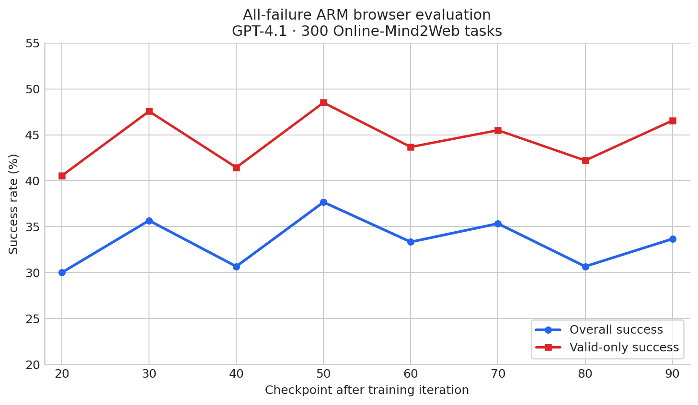

# ARM results: inference, offline training, and online RL

[Concise collaborator summary](ARM_SUMMARY.md)

Detailed inference, offline-training and online-RL results belong here. The records preserve cohorts, uncertainty, scaling studies, audits and provenance; the linked summary contains the core methods and results.

Latest full-300 endpoints: joint SFT **102/300 (34.0% overall; 37.8% valid-only)** and joint DPO **104/300 (34.7%; 40.9%)**. Their paired difference is not significant (p=0.8991).

Initial RL implementation result (2026-09-13): the
[executed-turn ARM bonus pilot](ARM_INTEGRATION_PLAN.md#arm-turn-bonus-pilot-completed)
passed calibration and completed ten optimizer updates from the after-70
baseline actor, with a validated saved checkpoint and no stability warning.
It used 4 H200 GPUs for 48m38s. This is a one-batch pilot; its updated actor has
not yet been evaluated on OM2W. The [proposed step-zero comparison](ARM_INTEGRATION_PLAN.md#arm-turn-bonus-from-zero-comparison)
records the next learning experiment.

Current RL endpoints are in the [collaborator summary](ARM_SUMMARY.md#3-online-rl-with-arm-turn-level-bonuses).
Original bonus iteration 80 (September 20) completed at **33.33% overall /
45.05% valid-only**, versus historical outcome-only **38.00% / 49.78%**.
All 300 task rollouts and verdicts are preserved. Additive iteration 80 completed
at **37.00% / 52.36%**; its previously omitted iteration-20 full-300 result is
**28.33% / 36.02%**. All-failure iteration 80 completed at **30.67% / 42.20%**.
Its [iteration-90 evaluation](RL_EVALUATION.md#arm-iter90-results-20260921) is
**33.67% / 46.54%**, matching the historical baseline's **33.67%** overall
(baseline valid-only **45.50%**). All 300 rollout archives and verdicts are saved;
different evaluation dates and valid sets prevent a controlled improvement claim.
Additive [iteration 90](RL_EVALUATION.md#arm-iter90-results-20260921), job **313408**,
completed at **39.33% / 54.63%** (118 successes, 216 valid), with all 300 rollouts
and verdicts saved. This is +5.67 percentage points overall versus historical
baseline-90; the same different-date comparison limitation applies.
Additive [iteration 100](RL_EVALUATION.md#arm-additive-iter100-results-20260921),
job **313669**, then completed at **36.33% / 50.23%** (109 successes, 217 valid),
with all 300 rollouts and verdicts saved. This is below additive90 by 3.00 / 4.40
percentage points. [Baseline100](RL_EVALUATION.md#baseline-iter100-results-20260924) completed on September24
at **34.67% / 45.81%** (104 successes, 227 valid), leaving additive100
**+1.67 / +4.42 pp** descriptively. Evaluation dates and valid-task sets differ. [Current jobs and missing evaluations](RL_RUNTIME.md#arm-job-inventory-20260921).

All-failure [iteration100](RL_EVALUATION.md#arm-allfailure-iter100-results-20260921)
**316392** completed at **35.67% / 48.20%** (107 successes / 222 valid), with all
300 rollouts and verdicts saved. Relative to the completed baseline100, this
is **+1.00 / +2.38 pp** overall / valid-only, descriptively.

Latest Sol inference result (2026-09-13): **132/300 (44.0% overall; 51.56%
valid-only)**, versus historical SelectionARM **128/300 (42.67%; 50.0%)**.
The common-valid paired difference is not significant (p=0.4426); these were
collected on different dates. [Results, uncertainty and API audit](ARM_INFERENCE.md#sol-selection300-completed-294221).

<a id="arm-task-success-314664"></a>
## Execution-based SelectionARM audit — September 21, 2026

Job **314664** completed in **56m24s** on two H200s. Both new evaluations use
exactly the original fixed100 task IDs; the starting-SFT pair and actor-only
controls reuse historical verdicts. Rate pairs are overall / valid-only.

| Actor | Historical actor-only | Actor + SelectionARM | Δ overall / valid-only (pp) | ARM successes / valid / invalid | Judge |
| --- | ---: | ---: | ---: | ---: | --- |
| Starting SFT | 26.00% / 30.59% (26/85) | 36.00% / 43.37% (36/83) (historical) | +10.00 / +12.79 | 36 / 83 / 17 | o4-mini / AgentTrek |
| Outcome-only iteration 20 | 25.00% / 35.21% (25/71) | 38.00% / 47.50% (38/80) | +13.00 / +12.29 | 38 / 80 / 20 | GPT-4.1 / action history |
| Outcome-only iteration 90 | 35.00% / 51.47% (35/68) | 43.00% / 53.09% (43/81) | +8.00 / +1.62 | 43 / 81 / 19 | GPT-4.1 / action history |

Parentheses show successes / valid tasks. Overall always uses all 100 tasks;
valid-only excludes invalid attempts and includes both valid successes and
valid failures. The valid task sets can differ between the two runs.

All **200 primary and six startup** trajectories have saved archives and JSON
verdicts; startup tasks are excluded from headline rates. The selector made
1,187 / 916 calls at iterations 20 / 90, with **zero fallbacks**. Actor generation
used 2,217,786 / 2,163,267 output tokens and 5,935 / 4,580 requests. Terminal
judging used 162 requests, costing **$1.69785**. The primary latency fields sum
concurrent per-task durations; use the 56m24s allocation runtime for wall time.

The overall gains over historical RL controls are +13 / +8 percentage points,
but valid-only differences are +12.29 / +1.62 points. Different website dates,
valid subsets and decoding (actor-only T=0; ARM K=5 at T=0.8) prevent a controlled
selector-effect or significance claim. Cross-actor gain changes do not establish
drift, especially because the SFT judge differs. No new actor-only rollouts ran.

[Protocol](ARM_INTEGRATION_PLAN.md#arm-task-success-audit-20260921) ·
[Machine-readable audit](arm_results/rl_integration/task-success-314664.json) ·
[Saved trajectories and summaries](/gpfs/scrubbed/zixianma/openwebrl-runtime/evaluations/arm-task-success-314664).

Separately, trained variant C at iteration 20 scored **36.67% / 44.53%** on
full300, with **38.00% / 48.10%** on the fixed100 slice. This is actor-only
evaluation of the learned policy, distinct from the inference selector audit.
B also completed: **33.67% / 44.30%** full300, **29.00% / 42.03%** fixed100.
[B/C evaluation details](RL_EVALUATION.md#arm-gate-c-iter20-results-20260921).

<a id="arm-selection-quality-313774"></a>
## Fixed-state SelectionARM quality — September 21, 2026 UTC

**Job 313774 completed in 16m25s**, exit 0, using two H200s. All 192 candidate
sets / 960 responses and 231 valid teacher-label records are saved. Teacher cost
was **$3.790332**; no optimizer updates or new browser trajectories occurred.
The native GPU loads of outcome-only iterations 20 and 90 were verified.
Starting SFT used its HF checkpoint. All three actors received identical prompts
and screenshots for 64 states from baseline-90 screening trajectories, one state
per training task. All 192 ARM selections are available and schema-valid.

The table measures **GPT-4.1-assessed next-response acceptability, not task
success or verified progress**. Random is the exact mean of five binary labels
per state, not a separately executed rollout. The scorer excludes one state per
actor because the teacher accepted a malformed candidate; 63 states remain for
each row, and 62 are shared by the SFT-versus-late paired comparison.

| Candidate-generating actor | At least one acceptable candidate | ARM choice acceptable | First candidate acceptable | Uniform random candidate, expected | ARM minus random |
| --- | ---: | ---: | ---: | ---: | ---: |
| Starting SFT | 96.8% | 90.5% | 92.1% | 88.9% | +1.6 pp |
| Outcome-only iteration 20 | 100.0% | 93.7% | 96.8% | 90.5% | +3.2 pp |
| Outcome-only iteration 90 | 100.0% | 87.3% | 90.5% | 90.5% | −3.2 pp |

ARM missed all acceptable options in 4/63 SFT sets, 4/63 early-RL sets, and
8/63 late-RL sets. This suggests reviewing selector choices on late-actor
candidates; it does **not** establish degradation. The prespecified paired
late-minus-SFT change in ARM lift is **−3.55 pp**, bootstrap 95% interval
**[−11.29, +3.87] pp**, spanning zero. Three of 39 repeated sets changed at least
one teacher label under candidate reordering (7.7%); agreement is not correctness.

**Interpretation limits and manual checks.** In 43/63 SFT, 43/63 early and 44/63
late scored sets, all five candidates were acceptable under this broad label.
Some acceptable `done` responses merely report blocked website access; this is
not evidence that a task-solving candidate was available. Sampled late misses
include choosing Amazon for an explicitly Etsy-only task, choosing English
Wikipedia for a Faroese-Wikipedia request, and navigating to an unrelated site
when other responses stayed within the task constraints. These are teacher
assessments of saved states, not executed counterfactual outcomes. The panel is
not restricted to the eight failed-rescue tasks and all states come from the
late actor, so it cannot explain every rescue failure or isolate visitation drift.

An exploratory split finds late ARM-minus-random at −1.1 pp for five distinct
actions (36 sets), versus −6.2 pp for two-to-four distinct actions (26 sets).
These small strata do not justify changing B/C gates during training. There
were six malformed candidates among 960; none was selected by ARM.

[Detailed CPU audit](arm_results/rl_integration/selection-quality-313774-audit.json)
includes exclusions, diversity strata, selection misses and the original summary.
[Native summary](/gpfs/scrubbed/zixianma/openwebrl-runtime/evaluations/arm-quality-audit-313774/quality-summary.json) ·
[Protocol and updated priorities](ARM_INTEGRATION_PLAN.md#arm-selection-quality-audit-20260921).

<a id="arm-rescue-yield-313264"></a>
## Training-task rescue pilot — September 21, 2026 UTC

Job **313264** completed in **50m24s** using the outcome-only iteration-90
actor (1,016 Adam updates), frozen SelectionARM and native GPT-4.1/action-history
judging. Screening five actor attempts on each of 64 training tasks found 18
tasks with five valid failures. A fixed hash order selected eight; each received
one ARM-guided retry and five independent ordinary retries, in randomized order.

| Retry method | Tasks rescued | Overall rescue rate | Single-trajectory valid-only | Actor output tokens |
| --- | ---: | ---: | ---: | ---: |
| ARM selection, five candidates per turn | 0 / 8 | 0.0% | 0 / 7 = 0.0% | 200,148 |
| One ordinary actor retry | 1 / 8 | 12.5% | 1 / 7 = 14.29% | 19,137 |
| Five ordinary actor retries, any success | 3 / 8 | 37.5% | — | 119,630 |

The five-retry row is task pass@5, not a single-trajectory valid-only rate:
37/40 individual retries were valid, with four successful attempts on three
distinct tasks. The wrapper counted 84 selection-mode attempts; the subsequent
[state audit](ARM_INTEGRATION_PLAN.md#arm-selection-quality-audit-20260921)
verified 83 completed saved decisions and zero selector fallbacks. The attempt
counter increments before generation/selection finishes.
Its generated actor tokens were **1.67×** the five-retry control; selector
compute is additional. All **374** trajectories and judge sidecars are saved
(6 smoke, 320 screen, 48 retry). No optimizer update occurred.

This small training-task panel supplies no evidence for an ARM rescue gain and
does not justify scaling this recipe yet. It is not a powered held-out comparison;
five retries are an approximate generation-budget control, not equal compute.
Per-task outcomes and denominator checks are in the
[audit](arm_results/rl_integration/rescue-yield-313264.json).
[W&B](https://wandb.ai/zixianma/openwebrl-evals/runs/arm-rescue-yield-313264) ·
[Saved trajectories](/gpfs/scrubbed/zixianma/openwebrl-runtime/evaluations/arm-rescue-yield-313264/trajectories) ·
[Prespecified protocol](ARM_INTEGRATION_PLAN.md#arm-rescue-yield-pilot-20260920).

<a id="arm-three-stage-summary"></a>
## Three-stage ARM summary

| Stage | Experiment | Headline result |
| --- | --- | --- |
| 1. Inference reproduction | ARM selects among five actor candidates at inference | Baseline **30.0%** → ScalarRM **38.0%** → SelectionARM **42.7%** on 300 tasks |
| 2. Filtered SFT / preference learning | Train the actor on ARM-selected data, then joint SFT/DPO | Filtered 1A **100/300 (33.3%)**; best joint endpoint: DPO **104/300 (34.7%)**; transfer is modest |
| 3. RL integration | Add ARM turn bonuses during outcome RL: original, all-failure, and additive variants | Additive90 **39.33%** vs historical outcome-only90 **33.67%**; additive100 **36.33%** vs outcome-only100 **34.67%**. No consistent gain established |

The detailed experiment records remain below; this table is the project-level
status summary.

<a id="arm-current-three-rl-variants"></a>
## Current ARM RL variants

These are the three executed-turn ARM variants being continued from the same
training family. All use the ordinary outcome reward plus a bounded ARM turn
bonus, GPT-4.1/action-history labels, 48-group collection, PPO2, and the same
starting SFT actor; each variant has its own checkpoint lineage.

| Variant | ARM data admitted per collection | Purpose | Comparable `iter_0000019` result |
| --- | --- | --- | --- |
| Original ARM bonus | Mixed outcome groups only; ARM labels on sampled turns | Conservative baseline for local action credit | 26/100 = 26.0%; 35.62% valid-only |
| All-failure ARM | Admit eligible valid all-failure groups alongside mixed groups within the same 48-group quota | Test whether ARM can learn from zero-success trajectories | 90/300 = 30.0%; 40.54% valid-only |
| Additive ARM | Ordinary mixed groups plus up to 8 auxiliary all-failure groups | Preserve outcome learning while adding a bounded failure buffer | 24/100 = 24.0%; 31.17% valid-only |
| Original ARM, iteration 30 | Mixed outcome groups | Fixed 100 | 27/100 = 27.0%; 36.49% valid-only |

The 100-task comparisons do not show a reliable improvement over the matched
baseline (25/100, 35.21% valid-only). The all-failure 300-task result is a
disjoint merge of its 100-task cohort and 200-task complement. This table is
the early iteration-20/30 record; current later checkpoints and full-300 curves
are in [ARM_SUMMARY.md](ARM_SUMMARY.md). Detailed counts, W&B links, and continuation records are in
[RL_RESULTS.md](RL_RESULTS.md) and [RL_EVALUATION.md](RL_EVALUATION.md#arm-iteration-19-evaluations-20260915).

## Contents

- [Online RL: detailed analysis and provenance](#arm-online-rl-analysis-20260922)
- [ARM results dashboard](#arm-results-dashboard)
- [GPT-5.6 Sol test-time scaling](#arm-results-dashboard--sol-test-time-scaling)
- [Serial alternatives SFT: all five versus diverse up to three](#arm-serial-sft-comparison)
- [C2, 1A, and joint-data SFT/DPO: full-300 evaluation](#arm-c2-vs-1a-full300-eval)
- [C2 ablation 1A results](#arm-c2-ablation-1a-results)
- [C2 filtered-SFT checkpoint scaling results](#arm-c2-scaling-results)
- [Joint C2 + Piotr SFT versus DPO](#arm-joint-sft-vs-dpo-results)
- [Joint-data SFT: endpoint OM2W evaluation](#arm-joint-sft-results)
- [Joint-data DPO: endpoint OM2W evaluation](#arm-joint-dpo-results)
- [Joint SFT and DPO training monitoring](#arm-joint-training-monitor)

---

<a id="arm-online-rl-analysis-20260922"></a>
## Online RL: detailed analysis and provenance — September 22, 2026

Moved from section 3 of `ARM_SUMMARY.md` to keep the collaborator page focused
on methods and results. The coverage audits, examples, separate plots and
interpretation are preserved below. Superseded launch statements are corrected;
use [RL_RUNTIME.md](RL_RUNTIME.md#training-relaunch-20260922) and the
[live monitor](arm_results/rl_integration/live-status.html) for current job status.

### Reward definition and shared configuration

Keep the ordinary terminal outcome reward and add a bounded ARM
bonus on eligible actor turns:

For trajectory $i$, the judge produces a terminal outcome $R_i\in\{0,1\}$
(with `-1` reserved for a format failure), and that outcome is propagated to
every turn before group normalization. For turn $t$:

$$
A'_{i,t}=A_i+\beta\,q_{i,t}\left(\mathbf{1}[j_{i,t}=0]-0.2\right),
\qquad q_{i,t}\in\{0,1\},
$$

where $A_i$ is the normalized outcome advantage, $q_{i,t}$ indicates that the
turn received a usable ARM label, and $j_{i,t}=0$ means SelectionARM chose the
executed actor candidate. Thus `beta=0.5` is the ARM scale and `q=0.20` is the
target fraction of turns sent for labeling; $q$ is a sampling gate, not a
multiplicative 0.20 applied to every reward. The bonus is applied only to
retained, valid ARM-labelled turns. All variants
use the local browser, GPT-4.1 action-history judge, 48-group collection, and
PPO2; they differ in which rollout groups contribute labels.

So a successful rollout does receive raw outcome reward `1` on every turn
because the terminal judge result is propagated across its turn history. The
training value is then the group-normalized $A_i$, with the ARM term added only
on labeled turns; it is therefore not literally `1` after normalization.

- **Shared hyperparameters:** `K=5` candidates, SelectionARM with full
  reasoning-plus-action input, turn sampling fraction `q=0.20`, ARM scale
  `beta=0.5`, 48 accepted groups, global batch 256, two PPO epochs, constant
  learning rate `1e-6`, weight decay 0.1, 32 browsers in the original4-GPU profile (64 in8-GPU continuations), 15-turn horizon,
  1,024-token responses, and 32,768-token context.
- **Why these values:** `K=5` matches the validated inference setup;
  `beta=0.5` and `q=0.20` passed calibration with an ARM/outcome RMS ratio near
  6%, keeping the auxiliary signal bounded; batch 256, PPO2, and `1e-6`
  preserve the tested OpenWebRL optimization scale while limiting off-policy
  reuse.

### Label coverage, gate ablations and supporting audits

`q=0.20` is the probability of attempting an ARM label, not a guarantee that
20% of training turns receive a bonus. The realized applied-label fraction is
usually 8--10%. A [43-collection audit](ARM_INTEGRATION_PLAN.md#arm-label-coverage-confidence-audit-20260919)
found duplicate-action rejection was the largest cause: 40--50% of sampled
turns, versus 3--7% truncation/empty outputs and 1--2% candidate parsing errors.
The current gate requires all five candidate actions to differ. A completed
90-task confidence replay found that high confidence can reflect a position
tie-break on identical responses; confidence alone is insufficient to replace
the gate. A [one-call, at-least-two-action gate test](ARM_INTEGRATION_PLAN.md#arm-min2-gate-test-20260919)
increased archived gate passes from 47.3% to 88.5% of sampled turns (1.87×).
The gate and optional duplicate-aware action credit are independently configurable.
The three original runs retain their original gate; B/C test the changes below.

[Iteration-zero gate ablations](ARM_INTEGRATION_PLAN.md#arm-bc-firstupdates-20260920):
[B](https://wandb.ai/zixianma/openwebrl/runs/arm-gate-b-309053) relaxes the gate to
at least two actions; [C](https://wandb.ai/zixianma/openwebrl/runs/arm-gate-c-309054)
also uses action-equivalence credit. Their W&B display names now identify both
the variant and credit rule.
As of September 21, 17:00 UTC, B **313208** and C **313210** both completed
**iteration 20 / 284 Adam updates**. C's full-300 evaluation **313211** finished
at **36.67% overall / 44.53% valid-only**; B's **313209** finished at
**33.67% / 44.30%**. All 300 rollouts and verdicts are saved for each. Calibration passes; recent B/C
collections label 16–20% of retained ordinary turns, with bonus/outcome RMS
about 9–11%, beta=0.5 unchanged.
[C evaluation audit](RL_EVALUATION.md#arm-gate-c-iter20-results-20260921).
[Initial audit](arm_results/rl_integration/bc-firstupdates-20260920.json);
[continuation status](RL_RUNTIME.md#arm-training-status-20260920-2224).

Both full-300 evaluations were released after their iteration-20 checkpoints
passed validation. The initial8-GPU continuations316247/316248 later failed at
startup because of storage quota. Their replacements are **B318934 / C318935**,
continuing to60 with64 browsers and full300 evaluations at40/60 inside the same
allocation. B started September22; current scheduling and remaining approved
budgets are in the [runtime record](RL_RUNTIME.md#training-relaunch-20260922).
The separate [rescue-yield pilot](ARM_INTEGRATION_PLAN.md#arm-rescue-yield-pilot-20260920)
**313264** completed: among eight screened all-failure tasks, ARM rescued
**0/8**, one ordinary retry **1/8**, and five ordinary retries **3/8**.
All 374 trajectories are saved. This small training-task pilot shows no rescue
benefit; [protocol and results](ARM_RESULTS.md#arm-rescue-yield-313264).
The [fixed-state selection audit](ARM_RESULTS.md#arm-selection-quality-313774)
also finished: ARM minus random next-response acceptability was **+1.6 / +3.2 /
−3.2 pp** for SFT / outcome-only iteration 20 / iteration 90. This small,
teacher-labeled panel does not establish drift or task-success gains. The
[terminal-success audit](ARM_RESULTS.md#arm-task-success-314664) **314664**
completed actor+ARM on the **same fixed100 tasks** at outcome-only iterations
20 and 90. All 200 primary rollouts and verdicts are saved; zero selector
fallbacks. The SFT cells reuse saved results on those exact IDs.
Rates below are overall / valid-only; Δ is ARM minus actor-only in percentage
points, calculated from unrounded rates.

| Actor checkpoint | Actor alone · fixed100 | Actor + SelectionARM · fixed100 | Δ overall / valid-only (pp) |
| --- | ---: | ---: | ---: |
| Starting SFT | 26.00% / 30.59% (26/85) | 36.00% / 43.37% (36/83) | +10.00 / +12.79 |
| Outcome-only iteration 20 | 25.00% / 35.21% (25/71) | 38.00% / 47.50% (38/80) | +13.00 / +12.29 |
| Outcome-only iteration 90 | 35.00% / 51.47% (35/68) | 43.00% / 53.09% (43/81) | +8.00 / +1.62 |

Parentheses show successes / valid tasks. Overall always uses all 100 tasks;
valid-only excludes invalid attempts and includes both valid successes and
valid failures. The valid task sets can differ between the two runs.

SFT uses o4-mini; RL uses GPT-4.1. The actor-only controls are historical;
dates, availability and decoding differ, so these are descriptive inference
comparisons. Additive **313669** completed **100 iterations / 1,262 Adam updates**
and its full-300 evaluation: **36.33% overall / 50.23% valid-only**; all 300
rollouts and verdicts are saved. Baseline replacement315098 subsequently failed at storage-quota startup;
replacement **318933** retains the iteration100 target and full300 evaluation.
See the [runtime record](RL_RUNTIME.md#training-relaunch-20260922). MIG pilot
**315402 passed**: actor and SelectionARM ran on separate 18-GB slices, including
near-32k context, short/long-history selection, and two browser trajectories with
saved GPT-4.1 verdicts. Total allocated runtime across retries was **18m05s**;
the slices are released. This SFT-actor feasibility test does not yet validate
the additive checkpoint or native coverage collector on MIG.
[Results and probe fixes](RL_RUNTIME.md#mig-corrected-probe-315402).
[Agreed next experiments](ARM_INTEGRATION_PLAN.md#arm-additive-next-experiments-20260921):
first audit up to four labeled turns per failed trajectory without updating the
actor; separately test failure-only beta 0.5→1.0 while mixed-group beta stays 0.5.
Coverage pilot **315204** completed in **33m29s**, with 48 ordinary mixed groups
and zero optimizer updates. All 22 zero-outcome candidate groups failed the
five-valid-failures gate; no deferred labels were requested. This leaves the
benefit of four-turn coverage **unmeasured**, not disproved. The
[saved termination audit](ARM_INTEGRATION_PLAN.md#arm-failure-termination-audit-20260921)
found38 response-length truncations and18 browser-step aborts among110
trajectories in the22 all-zero groups. Four turns would roughly double sampled
states on their54 individually valid failures, but none of those groups passes
the five-valid-failures rule. The fixed-four-turn proposal was replaced by separate **failure beta1.0**
and **failure sampling40%** experiments. The initially planned after100 branches
were superseded: the user requires every new intervention to start from
**iteration0, original SFT weights, fresh optimizer/scheduler and task cursor**.
Corrected jobs **318949 /318950** target20 and then full300 evaluation.
Mixed beta0.5/q20% and the existing failure-group admission rule remain fixed.
[Corrected recipes and launch checks](RL_RUNTIME.md#failure-ablations-fromzero-20260922).

<a id="arm-failure-sampling-history"></a>
### Failure-turn sampling and task-pool analysis

**Failure supervision shrinks during training.** In Additive, averages from
iterations 1–20 → 81–100 fall from **403 → 79 admitted failure turns**,
**78 → 17 sampled turns**, and **27 → 9 usable labels**. Actual sampling stays
near 20%; admitted groups fall **8 → 1.9**, also lowering their `N_f/48` loss
coefficient. Adaptive query reweighting is **disabled**; native dynamic filtering
still collects until 48 mixed groups. [Definitions and windowed measurements](ARM_INTEGRATION_PLAN.md#arm-failure-sampling-history-20260922);
[comparison across all five variants](rl_results/arm_variants_failure_sampling.png).


[Task-pool expansion audit](ARM_INTEGRATION_PLAN.md#arm-task-pool-expansion-20260922):
our2,102 tasks include143 with WebGym difficulty7+. CPU filtering surfaced
**511 additional hard-labeled candidates** on existing training hosts and a
75-task review cohort. Semantic deduplication, task quality and current-actor
hardness remain unvalidated; the active training pool is unchanged.

[Live jobs and completion reports](arm_results/rl_integration/live-status.html)
refresh every minute; checkpoint/health details are checked every 15 minutes.

### Candidate provenance

Here `K=5` means **one executed actor response plus four counterfactual actor
responses** sampled from the same state with different deterministic seeds.
SelectionARM receives the five reasoning-plus-action candidates, chooses one,
and the permutation is inverted to identify whether it selected the executed
response or an alternative. SelectionARM itself does not generate these
candidates.

The complete fixed100/full300 checkpoint table remains in the
[concise summary](ARM_SUMMARY.md#3-online-rl-with-arm-turn-level-bonuses).

### All-failure ARM full-300 curve

All three [iteration-80 evaluations](RL_EVALUATION.md#arm-iter80-launch-20260919)
are complete, each with 300 per-task rollout archives and verdict records.
Additive is the strongest ARM endpoint by both rates, but none exceeds the
historical baseline's overall success. These are different-date evaluations
with different valid-task sets.

All-failure [iteration 90](RL_EVALUATION.md#arm-iter90-results-20260921) completed
at **33.67% overall / 46.54% valid-only**, matching the historical baseline's
overall rate. Different evaluation dates and valid-task sets limit comparison.
All 300 rollouts/verdicts are saved. Training finished at **100 / 1,242 Adam
updates**. Additive's corrected iteration-90 full-300
evaluation **313408** completed at **39.33% overall / 54.63% valid-only**,
with all 300 rollouts/verdicts saved. This is 5.67 percentage points above the
historical iteration-90 baseline overall, but is not a controlled same-day or
paired significance claim. Additive subsequently completed **100 / 1,262**;
its [iteration-100 evaluation](RL_EVALUATION.md#arm-additive-iter100-results-20260921)
is **36.33% / 50.23%**, down 3.00 / 4.40 percentage points from iteration90.
[Baseline100](RL_EVALUATION.md#baseline-iter100-results-20260924) completed at **34.67% / 45.81%**,
so additive100 is +1.67 / +4.42 pp descriptively; these evaluations used different dates.
Original training reached **85 /1,002**; its latest retained checkpoint is80 after the September22 pruning incident. [Retention audit](RL_RUNTIME.md#storage-inventory-20260922). All-failure100 **316392** completed at
**35.67% overall / 48.20% valid-only**, with all 300 rollouts/verdicts saved.
[Result audit](RL_EVALUATION.md#arm-allfailure-iter100-results-20260921).



The curve uses the completed full-300 evaluations from iteration20 through100. Iteration 20 is the disjoint fixed-100 plus 200-task merge; later
points are full-300 evaluations under the same local-browser/GPT-4.1 protocol.

### Baseline comparison

[Combined outcome-only / all-failure / additive curve](rl_results/baseline_vs_arm_allfailure_full300.png)

This comparison overlays the historical outcome-only baseline curve with the
all-failure and additive ARM full-300 points through iteration90, retaining
the user-requested display limit. Iteration100 results are included in the tables.
Additive's
[iteration-20 full-300 result](RL_EVALUATION.md#arm-additive-iter20-full300-20260920)
completed as job 307429 and is now included; it had been omitted from the docs.
It is a fresh 300-task evaluation, independent of the older fixed-100 result.
Original ARM job 303459 evaluated iteration 51 (`iter_0000050`), previously
mislabeled as iteration 50 in the results.

The earlier significance calculation was an exploratory unpaired proportion
test over aggregate counts. It is hidden from this summary because the archived
evaluations did not preserve aligned task-level verdict IDs, so it cannot support
a rigorous paired claim. Future comparisons should use paired McNemar or
bootstrap/permutation tests on shared task IDs, with a predeclared primary
comparison and multiple-comparison correction.

**Per-task records.** The corrected evaluator now saves one addressable file per
task under each evaluation's `rollouts/` directory. Each file contains the task
ID and all turns, including final reward, status, and termination reason; a
completed task with reward `1` or `0` supplies the success verdict, while an
aborted or unavailable task supplies the invalid outcome. This is sufficient to
construct aligned paired tests for new evaluations. Older runs only have their
aggregate metrics or lossless batch archives and may need re-evaluation before a
paired test.

- **Outcome-only baseline:** terminal outcome reward only; no ARM-labelled turns.
- **All-failure bonus:** admit eligible five-failure groups alongside ordinary mixed groups within the same 48-group budget; accepted failure groups displace mixed-group slots.
- **Original bonus:** apply the ARM term only to eligible turns inside ordinary mixed outcome groups.
- **Additive bonus:** retain the ordinary mixed batch and add an independently normalized buffer of up to eight eligible all-failure groups.

### Failure-group admission and worked example

**What “usable ARM label” means.** An all-failure group has five trajectories for
the same task, all with valid zero terminal outcome. It is admitted when at least
one turn in those five trajectories completes candidate generation and selection
with valid provenance and a parseable selector result. This is label availability,
not proof that the selector chose the objectively correct action. Candidate 0 is
the actor's executed action, so that labeled turn receives `+0.8` when ARM picks
candidate 0 and `-0.2` when ARM prefers one of the four alternatives; unlabeled
turns receive no ARM term.

**Illustration of the three online runs.** For one task, imagine five actor
trajectories all ending in a valid failure (`0`):

```text
five failure trajectories:  A(0)  B(0)  C(0)  D(0)  E(0)
usable labels:             A:t3, D:t7
ARM choices:               A:t3 -> candidate 4 (-0.2)
                           D:t7 -> candidate 0 (+0.8)

Original bonus:  ordinary mixed group ──┐
                                        ├─ ARM on eligible turns only
All-failure:   mixed + five-failure groups ──┘ (48 groups total)
Additive:      ordinary mixed groups + up to eight such failure groups
               └─ separate normalized loss terms for the two sources
```

Thus the all-failure run uses the same terminal outcome reward as usual, but
admits otherwise discarded zero-outcome groups when they contain at least one
usable turn-level ARM signal. The additive run keeps those groups alongside the
ordinary mixed collection instead of replacing it.

The full-300 baseline is the matched outcome-only OpenWebRL checkpoint under
the same local-browser/GPT-4.1 RL evaluation protocol. The all-failure **iteration20** full-300
result is a disjoint merge of its fixed-100 cohort and200-task complement.

The iteration-20 baseline rows show both controls: the historical run is the
default comparison, while job `299148` is the fresh same-day control (87/300
successes, 236 valid, 64 invalid). The same-day rerun is retained to expose
live-web variance; the historical value remains the canonical comparison used
by the earlier evaluation tables.
Unless explicitly marked “same-day control,” the rows above use the historical
evaluation runs.

The original-bonus iteration-40 fixed-100 result is from job `299156` and has
31 successes, 69 valid tasks, and 31 invalid tasks; all 100 task-addressable
rollouts were saved.

The separate inference-time baseline is 90/300 with 267 valid tasks, or 30.0%
overall and 33.7% valid-only, under the historical o4-mini protocol; it should
not be used for the RL comparison.

**Interpretation:** Additive90 is the strongest measured ARM endpoint, but
checkpoint variation and different evaluation dates prevent a consistent or
controlled improvement claim. At100, additive is +1.67 pp overall versus the
completed baseline; on the fixed100 slice it is 31% versus baseline37%. All-failure20's disjoint cohort
merge should not be generalized to its later full300 evaluations.

<a id="arm-serial-sft-comparison"></a>
## Serial alternatives SFT: all five versus diverse up to three

**2026-09-11 23:09 PDT: training completed; initial evaluations failed at the
response protocol. These are not a clean comparison of the recipes.** Both
models reached update 170 with durable checkpoints. All-five recorded 0/100
overall and 0/90 valid-only; diverse-three recorded 0/100 and 0/92. Respectively,
88 and 85 tasks stopped for missing alternatives, two and seven hit generation
length limits, and ten/eight were unavailable. No saved response contained an
`<alternative>` tag. All policy failures occurred on turn one.

Audit found a train/evaluation mismatch introduced by the serial integration:
training appended the new protocol **after** the template's tool instructions;
evaluation inserted it **before** them. Corrected evaluation now calls the same
`augment_prompt` function after chat-template rendering. CPU comparison of all
182 available prompts changes exact system-message matches against the training
systems from **0/182 to 182/182**. Five regression tests pass. This does not
establish that prompt correction alone restores generation; the missing
free-generation startup gate should have caught the protocol failure before
100-task execution.

Next: verify actual free generation and adapter/merged-model parity with the
matched prompt, then perform fresh evaluations only after the protocol gate
passes. Preserve these original results separately. Both allocations have
ended and released their GPUs (all-five 1:18:40; diverse-three 1:14:20; combined
5.10 GPU-hours). New GPU work requires explicit allocation approval; the unused
time is no longer a live allocation. Frozen original configs retain their
original hashes; corrected attempts require separate configs/output roots.
[Failure audit](arm_results/serial_sft/failed-evaluation-audit.json).

### Corrected evaluation validation: first GPU check failed generation

The prompt-order fix is now protected by mandatory promotion gates in both
`openwebrl.arm_eval` and the checkpoint evaluation worker. Serial evaluation
cannot start without a passed proof tied to the model/checkpoint, adapter and
merge provenance, processor metadata, runtime hashes, judge/sampling settings,
task-file hash, and unchanged evidence artifacts. The old result directories
cannot be reused as corrected evaluations. New runs use separate output roots.

Prepared [validation controller](../../scripts/check_arm_serial_eval.py) and
[batch template](../../scripts/check_arm_serial_eval.sbatch) perform, per model:

1. On eight fixed held-out states (C2/Piotr; initial/later history), compare
   original base+adapter versus exported-model HF logits and first-64-token
   log probabilities using verified image-expanded training prefixes. Require
   equal first-token argmax, KL <=0.01, and target log-probability MAE <=0.1.
2. Serve the existing export with SGLang and freely generate on all eight
   prefixes at temperatures 0 and 0.7. All 16 must stop normally, have the exact
   expected prompt-token count, pass the serial parser and every action schema,
   and match the selected/final action. Greedy first tokens must agree with HF.
   No alternatives are prefilled or supplied as current-turn input.
3. Only after both checks pass, run five fixed outcome-independent OM2W tasks
   with the actual actor/browser/judge path. Require at least three available
   outcomes, no serial protocol or generation-length failures, explicit executed
   action and projected-history evidence, and at least two multi-turn trajectories.
   This tests mechanics; task success is reported but is not the promotion threshold.
4. Only a passed browser-pilot proof can authorize a larger serial cohort.
   **This validation job never launches the full 100/300 tasks automatically.**

The serial evaluator also records zero-generated-turn failures with valid
turn-level metadata so the underlying error survives judging instead of being
replaced by the generic missing-turn-index exception. Policy format failures
continue to count as failures; they are not reclassified as unavailable.

**CPU verification: 21 tests passed**, including existing ARM contracts,
prompt-order and execution parsing, missing/failed/stale/wrong-model gates,
pilot cohort limits, incomplete generation evidence, and execution/history
requirements. Both frozen recovery configs, panels and runtime hashes reconcile.
The first GPU check is recorded below; broader evaluation remains blocked.

Proposed new validation-only request: **two H200s × one hour**, 16 CPUs /
240 GiB RAM (2 GPU-hours; approximately $1.80 at prior scheduler estimates).
One GPU checks each variant in parallel. Original jobs have ended; the currently
active RL/screensim allocations are unrelated and are not used. New `sbatch`
requires explicit user approval under root `AGENTS.md`.

- [All-five recovery config](arm_results/serial_sft/recovery-v2/all5-config.json)
- [Diverse recovery config](arm_results/serial_sft/recovery-v2/diverse3-config.json)
- [Frozen five-task cohort](arm_results/serial_sft/recovery-v2/pilot.json)
- Planned outputs: `/gpfs/scrubbed/zixianma/openwebrl-runtime/arm-reproduction/serial-validation-v2/{all5,diverse3}/`
- Submit only after approval: `sbatch scripts/check_arm_serial_eval.sbatch`.

**Requested smaller first check:** prepare **one H200 × 30 minutes**, 8 CPUs /
120 GiB RAM (0.5 GPU-hours), for the all-five checkpoint first. This variant has
the longest required output and exercises the original format failure directly.
Use the same parity and 16 free-generation checks, then the same five browser
tasks only if generation passes and allocation time permits. A timeout or an
incomplete pilot cannot authorize broader evaluation. The diverse variant still
requires its own successful gates. This replaces the proposed parallel check as
the immediate next step. **Approved and submitted as job `289684` on `g013`**,
one H200 for 30 minutes, 8 CPUs / 120 GiB; Slurm estimated $0.45 for the request.
The job ended after **88 seconds** (0.0244 GPU-hours), releasing the GPU on the
failed free-generation gate. Slurm correctly reports `FAILED` / exit 1.
Launch script: `scripts/check_arm_serial_eval_1gpu.sbatch`.
Log: `/gpfs/scrubbed/zixianma/openwebrl-runtime/logs/arm-serial-quick-check-289684.out`.

**Quick-check outcome (2026-09-11 PDT):**

| Check | all5 update 170 |
| --- | --- |
| HF base+adapter versus exported model | Passed on 8/8 states; maximum first-token KL 0.00554, label-log-probability MAE 0.07288 |
| Exact saved training prompts, matching expanded prompt token counts | 16/16 |
| Normal generation stop | 16/16; no token-limit failures |
| Valid serial completion, greedy + temperature 0.7 | **0/16** |
| Responses containing any `<alternative` tag | **2/16** (both after an early `</think>`) |
| Browser pilot / broader evaluation | **Not launched** |

Fourteen responses failed the alternative-count check; two failed the thinking
boundary check. **Correction on 2026-09-12:** the earlier prose incorrectly said
zero responses contained alternatives; direct inspection and the independent
response audit show two did. All responses began with ordinary base-style reasoning. The HF
adapter and merged-model checks also chose `The` or `I` as the first greedy token
on all eight states, instead of the target's opening `<` token. This is evidence
that the failure persists with the exact saved training prompts and in HF;
correcting prompt order alone does not recover the trained protocol.

The generation-gate artifact also records `sglang_first_token_parity=false`, but
this is **unmeasured**, not evidence of a backend mismatch: first-token capture
in this checker follows serial parsing, which failed on every response. Keep
this diagnostic limitation distinct from the independently measured HF
adapter/export parity pass and the observed free-generation failures.

The training objective remains a plausible contributor, not a proven cause:
the first output token receives only `0.5 / alternatives_token_count` weight
(0.00017–0.00046 in these eight examples). Teacher-forced final-action CE can
be very low because the selected action already appears in the supplied
alternatives. A low aggregate CE therefore did not demonstrate that the model
learned to begin or generate the complete protocol. Before another full eval,
audit boundary-token learning and adapter changes, then validate any repair
with free generation first. No new training or compute has been launched.

[Machine-readable quick-check evidence](arm_results/serial_sft/recovery-v2/quick-check-289684.json).
Full generated responses remain in the runtime output directory's
`free-generation.json`; adapter parity is in `parity.json`.

**Detailed error audit (2026-09-12, CPU only):**

- **14/16** have no alternatives and no selected index. These cannot be evaluated
  as serial selection, even when their final ordinary action parses.
- **1/16** (`Piotr:ep267__t0`, greedy) has ordinary reasoning followed by an
  early `</think>`, then five complete alternatives, selection 1, another
  `</think>`, and final calls. The selected and final action sequences match
  exactly. Its suffix starting at the first alternative passes strict parsing,
  but the full response violates the single-think contract. This suffix check
  is diagnostic only; no output was rewritten or executed.
- **1/16** (same state, temperature 0.7) opens five alternatives but closes only
  the first; alternatives 2–5 omit proposed actions and instead end with
  `</think>`. It selects 3, whose action is absent, so selected/final equality
  cannot be checked.
- Independently of the above categories, final tool-call schemas pass in
  **11/16**, fail in **5/16**. Malformed outputs include missing `name`, nested
  `arguments.action`, and malformed JSON. A valid schema does not establish
  that the action would advance the task.
- Selected/final comparison: **1 match, 0 measured mismatches, 15 not
  comparable**. No browser task ran, so this check establishes neither action
  quality nor terminal task success.

The bounded audit rechecked **12,162 target rows** across both variants and
train/validation splits: all pass strict serial parsing, final action schemas,
opening token/segment checks, and serial instruction placement. All **504/504**
all5 LoRA tensors changed from update 0 to 170, with no nonfinite tensors; the
initial zero B matrices became nonzero. Thus unchanged saved adapters and
malformed target construction do not explain the failures. This does not
prove the entire optimization path is correct. The next diagnostic should
measure opening/structural-token probabilities separately from aggregate CE
and test a clearly labelled forced-opening probe before another training run.
Such a probe would isolate a failure mechanism, not count as a passed free-
generation gate or authorize full evaluation.

Reproducible CPU audit: `scripts/audit_arm_serial_failures.py`.
[Response and training-target audit](arm_results/serial_sft/recovery-v2/response-error-audit.json),
[saved adapter delta audit](arm_results/serial_sft/recovery-v2/adapter-delta-audit.json).

**Undertraining hypothesis (2026-09-12 discussion):** the old response format
may persist because one pass over 5,437 states (170 updates, rank-16 LoRA,
peak LR 1e-5) was insufficient to change generation behavior. This remains
plausible; insufficient dataset diversity has not been established. On the
same 128 validation states throughout, all5 alternatives CE goes
0.46266 → 0.42534 → 0.34054 → 0.29521 → 0.27478 at updates
0/43/85/128/170, while final-call CE is already 0.00683 by update 43.
The alternatives loss was still improving at the endpoint. These are teacher-
forced metrics, not evidence of free-generation correctness.

The current loss also gives a final-action token a median **39.2×** the weight
of an alternative token in all5 (**22.24×** in diverse3), because each segment
is averaged separately. This is a loss-coefficient ratio, not a measured
gradient ratio. The first alternative's opening belongs to the long, lower-
weight segment. Before collecting more data, a bounded small-set overfit test
with free-generation checks would distinguish failure to learn the protocol
even on training states from failure to generalize. Compare more exposure
under the original objective with explicit structural-token weighting while
holding rank/data fixed; do not bundle rank, LR, and data changes into the
first diagnostic. No additional compute or training was requested or launched.

<!-- serial-sft-live:start -->
Monitor snapshot: 2026-09-12T06:14:18.887346+00:00 (10-minute cadence).

| Variant | Job / scheduler | Updates | Latest training loss | Evaluation outcomes |
| --- | --- | ---: | ---: | --- |
| all5 | 288893 / COMPLETED | 170/170 | 0.1632 | 0/100 overall (0.0%); 0/90 valid-only (0.0%) |
| diverse3 | 288894 / COMPLETED | 170/170 | 0.1470 | 0/100 overall (0.0%); 0/92 valid-only (0.0%) |

Local status/alerts: `/gpfs/scrubbed/zixianma/openwebrl-runtime/arm-reproduction/serial-monitor.json`.
<!-- serial-sft-live:end -->

Approved on 2026-09-11 PDT: two independent jobs, **each two H200s × four hours**,
16 CPUs / 240 GiB RAM, including training and the fixed 100-task OM2W evaluation.
Scheduler estimates $7.20 per job, $14.40 total. Both were submitted immediately
after data, parser and launch preparation; both started on g001 with disjoint
Slurm GPU assignments.

| Variant | Job | Training states | Target tokens, mean / median | Planned updates | Overall / valid-only |
| --- | ---: | ---: | ---: | ---: | --- |
| All five reasoning/action alternatives | 288893 | 5,437 | 1,851 / 1,759 | 170 completed | 0/100; 0/90 — failed protocol evaluation |
| Diverse up to three alternatives | 288894 | 5,437 | 1,091 / 1,042 | 170 completed | 0/100; 0/92 — failed protocol evaluation |

The diverse variant contains 915 two-alternative states and 4,522 three-alternative
states: exact action deduplication, original winner preserved, typed max-min
selection capped at three, followed by a fixed permutation. It reduces mean
target tokens by **41.0%**. Nearby clicks are ranked as lower novelty but are
not declared equivalent without DOM evidence; the frozen novelty stop threshold
is zero (exact duplicates). Action coordinates are normalized through the
browser adapter's 1000-unit resize convention. Subset labels inherit the full
teacher decision and have not been relabeled by a subset teacher.

Both models start from original OpenWebRL-4B-SFT with language-only LoRA
16/32/0.05, batch 32, LR 1e-5, 512-state warmup and half-cosine decay to 5e-6.
Segment loss is 0.50 alternatives / 0.10 selection / 0.40 final action, with
mean CE within each segment. The last batch uses 29 real states and zero-weight
padding, not duplicated training exposure. Checkpoints: 0, 43, 85, 128, 170;
optimizer/RNG/cursor are saved. A fixed 128-state held-out panel is scored at
intermediate checkpoints and all 644 held-out states at the endpoint. Diagnostics
include raw segment CE, aggregate token CE, teacher-forced selection accuracy,
gradient norm, LR, peak GPU memory and update time; W&B project `openwebrl-arm`,
group `serial-alternatives-v1`.

Each batch controller owns training, endpoint export, two 50-task evaluation
workers and aggregation. It reserves 75 minutes before its five-minute shutdown
margin for export/evaluation, and gives a failed training worker a bounded
10-minute repair window. Both evaluations use the same fixed 100 development
tasks, one actor sample with no inference ARM, temperature 0.7/top-p 0.9,
30 turns, o4-mini/AgentTrek, and a 6,144-token response ceiling dynamically
bounded by the 32K context. Only the selected rationale/action enters future
history; full generated alternatives remain in saved turn samples. Serial
protocol violations execute nothing and count as policy failures, not unavailable
website outcomes. No retries are silently substituted.

CPU preparation verified every retained final action, source draw hashes,
prompt/target encodings, candidate counts, no task-group split overlap, and
32K fit after new instructions. Four parser tests cover round trips,
non-execution of hypothetical tool tags, malformed/truncated/mismatched choices,
duplicates, single-option and multi-call cases. **Both GPU startup gates passed:**
longest-example backward produced finite nonzero gradients, and optimized versus
full-logits loss difference was exactly zero on the smoke example. Both reached
update 6/170 by 21:54 PDT; initial update times are about 23 seconds for all-five
and 21 seconds for diverse-three. A spot check across four distinct assigned
GPU UUIDs showed 94–100% utilization. This is an initial spot check, not an
allocation-wide utilization average.

W&B: [all five](https://wandb.ai/zixianma/openwebrl-arm/runs/2d4f808c) ·
[diverse up to three](https://wandb.ai/zixianma/openwebrl-arm/runs/3824c30f).
A local monitor records training, scheduler, evaluation counts and alerts every
10 minutes and refreshes the live table above. The batch controllers own the
training-to-evaluation handoff independently of that monitor.

- [Plan and limitations](ARM_INTEGRATION_PLAN.md#serial-alternatives-sft)
- [Data audit](arm_results/serial_sft_data.json) · [Exact target review](arm_results/serial_sft_review.html)
- [All-five configuration](arm_results/serial_sft/all5-config.json) · [Diverse configuration](arm_results/serial_sft/diverse3-config.json)
- Training logs: `/gpfs/scrubbed/zixianma/openwebrl-runtime/arm-reproduction/runs/serial-{all5,diverse3}-v1/training.log`
- Checkpoints and metrics: each run's `student/`; evaluation rollouts: `evaluation/shard-{0,1}/online-mind2web/`.
- Reports are written to `arm_results/serial_sft/{all5,diverse3}-results.json` and `comparison.json` after both jobs complete.

Resume within an explicitly authorized existing allocation by invoking
`scripts/run_arm_serial_pipeline.py --config openwebrl/docs/arm_results/serial_sft/VARIANT-config.json`.
It resumes the durable checkpoint, skips a completed training stage, verifies
export provenance, and resumes missing evaluation tasks without replacing saved
unavailable outcomes. New allocations still require exact budget approval.

<!-- document:ARM_RESULTS_DASHBOARD.md:start -->
<a id="arm-results-dashboard"></a>
## ARM results dashboard

_Source record: `ARM_RESULTS_DASHBOARD.md`. Dated entries retain their historical context._


Last updated: 2026-09-13 PDT.

This page is the index for Action Reward Model experiments in OpenWebRL. It
keeps inference-time action selection separate from standalone-policy
distillation because best-of-five inference spends extra generation and ARM
compute on every browser turn, while filtered SFT pays that cost during data
collection and deploys one policy sample per turn.

<a id="arm-results-dashboard--headline-results"></a>
### Headline results

| Track | Policy | Candidates at evaluation | Overall success | Valid-only success | Change from track control |
| --- | --- | ---: | ---: | ---: | ---: |
| Test-time scaling, all 300 | Frozen OpenWebRL-4B-SFT | 1 | 90/300 = **30.0%** | 90/267 = **33.7%** | control |
| Test-time scaling, all 300 | ScalarRM best of 5 | 5 | 114/300 = **38.0%** | 114/251 = **45.4%** | **+8.0 pp overall** |
| Test-time scaling, all 300 | SelectionARM best of 5 | 5 | 128/300 = **42.7%** | 128/256 = **50.0%** | **+12.7 pp overall** |
| Test-time scaling, all 300, Sep 13 | GPT-5.6 Sol best of 5 | 5 | 132/300 = **44.0%** | 132/256 = **51.6%** | **+14.0 pp overall** vs historical frozen actor |
| Filtered SFT, fresh holdout 200 | Original C2 update 500 | 1 | 62/200 = **31.0%** | 62/179 = **34.6%** | control |
| Filtered SFT, fresh holdout 200 | 1A endpoint update 263 | 1 | 67/200 = **33.5%** | 67/177 = **37.9%** | **+2.5 pp overall** |
| Filtered SFT, combined all 300 | Original C2 update 500 | 1 | 95/300 = **31.7%** | 95/258 = **36.8%** | control |
| Filtered SFT, combined all 300 | 1A endpoint update 263 | 1 | 100/300 = **33.3%** | 100/256 = **39.1%** | **+1.7 pp overall** |
| Preference distillation, fixed 100 | Calibrated endpoint update 131 | 1 | 31/100 = **31.0%** | 31/86 = **36.0%** | +5.0 pp vs historical fixed-100 base; −2.0 pp vs C2/1A |
| Joint C2 + Piotr, fresh all 300 | SFT endpoint update 174 | 1 | 102/300 = **34.0%** | 102/270 = **37.8%** | +4.0 pp vs historical starting actor |
| Joint C2 + Piotr, fresh all 300 | DPO-only endpoint update 174 | 1 | 104/300 = **34.7%** | 104/254 = **40.9%** | +0.7 pp vs joint SFT; +4.7 pp vs historical starting actor |

On the 247 tasks valid for both the frozen actor and SelectionARM,
SelectionARM gained 16.6 percentage points, with 57 SelectionARM-only successes
and 16 baseline-only successes (exact McNemar p=1.53e-6). Sol has the highest
observed overall score, but its four-success increase over historical
SelectionARM does not establish an improvement: the common-valid paired
comparison has p=0.4426, and the runs were collected on different dates.

The 1A filtered-SFT result is directionally favorable versus original C2 but
uncertain. On the
fresh concurrent holdout, it had 23 wins and 15 losses over 168 common-valid
tasks (exact McNemar p=0.2559). Its +2.5-point overall gain is much smaller than
the +12.7-point test-time SelectionARM gain and does not establish an
improvement over the original C2 recipe. The all-300 SFT row combines the fresh holdout with the
fixed-100 evaluations collected earlier, so the holdout-200 comparison is the
primary result.

The joint-data endpoints are also close: DPO has 32 wins and 30 losses against
SFT across all 300 tasks (exact McNemar p=0.899), or 30 wins and 26 losses on
247 common-valid tasks (p=0.689). Neither establishes an advantage over the
other. Against the historical starting actor, the all-300 tests are p=0.141
for joint SFT and p=0.076 for joint DPO. DPO's common-valid comparison is
nominally significant (p=0.033), but conditions on availability and uses a
historical control. These are exploratory, unadjusted comparisons from one
training seed. [Full joint comparison](ARM_RESULTS.md#arm-joint-sft-vs-dpo-results).

<a id="arm-results-dashboard--filtered-sft-versus-the-starting-base-model"></a>
### Filtered SFT versus the starting base model

The direct all-300 comparison to the frozen `OpenWebRL/OpenWebRL-4B-SFT`
starting actor is:

| Analysis | Starting actor | 1A filtered SFT | Difference | Paired evidence |
| --- | ---: | ---: | ---: | --- |
| All scheduled; unavailable = failure | 90/300 = 30.0% | 100/300 = 33.3% | **+3.3 pp** | 35 SFT-only wins, 25 base-only wins; McNemar **p=0.245**; paired bootstrap 95% CI **−1.7 to +8.3 pp** |
| Common-valid tasks | 83/245 = 33.9% | 99/245 = 40.4% | **+6.5 pp** | 34 SFT-only wins, 18 base-only wins; McNemar **p=0.036**; paired bootstrap 95% CI **+0.8 to +12.2 pp** |

The primary all-scheduled result is not statistically significant. The
common-valid result is nominally significant, but it conditions on a subset
affected by policy availability and compares trajectories collected at
different times. It is supporting evidence rather than robust confirmation of
improvement. A fresh concurrent base-versus-1A evaluation would resolve this
ambiguity.

<a id="arm-results-dashboard--arm-test-time-scaling"></a>
### ARM test-time scaling

- [Full inference result, denominators, uncertainty, and artifacts](ARM_INFERENCE.md#arm-inference-results)
- [Judge and protocol alignment audit](ARM_INFERENCE.md#arm-judge-alignment)
- [Held unavailable-task retry proposal](ARM_INFERENCE.md#arm-inference-retry-results)
- [Machine-readable inference summary and paired report](arm_results/inference_comparison.json)
- Rollouts: `/gpfs/scrubbed/zixianma/openwebrl-runtime/arm-reproduction/runs/dedicated-282209-20260908T005547Z/full/`

<a id="arm-results-dashboard--sol-test-time-scaling"></a>
### GPT-5.6 Sol test-time scaling

Same frozen OpenWebRL-4B-SFT actor and released 300-task set as the historical
ARM inference methods: five candidates per turn, actor temperature 0.7/top-p
0.9, seed 42, 30 steps, local browsers, and o4-mini/AgentTrek terminal judging.
Sol selects among the candidates with medium reasoning effort. All 300 tasks
completed; 44 were unavailable. No retries replace those outcomes.

| Sol vs historical SelectionARM | Common-valid tasks | SelectionARM successes | Sol successes | Difference | Paired bootstrap 95% CI | Exact McNemar p |
| --- | ---: | ---: | ---: | ---: | --- | ---: |
| Tasks valid in both runs | 235 | 118/235 = 50.2% | 125/235 = 53.2% | +2.98 pp | −3.40 to +9.79 pp | 0.4426 |

| Job | Elapsed | H200-hours | Sol API cost, judge additional | Valid API requests | Selection fallbacks |
| ---: | --- | ---: | ---: | ---: | ---: |
| 294221 | 55m29s | 1.8494 | $84.85 | 4040/4040 | 0/4039 turns |

- [Full Sol results and comparison limits](ARM_INFERENCE.md#sol-selection300-completed-294221)
- [Machine-readable summary and paired report](arm_results/sol-selection300.json)
- [W&B evaluation](https://wandb.ai/zixianma/openwebrl-evals/runs/sol-selection300-294221)
- Rollouts and completion audit: `/gpfs/scrubbed/zixianma/openwebrl-runtime/evaluations/sol-selection300-294221/`

<a id="arm-results-dashboard--action-level-filtered-sft"></a>
### Action-level filtered SFT

SelectionARM supplied the successful trajectories used by C2. Collection
covered 2,091 tasks and produced 8,394 eligible action examples from 1,151
successful trajectories. The current standalone comparison is between the
original C2 update-500 recipe and ablation 1A, which used a larger effective
batch and an exposure-matched schedule.

- [Filtered-SFT result and interpretation](ARM_RESULTS.md#arm-c2-ablation-1a-results)
- [Fresh holdout-200 and combined all-300 report](ARM_RESULTS.md#arm-c2-vs-1a-full300-eval)
- [C2 collection and original training run](ARM_SFT.md#arm-c2-run)
- [Ablation 1A configuration and run record](ARM_SFT.md#arm-c2-ablation-1a-run)
- [Checkpoint-scaling study](ARM_RESULTS.md#arm-c2-scaling-results)
- [Next filtered-SFT ablations](ARM_SFT.md#arm-filtered-sft-ablations)
- [Next experiment: same-state preference distillation](ARM_PREFERENCE.md#arm-preference-distillation-plan)
- [Calibrated preference run 286384](ARM_PREFERENCE.md#arm-preference-run-286384)
- [Corrected preference viability plan](ARM_PREFERENCE.md#arm-preference-v2-viability-plan)
- [Joint C2 and Piotr teacher-data training proposal](ARM_JOINT_DATA.md#arm-joint-data-training-plan)
- [Joint-data SFT full-300 result and rollouts](ARM_RESULTS.md#arm-joint-sft-results)
- [Joint-data DPO full-300 result and rollouts](ARM_RESULTS.md#arm-joint-dpo-results)
- [Matched joint SFT versus DPO comparison](ARM_RESULTS.md#arm-joint-sft-vs-dpo-results)
- [Joint SFT/DPO training curves and current status](ARM_RESULTS.md#arm-joint-training-monitor)
- [Combined data prepared for review: counts and HTML gallery](ARM_JOINT_DATA.md#arm-joint-data-review)
- [Preference v2 CPU audit: retention, label risks, and provisional manifests](ARM_PREFERENCE.md#arm-preference-v2-cpu-audit)
- [Original C2 W&B training curve](https://wandb.ai/zixianma/openwebrl-arm/runs/57f0384c)
- [Ablation 1A W&B training curve](https://wandb.ai/zixianma/openwebrl-arm/runs/9ac0cb8a)
- [Machine-readable C2-vs-1A comparison](arm_results/c2_vs_1a_comparison.json)
- [Machine-readable starting-base-vs-1A comparison](arm_results/base_vs_1a_comparison.json)
- Rollouts: `/gpfs/scrubbed/zixianma/openwebrl-runtime/arm-reproduction/runs/c2-ablation-1a/evaluation/holdout-200-vs-c2/`

<a id="arm-results-dashboard--reading-the-comparison"></a>
### Reading the comparison

- Overall success keeps unavailable tasks in the scheduled denominator.
- Valid-only success excludes unavailable outcomes and can compare different
  task populations when availability differs.
- Test-time best-of-five and standalone SFT use different inference budgets.
- The inference and SFT tracks use different actors and were collected at
  different times. Their gap is evidence about the current methods, not a
  controlled decomposition of where every percentage point came from.
- No unavailable-task retry is folded into the headline metrics.

The broader implementation and research roadmap is in the
[ARM integration plan](ARM_INTEGRATION_PLAN.md).

<!-- document:ARM_RESULTS_DASHBOARD.md:end -->

---

<!-- document:ARM_C2_VS_1A_FULL300_EVAL.md:start -->
<a id="arm-c2-vs-1a-full300-eval"></a>
## C2, 1A, and joint-data SFT/DPO: full-300 evaluation

_Source record: `ARM_C2_VS_1A_FULL300_EVAL.md`. Dated entries retain their historical context._


Updated 2026-09-11 PDT with the completed joint C2 + Piotr SFT and DPO-only
runs. Their results appear alongside C2 and 1A in the table below. The original
C2/1A evaluation setup and resource record are retained here; the joint runs
used separate allocations and fresh evaluations of all 300 tasks.

Status: **complete**. Slurm job `285854` ran on `g019` from 2026-09-09
22:03 to 23:02 PDT and exited successfully after 58:28. Both policies completed
all 200 fresh tasks, and the combined analysis completed. The run consumed
about 1.95 H200-hours of its approved three-H200-hour maximum.

The experiment evaluates original C2 update 500 and the predeclared 1A
update-263 endpoint concurrently on the frozen 200-task holdout. It combines
those results with the already completed fixed-100 pair for an all-300 report. It uses the
same one-action protocol as the fixed-100 comparison: seed 42, temperature
0.7, top-p 0.9, maximum 1,024 new tokens, 30 browser turns, full history, one
current screenshot, and the `o4-mini` AgentTrek terminal-success judge.

<a id="arm-c2-vs-1a-full300-eval--analysis-strata"></a>
### Analysis strata

The frozen cohort manifest is
[arm_c2_full300_cohorts.json](arm_c2_full300_cohorts.json). It predeclares:

- the 200 tasks outside the checkpoint-selection sample as the primary result;
- the previously used fixed 100 tasks as a stability check;
- all 300 tasks as the aggregate benchmark result.

Both policies run at the same time on the fresh 200 to reduce live-site drift. The report will
include overall and valid-only success, Wilson intervals, common-valid paired
wins and losses with an exact McNemar test, unavailable counts, and trajectory
behavior diagnostics. Any unavailable-task retry is a separate sensitivity
analysis.

<a id="arm-c2-vs-1a-full300-eval--resource-request"></a>
### Resource request

The prepared launcher is
[`scripts/run_arm_c2_vs_1a_full300.sbatch`](../../scripts/run_arm_c2_vs_1a_full300.sbatch).
It requests exactly two H200s for 1 hour 30 minutes, 16 CPUs, and 240 GB host memory on
one node under account `zixianma`, partition `gpu-h200`, QoS `normal`: at most
three H200-hours. Each policy gets a dedicated GPU, 12 browser workers, and 45%
static server memory. A prior dedicated-GPU, concurrency-8 baseline produced
300 task results in about 95 minutes. Scaling that observation to 200 tasks and
12 workers gives an expected 45–70 minute evaluation after 5–10 minutes of
startup. The 90-minute limit has roughly 15–30 minutes of margin, though
live-site long tails can still cause a cutoff. Every
task result is durable and a cutoff remains resumable.

The batch controller owns both workers, waits for both summaries, and only then
exits. This avoids the external-step lifecycle failure from job `285567`.
Outputs will be resumable under:

```text
/gpfs/scrubbed/zixianma/openwebrl-runtime/arm-reproduction/runs/
  c2-ablation-1a/evaluation/holdout-200-vs-c2/
```

The all-300 aggregate mixes the fresh concurrent holdout with fixed-100 runs
collected at different times, so the holdout-200 result is the primary policy
comparison.

<a id="arm-c2-vs-1a-full300-eval--results"></a>
### Results

| Cohort | Policy | Overall | Valid-only | Unavailable |
| --- | --- | ---: | ---: | ---: |
| Fresh holdout 200 | C2 update 500 | 62/200 = 31.0% | 62/179 = 34.6% | 21 |
| Fresh holdout 200 | 1A endpoint 263 | 67/200 = 33.5% | 67/177 = 37.9% | 23 |
| Historical all 300 | Starting OpenWebRL-4B-SFT | 90/300 = 30.0% | 90/267 = 33.7% | 33 |
| Combined all 300 | C2 update 500 | 95/300 = 31.7% | 95/258 = 36.8% | 42 |
| Combined all 300 | 1A endpoint 263 | 100/300 = 33.3% | 100/256 = 39.1% | 44 |
| Fresh all 300, Sep 11 | Joint C2 + Piotr SFT update 174 | **102/300 = 34.0%** | **102/270 = 37.8%** | 30 |
| Fresh all 300, Sep 11 | Joint C2 + Piotr DPO-only update 174 | **104/300 = 34.7%** | **104/254 = 40.9%** | 46 |

On the primary concurrent holdout, 1A recorded 23 paired wins and 15 paired
losses over 168 common-valid tasks. The exact two-sided McNemar p-value is
0.2559. The observed gain is +2.5 percentage points overall and +3.2 points
valid-only, but this evaluation does not establish a statistically significant
improvement.

The complete human-readable and machine-readable reports are `comparison.md`
and `comparison.json` in the runtime output directory above.

<a id="arm-c2-vs-1a-full300-eval--joint-data-sft-and-dpo-only-results-2026-09-11"></a>
### Joint-data SFT and DPO-only results (2026-09-11)

Both runs independently started from the original OpenWebRL-4B-SFT actor and
used the same 5,540 retained training states: 3,464 C2 and 2,076 Piotr. SFT
trained on the chosen responses; DPO used the corresponding chosen/rejected
pairs with the original actor as its frozen reference. Both used full-response
loss, language-only LoRA rank 16 / alpha 32 / dropout 0.05, effective batch 32,
and one pass (174 updates). LR warmed up over 512 states to 1e-5 and decayed
to 5e-6. DPO beta was 0.1, with no auxiliary SFT loss.

Each endpoint received a fresh evaluation of all 300 OM2W tasks under the
one-candidate, no-inference-ARM, o4-mini/AgentTrek protocol described above.
Neither reused the old fixed-100 results. Both completed all tasks; unavailable
outcomes remain in the overall denominator and were not replaced by retries.

Compared with 1A's historical all-300 aggregate, joint SFT is +0.7 percentage
points overall and joint DPO is +1.3 points. These are descriptive differences,
not controlled gains: evaluation times and availability differ, and the old
C2/1A aggregate combines two evaluation stages. Joint SFT's valid-only rate is
lower than 1A's despite its slightly higher overall rate.

| Paired comparison | All-300 wins / losses | Exact McNemar p | Common-valid tasks | Wins / losses | Exact p |
| --- | ---: | ---: | ---: | ---: | ---: |
| Joint DPO vs joint SFT | 32 / 30 | 0.8991 | 247 | 30 / 26 | 0.6889 |
| Joint SFT vs historical starting actor | 34 / 22 | 0.1409 | 261 | 34 / 21 | 0.1048 |
| Joint DPO vs historical starting actor | 34 / 20 | 0.0759 | 245 | 33 / 17 | 0.0328 |

Wins favor the first named policy. The all-300 tests count unavailable outcomes
as failures. DPO's two-success lead over SFT does not establish an advantage.
Neither joint run's primary all-300 comparison establishes a gain over the
historical starting actor at the 0.05 level. DPO's common-valid result is
nominally significant, but conditions on availability and uses a historical
control. All comparisons are exploratory, unadjusted, and use one training seed.

SFT's held-out winner CE improved from 0.1883 to 0.1605 on C2 and from 0.2095
to 0.1888 on Piotr, with most improvement by update 87. DPO's held-out
preference loss improved from 0.6931 to 0.6675 / 0.6467, while winner CE rose
to 0.2005 / 0.2203. The offline improvements therefore produced only modest
observed task-success differences.

SFT job `287477` on `g006` completed training plus evaluation in 1:53:34
(3.79 H200-hours); DPO job `287447` on `g003` completed in 3:22:06
(6.74 H200-hours). Both allocations released automatically. Intermediate
checkpoints 0/44/50/87/131 and endpoint 174 are retained.

- [Joint training config and recovery record](ARM_JOINT_DATA.md#arm-joint-data-training-plan)
- [Training curves and checkpoint diagnostics](ARM_RESULTS.md#arm-joint-training-monitor)
- [SFT results and rollout paths](ARM_RESULTS.md#arm-joint-sft-results)
- [DPO results and rollout paths](ARM_RESULTS.md#arm-joint-dpo-results)
- [Machine-readable joint comparison](arm_results/joint_data_v2/joint-sft-vs-dpo-om2w.json)

<!-- document:ARM_C2_VS_1A_FULL300_EVAL.md:end -->

---

<!-- document:ARM_C2_ABLATION_1A_RESULTS.md:start -->
<a id="arm-c2-ablation-1a-results"></a>
## C2 ablation 1A results

_Source record: `ARM_C2_ABLATION_1A_RESULTS.md`. Dated entries retain their historical context._


[ARM results dashboard](ARM_RESULTS.md#arm-results-dashboard)

Status: **primary endpoint and fresh holdout-200 comparison complete;
update-250 has three pending tasks**.
Training and evaluation ran in Slurm job `285567` on one H200 on 2026-09-09.
The frozen configuration and artifact inventory are in the
[run record](ARM_SFT.md#arm-c2-ablation-1a-run).

<a id="arm-c2-ablation-1a-results--primary-result"></a>
### Primary result

| Model | Exposure | Success / scheduled | Overall | Success / valid | Valid-only | Unavailable |
| --- | ---: | ---: | ---: | ---: | ---: | ---: |
| Original C2 update 500 | 8,000 examples | 33/100 | 33.0% | 33/79 | 41.8% | 21 |
| 1A endpoint update 263 | 8,394 examples | 33/100 | 33.0% | 33/79 | 41.8% | 21 |
| 1A update 250, partial | 8,000 examples | 30/100 lower bound | 30.0% lower bound | 30/80 attempted | 37.5% attempted-only | 17 of 97 |

The predeclared 1A endpoint provides no aggregate success improvement over the
original C2 update-500 baseline on this cohort. The paired outcomes are not the
same: 22 tasks succeeded under both policies, 11 only under 1A, and 11 only
under the original recipe; 56 failed under both when unavailable outcomes are
counted as failures. The exact two-sided McNemar p-value is 1.0. Availability
also changed task by task: 71 were valid under both, eight only under 1A, eight
only under the original recipe, and 13 were unavailable under both.

<a id="arm-c2-ablation-1a-results--fresh-200-task-holdout-and-all-300-aggregate"></a>
### Fresh 200-task holdout and all-300 aggregate

Slurm job `285854` evaluated both policies concurrently on the 200 tasks that
were outside the checkpoint-selection cohort. It completed all 400 policy-task
evaluations in 58:28 on two H200s.

| Cohort | Model | Success / scheduled | Overall | Success / valid | Valid-only | Unavailable |
| --- | --- | ---: | ---: | ---: | ---: | ---: |
| Fresh holdout 200 | Original C2 update 500 | 62/200 | 31.0% | 62/179 | 34.6% | 21 |
| Fresh holdout 200 | 1A endpoint update 263 | 67/200 | 33.5% | 67/177 | 37.9% | 23 |
| Combined all 300 | Original C2 update 500 | 95/300 | 31.7% | 95/258 | 36.8% | 42 |
| Combined all 300 | 1A endpoint update 263 | 100/300 | 33.3% | 100/256 | 39.1% | 44 |
| Fresh all 300, Sep 11 | Joint C2 + Piotr SFT update 174 | 102/300 | **34.0%** | 102/270 | **37.8%** | 30 |
| Fresh all 300, Sep 11 | Joint C2 + Piotr DPO-only update 174 | 104/300 | **34.7%** | 104/254 | **40.9%** | 46 |

On the primary holdout, 1A had 23 wins and 15 losses over 168 tasks that were
valid for both policies (exact two-sided McNemar p=0.2559). This is a +2.5
percentage-point overall and +3.2-point valid-only gain, with confidence
intervals that overlap substantially. The evidence is directionally favorable
to 1A but does not establish an improvement. The all-300 aggregate combines
the fresh holdout with fixed-100 evaluations collected at earlier times.

The Sep 11 joint-data runs each trained independently from the starting actor
on 5,540 matched C2 + Piotr states, then evaluated all 300 tasks afresh. Their
overall differences from 1A are +0.7 points for SFT and +1.3 points for DPO;
these are descriptive comparisons across evaluation times and task availability.
DPO versus joint SFT has 32 wins and 30 losses on all 300 tasks (exact paired
p=0.8991), so it does not establish a preference-learning advantage. Full
training settings, paired evidence, overall/valid-only denominators, and
rollout links are recorded in the same
[C2/1A full-300 comparison document](ARM_RESULTS.md#arm-c2-vs-1a-full300-eval--joint-data-sft-and-dpo-only-results-2026-09-11).

<a id="arm-c2-ablation-1a-results--direct-comparison-with-the-starting-base-actor"></a>
### Direct comparison with the starting base actor

The starting `OpenWebRL/OpenWebRL-4B-SFT` actor completed the same 300 task IDs
with 90 successes, or 30.0% overall. The 1A endpoint has 100 successes, or
33.3% overall. Treating every unavailable outcome as failure, the paired task
comparison has 35 1A-only successes and 25 base-only successes. The +3.3-point
difference has exact two-sided McNemar p=0.2451 and a paired task-bootstrap 95%
interval of −1.7 to +8.3 points. It is not statistically significant under the
primary all-scheduled metric.

Among the 245 tasks valid in both runs, the starting actor succeeds on 83
(33.9%) and 1A succeeds on 99 (40.4%). This secondary +6.5-point comparison has
34 1A-only successes, 18 base-only successes, exact McNemar p=0.0365, and a
paired bootstrap interval of +0.8 to +12.2 points. It is nominally significant,
but availability differs by policy and the trajectories were collected at
different times. The common-valid result therefore supports a possible gain
without resolving the nonsignificant primary result or live-site drift.

The machine-readable calculation is
`evaluation/holdout-200-vs-c2/base-vs-1a-comparison.json` under the 1A runtime
root.

Update 250 is the exact exposure-matched comparison because
`250 * 32 = 500 * 16 = 8,000` examples. Its 97 preserved outcomes contain 30
successes, 80 valid attempts, and 17 unavailable attempts. The three missing
tasks bound its final overall rate to 30–33% and its final valid-only rate to
36.1–39.8%; it must not be treated as a completed 30.9% evaluation. Missing
task IDs:

- `733f1d8bf79d5bc2240c5357f928ffff`
- `f05e87c5b92d9869e08806103c1c15a1`
- `1223b07536a87e0170ff87cbbebd1d3c`

<a id="arm-c2-ablation-1a-results--behavior-diagnostics"></a>
### Behavior diagnostics

| Model | Mean / median steps | Terminated | Hit 30 steps | Scroll calls | Repeated primary action |
| --- | ---: | ---: | ---: | ---: | ---: |
| Original C2 update 500 | 14.24 / 10 | 65.1% | 27.9% | 7.9% | 59.4% |
| 1A endpoint update 263 | 15.67 / 12 | 55.7% | 33.0% | 10.0% | 59.0% |
| 1A update 250, 97 tasks | 14.08 / 10 | 65.1% | 26.7% | 10.7% | 57.0% |

The 1A endpoint runs somewhat longer and terminates less often than the old
update-500 policy, but does not show the severe loop/scroll collapse from the
upstream failed distillation experience. The partial update-250 behavior is
closer to the old update-500 behavior, pending the last three tasks.

<a id="arm-c2-ablation-1a-results--training-curve"></a>
### Training curve

Training completed one pass over all 8,394 immutable C2 rows in 263 optimizer
updates. Mean target-token cross-entropy was 0.1771 over the first 20 updates,
0.1661 over updates 17–50 after warmup, and 0.1543 over the last 20 updates.
Thus the training loss did decrease under 1A, even though fixed-100 success did
not improve over the prior C2 baseline. The endpoint gradient norm was 0.425
and all recorded losses and gradient norms were finite.

<a id="arm-c2-ablation-1a-results--artifacts-and-follow-up"></a>
### Artifacts and follow-up

Runtime root:

```text
/gpfs/scrubbed/zixianma/openwebrl-runtime/arm-reproduction/runs/c2-ablation-1a
```

The endpoint summary is under
`evaluation/checkpoint-scaling-100/endpoint-000263/online-mind2web/summary.json`.
The partial update-250 audit is
`evaluation/checkpoint-scaling-100/update-000250/online-mind2web/partial-summary.json`.
Paired and behavior analyses are `paired-vs-old-update500.json` and
`behavior-comparison.{json,md}` in the fixed-100 evaluation directory.

The allocation ended when the main batch controller exited after the endpoint
pass, canceling auxiliary evaluation steps at 21:00 PDT and leaving 1:02:46 of
the five-hour limit unused. A future assigned allocation can resume update 250
without repeating its 97 saved tasks, then evaluate update 66 if the approximate
early point remains useful. No replacement allocation has been requested.

<!-- document:ARM_C2_ABLATION_1A_RESULTS.md:end -->

---

<!-- document:ARM_C2_SCALING_RESULTS.md:start -->
<a id="arm-c2-scaling-results"></a>
## C2 filtered-SFT checkpoint scaling results

_Source record: `ARM_C2_SCALING_RESULTS.md`. Dated entries retain their historical context._


Completed 2026-09-09. This study evaluates optimizer updates 100, 500, 700,
and the user-stopped endpoint 923 on the fixed 100-task Online-Mind2Web cohort
in [arm_c2_scaling_100.json](arm_c2_scaling_100.json). The sample was frozen
before checkpoint results were read (seed 20260909; SHA-256
`2b55f26b0a02296d4488b801bffc0806ce4830cf47350ef7917de887f424390d`).

<a id="arm-c2-scaling-results--first-pass-results"></a>
### First-pass results

| Policy | Success / 100 | Overall (95% Wilson CI) | Success / valid | Valid-only (95% Wilson CI) | Unavailable |
| --- | ---: | ---: | ---: | ---: | ---: |
| Original base actor, historical | 26 | 26.0% (18.4–35.4) | 26/85 | 30.6% (21.8–41.0) | 15 |
| Update 100 | 28 | 28.0% (20.1–37.5) | 28/84 | 33.3% (24.2–43.9) | 16 |
| Update 500 | 33 | 33.0% (24.6–42.7) | 33/79 | 41.8% (31.5–52.8) | 21 |
| Update 700 | 33 | 33.0% (24.6–42.7) | 33/84 | 39.3% (29.5–50.0) | 16 |
| Update 923 | 28 | 28.0% (20.1–37.5) | 28/86 | 32.6% (23.6–43.0) | 14 |

Update 500 is the most promising checkpoint. It improves the raw fixed-cohort
rate by 7 points over the historical base and 5 points over update 100. Update
700 ties update 500 on the overall denominator. Continued training to update
923 loses the apparent gain and returns to update-100 performance.

These 100-task differences are directional. All marginal confidence intervals
overlap. On first-pass tasks valid for both policies, update 500 beats the base
on 11 tasks and loses on 4 (77 common-valid tasks; exact McNemar `p=0.118`).
Update 700 is 10 wins versus 4 losses against the base (`p=0.180`). Update 923
is 9 versus 6 (`p=0.607`). Update 500 and 700 are effectively tied on their 74
common-valid tasks: update 700 has 6 wins and 7 losses (`p=1.0`). No
multiple-comparison correction was applied.

<a id="arm-c2-scaling-results--unavailable-task-retries"></a>
### Unavailable-task retries

At the user's request, the first-pass unavailable tasks were retried separately;
the original records were never overwritten. A replacement estimate retains
every originally valid outcome and uses the first retry only for an originally
unavailable slot.

| Checkpoint | Retry coverage | Became valid | Retry successes | Replacement overall | Replacement valid-only | Still unavailable |
| --- | ---: | ---: | ---: | ---: | ---: | ---: |
| Update 100 | 16/16 | 1 | 0 | 28/100 (28.0%) | 28/85 (32.9%) | 15 |
| Update 500 | 20/21 | 10 | 3 | 36/100 (36.0%) | 36/89 (40.4%) | 11 |
| Update 700 | 16/16 | 5 | 0 | 33/100 (33.0%) | 33/89 (37.1%) | 11 |
| Update 923 | 13/14 | 5 | 0 | 28/100 (28.0%) | 28/91 (30.8%) | 9 |

The allocation cutoff left one retry unrun for update 500 and one for update
923; both correspond to task `fc53ddd3421411a41c1020a3fdc84ec4`.
Completing them cannot change which checkpoint leads: even a success for update
923 and a failure for update 500 would leave replacement overall rates at 29%
and 36%. The retry evidence therefore reinforces update 500 without justifying
more compute for these two slots.

<a id="arm-c2-scaling-results--behavior-diagnostics"></a>
### Behavior diagnostics

| Policy | Mean / median steps | Terminated | Hit 30 steps | Scroll calls | Repeated primary action |
| --- | ---: | ---: | ---: | ---: | ---: |
| Base | 17.18 / 14 | 52.8% | 41.6% | 13.7% | 62.0% |
| Update 100 | 17.66 / 17 | 50.0% | 41.1% | 11.4% | 59.0% |
| Update 500 | 14.24 / 10 | 65.1% | 27.9% | 7.9% | 59.4% |
| Update 700 | 14.87 / 11 | 60.0% | 31.1% | 12.8% | 59.6% |
| Update 923 | 17.17 / 15 | 53.9% | 42.7% | 7.1% | 64.5% |

Update 500 does not reproduce the upstream failed-distillation signature of
longer trajectories, collapsing termination, more 30-step caps, and excessive
scrolling. Its trajectories are shorter, terminate more often, hit the cap less
often, and scroll less than the base. At update 923, trajectory length and cap
rate regress toward the base while repeated-primary actions rise above it. That
behavioral regression agrees with the success curve and is a reason to avoid
the final checkpoint.

<a id="arm-c2-scaling-results--execution-and-conclusion"></a>
### Execution and conclusion

All policies used the fixed tasks, seed 42, temperature 0.7, top-p 0.9,
1024-token response limit, 30-turn horizon, full history, one current
screenshot, and the Online-Mind2Web AgentTrek terminal judge with `o4-mini`.
Updates 100 and 500 ran sequentially at concurrency 8. To finish within the
assigned allocation, updates 700 and 923 ran concurrently on isolated servers
and browser-port ranges at concurrency 6 each. Execution histories record this
throughput-only change. The historical base run predates the checkpoint sweep,
so live-site drift remains a limitation.

Select **update 500** as the C2 candidate. Preserve update 700 as a close
alternative, but do not resume the existing recipe toward update 1050. The next
useful validation is a fresh matched evaluation with more tasks, centered on
update 500 and an appropriate base control; the 100-task curve is sufficient to
reject update 923 as the default candidate but not to claim a statistically
confirmed improvement over the base.

The prepared follow-up evaluates updates 500 and 700 on all 300 tasks and uses
the 200 tasks outside this checkpoint-selection sample as its primary stratum:
[full-300 evaluation plan](ARM_SFT.md#arm-c2-full300-eval). Proposed optimizer, data,
and full-fine-tuning ablations are recorded in the
[next SFT ablation plan](ARM_SFT.md#arm-filtered-sft-ablations).

Runtime artifacts are under
`/gpfs/scrubbed/zixianma/openwebrl-runtime/arm-reproduction/runs/c2-full-282782-20260908T075414Z/evaluation/checkpoint-scaling-100`:
`behavior-comparison.json`, `paired-comparison.json`, each checkpoint's original
results, and `unavailable-retries/`.

<!-- document:ARM_C2_SCALING_RESULTS.md:end -->

---

<!-- document:ARM_JOINT_SFT_VS_DPO_RESULTS.md:start -->
<a id="arm-joint-sft-vs-dpo-results"></a>
## Joint C2 + Piotr SFT versus DPO

_Source record: `ARM_JOINT_SFT_VS_DPO_RESULTS.md`. Dated entries retain their historical context._


Both endpoints: update 174, 5,540 matched training states, independent
initialization from the original SFT actor. Fresh full-300 OM2W evaluation
uses one candidate, no inference ARM, and the o4-mini/AgentTrek judge.

| Policy | Overall | Valid-only | Unavailable |
| --- | ---: | ---: | ---: |
| historical-base | 90/300 = 30.0% | 90/267 = 33.7% | 33 |
| sft | 102/300 = 34.0% | 102/270 = 37.8% | 30 |
| dpo | 104/300 = 34.7% | 104/254 = 40.9% | 46 |

All tasks have result files; unavailable outcomes have not been replaced.

<a id="arm-joint-sft-vs-dpo-results--paired-evidence"></a>
### Paired evidence

Wins/losses below favor the first named policy. The all-scheduled analysis
treats unavailable outcomes as failures; common-valid is supporting evidence.

| Comparison | All-300 wins / losses | Exact p | Common-valid tasks | Wins / losses | Exact p |
| --- | ---: | ---: | ---: | ---: | ---: |
| dpo_vs_sft | 32 / 30 | 0.8991 | 247 | 30 / 26 | 0.6889 |
| sft_vs_historical-base | 34 / 22 | 0.1409 | 261 | 34 / 21 | 0.1048 |
| dpo_vs_historical-base | 34 / 20 | 0.0759 | 245 | 33 / 17 | 0.0328 |

One training seed per objective. Historical-base comparisons are subject
to live-site drift. P-values are exploratory and unadjusted for multiple
comparisons; valid-only marginal rates use different task populations.

- [SFT results and rollouts](ARM_RESULTS.md#arm-joint-sft-results)
- [DPO results and rollouts](ARM_RESULTS.md#arm-joint-dpo-results)
- [Training diagnostics](ARM_RESULTS.md#arm-joint-training-monitor)
- [Machine-readable report](arm_results/joint_data_v2/joint-sft-vs-dpo-om2w.json)

<!-- document:ARM_JOINT_SFT_VS_DPO_RESULTS.md:end -->

---

<!-- document:ARM_JOINT_SFT_RESULTS.md:start -->
<a id="arm-joint-sft-results"></a>
## Joint-data SFT: endpoint OM2W evaluation

_Source record: `ARM_JOINT_SFT_RESULTS.md`. Dated entries retain their historical context._


Update 174, 5,540 training states, fresh evaluation of all 300 tasks.

- Overall: 102/300 = 34.0%.
- Valid-only: 102/270 = 37.8%.
- Unavailable: 30; missing: 0.

Protocol: one candidate, no inference ARM, o4-mini/AgentTrek judge. Unavailable results were not silently replaced.

[Full report](/gpfs/scrubbed/zixianma/openwebrl-runtime/arm-reproduction/runs/joint-v2-sft-2gpu-r2/evaluation/all300-summary.json) · [Rollouts](/gpfs/scrubbed/zixianma/openwebrl-runtime/arm-reproduction/runs/joint-v2-sft-2gpu-r2/evaluation)

<!-- document:ARM_JOINT_SFT_RESULTS.md:end -->

---

<!-- document:ARM_JOINT_DPO_RESULTS.md:start -->
<a id="arm-joint-dpo-results"></a>
## Joint-data DPO: endpoint OM2W evaluation

_Source record: `ARM_JOINT_DPO_RESULTS.md`. Dated entries retain their historical context._


Update 174, 5,540 training states, fresh evaluation of all 300 tasks.

- Overall: 104/300 = 34.7%.
- Valid-only: 104/254 = 40.9%.
- Unavailable: 46; missing: 0.

Protocol: one candidate, no inference ARM, o4-mini/AgentTrek judge. Unavailable results were not silently replaced.

[Full report](/gpfs/scrubbed/zixianma/openwebrl-runtime/arm-reproduction/runs/joint-v2-dpo-2gpu-r2/evaluation/all300-summary.json) · [Rollouts](/gpfs/scrubbed/zixianma/openwebrl-runtime/arm-reproduction/runs/joint-v2-dpo-2gpu-r2/evaluation)

<!-- document:ARM_JOINT_DPO_RESULTS.md:end -->

---

<!-- document:ARM_JOINT_TRAINING_MONITOR.md:start -->
<a id="arm-joint-training-monitor"></a>
## Joint SFT and DPO training monitoring

_Source record: `ARM_JOINT_TRAINING_MONITOR.md`. Dated entries retain their historical context._


Last checked: 2026-09-11T08:43:47.065757+00:00.

Both runs independently start from the original SFT actor; 174 updates
on 5,540 states. Automatic fresh full-300 OM2W evaluation follows each
endpoint. Training metrics below are not browser task success rates.

<a id="arm-joint-training-monitor--current-status"></a>
### Current status

- **SFT**: job 287477 on g006; complete; 174/174 updates; 300/300 evaluation result files. [W&B](https://wandb.ai/zixianma/openwebrl-arm/runs/958a08ac).
- **DPO**: job 287447 on g003; complete; 174/174 updates; 300/300 evaluation result files. [W&B](https://wandb.ai/zixianma/openwebrl-arm/runs/21b53e7d).

<a id="arm-joint-training-monitor--fixed-held-out-diagnostics"></a>
### Fixed held-out diagnostics

Each panel contains 256 C2 and 216 Piotr pairs. Ranking compares
sequence-summed chosen/rejected log probabilities; the action column
restricts scored tokens to the action. Neither is task success.

| Run | Update | Source | Winner CE | Preference loss | Full ranking | Action ranking |
| --- | ---: | --- | ---: | ---: | ---: | ---: |
| SFT | 0 | C2 | 0.18827 | 0.69315 | 56.64% | 49.61% |
| SFT | 0 | Piotr | 0.20948 | 0.69315 | 61.57% | 49.07% |
| SFT | 44 | C2 | 0.17133 | 0.70877 | 55.86% | 49.61% |
| SFT | 44 | Piotr | 0.19491 | 0.71749 | 61.57% | 50.00% |
| SFT | 87 | C2 | 0.16218 | 0.72169 | 56.25% | 50.78% |
| SFT | 87 | Piotr | 0.18984 | 0.73668 | 61.57% | 50.46% |
| SFT | 131 | C2 | 0.16073 | 0.72161 | 56.25% | 50.78% |
| SFT | 131 | Piotr | 0.18909 | 0.74795 | 62.50% | 50.93% |
| SFT | 174 | C2 | 0.16052 | 0.72482 | 58.20% | 51.17% |
| SFT | 174 | Piotr | 0.18877 | 0.75110 | 61.57% | 50.93% |
| DPO | 0 | C2 | 0.18827 | 0.69315 | 56.64% | 49.61% |
| DPO | 0 | Piotr | 0.20948 | 0.69315 | 61.57% | 49.07% |
| DPO | 44 | C2 | 0.18940 | 0.69200 | 57.03% | 50.00% |
| DPO | 44 | Piotr | 0.21053 | 0.68985 | 62.04% | 49.07% |
| DPO | 87 | C2 | 0.19253 | 0.68699 | 55.86% | 51.56% |
| DPO | 87 | Piotr | 0.21319 | 0.67615 | 62.50% | 50.46% |
| DPO | 131 | C2 | 0.19680 | 0.67887 | 57.81% | 51.95% |
| DPO | 131 | Piotr | 0.21706 | 0.66618 | 62.96% | 50.93% |
| DPO | 174 | C2 | 0.20050 | 0.66746 | 58.59% | 51.95% |
| DPO | 174 | Piotr | 0.22028 | 0.64667 | 66.20% | 51.39% |

SFT reduces held-out winner CE, with most improvement by update 87,
but does not improve preference loss. DPO improves preference loss
while increasing winner CE. Assess policy quality with the predeclared
endpoint browser evaluations, not either offline loss alone.

[Run plan and recovery details](ARM_JOINT_DATA.md#arm-joint-data-training-plan).

Refresh this report with `python3 scripts/report_arm_joint_training.py`.

<!-- document:ARM_JOINT_TRAINING_MONITOR.md:end -->

---

<!-- document:ARM_JOINT_ACTION_DPO_RESULTS.md:start -->
<a id="arm-joint-action-dpo-results"></a>
## Joint-data action-masked DPO: endpoint OM2W evaluation

_Source record: `ARM_JOINT_ACTION_DPO_RESULTS.md`. Dated entries retain their historical context._


Update 174, 5,540 training states, fresh evaluation of all 300 tasks.

- Overall: 99/300 = 33.0%.
- Valid-only: 99/270 = 36.7%.
- Unavailable: 30; missing: 0.

Protocol: one candidate, no inference ARM, o4-mini/AgentTrek judge. Unavailable results were not silently replaced.

[Full report](/gpfs/scrubbed/zixianma/openwebrl-runtime/arm-reproduction/runs/joint-v2-dpo-action-2gpu-r2/evaluation/all300-summary.json) · [Rollouts](/gpfs/scrubbed/zixianma/openwebrl-runtime/arm-reproduction/runs/joint-v2-dpo-action-2gpu-r2/evaluation)

<!-- document:ARM_JOINT_ACTION_DPO_RESULTS.md:end -->
