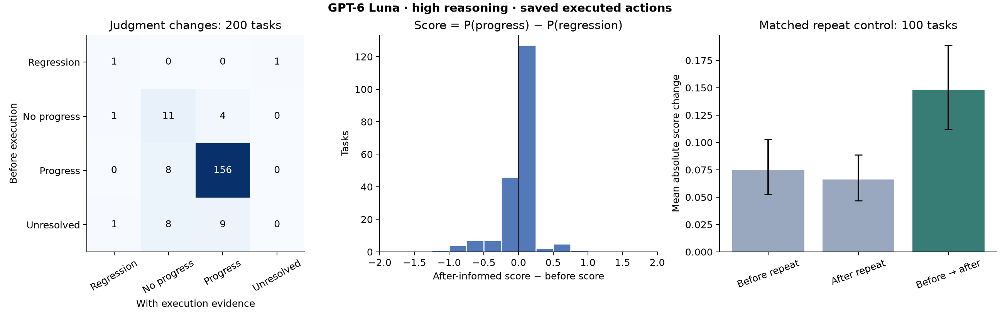
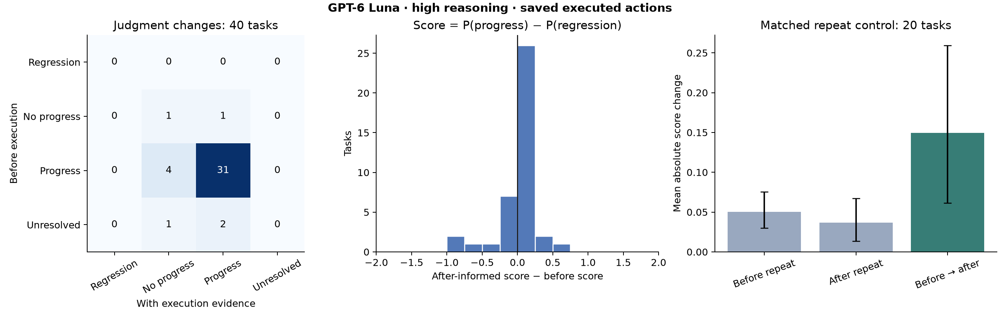
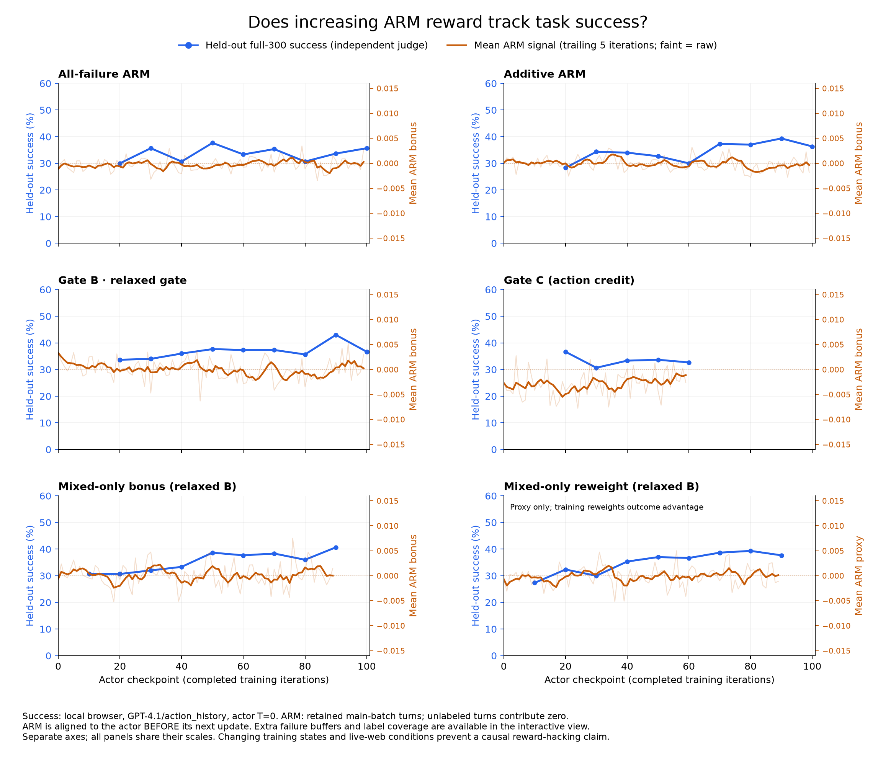
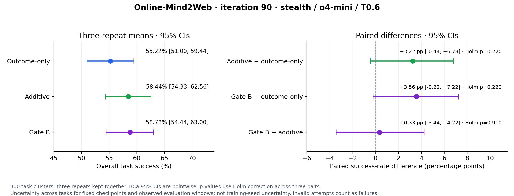
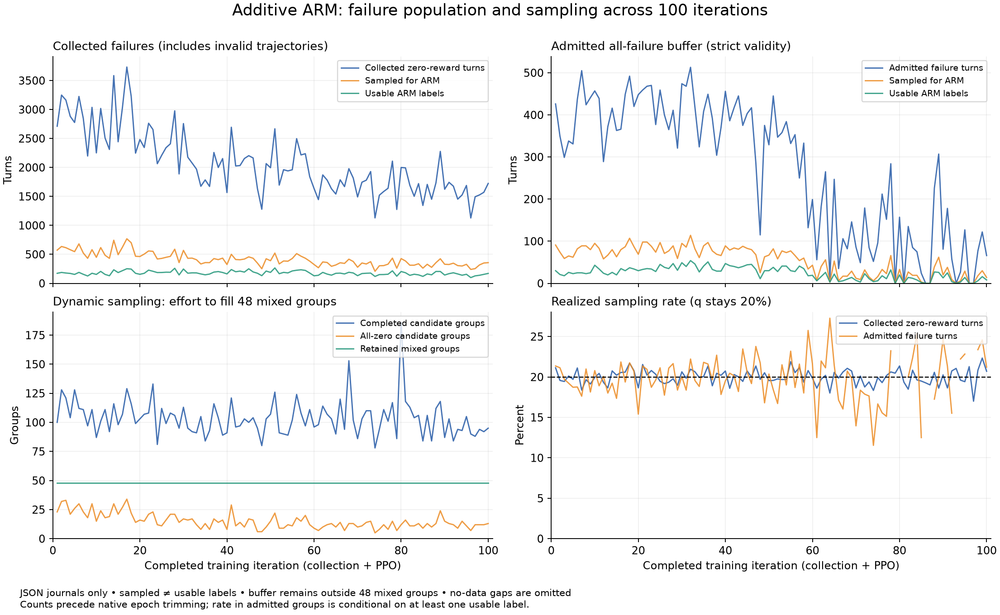
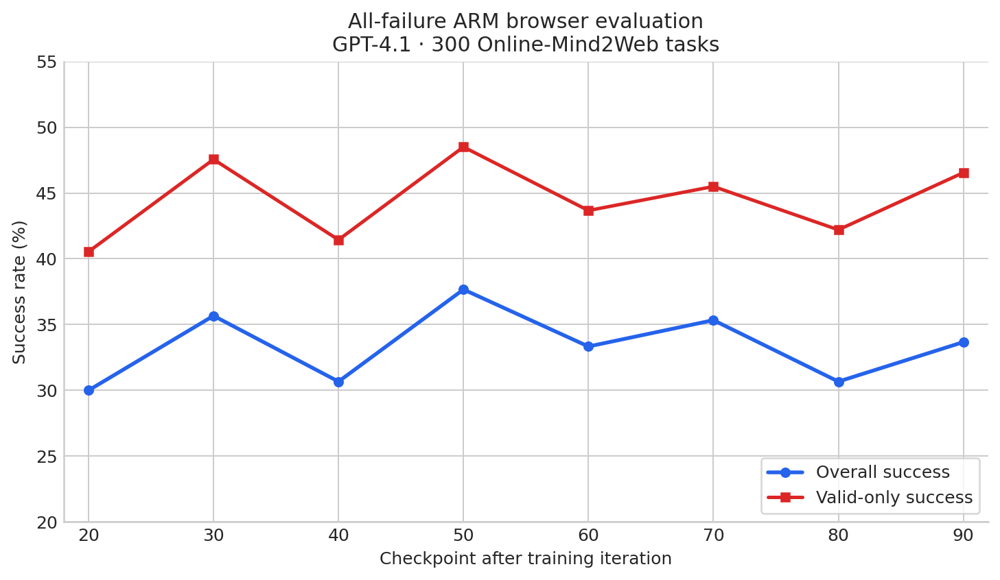

# ARM results: inference, offline training, and online RL

[Concise collaborator summary](ARM_SUMMARY.md)

Detailed inference, offline-training and online-RL results belong here. The records preserve cohorts, uncertainty, scaling studies, audits and provenance; the linked summary contains the core methods and results.

**RL-task SelectionARM full300 repeat:** 41.00% versus 31.67% for the reused SFT control; **+9.33 pp [+4.00, +14.67]**. [Controlled-results table](ARM_INFERENCE_SCALING.md#sft-piotr-repeat-tracker-20261006) · [Final audit](ARM_INFERENCE.md#selectionarm-rltasks-repeat-results-20261007).

**Piotr SelectionARM at 50 steps:** 40.00% versus 30.67% SFT; **+9.33 pp**. Change in gain versus the two 30-step repeats: **+4.33 pp [-2.00, +10.50]**. [Full300 table](ARM_INFERENCE_SCALING.md#sft-piotr-repeat-tracker-20261006) · [Final audit](ARM_INFERENCE.md#selectionarm-piotr-steps50-results-20261007).

<a id="arm-continuation-branches-results-20261007"></a>
## Before versus execution-informed selection

**After-selection success is 44.76% versus 44.29% before: +0.48 pp, paired 95% interval [−2.38, +3.65], across 70 states.** Execution evidence changes choices and reduces repeat disagreement, but a success gain remains unproven. Collection stopped within budget at 74 complete states / 1,110 records; the planned 100 / 1,500 was not reached.

[ARM formulations: concise results, branching diagram, random control and before/after examples](ARM_FORMULATIONS.md) · [Aggregate results](arm_results/rl_integration/continuation-branches-final-20261006.json).

<a id="arm-teacher-evidence-primary200-20261006"></a>
## Execution-informed teacher: independent 200-task panel — October 6 UTC

**32/200 primary labels changed (16.0%) after execution evidence.**
This panel contains 200 new Piotr task groups and excludes all 40 calibration
sample groups and normalized goals. Both judgments use `gpt-6-luna`, high
reasoning, the same frozen prompt and 4,096-output-token cap. Before-only inputs
contain the goal, up to five causal history steps, before screenshot and exact
ordered action bundle; post-informed inputs add the actual after screenshot
and browser feedback. All 600 requests use independent contexts and randomized
order; 100 tasks repeat both conditions. Source revision, protected validation,
retention and benchmark exclusions match the calibration. No critic is trained.

| Metric | Before → after | Before repeat | After repeat |
| --- | ---: | ---: | ---: |
| Primary label-change fraction, 200 tasks |16.0% [11.0%, 21.5%] |— |— |
| Label-change fraction, matched 100 tasks |18.0% [11.0%, 26.0%] |13.0% [7.0%, 20.0%] |7.0% [3.0%, 12.0%] |
| Mean absolute score shift, matched 100 |0.1482 [0.1119, 0.1888] |0.0748 [0.0523, 0.1028] |0.0663 [0.0469, 0.0887] |
| Mean absolute score shift, all 200 |0.1460 [0.1192, 0.1756] |— |— |

Score is P(progress)−P(regression), in [−1, 1]. Intervals are 95% task-bootstrap
intervals from 10,000 resamples, seed 42. The supplementary Wilson interval for
the primary change fraction is [11.6%,
21.7%]. The matched excess
absolute score shift over mean repeat variability is
**0.0777 [0.0429, 0.1169]**;
the excess label-change fraction is
8.0% [0.5%, 15.5%].
These paired comparisons preserve the same 100 task groups in all three terms.
Calibration and primary observations are reported separately.

A subsequent comparison against the before-repeat control alone gives only
+5 percentage points in label changes, paired 95% bootstrap interval [−3, +14]
points. Thus the categorical evidence does not clearly exceed before-only
variability on these 100 tasks. The continuous absolute-score contrast is
0.0734 [0.0348, 0.1150]. This sensitivity was requested after reviewing the
primary result; probability movement still does not establish greater accuracy.

A post-hoc exact-goal sensitivity check that collapses only the leading
find/search-for/look-for/locate verb identifies 198 phrasing clusters within
the 200 primary groups, with no such alias overlap to calibration. Resampling
these clusters gives a label-change interval of
[11.0%, 21.4%].
This simple check is not a comprehensive semantic deduplication guarantee;
no primary rows or requests were changed after the protocol freeze.

| Coverage / direction | Primary result |
| --- | ---: |
| Unresolved before / after |18 / 1 |
| Both resolved |181 / 200 |
| Changed among both resolved |13 / 181 |
| Mean signed score shift |-0.0162 [-0.0516, 0.0180] |
| Mean entropy, before / after |0.515 / 0.375 bits |

| Primary label transition | Tasks |
| --- | ---: |
|no progress -> no progress |11 |
|no progress -> progress |4 |
|no progress -> regression |1 |
|progress -> no progress |8 |
|progress -> progress |156 |
|regression -> regression |1 |
|regression -> unresolved |1 |
|unresolved -> no progress |8 |
|unresolved -> progress |9 |
|unresolved -> regression |1 |

The primary cohort remains demonstration-heavy: all 200 browser receipts begin
with `Succeed`, which only describes command execution. Four transitions have
identical before/after image hashes. The cohort has 155 single-tool and 45
multi-tool bundles. It does not establish coverage of failed actor trajectories
or selection among unexecuted alternatives.

The evidence audit used one local assistant reviewer with teacher labels and
rationales hidden until the reference judgment was saved. The reviewer inspected
the task, tool action, before/after screenshots and receipts, consulting saved
history when needed. All changed cases plus 20 randomly ordered unchanged controls
were included; uncertain references remain unresolved. No additional paid
reference-judge calls were made.

| Evidence audit of changed cases | Count |
| --- | ---: |
|Revised label agrees with observed-evidence reference; original resolved label differs |10 |
|Previously unresolved; revised label agrees with reference |13 |
|Original label agrees with reference; revised resolved label differs |1 |
|Independent reviewer abstains |6 |
|Previously unresolved; revised resolved label differs from reference |2 |

Unchanged controls: `{"both_match_reference": 17, "reviewer_unresolved": 3}`.
This is qualitative agreement with one AI review, not human ground truth or a
representative accuracy estimate. Reviewing all changed cases overrepresents
those cases. Retrospective reference mismatch does not show that a probabilistic
before-action forecast was unreasonable: actual executions can reveal randomness
or information unavailable before acting. Image-only versus receipt-only effects
are also not isolated by this two-condition study. Independent gold/reference
labels and downstream selection or learning gains remain unmeasured.



| Efficiency/accounting | Verified amount |
| --- | ---: |
| Completed requests / API attempts |600 / 600 |
| Failed/incomplete API attempts |0 |
| Receipt-based estimated API cost |$0.283157 |
| Conservative ledger / voluntary cap |$0.358183 /$0.50 |
| Input / output tokens |1,957,188 / 227,070 |
| Reasoning tokens, included in output |153,937 |
| Mean request latency, before / after |5.67s / 4.75s |
| Request window, concurrency 4 |784.56s |
| GPU allocations / new browser rollouts / critic fits |0 / 0 / 0 |

Costs are provider-usage estimates using the same verified Luna rates as the
calibration, with all cache telemetry accounted for; they are not invoices.
The user authorized 200 fresh pairs and 100 repeated pairs (600 planned calls),
with an observed-cost estimate around $0.27. Execution imposed a separate $0.50
ceiling and 620-attempt limit including diagnosed retries, preserving every receipt;
no earlier study budget was transferred. Conservative per-call reservations are
settled before subsequent requests, and the ceiling could stop the panel early.

[Aggregate results](arm_results/rl_integration/teacher-evidence-primary200-results-20261006.json) ·
[Vector plot](arm_results/rl_integration/teacher-evidence-primary200-20261006.svg) ·
[Protocol](ARM_INTEGRATION_PLAN.md#arm-teacher-evidence-primary200-20261006).
The full private interactive review supports changed/unresolved filters, hidden
teacher judgments, repeat inspection and local annotation export. It stays in
runtime `critic-comparison-20261004/teacher-evidence-primary200-20261006/analysis/paired-review.private.html`;
raw screenshots, task text and rationales are not published.

<a id="arm-teacher-evidence-results-20261006"></a>
## Execution-informed teacher judgments — October 6 UTC

**Luna-high changed8/40 labels after seeing execution evidence.** On the
20 tasks with repeat controls, pre/post disagreement was5/20 (25%), versus
1/20 (5%) for repeated pre-only judgments and1/20 (5%) for repeated post-informed
judgments. This is a descriptive calibration study; disagreement is not proof
of improved accuracy, critic-learning benefit or better candidate selection.

The same `gpt-6-luna`, high effort,4,096-output-token cap and default service tier
judged each executed action independently before and after execution evidence.
Both inputs retain the goal, same five-step causal history, before screenshot
and ordered tool action. The post condition adds the real next screenshot and
execution feedback. Proposed actor reasoning and future actor responses are
excluded. Forty task groups were sampled from the eligible Piotr demonstration
transitions;20 have an independent repeat of both conditions. Every request was
shuffled and had its own context. All120 provider model/high-effort identities
and usage receipts were verified, with no failed calls or retries.

| Metric | Before → after evidence | Before → before repeat | After → after repeat |
| --- | ---: | ---: | ---: |
| Label changes, all primary tasks |8/40 =20.0% [7.5%,32.5%] |— |— |
| Label changes, matched20 repeat tasks |5/20 =25.0% |1/20 =5.0% |1/20 =5.0% |
| Mean absolute score change, matched20 |0.1495 [0.0615,0.2595] |0.0503 [0.0300,0.0755] |0.0365 [0.0135,0.0670] |
| Mean absolute score change, all40 |0.1470 [0.0850,0.2190] |— |— |

Score is P(progress)−P(regression), in[-1,1]. Intervals are10,000 task-bootstrap
95% intervals with seed42. On the matched20 tasks, the excess absolute shift
over the mean of the two repeat shifts is0.1061 [0.0266,0.2093]. These estimates
are exploratory; the independent 200-task primary panel is reported above.

| Primary label transition | Tasks |
| --- | ---: |
| Progress → progress |31 |
| Progress → no progress |4 |
| No progress → progress |1 |
| No progress → no progress |1 |
| Unresolved → progress |2 |
| Unresolved → no progress |1 |

There were no regression labels or tied maxima. Mean label entropy fell from
0.477 to0.282 bits; mean signed score change was−0.0165 [−0.1013,0.0600]. Thus,
changes included both downgrades and upgrades, without a clear net score shift.
All40 source receipts begin with successful command execution; goal progress
is a separate judgment. This demonstration-heavy sample does not cover the
full range of failed trajectories. Some observed effects may be unpredictable
from the before-state, which matters before treating revised judgments as
pre-action training targets.



| Efficiency/accounting | Verified amount |
| --- | ---: |
| API calls, including failures/retries |120 /140 cap;0 failed |
| Receipt-based estimated API cost |$0.054055 |
| Conservative settled ledger |$0.068900 /$1.50 cap |
| Input / output tokens |384,217 /41,745 |
| Reasoning tokens, included in output |27,299 |
| Mean request latency, before / after |6.34s /5.30s |
| Request window, concurrency4 |176.17s |
| GPU allocations / new browser executions / critic fits |0 /0 /0 |

Cost uses complete cache-read/write telemetry and the [verified Luna rates](https://developers.openai.com/api/docs/models/gpt-6-luna);
it is a usage-based estimate, not a provider invoice. The higher conservative
ledger charges every input token at the maximum cache-write rate. This is a
separate labeling budget, with no transfer from the earlier inference studies.

[Aggregate results](arm_results/rl_integration/teacher-evidence-pilot-results-20261006.json) ·
[Vector plot](arm_results/rl_integration/teacher-evidence-pilot-20261006.svg) ·
[Protocol and aggregate readiness](ARM_INTEGRATION_PLAN.md#arm-teacher-evidence-pilot-20261006).
The interactive paired review, source screenshots, prompts, responses and
rationales remain private under runtime
`critic-comparison-20261004/teacher-evidence-pilot-20261006/analysis/paired-review.private.html`.
The independent 200-row primary panel is now reported above; new branch
collection and critic training remain unstarted.

<a id="arm-controlled-cost-results-20261004"></a>
## Controlled ARM versus episode resampling — October4

All300 tasks and1,800 episodes independently verified; frozen original SFT
actor, SelectionARM with five full-response candidates, local browser,
T0.7/p0.9/k−1,30 turns, and o4-mini/AgentTrek judge.

| Policy | Overall success | ARM minus policy, pp [paired 95% interval] | Mean browser-step calls/task |
| --- | ---: | --- | ---: |
| ARM, five candidates/turn |39.33% (118/300) |— |15.89 |
| Ordinary pass@1 |35.20% |+4.13 [-0.13, +8.40] |14.39 |
| Ordinary pass@2 |46.17% |-6.83 [-11.40, -2.20] |28.77 |
| Ordinary pass@3 |52.30% |-12.97 [-17.43, -8.23] |43.16 |
| Ordinary pass@4 |56.40% |-17.07 [-22.13, -12.27] |57.55 |
| Ordinary pass@5 |59.33% |-20.00 [-26.00, -14.33] |71.94 |

Observed-KV/vision-cache FLOP bounds per task are1.815–2.269×10¹⁵ for ARM and
1.407–1.736×10¹⁵ for ordinary pass@4. Uniform identical-state caching gives
ARM2.544×10¹⁵ versus an equal-mean-cost ordinary mixture scoring44.72%; ARM's
difference is−5.39pp [−10.63,−0.12]. This is an idealized cache model.
ARM's browser-step count is much lower than multiple ordinary episodes;
pass@k is an oracle bound and excludes a deployable episode chooser.
Total research cost:20.269 H200 GPU-hours; judge accounting$8.86 including
one unsettled reservation. All allocations released.

[Full paired results, cost assumptions and robustness](ARM_INFERENCE.md#arm-controlled-inference-results-20261004) ·
[Aggregate JSON](arm_results/rl_integration/controlled-inference-20261004.json).

<a id="arm-reward-hacking-curves-20261003"></a>
## ARM reward versus task success throughout training — October3

[Interactive view](rl_results/arm_rl_interactive.html#reward-hacking) · [Standalone HTML](rl_results/arm_reward_hacking.html) · [PNG](rl_results/arm_reward_hacking.png) · [PDF](rl_results/arm_reward_hacking.pdf) · [Numeric aggregates](rl_results/arm_reward_hacking.json) · [Raw aggregate CSV](rl_results/arm_reward_hacking.csv).



**What is plotted.** Blue is held-out Online-Mind2Web task success, independently judged by GPT-4.1/action_history with local browsers and actor temperature0. It is the available task-success measure, not oracle ground truth. Orange is the saved mean ARM bonus across retained trainable turns, including zero for unlabeled or gated-out turns. Six principal variants appear in the static figure; all nine are available interactively. No new rollout, GPU or judge calls were made.

- **ARM signal:** `b[t] = β × m[t] × (credit[t] − chance[t])`; plotted mean is `sum(b[t]) / number_of_retained_turns`. Response-index methods use `credit = 1[selected_index == executed_index]` and `chance = 1/5`. Gate C uses equivalent-action credit and `chance = executed_action_multiplicity/5`. The mean therefore equals `β × usable_label_fraction × (credited_selection_rate − mean_chance)`. The interactive view separates those factors and displays raw denominators and RMS.
- **Populations:** the main batch precedes native PPO epoch trimming; this is a turn mean, not an exact token- or optimizer-loss-weighted mean. Additive/B/C and failure ablations have a separate failure-buffer view, before its `Nf/48` loss coefficient. Historical All-failure puts those groups inside its48 slots, so its full-batch, mixed-only and failure-only views are distinguished. Empty buffers remain missing, not zero-valued observations.
- **Reweighting:** its orange curve is the shared `β=0.5` ARM proxy. Actual training uses the existing `λ=0.5` outcome-advantage reweighting, not additive reward. The public aggregate also retains its measured perturbation/outcome RMS ratio.
- **Timing:** a collection with `rollout_id=t` was generated by actor checkpoint`t`, then trained to save checkpoint`t+1`; ARM is plotted at`t`, not`t+1`. Held-out success at`t` evaluates checkpoint`t`. Iteration counts collection/PPO cycles, not individual Adam updates. ARM smoothing pools the preceding five iterations including the current one, weighted by turns or usable labels; it never averages across methods or fills gaps. Evaluation dots remain unsmoothed. The interactive window can be changed or disabled.

**Descriptive early/late comparison.** Windows refer to the actor that generated each collection. Means pool turns; selection rates pool usable labels. The windows below do not overlap. These are not confidence intervals or independent-seed comparisons.

| Method / population | Actor windows, early → late | Mean ARM bonus/proxy, early → late | Credited selection, early → late | Usable label fraction, early → late |
| --- | --- | --- | --- | --- |
| All-failure / main |0–19 →80–99 |−0.000525 →−0.000411 |18.52% →19.06% |7.09% →8.78% |
| Additive / main |0–19 →80–99 |+0.000163 →−0.000687 |20.46% →18.69% |7.14% →10.53% |
| Gate B / main |0–19 →80–99 |+0.000778 →−0.000036 |20.90% →19.96% |17.25% →17.43% |
| Gate B / extra failure buffer |0–19 →80–99 |−0.000183 →+0.003671 |19.78% →23.97% |16.49% →18.51% |
| Gate C / main |0–19 →40–59 |−0.003370 →−0.001969 |29.08% →25.56% |17.59% →17.82% |
| Mixed-only bonus / main |0–19 →70–89 |−0.000035 →+0.000608 |19.96% →20.68% |17.79% →17.85% |
| Mixed-only reweight / main proxy |0–19 →70–89 |−0.000650 →+0.000166 |19.26% →20.20% |17.54% →16.69% |

**Reading the curves.** Main-batch means do not show clear sustained reward inflation while task success deteriorates. Gate B's extra failure buffer does become more positive, but the late window contains580 labels versus1,259 early; the retained failure population and auxiliary weight change during training. Gate C's centered mean rises even though credited selection falls, because its multiplicity-adjusted chance baseline falls from32.91% to27.77%. A rising centered reward alone can therefore be misleading. These observations motivate inspection, not a claim that any method hacks its reward.

**A structural limitation:** SelectionARM ranks five responses from the same evolving actor. Under exchangeable sampling and position-neutral selection, each response wins with probability1/5 regardless of their absolute quality. Actual filtering and decoding can break those assumptions, but an approximately zero centered mean still cannot establish absolute quality or rule out exploitation shared by all candidates. Training states also differ from held-out evaluation tasks, and live-web availability changes across evaluation dates. The valid-only toggle helps inspect denominator changes but does not remove this confounding. A stronger audit would compare successive actors on a fixed state/candidate reference and independently execute or judge their actions; that additional experiment was not run here.

**Provenance and validation.**673 calibration summaries have saved-checkpoint markers: All-failure100, Additive100, Gate B100, Gate C60, mixed bonus90, mixed reweight90, original85, failure β=1 21, and failure sampling40% 27. All nine histories are contiguous from actor0; none lack calibration. The generator checks policy identity, pre-update checkpoint alignment, saved iteration, available checkpoint-validation counters, bonus formulas and auxiliary denominators. Older failure manifests store exact advantages without label metadata; their binary credit/chance is reconstructed from `advantage/β`. Failed collection attempts are excluded. Historical checkpoint tensors that have been pruned are not reloaded for this figure.

Reproduce aggregation/rendering with `scripts/plot_arm_reward_hacking.py`; `--render-only` uses the public numeric JSON. Then run `scripts/plot_arm_interactive.py` to embed it into the existing dashboard. Five CPU tests cover alignment, duplicate-aware credit, missing buffers and denominator-weighted smoothing. Browser checks cover all nine methods/populations, raw exports, smoothing, the valid-only toggle and the embedded view. Input paths/hashes remain in a private runtime receipt; no task text, task identifiers or raw trajectories are published.

<a id="arm-webvoyager90-results-20260930"></a>
## WebVoyager: matched iteration90 results — September30

| Method | Iteration | Overall | Valid-only | Successes / valid / total | Overall Δ vs baseline |
| --- | ---: | ---: | ---: | --- | ---: |
| Outcome-only baseline |90 |66.89% |68.27% |398 /583 /595 |+0.00 pp |
| Additive ARM |90 |64.37% |65.03% |383 /589 /595 |-2.52 pp |
| Gate B |90 |67.06% |67.86% |399 /588 /595 |+0.17 pp |

Actor-only inference on all595 released OpenWebRL/FARA tasks; Browser Use stealth,
T0.6/p0.95/k20,4096 response tokens,30 turns, and GPT-4o/WebVoyager terminal judge.
This is the approved WebVoyager protocol; OM2W stealth uses o4-mini/AgentTrek.
All1,785 task records and paired rollout archives, embedded screenshot evidence,
native89 GPU restoration, checkpoint counters, final W&B metrics and browser
cleanup passed independent checks. Invalid attempts remain in the overall denominator.

Gate B has one more success than baseline (+0.17pp overall) and a slightly
lower valid-only rate; this pass shows no clear WebVoyager gain. Additive is
−2.52pp overall. These are single evaluations of fixed checkpoints, not
independent training seeds. The released dataset has53 date-updated instructions
relative to the paper-pinned version, so absolute scores are not exact paper reproductions.

Browser/proxy charges were$7.11 total: baseline
$2.33, Additive$2.47,
Gate B$2.31; balance after completion
$4.36, zero active sessions. GPU and judge API costs are separate.
All three GPU allocations were released. Including initial failed startups,
consumed GPU-hours were5.926,
6.282, and5.860,
within the separate12h caps; unspent budgets are released.

[Outcome-only baseline audit](arm_results/rl_integration/webvoyager-gpt4o-t06-baseline-iteration90-audit.json) · [Additive ARM audit](arm_results/rl_integration/webvoyager-gpt4o-t06-additive-iteration90-audit.json) · [Gate B audit](arm_results/rl_integration/webvoyager-gpt4o-t06-gate-b-iteration90-audit.json).

<a id="arm-stealth90-o4-three-repeat-summary-20260930"></a>
## Iteration90 stealth: final three-repeat comparison — September30

| Method | Iteration | Full300 overall mean ± SD | Valid-only mean ± SD | Overall Δ vs baseline | Valid denominators, repeats1/2/3 |
| --- | ---: | --- | --- | ---: | --- |
| Outcome-only baseline |90 |**55.22 ± 2.14%** |57.65 ± 1.77% |+0.00 pp |286/290/286 |
| Additive bonus |90 |**58.44 ± 1.35%** |61.45 ± 1.19% |+3.22 pp |286/286/284 |
| Gate B: relaxed gate |90 |**58.78 ± 3.89%** |61.36 ± 3.88% |+3.56 pp |286/288/288 |

All nine full300 cohorts passed independent archive, task-identity, protocol,
checkpoint-restoration and final-metric checks. Each row averages three
per-repeat rates; SD uses the sample denominator2. Valid-only rates are averaged
without pooling their denominators. Additive is+3.22pp and Gate B+3.56pp overall
versus baseline; Gate B varies more between evaluations. These are fixed-model
evaluation repeats, not independent training seeds. The [paired analysis](#arm-stealth90-paired-inference-20260930)
finds no significant pairwise difference at5%. Shared website conditions and the first-pass credit-outage/recovery
also limit interpretation. First-pass recovery retained valid and ordinary
invalid outcomes, retrying only identified credit-blocked tasks; repeat2/3 are
fresh collections with server seeds1235/1236. The existing plot keeps repeat1.
[Machine-readable aggregate with all nine audit hashes](arm_results/rl_integration/stealth-o4-t06-iteration90-three-repeat-summary.json).

<a id="arm-stealth90-paired-inference-20260930"></a>
## Paired iteration90 tests and95% confidence intervals — September30

**No pair establishes a difference at the5% level**, either before or after
Holm correction. OM2W gains remain promising point estimates, not established
superiority; failure to reject does not establish equivalence. This reuses the
saved matched stealth outcomes and makes no new GPU, browser or judge calls.

| Benchmark | Comparison | Overall difference (pp) | Paired95% CI (pp) | Exact p | Holm p (three pairs) |
| --- | --- | ---: | --- | ---: | ---: |
| OM2W,300 tasks ×3 repeats | Additive − outcome-only |+3.22 |[−0.44,+6.78] |0.0959 |0.2198 |
| | Gate B − outcome-only |+3.56 |[−0.22,+7.22] |0.0733 |0.2198 |
| | Gate B − Additive |+0.33 |[−3.44,+4.22] |0.9096 |0.9096 |
| WebVoyager,595 tasks ×1 repeat | Additive − outcome-only |−2.52 |[−6.72,+1.68] |0.2786 |0.8141 |
| | Gate B − outcome-only |+0.17 |[−4.20,+4.54] |1.0000 |1.0000 |
| | Gate B − Additive |+2.69 |[−1.68,+7.23] |0.2714 |0.8141 |



**Estimand and pairing.** Let `y[i,m,r]` be the binary overall task success for
task i, method m and repeat r; invalid attempts count as0. Average each task’s
three repeats first: `x[i,m] = mean_r y[i,m,r]`. The comparison is
`Δ(A,B) = mean_i(x[i,A] − x[i,B])`. The300 task vectors are the inference units;
900 attempts per model are not treated as900 independent tasks. Primary inference
uses all scheduled tasks; marginal valid-only rates retain their separate
method-specific denominators and are not substituted into this paired test.

**Intervals and tests.** Use50,000 paired task bootstrap draws with seed20260930
and BCa pointwise95% intervals. Each draw retains all methods/repeats for each
selected task. Under within-task method-vector exchangeability, the exact
two-sided permutation test swaps the complete A/B vectors within each task.
The statistic uses integer three-repeat success-count differences; convolution
of the signed-count distribution computes the exact tail without Monte Carlo
error. With one binary observation per task, this reduces to exact McNemar.
Holm correction controls the three pairwise comparisons separately within each
benchmark; WebVoyager is secondary. Pointwise95% CIs are not simultaneous
familywise intervals. [Paired bootstrap](https://docs.scipy.org/doc/scipy/reference/generated/scipy.stats.bootstrap.html),
[paired permutation null](https://docs.scipy.org/doc/scipy/reference/generated/scipy.stats.permutation_test.html),
[Holm correction](https://stat.ethz.ch/R-manual/R-devel/library/stats/html/p.adjust.html),
[McNemar](https://www.itl.nist.gov/div898/software/dataplot/refman1/auxillar/mcnemar.htm).

**Sensitivity and limits.** Resampling145 start-URL hostname clusters instead
of individual tasks also gives intervals crossing0 for every OM2W pair:
Additive−baseline[−0.37,+6.86]pp, Gate B−baseline[−0.11,+7.23]pp and
Gate B−Additive[−3.32,+4.07]pp. Restricting to tasks valid for both methods in all
three repeats gives263/269/262 common-valid tasks, respectively; raw paired
p-values are0.165/0.074/0.763. Three-repeat-level t intervals also all cross0,
but only three windows make their normality/independence assumptions hard to
check. These sensitivity results do not change the conclusion.

The primary intervals describe variation across tasks for these fixed checkpoints
and observed evaluation windows. They do not cover independent training-seed
variation or arbitrary shared website/time shocks. Iteration90 was examined
after viewing local learning curves, so this is exploratory fixed-checkpoint
inference rather than a preregistered test of the training recipes. Repeat1’s
approved credit-blocked recovery remains exactly preserved. Historical local
browser checkpoints use different protocols/dates and are excluded from these
tests; the existing training curves are unchanged.

All2,700 OM2W and1,785 WebVoyager records were rechecked against audit totals,
judge identities, task pairing and archive presence. Four checks cover exact
small-sample enumeration, equivalence to exact McNemar, Holm correction, and
invariance when identical repeats are copied. Per-task provenance stays private
in runtime `arm-turn-bonus-preparation/paired-inference-20260930/`.
[Aggregate statistics and source hashes](arm_results/rl_integration/stealth-iteration90-paired-inference.json)
· [Reproduction script](../../scripts/analyze_arm_paired_evals.py)
· [SVG figure](arm_results/rl_integration/stealth-iteration90-confidence.svg).

<a id="arm-stealth90-difficulty-20260930"></a>
<a id="arm-stealth90-five-method-difficulty-20261007"></a>
## OM2W difficulty breakdown: five methods, iteration 90 and three repeats — October 7

The five-method summary combines the nine September 29–30 cohorts with the six
October 6 mixed-only cohorts (2026, PDT). All use actor-only inference,
Browser Use stealth, o4-mini/AgentTrek, T0.6/p0.95/k20, 4,096 response tokens
and 30 turns. Difficulty follows the published human reference-length rule:
easy 1–5 steps, medium 6–10, hard 11+.
[Benchmark definition](https://huggingface.co/spaces/osunlp/Online_Mind2Web_Leaderboard/blob/2dba94f7112bf2e47c701a49c5af971fbf0723d4/content.py).

| Method | Collection dates (PDT) | Difficulty | Tasks/repeat | Overall mean ± sample SD | Valid-only mean ± sample SD | Overall Δ vs Sep baseline | Valid counts, repeats 1/2/3 |
| --- | --- | --- | ---: | --- | --- | ---: | --- |
| Outcome-only baseline | Sep 29–30 | Easy | 80 | 70.00 ± 1.25% | 72.11 ± 1.39% | +0.00 pp | 78/78/77 |
| Outcome-only baseline | Sep 29–30 | Medium | 141 | 55.79 ± 6.96% | 58.49 ± 6.25% | +0.00 pp | 132/137/134 |
| Outcome-only baseline | Sep 29–30 | Hard | 79 | 39.24 ± 3.35% | 41.14 ± 3.32% | +0.00 pp | 76/75/75 |
| Additive | Sep 29–30 | Easy | 80 | 74.58 ± 2.60% | 75.86 ± 3.20% | +4.58 pp | 78/79/79 |
| Additive | Sep 29–30 | Medium | 141 | 56.74 ± 1.88% | 60.92 ± 1.20% | +0.95 pp | 136/130/128 |
| Additive | Sep 29–30 | Hard | 79 | 45.15 ± 0.73% | 47.37 ± 1.07% | +5.91 pp | 72/77/77 |
| Gate B | Sep 29–30 | Easy | 80 | 67.92 ± 5.05% | 69.64 ± 4.71% | -2.08 pp | 77/78/79 |
| Gate B | Sep 29–30 | Medium | 141 | 62.65 ± 4.09% | 65.73 ± 3.58% | +6.86 pp | 133/136/134 |
| Gate B | Sep 29–30 | Hard | 79 | 42.62 ± 3.19% | 44.92 ± 3.95% | +3.38 pp | 76/74/75 |
| Mixed-only bonus + relaxed B | Oct 6 | Easy | 80 | 75.83 ± 7.11% | 76.43 ± 6.41% | +5.83 pp | 80/78/80 |
| Mixed-only bonus + relaxed B | Oct 6 | Medium | 141 | 57.45 ± 3.25% | 58.15 ± 3.76% | +1.65 pp | 140/138/140 |
| Mixed-only bonus + relaxed B | Oct 6 | Hard | 79 | 44.73 ± 4.45% | 45.29 ± 4.31% | +5.49 pp | 79/78/77 |
| Mixed-only reweight + relaxed B | Oct 6 | Easy | 80 | 71.25 ± 1.25% | 71.25 ± 1.25% | +1.25 pp | 80/80/80 |
| Mixed-only reweight + relaxed B | Oct 6 | Medium | 141 | 56.26 ± 1.78% | 57.49 ± 1.87% | +0.47 pp | 139/136/139 |
| Mixed-only reweight + relaxed B | Oct 6 | Hard | 79 | 40.93 ± 4.45% | 40.93 ± 4.45% | +1.69 pp | 79/79/79 |

The baseline deltas are descriptive percentage-point differences. In the
September collection, Gate B's overall deltas are +6.86 pp on medium, −2.08 pp
on easy and +3.38 pp on hard; Additive gains +4.58 pp on easy, +0.95 pp on medium and
+5.91 pp on hard. The October mixed-only rows share the protocol and task bins
but were collected later, so their differences from the September baseline are
not contemporaneously matched effects. These are evaluations of fixed trained
checkpoints, not independent training seeds. No subgroup CIs or significance
tests are introduced, and these results do not show that oversampling difficult
training tasks causes improvement.

Overall rates retain every task in its bin, including invalid attempts.
Valid-only means average three per-repeat success/valid ratios; they are not
pooled ratios. SD is sample SD across the three evaluations (`ddof=1`).
The combined analysis reconciles all 4,500 saved outcomes across 15 cohorts:
45 per-repeat bin rows sum to their full-300 audit totals, and all nine historical
summary rows remain unchanged. It reuses the verified cohort evidence without
new actor, browser or judge calls, archive rescans, or selective retries.
[Five-method subgroup metrics and source hashes](arm_results/rl_integration/stealth-o4-t06-iteration90-five-method-difficulty.json).

**Label audit:** the frozen metadata contains two updated task IDs with a stale
`medium` label but human reference lengths 12 and 11:
`11857213ca01510f12813740afd59918_110325` and
`d730f4ff450da1bd60a836163736ef6a_110325`. This analysis applies the published
length thresholds, yielding **80 easy / 141 medium / 79 hard**, instead of the
stored-label counts 80/143/77. Original labels are retained as `saved_difficulty`
in the per-task CSV; evaluation artifacts were not changed. Full300 results
are identical under either grouping. These OM2W labels are not the WebGym
rubric-fact-count bands used to review the expansion tasks.

**Historical September verification:** all 2,700 task identities, binary verdict metrics, judge
identities and associated archive presence were checked. Repeat1 uses exactly
the previously approved credit-blocked recovery IDs; no valid original record
was replaced. Every full300 count matches its existing audit, and an independent
CSV reconstruction reproduces all 27 subgroup counts and rates. Per-task CSV
contains IDs, reference lengths, labels, validity, success and record hashes;
raw trajectories and judge text remain in runtime.
The historical task-review HTML and 2,700-row per-task verdict CSV remain local;
their links require the existing port forward. They do not contain the October
cohorts, and no new per-task CSV is published for the five-method summary. The user clarified
that publication was intended for the interactive results plot, not the task
pool. The task-review HTML was removed from the current `arm` tree; the earlier
publication commit remains in history pending separately approved cleanup.
Aggregate metrics and analysis scripts remain published on `arm`.

[Historical three-method subgroup metrics and provenance](arm_results/rl_integration/stealth-o4-t06-iteration90-difficulty.json) · [Historical September 2,700 per-task outcomes (local)](http://localhost:8765/arm_om2w_difficulty_verdicts.csv).
Historical reproducer: `scripts/report_arm_om2w_difficulty.py`. Runtime:
`arm-turn-bonus-preparation/stealth90-o4-t06-20260929/difficulty-breakdown-20260930-v2/`.

<a id="arm-stealth90-o4-results-20260929"></a>
## Matched iteration90 stealth results: o4-mini/T0.6 — September29

Same300 tasks, Browser Use stealth, actor T0.6/p0.95/k20,4096 tokens and30 turns,
o4-mini/AgentTrek judge, with no inference-time ARM selection. Original valid
outcomes and ordinary invalid attempts are retained; only HTTP402 credit-blocked
tasks were retried after the account was funded. This is a contemporaneous
comparison interrupted by a shared provider outage, not uninterrupted collection.
The following first-pass table is repeat1; subsequent fresh repeats are recorded separately.

| Method | Fixed100 overall / valid-only | Full300 overall / valid-only | Successes / valid / total | State |
| --- | --- | --- | --- | --- |
| Outcome-only baseline90 |56.00% /57.14% |**54.33% /56.99%** |163 /286 /300 | Verified complete |
| Additive90 |60.00% /61.86% |**59.67% /62.59%** |179 /286 /300 | Verified complete |
| Gate B90 |62.00% /63.27% |**55.33% /58.04%** |166 /286 /300 | Verified complete |

Gate B's merged cohort contains138 retained records and162 retries. All300
expected task IDs, rollout archives and task records were checked, including
286 nonempty terminal-judge verdicts; invalid attempts remain recorded. Native89
GPU restoration, checkpoint counters, final retry W&B history, browser cleanup
and total consumed compute passed verification. Job336973 released its GPU;
all attempts consumed17,680 of25,200 approved GPU-seconds. Full300 counts are
reconstructed from both output roots; the retry W&B run reports its162-task subset.
Baseline also passed all300 merged-artifact checks and released its GPU;
all attempts used17,827/25,200 seconds. Additive's128 retained records plus172
retries also passed the same audit, including all300 archives and286 valid
judge texts; job336972 released its GPU with18,702/25,200 seconds consumed.
Its retry W&B run reports172 tasks,164 valid and99 successes; the full300
result includes80 retained successes and is179/286/300.

Additive is5.33pp higher overall and5.59pp higher valid-only than baseline;
Gate B is1.00pp and1.05pp higher, respectively. These single evaluations do
not establish training-seed robustness. Two more evaluations per method,
including baseline, are [now verified complete](#arm-stealth90-o4-three-repeat-summary-20260930); [approval](ARM_INTEGRATION_PLAN.md#arm-stealth90-three-repeats-o4-20260929).
[Additive merged audit](arm_results/rl_integration/stealth-o4-t06-additive-iteration90-audit.json).
[Baseline merged audit](arm_results/rl_integration/stealth-o4-t06-baseline-iteration90-audit.json).
[Gate B merged audit](arm_results/rl_integration/stealth-o4-t06-gate-b-iteration90-audit.json) ·
[Protocol and recovery history](RL_EVALUATION.md#arm-stealth90-o4-matched-20260929).

<a id="arm-stealth90-o4-repeat2-results-20260929"></a>
### Second evaluation of the same iteration90 checkpoints

Same protocol and all300 task IDs; fresh rollouts with server RNG seed1235.

| Method | Repeat | Fixed100 overall / valid-only | Full300 overall / valid-only | Successes / valid / total | State |
| --- | ---: | --- | --- | --- | --- |
| Outcome-only baseline90 |2 |58.00% /59.18% |**57.67% /59.66%** |173 /290 /300 | Verified complete |
| Additive90 |2 |61.00% /61.62% |**58.67% /61.54%** |176 /286 /300 | Verified complete |
| Gate B90 |2 |67.00% /68.37% |**63.00% /65.63%** |189 /288 /300 | Verified complete |

Gate B's300 rollout archives, task identities and saved judge verdicts passed
independent review, including288 nonempty valid-task judge texts. Native89
restoration,1136 Adam updates, scheduler/cursor and checkpoint file checks,
actual sampling/judge code and final W&B metrics agree. Job337131 finished in
4h33m and released the unused2h27m of its7h cap.
[Gate B repeat2 audit](arm_results/rl_integration/stealth-o4-t06-gate-b-iteration90-repeat2-audit.json).
Baseline repeat2 also passed the300-task archive/verdict, sampling/judge,
checkpoint, GPU restoration and W&B checks. It used16,826 seconds and released
8,374 unused seconds of its7h cap. Its native89 checkpoint retains1016 Adam
updates and the previously documented scheduler offset of1.
[Baseline repeat2 audit](arm_results/rl_integration/stealth-o4-t06-baseline-iteration90-repeat2-audit.json).
Additive repeat2 passed the same300-task artifact/protocol/W&B checks, including
286 nonempty valid verdicts, native89 restoration and1150 Adam updates with
scheduler offset0. Job337130 used18,585 seconds and released6,615 unused seconds.
[Additive repeat2 audit](arm_results/rl_integration/stealth-o4-t06-additive-iteration90-repeat2-audit.json).
All three second passes are now verified. Relative to baseline in this round,
Additive is+1.00pp and Gate B+5.33pp overall. Third passes337132–337134 are now independently verified below.

Gate B's overall rate changed from55.33% to63.00% across two evaluations of the
same checkpoint. This is evaluation variability, not an additional training
gain. The final three-repeat mean and sample standard deviation are reported above.
The plot still shows the matched first pass; it does not select the best repeat.

<a id="arm-stealth90-o4-repeat3-results-20260930"></a>
### Third evaluation of the same iteration90 checkpoints — September30

Fresh full300 rollouts, server seed1236; unchanged stealth/o4-mini/AgentTrek,
T0.6/p0.95/k20,4096 tokens and30 turns.

| Method | Iteration | Repeat | Fixed100 overall / valid-only | Full300 overall / valid-only | Successes / valid / total | Audit |
| --- | ---: | ---: | --- | --- | --- | --- |
| Outcome-only baseline |90 |3 |52.00% /54.17% |**53.67% /56.29%** |161 /286 /300 |[Verified audit](arm_results/rl_integration/stealth-o4-t06-baseline-iteration90-repeat3-audit.json) |
| Additive bonus |90 |3 |55.00% /57.29% |**57.00% /60.21%** |171 /284 /300 |[Verified audit](arm_results/rl_integration/stealth-o4-t06-additive-iteration90-repeat3-audit.json) |
| Gate B: relaxed gate |90 |3 |61.00% /61.00% |**58.00% /60.42%** |174 /288 /300 |[Verified audit](arm_results/rl_integration/stealth-o4-t06-gate-b-iteration90-repeat3-audit.json) |

All three passed independent task-ID, paired-archive, saved-verdict, frozen
protocol, native89 restoration and W&B checks; jobs337132/337133/337134 exited0
and released their GPUs. Consumed time was17,106/18,470/17,575 seconds,
respectively, within each original25,200-second cap. WebVoyager was released
only after the requested final OM2W and settled-credit review.

<a id="arm-stealth90-results-20260929"></a>
## ARM iteration90 stealth evaluations — September29

**Protocol correction:** these GPT-4.1/T0 cohorts did not match the user's
intended stealth protocol. The default is o4-mini/AgentTrek with actor T0.6;
[the corrected matched results and recovery record appear above](#arm-stealth90-o4-results-20260929).
The earlier attempts exhausted Browser Use credits; their apparent300-record
completion includes tasks with no browser session and is not a full300 result.
Completed outcomes are preserved, and only independently identified HTTP402
tasks are retried within the original GPU budgets after the user added credits.
Preserve the results below as history.

Actor-only evaluation with Browser Use stealth, GPT-4.1/action_history, T0,
4096 response tokens and30 turns. No inference-time ARM selection or task retries.

| Method | Fixed100 overall / valid-only | Full300 overall / valid-only | Successes / valid / total |
| --- | --- | --- | --- |
| Additive90 |49.00% /51.04% |**53.00% /56.18%** |159 /283 /300 |
| Gate B90 |57.00% /58.16% |**56.33% /58.68%** |169 /288 /300 |

Both first passes completed. Gate B is3.33pp higher overall (ten successes) and
2.50pp higher valid-only; this is one evaluation per independently trained policy,
not a multi-seed or repeated-evaluation estimate. All600 rollout/verdict pairs,
native checkpoint89 restores, cohort membership and final W&B histories passed
verification; owned browser sessions stopped. Additive used4h03m48s and Gate B
3h39m44s, together7.73 of the approved14 GPU-hours.

**Paired task test:** Gate B succeeds on 57 tasks where Additive fails; Additive
succeeds on 47 where Gate B fails. Across all 300 tasks, counting invalid tasks
as failures, exact two-sided McNemar **p=0.378**. The paired task-bootstrap 95%
interval for Gate B minus Additive is **−3.33 to +10.00 pp**. On the 277 tasks
valid in both runs, wins/losses are 52/46 and **p=0.614**. Neither comparison
establishes a difference. This exploratory task-level analysis does not estimate
training-seed or repeated-evaluation variance, and does not account for correlation
among tasks on the same website. The historical outcome-only baseline uses a
different judge and actor temperature, so no matched baseline significance test
is reported. [Paired-count and bootstrap audit](arm_results/rl_integration/stealth-iteration90-paired-comparison.json).

Earlier local-browser results were39.33% /54.63% for Additive (216 valid) and
43.00% /55.13% for Gate B (234 valid). Browser backend and collection date both
changed. Historical baseline stealth90 uses o4-mini/T0.6; these comparisons do
not establish a training gain over the baseline.
[Additive audit](arm_results/rl_integration/stealth-additive-iteration90-audit.json) ·
[Gate B audit](arm_results/rl_integration/stealth-gate-b-iteration90-audit.json) ·
[Protocol and runtime evidence](RL_EVALUATION.md#arm-stealth90-threeway-repeats-20260928).

<a id="arm-mixed-pair-iter10-results-20260928"></a>
<a id="arm-mixed-pair-iter20-results-20260928"></a>
<a id="arm-mixed-pair-iter30-results-20260929"></a>
<a id="arm-mixed-pair-iter40-results-20260929"></a>
<a id="arm-mixed-pair-iter50-results-20260929"></a>
<a id="arm-mixed-pair-iter60-results-20260930"></a>
<a id="arm-mixed-bonus-iter70-results-20261001"></a>
<a id="arm-mixed-reweight-iter70-results-20261001"></a>
<a id="arm-mixed-bonus-iter80-results-20261001"></a>
<a id="arm-mixed-reweight-iter80-results-20261001"></a>
<a id="arm-mixed-bonus-iter90-results-20261002"></a>
<a id="arm-mixed-reweight-iter90-results-20261002"></a>
## Mixed-only relaxed-B pair: iterations10–90 — September28–October2

Both fresh-from0 runs completed training60 and all six full300 evaluations
at10,20,30,40,50,60. All checkpoints, archives and task records are verified;
both original to60 allocations were released. The separately approved to90
continuations completed both80 evaluations, all verified. Reweight340423 has now
completed90 with1,170 Adam updates; its checkpoint and full300 evaluation90 passed
independent integrity checks. Bonus340425 has also completed90 with1,106 Adam updates
and its full300 evaluation. Both allocations have been released.
[Recovery and storage status](ARM_INTEGRATION_PLAN.md#arm-mixed-async-label-recovery-20261002)
record the tested label-I/O/checkpoint-discovery fixes and all consumed time.
Both retain their original optimizer, scheduler, data cursor and W&B identities;
both final90 checkpoints and all nine full300 milestones per lineage are verified.
Protocol: local browsers, GPT-4.1/action_history and temperature0. Each keeps48
ordinary mixed groups, the relaxed min2 gate and response-index credit, with no
auxiliary all-failure groups. Bonus uses beta=.5; reweight uses sign-aware,
trajectory-mean-one weighting with lambda=.5.

| Method | Iteration | Fixed100 overall / valid-only | Full300 overall / valid-only | Valid /300 |
| --- | ---: | --- | --- | ---: |
| Outcome-only baseline, historical |10 | — |23.33% /29.91% |234 |
|  |20 | — |31.67% /40.95% |232 |
|  |30 | — |32.00% /38.71% |248 |
|  |40 | — |33.33% /43.29% |231 |
|  |50 | — |35.00% /44.87% |234 |
|  |60 | — |35.00% /45.65% |230 |
|  |70 | — |34.33% /44.98% |229 |
|  |80 | — |38.00% /49.78% |229 |
|  |90 | — |33.67% /45.50% |222 |
| Mixed-only bonus + relaxed B |10 |31.00% /41.33% |30.67% /39.32% |234 |
|  |20 |30.00% /43.48% |30.67% /40.89% |225 |
|  |30 |29.00% /39.19% |32.00% /42.11% |228 |
|  |40 |32.00% /43.84% |33.33% /43.86% |228 |
|  |50 |35.00% /48.61% |38.67% /49.57% |234 |
|  |60 |41.00% /54.67% |37.67% /48.71% |232 |
|  |70 |44.00% /57.14% |38.33% /48.94% |235 |
|  |80 |35.00% /50.72% |36.00% /48.87% |221 |
|  |90 |38.00% /51.35% |40.67% /52.36% |233 |
| Mixed-only reweight + relaxed B |10 |25.00% /34.72% |27.33% /34.17% |240 |
|  |20 |31.00% /44.29% |32.33% /42.73% |227 |
|  |30 |28.00% /43.75% |30.00% /41.10% |219 |
|  |40 |33.00% /50.00% |35.33% /47.11% |225 |
|  |50 |33.00% /45.21% |37.00% /46.84% |237 |
|  |60 |34.00% /44.74% |36.67% /47.21% |233 |
|  |70 |38.00% /50.00% |38.67% /49.57% |234 |
|  |80 |37.00% /49.33% |39.33% /51.08% |231 |
|  |90 |39.00% /51.32% |37.67% /49.78% |227 |

**Bonus90, October2:**122 successes/233 valid/full300 gives **40.67% overall
/52.36% valid-only**; fixed100 is38/74/100: **38.00% /51.35%**. This is3.00pp
above reweight90 overall and7.00pp above the historical outcome-only90 result;
different collection dates and valid-task sets limit interpretation. All300
archives/verdicts, checkpoint restoration and final W&B metrics were verified.
Fourteen valid failures carry native judge-not-run sentinels (9 truncated,5 failed).
[Bonus90 audit](arm_results/rl_integration/mixed-bonus-iteration90-audit.json).

**Reweight90, October2:**113 successes/227 valid/full300 gives **37.67% overall
/49.78% valid-only**; fixed100 is39/76/100: **39.00% /51.32%**. Full300 is1.67pp
below reweight80 overall and4.00pp above the historical outcome-only baseline90.
Different collection dates and valid-task sets limit that comparison. All300
task IDs, rollout archives, verdicts, native89 restoration and final W&B metrics
passed independent checks. Eight valid failures carry the unchanged judge-not-run
sentinel (7 truncated,1 failed). All nine milestones10–90 retain2,700 saved
rollout/verdict pairs. [Reweight90 audit](arm_results/rl_integration/mixed-reweight-iteration90-audit.json) ·
[Endpoint verification](arm_results/rl_integration/mixed-reweight-to90-completion.json).

**Reweight80, October1:**118 successes/231 valid/full300 gives **39.33% overall
/51.08% valid-only**; fixed100 is37/75/100: **37.00% /49.33%**. Full300 gains
0.67pp overall from70 and exceeds bonus80 by3.33pp overall and2.21pp valid-only.
This is one evaluation per checkpoint with different valid-task sets, not an
established winner. All300 task IDs, nonempty rollout archive payload entries,
saved judge records, native79 restoration at1,060 Adam updates and final W&B
metrics passed independent checks. Eighteen valid failures carry the unchanged
protocol's judge-not-run sentinel (13 truncated,5 failed). Training restoration
from80 passed and the controller started the stage toward90.
[Reweight80 audit](arm_results/rl_integration/mixed-reweight-iteration80-audit.json).

**Bonus80, October1:**108 successes/221 valid/full300 gives **36.00% overall
/48.87% valid-only**; fixed100 is35/69/100: **35.00% /50.72%**. Overall is2.33pp
below70, while valid-only is nearly unchanged (48.94%→48.87%) and valid tasks
fall235→221. Different valid-task sets prevent attributing this difference
solely to the policy. All300 task records and nonempty rollout archive payload
entries, native79 restoration at1,004 Adam updates and final evaluation W&B
metrics passed independent checks. Fifteen valid failures carry the unchanged
protocol's judge-not-run sentinel (8 truncated,7 failed). The subsequent training
preflight stopped on personal quota before any iteration81 optimization;
checkpoint80 and the completed evaluation are preserved.
[Bonus80 audit](arm_results/rl_integration/mixed-bonus-iteration80-audit.json) ·
[Recovery status](ARM_INTEGRATION_PLAN.md#arm-mixed-quota-recovery-20261001).

**Reweight70, October1:**116 successes/234 valid/full300 gives **38.67% overall
/49.57% valid-only**. Fixed100 is38/76/100: **38.00% /50.00%**. This is+2.00pp
overall from60 and+0.33pp (one success) above bonus70. The fixed100 slice favors
bonus while full300 is nearly tied; neither establishes a robust winner. All300
task IDs, nonempty rollout archive payload entries, judge records, native69
GPU restoration at934 Adam updates and final evaluation W&B metrics passed
independent checks. Seventeen valid failures carry the unchanged protocol's
explicit judge-not-run sentinel (15 truncated,2 failed). The controller then
passed native69 model-and-optimizer restoration and resumed the stage toward80.
[Reweight70 audit](arm_results/rl_integration/mixed-reweight-iteration70-audit.json).

**Bonus70, October1:**115 successes/235 valid/full300 gives **38.33% overall
/48.94% valid-only**. Fixed100 is44/77/100: **44.00% /57.14%**. Full300 gains
0.67pp overall from60; one evaluation does not establish a trend. All300 task
IDs, nonempty rollout archive payload entries and saved judge records were
verified, together with native69 GPU restoration at894 Adam updates and final
evaluation W&B metrics. Nineteen valid failures use the unchanged protocol's
explicit judge-not-run sentinel (14 truncated,5 failed). Training continues
toward90; this evaluation does not complete the continuation allocation.
[Bonus70 audit](arm_results/rl_integration/mixed-bonus-iteration70-audit.json).

Bonus60 finishes at113 successes/232 valid/full300: **37.67% overall /48.71%
valid-only**. Its fixed100 slice is41/75/100: **41.00% /54.67%**. Compared with50,
full300 falls1.00pp overall while fixed100 rises6.00pp; the fixed subset alone
would overstate improvement. Reweight60 is110/233/300: **36.67% /47.21%**,
with fixed100 **34.00% /44.74%**. Bonus is1.00pp higher overall at60.

| Prespecified40/50/60 checkpoint mean | Overall | Valid-only |
| --- | ---: | ---: |
| Mixed-only bonus + relaxed B |36.56% |47.38% |
| Mixed-only reweight + relaxed B |36.33% |47.05% |

The late-checkpoint mean differs by only0.22pp overall and0.33pp valid-only.
These correlated checkpoints from one training lineage per method do not
establish a clear winner or training-seed robustness. Historical outcome-only60
is35.00% /45.65%; dates and valid-task sets differ, so bonus/reweight's+2.67pp/
+1.67pp overall differences are descriptive.
[Aggregate and audit hashes](arm_results/rl_integration/mixed-pair-iteration40-60-summary.json).

All six cohorts per method cover their exact300 expected task IDs and paired
archives/records:3,600 attempts retained across the pair. Final native59 has786
aligned Adam/scheduler updates for bonus and814 for reweight; task cursors,
checkpoint extents and sampled finite tensors passed. Actual native59 GPU
restoration and final W&B histories were verified. Bonus60 includes nine valid
terminal-status failures with explicit judge-not-run records (6 truncated,
3 failed), as prescribed by the unchanged baseline evaluation protocol.

Bonus jobs335699/335700/337983 consumed167,384/172,800 extension seconds
(371.96 GPU-hours), releasing5,416 seconds unused; reweight335697/335698
consumed140,602/172,800 seconds (312.45 GPU-hours), releasing32,198 seconds.
Original8h scopes remain separate. All jobs exited successfully; both to60
endpoints are verified complete. The separate to90 resources were subsequently
[approved and launched](ARM_INTEGRATION_PLAN.md#arm-mixed-pair-to90-20260930).
[Bonus60 evaluation audit](arm_results/rl_integration/mixed-bonus-iteration60-audit.json) ·
[Bonus six-milestone endpoint](arm_results/rl_integration/mixed-bonus-to60-completion.json) ·
[Reweight60 evaluation audit](arm_results/rl_integration/mixed-reweight-iteration60-audit.json) ·
[Reweight six-milestone endpoint](arm_results/rl_integration/mixed-reweight-to60-completion.json).

Bonus50 has116 successes and234 valid tasks; fixed100 has35 successes and72
valid tasks. All300 task IDs, paired archives, stored judge records, native49
restoration with668 Adam updates and final W&B metrics passed independent checks.
The baseline protocol assigns failure to some truncated/failed terminal statuses
without an API judgement;16 valid attempts carry that explicit stored sentinel.
Bonus exceeds reweight50 by1.67pp overall and2.74pp valid-only. These are single
evaluations of each checkpoint. [Bonus50 audit](arm_results/rl_integration/mixed-bonus-iteration50-audit.json).

Reweight50 has111 successes and237 valid tasks; fixed100 has33 successes and73
valid tasks. From40, full300 overall rises1.67pp, while valid-only falls0.28pp
and valid tasks increase225→237. Historical baseline50 is35.00% /44.87%, so
the descriptive differences are+2.00pp overall and+1.96pp valid-only. This is not
a matched-date causal comparison. Bonus50 is now38.67% /49.57%; the predefined
40/50/60 comparison is now complete above. All300 archive/verdict pairs, native49 restoration at694
Adam updates and W&B history were verified. The same controller passed model/
optimizer restoration for continuation toward60.

Bonus40 has100 successes and228 valid tasks; fixed100 has32 successes and73
valid tasks. Overall improves1.33pp from30 and matches historical baseline40's
33.33%, with three fewer valid tasks. All300 archived rollouts/verdicts, native
checkpoint39 restoration at548 Adam updates and final W&B history were checked.
The controller resumed training toward50 in the same allocation.

Reweight40 has106 successes and225 valid tasks; fixed100 has33 successes and66
valid tasks. Relative to30, overall improves5.33pp and valid-only6.02pp.
Historical baseline40 is33.33% /43.29%, giving a descriptive+2.00pp overall
difference; dates and valid-task sets differ. Reweight40 is also2.00pp above
bonus40 overall and3.25pp above valid-only. These are descriptive single-cohort
differences; valid-task sets differ. The predefined primary
comparison remains mean overall success across40/50/60, not the best checkpoint.
All300 archives/verdicts, native checkpoint39 restoration at564 Adam updates and
final W&B history were verified; the same allocation resumed toward50.

Bonus30 has96 successes and228 valid tasks; fixed100 has29 successes and74
valid tasks. Relative to20, overall improves1.33pp and valid-only1.22pp. At30,
bonus is2.00pp above reweight overall and1.01pp above valid-only, and matches
historical baseline30 overall with20 fewer valid tasks. These are descriptive
single-run comparisons, not established gains. All300 archives/verdicts, native
checkpoint29 restoration at424 Adam updates and final W&B metrics were verified.

Reweight30 has90 successes and219 valid tasks; fixed100 has28 successes and64
valid tasks. Relative to20, overall falls2.33pp and valid-only1.64pp, with eight
fewer valid tasks. Historical outcome-only30 is32.00% /38.71%; reweight is lower
overall but higher conditional on validity. These differing-date evaluations
do not establish an improvement. All300 archives and verdicts at30 passed
inspection; native checkpoint29 and final W&B history agree. The controller
passed model/optimizer restoration at436 Adam updates and resumed toward40.

Reweight20 has97 successes and227 valid tasks; its fixed100 slice has31 successes
and70 valid tasks. Overall improves5.00pp from its10 checkpoint and is0.67pp above
historical baseline20. Bonus20 has92 successes and225 valid tasks; its fixed100
slice has30 successes and69 valid tasks. Reweight20 is1.67pp above bonus20 overall
(five additional successes); bonus20 is1.00pp below historical baseline20. Different dates
and valid-task sets limit comparisons; these single-run differences do not
establish superiority or significance.

All2,700 rollout/verdict pairs and nonempty ZIP archives across the nine new
cohorts passed inspection. Cohort membership, judge settings, checkpoint lineage
and temperature were checked. Both controllers continue training and own later
evaluations through60.

[Bonus10 audit](arm_results/rl_integration/mixed-bonus-iteration10-audit.json) ·
[Bonus20 audit](arm_results/rl_integration/mixed-bonus-iteration20-audit.json) ·
[Bonus30 audit](arm_results/rl_integration/mixed-bonus-iteration30-audit.json) ·
[Bonus40 audit](arm_results/rl_integration/mixed-bonus-iteration40-audit.json) ·
[Reweight10 audit](arm_results/rl_integration/mixed-reweight-iteration10-audit.json) ·
[Reweight20 audit](arm_results/rl_integration/mixed-reweight-iteration20-audit.json) ·
[Reweight30 audit](arm_results/rl_integration/mixed-reweight-iteration30-audit.json) ·
[Reweight40 audit](arm_results/rl_integration/mixed-reweight-iteration40-audit.json) ·
[Reweight50 audit](arm_results/rl_integration/mixed-reweight-iteration50-audit.json) ·
[Evaluation provenance](RL_EVALUATION.md#arm-mixed-pair-iter10-results-20260928).

<a id="arm-failure-sampling40-stop-20260927"></a>
## Failure sampling40% stopped — September27

Stopped at the user's request. Jobs332003 and332005 are canceled; durable
iteration27/392 Adam updates and all collected artifacts are preserved.
The latest evaluated checkpoint is20; there is no iteration30 result.

| Iteration20, full300 | Overall | Valid-only | Valid tasks |
| --- | ---: | ---: | ---: |
| Historical Additive, failure q20% | 28.33% | 36.02% | 236 |
| Failure q40% | 27.67% | 37.39% | 222 |

The difference is only two successes out of300, with different collection dates
and valid-task sets. This supports deprioritizing an unpromising early run, but
does **not** establish that greater sampling reduces performance. Additive's
later improvement also means the early checkpoint cannot settle eventual quality.

The saved same-collection audit confirms the coverage intervention executed:

| Iterations1–20, identical retained failure turns | Original q20% labels | After q40% labeling |
| --- | ---: | ---: |
| Retained failure groups / turns | 160 / 7,334 | 160 / 7,334 |
| Usable labels | 572 | 1,059 |
| Mean usable labels per iteration | 28.6 | 53.0 |
| Usable fraction of failure turns | 7.80% | 14.44% |
| Sum of absolute turn bonuses | 89.9 | 172.2 |

Of2,951 attempted labels,1,861 (63.06%) were rejected for duplicate actions;
1,059 were admitted, with31 other failures. Thus40% is the attempted-label
rate, not the usable-label rate. The strict five-distinct-action gate remains;
this run does not use Gate B's relaxed gate. Extra labeling averaged94 seconds
per collection during1–20.

The failure loss averages over **all retained failure turns**, including zeros,
with coefficient `N_f/48` and beta0.5. It does not divide by the number of labels
or by sampling probability. More labels therefore also increase auxiliary reward
weight: summed absolute bonuses rose1.92×. This is a reward-magnitude diagnostic,
not a measured gradient-norm ratio or evidence of the cause of weaker task success.
Extra supervision on failed trajectories remains a local preference signal,
without a terminal-success guarantee for the selected alternative.

All27 durable iterations pass manifest checks for q40%, beta0.5,48 mixed groups,
the unchanged gate/credit rule, group coefficient, failure-turn denominator,
label counts and per-label advantages. These checks confirm recipe execution;
they do not prove the absence of every possible training bug. The q20% column
above is a diagnostic on this run's own states, not an independent trained control.
[Aggregate counts and per-iteration audit](arm_results/rl_integration/failure-sampling40-stop-20260927.json).

<a id="arm-original-backfill-20260927"></a>
## Original-bonus iterations20–60 — September27

All five full300 backfills completed, with every rollout and verdict preserved.
Overall/valid-only:20 **28.00%/37.00%**,30 **32.67%/43.56%**,40
**32.00%/42.86%**,50 **34.00%/43.22%**,60 **35.67%/45.73%**.
Iteration40 reuses its historical100; the other four are fresh300 evaluations.
Exact50 is separate from the older51 result. Compared with the historical
outcome-only baseline, overall differences at20/30/40/50/60 are−3.67,+0.67,
−1.33,−1.00,+0.67pp; these differing-date results show no consistent advantage.
[Per-checkpoint counts, fixed100 slices and provenance](RL_EVALUATION.md#arm-original-backfill-results-20260927).
The comparison plot continues to exclude original bonus, as requested.

<a id="arm-gate-b-iter100-20260929"></a>
## Gate B iteration100 — September29

Full300 is **36.67% overall /48.89% valid-only** (110 successes,225 valid);
fixed100 is **30.00% /44.12%** (30 successes,68 valid). This is6.33pp lower
overall than90, and2.00pp above the historical outcome-only100 result.
Additive100 is36.33% /50.23%. The different evaluation dates and valid-task
sets limit these comparisons;90 remains Gate B's best evaluated checkpoint.

Training through100 and the full300 evaluation are verified complete, including
the native99 checkpoint with1,246 Adam updates, all saved task records/archives,
and final W&B history. Job336893 exited successfully and released its GPUs.
The summary, results sheet and comparison plot now include100.
[Counts, protocol, artifact audit and budget](RL_EVALUATION.md#arm-gate-b-iter100-results-20260929).

<a id="arm-gate-b-iter90-20260928"></a>
## Gate B iteration 90 — September 28

Full300 is **43.00% overall /55.13% valid-only** (129 successes, 234 valid);
the fixed100 slice is **39.00% /54.93%** (39 successes, 71 valid). This is
Gate B's best evaluated checkpoint so far: +7.33 percentage points overall
from iteration80 and +9.33 points versus historical outcome-only baseline90.
The latter is a comparison across dates and different valid-task sets, not
an established treatment effect or significance result.

All300 rollout archives and verdicts, cohort membership, native checkpoint89,
and the unchanged local-browser/GPT-4.1/action_history/temperature0 protocol
passed inspection. Evaluation logged separately to `openwebrl-evals`.
Job335729 resumed iteration91 toward100 with the same optimizer, scheduler,
cursor and training W&B identity. The summary and comparison plot include90.
[Detailed audit](RL_EVALUATION.md#arm-gate-b-iter90-results-20260928).

<a id="arm-gate-b-iter80-20260927"></a>
## Gate B iteration80 — September27

Full300 is **35.67% overall /47.35% valid-only** (226 valid); the original
fixed100 slice is34.00%/47.89% (71 valid). This is1.67pp below B70 and2.33pp
below historical outcome-only baseline80; differing dates and valid-task sets
limit the comparison. All300 rollouts and verdicts are verified and preserved.
Job334894 passed restoration and began iteration81 collection toward90.
The [summary and plot](ARM_SUMMARY.md#baseline-comparison) now include B80.
[Protocol, counts and artifact audit](RL_EVALUATION.md#arm-gate-b-iter80-results-20260927).

<a id="arm-gate-b-iter70-20260927"></a>
## Gate B iteration70 — September27

Full300 is **37.33% overall /48.91% valid-only** (229 valid); the fixed100 slice
is35.00%/50.00% (70 valid). Overall is unchanged from B60 and3.00pp above the
historical outcome-only baseline70; different collection dates and valid-task
sets prevent a causal gain claim. All300 rollouts and verdicts are preserved.
The [summary table and comparison plot](ARM_SUMMARY.md#baseline-comparison)
now include B70. [Full audit and protocol](RL_EVALUATION.md#arm-gate-b-iter70-results-20260927).

<a id="arm-prefix-curriculum-results-331932"></a>
## ARM prefix curriculum feasibility — September26, job331932

**Small positive signal for two-turn guidance, not a demonstrated curriculum
learning gain.** The original SFT actor completed48 training tasks with two
attempts in each of three conditions. The actor and ARM were frozen; no training
updates occurred. These are training-panel results, not Online-Mind2Web scores.

| Guided prefix | Overall success | Valid-only success | Valid /attempted | Success after actor handoff | Success entirely within guide | Actor output tokens relative to control |
| --- | ---: | ---: | ---: | ---: | ---: | ---: |
|0: actor only|38.54%|38.54%|96/96|37|0|1.00×|
|2 turns|42.71%|44.57%|92/96|36|5|1.57×|
|4 turns|40.63%|41.05%|95/96|24|15|2.37×|

Two-turn guidance improves overall success by4.17pp, with a task-cluster
bootstrap95% interval of[−6.25,+14.58]pp. Four turns improves it by2.08pp,
interval[−5.21,+9.38]pp. Both are exploratory and inconclusive. Among jointly
valid paired attempts the differences are+5.43pp (92 pairs) and+2.11pp (95 pairs).

The two-turn condition has12 failure→success and8 success→failure paired changes.
**Eleven of those12 improvements required an actor-only suffix; one finished
inside the guide.** Therefore the net improvement is not solely explained by
guide-only completions. However, total actor-completed successful suffixes are36
versus37 for the control, and successful actor suffix turns are178 versus271.
These counts measure data yield, not learning value; guided conditions move
some otherwise successful attempts into the guide-only category. Four-turn
guidance yields eight actor-suffix improvements and eight actor-suffix regressions,
with103 successful actor suffix turns. Conditional handoff comparisons are
selected populations, not causal effects on a common set of states.

The guide uses frozen SelectionARM with five full-response candidates only in
the prefix, then switches to one actor response in the same browser/history.
All conditions use T0.8/top_p1,response1024,context32768,horizon15 including
guided turns, and native GPT-4.1/action_history judging. Condition order is
randomized within task and repeat seeds match. Live browser states remain
stochastic. The control's two-attempt any-success rate is50%; that uses a
different rollout budget and is not an equal-compute comparison. Output-token
ratios above exclude selector compute and prefill cost.

All288 primary plus12 smoke rollout/verdict pairs were verified, including
archive headers and handoff trace boundaries. No selector failure/fallback
occurred. The five invalid attempts comprise one reset navigation failure,
two reset screenshot failures and two environment-step errors. They remain in
the primary denominator; none were selectively retried. The job completed in
46m16s (1.54 H200 GPU-hours), released its unused allocation, and used211 judge
requests totaling$1.86 charged/reserved. Its persistent watcher verified completion.

**Decision:** discuss the two-turn condition before considering an RL pilot;
four turns has weaker evidence and higher generation cost. This test alone does
not justify claiming that assisted suffix training improves the standalone actor.
No follow-up allocation was submitted.

[Protocol](ARM_INTEGRATION_PLAN.md#arm-prefix-curriculum-pilot-20260926) ·
[Aggregate results and completion audit](arm_results/rl_integration/prefix-curriculum-pilot-331932.json) ·
[W&B](https://wandb.ai/zixianma/openwebrl-evals/runs/arm-prefix-pilot-331932).
Private complete artifacts: runtime `evaluations/arm-prefix-pilot-331932/sft/`,
including `compare_records/`, `trajectories/`, and `prefix-summary.json`.

<a id="arm-refresh-browser-results-20260926"></a>
## Refreshed ARM browser forward transfer — September26, 2026

Job331770 completed the frozen-versus-refreshed SelectionARM comparison on the
same outcome-only iteration90 actor. Both300-task stages have saved rollouts and
judge verdicts, verified against their summaries and native checkpoint restore
receipts. This comparison does **not** demonstrate a benefit from refreshing ARM.

| Selector | Full300 overall | Full300 valid-only | Valid denominator | Fixed100 overall | Fixed100 valid-only | Valid denominator |
| --- | ---: | ---: | ---: | ---: | ---: | ---: |
| Frozen released ARM |42.00%|56.50%|223|38.00%|56.72%|67|
| Refreshed ARM,90 adapter updates |41.33%|52.99%|234|42.00%|56.76%|74|
| Refreshed minus frozen |−0.67pp|−3.51pp|—|+4.00pp|+0.04pp|—|

Full300 success counts are126 and124. There are32 unsuccessful→successful and34
successful→unsuccessful task changes when invalid outcomes count as unsuccessful;
200 tasks are valid in both conditions. The valid-only columns use different
denominators and are not a paired effect estimate. Full300 is the primary cohort;
the fixed100 subset is descriptive, not a reason to select the refreshed model.

Protocol: full-response K5 selection, actor T0.8/top_p1,response4096,context32768,
horizon30,local browsers,GPT-4.1/action_history; sequential stages and live browser
stochasticity remain. This is not the T0 actor-only checkpoint benchmark, nor a
fresh actor-only control. No selector fallbacks occurred. The shared judge ledger
records459 calls and$4.86 charged/reserved. Private artifacts:
runtime `evaluations/arm-refresh-browser-331770/`, especially
`task-success-summary.json` and each stage's `compare_records/` and `trajectories/`.

The [prefix-curriculum pilot](ARM_INTEGRATION_PLAN.md#arm-prefix-curriculum-pilot-20260926)
therefore retains the original frozen ARM and starts from the original SFT actor.

<a id="arm-gate-b-mixed-alignment-20260926"></a>
## Gate B mixed-group ARM audit — September26, 2026

**No broad evidence that mixed-group ARM preferences oppose terminal outcomes.**
This weakens the rationale for removing their bonuses; it does not prove that
those bonuses improve the trained policy. The proposed additive relaxed,
failure-only run remains unsubmitted while its justification is reconsidered.

A JSON-only CPU audit covers all69 completed B iterations:3,312 ordinary groups,
15,729 trajectories and124,496 accepted trainable turns. It reconstructs the
native per-trajectory group normalization and verifies each collection's row
count, usable-label count, outcome RMS and ARM RMS against saved calibration.
Original journals for replayed iterations1/50 were recovered through hash-checked
replay provenance. No checkpoint tensors, screenshots, models or APIs were loaded:
10.3s wall time, about121MiB peak RSS and146MiB JSON read, on one CPU process.

| Measure | Successful trajectories | Failed trajectories (reward0) |
| --- | ---: | ---: |
| Trajectories | 8,081 | 7,588 |
| Turns | 54,590 | 69,330 |
| Usable ARM labels | 9,921 | 12,243 |
| Usable-label coverage | 18.17% | 17.66% |
| Executed response selected among5 | 20.97% | 19.75% |
| Mean bonus over all turns | +0.000877 | −0.000221 |

The primary association first averages labeled-turn selection within each
trajectory, then compares successful and failed trajectories within each query
group, giving groups equal weight. In2,541 groups with labels on both outcomes,
the gap is **+1.93 percentage points**, task-cluster bootstrap95% interval
**[+0.41,+3.42]**, across1,319 distinct tasks (2,000 resamples, seed20260926).
Averaging bonuses over all turns gives a within-group gap+0.00162
([+0.00031,+0.00291]) in3,254 binary-only groups.

| Training iterations | Groups contributing labeled comparison | Within-group selection gap (pp) | Task-cluster95% interval (pp) |
| --- | ---: | ---: | --- |
| 1–20 | 750 | +3.09 | [+0.58,+5.98] |
| 21–40 | 745 | +2.65 | [−0.13,+5.37] |
| 41–60 | 730 | +0.32 | [−2.47,+3.28] |
| 61–69 | 316 | +1.20 | [−3.15,+5.67] |

Association is weaker later, but differences across windows do not establish
reward-model drift: task/state distributions and actor quality change too.
The intervals describe this single collected lineage, not training-seed variance.
Good actions can occur in failed trajectories; outcome association is not a
turn-level correctness label or a causal estimate of ARM's training benefit.

Across all accepted turns, bonus RMS is0.08498 versus outcome-advantage RMS0.89844
(**9.46%**). Scalar advantage/bonus cosine is0.00776; this is **not gradient
alignment**, since token score-function gradients were not computed.12.83% of
bonus squared magnitude is the trajectory-mean component, with the rest varying
within trajectories.46.48% of labeled bonuses oppose the outcome advantage's
sign, but this is not an error rate; many locally good turns belong to failed
trajectories. Only one total advantage sign flip occurs.

**Invalidity handling:** native reward−1 error sentinels appear in60 trajectories
(576 turns) and58 groups. They remain in the exact normalization/scale audit but
are excluded from the paired binary-outcome comparisons. Do not recast them as
valid actor failures or mix their count with OM2W evaluation invalidity.

### Saved-batch outcome-aware weighting diagnostic

For the proposed mean-one weighting in the
[reweighting design](ARM_INTEGRATION_PLAN.md#arm-outcome-aware-reweighting-20260926),
recompute scalar advantages on the same saved B batches. No policy is trained.

| Lambda | RMS advantage change / outcome RMS | Observed minimum / maximum turn weight | 5th /95th percentile weight |
| --- | ---: | --- | --- |
| 0.25 | 3.96% | 0.809 /1.228 | 0.958 /1.044 |
| 0.5 | 7.99% | 0.653 /1.500 | 0.915 /1.090 |
| 1.0 | 16.60% | 0.421 /2.205 | 0.829 /1.186 |

All three preserve each trajectory's mean scalar advantage to numerical
precision and cause no sign flips. This verifies algebra and scale only, not
policy-gradient correctness, improved sample efficiency or benchmark gains.
Lambda0.5 has a comparable but smaller RMS perturbation than B's9.46%; a fair
objective comparison should account for that scale difference.

**September27 finalized design:** lambda is fixed at0.5. Groups containing a
native -1 sentinel retain B's original objective; all other mixed groups use
mean-one outcome-aware weighting. The latest user decision removes extra
all-failure groups from **both** new runs and adds a fresh relaxed-bonus control.
The new bounded replay measures **8.04%** perturbation RMS across all rows
(**8.01%** in binary-only groups), versus B's9.46%. This supersedes using7.99%
as the exact scale of the finalized recipe; the earlier table remains the
unconditional diagnostic. Binary-group weights range0.653–1.500, with
p05/p95=0.915/1.090. Here RMS means
`sqrt(sum((A_proposed-A_outcome)^2)/sum(A_outcome^2))`: a scalar-advantage
perturbation on saved ordinary-group turns, not success improvement or gradient
strength. This panel comes from B's existing actor lineage; it does not measure
either new mixed-only run. It predates training; the new runs' first measured
checkpoint results are [reported above](#arm-mixed-pair-iter10-results-20260928).
[Final method and controls](ARM_INTEGRATION_PLAN.md#arm-outcome-aware-reweighting-20260926)
· [Updated aggregate audit](arm_results/rl_integration/reweighting-design-audit.json).

[Aggregate audit](arm_results/rl_integration/gate-b-mixed-alignment.json).
Reproduce with `python3 scripts/audit_arm_mixed_alignment.py`; four bounded CPU
checks cover native sample-standard-deviation normalization, error sentinels,
weight/sign conservation and task-cluster resampling. Private per-group task
identities and provenance remain in runtime
`arm-turn-bonus-preparation/mixed-alignment-20260926/`.

<a id="arm-offline-forward-transfer-results-20260925"></a>
## Evolving ARM: offline forward transfer — September25, 2026

**A small positive signal, not yet evidence of higher browser task success.**
Fine-tune the released SelectionARM with Piotr's LLaMA-Factory route on2,000
GPT-5.5-labeled states with five fresh candidates from the outcome-only actor40,
plus858 original replay examples. Language-only LoRA32/alpha64, effective batch32,
LR1e-5 with five-step warmup/cosine decay, one epoch, predefined final update90.
The actor is unchanged. Final development loss is0.161; no test result selected
this checkpoint. [Full method and provenance](ARM_INTEGRATION_PLAN.md#arm-offline-forward-transfer-20260924).

The metric below is **canonical-action agreement with the original-order
GPT-5.5 label**. Alternatives that parse to the same action receive equal credit.
Both ARMs see the same states, candidates and display orders. Intervals use
10,000 paired bootstrap resamples of task clusters, seed42; they do not measure
training-seed or teacher-label uncertainty.

| Panel | States / tasks | Frozen ARM | Refreshed ARM | Delta (pp) | Paired95% CI (pp) |
| --- | ---: | ---: | ---: | ---: | ---: |
| **Later actor90: primary forward test** | **371 /82** | **57.68%** | **59.57%** | **+1.89** | **[0.00,+3.93]** |
| Early held-out development | 250 /126 | 58.80% | 59.60% | +0.80 | [−1.21,+3.16] |
| Original-data retention probe | 200 /64 | 71.00% | 69.50% | −1.50 | [−4.12,+1.03] |
| Reversed-order test subset, original teacher labels | 100 /57 | 43.00% | 44.00% | +1.00 | [−3.19,+5.49] |

On the primary test,214→221 states match the teacher:10 improve,3 regress,
and17/371 selections change action. Thus95.42% of actions remain unchanged.
The gain is modest and its interval includes zero; retention moves slightly
lower with an interval spanning zero. These results do not justify treating
online RL gains as established or replacing the frozen ARM in running jobs.

**Label/order stability needs attention.** Across100 reversed-order re-queries,
GPT-5.5 selects the same canonical action in58 cases (same exact candidate49).
Frozen/refreshed ARM action stability is57%/53%. Against the *reversed-order*
teacher's label, reversed-order model agreement is53%/54%; this is a descriptive
check, distinct from the original-label43%/44% row above. Teacher API sampling
also varies between queries, so order and stochastic variability are confounded;
this does not isolate a causal position bias. Candidate-index/permutation mapping
was independently recomputed and passed. Review label stability before scaling
training or interpreting small agreement changes as stronger supervision.

The forward states were visited by actor90+frozen ARM, while early states come
from outcome-only rollouts through40. This remains a conditional offline test
across visitation distributions. Retention is a forgetting probe; exposure during
the original ARM's pretraining cannot be excluded. Fresh browser execution is
required to measure task success; no new execution experiment is launched here.

**Integrity and cost:** all921 expected paired cases are present for each model,
with1,842 saved records and zero parse failures. Correctness, candidate-order
mapping, paired report and bootstrap were recomputed; final adapter hashes are
unchanged from training.371 cached frozen forward choices are reused. Training
completed90 updates in32m43s; evaluation331120 completed in8m57s and released
its GPU. Including candidate generation and both recovered attempts, actual
allocation use is approximately2.04 GPU-hours, within the approved8 GPU-hours.
Recorded teacher usage is approximately$42.58 against the$1,000 cap.

[Aggregate results and integrity audit](arm_results/rl_integration/arm-refresh-baseline40-results.json)
· [Training](https://wandb.ai/zixianma/openwebrl/runs/arm-refresh-baseline40-gpt55)
· [Frozen evaluation](https://wandb.ai/zixianma/openwebrl-evals/runs/arm-refresh-330977-frozen)
· [Refreshed evaluation](https://wandb.ai/zixianma/openwebrl-evals/runs/arm-refresh-330977-adapted).
Private predictions are retained under runtime
`arm-turn-bonus-preparation/arm-refresh-20260924/baseline40/evaluation/`;
raw states, trajectories and teacher payloads are not published.

Latest full-300 endpoints: joint SFT **102/300 (34.0% overall; 37.8% valid-only)** and joint DPO **104/300 (34.7%; 40.9%)**. Their paired difference is not significant (p=0.8991).

Initial RL implementation result (2026-09-13): the
[executed-turn ARM bonus pilot](ARM_INTEGRATION_PLAN.md#arm-turn-bonus-pilot-completed)
passed calibration and completed ten optimizer updates from the after-70
baseline actor, with a validated saved checkpoint and no stability warning.
It used 4 H200 GPUs for 48m38s. This is a one-batch pilot; its updated actor has
not yet been evaluated on OM2W. The [proposed step-zero comparison](ARM_INTEGRATION_PLAN.md#arm-turn-bonus-from-zero-comparison)
records the next learning experiment.

Current RL endpoints are in the [collaborator summary](ARM_SUMMARY.md#3-online-rl-with-arm-turn-level-bonuses).
Failure β1's [iteration10 evaluation is complete](RL_EVALUATION.md#arm-failure-beta1-iter10-results-20260925)
at **27.33% overall /33.74% valid-only** (82 successes,243 valid). Job329912
recovered only44 missing tasks and retained the256 existing results. All300
rollouts and verdicts are preserved. Its [iteration20 evaluation is also complete](RL_EVALUATION.md#arm-failure-beta1-iter20-results-20260925)
at **33.00% overall /41.77% valid-only** (99 successes,237 valid); all300
rollouts and verdicts are saved. Gate B50 is scheduled after training through60
in the existing329908 allocation, alongside B60; neither evaluation has started.
Gate B's [September24 full-300 evaluations at30 and40](RL_EVALUATION.md#arm-gate-b-iter30-40-results-20260924)
completed at **34.00% / 43.59%** and **36.00% / 47.37%** overall / valid-only.
These are +2.00 and +2.67 pp overall against historical outcome-only checkpoints
at the same iterations; different dates and valid-task sets limit the comparison.
All 600 task rollouts and verdicts are saved. Gate C's
[corresponding September 24 evaluations](RL_EVALUATION.md#arm-gate-c-iter30-40-results-20260924)
are complete at **30.67% / 39.66%** and **33.33% / 45.05%** overall / valid-only.
C is −1.33 pp and tied overall against the historical baseline at iterations 30
and 40, respectively; its stronger iteration-20 result has not persisted.
All 600 C rollouts and verdicts are also saved. These results do not establish a
consistent benefit from action-equivalence credit over B's response-index credit.

Gate C's [September25 full-300 evaluations at50 and60](RL_EVALUATION.md#arm-gate-c-iter50-60-results-20260925)
completed at **33.67% / 43.53%** and **32.67% / 43.17%** overall / valid-only.
These are −1.33 and −2.33 pp overall against the historical outcome-only baseline
at the same iterations. All 600 rollouts and verdicts are saved. C training
finished at60; [current job status and recovery blockers](RL_RUNTIME.md#arm-status-20260925-morning)
record beta's partial evaluation and the storage failures separately.

Original bonus iteration 80 (September 20) completed at **33.33% overall /
45.05% valid-only**, versus historical outcome-only **38.00% / 49.78%**.
All 300 task rollouts and verdicts are preserved. Additive iteration 80 completed
at **37.00% / 52.36%**; its previously omitted iteration-20 full-300 result is
**28.33% / 36.02%**. All-failure iteration 80 completed at **30.67% / 42.20%**.
Its [iteration-90 evaluation](RL_EVALUATION.md#arm-iter90-results-20260921) is
**33.67% / 46.54%**, matching the historical baseline's **33.67%** overall
(baseline valid-only **45.50%**). All 300 rollout archives and verdicts are saved;
different evaluation dates and valid sets prevent a controlled improvement claim.
Additive [iteration 90](RL_EVALUATION.md#arm-iter90-results-20260921), job **313408**,
completed at **39.33% / 54.63%** (118 successes, 216 valid), with all 300 rollouts
and verdicts saved. This is +5.67 percentage points overall versus historical
baseline-90; the same different-date comparison limitation applies.
Additive [iteration 100](RL_EVALUATION.md#arm-additive-iter100-results-20260921),
job **313669**, then completed at **36.33% / 50.23%** (109 successes, 217 valid),
with all 300 rollouts and verdicts saved. This is below additive90 by 3.00 / 4.40
percentage points. [Baseline100](RL_EVALUATION.md#baseline-iter100-results-20260924) completed on September24
at **34.67% / 45.81%** (104 successes, 227 valid), leaving additive100
**+1.67 / +4.42 pp** descriptively. Evaluation dates and valid-task sets differ. [Current jobs and missing evaluations](RL_RUNTIME.md#arm-job-inventory-20260921).

All-failure [iteration100](RL_EVALUATION.md#arm-allfailure-iter100-results-20260921)
**316392** completed at **35.67% / 48.20%** (107 successes / 222 valid), with all
300 rollouts and verdicts saved. Relative to the completed baseline100, this
is **+1.00 / +2.38 pp** overall / valid-only, descriptively.

Latest Sol inference result (2026-09-13): **132/300 (44.0% overall; 51.56%
valid-only)**, versus historical SelectionARM **128/300 (42.67%; 50.0%)**.
The common-valid paired difference is not significant (p=0.4426); these were
collected on different dates. [Results, uncertainty and API audit](ARM_INFERENCE.md#sol-selection300-completed-294221).

<a id="arm-task-success-314664"></a>
## Execution-based SelectionARM audit — September 21, 2026

Job **314664** completed in **56m24s** on two H200s. Both new evaluations use
exactly the original fixed100 task IDs; the starting-SFT pair and actor-only
controls reuse historical verdicts. Rate pairs are overall / valid-only.

| Actor | Historical actor-only | Actor + SelectionARM | Δ overall / valid-only (pp) | ARM successes / valid / invalid | Judge |
| --- | ---: | ---: | ---: | ---: | --- |
| Starting SFT | 26.00% / 30.59% (26/85) | 36.00% / 43.37% (36/83) (historical) | +10.00 / +12.79 | 36 / 83 / 17 | o4-mini / AgentTrek |
| Outcome-only iteration 20 | 25.00% / 35.21% (25/71) | 38.00% / 47.50% (38/80) | +13.00 / +12.29 | 38 / 80 / 20 | GPT-4.1 / action history |
| Outcome-only iteration 90 | 35.00% / 51.47% (35/68) | 43.00% / 53.09% (43/81) | +8.00 / +1.62 | 43 / 81 / 19 | GPT-4.1 / action history |

Parentheses show successes / valid tasks. Overall always uses all 100 tasks;
valid-only excludes invalid attempts and includes both valid successes and
valid failures. The valid task sets can differ between the two runs.

All **200 primary and six startup** trajectories have saved archives and JSON
verdicts; startup tasks are excluded from headline rates. The selector made
1,187 / 916 calls at iterations 20 / 90, with **zero fallbacks**. Actor generation
used 2,217,786 / 2,163,267 output tokens and 5,935 / 4,580 requests. Terminal
judging used 162 requests, costing **$1.69785**. The primary latency fields sum
concurrent per-task durations; use the 56m24s allocation runtime for wall time.

The overall gains over historical RL controls are +13 / +8 percentage points,
but valid-only differences are +12.29 / +1.62 points. Different website dates,
valid subsets and decoding (actor-only T=0; ARM K=5 at T=0.8) prevent a controlled
selector-effect or significance claim. Cross-actor gain changes do not establish
drift, especially because the SFT judge differs. No new actor-only rollouts ran.

[Protocol](ARM_INTEGRATION_PLAN.md#arm-task-success-audit-20260921) ·
[Machine-readable audit](arm_results/rl_integration/task-success-314664.json) ·
[Saved trajectories and summaries](/gpfs/scrubbed/zixianma/openwebrl-runtime/evaluations/arm-task-success-314664).

Separately, trained variant C at iteration 20 scored **36.67% / 44.53%** on
full300, with **38.00% / 48.10%** on the fixed100 slice. This is actor-only
evaluation of the learned policy, distinct from the inference selector audit.
B also completed: **33.67% / 44.30%** full300, **29.00% / 42.03%** fixed100.
[B/C evaluation details](RL_EVALUATION.md#arm-gate-c-iter20-results-20260921).

<a id="arm-selection-quality-313774"></a>
## Fixed-state SelectionARM quality — September 21, 2026 UTC

**Job 313774 completed in 16m25s**, exit 0, using two H200s. All 192 candidate
sets / 960 responses and 231 valid teacher-label records are saved. Teacher cost
was **$3.790332**; no optimizer updates or new browser trajectories occurred.
The native GPU loads of outcome-only iterations 20 and 90 were verified.
Starting SFT used its HF checkpoint. All three actors received identical prompts
and screenshots for 64 states from baseline-90 screening trajectories, one state
per training task. All 192 ARM selections are available and schema-valid.

The table measures **GPT-4.1-assessed next-response acceptability, not task
success or verified progress**. Random is the exact mean of five binary labels
per state, not a separately executed rollout. The scorer excludes one state per
actor because the teacher accepted a malformed candidate; 63 states remain for
each row, and 62 are shared by the SFT-versus-late paired comparison.

| Candidate-generating actor | At least one acceptable candidate | ARM choice acceptable | First candidate acceptable | Uniform random candidate, expected | ARM minus random |
| --- | ---: | ---: | ---: | ---: | ---: |
| Starting SFT | 96.8% | 90.5% | 92.1% | 88.9% | +1.6 pp |
| Outcome-only iteration 20 | 100.0% | 93.7% | 96.8% | 90.5% | +3.2 pp |
| Outcome-only iteration 90 | 100.0% | 87.3% | 90.5% | 90.5% | −3.2 pp |

ARM missed all acceptable options in 4/63 SFT sets, 4/63 early-RL sets, and
8/63 late-RL sets. This suggests reviewing selector choices on late-actor
candidates; it does **not** establish degradation. The prespecified paired
late-minus-SFT change in ARM lift is **−3.55 pp**, bootstrap 95% interval
**[−11.29, +3.87] pp**, spanning zero. Three of 39 repeated sets changed at least
one teacher label under candidate reordering (7.7%); agreement is not correctness.

**Interpretation limits and manual checks.** In 43/63 SFT, 43/63 early and 44/63
late scored sets, all five candidates were acceptable under this broad label.
Some acceptable `done` responses merely report blocked website access; this is
not evidence that a task-solving candidate was available. Sampled late misses
include choosing Amazon for an explicitly Etsy-only task, choosing English
Wikipedia for a Faroese-Wikipedia request, and navigating to an unrelated site
when other responses stayed within the task constraints. These are teacher
assessments of saved states, not executed counterfactual outcomes. The panel is
not restricted to the eight failed-rescue tasks and all states come from the
late actor, so it cannot explain every rescue failure or isolate visitation drift.

An exploratory split finds late ARM-minus-random at −1.1 pp for five distinct
actions (36 sets), versus −6.2 pp for two-to-four distinct actions (26 sets).
These small strata do not justify changing B/C gates during training. There
were six malformed candidates among 960; none was selected by ARM.

[Detailed CPU audit](arm_results/rl_integration/selection-quality-313774-audit.json)
includes exclusions, diversity strata, selection misses and the original summary.
[Native summary](/gpfs/scrubbed/zixianma/openwebrl-runtime/evaluations/arm-quality-audit-313774/quality-summary.json) ·
[Protocol and updated priorities](ARM_INTEGRATION_PLAN.md#arm-selection-quality-audit-20260921).

<a id="arm-rescue-yield-313264"></a>
## Training-task rescue pilot — September 21, 2026 UTC

Job **313264** completed in **50m24s** using the outcome-only iteration-90
actor (1,016 Adam updates), frozen SelectionARM and native GPT-4.1/action-history
judging. Screening five actor attempts on each of 64 training tasks found 18
tasks with five valid failures. A fixed hash order selected eight; each received
one ARM-guided retry and five independent ordinary retries, in randomized order.

| Retry method | Tasks rescued | Overall rescue rate | Single-trajectory valid-only | Actor output tokens |
| --- | ---: | ---: | ---: | ---: |
| ARM selection, five candidates per turn | 0 / 8 | 0.0% | 0 / 7 = 0.0% | 200,148 |
| One ordinary actor retry | 1 / 8 | 12.5% | 1 / 7 = 14.29% | 19,137 |
| Five ordinary actor retries, any success | 3 / 8 | 37.5% | — | 119,630 |

The five-retry row is task pass@5, not a single-trajectory valid-only rate:
37/40 individual retries were valid, with four successful attempts on three
distinct tasks. The wrapper counted 84 selection-mode attempts; the subsequent
[state audit](ARM_INTEGRATION_PLAN.md#arm-selection-quality-audit-20260921)
verified 83 completed saved decisions and zero selector fallbacks. The attempt
counter increments before generation/selection finishes.
Its generated actor tokens were **1.67×** the five-retry control; selector
compute is additional. All **374** trajectories and judge sidecars are saved
(6 smoke, 320 screen, 48 retry). No optimizer update occurred.

This small training-task panel supplies no evidence for an ARM rescue gain and
does not justify scaling this recipe yet. It is not a powered held-out comparison;
five retries are an approximate generation-budget control, not equal compute.
Per-task outcomes and denominator checks are in the
[audit](arm_results/rl_integration/rescue-yield-313264.json).
[W&B](https://wandb.ai/zixianma/openwebrl-evals/runs/arm-rescue-yield-313264) ·
[Saved trajectories](/gpfs/scrubbed/zixianma/openwebrl-runtime/evaluations/arm-rescue-yield-313264/trajectories) ·
[Prespecified protocol](ARM_INTEGRATION_PLAN.md#arm-rescue-yield-pilot-20260920).

<a id="arm-three-stage-summary"></a>
## Three-stage ARM summary

| Stage | Experiment | Headline result |
| --- | --- | --- |
| 1. Inference reproduction | ARM selects among five actor candidates at inference | Baseline **30.0%** → ScalarRM **38.0%** → SelectionARM **42.7%** on 300 tasks |
| 2. Filtered SFT / preference learning | Train the actor on ARM-selected data, then joint SFT/DPO | Filtered 1A **100/300 (33.3%)**; best joint endpoint: DPO **104/300 (34.7%)**; transfer is modest |
| 3. RL integration | Add ARM turn bonuses during outcome RL: original, all-failure, and additive variants | Additive90 **39.33%** vs historical outcome-only90 **33.67%**; additive100 **36.33%** vs outcome-only100 **34.67%**. No consistent gain established |

The detailed experiment records remain below; this table is the project-level
status summary.

<a id="arm-current-three-rl-variants"></a>
## Current ARM RL variants

These are the three executed-turn ARM variants being continued from the same
training family. All use the ordinary outcome reward plus a bounded ARM turn
bonus, GPT-4.1/action-history labels, 48-group collection, PPO2, and the same
starting SFT actor; each variant has its own checkpoint lineage.

| Variant | ARM data admitted per collection | Purpose | Comparable `iter_0000019` result |
| --- | --- | --- | --- |
| Original ARM bonus | Mixed outcome groups only; ARM labels on sampled turns | Conservative baseline for local action credit | 26/100 = 26.0%; 35.62% valid-only |
| All-failure ARM | Admit eligible valid all-failure groups alongside mixed groups within the same 48-group quota | Test whether ARM can learn from zero-success trajectories | 90/300 = 30.0%; 40.54% valid-only |
| Additive ARM | Ordinary mixed groups plus up to 8 auxiliary all-failure groups | Preserve outcome learning while adding a bounded failure buffer | 24/100 = 24.0%; 31.17% valid-only |
| Original ARM, iteration 30 | Mixed outcome groups | Fixed 100 | 27/100 = 27.0%; 36.49% valid-only |

The 100-task comparisons do not show a reliable improvement over the matched
baseline (25/100, 35.21% valid-only). The all-failure 300-task result is a
disjoint merge of its 100-task cohort and 200-task complement. This table is
the early iteration-20/30 record; current later checkpoints and full-300 curves
are in [ARM_SUMMARY.md](ARM_SUMMARY.md). Detailed counts, W&B links, and continuation records are in
[RL_RESULTS.md](RL_RESULTS.md) and [RL_EVALUATION.md](RL_EVALUATION.md#arm-iteration-19-evaluations-20260915).

## Contents

- [Online RL: detailed analysis and provenance](#arm-online-rl-analysis-20260922)
- [ARM results dashboard](#arm-results-dashboard)
- [GPT-5.6 Sol test-time scaling](#arm-results-dashboard--sol-test-time-scaling)
- [Serial alternatives SFT: all five versus diverse up to three](#arm-serial-sft-comparison)
- [C2, 1A, and joint-data SFT/DPO: full-300 evaluation](#arm-c2-vs-1a-full300-eval)
- [C2 ablation 1A results](#arm-c2-ablation-1a-results)
- [C2 filtered-SFT checkpoint scaling results](#arm-c2-scaling-results)
- [Joint C2 + Piotr SFT versus DPO](#arm-joint-sft-vs-dpo-results)
- [Joint-data SFT: endpoint OM2W evaluation](#arm-joint-sft-results)
- [Joint-data DPO: endpoint OM2W evaluation](#arm-joint-dpo-results)
- [Joint SFT and DPO training monitoring](#arm-joint-training-monitor)

---

<a id="arm-online-rl-analysis-20260922"></a>
## Online RL: detailed analysis and provenance — September 22, 2026

Moved from section 3 of `ARM_SUMMARY.md` to keep the collaborator page focused
on methods and results. The coverage audits, examples, separate plots and
interpretation are preserved below. Superseded launch statements are corrected;
use [RL_RUNTIME.md](RL_RUNTIME.md#training-relaunch-20260922) and the
[live monitor](arm_results/rl_integration/live-status.html) for current job status.

### Reward definition and shared configuration

Keep the ordinary terminal outcome reward and add a bounded ARM
bonus on eligible actor turns:

For trajectory $i$, the judge produces a terminal outcome $R_i\in\{0,1\}$
(with `-1` reserved for a format failure), and that outcome is propagated to
every turn before group normalization. For turn $t$:

$$
A'_{i,t}=A_i+\beta\,q_{i,t}\left(\mathbf{1}[j_{i,t}=0]-0.2\right),
\qquad q_{i,t}\in\{0,1\},
$$

where $A_i$ is the normalized outcome advantage, $q_{i,t}$ indicates that the
turn received a usable ARM label, and $j_{i,t}=0$ means SelectionARM chose the
executed actor candidate. Thus `beta=0.5` is the ARM scale and `q=0.20` is the
target fraction of turns sent for labeling; $q$ is a sampling gate, not a
multiplicative 0.20 applied to every reward. The bonus is applied only to
retained, valid ARM-labelled turns. All variants
use the local browser, GPT-4.1 action-history judge, 48-group collection, and
PPO2; they differ in which rollout groups contribute labels.

So a successful rollout does receive raw outcome reward `1` on every turn
because the terminal judge result is propagated across its turn history. The
training value is then the group-normalized $A_i$, with the ARM term added only
on labeled turns; it is therefore not literally `1` after normalization.

- **Shared hyperparameters:** `K=5` candidates, SelectionARM with full
  reasoning-plus-action input, turn sampling fraction `q=0.20`, ARM scale
  `beta=0.5`, 48 accepted groups, global batch 256, two PPO epochs, constant
  learning rate `1e-6`, weight decay 0.1, 32 browsers in the original4-GPU profile (64 in8-GPU continuations), 15-turn horizon,
  1,024-token responses, and 32,768-token context.
- **Why these values:** `K=5` matches the validated inference setup;
  `beta=0.5` and `q=0.20` passed calibration with an ARM/outcome RMS ratio near
  6%, keeping the auxiliary signal bounded; batch 256, PPO2, and `1e-6`
  preserve the tested OpenWebRL optimization scale while limiting off-policy
  reuse.

### Label coverage, gate ablations and supporting audits

`q=0.20` is the probability of attempting an ARM label, not a guarantee that
20% of training turns receive a bonus. The realized applied-label fraction is
usually 8--10%. A [43-collection audit](ARM_INTEGRATION_PLAN.md#arm-label-coverage-confidence-audit-20260919)
found duplicate-action rejection was the largest cause: 40--50% of sampled
turns, versus 3--7% truncation/empty outputs and 1--2% candidate parsing errors.
The current gate requires all five candidate actions to differ. A completed
90-task confidence replay found that high confidence can reflect a position
tie-break on identical responses; confidence alone is insufficient to replace
the gate. A [one-call, at-least-two-action gate test](ARM_INTEGRATION_PLAN.md#arm-min2-gate-test-20260919)
increased archived gate passes from 47.3% to 88.5% of sampled turns (1.87×).
The gate and optional duplicate-aware action credit are independently configurable.
The three original runs retain their original gate; B/C test the changes below.

[Iteration-zero gate ablations](ARM_INTEGRATION_PLAN.md#arm-bc-firstupdates-20260920):
[B](https://wandb.ai/zixianma/openwebrl/runs/arm-gate-b-309053) relaxes the gate to
at least two actions; [C](https://wandb.ai/zixianma/openwebrl/runs/arm-gate-c-309054)
also uses action-equivalence credit. Their W&B display names now identify both
the variant and credit rule.
As of September 21, 17:00 UTC, B **313208** and C **313210** both completed
**iteration 20 / 284 Adam updates**. C's full-300 evaluation **313211** finished
at **36.67% overall / 44.53% valid-only**; B's **313209** finished at
**33.67% / 44.30%**. All 300 rollouts and verdicts are saved for each. Calibration passes; recent B/C
collections label 16–20% of retained ordinary turns, with bonus/outcome RMS
about 9–11%, beta=0.5 unchanged.
[C evaluation audit](RL_EVALUATION.md#arm-gate-c-iter20-results-20260921).
[Initial audit](arm_results/rl_integration/bc-firstupdates-20260920.json);
[continuation status](RL_RUNTIME.md#arm-training-status-20260920-2224).

Both full-300 evaluations were released after their iteration-20 checkpoints
passed validation. The initial8-GPU continuations316247/316248 later failed at
startup because of storage quota. Their replacements are **B318934 / C318935**,
continuing to60 with64 browsers and full300 evaluations at40/60 inside the same
allocation. B started September22; current scheduling and remaining approved
budgets are in the [runtime record](RL_RUNTIME.md#training-relaunch-20260922).
The separate [rescue-yield pilot](ARM_INTEGRATION_PLAN.md#arm-rescue-yield-pilot-20260920)
**313264** completed: among eight screened all-failure tasks, ARM rescued
**0/8**, one ordinary retry **1/8**, and five ordinary retries **3/8**.
All 374 trajectories are saved. This small training-task pilot shows no rescue
benefit; [protocol and results](ARM_RESULTS.md#arm-rescue-yield-313264).
The [fixed-state selection audit](ARM_RESULTS.md#arm-selection-quality-313774)
also finished: ARM minus random next-response acceptability was **+1.6 / +3.2 /
−3.2 pp** for SFT / outcome-only iteration 20 / iteration 90. This small,
teacher-labeled panel does not establish drift or task-success gains. The
[terminal-success audit](ARM_RESULTS.md#arm-task-success-314664) **314664**
completed actor+ARM on the **same fixed100 tasks** at outcome-only iterations
20 and 90. All 200 primary rollouts and verdicts are saved; zero selector
fallbacks. The SFT cells reuse saved results on those exact IDs.
Rates below are overall / valid-only; Δ is ARM minus actor-only in percentage
points, calculated from unrounded rates.

| Actor checkpoint | Actor alone · fixed100 | Actor + SelectionARM · fixed100 | Δ overall / valid-only (pp) |
| --- | ---: | ---: | ---: |
| Starting SFT | 26.00% / 30.59% (26/85) | 36.00% / 43.37% (36/83) | +10.00 / +12.79 |
| Outcome-only iteration 20 | 25.00% / 35.21% (25/71) | 38.00% / 47.50% (38/80) | +13.00 / +12.29 |
| Outcome-only iteration 90 | 35.00% / 51.47% (35/68) | 43.00% / 53.09% (43/81) | +8.00 / +1.62 |

Parentheses show successes / valid tasks. Overall always uses all 100 tasks;
valid-only excludes invalid attempts and includes both valid successes and
valid failures. The valid task sets can differ between the two runs.

SFT uses o4-mini; RL uses GPT-4.1. The actor-only controls are historical;
dates, availability and decoding differ, so these are descriptive inference
comparisons. Additive **313669** completed **100 iterations / 1,262 Adam updates**
and its full-300 evaluation: **36.33% overall / 50.23% valid-only**; all 300
rollouts and verdicts are saved. Baseline replacement315098 subsequently failed at storage-quota startup;
replacement **318933** retains the iteration100 target and full300 evaluation.
See the [runtime record](RL_RUNTIME.md#training-relaunch-20260922). MIG pilot
**315402 passed**: actor and SelectionARM ran on separate 18-GB slices, including
near-32k context, short/long-history selection, and two browser trajectories with
saved GPT-4.1 verdicts. Total allocated runtime across retries was **18m05s**;
the slices are released. This SFT-actor feasibility test does not yet validate
the additive checkpoint or native coverage collector on MIG.
[Results and probe fixes](RL_RUNTIME.md#mig-corrected-probe-315402).
[Agreed next experiments](ARM_INTEGRATION_PLAN.md#arm-additive-next-experiments-20260921):
first audit up to four labeled turns per failed trajectory without updating the
actor; separately test failure-only beta 0.5→1.0 while mixed-group beta stays 0.5.
Coverage pilot **315204** completed in **33m29s**, with 48 ordinary mixed groups
and zero optimizer updates. All 22 zero-outcome candidate groups failed the
five-valid-failures gate; no deferred labels were requested. This leaves the
benefit of four-turn coverage **unmeasured**, not disproved. The
[saved termination audit](ARM_INTEGRATION_PLAN.md#arm-failure-termination-audit-20260921)
found38 response-length truncations and18 browser-step aborts among110
trajectories in the22 all-zero groups. Four turns would roughly double sampled
states on their54 individually valid failures, but none of those groups passes
the five-valid-failures rule. The fixed-four-turn proposal was replaced by separate **failure beta1.0**
and **failure sampling40%** experiments. The initially planned after100 branches
were superseded: the user requires every new intervention to start from
**iteration0, original SFT weights, fresh optimizer/scheduler and task cursor**.
Corrected jobs **318949 /318950** target20 and then full300 evaluation.
Mixed beta0.5/q20% and the existing failure-group admission rule remain fixed.
[Corrected recipes and launch checks](RL_RUNTIME.md#failure-ablations-fromzero-20260922).

<a id="arm-failure-sampling-history"></a>
### Failure-turn sampling and task-pool analysis

**Failure supervision shrinks during training.** In Additive, averages from
iterations 1–20 → 81–100 fall from **403 → 79 admitted failure turns**,
**78 → 17 sampled turns**, and **27 → 9 usable labels**. Actual sampling stays
near 20%; admitted groups fall **8 → 1.9**, also lowering their `N_f/48` loss
coefficient. Adaptive query reweighting is **disabled**; native dynamic filtering
still collects until 48 mixed groups. [Definitions and windowed measurements](ARM_INTEGRATION_PLAN.md#arm-failure-sampling-history-20260922);
[comparison across all five variants](rl_results/arm_variants_failure_sampling.png).



[Task-pool expansion audit](ARM_INTEGRATION_PLAN.md#arm-task-pool-expansion-20260922):
our2,102 tasks include143 with WebGym difficulty7+. CPU filtering surfaced
**511 additional hard-labeled candidates** on existing training hosts and a
75-task review cohort. Semantic deduplication, task quality and current-actor
hardness remain unvalidated; the active training pool is unchanged.

[Live jobs and completion reports](arm_results/rl_integration/live-status.html)
refresh every minute; checkpoint/health details are checked every 15 minutes.

### Candidate provenance

Here `K=5` means **one executed actor response plus four counterfactual actor
responses** sampled from the same state with different deterministic seeds.
SelectionARM receives the five reasoning-plus-action candidates, chooses one,
and the permutation is inverted to identify whether it selected the executed
response or an alternative. SelectionARM itself does not generate these
candidates.

The complete fixed100/full300 checkpoint table remains in the
[concise summary](ARM_SUMMARY.md#3-online-rl-with-arm-turn-level-bonuses).

### All-failure ARM full-300 curve

All three [iteration-80 evaluations](RL_EVALUATION.md#arm-iter80-launch-20260919)
are complete, each with 300 per-task rollout archives and verdict records.
Additive is the strongest ARM endpoint by both rates, but none exceeds the
historical baseline's overall success. These are different-date evaluations
with different valid-task sets.

All-failure [iteration 90](RL_EVALUATION.md#arm-iter90-results-20260921) completed
at **33.67% overall / 46.54% valid-only**, matching the historical baseline's
overall rate. Different evaluation dates and valid-task sets limit comparison.
All 300 rollouts/verdicts are saved. Training finished at **100 / 1,242 Adam
updates**. Additive's corrected iteration-90 full-300
evaluation **313408** completed at **39.33% overall / 54.63% valid-only**,
with all 300 rollouts/verdicts saved. This is 5.67 percentage points above the
historical iteration-90 baseline overall, but is not a controlled same-day or
paired significance claim. Additive subsequently completed **100 / 1,262**;
its [iteration-100 evaluation](RL_EVALUATION.md#arm-additive-iter100-results-20260921)
is **36.33% / 50.23%**, down 3.00 / 4.40 percentage points from iteration90.
[Baseline100](RL_EVALUATION.md#baseline-iter100-results-20260924) completed at **34.67% / 45.81%**,
so additive100 is +1.67 / +4.42 pp descriptively; these evaluations used different dates.
Original training reached **85 /1,002**; its latest retained checkpoint is80 after the September22 pruning incident. [Retention audit](RL_RUNTIME.md#storage-inventory-20260922). All-failure100 **316392** completed at
**35.67% overall / 48.20% valid-only**, with all 300 rollouts/verdicts saved.
[Result audit](RL_EVALUATION.md#arm-allfailure-iter100-results-20260921).



The curve uses the completed full-300 evaluations from iteration20 through100. Iteration 20 is the disjoint fixed-100 plus 200-task merge; later
points are full-300 evaluations under the same local-browser/GPT-4.1 protocol.

### Baseline comparison

[Combined outcome-only / all-failure / additive / Gate B curve](rl_results/baseline_vs_arm_allfailure_full300.png)

This comparison overlays the historical outcome-only baseline curve with the
all-failure and additive ARM full-300 points through iteration100. The completed
baseline100 evaluation supplies the final point for those three methods.
Gate B overlays the completed full-300 evaluations at iterations20 through100,
with overall and valid-only rates taken from the saved result audits; its
curves stop at90, the latest evaluated checkpoint.
Additive's
[iteration-20 full-300 result](RL_EVALUATION.md#arm-additive-iter20-full300-20260920)
completed as job 307429 and is now included; it had been omitted from the docs.
It is a fresh 300-task evaluation, independent of the older fixed-100 result.
Original ARM job 303459 evaluated iteration 51 (`iter_0000050`), previously
mislabeled as iteration 50 in the results.

The earlier significance calculation was an exploratory unpaired proportion
test over aggregate counts. It is hidden from this summary because the archived
evaluations did not preserve aligned task-level verdict IDs, so it cannot support
a rigorous paired claim. Future comparisons should use paired McNemar or
bootstrap/permutation tests on shared task IDs, with a predeclared primary
comparison and multiple-comparison correction.

**Per-task records.** The corrected evaluator now saves one addressable file per
task under each evaluation's `rollouts/` directory. Each file contains the task
ID and all turns, including final reward, status, and termination reason; a
completed task with reward `1` or `0` supplies the success verdict, while an
aborted or unavailable task supplies the invalid outcome. This is sufficient to
construct aligned paired tests for new evaluations. Older runs only have their
aggregate metrics or lossless batch archives and may need re-evaluation before a
paired test.

- **Outcome-only baseline:** terminal outcome reward only; no ARM-labelled turns.
- **All-failure bonus:** admit eligible five-failure groups alongside ordinary mixed groups within the same 48-group budget; accepted failure groups displace mixed-group slots.
- **Original bonus:** apply the ARM term only to eligible turns inside ordinary mixed outcome groups.
- **Additive bonus:** retain the ordinary mixed batch and add an independently normalized buffer of up to eight eligible all-failure groups.

### Failure-group admission and worked example

**What “usable ARM label” means.** An all-failure group has five trajectories for
the same task, all with valid zero terminal outcome. It is admitted when at least
one turn in those five trajectories completes candidate generation and selection
with valid provenance and a parseable selector result. This is label availability,
not proof that the selector chose the objectively correct action. Candidate 0 is
the actor's executed action, so that labeled turn receives `+0.8` when ARM picks
candidate 0 and `-0.2` when ARM prefers one of the four alternatives; unlabeled
turns receive no ARM term.

**Illustration of the three online runs.** For one task, imagine five actor
trajectories all ending in a valid failure (`0`):

```text
five failure trajectories:  A(0)  B(0)  C(0)  D(0)  E(0)
usable labels:             A:t3, D:t7
ARM choices:               A:t3 -> candidate 4 (-0.2)
                           D:t7 -> candidate 0 (+0.8)

Original bonus:  ordinary mixed group ──┐
                                        ├─ ARM on eligible turns only
All-failure:   mixed + five-failure groups ──┘ (48 groups total)
Additive:      ordinary mixed groups + up to eight such failure groups
               └─ separate normalized loss terms for the two sources
```

Thus the all-failure run uses the same terminal outcome reward as usual, but
admits otherwise discarded zero-outcome groups when they contain at least one
usable turn-level ARM signal. The additive run keeps those groups alongside the
ordinary mixed collection instead of replacing it.

The full-300 baseline is the matched outcome-only OpenWebRL checkpoint under
the same local-browser/GPT-4.1 RL evaluation protocol. The all-failure **iteration20** full-300
result is a disjoint merge of its fixed-100 cohort and200-task complement.

The iteration-20 baseline rows show both controls: the historical run is the
default comparison, while job `299148` is the fresh same-day control (87/300
successes, 236 valid, 64 invalid). The same-day rerun is retained to expose
live-web variance; the historical value remains the canonical comparison used
by the earlier evaluation tables.
Unless explicitly marked “same-day control,” the rows above use the historical
evaluation runs.

The original-bonus iteration-40 fixed-100 result is from job `299156` and has
31 successes, 69 valid tasks, and 31 invalid tasks; all 100 task-addressable
rollouts were saved.

The separate inference-time baseline is 90/300 with 267 valid tasks, or 30.0%
overall and 33.7% valid-only, under the historical o4-mini protocol; it should
not be used for the RL comparison.

**Interpretation:** Additive90 is the strongest measured ARM endpoint, but
checkpoint variation and different evaluation dates prevent a consistent or
controlled improvement claim. At100, additive is +1.67 pp overall versus the
completed baseline; on the fixed100 slice it is 31% versus baseline37%. All-failure20's disjoint cohort
merge should not be generalized to its later full300 evaluations.

<a id="arm-serial-sft-comparison"></a>
## Serial alternatives SFT: all five versus diverse up to three

**2026-09-11 23:09 PDT: training completed; initial evaluations failed at the
response protocol. These are not a clean comparison of the recipes.** Both
models reached update 170 with durable checkpoints. All-five recorded 0/100
overall and 0/90 valid-only; diverse-three recorded 0/100 and 0/92. Respectively,
88 and 85 tasks stopped for missing alternatives, two and seven hit generation
length limits, and ten/eight were unavailable. No saved response contained an
`<alternative>` tag. All policy failures occurred on turn one.

Audit found a train/evaluation mismatch introduced by the serial integration:
training appended the new protocol **after** the template's tool instructions;
evaluation inserted it **before** them. Corrected evaluation now calls the same
`augment_prompt` function after chat-template rendering. CPU comparison of all
182 available prompts changes exact system-message matches against the training
systems from **0/182 to 182/182**. Five regression tests pass. This does not
establish that prompt correction alone restores generation; the missing
free-generation startup gate should have caught the protocol failure before
100-task execution.

Next: verify actual free generation and adapter/merged-model parity with the
matched prompt, then perform fresh evaluations only after the protocol gate
passes. Preserve these original results separately. Both allocations have
ended and released their GPUs (all-five 1:18:40; diverse-three 1:14:20; combined
5.10 GPU-hours). New GPU work requires explicit allocation approval; the unused
time is no longer a live allocation. Frozen original configs retain their
original hashes; corrected attempts require separate configs/output roots.
[Failure audit](arm_results/serial_sft/failed-evaluation-audit.json).

### Corrected evaluation validation: first GPU check failed generation

The prompt-order fix is now protected by mandatory promotion gates in both
`openwebrl.arm_eval` and the checkpoint evaluation worker. Serial evaluation
cannot start without a passed proof tied to the model/checkpoint, adapter and
merge provenance, processor metadata, runtime hashes, judge/sampling settings,
task-file hash, and unchanged evidence artifacts. The old result directories
cannot be reused as corrected evaluations. New runs use separate output roots.

Prepared [validation controller](../../scripts/check_arm_serial_eval.py) and
[batch template](../../scripts/check_arm_serial_eval.sbatch) perform, per model:

1. On eight fixed held-out states (C2/Piotr; initial/later history), compare
   original base+adapter versus exported-model HF logits and first-64-token
   log probabilities using verified image-expanded training prefixes. Require
   equal first-token argmax, KL <=0.01, and target log-probability MAE <=0.1.
2. Serve the existing export with SGLang and freely generate on all eight
   prefixes at temperatures 0 and 0.7. All 16 must stop normally, have the exact
   expected prompt-token count, pass the serial parser and every action schema,
   and match the selected/final action. Greedy first tokens must agree with HF.
   No alternatives are prefilled or supplied as current-turn input.
3. Only after both checks pass, run five fixed outcome-independent OM2W tasks
   with the actual actor/browser/judge path. Require at least three available
   outcomes, no serial protocol or generation-length failures, explicit executed
   action and projected-history evidence, and at least two multi-turn trajectories.
   This tests mechanics; task success is reported but is not the promotion threshold.
4. Only a passed browser-pilot proof can authorize a larger serial cohort.
   **This validation job never launches the full 100/300 tasks automatically.**

The serial evaluator also records zero-generated-turn failures with valid
turn-level metadata so the underlying error survives judging instead of being
replaced by the generic missing-turn-index exception. Policy format failures
continue to count as failures; they are not reclassified as unavailable.

**CPU verification: 21 tests passed**, including existing ARM contracts,
prompt-order and execution parsing, missing/failed/stale/wrong-model gates,
pilot cohort limits, incomplete generation evidence, and execution/history
requirements. Both frozen recovery configs, panels and runtime hashes reconcile.
The first GPU check is recorded below; broader evaluation remains blocked.

Proposed new validation-only request: **two H200s × one hour**, 16 CPUs /
240 GiB RAM (2 GPU-hours; approximately $1.80 at prior scheduler estimates).
One GPU checks each variant in parallel. Original jobs have ended; the currently
active RL/screensim allocations are unrelated and are not used. New `sbatch`
requires explicit user approval under root `AGENTS.md`.

- [All-five recovery config](arm_results/serial_sft/recovery-v2/all5-config.json)
- [Diverse recovery config](arm_results/serial_sft/recovery-v2/diverse3-config.json)
- [Frozen five-task cohort](arm_results/serial_sft/recovery-v2/pilot.json)
- Planned outputs: `/gpfs/scrubbed/zixianma/openwebrl-runtime/arm-reproduction/serial-validation-v2/{all5,diverse3}/`
- Submit only after approval: `sbatch scripts/check_arm_serial_eval.sbatch`.

**Requested smaller first check:** prepare **one H200 × 30 minutes**, 8 CPUs /
120 GiB RAM (0.5 GPU-hours), for the all-five checkpoint first. This variant has
the longest required output and exercises the original format failure directly.
Use the same parity and 16 free-generation checks, then the same five browser
tasks only if generation passes and allocation time permits. A timeout or an
incomplete pilot cannot authorize broader evaluation. The diverse variant still
requires its own successful gates. This replaces the proposed parallel check as
the immediate next step. **Approved and submitted as job `289684` on `g013`**,
one H200 for 30 minutes, 8 CPUs / 120 GiB; Slurm estimated $0.45 for the request.
The job ended after **88 seconds** (0.0244 GPU-hours), releasing the GPU on the
failed free-generation gate. Slurm correctly reports `FAILED` / exit 1.
Launch script: `scripts/check_arm_serial_eval_1gpu.sbatch`.
Log: `/gpfs/scrubbed/zixianma/openwebrl-runtime/logs/arm-serial-quick-check-289684.out`.

**Quick-check outcome (2026-09-11 PDT):**

| Check | all5 update 170 |
| --- | --- |
| HF base+adapter versus exported model | Passed on 8/8 states; maximum first-token KL 0.00554, label-log-probability MAE 0.07288 |
| Exact saved training prompts, matching expanded prompt token counts | 16/16 |
| Normal generation stop | 16/16; no token-limit failures |
| Valid serial completion, greedy + temperature 0.7 | **0/16** |
| Responses containing any `<alternative` tag | **2/16** (both after an early `</think>`) |
| Browser pilot / broader evaluation | **Not launched** |

Fourteen responses failed the alternative-count check; two failed the thinking
boundary check. **Correction on 2026-09-12:** the earlier prose incorrectly said
zero responses contained alternatives; direct inspection and the independent
response audit show two did. All responses began with ordinary base-style reasoning. The HF
adapter and merged-model checks also chose `The` or `I` as the first greedy token
on all eight states, instead of the target's opening `<` token. This is evidence
that the failure persists with the exact saved training prompts and in HF;
correcting prompt order alone does not recover the trained protocol.

The generation-gate artifact also records `sglang_first_token_parity=false`, but
this is **unmeasured**, not evidence of a backend mismatch: first-token capture
in this checker follows serial parsing, which failed on every response. Keep
this diagnostic limitation distinct from the independently measured HF
adapter/export parity pass and the observed free-generation failures.

The training objective remains a plausible contributor, not a proven cause:
the first output token receives only `0.5 / alternatives_token_count` weight
(0.00017–0.00046 in these eight examples). Teacher-forced final-action CE can
be very low because the selected action already appears in the supplied
alternatives. A low aggregate CE therefore did not demonstrate that the model
learned to begin or generate the complete protocol. Before another full eval,
audit boundary-token learning and adapter changes, then validate any repair
with free generation first. No new training or compute has been launched.

[Machine-readable quick-check evidence](arm_results/serial_sft/recovery-v2/quick-check-289684.json).
Full generated responses remain in the runtime output directory's
`free-generation.json`; adapter parity is in `parity.json`.

**Detailed error audit (2026-09-12, CPU only):**

- **14/16** have no alternatives and no selected index. These cannot be evaluated
  as serial selection, even when their final ordinary action parses.
- **1/16** (`Piotr:ep267__t0`, greedy) has ordinary reasoning followed by an
  early `</think>`, then five complete alternatives, selection 1, another
  `</think>`, and final calls. The selected and final action sequences match
  exactly. Its suffix starting at the first alternative passes strict parsing,
  but the full response violates the single-think contract. This suffix check
  is diagnostic only; no output was rewritten or executed.
- **1/16** (same state, temperature 0.7) opens five alternatives but closes only
  the first; alternatives 2–5 omit proposed actions and instead end with
  `</think>`. It selects 3, whose action is absent, so selected/final equality
  cannot be checked.
- Independently of the above categories, final tool-call schemas pass in
  **11/16**, fail in **5/16**. Malformed outputs include missing `name`, nested
  `arguments.action`, and malformed JSON. A valid schema does not establish
  that the action would advance the task.
- Selected/final comparison: **1 match, 0 measured mismatches, 15 not
  comparable**. No browser task ran, so this check establishes neither action
  quality nor terminal task success.

The bounded audit rechecked **12,162 target rows** across both variants and
train/validation splits: all pass strict serial parsing, final action schemas,
opening token/segment checks, and serial instruction placement. All **504/504**
all5 LoRA tensors changed from update 0 to 170, with no nonfinite tensors; the
initial zero B matrices became nonzero. Thus unchanged saved adapters and
malformed target construction do not explain the failures. This does not
prove the entire optimization path is correct. The next diagnostic should
measure opening/structural-token probabilities separately from aggregate CE
and test a clearly labelled forced-opening probe before another training run.
Such a probe would isolate a failure mechanism, not count as a passed free-
generation gate or authorize full evaluation.

Reproducible CPU audit: `scripts/audit_arm_serial_failures.py`.
[Response and training-target audit](arm_results/serial_sft/recovery-v2/response-error-audit.json),
[saved adapter delta audit](arm_results/serial_sft/recovery-v2/adapter-delta-audit.json).

**Undertraining hypothesis (2026-09-12 discussion):** the old response format
may persist because one pass over 5,437 states (170 updates, rank-16 LoRA,
peak LR 1e-5) was insufficient to change generation behavior. This remains
plausible; insufficient dataset diversity has not been established. On the
same 128 validation states throughout, all5 alternatives CE goes
0.46266 → 0.42534 → 0.34054 → 0.29521 → 0.27478 at updates
0/43/85/128/170, while final-call CE is already 0.00683 by update 43.
The alternatives loss was still improving at the endpoint. These are teacher-
forced metrics, not evidence of free-generation correctness.

The current loss also gives a final-action token a median **39.2×** the weight
of an alternative token in all5 (**22.24×** in diverse3), because each segment
is averaged separately. This is a loss-coefficient ratio, not a measured
gradient ratio. The first alternative's opening belongs to the long, lower-
weight segment. Before collecting more data, a bounded small-set overfit test
with free-generation checks would distinguish failure to learn the protocol
even on training states from failure to generalize. Compare more exposure
under the original objective with explicit structural-token weighting while
holding rank/data fixed; do not bundle rank, LR, and data changes into the
first diagnostic. No additional compute or training was requested or launched.

<!-- serial-sft-live:start -->
Monitor snapshot: 2026-09-12T06:14:18.887346+00:00 (10-minute cadence).

| Variant | Job / scheduler | Updates | Latest training loss | Evaluation outcomes |
| --- | --- | ---: | ---: | --- |
| all5 | 288893 / COMPLETED | 170/170 | 0.1632 | 0/100 overall (0.0%); 0/90 valid-only (0.0%) |
| diverse3 | 288894 / COMPLETED | 170/170 | 0.1470 | 0/100 overall (0.0%); 0/92 valid-only (0.0%) |

Local status/alerts: `/gpfs/scrubbed/zixianma/openwebrl-runtime/arm-reproduction/serial-monitor.json`.
<!-- serial-sft-live:end -->

Approved on 2026-09-11 PDT: two independent jobs, **each two H200s × four hours**,
16 CPUs / 240 GiB RAM, including training and the fixed 100-task OM2W evaluation.
Scheduler estimates $7.20 per job, $14.40 total. Both were submitted immediately
after data, parser and launch preparation; both started on g001 with disjoint
Slurm GPU assignments.

| Variant | Job | Training states | Target tokens, mean / median | Planned updates | Overall / valid-only |
| --- | ---: | ---: | ---: | ---: | --- |
| All five reasoning/action alternatives | 288893 | 5,437 | 1,851 / 1,759 | 170 completed | 0/100; 0/90 — failed protocol evaluation |
| Diverse up to three alternatives | 288894 | 5,437 | 1,091 / 1,042 | 170 completed | 0/100; 0/92 — failed protocol evaluation |

The diverse variant contains 915 two-alternative states and 4,522 three-alternative
states: exact action deduplication, original winner preserved, typed max-min
selection capped at three, followed by a fixed permutation. It reduces mean
target tokens by **41.0%**. Nearby clicks are ranked as lower novelty but are
not declared equivalent without DOM evidence; the frozen novelty stop threshold
is zero (exact duplicates). Action coordinates are normalized through the
browser adapter's 1000-unit resize convention. Subset labels inherit the full
teacher decision and have not been relabeled by a subset teacher.

Both models start from original OpenWebRL-4B-SFT with language-only LoRA
16/32/0.05, batch 32, LR 1e-5, 512-state warmup and half-cosine decay to 5e-6.
Segment loss is 0.50 alternatives / 0.10 selection / 0.40 final action, with
mean CE within each segment. The last batch uses 29 real states and zero-weight
padding, not duplicated training exposure. Checkpoints: 0, 43, 85, 128, 170;
optimizer/RNG/cursor are saved. A fixed 128-state held-out panel is scored at
intermediate checkpoints and all 644 held-out states at the endpoint. Diagnostics
include raw segment CE, aggregate token CE, teacher-forced selection accuracy,
gradient norm, LR, peak GPU memory and update time; W&B project `openwebrl-arm`,
group `serial-alternatives-v1`.

Each batch controller owns training, endpoint export, two 50-task evaluation
workers and aggregation. It reserves 75 minutes before its five-minute shutdown
margin for export/evaluation, and gives a failed training worker a bounded
10-minute repair window. Both evaluations use the same fixed 100 development
tasks, one actor sample with no inference ARM, temperature 0.7/top-p 0.9,
30 turns, o4-mini/AgentTrek, and a 6,144-token response ceiling dynamically
bounded by the 32K context. Only the selected rationale/action enters future
history; full generated alternatives remain in saved turn samples. Serial
protocol violations execute nothing and count as policy failures, not unavailable
website outcomes. No retries are silently substituted.

CPU preparation verified every retained final action, source draw hashes,
prompt/target encodings, candidate counts, no task-group split overlap, and
32K fit after new instructions. Four parser tests cover round trips,
non-execution of hypothetical tool tags, malformed/truncated/mismatched choices,
duplicates, single-option and multi-call cases. **Both GPU startup gates passed:**
longest-example backward produced finite nonzero gradients, and optimized versus
full-logits loss difference was exactly zero on the smoke example. Both reached
update 6/170 by 21:54 PDT; initial update times are about 23 seconds for all-five
and 21 seconds for diverse-three. A spot check across four distinct assigned
GPU UUIDs showed 94–100% utilization. This is an initial spot check, not an
allocation-wide utilization average.

W&B: [all five](https://wandb.ai/zixianma/openwebrl-arm/runs/2d4f808c) ·
[diverse up to three](https://wandb.ai/zixianma/openwebrl-arm/runs/3824c30f).
A local monitor records training, scheduler, evaluation counts and alerts every
10 minutes and refreshes the live table above. The batch controllers own the
training-to-evaluation handoff independently of that monitor.

- [Plan and limitations](ARM_INTEGRATION_PLAN.md#serial-alternatives-sft)
- [Data audit](arm_results/serial_sft_data.json) · [Exact target review](arm_results/serial_sft_review.html)
- [All-five configuration](arm_results/serial_sft/all5-config.json) · [Diverse configuration](arm_results/serial_sft/diverse3-config.json)
- Training logs: `/gpfs/scrubbed/zixianma/openwebrl-runtime/arm-reproduction/runs/serial-{all5,diverse3}-v1/training.log`
- Checkpoints and metrics: each run's `student/`; evaluation rollouts: `evaluation/shard-{0,1}/online-mind2web/`.
- Reports are written to `arm_results/serial_sft/{all5,diverse3}-results.json` and `comparison.json` after both jobs complete.

Resume within an explicitly authorized existing allocation by invoking
`scripts/run_arm_serial_pipeline.py --config openwebrl/docs/arm_results/serial_sft/VARIANT-config.json`.
It resumes the durable checkpoint, skips a completed training stage, verifies
export provenance, and resumes missing evaluation tasks without replacing saved
unavailable outcomes. New allocations still require exact budget approval.

<!-- document:ARM_RESULTS_DASHBOARD.md:start -->
<a id="arm-results-dashboard"></a>
## ARM results dashboard

_Source record: `ARM_RESULTS_DASHBOARD.md`. Dated entries retain their historical context._


Last updated: 2026-09-13 PDT.

This page is the index for Action Reward Model experiments in OpenWebRL. It
keeps inference-time action selection separate from standalone-policy
distillation because best-of-five inference spends extra generation and ARM
compute on every browser turn, while filtered SFT pays that cost during data
collection and deploys one policy sample per turn.

<a id="arm-results-dashboard--headline-results"></a>
### Headline results

| Track | Policy | Candidates at evaluation | Overall success | Valid-only success | Change from track control |
| --- | --- | ---: | ---: | ---: | ---: |
| Test-time scaling, all 300 | Frozen OpenWebRL-4B-SFT | 1 | 90/300 = **30.0%** | 90/267 = **33.7%** | control |
| Test-time scaling, all 300 | ScalarRM best of 5 | 5 | 114/300 = **38.0%** | 114/251 = **45.4%** | **+8.0 pp overall** |
| Test-time scaling, all 300 | SelectionARM best of 5 | 5 | 128/300 = **42.7%** | 128/256 = **50.0%** | **+12.7 pp overall** |
| Test-time scaling, all 300, Sep 13 | GPT-5.6 Sol best of 5 | 5 | 132/300 = **44.0%** | 132/256 = **51.6%** | **+14.0 pp overall** vs historical frozen actor |
| Filtered SFT, fresh holdout 200 | Original C2 update 500 | 1 | 62/200 = **31.0%** | 62/179 = **34.6%** | control |
| Filtered SFT, fresh holdout 200 | 1A endpoint update 263 | 1 | 67/200 = **33.5%** | 67/177 = **37.9%** | **+2.5 pp overall** |
| Filtered SFT, combined all 300 | Original C2 update 500 | 1 | 95/300 = **31.7%** | 95/258 = **36.8%** | control |
| Filtered SFT, combined all 300 | 1A endpoint update 263 | 1 | 100/300 = **33.3%** | 100/256 = **39.1%** | **+1.7 pp overall** |
| Preference distillation, fixed 100 | Calibrated endpoint update 131 | 1 | 31/100 = **31.0%** | 31/86 = **36.0%** | +5.0 pp vs historical fixed-100 base; −2.0 pp vs C2/1A |
| Joint C2 + Piotr, fresh all 300 | SFT endpoint update 174 | 1 | 102/300 = **34.0%** | 102/270 = **37.8%** | +4.0 pp vs historical starting actor |
| Joint C2 + Piotr, fresh all 300 | DPO-only endpoint update 174 | 1 | 104/300 = **34.7%** | 104/254 = **40.9%** | +0.7 pp vs joint SFT; +4.7 pp vs historical starting actor |

On the 247 tasks valid for both the frozen actor and SelectionARM,
SelectionARM gained 16.6 percentage points, with 57 SelectionARM-only successes
and 16 baseline-only successes (exact McNemar p=1.53e-6). Sol has the highest
observed overall score, but its four-success increase over historical
SelectionARM does not establish an improvement: the common-valid paired
comparison has p=0.4426, and the runs were collected on different dates.

The 1A filtered-SFT result is directionally favorable versus original C2 but
uncertain. On the
fresh concurrent holdout, it had 23 wins and 15 losses over 168 common-valid
tasks (exact McNemar p=0.2559). Its +2.5-point overall gain is much smaller than
the +12.7-point test-time SelectionARM gain and does not establish an
improvement over the original C2 recipe. The all-300 SFT row combines the fresh holdout with the
fixed-100 evaluations collected earlier, so the holdout-200 comparison is the
primary result.

The joint-data endpoints are also close: DPO has 32 wins and 30 losses against
SFT across all 300 tasks (exact McNemar p=0.899), or 30 wins and 26 losses on
247 common-valid tasks (p=0.689). Neither establishes an advantage over the
other. Against the historical starting actor, the all-300 tests are p=0.141
for joint SFT and p=0.076 for joint DPO. DPO's common-valid comparison is
nominally significant (p=0.033), but conditions on availability and uses a
historical control. These are exploratory, unadjusted comparisons from one
training seed. [Full joint comparison](ARM_RESULTS.md#arm-joint-sft-vs-dpo-results).

<a id="arm-results-dashboard--filtered-sft-versus-the-starting-base-model"></a>
### Filtered SFT versus the starting base model

The direct all-300 comparison to the frozen `OpenWebRL/OpenWebRL-4B-SFT`
starting actor is:

| Analysis | Starting actor | 1A filtered SFT | Difference | Paired evidence |
| --- | ---: | ---: | ---: | --- |
| All scheduled; unavailable = failure | 90/300 = 30.0% | 100/300 = 33.3% | **+3.3 pp** | 35 SFT-only wins, 25 base-only wins; McNemar **p=0.245**; paired bootstrap 95% CI **−1.7 to +8.3 pp** |
| Common-valid tasks | 83/245 = 33.9% | 99/245 = 40.4% | **+6.5 pp** | 34 SFT-only wins, 18 base-only wins; McNemar **p=0.036**; paired bootstrap 95% CI **+0.8 to +12.2 pp** |

The primary all-scheduled result is not statistically significant. The
common-valid result is nominally significant, but it conditions on a subset
affected by policy availability and compares trajectories collected at
different times. It is supporting evidence rather than robust confirmation of
improvement. A fresh concurrent base-versus-1A evaluation would resolve this
ambiguity.

<a id="arm-results-dashboard--arm-test-time-scaling"></a>
### ARM test-time scaling

- [Full inference result, denominators, uncertainty, and artifacts](ARM_INFERENCE.md#arm-inference-results)
- [Judge and protocol alignment audit](ARM_INFERENCE.md#arm-judge-alignment)
- [Held unavailable-task retry proposal](ARM_INFERENCE.md#arm-inference-retry-results)
- [Machine-readable inference summary and paired report](arm_results/inference_comparison.json)
- Rollouts: `/gpfs/scrubbed/zixianma/openwebrl-runtime/arm-reproduction/runs/dedicated-282209-20260908T005547Z/full/`

<a id="arm-results-dashboard--sol-test-time-scaling"></a>
### GPT-5.6 Sol test-time scaling

Same frozen OpenWebRL-4B-SFT actor and released 300-task set as the historical
ARM inference methods: five candidates per turn, actor temperature 0.7/top-p
0.9, seed 42, 30 steps, local browsers, and o4-mini/AgentTrek terminal judging.
Sol selects among the candidates with medium reasoning effort. All 300 tasks
completed; 44 were unavailable. No retries replace those outcomes.

| Sol vs historical SelectionARM | Common-valid tasks | SelectionARM successes | Sol successes | Difference | Paired bootstrap 95% CI | Exact McNemar p |
| --- | ---: | ---: | ---: | ---: | --- | ---: |
| Tasks valid in both runs | 235 | 118/235 = 50.2% | 125/235 = 53.2% | +2.98 pp | −3.40 to +9.79 pp | 0.4426 |

| Job | Elapsed | H200-hours | Sol API cost, judge additional | Valid API requests | Selection fallbacks |
| ---: | --- | ---: | ---: | ---: | ---: |
| 294221 | 55m29s | 1.8494 | $84.85 | 4040/4040 | 0/4039 turns |

- [Full Sol results and comparison limits](ARM_INFERENCE.md#sol-selection300-completed-294221)
- [Machine-readable summary and paired report](arm_results/sol-selection300.json)
- [W&B evaluation](https://wandb.ai/zixianma/openwebrl-evals/runs/sol-selection300-294221)
- Rollouts and completion audit: `/gpfs/scrubbed/zixianma/openwebrl-runtime/evaluations/sol-selection300-294221/`

<a id="arm-results-dashboard--action-level-filtered-sft"></a>
### Action-level filtered SFT

SelectionARM supplied the successful trajectories used by C2. Collection
covered 2,091 tasks and produced 8,394 eligible action examples from 1,151
successful trajectories. The current standalone comparison is between the
original C2 update-500 recipe and ablation 1A, which used a larger effective
batch and an exposure-matched schedule.

- [Filtered-SFT result and interpretation](ARM_RESULTS.md#arm-c2-ablation-1a-results)
- [Fresh holdout-200 and combined all-300 report](ARM_RESULTS.md#arm-c2-vs-1a-full300-eval)
- [C2 collection and original training run](ARM_SFT.md#arm-c2-run)
- [Ablation 1A configuration and run record](ARM_SFT.md#arm-c2-ablation-1a-run)
- [Checkpoint-scaling study](ARM_RESULTS.md#arm-c2-scaling-results)
- [Next filtered-SFT ablations](ARM_SFT.md#arm-filtered-sft-ablations)
- [Next experiment: same-state preference distillation](ARM_PREFERENCE.md#arm-preference-distillation-plan)
- [Calibrated preference run 286384](ARM_PREFERENCE.md#arm-preference-run-286384)
- [Corrected preference viability plan](ARM_PREFERENCE.md#arm-preference-v2-viability-plan)
- [Joint C2 and Piotr teacher-data training proposal](ARM_JOINT_DATA.md#arm-joint-data-training-plan)
- [Joint-data SFT full-300 result and rollouts](ARM_RESULTS.md#arm-joint-sft-results)
- [Joint-data DPO full-300 result and rollouts](ARM_RESULTS.md#arm-joint-dpo-results)
- [Matched joint SFT versus DPO comparison](ARM_RESULTS.md#arm-joint-sft-vs-dpo-results)
- [Joint SFT/DPO training curves and current status](ARM_RESULTS.md#arm-joint-training-monitor)
- [Combined data prepared for review: counts and HTML gallery](ARM_JOINT_DATA.md#arm-joint-data-review)
- [Preference v2 CPU audit: retention, label risks, and provisional manifests](ARM_PREFERENCE.md#arm-preference-v2-cpu-audit)
- [Original C2 W&B training curve](https://wandb.ai/zixianma/openwebrl-arm/runs/57f0384c)
- [Ablation 1A W&B training curve](https://wandb.ai/zixianma/openwebrl-arm/runs/9ac0cb8a)
- [Machine-readable C2-vs-1A comparison](arm_results/c2_vs_1a_comparison.json)
- [Machine-readable starting-base-vs-1A comparison](arm_results/base_vs_1a_comparison.json)
- Rollouts: `/gpfs/scrubbed/zixianma/openwebrl-runtime/arm-reproduction/runs/c2-ablation-1a/evaluation/holdout-200-vs-c2/`

<a id="arm-results-dashboard--reading-the-comparison"></a>
### Reading the comparison

- Overall success keeps unavailable tasks in the scheduled denominator.
- Valid-only success excludes unavailable outcomes and can compare different
  task populations when availability differs.
- Test-time best-of-five and standalone SFT use different inference budgets.
- The inference and SFT tracks use different actors and were collected at
  different times. Their gap is evidence about the current methods, not a
  controlled decomposition of where every percentage point came from.
- No unavailable-task retry is folded into the headline metrics.

The broader implementation and research roadmap is in the
[ARM integration plan](ARM_INTEGRATION_PLAN.md).

<!-- document:ARM_RESULTS_DASHBOARD.md:end -->

---

<!-- document:ARM_C2_VS_1A_FULL300_EVAL.md:start -->
<a id="arm-c2-vs-1a-full300-eval"></a>
## C2, 1A, and joint-data SFT/DPO: full-300 evaluation

_Source record: `ARM_C2_VS_1A_FULL300_EVAL.md`. Dated entries retain their historical context._


Updated 2026-09-11 PDT with the completed joint C2 + Piotr SFT and DPO-only
runs. Their results appear alongside C2 and 1A in the table below. The original
C2/1A evaluation setup and resource record are retained here; the joint runs
used separate allocations and fresh evaluations of all 300 tasks.

Status: **complete**. Slurm job `285854` ran on `g019` from 2026-09-09
22:03 to 23:02 PDT and exited successfully after 58:28. Both policies completed
all 200 fresh tasks, and the combined analysis completed. The run consumed
about 1.95 H200-hours of its approved three-H200-hour maximum.

The experiment evaluates original C2 update 500 and the predeclared 1A
update-263 endpoint concurrently on the frozen 200-task holdout. It combines
those results with the already completed fixed-100 pair for an all-300 report. It uses the
same one-action protocol as the fixed-100 comparison: seed 42, temperature
0.7, top-p 0.9, maximum 1,024 new tokens, 30 browser turns, full history, one
current screenshot, and the `o4-mini` AgentTrek terminal-success judge.

<a id="arm-c2-vs-1a-full300-eval--analysis-strata"></a>
### Analysis strata

The frozen cohort manifest is
[arm_c2_full300_cohorts.json](arm_c2_full300_cohorts.json). It predeclares:

- the 200 tasks outside the checkpoint-selection sample as the primary result;
- the previously used fixed 100 tasks as a stability check;
- all 300 tasks as the aggregate benchmark result.

Both policies run at the same time on the fresh 200 to reduce live-site drift. The report will
include overall and valid-only success, Wilson intervals, common-valid paired
wins and losses with an exact McNemar test, unavailable counts, and trajectory
behavior diagnostics. Any unavailable-task retry is a separate sensitivity
analysis.

<a id="arm-c2-vs-1a-full300-eval--resource-request"></a>
### Resource request

The prepared launcher is
[`scripts/run_arm_c2_vs_1a_full300.sbatch`](../../scripts/run_arm_c2_vs_1a_full300.sbatch).
It requests exactly two H200s for 1 hour 30 minutes, 16 CPUs, and 240 GB host memory on
one node under account `zixianma`, partition `gpu-h200`, QoS `normal`: at most
three H200-hours. Each policy gets a dedicated GPU, 12 browser workers, and 45%
static server memory. A prior dedicated-GPU, concurrency-8 baseline produced
300 task results in about 95 minutes. Scaling that observation to 200 tasks and
12 workers gives an expected 45–70 minute evaluation after 5–10 minutes of
startup. The 90-minute limit has roughly 15–30 minutes of margin, though
live-site long tails can still cause a cutoff. Every
task result is durable and a cutoff remains resumable.

The batch controller owns both workers, waits for both summaries, and only then
exits. This avoids the external-step lifecycle failure from job `285567`.
Outputs will be resumable under:

```text
/gpfs/scrubbed/zixianma/openwebrl-runtime/arm-reproduction/runs/
  c2-ablation-1a/evaluation/holdout-200-vs-c2/
```

The all-300 aggregate mixes the fresh concurrent holdout with fixed-100 runs
collected at different times, so the holdout-200 result is the primary policy
comparison.

<a id="arm-c2-vs-1a-full300-eval--results"></a>
### Results

| Cohort | Policy | Overall | Valid-only | Unavailable |
| --- | --- | ---: | ---: | ---: |
| Fresh holdout 200 | C2 update 500 | 62/200 = 31.0% | 62/179 = 34.6% | 21 |
| Fresh holdout 200 | 1A endpoint 263 | 67/200 = 33.5% | 67/177 = 37.9% | 23 |
| Historical all 300 | Starting OpenWebRL-4B-SFT | 90/300 = 30.0% | 90/267 = 33.7% | 33 |
| Combined all 300 | C2 update 500 | 95/300 = 31.7% | 95/258 = 36.8% | 42 |
| Combined all 300 | 1A endpoint 263 | 100/300 = 33.3% | 100/256 = 39.1% | 44 |
| Fresh all 300, Sep 11 | Joint C2 + Piotr SFT update 174 | **102/300 = 34.0%** | **102/270 = 37.8%** | 30 |
| Fresh all 300, Sep 11 | Joint C2 + Piotr DPO-only update 174 | **104/300 = 34.7%** | **104/254 = 40.9%** | 46 |

On the primary concurrent holdout, 1A recorded 23 paired wins and 15 paired
losses over 168 common-valid tasks. The exact two-sided McNemar p-value is
0.2559. The observed gain is +2.5 percentage points overall and +3.2 points
valid-only, but this evaluation does not establish a statistically significant
improvement.

The complete human-readable and machine-readable reports are `comparison.md`
and `comparison.json` in the runtime output directory above.

<a id="arm-c2-vs-1a-full300-eval--joint-data-sft-and-dpo-only-results-2026-09-11"></a>
### Joint-data SFT and DPO-only results (2026-09-11)

Both runs independently started from the original OpenWebRL-4B-SFT actor and
used the same 5,540 retained training states: 3,464 C2 and 2,076 Piotr. SFT
trained on the chosen responses; DPO used the corresponding chosen/rejected
pairs with the original actor as its frozen reference. Both used full-response
loss, language-only LoRA rank 16 / alpha 32 / dropout 0.05, effective batch 32,
and one pass (174 updates). LR warmed up over 512 states to 1e-5 and decayed
to 5e-6. DPO beta was 0.1, with no auxiliary SFT loss.

Each endpoint received a fresh evaluation of all 300 OM2W tasks under the
one-candidate, no-inference-ARM, o4-mini/AgentTrek protocol described above.
Neither reused the old fixed-100 results. Both completed all tasks; unavailable
outcomes remain in the overall denominator and were not replaced by retries.

Compared with 1A's historical all-300 aggregate, joint SFT is +0.7 percentage
points overall and joint DPO is +1.3 points. These are descriptive differences,
not controlled gains: evaluation times and availability differ, and the old
C2/1A aggregate combines two evaluation stages. Joint SFT's valid-only rate is
lower than 1A's despite its slightly higher overall rate.

| Paired comparison | All-300 wins / losses | Exact McNemar p | Common-valid tasks | Wins / losses | Exact p |
| --- | ---: | ---: | ---: | ---: | ---: |
| Joint DPO vs joint SFT | 32 / 30 | 0.8991 | 247 | 30 / 26 | 0.6889 |
| Joint SFT vs historical starting actor | 34 / 22 | 0.1409 | 261 | 34 / 21 | 0.1048 |
| Joint DPO vs historical starting actor | 34 / 20 | 0.0759 | 245 | 33 / 17 | 0.0328 |

Wins favor the first named policy. The all-300 tests count unavailable outcomes
as failures. DPO's two-success lead over SFT does not establish an advantage.
Neither joint run's primary all-300 comparison establishes a gain over the
historical starting actor at the 0.05 level. DPO's common-valid result is
nominally significant, but conditions on availability and uses a historical
control. All comparisons are exploratory, unadjusted, and use one training seed.

SFT's held-out winner CE improved from 0.1883 to 0.1605 on C2 and from 0.2095
to 0.1888 on Piotr, with most improvement by update 87. DPO's held-out
preference loss improved from 0.6931 to 0.6675 / 0.6467, while winner CE rose
to 0.2005 / 0.2203. The offline improvements therefore produced only modest
observed task-success differences.

SFT job `287477` on `g006` completed training plus evaluation in 1:53:34
(3.79 H200-hours); DPO job `287447` on `g003` completed in 3:22:06
(6.74 H200-hours). Both allocations released automatically. Intermediate
checkpoints 0/44/50/87/131 and endpoint 174 are retained.

- [Joint training config and recovery record](ARM_JOINT_DATA.md#arm-joint-data-training-plan)
- [Training curves and checkpoint diagnostics](ARM_RESULTS.md#arm-joint-training-monitor)
- [SFT results and rollout paths](ARM_RESULTS.md#arm-joint-sft-results)
- [DPO results and rollout paths](ARM_RESULTS.md#arm-joint-dpo-results)
- [Machine-readable joint comparison](arm_results/joint_data_v2/joint-sft-vs-dpo-om2w.json)

<!-- document:ARM_C2_VS_1A_FULL300_EVAL.md:end -->

---

<!-- document:ARM_C2_ABLATION_1A_RESULTS.md:start -->
<a id="arm-c2-ablation-1a-results"></a>
## C2 ablation 1A results

_Source record: `ARM_C2_ABLATION_1A_RESULTS.md`. Dated entries retain their historical context._


[ARM results dashboard](ARM_RESULTS.md#arm-results-dashboard)

Status: **primary endpoint and fresh holdout-200 comparison complete;
update-250 has three pending tasks**.
Training and evaluation ran in Slurm job `285567` on one H200 on 2026-09-09.
The frozen configuration and artifact inventory are in the
[run record](ARM_SFT.md#arm-c2-ablation-1a-run).

<a id="arm-c2-ablation-1a-results--primary-result"></a>
### Primary result

| Model | Exposure | Success / scheduled | Overall | Success / valid | Valid-only | Unavailable |
| --- | ---: | ---: | ---: | ---: | ---: | ---: |
| Original C2 update 500 | 8,000 examples | 33/100 | 33.0% | 33/79 | 41.8% | 21 |
| 1A endpoint update 263 | 8,394 examples | 33/100 | 33.0% | 33/79 | 41.8% | 21 |
| 1A update 250, partial | 8,000 examples | 30/100 lower bound | 30.0% lower bound | 30/80 attempted | 37.5% attempted-only | 17 of 97 |

The predeclared 1A endpoint provides no aggregate success improvement over the
original C2 update-500 baseline on this cohort. The paired outcomes are not the
same: 22 tasks succeeded under both policies, 11 only under 1A, and 11 only
under the original recipe; 56 failed under both when unavailable outcomes are
counted as failures. The exact two-sided McNemar p-value is 1.0. Availability
also changed task by task: 71 were valid under both, eight only under 1A, eight
only under the original recipe, and 13 were unavailable under both.

<a id="arm-c2-ablation-1a-results--fresh-200-task-holdout-and-all-300-aggregate"></a>
### Fresh 200-task holdout and all-300 aggregate

Slurm job `285854` evaluated both policies concurrently on the 200 tasks that
were outside the checkpoint-selection cohort. It completed all 400 policy-task
evaluations in 58:28 on two H200s.

| Cohort | Model | Success / scheduled | Overall | Success / valid | Valid-only | Unavailable |
| --- | --- | ---: | ---: | ---: | ---: | ---: |
| Fresh holdout 200 | Original C2 update 500 | 62/200 | 31.0% | 62/179 | 34.6% | 21 |
| Fresh holdout 200 | 1A endpoint update 263 | 67/200 | 33.5% | 67/177 | 37.9% | 23 |
| Combined all 300 | Original C2 update 500 | 95/300 | 31.7% | 95/258 | 36.8% | 42 |
| Combined all 300 | 1A endpoint update 263 | 100/300 | 33.3% | 100/256 | 39.1% | 44 |
| Fresh all 300, Sep 11 | Joint C2 + Piotr SFT update 174 | 102/300 | **34.0%** | 102/270 | **37.8%** | 30 |
| Fresh all 300, Sep 11 | Joint C2 + Piotr DPO-only update 174 | 104/300 | **34.7%** | 104/254 | **40.9%** | 46 |

On the primary holdout, 1A had 23 wins and 15 losses over 168 tasks that were
valid for both policies (exact two-sided McNemar p=0.2559). This is a +2.5
percentage-point overall and +3.2-point valid-only gain, with confidence
intervals that overlap substantially. The evidence is directionally favorable
to 1A but does not establish an improvement. The all-300 aggregate combines
the fresh holdout with fixed-100 evaluations collected at earlier times.

The Sep 11 joint-data runs each trained independently from the starting actor
on 5,540 matched C2 + Piotr states, then evaluated all 300 tasks afresh. Their
overall differences from 1A are +0.7 points for SFT and +1.3 points for DPO;
these are descriptive comparisons across evaluation times and task availability.
DPO versus joint SFT has 32 wins and 30 losses on all 300 tasks (exact paired
p=0.8991), so it does not establish a preference-learning advantage. Full
training settings, paired evidence, overall/valid-only denominators, and
rollout links are recorded in the same
[C2/1A full-300 comparison document](ARM_RESULTS.md#arm-c2-vs-1a-full300-eval--joint-data-sft-and-dpo-only-results-2026-09-11).

<a id="arm-c2-ablation-1a-results--direct-comparison-with-the-starting-base-actor"></a>
### Direct comparison with the starting base actor

The starting `OpenWebRL/OpenWebRL-4B-SFT` actor completed the same 300 task IDs
with 90 successes, or 30.0% overall. The 1A endpoint has 100 successes, or
33.3% overall. Treating every unavailable outcome as failure, the paired task
comparison has 35 1A-only successes and 25 base-only successes. The +3.3-point
difference has exact two-sided McNemar p=0.2451 and a paired task-bootstrap 95%
interval of −1.7 to +8.3 points. It is not statistically significant under the
primary all-scheduled metric.

Among the 245 tasks valid in both runs, the starting actor succeeds on 83
(33.9%) and 1A succeeds on 99 (40.4%). This secondary +6.5-point comparison has
34 1A-only successes, 18 base-only successes, exact McNemar p=0.0365, and a
paired bootstrap interval of +0.8 to +12.2 points. It is nominally significant,
but availability differs by policy and the trajectories were collected at
different times. The common-valid result therefore supports a possible gain
without resolving the nonsignificant primary result or live-site drift.

The machine-readable calculation is
`evaluation/holdout-200-vs-c2/base-vs-1a-comparison.json` under the 1A runtime
root.

Update 250 is the exact exposure-matched comparison because
`250 * 32 = 500 * 16 = 8,000` examples. Its 97 preserved outcomes contain 30
successes, 80 valid attempts, and 17 unavailable attempts. The three missing
tasks bound its final overall rate to 30–33% and its final valid-only rate to
36.1–39.8%; it must not be treated as a completed 30.9% evaluation. Missing
task IDs:

- `733f1d8bf79d5bc2240c5357f928ffff`
- `f05e87c5b92d9869e08806103c1c15a1`
- `1223b07536a87e0170ff87cbbebd1d3c`

<a id="arm-c2-ablation-1a-results--behavior-diagnostics"></a>
### Behavior diagnostics

| Model | Mean / median steps | Terminated | Hit 30 steps | Scroll calls | Repeated primary action |
| --- | ---: | ---: | ---: | ---: | ---: |
| Original C2 update 500 | 14.24 / 10 | 65.1% | 27.9% | 7.9% | 59.4% |
| 1A endpoint update 263 | 15.67 / 12 | 55.7% | 33.0% | 10.0% | 59.0% |
| 1A update 250, 97 tasks | 14.08 / 10 | 65.1% | 26.7% | 10.7% | 57.0% |

The 1A endpoint runs somewhat longer and terminates less often than the old
update-500 policy, but does not show the severe loop/scroll collapse from the
upstream failed distillation experience. The partial update-250 behavior is
closer to the old update-500 behavior, pending the last three tasks.

<a id="arm-c2-ablation-1a-results--training-curve"></a>
### Training curve

Training completed one pass over all 8,394 immutable C2 rows in 263 optimizer
updates. Mean target-token cross-entropy was 0.1771 over the first 20 updates,
0.1661 over updates 17–50 after warmup, and 0.1543 over the last 20 updates.
Thus the training loss did decrease under 1A, even though fixed-100 success did
not improve over the prior C2 baseline. The endpoint gradient norm was 0.425
and all recorded losses and gradient norms were finite.

<a id="arm-c2-ablation-1a-results--artifacts-and-follow-up"></a>
### Artifacts and follow-up

Runtime root:

```text
/gpfs/scrubbed/zixianma/openwebrl-runtime/arm-reproduction/runs/c2-ablation-1a
```

The endpoint summary is under
`evaluation/checkpoint-scaling-100/endpoint-000263/online-mind2web/summary.json`.
The partial update-250 audit is
`evaluation/checkpoint-scaling-100/update-000250/online-mind2web/partial-summary.json`.
Paired and behavior analyses are `paired-vs-old-update500.json` and
`behavior-comparison.{json,md}` in the fixed-100 evaluation directory.

The allocation ended when the main batch controller exited after the endpoint
pass, canceling auxiliary evaluation steps at 21:00 PDT and leaving 1:02:46 of
the five-hour limit unused. A future assigned allocation can resume update 250
without repeating its 97 saved tasks, then evaluate update 66 if the approximate
early point remains useful. No replacement allocation has been requested.

<!-- document:ARM_C2_ABLATION_1A_RESULTS.md:end -->

---

<!-- document:ARM_C2_SCALING_RESULTS.md:start -->
<a id="arm-c2-scaling-results"></a>
## C2 filtered-SFT checkpoint scaling results

_Source record: `ARM_C2_SCALING_RESULTS.md`. Dated entries retain their historical context._


Completed 2026-09-09. This study evaluates optimizer updates 100, 500, 700,
and the user-stopped endpoint 923 on the fixed 100-task Online-Mind2Web cohort
in [arm_c2_scaling_100.json](arm_c2_scaling_100.json). The sample was frozen
before checkpoint results were read (seed 20260909; SHA-256
`2b55f26b0a02296d4488b801bffc0806ce4830cf47350ef7917de887f424390d`).

<a id="arm-c2-scaling-results--first-pass-results"></a>
### First-pass results

| Policy | Success / 100 | Overall (95% Wilson CI) | Success / valid | Valid-only (95% Wilson CI) | Unavailable |
| --- | ---: | ---: | ---: | ---: | ---: |
| Original base actor, historical | 26 | 26.0% (18.4–35.4) | 26/85 | 30.6% (21.8–41.0) | 15 |
| Update 100 | 28 | 28.0% (20.1–37.5) | 28/84 | 33.3% (24.2–43.9) | 16 |
| Update 500 | 33 | 33.0% (24.6–42.7) | 33/79 | 41.8% (31.5–52.8) | 21 |
| Update 700 | 33 | 33.0% (24.6–42.7) | 33/84 | 39.3% (29.5–50.0) | 16 |
| Update 923 | 28 | 28.0% (20.1–37.5) | 28/86 | 32.6% (23.6–43.0) | 14 |

Update 500 is the most promising checkpoint. It improves the raw fixed-cohort
rate by 7 points over the historical base and 5 points over update 100. Update
700 ties update 500 on the overall denominator. Continued training to update
923 loses the apparent gain and returns to update-100 performance.

These 100-task differences are directional. All marginal confidence intervals
overlap. On first-pass tasks valid for both policies, update 500 beats the base
on 11 tasks and loses on 4 (77 common-valid tasks; exact McNemar `p=0.118`).
Update 700 is 10 wins versus 4 losses against the base (`p=0.180`). Update 923
is 9 versus 6 (`p=0.607`). Update 500 and 700 are effectively tied on their 74
common-valid tasks: update 700 has 6 wins and 7 losses (`p=1.0`). No
multiple-comparison correction was applied.

<a id="arm-c2-scaling-results--unavailable-task-retries"></a>
### Unavailable-task retries

At the user's request, the first-pass unavailable tasks were retried separately;
the original records were never overwritten. A replacement estimate retains
every originally valid outcome and uses the first retry only for an originally
unavailable slot.

| Checkpoint | Retry coverage | Became valid | Retry successes | Replacement overall | Replacement valid-only | Still unavailable |
| --- | ---: | ---: | ---: | ---: | ---: | ---: |
| Update 100 | 16/16 | 1 | 0 | 28/100 (28.0%) | 28/85 (32.9%) | 15 |
| Update 500 | 20/21 | 10 | 3 | 36/100 (36.0%) | 36/89 (40.4%) | 11 |
| Update 700 | 16/16 | 5 | 0 | 33/100 (33.0%) | 33/89 (37.1%) | 11 |
| Update 923 | 13/14 | 5 | 0 | 28/100 (28.0%) | 28/91 (30.8%) | 9 |

The allocation cutoff left one retry unrun for update 500 and one for update
923; both correspond to task `fc53ddd3421411a41c1020a3fdc84ec4`.
Completing them cannot change which checkpoint leads: even a success for update
923 and a failure for update 500 would leave replacement overall rates at 29%
and 36%. The retry evidence therefore reinforces update 500 without justifying
more compute for these two slots.

<a id="arm-c2-scaling-results--behavior-diagnostics"></a>
### Behavior diagnostics

| Policy | Mean / median steps | Terminated | Hit 30 steps | Scroll calls | Repeated primary action |
| --- | ---: | ---: | ---: | ---: | ---: |
| Base | 17.18 / 14 | 52.8% | 41.6% | 13.7% | 62.0% |
| Update 100 | 17.66 / 17 | 50.0% | 41.1% | 11.4% | 59.0% |
| Update 500 | 14.24 / 10 | 65.1% | 27.9% | 7.9% | 59.4% |
| Update 700 | 14.87 / 11 | 60.0% | 31.1% | 12.8% | 59.6% |
| Update 923 | 17.17 / 15 | 53.9% | 42.7% | 7.1% | 64.5% |

Update 500 does not reproduce the upstream failed-distillation signature of
longer trajectories, collapsing termination, more 30-step caps, and excessive
scrolling. Its trajectories are shorter, terminate more often, hit the cap less
often, and scroll less than the base. At update 923, trajectory length and cap
rate regress toward the base while repeated-primary actions rise above it. That
behavioral regression agrees with the success curve and is a reason to avoid
the final checkpoint.

<a id="arm-c2-scaling-results--execution-and-conclusion"></a>
### Execution and conclusion

All policies used the fixed tasks, seed 42, temperature 0.7, top-p 0.9,
1024-token response limit, 30-turn horizon, full history, one current
screenshot, and the Online-Mind2Web AgentTrek terminal judge with `o4-mini`.
Updates 100 and 500 ran sequentially at concurrency 8. To finish within the
assigned allocation, updates 700 and 923 ran concurrently on isolated servers
and browser-port ranges at concurrency 6 each. Execution histories record this
throughput-only change. The historical base run predates the checkpoint sweep,
so live-site drift remains a limitation.

Select **update 500** as the C2 candidate. Preserve update 700 as a close
alternative, but do not resume the existing recipe toward update 1050. The next
useful validation is a fresh matched evaluation with more tasks, centered on
update 500 and an appropriate base control; the 100-task curve is sufficient to
reject update 923 as the default candidate but not to claim a statistically
confirmed improvement over the base.

The prepared follow-up evaluates updates 500 and 700 on all 300 tasks and uses
the 200 tasks outside this checkpoint-selection sample as its primary stratum:
[full-300 evaluation plan](ARM_SFT.md#arm-c2-full300-eval). Proposed optimizer, data,
and full-fine-tuning ablations are recorded in the
[next SFT ablation plan](ARM_SFT.md#arm-filtered-sft-ablations).

Runtime artifacts are under
`/gpfs/scrubbed/zixianma/openwebrl-runtime/arm-reproduction/runs/c2-full-282782-20260908T075414Z/evaluation/checkpoint-scaling-100`:
`behavior-comparison.json`, `paired-comparison.json`, each checkpoint's original
results, and `unavailable-retries/`.

<!-- document:ARM_C2_SCALING_RESULTS.md:end -->

---

<!-- document:ARM_JOINT_SFT_VS_DPO_RESULTS.md:start -->
<a id="arm-joint-sft-vs-dpo-results"></a>
## Joint C2 + Piotr SFT versus DPO

_Source record: `ARM_JOINT_SFT_VS_DPO_RESULTS.md`. Dated entries retain their historical context._


Both endpoints: update 174, 5,540 matched training states, independent
initialization from the original SFT actor. Fresh full-300 OM2W evaluation
uses one candidate, no inference ARM, and the o4-mini/AgentTrek judge.

| Policy | Overall | Valid-only | Unavailable |
| --- | ---: | ---: | ---: |
| historical-base | 90/300 = 30.0% | 90/267 = 33.7% | 33 |
| sft | 102/300 = 34.0% | 102/270 = 37.8% | 30 |
| dpo | 104/300 = 34.7% | 104/254 = 40.9% | 46 |

All tasks have result files; unavailable outcomes have not been replaced.

<a id="arm-joint-sft-vs-dpo-results--paired-evidence"></a>
### Paired evidence

Wins/losses below favor the first named policy. The all-scheduled analysis
treats unavailable outcomes as failures; common-valid is supporting evidence.

| Comparison | All-300 wins / losses | Exact p | Common-valid tasks | Wins / losses | Exact p |
| --- | ---: | ---: | ---: | ---: | ---: |
| dpo_vs_sft | 32 / 30 | 0.8991 | 247 | 30 / 26 | 0.6889 |
| sft_vs_historical-base | 34 / 22 | 0.1409 | 261 | 34 / 21 | 0.1048 |
| dpo_vs_historical-base | 34 / 20 | 0.0759 | 245 | 33 / 17 | 0.0328 |

One training seed per objective. Historical-base comparisons are subject
to live-site drift. P-values are exploratory and unadjusted for multiple
comparisons; valid-only marginal rates use different task populations.

- [SFT results and rollouts](ARM_RESULTS.md#arm-joint-sft-results)
- [DPO results and rollouts](ARM_RESULTS.md#arm-joint-dpo-results)
- [Training diagnostics](ARM_RESULTS.md#arm-joint-training-monitor)
- [Machine-readable report](arm_results/joint_data_v2/joint-sft-vs-dpo-om2w.json)

<!-- document:ARM_JOINT_SFT_VS_DPO_RESULTS.md:end -->

---

<!-- document:ARM_JOINT_SFT_RESULTS.md:start -->
<a id="arm-joint-sft-results"></a>
## Joint-data SFT: endpoint OM2W evaluation

_Source record: `ARM_JOINT_SFT_RESULTS.md`. Dated entries retain their historical context._


Update 174, 5,540 training states, fresh evaluation of all 300 tasks.

- Overall: 102/300 = 34.0%.
- Valid-only: 102/270 = 37.8%.
- Unavailable: 30; missing: 0.

Protocol: one candidate, no inference ARM, o4-mini/AgentTrek judge. Unavailable results were not silently replaced.

[Full report](/gpfs/scrubbed/zixianma/openwebrl-runtime/arm-reproduction/runs/joint-v2-sft-2gpu-r2/evaluation/all300-summary.json) · [Rollouts](/gpfs/scrubbed/zixianma/openwebrl-runtime/arm-reproduction/runs/joint-v2-sft-2gpu-r2/evaluation)

<!-- document:ARM_JOINT_SFT_RESULTS.md:end -->

---

<!-- document:ARM_JOINT_DPO_RESULTS.md:start -->
<a id="arm-joint-dpo-results"></a>
## Joint-data DPO: endpoint OM2W evaluation

_Source record: `ARM_JOINT_DPO_RESULTS.md`. Dated entries retain their historical context._


Update 174, 5,540 training states, fresh evaluation of all 300 tasks.

- Overall: 104/300 = 34.7%.
- Valid-only: 104/254 = 40.9%.
- Unavailable: 46; missing: 0.

Protocol: one candidate, no inference ARM, o4-mini/AgentTrek judge. Unavailable results were not silently replaced.

[Full report](/gpfs/scrubbed/zixianma/openwebrl-runtime/arm-reproduction/runs/joint-v2-dpo-2gpu-r2/evaluation/all300-summary.json) · [Rollouts](/gpfs/scrubbed/zixianma/openwebrl-runtime/arm-reproduction/runs/joint-v2-dpo-2gpu-r2/evaluation)

<!-- document:ARM_JOINT_DPO_RESULTS.md:end -->

---

<!-- document:ARM_JOINT_TRAINING_MONITOR.md:start -->
<a id="arm-joint-training-monitor"></a>
## Joint SFT and DPO training monitoring

_Source record: `ARM_JOINT_TRAINING_MONITOR.md`. Dated entries retain their historical context._


Last checked: 2026-09-11T08:43:47.065757+00:00.

Both runs independently start from the original SFT actor; 174 updates
on 5,540 states. Automatic fresh full-300 OM2W evaluation follows each
endpoint. Training metrics below are not browser task success rates.

<a id="arm-joint-training-monitor--current-status"></a>
### Current status

- **SFT**: job 287477 on g006; complete; 174/174 updates; 300/300 evaluation result files. [W&B](https://wandb.ai/zixianma/openwebrl-arm/runs/958a08ac).
- **DPO**: job 287447 on g003; complete; 174/174 updates; 300/300 evaluation result files. [W&B](https://wandb.ai/zixianma/openwebrl-arm/runs/21b53e7d).

<a id="arm-joint-training-monitor--fixed-held-out-diagnostics"></a>
### Fixed held-out diagnostics

Each panel contains 256 C2 and 216 Piotr pairs. Ranking compares
sequence-summed chosen/rejected log probabilities; the action column
restricts scored tokens to the action. Neither is task success.

| Run | Update | Source | Winner CE | Preference loss | Full ranking | Action ranking |
| --- | ---: | --- | ---: | ---: | ---: | ---: |
| SFT | 0 | C2 | 0.18827 | 0.69315 | 56.64% | 49.61% |
| SFT | 0 | Piotr | 0.20948 | 0.69315 | 61.57% | 49.07% |
| SFT | 44 | C2 | 0.17133 | 0.70877 | 55.86% | 49.61% |
| SFT | 44 | Piotr | 0.19491 | 0.71749 | 61.57% | 50.00% |
| SFT | 87 | C2 | 0.16218 | 0.72169 | 56.25% | 50.78% |
| SFT | 87 | Piotr | 0.18984 | 0.73668 | 61.57% | 50.46% |
| SFT | 131 | C2 | 0.16073 | 0.72161 | 56.25% | 50.78% |
| SFT | 131 | Piotr | 0.18909 | 0.74795 | 62.50% | 50.93% |
| SFT | 174 | C2 | 0.16052 | 0.72482 | 58.20% | 51.17% |
| SFT | 174 | Piotr | 0.18877 | 0.75110 | 61.57% | 50.93% |
| DPO | 0 | C2 | 0.18827 | 0.69315 | 56.64% | 49.61% |
| DPO | 0 | Piotr | 0.20948 | 0.69315 | 61.57% | 49.07% |
| DPO | 44 | C2 | 0.18940 | 0.69200 | 57.03% | 50.00% |
| DPO | 44 | Piotr | 0.21053 | 0.68985 | 62.04% | 49.07% |
| DPO | 87 | C2 | 0.19253 | 0.68699 | 55.86% | 51.56% |
| DPO | 87 | Piotr | 0.21319 | 0.67615 | 62.50% | 50.46% |
| DPO | 131 | C2 | 0.19680 | 0.67887 | 57.81% | 51.95% |
| DPO | 131 | Piotr | 0.21706 | 0.66618 | 62.96% | 50.93% |
| DPO | 174 | C2 | 0.20050 | 0.66746 | 58.59% | 51.95% |
| DPO | 174 | Piotr | 0.22028 | 0.64667 | 66.20% | 51.39% |

SFT reduces held-out winner CE, with most improvement by update 87,
but does not improve preference loss. DPO improves preference loss
while increasing winner CE. Assess policy quality with the predeclared
endpoint browser evaluations, not either offline loss alone.

[Run plan and recovery details](ARM_JOINT_DATA.md#arm-joint-data-training-plan).

Refresh this report with `python3 scripts/report_arm_joint_training.py`.

<!-- document:ARM_JOINT_TRAINING_MONITOR.md:end -->

---

<!-- document:ARM_JOINT_ACTION_DPO_RESULTS.md:start -->
<a id="arm-joint-action-dpo-results"></a>
## Joint-data action-masked DPO: endpoint OM2W evaluation

_Source record: `ARM_JOINT_ACTION_DPO_RESULTS.md`. Dated entries retain their historical context._


Update 174, 5,540 training states, fresh evaluation of all 300 tasks.

- Overall: 99/300 = 33.0%.
- Valid-only: 99/270 = 36.7%.
- Unavailable: 30; missing: 0.

Protocol: one candidate, no inference ARM, o4-mini/AgentTrek judge. Unavailable results were not silently replaced.

[Full report](/gpfs/scrubbed/zixianma/openwebrl-runtime/arm-reproduction/runs/joint-v2-dpo-action-2gpu-r2/evaluation/all300-summary.json) · [Rollouts](/gpfs/scrubbed/zixianma/openwebrl-runtime/arm-reproduction/runs/joint-v2-dpo-action-2gpu-r2/evaluation)

<!-- document:ARM_JOINT_ACTION_DPO_RESULTS.md:end -->


<a id="arm-gate-b-iter50-60-results-20260926"></a>
## Gate B iteration50/60 update — September26, 2026

| Model | Iteration | Full300 overall | Full300 valid-only | Valid denominator | Fixed100 overall | Fixed100 valid-only |
| --- | ---: | ---: | ---: | ---: | ---: | ---: |
| Gate B | 50 | 37.67% | 48.71% | 232 | 33.00% | 45.21% |
| Gate B | 60 | 37.33% | 49.12% | 228 | 35.00% | 49.30% |
| Gate C | 50 | 33.67% | 43.53% | 232 | 31.00% | 41.33% |
| Gate C | 60 | 32.67% | 43.17% | 227 | 30.00% | 41.10% |

B50/B60 job329908 completed with300 saved rollouts and300 verdicts each.
The existing comparison plot now includes both points. Historical outcome-only
baseline50 and60 are each35.00% overall; B is descriptively+2.67pp/+2.33pp.
Different evaluation dates and invalid sets remain a limitation.
[Audits and provenance](RL_EVALUATION.md#arm-gate-b-iter50-60-results-20260926).
B's continuation saved69 before a CUDA allocator OOM during iteration70;
[bounded recovery331767](RL_RUNTIME.md#arm-progress-20260926) targets90.

<a id="local-webvoyager-deepshop90-20261007"></a>
## Local WebVoyager and DeepShop at iteration 90 — October 8

**No clear ARM gain in this single repeat:** all four ARM overall point estimates are below the outcome-only baseline on both benchmarks, and every pointwise paired 95% interval includes zero. All five available checkpoints have completed both benchmarks. Original is still training toward 90, so the six-method suite remains incomplete.

### WebVoyager: five verified cohorts

| Method | Tasks | Successes | Valid | Invalid | Overall % | Valid-only % |
| --- | ---: | ---: | ---: | ---: | ---: | ---: |
| Outcome-only baseline | 595 | 286 | 477 | 118 | 48.07 | 59.96 |
| Additive ARM | 595 | 271 | 465 | 130 | 45.55 | 58.28 |
| Gate B | 595 | 269 | 464 | 131 | 45.21 | 57.97 |
| Mixed-only bonus | 595 | 268 | 442 | 153 | 45.04 | 60.63 |
| Mixed-only outcome reweight | 595 | 270 | 469 | 126 | 45.38 | 57.57 |

### DeepShop: five verified cohorts

| Method | Tasks | Successes | Valid | Invalid | Overall % | Valid-only % |
| --- | ---: | ---: | ---: | ---: | ---: | ---: |
| Outcome-only baseline | 150 | 64 | 128 | 22 | 42.67 | 50.00 |
| Additive ARM | 150 | 56 | 126 | 24 | 37.33 | 44.44 |
| Gate B | 150 | 63 | 124 | 26 | 42.00 | 50.81 |
| Mixed-only bonus | 150 | 55 | 118 | 32 | 36.67 | 46.61 |
| Mixed-only outcome reweight | 150 | 51 | 122 | 28 | 34.00 | 41.80 |

Shared protocol: native89 weights (training iteration 90), local browsers, T=0.6/top-p=0.95/top-k=20, 4,096 output tokens, 30 turns, and benchmark-specific GPT-4o judges. One repeat per method. Invalid episodes stay in the overall denominator; valid-only rates use different task subsets. Keep historical stealth results separate.

<details>
<summary>Paired WebVoyager uncertainty</summary>

| Comparison with baseline | Gain, pp | Pointwise paired 95% interval, pp |
| --- | ---: | --- |
| Additive ARM | -2.52 | [-7.06, +2.02] |
| Gate B | -2.86 | [-7.39, +1.68] |
| Mixed-only bonus | -3.03 | [-7.73, +1.68] |
| Mixed-only outcome reweight | -2.69 | [-7.39, +1.85] |

10,000 paired task bootstrap draws, seed 42; no multiplicity adjustment across the four contrasts. These intervals describe task sampling, not judge error or website drift. Collections overlapped but did not occur at identical times. Higher invalidity can affect the overall differences; valid-only rates are not corrected population rates.

</details>

<details>
<summary>Paired DeepShop uncertainty</summary>

| Comparison with baseline | Gain, pp | Pointwise paired 95% interval, pp |
| --- | ---: | --- |
| Additive ARM | -5.33 | [-13.33, +2.67] |
| Gate B | -0.67 | [-8.67, +7.33] |
| Mixed-only bonus | -6.00 | [-14.00, +2.00] |
| Mixed-only outcome reweight | -8.67 | [-17.33, 0.00] |

All 150 tasks, 10,000 paired bootstrap draws, seed 42; invalid outcomes remain zero. These are pointwise intervals for four contrasts, with the same single-repeat, judge-error and website-drift limitations as WebVoyager. The reweight interval touches zero; none excludes zero.

</details>

<details>
<summary>Verification, accounting and remaining work</summary>

All 3,725 records (2,975 WebVoyager and 750 DeepShop) passed exact task coverage, saved-payload/image checks, full ZIP-member CRC, checkpoint/protocol identity, task-metric and W&B review. Every completed method stayed within its separate total scheduler cap, including all prior attempts:

| Method | All-attempt scheduler seconds | Cap, seconds |
| --- | ---: | ---: |
| Outcome-only baseline | 13,914 | 43,200 |
| Additive ARM | 15,541 | 43,200 |
| Gate B | 15,300 | 43,200 |
| Mixed-only bonus | 15,259 | 43,200 |
| Mixed-only outcome reweight | 14,009 | 43,200 |

Canonical labels are preserved; targeted review found a WebVoyager arithmetic false positive, so artifact verification must not be read as semantic certification of every verdict.

Each method has a separate one-H200/eight-CPU/240-GiB/12-hour total budget, eight local browsers and only repeat 1. DeepShop follows WebVoyager per method after the prior worker exits. Original's separate four-H200/32-CPU/480-GiB/18-hour continuation preserves optimizer/scheduler/cursor from 80 through 90 and owns OM2W300 eval90. Its separately approved local pair awaits independently verified native89. No stealth run or repeats 2/3 are enabled. Active supervision of the remaining work checks every 30 minutes and queues the owner for recovery; routine reports are limited to meaningful hourly changes.

</details>

[Verified aggregate](arm_results/rl_integration/localbench90-verified-cohorts-20261008.json) · [Protocol and audit limits](RL_EVALUATION.md#local-webvoyager-deepshop90-audit-20261008).
