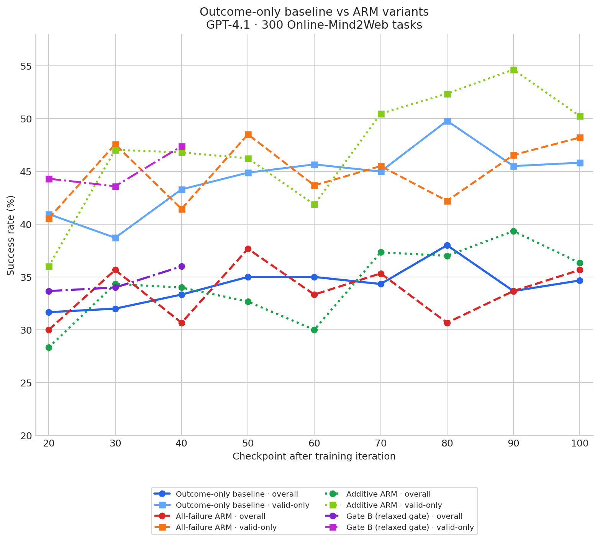

# Action Reward Model integration: methods and results

This is the concise collaborator summary. Detailed configs, provenance, and
run history are in [ARM_RESULTS.md](ARM_RESULTS.md) and
[ARM_INTEGRATION_PLAN.md](ARM_INTEGRATION_PLAN.md).

## 1. Inference-time ARM selection

**Method.** For state (s_t), sample five actor responses (a_{t,1:5}). ScalarRM
scores each response independently; SelectionARM compares the candidates using
the full reasoning, action, and browser state. Execute

$$
a_t^* = \arg\max_i \mathrm{ARM}(s_t,a_{t,i}),
$$

while the baseline executes one actor sample. Results reproduce the Action
Reward Models setup with the o4-mini/AgentTrek Online-Mind2Web judge.

| Policy | Successes / 300 | Valid | Invalid | Overall | Valid-only |
| --- | ---: | ---: | ---: | ---: | ---: |
| Baseline, one sample | 90 | 267 | 33 | 30.0% | 33.7% |
| ScalarRM, five candidates | 114 | 251 | 49 | 38.0% | 45.4% |
| SelectionARM, five candidates | 128 | 256 | 44 | **42.7%** | **50.0%** |

- **Baseline:** execute one actor sample without an ARM call.
- **ScalarRM:** score each of five candidates independently and execute the candidate with the highest scalar score.
- **SelectionARM:** compare the five candidates jointly using full state, reasoning, and action context, then execute the selected candidate.

**Conclusion:** ARM provides a large inference-time gain, with SelectionARM
stronger than ScalarRM. This requires five-way sampling and selection at every
turn, so it increases inference cost.

## 2. Offline filtered SFT and preference learning

**Method.** Retain ARM-selected trajectories and action/turn examples, then
train the actor offline. SFT minimizes token cross-entropy,

$$
\mathcal L_{\mathrm{SFT}}=-\sum_t\log \pi_\theta(y_t\mid x,y_{<t}).
$$

C2 is the original filtered recipe; 1A increases the effective batch size. The
joint-data runs add Piotr's ARM data. DPO uses preferred/rejected responses:

$$
\mathcal L_{\mathrm{DPO}}=-\log\sigma\!\left(\beta\left[\log\frac{\pi_\theta(y^+|x)}{\pi_{\rm ref}(y^+|x)}-\log\frac{\pi_\theta(y^-|x)}{\pi_{\rm ref}(y^-|x)}\right]\right).
$$

| Training recipe | Evaluation | Successes / 300 | Valid-only | Relative headline |
| --- | --- | ---: | ---: | --- |
| Starting actor reference | Full 300 | 90 | 33.7% | Baseline |
| C2 filtered SFT | Combined 300 | 95 | 36.8% | Control for 1A |
| 1A filtered SFT | Combined 300 | 100 | 39.1% | +1.7 pp vs C2 |
| Joint C2 + Piotr SFT | Fresh 300 | 102 | 37.8% | +4.0 pp vs starting actor |
| Joint C2 + Piotr DPO | Fresh 300 | **104** | **40.9%** | +4.7 pp vs starting actor |

- **Starting actor:** unmodified OpenWebRL-SFT policy used as the training and evaluation reference.
- **C2 filtered SFT:** retain every usable executed ARM-selected turn from a valid successful trajectory; train the chosen reasoning-plus-action response with language-only LoRA (rank 16, alpha 32, dropout 0.05), AdamW at `1e-5`, effective batch 16, cosine decay, 3% warmup, and two epochs.
- **1A filtered SFT:** use the same 8,394-turn C2 dataset and LoRA/optimizer settings, but microbatch 1 with accumulation 32 (effective batch 32) and one pass (263 updates); this isolates optimizer/exposure from the original effective batch 16 recipe.
- **Joint C2 + Piotr SFT:** concatenate 3,464 C2 and 2,076 Piotr retained states and apply the same full-response SFT objective for one pass.
- **Joint C2 + Piotr DPO:** use the same chosen/rejected pairs and frozen starting actor as reference, with full-response DPO, `beta=0.1`, and no auxiliary SFT term.

**Conclusion:** Offline training transfers only modestly compared with the
inference-time selector. DPO is the best measured endpoint, but its advantage
over joint SFT is small and not statistically significant in the paired audit.

## 3. Online RL with ARM turn-level bonuses

SelectionARM labels the **executed response plus four alternative actor
responses from the same state**, using full reasoning and action context.
For a usable labeled turn ($m_{i,t}=1$), add a centered bonus to the normalized
terminal-outcome advantage $A_i$:

$$
A'_{i,t}=A_i+b_{i,t},\qquad
b_{i,t}=\beta m_{i,t}\left(\mathbf{1}[j_{i,t}=0]-\frac{1}{5}\right).
$$

Candidate 0 is the executed response. With **β = 0.5**, its bonus is **+0.4** if
selected and **−0.1** otherwise; unlabeled turns receive zero. Attempt labels
on **q = 20%** of turns, requiring five valid, distinct actions in the original
variants. These values retain the validated K = 5 setup and calibrated bonus
RMS near 6% of the outcome advantage. Shared optimization: **48 groups,
batch 256, 2 PPO epochs, LR 1e−6**. PPO trains the full executed
reasoning-and-action response.

- **Outcome-only baseline:** normalized terminal rewards only; no ARM bonus.
- **Original bonus:** apply $A'$ within the 48 ordinary mixed-outcome groups.
- **All-failure bonus:** also admit groups of five valid actor failures with at
  least one usable ARM label, within the same 48-group quota; these groups
  replace mixed-group slots. Their outcome advantage is zero, so only $b$
  supplies a training signal. A usable label may favor either the executed
  response or an alternative.
- **Additive bonus:** keep all 48 mixed groups and add up to 8 eligible failure
  groups. Their separate clipped-PPO loss uses advantage $b$, averages over
  **all** retained failure turns (including unlabeled ones), and is weighted
  by $N_f/48$, where $N_f$ is the number of added groups.
- **B — relaxed gate:** additive recipe, but require at least two distinct
  actions among five valid candidates; keep response-index credit unchanged.
- **C — relaxed gate + action credit:** B's gate, with
  $b=\beta m(\mathbf{1}[a_j\equiv a_0]-n(a_0)/5)$, where $n(a_0)$ counts
  candidates equivalent to the executed action. Selecting any equivalent
  candidate earns the same credit.

**Evaluation:** local browser, GPT-4.1 action-history judge, temperature 0.
Rates are **overall / valid-only**; “—” means unavailable. Historical evaluations
are the default; dates and valid-task sets differ, so differences are descriptive.

| Method | Iteration | Fixed-100 overall / valid-only | Full-300 overall / valid-only |
| --- | ---: | --- | --- |
| **Outcome-only baseline** | 20 (historical) | 25.0% / 35.21% | **31.67% / 40.95%** |
|  | 20 (same-day control) | — | **29.00% / 36.86%** |
|  | 30 | — | 32.00% / 38.71% |
|  | 40 | — | 33.33% / 43.29% |
|  | 50 | — | 35.00% / 44.87% |
|  | 60 | — | 35.00% / 45.65% |
|  | 70 | — | 34.33% / 44.98% |
|  | 80 | — | 38.00% / 49.78% |
|  | 90 | — | 33.67% / 45.50% |
|  | 100 | 37.00% / 54.41% | **34.67% / 45.81%** |
| **Original bonus** | 20 | 26.0% / 35.62% | — |
|  | 30 | 27.0% / 36.49% | — |
|  | 40 | **31.00% / 44.93%** | — |
|  | 51 | — | 34.00% / 45.74% |
|  | 70 | — | 34.33% / 44.59% |
|  | 80 | — | 33.33% / 45.05% |
| **All-failure bonus** | 20 | 28.0% / 40.00% | 30.00% / 40.54% |
|  | 30 | 36.0% / 49.32% | 35.67% / 47.56% |
|  | 40 | 28.0% / 39.44% | 30.67% / 41.44% |
|  | 50 | — | 37.67% / 48.50% |
|  | 60 | — | 33.33% / 43.67% |
|  | 70 | — | 35.33% / 45.49% |
|  | 80 | — | 30.67% / 42.20% |
|  | 90 | — | **33.67% / 46.54%** |
|  | 100 | 26.00% / 39.39% | **35.67% / 48.20%** |
| **Additive bonus** | 20 | 24.0% / 31.17% | 28.33% / 36.02% |
|  | 30 | 30.0% / 44.12% | 34.33% / 47.03% |
|  | 40 | 30.0% / 44.12% | 34.00% / 46.79% |
|  | 50 | — | 32.67% / 46.23% |
|  | 60 | — | 30.00% / 41.86% |
|  | 70 | — | 37.33% / 50.45% |
|  | 80 | — | 37.00% / 52.36% |
|  | 90 | — | **39.33% / 54.63%** |
|  | 100 | 31.00% / 47.69% | **36.33% / 50.23%** |
| **B: relaxed gate** | 20 | 29.00% / 42.03% | 33.67% / 44.30% |
|  | 30 | 29.00% / 39.19% | 34.00% / 43.59% |
|  | 40 | 38.00% / 52.78% | **36.00% / 47.37%** |
| **C: relaxed gate + action credit** | 20 | 38.00% / 48.10% | 36.67% / 44.53% |

Additive iteration 90 reaches **39.33% overall**, versus **33.67%** for the
historical baseline at iteration 90. At iteration 100, additive is **36.33%**
versus the [completed baseline](RL_EVALUATION.md#baseline-iter100-results-20260924) at **34.67%**
overall (+1.67 pp); evaluation dates and valid-task sets differ.
A consistent gain over outcome-only RL is not yet established.

[Detailed analysis, coverage audits, examples and provenance](ARM_RESULTS.md#arm-online-rl-analysis-20260922)
· [Evaluation records](RL_EVALUATION.md#arm-iteration-19-evaluations-20260915).

## Overall takeaway

ARM's strongest validated use is **inference-time candidate selection**. Offline
distillation and the first online turn-bonus integrations have not yet matched
that gain.
