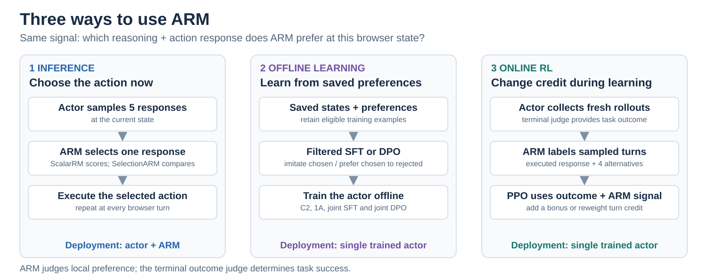
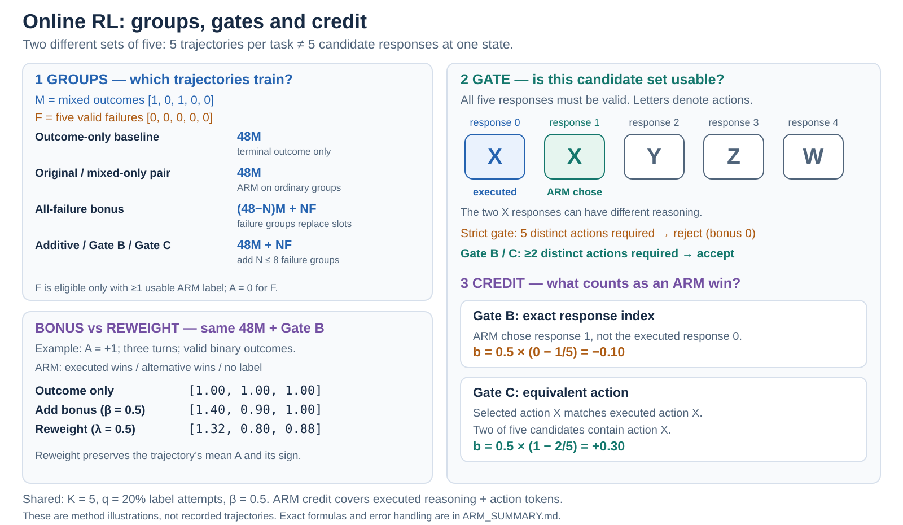
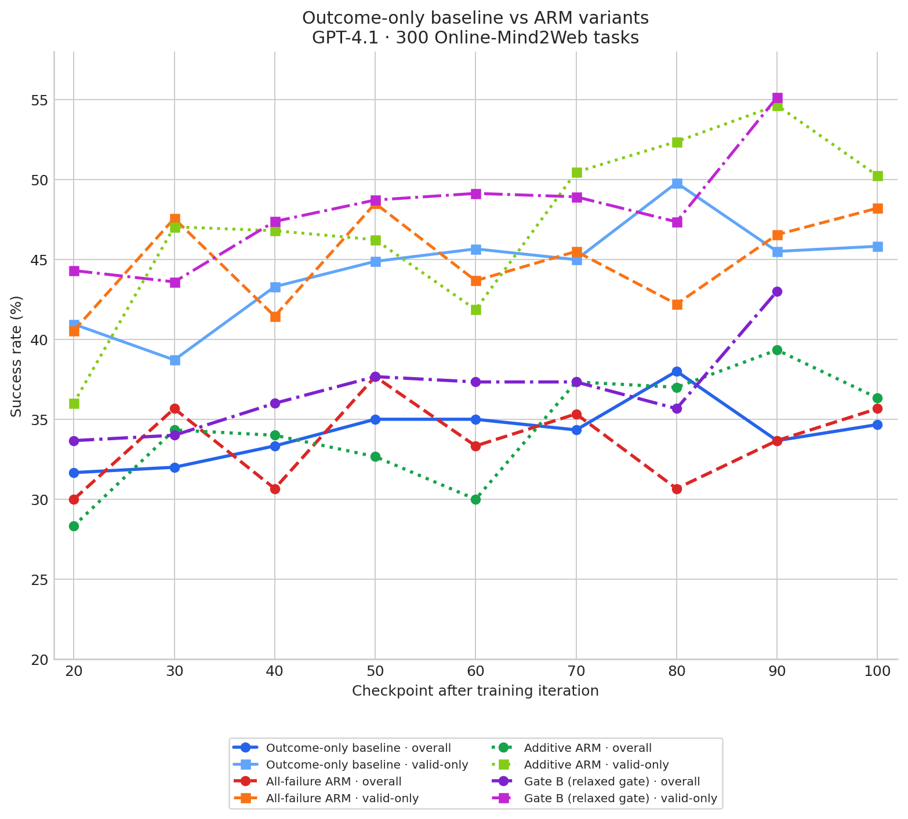

# Action Reward Model integration: methods and results

This is the concise collaborator summary. Detailed configs, provenance, and
run history are in [ARM_RESULTS.md](ARM_RESULTS.md) and
[ARM_INTEGRATION_PLAN.md](ARM_INTEGRATION_PLAN.md).

<a id="arm-methods-at-a-glance"></a>


Slide figures: **three stages** ([PNG](arm_results/methods/arm_three_stages.png) / [SVG](arm_results/methods/arm_three_stages.svg)) ·
**RL method differences** ([PNG](arm_results/methods/arm_rl_method_choices.png) / [SVG](arm_results/methods/arm_rl_method_choices.svg)).

## 1. Inference-time ARM selection

**Method.** At browser state `s`, sample five responses `x₀,…,x₄`, each containing
**reasoning + action**. ScalarRM scores independently; SelectionARM compares
jointly:

```text
ScalarRM:     j = argmaxᵢ score(s, xᵢ)
SelectionARM: j = select(s, [x₀, …, x₄])
Execute the action in xⱼ.
```

The baseline executes one actor sample. Results reproduce the Action
Reward Models setup with the o4-mini/AgentTrek Online-Mind2Web judge.

| Policy | Successes / 300 | Valid | Invalid | Overall | Valid-only |
| --- | ---: | ---: | ---: | ---: | ---: |
| Baseline, one sample | 90 | 267 | 33 | 30.0% | 33.7% |
| ScalarRM, five candidates | 114 | 251 | 49 | 38.0% | 45.4% |
| SelectionARM, five candidates | 128 | 256 | 44 | **42.7%** | **50.0%** |

- **Baseline:** execute one actor sample without an ARM call.
- **ScalarRM:** score each of five candidates independently and execute the candidate with the highest scalar score.
- **SelectionARM:** compare the five candidates jointly using full state, reasoning, and action context, then execute the selected candidate.

**Conclusion:** ARM provides a large inference-time gain, with SelectionARM
stronger than ScalarRM. This requires five-way sampling and selection at every
turn, so it increases inference cost.

## 2. Offline filtered SFT and preference learning

**Method.** Retain ARM-selected trajectories and action/turn examples, then
train the actor offline. SFT minimizes token cross-entropy,

$$
\mathcal L_{\mathrm{SFT}}=-\sum_t\log \pi_\theta(y_t\mid x,y_{<t}).
$$

**Recipe map:** `C2 → 1A` keeps the same8,394 turns but changes **batch16→32 and
passes2→1**. The joint recipes use a separately filtered set:
`J = 3,464 C2 states + 2,076 Piotr states`. **SFT imitates the chosen response;
DPO increases its preference over the rejected response**, relative to the
frozen starting actor:

$$
\mathcal L_{\mathrm{DPO}}=-\log\sigma\!\left(\beta_{\mathrm{DPO}}\left[\log\frac{\pi_\theta(y^+|x)}{\pi_{\rm ref}(y^+|x)}-\log\frac{\pi_\theta(y^-|x)}{\pi_{\rm ref}(y^-|x)}\right]\right).
$$

| Training recipe | Evaluation | Successes / 300 | Valid-only | Relative headline |
| --- | --- | ---: | ---: | --- |
| Starting actor reference | Full 300 | 90 | 33.7% | Baseline |
| C2 filtered SFT | Combined 300 | 95 | 36.8% | Control for 1A |
| 1A filtered SFT | Combined 300 | 100 | 39.1% | +1.7 pp vs C2 |
| Joint C2 + Piotr SFT | Fresh 300 | 102 | 37.8% | +4.0 pp vs starting actor |
| Joint C2 + Piotr DPO | Fresh 300 | **104** | **40.9%** | +4.7 pp vs starting actor |

- **Starting actor:** unmodified OpenWebRL-SFT policy used as the training and evaluation reference.
- **C2 filtered SFT:** retain every usable executed ARM-selected turn from a valid successful trajectory; train the chosen reasoning-plus-action response with language-only LoRA (rank 16, alpha 32, dropout 0.05), AdamW at `1e-5`, effective batch 16, cosine decay, 3% warmup, and two epochs.
- **1A filtered SFT:** use the same 8,394-turn C2 dataset and LoRA/optimizer settings, but microbatch 1 with accumulation 32 (effective batch 32) and one pass (263 updates); this isolates optimizer/exposure from the original effective batch 16 recipe.
- **Joint C2 + Piotr SFT:** concatenate 3,464 C2 and 2,076 Piotr retained states and apply the same full-response SFT objective for one pass.
- **Joint C2 + Piotr DPO:** use the same chosen/rejected pairs and frozen starting actor as reference, with full-response DPO, `beta=0.1`, and no auxiliary SFT term.

**Conclusion:** Offline training transfers only modestly compared with the
inference-time selector. DPO is the best measured endpoint, but its advantage
over joint SFT is small and not statistically significant in the paired audit.

## 3. Online RL with ARM turn-level bonuses

**Notation:** one **group** contains five trajectories for one task.
`M` = an ordinary group with varying outcomes, e.g. `[1,0,1,0,0]`;
`F` = five **valid failures**, `[0,0,0,0,0]`. An admitted `F` needs at least one
usable ARM label, which may prefer the executed response **or** an alternative.
`A` is the group-normalized terminal-outcome advantage; every turn in a
trajectory starts with the same `A`. For `F`, `A=0`.

SelectionARM labels the **executed response plus four alternative actor
responses from the same state**, using full reasoning and action context.
These five candidates are different from the five trajectories in a group.
`D` counts distinct candidate actions; all five candidates must be valid.
`m=1` means the turn was sampled, passed the gate and received a usable label.
For a usable labeled turn ($m_{i,t}=1$), add a centered bonus to the normalized
terminal-outcome advantage $A_i$:

$$
A'_{i,t}=A_i+b_{i,t},\qquad
b_{i,t}=\beta m_{i,t}\left(\mathbf{1}[j_{i,t}=0]-\frac{1}{5}\right).
$$

Candidate 0 is the executed response. With **β = 0.5**, its bonus is **+0.4** if
selected and **−0.1** otherwise; unlabeled turns receive zero. Attempt labels
on **q = 20%** of turns, requiring five valid, distinct actions in the original
variants. These values retain the validated K = 5 setup and calibrated bonus
RMS near 6% of the outcome advantage. Shared optimization: **base quota48 groups,
batch 256, 2 PPO epochs, LR 1e−6**; additive methods append up to8 failure groups.
PPO trains the full executed
reasoning-and-action response.

<a id="arm-rl-method-guide"></a>


- **Outcome-only baseline:** `48M; A`. Terminal outcomes supply all credit.
- **Original bonus:** `48M; D=5; A+b`. Same groups, plus turn-level ARM credit.
- **All-failure bonus:** `(48−N)M + NF; D=5`. Failure groups **replace** ordinary
  slots; use `A+b` for `M` and `b` for `F` in the same main PPO batch.
- **Additive bonus:** `48M + NF, N≤8; D=5`. Failure groups are **extra**;
  ordinary groups use `A+b`, and a separate failure PPO loss uses `b`.
  Its coefficient is `N/48`, averaging over **all** retained failure turns,
  including unlabeled ones.
- **B — relaxed gate:** `Additive + D≥2`. Allow duplicate actions, but credit
  only selection of the **exact executed response**; keep the same `b` formula.
- **C — relaxed gate + action credit:** `B + equivalent-action credit`, with
  $b=\beta m(\mathbf{1}[a_j\equiv a_0]-n(a_0)/5)$, where $n(a_0)$ counts
  candidates equivalent to the executed action. Selecting another response
  with that action earns credit, even if its reasoning differs.
- **Mixed-only bonus + relaxed B:** `48M; D≥2; A+b`. Fresh original-bonus control
  with the relaxed gate; zero extra `F` groups.
- **Mixed-only reweight + relaxed B:** `48M; D≥2; A×w`. Use the same ARM labels
  to redistribute each trajectory's existing advantage across turns, preserving
  its mean and sign. Formula and example below; zero extra `F` groups.
- **Failure β = 1:** `Additive + β_F:0.5→1`. Only the failure bonus is stronger;
  `β_M=0.5`, both `q=20%`, strict gate and response-index credit stay fixed.
- **Failure sampling40%:** `Additive + q_F:20%→40%`. Only failure turns are
  sampled more often; `q_M=20%`, both `β=0.5`, strict gate and response-index
  credit stay fixed.
  [Stopped at27; latest evaluation20 and coverage audit](ARM_RESULTS.md#arm-failure-sampling40-stop-20260927).

**Reweighting, exactly:** `u=m×(1[j=0]−1/5)`,
`vₜ=exp(λ×sign(A)×uₜ)`, `wₜ=vₜ/mean_trainable_turns(v)`, **λ=0.5**.
Preferred turns receive more positive credit when `A>0`, or a smaller penalty
when `A<0`; `A=0` remains zero. Unlabeled turns can change through the denominator.
Native error-sentinel groups (outcome `−1`) fall back to `A+b`; the `M/F` examples
above illustrate binary outcomes. [Exact implementation](ARM_INTEGRATION_PLAN.md#arm-outcome-aware-reweighting-20260926).

**Evaluation:** local browser, GPT-4.1 action-history judge, temperature 0.
Rates are **overall / valid-only**; “—” means unavailable. Historical evaluations
are the default; dates and valid-task sets differ, so differences are descriptive.

| Method | Iteration | Fixed-100 overall / valid-only | Full-300 overall / valid-only |
| --- | ---: | --- | --- |
| **Outcome-only baseline** | 10 (historical) | — |23.33% /29.91% |
|  | 20 (historical) | 25.0% / 35.21% | **31.67% / 40.95%** |
|  | 20 (same-day control) | — | **29.00% / 36.86%** |
|  | 30 | — | 32.00% / 38.71% |
|  | 40 | — | 33.33% / 43.29% |
|  | 50 | — | 35.00% / 44.87% |
|  | 60 | — | 35.00% / 45.65% |
|  | 70 | — | 34.33% / 44.98% |
|  | 80 | — | 38.00% / 49.78% |
|  | 90 | — | 33.67% / 45.50% |
|  | 100 | 37.00% / 54.41% | **34.67% / 45.81%** |
| **Original bonus** | 20 | 26.0% / 35.62% | 28.00% / 37.00% |
|  | 30 | 27.0% / 36.49% | 32.67% / 43.56% |
|  | 40 | **31.00% / 44.93%** | 32.00% / 42.86% |
|  | 50 | 32.00% / 44.44% | 34.00% / 43.22% |
|  | 51 | — | 34.00% / 45.74% |
|  | 60 | 34.00% / 46.58% | 35.67% / 45.73% |
|  | 70 | — | 34.33% / 44.59% |
|  | 80 | — | 33.33% / 45.05% |
| **All-failure bonus** | 20 | 28.0% / 40.00% | 30.00% / 40.54% |
|  | 30 | 36.0% / 49.32% | 35.67% / 47.56% |
|  | 40 | 28.0% / 39.44% | 30.67% / 41.44% |
|  | 50 | — | 37.67% / 48.50% |
|  | 60 | — | 33.33% / 43.67% |
|  | 70 | — | 35.33% / 45.49% |
|  | 80 | — | 30.67% / 42.20% |
|  | 90 | — | **33.67% / 46.54%** |
|  | 100 | 26.00% / 39.39% | **35.67% / 48.20%** |
| **Additive bonus** | 20 | 24.0% / 31.17% | 28.33% / 36.02% |
|  | 30 | 30.0% / 44.12% | 34.33% / 47.03% |
|  | 40 | 30.0% / 44.12% | 34.00% / 46.79% |
|  | 50 | — | 32.67% / 46.23% |
|  | 60 | — | 30.00% / 41.86% |
|  | 70 | — | 37.33% / 50.45% |
|  | 80 | — | 37.00% / 52.36% |
|  | 90 | — | **39.33% / 54.63%** |
|  | 100 | 31.00% / 47.69% | **36.33% / 50.23%** |
| **B: relaxed gate** | 20 | 29.00% / 42.03% | 33.67% / 44.30% |
|  | 30 | 29.00% / 39.19% | 34.00% / 43.59% |
|  | 40 | 38.00% / 52.78% | **36.00% / 47.37%** |
|  | 50 | 33.00% / 45.21% | **37.67% / 48.71%** |
|  | 60 | 35.00% / 49.30% | **37.33% / 49.12%** |
|  | 70 | 35.00% / 50.00% | **37.33% / 48.91%** |
|  | 80 | 34.00% / 47.89% | **35.67% / 47.35%** |
|  | 90 | 39.00% / 54.93% | **43.00% / 55.13%** |
|  | 100 | 30.00% / 44.12% | **36.67% / 48.89%** |
| **C: relaxed gate + action credit** | 20 | 38.00% / 48.10% | 36.67% / 44.53% |
|  | 30 | 28.00% / 38.89% | 30.67% / 39.66% |
|  | 40 | 31.00% / 43.06% | **33.33% / 45.05%** |
|  | 50 | 31.00% / 41.33% | 33.67% / 43.53% |
|  | 60 | 30.00% / 41.10% | **32.67% / 43.17%** |
| **Failure β = 1** | 10 | 27.00% / 35.53% | 27.33% / 33.74% |
|  | 20 | 32.00% / 42.11% | **33.00% / 41.77%** |
| **Failure sampling40%** | 10 | 32.00% / 42.11% | **29.00% / 37.34%** |
|  | 20 | 26.00% / 38.24% | **27.67% / 37.39%** |
| **Mixed-only bonus + relaxed B** |10 |31.00% /41.33% |**30.67% /39.32%** |
|  |20 |30.00% /43.48% |**30.67% /40.89%** |
|  |30 |29.00% /39.19% |**32.00% /42.11%** |
|  |40 |32.00% /43.84% |**33.33% /43.86%** |
|  |50 |35.00% /48.61% |**38.67% /49.57%** |
|  |60 |41.00% /54.67% |**37.67% /48.71%** |
|  |70 |44.00% /57.14% |**38.33% /48.94%** |
|  |80 |35.00% /50.72% |**36.00% /48.87%** |
|  |90 |38.00% /51.35% |**40.67% /52.36%** |
| **Mixed-only reweight + relaxed B** |10 |25.00% /34.72% |**27.33% /34.17%** |
|  |20 |31.00% /44.29% |**32.33% /42.73%** |
|  |30 |28.00% /43.75% |**30.00% /41.10%** |
|  |40 |33.00% /50.00% |**35.33% /47.11%** |
|  |50 |33.00% /45.21% |**37.00% /46.84%** |
|  |60 |34.00% /44.74% |**36.67% /47.21%** |
|  |70 |38.00% /50.00% |**38.67% /49.57%** |
|  |80 |37.00% /49.33% |**39.33% /51.08%** |
|  |90 |39.00% /51.32% |**37.67% /49.78%** |

Both runs completed60 and all six full300 evaluations. Their40/50/60 averages
are36.56% /47.38% for bonus and36.33% /47.05% for reweight (overall/valid-only):
only0.22pp apart overall; these are checkpoint averages, not independent seeds.
Both lineages are
[approved through90](ARM_INTEGRATION_PLAN.md#arm-mixed-pair-to90-20260930),
with full300 evaluations at70/80/90 and unchanged training settings. Both70
and80 evaluations are verified. Both90 evaluations are now independently verified: bonus
40.67% /52.36% and reweight37.67% /49.78% overall/valid-only.
[Bonus70 audit](arm_results/rl_integration/mixed-bonus-iteration70-audit.json) ·
[Reweight70 audit](arm_results/rl_integration/mixed-reweight-iteration70-audit.json).
[Bonus80 audit](arm_results/rl_integration/mixed-bonus-iteration80-audit.json) ·
[Reweight80 audit](arm_results/rl_integration/mixed-reweight-iteration80-audit.json).
[Bonus90 audit](arm_results/rl_integration/mixed-bonus-iteration90-audit.json) ·
[Reweight90 audit](arm_results/rl_integration/mixed-reweight-iteration90-audit.json).
[Audits and comparison limits](ARM_RESULTS.md#arm-mixed-pair-iter60-results-20260930).

Original-bonus full300 at20/30/50/60 was evaluated September27;40 combines
the saved historical100 with a new disjoint200. Earlier fixed100 values at20/30
remain historical. [Backfill audit](RL_EVALUATION.md#arm-original-backfill-results-20260927).

**Evolving ARM (offline forward transfer):** refresh SelectionARM on2,000
GPT-5.5-labeled actor40 states +858 replay examples; test the fixed final90-update
ARM on actor90 candidates. Teacher action agreement improves **57.68%→59.57%**
(+1.89pp; paired95% CI0.00–3.93pp), with retention−1.50pp. This is not task
success; teacher action consistency is58% under reversed-order re-query.
[Method, table and caveats](ARM_RESULTS.md#arm-offline-forward-transfer-results-20260925).

<a id="baseline-comparison"></a>


[**Interactive local-browser comparison: toggle runs and overall / valid-only rates**](rl_results/arm_rl_interactive.html).
Both mixed-only curves include iterations10–90 and are visible by default; use **Mixed-only pair** to compare them with the outcome-only baseline.
Download the HTML and open it in a browser; it works offline. GitHub shows its source
rather than running it. Includes Gate C, the mixed-only pair and optional ablations;
original bonus starts hidden. The y-axis is fixed at0–60%. Smoothing is off by
default; choose bias-corrected W&B EMA or centered Gaussian (σ in training iterations).
Faint raw traces, tooltips and exports retain the measured values.
[Algorithms](https://docs.wandb.ai/models/app/features/panels/line-plot/smoothing);
the exact smoothing settings of OpenWebRL Figure2(c) are unverified. Stealth results
remain separate below.

**Matched stealth, three evaluations per iteration90 checkpoint — September29–30.**
Same300 tasks, actor-only inference; o4-mini/AgentTrek, T0.6/p0.95/k20,
4096 tokens and30 turns.

| Method | Iteration | Full300 overall mean ± SD | Valid-only mean ± SD | Overall Δ vs baseline | Valid denominators, repeats1/2/3 |
| --- | ---: | --- | --- | ---: | --- |
| Outcome-only baseline |90 |**55.22 ± 2.14%** |57.65 ± 1.77% |+0.00 pp |286/290/286 |
| Additive bonus |90 |**58.44 ± 1.35%** |61.45 ± 1.19% |+3.22 pp |286/286/284 |
| Gate B: relaxed gate |90 |**58.78 ± 3.89%** |61.36 ± 3.88% |+3.56 pp |286/288/288 |

Mean ± sample SD describes repeated evaluation of fixed trained checkpoints,
not training-seed variability. Valid-only means average the three per-repeat
rates. Repeat1 retains pre-outage outcomes and retries only credit-blocked tasks;
repeats2/3 use fresh rollouts. [All nine audits and aggregate](ARM_RESULTS.md#arm-stealth90-o4-three-repeat-summary-20260930).

<details>
<summary><strong>Significance tests and 95% confidence intervals</strong></summary>

**Paired uncertainty:** no pair is significant at 5% after correcting the three
comparisons (Holm p=0.220 for either ARM versus baseline; 0.910 for Gate B versus
Additive). The 95% intervals below resample 300 tasks, keeping each task’s three
repeats together; they do not measure training-seed variability.


[Exact tests, sensitivity checks and limitations](ARM_RESULTS.md#arm-stealth90-paired-inference-20260930)
· [Slide-ready SVG](arm_results/rl_integration/stealth-iteration90-confidence.svg).

</details>

The earlier training-curve plot retains the first matched pass. Diamonds use this corrected
protocol. Earlier GPT-4.1/T0 ARM cohorts remain [separate history](ARM_RESULTS.md#arm-stealth90-results-20260929).

Gate B iteration 90 reaches **43.00% overall**, versus **33.67%** for the
historical baseline and **39.33%** for additive at the same iteration. This is
Gate B's best evaluated local-browser checkpoint so far; dates and valid-task sets differ,
so a consistent gain over outcome-only RL is not yet established.
[Counts and audit](RL_EVALUATION.md#arm-gate-b-iter90-results-20260928). Iteration100 finishes at **36.67% /48.89%**, below90 and2.00pp above historical baseline100 overall. [Iteration100 audit](RL_EVALUATION.md#arm-gate-b-iter100-results-20260929).

<a id="arm-failure-sampling-history"></a>
<a id="all-failure-arm-full-300-curve"></a>
[Detailed analysis, coverage audits, examples and provenance](ARM_RESULTS.md#arm-online-rl-analysis-20260922)
· [Evaluation records](RL_EVALUATION.md#arm-iteration-19-evaluations-20260915).

<a id="om2w-difficulty-breakdown"></a>

**OM2W difficulty breakdown: iteration90, three stealth evaluations.**

Mean **overall / valid-only** success rates, using human reference steps:
easy 1–5, medium 6–10, hard 11+. **Bold** marks the largest gain over the
outcome-only baseline within each difficulty split, for both metrics.

| Method | Easy (80 tasks) | Medium (141 tasks) | Hard (79 tasks) |
| --- | ---: | ---: | ---: |
| Outcome-only baseline | 70.00% / 72.11% | 55.79% / 58.49% | 39.24% / 41.14% |
| Additive | **74.58% / 75.86%** | 56.74% / 60.92% | **45.15% / 47.37%** |
| Gate B | 67.92% / 69.64% | **62.65% / 65.73%** | 42.62% / 44.92% |

Largest **overall** gains: **Gate B · medium +6.86 pp**;
**Additive · hard +5.91 pp**.

Two stale medium labels have reference lengths 11/12 and are classified as hard
for this analysis; saved labels remain preserved. These are descriptive gains,
with no significance claim.
[SD, valid denominators, label audit and per-task verdicts](ARM_RESULTS.md#arm-stealth90-difficulty-20260930).


<details>
<summary><strong>WebVoyager evaluation · iteration 90 · full 595</strong></summary>

**WebVoyager, iteration90 — September30:** stealth, actor T0.6, GPT-4o/WebVoyager,
all595 tasks; one evaluation per fixed checkpoint.

| Method | Overall | Valid-only (valid denominator) |
| --- | ---: | ---: |
| Outcome-only baseline |66.89% |68.27% (583) |
| Additive ARM |64.37% |65.03% (589) |
| Gate B |67.06% |67.86% (588) |

Gate B is effectively tied with baseline on this pass; Additive is lower.
The53 date-updated instructions limit exact comparison with paper scores.
[Audited results and protocol](ARM_RESULTS.md#arm-webvoyager90-results-20260930).

</details>

## Overall takeaway

ARM's strongest validated use is **inference-time candidate selection**. Offline
distillation and the first online turn-bonus integrations have not yet matched
that gain.
